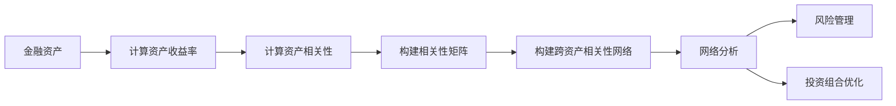

# 金融市场跨资产相关性网络分析与应用

> 关键词：金融市场、跨资产相关性、网络分析、复杂网络、风险管理、投资组合优化、市场预测

> 摘要：本文聚焦于金融市场跨资产相关性网络分析与应用。在金融市场日益复杂的背景下，理解不同资产间的相关性对于投资者、金融机构和监管者都具有重要意义。文章首先介绍了相关的背景知识，包括目的、预期读者等内容。接着阐述了核心概念与联系，通过文本示意图和 Mermaid 流程图展示其架构。详细讲解了核心算法原理，并用 Python 源代码进行说明。同时给出了相关的数学模型和公式，并举例解释。通过项目实战，展示了代码的实际案例和详细解读。探讨了跨资产相关性网络分析在风险管理、投资组合优化等实际应用场景。最后推荐了学习资源、开发工具框架以及相关论文著作，总结了未来发展趋势与挑战，并提供了常见问题解答和扩展阅读参考资料，旨在为读者全面深入地了解金融市场跨资产相关性网络分析与应用提供有价值的信息。

## 1. 背景介绍 
### 1.1 目的和范围
在当今全球化的金融市场中，资产种类繁多且相互关联。不同资产之间的相关性不仅反映了市场的内在结构，还对投资决策、风险管理和市场监管产生着深远的影响。本研究的目的在于深入分析金融市场中跨资产的相关性，并构建相应的网络模型，以揭示市场的复杂结构和动态变化。研究范围涵盖了股票、债券、期货、外汇等多种金融资产，通过对历史数据的挖掘和分析，探索资产之间的相关性模式和规律。

### 1.2 预期读者
本文的预期读者包括金融从业者，如投资经理、交易员、风险管理专家等，他们可以从跨资产相关性网络分析中获取有价值的信息，优化投资组合和管理风险。同时，对于金融研究人员和学者，本文提供了一种新的研究视角和方法，有助于深入理解金融市场的复杂性。此外，对金融市场感兴趣的学生和爱好者也可以通过本文了解相关的理论和实践知识。

### 1.3 文档结构概述
本文将按照以下结构展开：首先介绍相关的背景知识，包括目的、预期读者和文档结构概述等内容。接着阐述核心概念与联系，通过文本示意图和 Mermaid 流程图展示其架构。详细讲解核心算法原理，并用 Python 源代码进行说明。同时给出相关的数学模型和公式，并举例解释。通过项目实战，展示代码的实际案例和详细解读。探讨跨资产相关性网络分析在风险管理、投资组合优化等实际应用场景。最后推荐学习资源、开发工具框架以及相关论文著作，总结未来发展趋势与挑战，并提供常见问题解答和扩展阅读参考资料。

### 1.4 术语表
#### 1.4.1 核心术语定义
- **跨资产相关性**：指不同类型金融资产之间的关联程度，通常用相关系数等统计指标来衡量。
- **网络分析**：是一种研究复杂系统中个体之间关系的方法，通过构建网络模型来分析节点之间的连接和交互。
- **复杂网络**：由大量节点和连接组成的网络，具有复杂的拓扑结构和动态行为。
- **风险管理**：识别、评估和应对风险的过程，旨在降低风险对金融机构和投资者的影响。
- **投资组合优化**：通过合理配置资产，在风险和收益之间寻求平衡，以实现投资目标的过程。

#### 1.4.2 相关概念解释
- **资产收益率**：指资产在一定时期内的增值或贬值程度，通常用百分比表示。
- **相关系数**：是衡量两个变量之间线性关系强度的统计指标，取值范围在 -1 到 1 之间。
- **节点**：在网络分析中，代表网络中的个体或实体，如金融资产。
- **边**：连接节点的线，表示节点之间的关系，如资产之间的相关性。

#### 1.4.3 缩略词列表
- **VAR**：Value at Risk，风险价值，是一种常用的风险管理工具。
- **CAPM**：Capital Asset Pricing Model，资本资产定价模型，用于描述资产预期收益率与风险之间的关系。
- **ETF**：Exchange - Traded Fund，交易型开放式指数基金。

## 2. 核心概念与联系 
### 2.1 跨资产相关性网络的基本概念
跨资产相关性网络是一种将不同金融资产作为节点，资产之间的相关性作为边的复杂网络。通过构建这样的网络，我们可以直观地观察到资产之间的关联结构和相互影响。例如，在股票市场中，不同行业的股票可能具有不同程度的相关性，而在全球金融市场中，股票、债券、外汇等资产之间也存在着复杂的关联。

### 2.2 网络分析的基本原理
网络分析主要关注网络的拓扑结构和节点之间的连接模式。常见的网络拓扑结构包括随机网络、小世界网络和无标度网络等。在跨资产相关性网络中，我们可以通过计算网络的度中心性、聚类系数、介数中心性等指标来分析资产的重要性和网络的结构特征。

### 2.3 核心概念的联系
跨资产相关性是构建网络的基础，通过计算资产之间的相关性，我们可以确定网络中边的权重。网络分析则为我们提供了一种工具，用于深入理解跨资产相关性的结构和动态变化。风险管理和投资组合优化则是跨资产相关性网络分析的重要应用领域，通过对网络的分析，我们可以更好地识别和管理风险，优化投资组合。

### 2.4 文本示意图
跨资产相关性网络的构建过程可以用以下文本示意图表示：

金融资产（股票、债券、期货、外汇等） -> 计算资产收益率 -> 计算资产之间的相关性（相关系数等） -> 构建相关性矩阵 -> 构建跨资产相关性网络（节点为资产，边为相关性） -> 网络分析（计算网络指标） -> 应用（风险管理、投资组合优化等）

### 2.5 Mermaid 流程图


## 3. 核心算法原理 & 具体操作步骤 
### 3.1 计算资产收益率
资产收益率是计算资产相关性的基础。对于单个资产，其简单收益率可以通过以下公式计算：

$R_t=\frac{P_t - P_{t - 1}}{P_{t - 1}}$

其中，$R_t$ 表示第 $t$ 期的收益率，$P_t$ 表示第 $t$ 期的资产价格，$P_{t - 1}$ 表示第 $t - 1$ 期的资产价格。

以下是使用 Python 计算资产收益率的代码示例：
```python
import pandas as pd

# 假设我们有一个包含资产价格的 DataFrame
prices = pd.DataFrame({
    'asset1': [100, 102, 105, 103, 106],
    'asset2': [200, 205, 203, 208, 210]
})

# 计算收益率
returns = prices.pct_change().dropna()
print(returns)
```

### 3.2 计算资产之间的相关性
计算资产之间的相关性常用的方法是皮尔逊相关系数。皮尔逊相关系数的计算公式为：

$\rho_{X,Y}=\frac{\text{Cov}(X,Y)}{\sigma_X\sigma_Y}$

其中，$\rho_{X,Y}$ 表示资产 $X$ 和 $Y$ 之间的皮尔逊相关系数，$\text{Cov}(X,Y)$ 表示 $X$ 和 $Y$ 的协方差，$\sigma_X$ 和 $\sigma_Y$ 分别表示 $X$ 和 $Y$ 的标准差。

以下是使用 Python 计算资产之间相关性的代码示例：
```python
# 计算相关性矩阵
correlation_matrix = returns.corr()
print(correlation_matrix)
```

### 3.3 构建跨资产相关性网络
在得到相关性矩阵后，我们可以使用网络分析库（如 NetworkX）来构建跨资产相关性网络。以下是一个简单的示例：
```python
import networkx as nx
import matplotlib.pyplot as plt

# 构建图
G = nx.Graph()

# 添加节点
for asset in returns.columns:
    G.add_node(asset)

# 添加边
for i in range(len(returns.columns)):
    for j in range(i + 1, len(returns.columns)):
        asset1 = returns.columns[i]
        asset2 = returns.columns[j]
        correlation = correlation_matrix.loc[asset1, asset2]
        G.add_edge(asset1, asset2, weight=correlation)

# 绘制网络
pos = nx.spring_layout(G)
nx.draw_networkx(G, pos)
labels = nx.get_edge_attributes(G, 'weight')
nx.draw_networkx_edge_labels(G, pos, edge_labels=labels)
plt.show()
```

### 3.4 网络分析
在构建好跨资产相关性网络后，我们可以进行网络分析，计算网络的各种指标。以下是计算度中心性和聚类系数的代码示例：
```python
# 计算度中心性
degree_centrality = nx.degree_centrality(G)
print("Degree Centrality:", degree_centrality)

# 计算聚类系数
clustering_coefficient = nx.clustering(G)
print("Clustering Coefficient:", clustering_coefficient)
```

## 4. 数学模型和公式 & 详细讲解 & 举例说明 
### 4.1 相关系数的数学模型
如前所述，皮尔逊相关系数是衡量两个变量之间线性关系强度的常用指标。其数学模型基于协方差和标准差的计算。

协方差的计算公式为：

$\text{Cov}(X,Y)=\frac{1}{n - 1}\sum_{i = 1}^{n}(x_i-\bar{x})(y_i-\bar{y})$

其中，$x_i$ 和 $y_i$ 分别表示变量 $X$ 和 $Y$ 的第 $i$ 个观测值，$\bar{x}$ 和 $\bar{y}$ 分别表示 $X$ 和 $Y$ 的均值，$n$ 表示观测值的数量。

标准差的计算公式为：

$\sigma_X=\sqrt{\frac{1}{n - 1}\sum_{i = 1}^{n}(x_i-\bar{x})^2}$

$\sigma_Y=\sqrt{\frac{1}{n - 1}\sum_{i = 1}^{n}(y_i-\bar{y})^2}$

将协方差和标准差代入皮尔逊相关系数的公式中，即可得到两个变量之间的相关系数。

### 4.2 网络指标的数学模型
#### 4.2.1 度中心性
度中心性是衡量节点在网络中重要性的一种指标，它表示节点与其他节点的连接数量。节点 $i$ 的度中心性 $C_D(i)$ 可以通过以下公式计算：

$C_D(i)=\frac{k_i}{N - 1}$

其中，$k_i$ 表示节点 $i$ 的度，即与节点 $i$ 相连的边的数量，$N$ 表示网络中节点的总数。

#### 4.2.2 聚类系数
聚类系数是衡量节点周围邻居节点之间连接紧密程度的指标。节点 $i$ 的聚类系数 $C(i)$ 可以通过以下公式计算：

$C(i)=\frac{2e_i}{k_i(k_i - 1)}$

其中，$e_i$ 表示节点 $i$ 的邻居节点之间实际存在的边的数量，$k_i$ 表示节点 $i$ 的度。

### 4.3 举例说明
假设我们有一个包含三个资产（资产 A、资产 B、资产 C）的简单金融市场。它们的收益率数据如下：

| 时期 | 资产 A 收益率 | 资产 B 收益率 | 资产 C 收益率 |
|---|---|---|---|
| 1 | 0.02 | 0.03 | 0.01 |
| 2 | 0.01 | 0.02 | 0.005 |
| 3 | 0.03 | 0.04 | 0.02 |

首先，我们计算它们的协方差和标准差：

$\bar{R_A}=\frac{0.02 + 0.01+0.03}{3}=0.02$

$\bar{R_B}=\frac{0.03 + 0.02+0.04}{3}=0.03$

$\bar{R_C}=\frac{0.01 + 0.005+0.02}{3}=0.0117$

$\text{Cov}(R_A,R_B)=\frac{(0.02 - 0.02)(0.03 - 0.03)+(0.01 - 0.02)(0.02 - 0.03)+(0.03 - 0.02)(0.04 - 0.03)}{3 - 1}=0.0001$

$\sigma_{R_A}=\sqrt{\frac{(0.02 - 0.02)^2+(0.01 - 0.02)^2+(0.03 - 0.02)^2}{3 - 1}}=0.01$

$\sigma_{R_B}=\sqrt{\frac{(0.03 - 0.03)^2+(0.02 - 0.03)^2+(0.04 - 0.03)^2}{3 - 1}}=0.01$

$\rho_{A,B}=\frac{\text{Cov}(R_A,R_B)}{\sigma_{R_A}\sigma_{R_B}}=\frac{0.0001}{0.01\times0.01}=1$

同理，可以计算出 $\rho_{A,C}$ 和 $\rho_{B,C}$。

假设构建的网络中，资产 A 与资产 B、资产 C 相连，资产 B 与资产 C 相连。节点 A 的度 $k_A = 2$，节点 B 的度 $k_B = 2$，节点 C 的度 $k_C = 2$。节点 A 的邻居节点（B 和 C）之间有一条边，即 $e_A = 1$。

节点 A 的聚类系数 $C(A)=\frac{2\times1}{2\times(2 - 1)} = 1$

## 5. 项目实战：代码实际案例和详细解释说明 
### 5.1  开发环境搭建
- **Python 安装**：确保你已经安装了 Python 3.x 版本。可以从 Python 官方网站（https://www.python.org/downloads/） 下载并安装。
- **依赖库安装**：需要安装以下几个主要的 Python 库：
    - `pandas`：用于数据处理和分析。
    - `networkx`：用于网络分析和图的构建。
    - `matplotlib`：用于数据可视化。

可以使用以下命令来安装这些库：
```sh
pip install pandas networkx matplotlib
```

### 5.2  源代码详细实现和代码解读
以下是一个完整的项目实战代码示例，用于分析金融市场跨资产相关性网络：
```python
import pandas as pd
import networkx as nx
import matplotlib.pyplot as plt

# 模拟金融资产价格数据
prices = pd.DataFrame({
    'stock1': [100, 102, 105, 103, 106, 108, 110, 109, 112, 115],
    'stock2': [200, 205, 203, 208, 210, 212, 215, 213, 216, 218],
    'bond1': [150, 152, 151, 153, 154, 155, 156, 155, 157, 158],
    'bond2': [120, 122, 121, 123, 124, 125, 126, 125, 127, 128]
})

# 计算资产收益率
returns = prices.pct_change().dropna()

# 计算相关性矩阵
correlation_matrix = returns.corr()

# 构建图
G = nx.Graph()

# 添加节点
for asset in returns.columns:
    G.add_node(asset)

# 添加边
for i in range(len(returns.columns)):
    for j in range(i + 1, len(returns.columns)):
        asset1 = returns.columns[i]
        asset2 = returns.columns[j]
        correlation = correlation_matrix.loc[asset1, asset2]
        G.add_edge(asset1, asset2, weight=correlation)

# 绘制网络
pos = nx.spring_layout(G)
nx.draw_networkx(G, pos)
labels = nx.get_edge_attributes(G, 'weight')
nx.draw_networkx_edge_labels(G, pos, edge_labels=labels)
plt.title('Cross - Asset Correlation Network')
plt.show()

# 计算网络指标
degree_centrality = nx.degree_centrality(G)
clustering_coefficient = nx.clustering(G)

print("Degree Centrality:", degree_centrality)
print("Clustering Coefficient:", clustering_coefficient)
```
### 代码解读：
1. **数据模拟**：使用 `pandas` 库创建一个包含股票和债券价格数据的 DataFrame。
2. **收益率计算**：使用 `pct_change()` 方法计算资产的收益率，并使用 `dropna()` 方法去除缺失值。
3. **相关性矩阵计算**：使用 `corr()` 方法计算资产之间的相关性矩阵。
4. **网络构建**：使用 `networkx` 库构建图，添加节点和边，并将相关性作为边的权重。
5. **网络可视化**：使用 `matplotlib` 库绘制网络图形，并显示边的权重。
6. **网络指标计算**：计算网络的度中心性和聚类系数，并打印结果。

### 5.3  代码解读与分析
通过上述代码，我们可以完成金融市场跨资产相关性网络的构建和分析。从度中心性的结果中，我们可以了解到哪些资产在网络中与其他资产的连接更为紧密，这些资产可能对市场的影响更大。聚类系数则反映了资产周围邻居节点之间的连接紧密程度，较高的聚类系数表示资产周围的邻居节点之间相互关联较强。

在实际应用中，我们可以根据这些网络指标来进行风险管理和投资组合优化。例如，对于度中心性较高的资产，我们可以更加关注其风险暴露情况；对于聚类系数较高的资产组合，我们可以考虑其协同风险。

## 6. 实际应用场景 
### 6.1 风险管理
跨资产相关性网络分析可以帮助金融机构更好地识别和管理风险。通过分析网络的结构和指标，我们可以发现市场中的关键节点和风险传播路径。例如，如果某个资产的度中心性较高，说明它与其他资产的连接较多，一旦该资产出现风险，可能会迅速传播到其他资产。金融机构可以根据这些信息，调整资产配置，降低风险暴露。

### 6.2 投资组合优化
在投资组合优化中，跨资产相关性网络分析可以帮助投资者更好地理解资产之间的关系，从而构建更加合理的投资组合。通过选择相关性较低的资产进行组合，可以降低投资组合的风险。例如，在股票和债券市场中，股票和债券的相关性通常较低，投资者可以将一部分资金投资于股票，一部分资金投资于债券，以实现风险分散。

### 6.3 市场预测
跨资产相关性网络的动态变化可以反映市场的趋势和变化。通过分析网络的结构和指标随时间的变化，我们可以预测市场的走势。例如，如果网络的聚类系数突然下降，说明资产之间的关联程度减弱，市场可能出现分化；如果某个资产的度中心性突然增加，说明该资产在市场中的影响力增大，可能会对市场产生重要影响。

### 6.4 监管政策制定
监管机构可以利用跨资产相关性网络分析来制定更加有效的监管政策。通过了解金融市场中资产之间的关联结构和风险传播路径，监管机构可以及时发现潜在的系统性风险，并采取相应的措施进行防范。例如，对于度中心性较高的金融机构，监管机构可以加强对其监管，要求其提高资本充足率，降低风险水平。

## 7. 工具和资源推荐
### 7.1 学习资源推荐
#### 7.1.1 书籍推荐
- 《网络科学》：这本书全面介绍了网络科学的基本概念、理论和方法，对于理解复杂网络的结构和动态具有重要的指导意义。
- 《金融计量学：从初级到高级建模技术》：该书详细介绍了金融计量学的各种模型和方法，包括资产收益率计算、相关性分析等内容。
- 《Python 数据分析实战》：通过实际案例介绍了 Python 在数据分析中的应用，对于学习使用 Python 进行金融数据分析非常有帮助。

#### 7.1.2 在线课程
- Coursera 上的“Data Science Specialization”：该课程涵盖了数据科学的各个方面，包括数据处理、数据分析和数据可视化等内容。
- edX 上的“Financial Engineering and Risk Management”：这门课程介绍了金融工程和风险管理的基本概念和方法，对于理解金融市场的风险和投资策略具有重要意义。
- 中国大学 MOOC 上的“Python 语言程序设计”：适合初学者学习 Python 语言的基础知识。

#### 7.1.3 技术博客和网站
- Towards Data Science：这是一个专注于数据科学和机器学习的博客平台，上面有很多关于金融数据分析和网络分析的优秀文章。
- QuantNet：是一个金融量化领域的专业社区，提供了大量的金融量化知识和资源。
- 金融界网站：提供了丰富的金融市场数据和资讯，对于了解金融市场的动态非常有帮助。

### 7.2 开发工具框架推荐
#### 7.2.1 IDE和编辑器
- PyCharm：是一款专业的 Python 集成开发环境，具有强大的代码编辑、调试和自动完成等功能。
- Jupyter Notebook：是一个交互式的开发环境，适合进行数据分析和模型实验，能够实时显示代码的运行结果。
- Visual Studio Code：是一款轻量级的代码编辑器，支持多种编程语言，并且有丰富的插件可以扩展其功能。

#### 7.2.2 调试和性能分析工具
- pdb：是 Python 内置的调试工具，可以帮助我们定位代码中的错误。
- cProfile：是 Python 标准库中的性能分析工具，可以分析代码的运行时间和函数调用次数。
- line_profiler：可以对代码中的每一行进行性能分析，找出性能瓶颈。

#### 7.2.3 相关框架和库
- Pandas：用于数据处理和分析，提供了高效的数据结构和数据操作方法。
- NetworkX：用于网络分析和图的构建，提供了丰富的网络分析算法和工具。
- Matplotlib：用于数据可视化，能够绘制各种类型的图形和图表。
- Scikit - learn：是一个机器学习库，提供了多种机器学习算法和工具，可用于金融市场预测和风险评估等任务。

### 7.3 相关论文著作推荐
#### 7.3.1 经典论文
- “The Structure of Financial Networks”：该论文深入研究了金融网络的结构和特征，为金融市场跨资产相关性网络分析提供了重要的理论基础。
- “Correlation and Dependence in Financial Markets: Properties of Copulas and Applications”：介绍了 Copula 函数在金融市场相关性分析中的应用，为处理非线性相关性提供了一种有效的方法。
- “Complex Networks in Finance”：探讨了复杂网络理论在金融领域的应用，包括网络拓扑结构、风险传播等问题。

#### 7.3.2 最新研究成果
- 关注顶级金融学术期刊，如《Journal of Finance》《Review of Financial Studies》等，这些期刊上发表了很多关于金融市场跨资产相关性网络分析的最新研究成果。
- 参加金融学术会议，如美国金融学会（AFA）年会等，能够及时了解该领域的最新研究动态。

#### 7.3.3 应用案例分析
- 可以参考一些大型金融机构的研究报告和案例分析，了解他们在风险管理、投资组合优化等方面如何应用跨资产相关性网络分析。例如，高盛、摩根大通等金融机构的研究报告中经常会涉及到相关的应用案例。

## 8. 总结：未来发展趋势与挑战
### 8.1 未来发展趋势
- **多源数据融合**：未来的跨资产相关性网络分析将不仅仅局限于金融市场的历史数据，还会融合更多的数据源，如社交媒体数据、宏观经济数据等，以更全面地了解市场的动态和资产之间的关系。
- **深度学习和人工智能的应用**：深度学习和人工智能技术将在跨资产相关性网络分析中发挥越来越重要的作用。例如，使用深度学习模型来预测市场走势和资产相关性的变化，使用强化学习算法来优化投资组合。
- **实时监测和动态分析**：随着金融市场的快速变化，实时监测和动态分析将成为跨资产相关性网络分析的重要发展方向。通过实时获取市场数据，及时更新网络模型和分析结果，为投资者和金融机构提供更及时的决策支持。
- **跨市场和跨境分析**：在全球化的背景下，跨市场和跨境的金融资产相关性分析将越来越受到关注。分析不同国家和地区金融市场之间的联系和互动，有助于更好地理解全球金融市场的复杂性和系统性风险。

### 8.2 挑战
- **数据质量和数据安全**：多源数据的融合带来了数据质量和数据安全的挑战。不同数据源的数据格式、准确性和时效性可能存在差异，需要进行有效的数据清洗和整合。同时，金融数据涉及到敏感信息，数据安全问题需要得到高度重视。
- **模型复杂性和可解释性**：深度学习和人工智能模型的应用使得模型的复杂性不断增加，这给模型的解释和理解带来了困难。在金融领域，模型的可解释性非常重要，因为投资者和监管者需要了解模型的决策依据。
- **市场不确定性和黑天鹅事件**：金融市场充满了不确定性，黑天鹅事件的发生往往会导致市场的剧烈波动和资产相关性的突然变化。如何在不确定的市场环境中准确地分析资产相关性和预测市场走势，是一个巨大的挑战。
- **监管和合规要求**：金融行业受到严格的监管，跨资产相关性网络分析的应用需要满足相关的监管和合规要求。如何在合规的前提下，充分发挥跨资产相关性网络分析的作用，是金融机构和研究人员需要面对的问题。

## 9. 附录：常见问题与解答
### 9.1 如何选择合适的相关性计算方法？
选择合适的相关性计算方法需要考虑数据的特点和分析的目的。皮尔逊相关系数适用于线性关系的度量，如果数据存在非线性关系，可以考虑使用 Spearman 相关系数或 Kendall 相关系数。此外，Copula 函数可以处理更复杂的非线性相关性。

### 9.2 网络分析中的指标如何解释？
- **度中心性**：度中心性越高，说明节点在网络中与其他节点的连接越多，该节点在网络中的影响力可能越大。
- **聚类系数**：聚类系数越高，说明节点周围的邻居节点之间的连接越紧密，该节点所在的局部网络结构越紧凑。
- **介数中心性**：介数中心性表示节点在网络中作为桥梁的重要性，介数中心性越高，说明该节点在信息传递和资源分配中起到的作用越大。

### 9.3 如何处理缺失数据？
处理缺失数据的方法有很多种，常见的方法包括删除缺失值、填充缺失值等。删除缺失值适用于缺失数据较少的情况；填充缺失值可以使用均值、中位数、插值等方法。在金融数据分析中，还可以使用时间序列模型来预测缺失值。

### 9.4 跨资产相关性网络分析在实际应用中存在哪些局限性？
跨资产相关性网络分析的局限性主要包括：
- **数据的局限性**：历史数据可能不能完全反映未来市场的变化，数据的准确性和完整性也会影响分析结果。
- **模型的局限性**：现有的相关性计算方法和网络分析模型可能无法完全捕捉到市场的复杂性和非线性关系。
- **市场的不确定性**：金融市场受到多种因素的影响，如政策变化、突发事件等，这些因素可能导致资产相关性的突然变化，使得基于历史数据的分析结果失效。

## 10. 扩展阅读 & 参考资料
### 10.1 扩展阅读
- 《复杂系统理论基础》：深入了解复杂系统的基本概念和理论，有助于更好地理解跨资产相关性网络的复杂性。
- 《金融时间序列分析》：学习金融时间序列的建模和分析方法，对于处理金融市场的时间序列数据非常有帮助。
- 《机器学习实战》：通过实际案例学习机器学习的算法和应用，为将机器学习技术应用于跨资产相关性网络分析提供实践经验。

### 10.2 参考资料
- 相关的金融数据提供商，如 Bloomberg、Wind 等，他们提供了丰富的金融市场数据和研究报告。
- 学术数据库，如 Web of Science、EBSCOhost 等，上面有大量关于金融市场跨资产相关性网络分析的学术论文。
- 开源代码库，如 GitHub 上有很多关于金融数据分析和网络分析的开源项目，可以参考和学习。