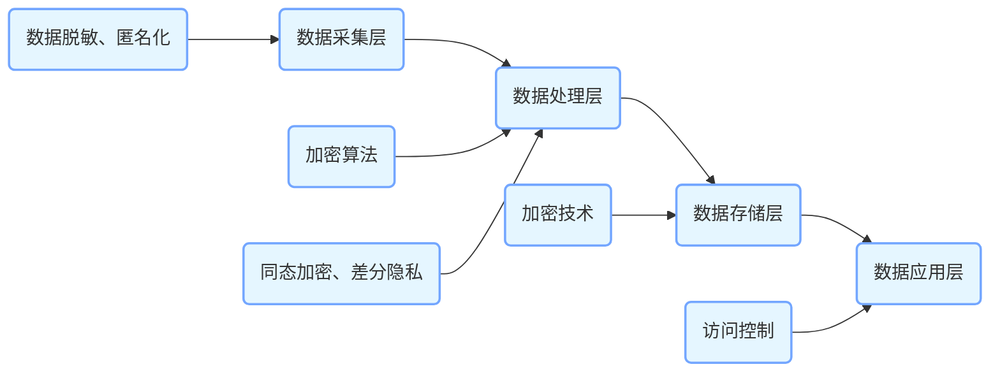

# 金融数据隐私保护增强技术

> 关键词：金融数据、隐私保护、增强技术、数据安全、加密算法、同态加密、差分隐私

> 摘要：本文围绕金融数据隐私保护增强技术展开深入探讨。在金融行业数字化进程不断加速的背景下，金融数据的隐私保护至关重要。文章首先介绍了金融数据隐私保护的背景，包括目的、预期读者等内容。接着阐述了核心概念与联系，通过文本示意图和 Mermaid 流程图清晰展示其原理和架构。详细讲解了核心算法原理，并用 Python 源代码进行说明。同时给出了相关数学模型和公式，并举例分析。通过项目实战展示了代码实际案例及详细解释。还探讨了实际应用场景，推荐了相关工具和资源。最后总结了未来发展趋势与挑战，提供了常见问题解答及扩展阅读与参考资料，旨在全面深入地剖析金融数据隐私保护增强技术，为相关从业者和研究者提供有价值的参考。

## 1. 背景介绍 
### 1.1 目的和范围
在当今数字化时代，金融行业产生和积累了海量的数据，这些数据包含了客户的个人信息、交易记录、财务状况等高度敏感的隐私内容。金融数据的隐私保护不仅关系到客户的个人权益，还对金融机构的信誉和整个金融系统的稳定有着重要影响。本文章的目的在于深入探讨金融数据隐私保护增强技术，详细介绍相关的概念、算法、模型以及实际应用等内容，为金融机构、研究人员和相关从业者提供全面的技术参考，以帮助他们更好地保护金融数据的隐私安全。范围涵盖了从基础的隐私保护概念到前沿的增强技术，包括加密算法、同态加密、差分隐私等多种技术手段，以及这些技术在金融领域的具体应用案例和实际操作方法。

### 1.2 预期读者
本文的预期读者主要包括金融机构的技术人员、安全专家和管理人员，他们可以从文中获取实用的金融数据隐私保护技术和管理方法，以提升金融机构的数据安全水平；计算机科学和信息安全领域的研究人员，能够从理论和技术层面深入了解金融数据隐私保护的最新进展和研究方向；对金融科技和数据安全感兴趣的学生和爱好者，通过阅读本文可以建立起对金融数据隐私保护的全面认识和理解。

### 1.3 文档结构概述
本文共分为十个部分。第一部分是背景介绍，阐述了文章的目的、预期读者、文档结构概述和术语表。第二部分介绍核心概念与联系，通过文本示意图和 Mermaid 流程图展示相关原理和架构。第三部分讲解核心算法原理和具体操作步骤，使用 Python 源代码进行详细阐述。第四部分给出数学模型和公式，并进行详细讲解和举例说明。第五部分是项目实战，包括开发环境搭建、源代码详细实现和代码解读。第六部分探讨实际应用场景。第七部分推荐相关的工具和资源，包括学习资源、开发工具框架和相关论文著作。第八部分总结未来发展趋势与挑战。第九部分是附录，提供常见问题与解答。第十部分是扩展阅读与参考资料，为读者提供进一步学习和研究的方向。

### 1.4 术语表
#### 1.4.1 核心术语定义
- **金融数据**：指金融机构在业务运营过程中产生和收集的与客户、交易、市场等相关的数据，包括客户个人信息、账户信息、交易记录、财务报表等。
- **隐私保护**：指采取一系列技术和管理措施，确保个人信息不被未经授权的访问、使用、披露或滥用，保护个人的隐私权益。
- **加密算法**：一种将明文数据转换为密文数据的数学方法，只有拥有正确密钥的人才能将密文还原为明文，从而保证数据在传输和存储过程中的安全性。
- **同态加密**：一种特殊的加密技术，允许在密文上进行特定的计算操作，而无需先解密，计算结果解密后与在明文上进行相同计算的结果相同。
- **差分隐私**：一种通过向数据中添加噪声来保护数据隐私的技术，在保证数据可用性的前提下，使得攻击者难以从数据中推断出单个个体的信息。

#### 1.4.2 相关概念解释
- **数据脱敏**：对敏感数据进行变形处理，如替换、掩码、加密等，使得数据在不泄露敏感信息的前提下仍可用于数据分析和处理。
- **访问控制**：通过设置权限和角色，限制对数据的访问，确保只有授权的人员能够访问特定的数据。
- **匿名化**：将数据中的个人身份信息去除或替换，使得数据无法直接或间接识别出特定的个人。

#### 1.4.3 缩略词列表
- **AES**：Advanced Encryption Standard，高级加密标准
- **RSA**：Rivest-Shamir-Adleman，一种非对称加密算法
- **HE**：Homomorphic Encryption，同态加密
- **DP**：Differential Privacy，差分隐私

## 2. 核心概念与联系 
### 核心概念原理
金融数据隐私保护增强技术主要涉及多种核心概念，这些概念相互关联，共同构成了金融数据隐私保护的技术体系。

#### 加密算法
加密算法是金融数据隐私保护的基础技术之一。它通过数学变换将明文数据转换为密文数据，使得数据在传输和存储过程中即使被非法获取，攻击者也无法直接解读数据内容。常见的加密算法包括对称加密算法和非对称加密算法。

对称加密算法使用相同的密钥进行加密和解密操作，如 AES 算法。其原理是将明文数据按照固定的块大小进行划分，然后使用密钥对每个数据块进行加密变换，得到密文数据。解密时，使用相同的密钥对密文数据进行逆变换，还原出明文数据。

非对称加密算法使用一对密钥，即公钥和私钥。公钥可以公开，用于加密数据；私钥则由用户秘密保存，用于解密数据。RSA 算法是一种典型的非对称加密算法，其基于大整数分解的困难性，通过对明文数据进行一系列的数学运算，生成密文数据。只有拥有私钥的用户才能对密文进行解密，还原出明文数据。

#### 同态加密
同态加密是一种具有创新性的加密技术，它允许在密文上进行特定的计算操作，而无需先解密。这意味着在保护数据隐私的同时，还可以对数据进行有用的计算。同态加密主要分为部分同态加密和全同态加密。

部分同态加密只支持一种或几种特定的计算操作，如加法同态加密只支持密文上的加法运算，乘法同态加密只支持密文上的乘法运算。全同态加密则支持任意的计算操作，是同态加密技术的最终目标，但目前在实际应用中还面临着计算效率等方面的挑战。

#### 差分隐私
差分隐私通过向数据中添加噪声来保护数据隐私。其基本思想是在保证数据可用性的前提下，使得攻击者难以从数据中推断出单个个体的信息。差分隐私通过定义一个隐私预算，控制添加噪声的程度，以平衡数据隐私和数据可用性之间的关系。

### 架构的文本示意图
金融数据隐私保护增强技术的架构可以分为数据采集层、数据处理层、数据存储层和数据应用层。

- **数据采集层**：负责收集金融数据，包括客户信息、交易记录等。在采集过程中，可以采用数据脱敏和匿名化等技术，对敏感数据进行初步处理，保护数据隐私。
- **数据处理层**：对采集到的数据进行进一步的处理和分析。在处理过程中，可以使用加密算法对数据进行加密，确保数据在处理过程中的安全性。同时，也可以应用同态加密和差分隐私等技术，在保护数据隐私的前提下进行数据计算和分析。
- **数据存储层**：将处理后的数据存储在数据库或其他存储设备中。在存储过程中，继续采用加密技术对数据进行加密，防止数据在存储过程中被泄露。
- **数据应用层**：根据不同的业务需求，对存储的数据进行应用和展示。在应用过程中，通过访问控制等技术，确保只有授权的人员能够访问和使用数据。

### Mermaid 流程图


## 3. 核心算法原理 & 具体操作步骤 
### 对称加密算法（AES）原理及 Python 实现
#### 原理
AES 是一种对称加密算法，采用分组密码体制，将明文数据按照 128 位（16 字节）的块大小进行划分。它使用 128 位、192 位或 256 位的密钥对数据块进行加密变换。AES 算法主要包括轮函数和密钥扩展两部分。轮函数包括字节替换、行移位、列混淆和轮密钥加四个操作，通过多次迭代这些操作，将明文数据转换为密文数据。密钥扩展则是将初始密钥扩展为多个轮密钥，用于每一轮的加密操作。

#### Python 实现
```python
from Crypto.Cipher import AES
from Crypto.Util.Padding import pad, unpad
import os

# 生成随机密钥
key = os.urandom(16)  # 128 位密钥

# 初始化加密器
cipher = AES.new(key, AES.MODE_CBC)

# 待加密的明文数据
plaintext = b"Hello, World! This is a test message."

# 填充数据使其长度为 16 的倍数
padded_plaintext = pad(plaintext, AES.block_size)

# 加密数据
ciphertext = cipher.encrypt(padded_plaintext)

# 获取初始化向量（IV）
iv = cipher.iv

# 初始化解密器
decipher = AES.new(key, AES.MODE_CBC, iv)

# 解密数据
decrypted_data = decipher.decrypt(ciphertext)

# 去除填充
original_plaintext = unpad(decrypted_data, AES.block_size)

print("Original Plaintext:", original_plaintext)
print("Ciphertext:", ciphertext)
print("Decrypted Plaintext:", original_plaintext)
```

### 非对称加密算法（RSA）原理及 Python 实现
#### 原理
RSA 算法基于大整数分解的困难性。它首先生成一对密钥，即公钥和私钥。公钥由两个参数组成：模数 $n$ 和公钥指数 $e$；私钥由模数 $n$ 和私钥指数 $d$ 组成。加密时，使用公钥对明文数据进行加密，得到密文数据；解密时，使用私钥对密文数据进行解密，还原出明文数据。具体的加密和解密公式如下：

加密：$c = m^e \mod n$

解密：$m = c^d \mod n$

其中，$m$ 是明文数据，$c$ 是密文数据。

#### Python 实现
```python
from Crypto.PublicKey import RSA
from Crypto.Cipher import PKCS1_OAEP

# 生成 RSA 密钥对
key = RSA.generate(2048)

# 获取公钥和私钥
private_key = key.export_key()
public_key = key.publickey().export_key()

# 待加密的明文数据
plaintext = b"Hello, RSA encryption!"

# 加载公钥
recipient_public_key = RSA.import_key(public_key)
cipher_rsa = PKCS1_OAEP.new(recipient_public_key)

# 加密数据
ciphertext = cipher_rsa.encrypt(plaintext)

# 加载私钥
private_key = RSA.import_key(private_key)
cipher_rsa = PKCS1_OAEP.new(private_key)

# 解密数据
decrypted_data = cipher_rsa.decrypt(ciphertext)

print("Original Plaintext:", plaintext)
print("Ciphertext:", ciphertext)
print("Decrypted Plaintext:", decrypted_data)
```

### 差分隐私原理及 Python 实现
#### 原理
差分隐私通过向数据中添加噪声来保护数据隐私。常见的噪声机制包括拉普拉斯机制和高斯机制。拉普拉斯机制是在数据上添加拉普拉斯分布的噪声，其噪声的尺度与隐私预算和数据的敏感度有关。

#### Python 实现
```python
import numpy as np

# 定义数据
data = np.array([1, 2, 3, 4, 5])

# 定义隐私预算
epsilon = 0.1

# 计算数据的敏感度（这里简单假设敏感度为 1）
sensitivity = 1

# 生成拉普拉斯噪声
noise = np.random.laplace(0, sensitivity / epsilon, data.shape)

# 添加噪声到数据
noisy_data = data + noise

print("Original Data:", data)
print("Noisy Data:", noisy_data)
```

## 4. 数学模型和公式 & 详细讲解 & 举例说明 
### 对称加密算法（AES）的数学模型
AES 算法的数学模型主要基于有限域上的代数运算。在 AES 中，字节替换操作使用 S 盒进行非线性变换，S 盒是一个固定的 256 字节的查找表，其本质是在有限域 $GF(2^8)$ 上的一个置换。行移位操作是对数据块的行进行循环移位，列混淆操作则是在有限域 $GF(2^8)$ 上的矩阵乘法。

轮密钥加操作是将数据块与轮密钥进行按位异或运算，其数学公式为：

$S_{i,j}^{new} = S_{i,j} \oplus K_{i,j}$

其中，$S_{i,j}$ 是数据块中的元素，$K_{i,j}$ 是轮密钥中的元素，$S_{i,j}^{new}$ 是经过轮密钥加操作后的元素。

### 非对称加密算法（RSA）的数学模型
RSA 算法的数学模型基于数论中的欧拉定理。设 $n = p \times q$，其中 $p$ 和 $q$ 是两个大素数，$\varphi(n) = (p - 1) \times (q - 1)$ 是欧拉函数。选择一个整数 $e$，满足 $1 < e < \varphi(n)$ 且 $\gcd(e, \varphi(n)) = 1$，则 $e$ 是公钥指数。计算 $d$，使得 $e \times d \equiv 1 \pmod{\varphi(n)}$，则 $d$ 是私钥指数。

加密公式：$c = m^e \mod n$

解密公式：$m = c^d \mod n$

举例：假设 $p = 5$，$q = 11$，则 $n = p \times q = 55$，$\varphi(n) = (p - 1) \times (q - 1) = 40$。选择 $e = 3$，满足 $\gcd(3, 40) = 1$。计算 $d$，使得 $3 \times d \equiv 1 \pmod{40}$，可得 $d = 27$。

设明文 $m = 8$，则加密后的密文 $c = 8^3 \mod 55 = 17$。解密时，$m = 17^{27} \mod 55 = 8$。

### 差分隐私的数学模型
差分隐私的核心概念是 $\epsilon$-差分隐私。设 $\mathcal{D}$ 和 $\mathcal{D}'$ 是两个相邻的数据集（即它们只在一个记录上不同），对于任意的查询结果集 $S$，如果一个机制 $\mathcal{M}$ 满足：

$\Pr[\mathcal{M}(\mathcal{D}) \in S] \leq e^{\epsilon} \times \Pr[\mathcal{M}(\mathcal{D}') \in S]$

则称 $\mathcal{M}$ 满足 $\epsilon$-差分隐私，其中 $\epsilon$ 是隐私预算，控制着隐私保护的程度。

拉普拉斯机制是一种常用的差分隐私机制，其数学公式为：

$\mathcal{M}(x) = x + \text{Lap}(\frac{\Delta f}{\epsilon})$

其中，$x$ 是原始数据，$\Delta f$ 是查询函数 $f$ 的敏感度（即查询函数在相邻数据集上的最大变化量），$\text{Lap}(\frac{\Delta f}{\epsilon})$ 是拉普拉斯分布的噪声。

举例：假设有一个查询函数 $f$，其敏感度 $\Delta f = 1$，隐私预算 $\epsilon = 0.1$。对于数据 $x = 10$，添加拉普拉斯噪声后的结果为：

$\mathcal{M}(10) = 10 + \text{Lap}(\frac{1}{0.1}) = 10 + \text{Lap}(10)$

## 5. 项目实战：代码实际案例和详细解释说明 
### 5.1  开发环境搭建
#### 安装 Python
首先需要安装 Python 环境，建议安装 Python 3.7 及以上版本。可以从 Python 官方网站（https://www.python.org/downloads/） 下载适合自己操作系统的安装包，按照安装向导进行安装。

#### 安装相关库
在项目中需要使用一些加密和数学计算相关的库，如 `pycryptodome` 和 `numpy`。可以使用以下命令进行安装：

```sh
pip install pycryptodome numpy
```

### 5.2  源代码详细实现和代码解读
#### 项目需求
实现一个简单的金融数据隐私保护系统，对客户的敏感信息进行加密存储，并支持数据的加密查询和差分隐私处理。

#### 代码实现
```python
from Crypto.Cipher import AES
from Crypto.Util.Padding import pad, unpad
import numpy as np
import os

# 对称加密类
class AESEncryption:
    def __init__(self, key):
        self.key = key

    def encrypt(self, plaintext):
        cipher = AES.new(self.key, AES.MODE_CBC)
        padded_plaintext = pad(plaintext, AES.block_size)
        ciphertext = cipher.encrypt(padded_plaintext)
        iv = cipher.iv
        return iv + ciphertext

    def decrypt(self, ciphertext):
        iv = ciphertext[:AES.block_size]
        ciphertext = ciphertext[AES.block_size:]
        decipher = AES.new(self.key, AES.MODE_CBC, iv)
        decrypted_data = decipher.decrypt(ciphertext)
        original_plaintext = unpad(decrypted_data, AES.block_size)
        return original_plaintext

# 差分隐私类
class DifferentialPrivacy:
    def __init__(self, epsilon, sensitivity):
        self.epsilon = epsilon
        self.sensitivity = sensitivity

    def add_noise(self, data):
        noise = np.random.laplace(0, self.sensitivity / self.epsilon, data.shape)
        noisy_data = data + noise
        return noisy_data

# 模拟金融数据存储和查询系统
class FinancialDataSystem:
    def __init__(self):
        self.key = os.urandom(16)
        self.encryption = AESEncryption(self.key)
        self.dp = DifferentialPrivacy(epsilon=0.1, sensitivity=1)
        self.data_storage = {}

    def store_data(self, customer_id, data):
        encrypted_data = self.encryption.encrypt(data.encode())
        self.data_storage[customer_id] = encrypted_data

    def query_data(self, customer_id):
        if customer_id in self.data_storage:
            encrypted_data = self.data_storage[customer_id]
            decrypted_data = self.encryption.decrypt(encrypted_data)
            # 对解密后的数据进行差分隐私处理
            noisy_data = self.dp.add_noise(np.array([float(decrypted_data)]))
            return noisy_data[0]
        else:
            return None

# 测试代码
if __name__ == "__main__":
    system = FinancialDataSystem()
    customer_id = "12345"
    data = "1000.50"
    system.store_data(customer_id, data)
    query_result = system.query_data(customer_id)
    print("Original Data:", data)
    print("Query Result (with Differential Privacy):", query_result)
```

### 5.3  代码解读与分析
#### 对称加密类（AESEncryption）
- `__init__` 方法：初始化 AES 加密器，接收一个密钥作为参数。
- `encrypt` 方法：对明文数据进行加密操作，首先使用 `pad` 函数对数据进行填充，使其长度为 16 的倍数，然后使用 AES 加密器进行加密，最后返回初始化向量（IV）和密文的组合。
- `decrypt` 方法：对密文数据进行解密操作，首先提取出 IV，然后使用 AES 解密器进行解密，最后使用 `unpad` 函数去除填充，得到原始明文数据。

#### 差分隐私类（DifferentialPrivacy）
- `__init__` 方法：初始化差分隐私机制，接收隐私预算 `epsilon` 和数据敏感度 `sensitivity` 作为参数。
- `add_noise` 方法：向数据中添加拉普拉斯噪声，根据拉普拉斯分布生成噪声，并将其添加到原始数据上，返回添加噪声后的数据。

#### 金融数据存储和查询系统类（FinancialDataSystem）
- `__init__` 方法：初始化系统，生成随机密钥，创建 AES 加密器和差分隐私机制，初始化数据存储字典。
- `store_data` 方法：将客户的敏感数据进行加密后存储到数据存储字典中。
- `query_data` 方法：根据客户 ID 查询数据，首先对加密数据进行解密，然后对解密后的数据进行差分隐私处理，最后返回添加噪声后的数据。

#### 测试代码
创建金融数据存储和查询系统的实例，存储一条客户数据，然后查询该数据，并输出原始数据和查询结果（带有差分隐私处理）。

## 6. 实际应用场景 
### 客户信息保护
金融机构在收集和存储客户信息时，需要保护客户的个人隐私。可以使用加密算法对客户的身份证号码、银行卡号、手机号码等敏感信息进行加密存储，确保即使数据被非法获取，攻击者也无法直接解读客户信息。同时，在数据传输过程中，也可以使用加密技术对数据进行加密，防止数据在传输过程中被窃取。

### 交易数据隐私保护
金融交易数据包含了客户的交易金额、交易时间、交易对象等敏感信息。在进行交易数据的存储和分析时，可以使用同态加密技术，在保护数据隐私的前提下进行数据计算和分析。例如，银行可以使用同态加密技术对客户的账户余额进行加密，然后在密文上进行余额查询和转账操作，而无需先解密数据，从而保护客户的账户隐私。

### 风险评估和信用评分
在进行风险评估和信用评分时，金融机构需要使用大量的客户数据。为了保护客户数据的隐私，可以使用差分隐私技术对数据进行处理。例如，在计算客户的信用评分时，可以向数据中添加噪声，使得攻击者难以从数据中推断出单个客户的信息，同时保证信用评分的准确性和可用性。

### 数据共享和合作
金融机构之间经常需要进行数据共享和合作，以提高业务效率和服务质量。在数据共享过程中，需要保护数据的隐私。可以使用加密算法和同态加密技术对共享数据进行加密处理，确保数据在共享过程中不被泄露。同时，也可以使用差分隐私技术对共享数据进行处理，保护数据中涉及的个人隐私。

## 7. 工具和资源推荐
### 7.1 学习资源推荐
#### 7.1.1 书籍推荐
- 《密码学原理与实践》：本书系统地介绍了密码学的基本原理和实践应用，包括对称加密算法、非对称加密算法、哈希函数等内容，是学习密码学的经典教材。
- 《差分隐私算法与应用》：详细介绍了差分隐私的基本概念、算法原理和实际应用，对于深入理解差分隐私技术具有重要的参考价值。
- 《同态加密技术与应用》：全面介绍了同态加密的理论基础、算法设计和实际应用，是学习同态加密技术的权威书籍。

#### 7.1.2 在线课程
- Coursera 上的 “Cryptography” 课程：由知名大学的教授授课，系统地介绍了密码学的基本概念、算法和应用，通过在线视频、作业和考试等方式进行学习。
- edX 上的 “Differential Privacy” 课程：深入讲解了差分隐私的理论和实践，包括差分隐私的定义、机制设计和应用案例等内容。
- Udemy 上的 “Homomorphic Encryption for Beginners” 课程：适合初学者学习同态加密技术，通过实际案例和代码演示，帮助学员快速掌握同态加密的基本原理和应用方法。

#### 7.1.3 技术博客和网站
- 密码学博客：提供了丰富的密码学技术文章和研究成果，包括加密算法的分析、隐私保护技术的应用等内容。
- 差分隐私社区：专注于差分隐私技术的研究和交流，分享差分隐私的最新进展和应用案例。
- 同态加密论坛：讨论同态加密技术的理论和实践问题，提供同态加密算法的实现代码和工具。

### 7.2 开发工具框架推荐
#### 7.2.1 IDE和编辑器
- PyCharm：一款专业的 Python 集成开发环境，提供了丰富的代码编辑、调试和项目管理功能，适合开发 Python 加密和隐私保护相关的项目。
- Visual Studio Code：一款轻量级的代码编辑器，支持多种编程语言和插件扩展，具有丰富的代码提示和调试功能，可用于开发各种类型的项目。

#### 7.2.2 调试和性能分析工具
- pdb：Python 自带的调试器，可以帮助开发者定位代码中的问题，进行单步调试和变量查看。
- cProfile：Python 自带的性能分析工具，可以分析代码的执行时间和函数调用情况，帮助开发者优化代码性能。

#### 7.2.3 相关框架和库
- PyCryptodome：一个功能强大的 Python 加密库，提供了多种加密算法的实现，包括 AES、RSA、SHA 等，方便开发者进行加密和解密操作。
- OpenDP：一个开源的差分隐私框架，提供了多种差分隐私机制的实现和工具，帮助开发者在数据处理过程中应用差分隐私技术。
- Palisade：一个开源的同态加密库，提供了多种同态加密算法的实现，支持多种编程语言，方便开发者进行同态加密的开发和应用。

### 7.3 相关论文著作推荐
#### 7.3.1 经典论文
- “A Method for Obtaining Digital Signatures and Public-Key Cryptosystems”：RSA 算法的原始论文，详细介绍了 RSA 算法的原理和实现方法，是密码学领域的经典之作。
- “Differential Privacy”：差分隐私的开创性论文，首次提出了差分隐私的概念和定义，为差分隐私技术的发展奠定了基础。
- “Fully Homomorphic Encryption Using Ideal Lattices”：全同态加密领域的重要论文，提出了一种基于理想格的全同态加密方案，推动了全同态加密技术的发展。

#### 7.3.2 最新研究成果
- 关注顶级学术会议和期刊，如 ACM SIGSAC Conference on Computer and Communications Security、IEEE Symposium on Security and Privacy 等，及时了解金融数据隐私保护增强技术的最新研究成果和发展趋势。
- 查阅知名学术数据库，如 IEEE Xplore、ACM Digital Library、ScienceDirect 等，获取相关的研究论文和报告。

#### 7.3.3 应用案例分析
- 研究金融机构的实际应用案例，了解他们在金融数据隐私保护方面的实践经验和技术方案。可以查阅金融机构的官方网站、年报和技术报告等资料，获取相关的应用案例信息。
- 参考行业研究报告和咨询机构的分析报告，了解金融数据隐私保护技术在不同行业的应用现状和发展趋势。

## 8. 总结：未来发展趋势与挑战
### 未来发展趋势
#### 技术融合
未来，金融数据隐私保护增强技术将呈现出多种技术融合的趋势。例如，将加密算法、同态加密、差分隐私等技术相结合，实现更加全面和高效的隐私保护。同时，还会与区块链、人工智能等技术进行融合，利用区块链的去中心化和不可篡改特性，以及人工智能的数据分析和处理能力，进一步提升金融数据隐私保护的水平。

#### 标准化和规范化
随着金融数据隐私保护的重要性日益凸显，相关的标准和规范将不断完善。国际组织和各国政府将制定更加严格和统一的金融数据隐私保护标准，推动金融机构和企业在数据隐私保护方面的规范化和标准化。这将有助于提高金融数据隐私保护的整体水平，促进金融行业的健康发展。

#### 智能化和自动化
未来的金融数据隐私保护系统将越来越智能化和自动化。通过引入人工智能和机器学习技术，实现对金融数据的自动识别、分类和隐私保护。例如，利用机器学习算法对数据进行分析，自动识别敏感数据，并采取相应的隐私保护措施。同时，还可以实现对隐私保护策略的自动调整和优化，提高隐私保护的效率和效果。

### 挑战
#### 性能和效率问题
目前，一些金融数据隐私保护增强技术，如同态加密和全同态加密，在计算效率和性能方面还存在较大的挑战。这些技术的计算复杂度较高，会导致数据处理和分析的效率低下，影响金融业务的正常开展。因此，如何提高这些技术的性能和效率，是未来需要解决的重要问题。

#### 技术复杂性
金融数据隐私保护增强技术涉及到多个领域的知识和技术，如密码学、数学、计算机科学等，技术复杂性较高。这对于金融机构和企业的技术人员来说，是一个巨大的挑战。如何培养和吸引具有相关技术能力的人才，提高技术人员的技术水平和综合素质，是推动金融数据隐私保护技术发展的关键。

#### 法律法规和合规性
金融数据隐私保护涉及到众多的法律法规和合规要求，不同国家和地区的法律法规存在差异。金融机构和企业在开展金融数据隐私保护工作时，需要遵守相关的法律法规和合规要求，否则将面临法律风险。因此，如何准确理解和遵守不同国家和地区的法律法规和合规要求，是金融数据隐私保护面临的重要挑战。

## 9. 附录：常见问题与解答
### 1. 对称加密和非对称加密有什么区别？
对称加密使用相同的密钥进行加密和解密操作，加密和解密速度快，但密钥管理存在一定的风险。非对称加密使用一对密钥，即公钥和私钥，公钥可以公开，私钥由用户秘密保存，安全性较高，但加密和解密速度相对较慢。

### 2. 同态加密技术目前在实际应用中存在哪些问题？
同态加密技术目前在实际应用中主要存在计算效率低、存储开销大等问题。由于同态加密的计算复杂度较高，会导致数据处理和分析的效率低下，同时需要较大的存储空间来存储密文数据。

### 3. 差分隐私技术如何平衡数据隐私和数据可用性？
差分隐私技术通过定义隐私预算，控制添加噪声的程度，来平衡数据隐私和数据可用性。隐私预算越小，添加的噪声越大，数据隐私保护程度越高，但数据可用性会相应降低；隐私预算越大，添加的噪声越小，数据可用性越高，但数据隐私保护程度会相应降低。

### 4. 金融机构在实施金融数据隐私保护增强技术时，需要注意哪些问题？
金融机构在实施金融数据隐私保护增强技术时，需要注意以下问题：
- 选择合适的隐私保护技术，根据不同的业务需求和数据特点，选择合适的加密算法、同态加密技术或差分隐私技术。
- 加强密钥管理，确保密钥的安全性和保密性。
- 遵守相关的法律法规和合规要求，确保数据隐私保护工作的合法性和合规性。
- 对技术人员进行培训，提高技术人员的技术水平和综合素质，确保技术的正确实施和应用。

## 10. 扩展阅读 & 参考资料
### 扩展阅读
- 《区块链与金融：技术创新与应用》：介绍了区块链技术在金融领域的应用，包括区块链的基本原理、共识机制、智能合约等内容，以及区块链技术如何与金融数据隐私保护相结合。
- 《人工智能与金融风险管理》：探讨了人工智能技术在金融风险管理中的应用，包括机器学习、深度学习、自然语言处理等技术，以及如何利用人工智能技术提高金融数据隐私保护的水平。

### 参考资料
- 《中华人民共和国网络安全法》
- 《中华人民共和国数据安全法》
- 《个人信息保护法》
- 相关的国际标准和规范，如 ISO/IEC 27001 信息安全管理体系标准等。