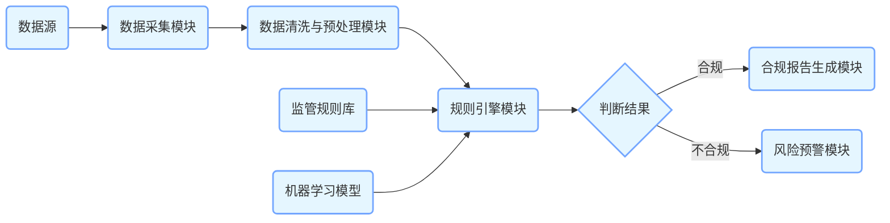

# 金融监管合规自动化工具

> 关键词：金融监管、合规自动化、工具、金融科技、风险防控、数据处理、人工智能

> 摘要：本文围绕金融监管合规自动化工具展开深入探讨。首先介绍其产生的背景，包括金融行业的发展现状以及合规需求的紧迫性。接着阐述核心概念与联系，剖析其工作原理和架构。详细讲解核心算法原理，通过Python代码展示具体实现步骤。运用数学模型和公式进一步阐释其内在逻辑，并举例说明。结合项目实战，给出代码实际案例并进行详细解释。分析该工具的实际应用场景，为金融机构的合规工作提供参考。推荐相关的学习资源、开发工具框架以及论文著作，助力读者深入了解该领域。最后总结其未来发展趋势与挑战，解答常见问题并提供扩展阅读和参考资料，旨在全面且深入地呈现金融监管合规自动化工具的全貌。

## 1. 背景介绍 
### 1.1 目的和范围
金融行业作为现代经济的核心，受到严格且复杂的监管。随着金融业务的不断创新和全球化发展，金融机构面临的合规要求日益增多且复杂。金融监管合规自动化工具的目的在于帮助金融机构高效、准确地满足各种监管要求，降低合规成本，减少人为错误和违规风险。

本文章的范围涵盖金融监管合规自动化工具的基本概念、工作原理、算法实现、实际应用、相关工具资源等方面，旨在为读者提供一个全面、深入的了解视角。

### 1.2 预期读者
本文预期读者包括金融机构的合规管理人员、信息技术人员、金融科技从业者、研究金融监管和合规技术的学者以及对金融科技领域感兴趣的爱好者。对于合规管理人员，可帮助其了解如何利用自动化工具提升合规工作效率；信息技术人员能从中获取技术实现的思路和方法；学者可借此开展相关研究；爱好者则能拓宽对金融科技领域的认知。

### 1.3 文档结构概述
本文首先介绍金融监管合规自动化工具的背景信息，包括目的、预期读者和文档结构。接着阐述核心概念与联系，深入解析其原理和架构。然后详细讲解核心算法原理并给出Python代码实现步骤。运用数学模型和公式进一步说明其内在逻辑。通过项目实战展示代码案例及详细解释。分析实际应用场景，为工具的使用提供参考。推荐相关的学习资源、开发工具框架和论文著作。最后总结未来发展趋势与挑战，解答常见问题并提供扩展阅读和参考资料。

### 1.4 术语表
#### 1.4.1 核心术语定义
- **金融监管**：政府通过特定的机构（如中央银行、金融监管局等）对金融交易行为主体进行的某种限制或规定，旨在维持金融稳定、保护投资者利益等。
- **合规**：金融机构及其员工的经营管理和业务行为符合法律法规、监管要求、行业自律规则以及内部规章制度等。
- **自动化工具**：利用计算机技术和相关算法，自动完成特定任务的软件或系统，在金融监管合规领域，可自动处理合规数据、进行风险评估等。

#### 1.4.2 相关概念解释
- **金融科技（Fintech）**：是金融和信息技术的融合，利用科技手段创新传统金融服务模式和业务流程，金融监管合规自动化工具是金融科技的重要应用之一。
- **风险防控**：识别、评估和应对金融业务中各种风险的过程，合规工作是风险防控的重要组成部分，自动化工具可帮助提升风险防控的效率和准确性。

#### 1.4.3 缩略词列表
- **AML**：Anti - Money Laundering，反洗钱
- **KYC**：Know Your Customer，了解你的客户
- **API**：Application Programming Interface，应用程序编程接口

## 2. 核心概念与联系 

### 核心概念原理
金融监管合规自动化工具的核心原理是通过对金融业务数据的收集、处理和分析，依据预设的监管规则和标准，自动判断金融机构的业务行为是否合规。其主要基于以下几个方面的原理：

- **数据驱动**：收集金融机构的各类业务数据，如交易数据、客户信息等，这些数据是合规判断的基础。
- **规则引擎**：内置一系列监管规则，这些规则可以根据不同的监管要求进行定制和更新。规则引擎对收集到的数据进行匹配和分析，判断是否符合规则。
- **机器学习和人工智能**：利用机器学习算法对历史数据进行学习，识别潜在的合规风险模式；人工智能技术可实现自然语言处理，帮助理解和处理非结构化的监管文件。

### 架构示意图


### 架构说明
1. **数据源**：包括金融机构内部的业务系统、外部数据源（如监管机构发布的数据）等，提供各种类型的数据。
2. **数据采集模块**：从不同的数据源中提取相关的数据。
3. **数据清洗与预处理模块**：对采集到的数据进行清洗，去除噪声和错误数据，并进行格式转换等预处理操作，以提高数据质量。
4. **规则引擎模块**：根据监管规则库中的规则和机器学习模型的分析结果，对预处理后的数据进行判断。
5. **判断结果**：分为合规和不合规两种情况。
6. **合规报告生成模块**：当判断结果为合规时，生成合规报告，记录相关信息。
7. **风险预警模块**：当判断结果为不合规时，发出风险预警，提醒相关人员采取措施。
8. **监管规则库**：存储各种监管规则，可根据需要进行更新和维护。
9. **机器学习模型**：通过对历史数据的学习，发现潜在的合规风险模式，辅助规则引擎进行判断。

## 3. 核心算法原理 & 具体操作步骤 

### 核心算法原理
金融监管合规自动化工具中常用的核心算法包括规则匹配算法和机器学习算法。

#### 规则匹配算法
规则匹配算法是根据预设的监管规则对数据进行逐行或逐字段的匹配。例如，对于反洗钱（AML）规则，可能规定单笔交易金额超过一定阈值时需要进行额外的审查。规则匹配算法会遍历交易数据，检查每笔交易的金额是否超过阈值。

#### 机器学习算法
机器学习算法可用于风险预测和异常检测。例如，使用分类算法对客户进行风险等级分类，使用异常检测算法发现异常的交易行为。常见的机器学习算法包括决策树、随机森林、支持向量机等。

### 具体操作步骤及Python代码实现

#### 规则匹配算法实现
以下是一个简单的规则匹配算法的Python代码示例，用于检查交易金额是否超过阈值：

```python
# 定义交易数据
transactions = [
    {"id": 1, "amount": 1000},
    {"id": 2, "amount": 5000},
    {"id": 3, "amount": 2000}
]

# 定义规则：单笔交易金额超过3000需要审查
threshold = 3000

# 规则匹配函数
def rule_matching(transactions, threshold):
    for transaction in transactions:
        if transaction["amount"] > threshold:
            print(f"交易ID {transaction['id']} 金额 {transaction['amount']} 超过阈值，需要审查。")
        else:
            print(f"交易ID {transaction['id']} 金额 {transaction['amount']} 合规。")

# 执行规则匹配
rule_matching(transactions, threshold)
```

#### 机器学习算法实现（以决策树为例）
以下是一个使用决策树算法进行客户风险等级分类的Python代码示例：

```python
import pandas as pd
from sklearn.model_selection import train_test_split
from sklearn.tree import DecisionTreeClassifier
from sklearn.metrics import accuracy_score

# 加载示例数据
data = {
    "age": [25, 30, 35, 40, 45],
    "income": [50000, 60000, 70000, 80000, 90000],
    "risk_level": [0, 0, 1, 1, 1]
}
df = pd.DataFrame(data)

# 分离特征和标签
X = df[["age", "income"]]
y = df["risk_level"]

# 划分训练集和测试集
X_train, X_test, y_train, y_test = train_test_split(X, y, test_size=0.2, random_state=42)

# 创建决策树分类器
clf = DecisionTreeClassifier()

# 训练模型
clf.fit(X_train, y_train)

# 预测
y_pred = clf.predict(X_test)

# 计算准确率
accuracy = accuracy_score(y_test, y_pred)
print(f"模型准确率: {accuracy}")
```

## 4. 数学模型和公式 & 详细讲解 & 举例说明 

### 规则匹配的数学模型
规则匹配可以用逻辑表达式来表示。假设我们有一个规则：如果交易金额 $A$ 大于阈值 $T$，则该交易需要审查。可以用以下逻辑表达式表示：

$$
\text{审查} = 
\begin{cases}
\text{是}, & A > T \\
\text{否}, & A \leq T
\end{cases}
$$

**举例说明**：假设阈值 $T = 3000$，某笔交易金额 $A = 3500$，因为 $3500 > 3000$，所以该交易需要审查。

### 机器学习算法的数学模型（以决策树为例）
决策树是一种基于树结构进行决策的机器学习算法。决策树的每个内部节点是一个特征上的测试，每个分支是测试输出，每个叶节点是一个类别标签。

决策树的构建过程通常基于信息增益或基尼不纯度等指标。信息增益的计算公式为：

$$
\text{InfoGain}(D, A) = \text{Entropy}(D) - \sum_{v \in \text{Values}(A)} \frac{|D_v|}{|D|} \text{Entropy}(D_v)
$$

其中：
- $D$ 是数据集。
- $A$ 是特征。
- $\text{Entropy}(D)$ 是数据集 $D$ 的熵，计算公式为：

$$
\text{Entropy}(D) = - \sum_{i = 1}^{k} p_i \log_2 p_i
$$

其中 $p_i$ 是类别 $i$ 在数据集 $D$ 中出现的概率。

**举例说明**：假设有一个数据集 $D$ 包含 10 个样本，其中 6 个属于类别 0，4 个属于类别 1。则数据集 $D$ 的熵为：

$$
\text{Entropy}(D) = - \left( \frac{6}{10} \log_2 \frac{6}{10} + \frac{4}{10} \log_2 \frac{4}{10} \right) \approx 0.971
$$

假设我们有一个特征 $A$，根据该特征将数据集 $D$ 划分为两个子集 $D_1$ 和 $D_2$，$|D_1| = 4$，其中 3 个属于类别 0，1 个属于类别 1；$|D_2| = 6$，其中 3 个属于类别 0，3 个属于类别 1。则子集 $D_1$ 和 $D_2$ 的熵分别为：

$$
\text{Entropy}(D_1) = - \left( \frac{3}{4} \log_2 \frac{3}{4} + \frac{1}{4} \log_2 \frac{1}{4} \right) \approx 0.811
$$

$$
\text{Entropy}(D_2) = - \left( \frac{3}{6} \log_2 \frac{3}{6} + \frac{3}{6} \log_2 \frac{3}{6} \right) = 1
$$

信息增益为：

$$
\text{InfoGain}(D, A) = 0.971 - \left( \frac{4}{10} \times 0.811 + \frac{6}{10} \times 1 \right) \approx 0.134
$$

## 5. 项目实战：代码实际案例和详细解释说明 

### 5.1  开发环境搭建
#### 操作系统
建议使用 Linux 或 macOS 系统，因为它们对 Python 开发有良好的支持。如果使用 Windows 系统，也可以通过安装 Anaconda 等工具来搭建开发环境。

#### Python 环境
安装 Python 3.7 或以上版本。可以从 Python 官方网站（https://www.python.org/downloads/） 下载并安装。

#### 依赖库安装
使用 `pip` 安装所需的依赖库，例如：
```bash
pip install pandas scikit-learn
```

### 5.2  源代码详细实现和代码解读

#### 项目需求
实现一个简单的金融监管合规自动化工具，用于检查客户的交易行为是否符合反洗钱规则。规则如下：
- 单笔交易金额超过 5000 元，需要进行额外审查。
- 同一客户在一天内的累计交易金额超过 10000 元，需要进行额外审查。

#### 源代码实现
```python
import pandas as pd

# 定义交易数据
transactions = [
    {"customer_id": 1, "transaction_date": "2023-01-01", "amount": 3000},
    {"customer_id": 1, "transaction_date": "2023-01-01", "amount": 7000},
    {"customer_id": 2, "transaction_date": "2023-01-01", "amount": 4000},
    {"customer_id": 2, "transaction_date": "2023-01-01", "amount": 6000}
]

# 将交易数据转换为 DataFrame
df = pd.DataFrame(transactions)

# 规则 1：单笔交易金额超过 5000 元，需要进行额外审查
df["single_transaction_alert"] = df["amount"] > 5000

# 规则 2：同一客户在一天内的累计交易金额超过 10000 元，需要进行额外审查
daily_total = df.groupby(["customer_id", "transaction_date"])["amount"].sum().reset_index()
daily_total["daily_total_alert"] = daily_total["amount"] > 10000

# 合并结果
result = df.merge(daily_total[["customer_id", "transaction_date", "daily_total_alert"]],
                  on=["customer_id", "transaction_date"], how="left")

# 输出结果
print(result)
```

#### 代码解读
1. **数据定义**：定义了一个包含客户交易信息的列表 `transactions`，每个交易记录包含客户 ID、交易日期和交易金额。
2. **数据转换**：使用 `pandas` 的 `DataFrame` 将交易数据转换为表格形式，方便后续处理。
3. **规则 1 检查**：通过比较交易金额和阈值 5000 元，创建一个新的列 `single_transaction_alert`，标记单笔交易是否需要额外审查。
4. **规则 2 检查**：使用 `groupby` 方法按客户 ID 和交易日期对交易数据进行分组，计算每个客户在一天内的累计交易金额。然后比较累计交易金额和阈值 10000 元，创建一个新的列 `daily_total_alert`，标记是否需要额外审查。
5. **结果合并**：使用 `merge` 方法将规则 2 的检查结果合并到原始交易数据中。
6. **结果输出**：打印最终的检查结果。

### 5.3  代码解读与分析
#### 优点
- **简单易懂**：使用 `pandas` 库进行数据处理，代码简洁，易于理解和维护。
- **可扩展性**：可以很方便地添加新的规则，只需要在代码中增加相应的逻辑即可。
- **灵活性**：可以根据不同的监管要求调整规则的阈值。

#### 缺点
- **数据量限制**：当交易数据量非常大时，`pandas` 的处理效率可能会降低。
- **缺乏实时性**：代码是基于静态数据进行处理的，无法实时处理新的交易数据。

## 6. 实际应用场景 
### 反洗钱（AML）
金融监管合规自动化工具在反洗钱领域具有重要应用。通过对客户的交易行为进行实时监测和分析，自动识别可疑的交易模式，如频繁的大额转账、资金的快速流动等。一旦发现可疑交易，系统可以立即发出预警，提醒金融机构进行进一步的调查和审查，有助于预防和打击洗钱活动。

### 了解你的客户（KYC）
在 KYC 过程中，自动化工具可以帮助金融机构快速、准确地收集和验证客户的身份信息。通过与第三方数据源（如政府数据库、信用机构等）进行接口对接，自动获取客户的相关信息，并进行比对和验证。同时，工具可以对客户的风险等级进行评估，为金融机构的业务决策提供参考。

### 合规报告生成
金融机构需要定期向监管机构提交合规报告。自动化工具可以根据预设的报告模板和监管要求，自动收集和整理相关数据，生成合规报告。这不仅提高了报告的生成效率，还减少了人为错误，确保报告的准确性和一致性。

### 风险防控
通过对金融业务数据的实时监测和分析，自动化工具可以及时发现潜在的风险点。例如，对市场风险、信用风险等进行预警，帮助金融机构采取相应的措施进行风险防控，降低损失。

## 7. 工具和资源推荐
### 7.1 学习资源推荐
#### 7.1.1 书籍推荐
- 《金融科技概论》：全面介绍了金融科技的基本概念、技术和应用，对金融监管合规自动化工具的相关内容有一定的涉及。
- 《Python 数据分析实战》：详细讲解了 Python 在数据分析领域的应用，对于理解和实现金融监管合规自动化工具中的数据处理和分析部分有很大帮助。
- 《机器学习实战》：通过实际案例介绍了机器学习算法的原理和应用，有助于掌握金融监管合规自动化工具中常用的机器学习算法。

#### 7.1.2 在线课程
- Coursera 上的“金融科技基础”课程：由知名高校的教授授课，系统地介绍了金融科技的各个方面，包括金融监管合规自动化工具的相关知识。
- edX 上的“Python 数据科学”课程：深入讲解了 Python 在数据科学领域的应用，包括数据处理、数据分析和机器学习等内容。
- 中国大学 MOOC 上的“机器学习基础”课程：适合初学者学习机器学习的基本原理和算法，为理解金融监管合规自动化工具中的机器学习部分打下基础。

#### 7.1.3 技术博客和网站
- 金融科技前沿（https://www.fintechfrontier.com/）：专注于金融科技领域的最新动态和技术应用，有很多关于金融监管合规自动化工具的案例分析和技术分享。
- 机器之心（https://www.alternativedata.org/）：提供人工智能和机器学习领域的最新资讯和技术文章，对于了解金融监管合规自动化工具中涉及的人工智能和机器学习技术有很大帮助。
- 知乎金融科技话题（https://www.zhihu.com/topic/20018488）：汇集了众多金融科技领域的专业人士和爱好者，有很多关于金融监管合规自动化工具的讨论和经验分享。

### 7.2 开发工具框架推荐
#### 7.2.1 IDE和编辑器
- PyCharm：一款专业的 Python 集成开发环境，具有强大的代码编辑、调试和智能提示功能，适合开发金融监管合规自动化工具的 Python 代码。
- Visual Studio Code：一款轻量级的代码编辑器，支持多种编程语言和插件扩展，可通过安装相关插件来实现 Python 开发和调试。

#### 7.2.2 调试和性能分析工具
- `pdb`：Python 内置的调试器，可以帮助开发者在代码中设置断点、单步执行代码，定位和解决问题。
- `cProfile`：Python 标准库中的性能分析工具，可以分析代码的运行时间和函数调用情况，帮助开发者优化代码性能。

#### 7.2.3 相关框架和库
- `pandas`：用于数据处理和分析的 Python 库，提供了高效的数据结构和数据操作方法，非常适合处理金融业务数据。
- `scikit - learn`：一个简单易用的机器学习库，包含了各种常用的机器学习算法和工具，可用于金融监管合规自动化工具中的风险预测和异常检测。
- `Django`：一个高级的 Python Web 框架，可用于开发金融监管合规自动化工具的 Web 界面，方便用户进行操作和管理。

### 7.3 相关论文著作推荐
#### 7.3.1 经典论文
- “A Survey on Financial Technology: Blockchain, Artificial Intelligence, and Beyond”：对金融科技的发展现状和趋势进行了全面的综述，包括区块链、人工智能等技术在金融领域的应用，对于理解金融监管合规自动化工具的技术背景有很大帮助。
- “Machine Learning for Financial Risk Assessment”：探讨了机器学习算法在金融风险评估中的应用，为金融监管合规自动化工具中的风险防控提供了理论支持。

#### 7.3.2 最新研究成果
- 关注《Journal of Financial Economics》《Review of Financial Studies》等金融领域的顶级学术期刊，这些期刊经常发表关于金融科技和金融监管的最新研究成果。
- 参加金融科技领域的国际学术会议，如 ACM SIGKDD、IEEE International Conference on Data Mining 等，了解最新的技术和研究动态。

#### 7.3.3 应用案例分析
- 各大金融机构的年报和研究报告：许多金融机构会在年报和研究报告中分享其在金融监管合规自动化工具方面的应用案例和实践经验。
- 金融科技咨询公司的研究报告：如毕马威、德勤等咨询公司会发布关于金融科技应用的研究报告，其中包含了很多金融监管合规自动化工具的应用案例分析。

## 8. 总结：未来发展趋势与挑战
### 未来发展趋势
#### 人工智能和机器学习的深度应用
未来，金融监管合规自动化工具将更加依赖人工智能和机器学习技术。通过深度学习算法，工具可以对海量的金融数据进行更深入的分析，发现更复杂的合规风险模式。例如，使用自然语言处理技术对监管文件进行自动解读，将监管要求转化为可执行的规则。

#### 区块链技术的融合
区块链技术具有去中心化、不可篡改等特点，将其与金融监管合规自动化工具相结合，可以提高数据的安全性和可信度。例如，利用区块链记录金融交易的全过程，监管机构可以实时获取准确的交易数据，实现更有效的监管。

#### 跨机构和跨行业的协同监管
随着金融业务的全球化和复杂化，跨机构和跨行业的协同监管将成为趋势。金融监管合规自动化工具将支持不同金融机构之间的数据共享和协同工作，实现更高效的监管。例如，银行、证券、保险等不同金融机构可以通过自动化工具共享客户的风险信息，共同防范金融风险。

#### 个性化和定制化服务
不同的金融机构具有不同的业务特点和合规需求，未来的金融监管合规自动化工具将提供更多的个性化和定制化服务。工具可以根据金融机构的具体需求进行定制开发，满足其特殊的合规要求。

### 挑战
#### 数据安全和隐私保护
金融监管合规自动化工具需要处理大量的敏感金融数据，数据安全和隐私保护是面临的重要挑战。如何确保数据在传输和存储过程中的安全性，防止数据泄露和滥用，是需要解决的关键问题。

#### 监管政策的变化
金融监管政策不断变化和更新，金融监管合规自动化工具需要及时适应这些变化。如何快速、准确地将新的监管要求转化为工具中的规则和算法，是工具开发和维护过程中的挑战。

#### 技术人才短缺
金融监管合规自动化工具的开发和应用需要既懂金融业务又懂信息技术的复合型人才。目前，这类人才相对短缺，限制了工具的发展和应用。

#### 系统的可扩展性和性能
随着金融业务的不断增长和数据量的不断增加，金融监管合规自动化工具需要具备良好的可扩展性和性能。如何在保证系统性能的前提下，处理大规模的金融数据，是需要解决的技术难题。

## 9. 附录：常见问题与解答
### 问题 1：金融监管合规自动化工具是否可以完全替代人工合规审查？
解答：目前还不能完全替代。虽然自动化工具可以提高合规审查的效率和准确性，但在一些复杂的情况下，如对模糊的监管规则的理解和判断，仍需要人工的专业知识和经验。自动化工具更像是人工合规审查的辅助工具，可以帮助减轻人工审查的工作量，提高审查的效率。

### 问题 2：如何确保金融监管合规自动化工具的规则准确反映监管要求？
解答：需要建立一个规则管理机制，定期对监管政策进行跟踪和研究，及时更新工具中的规则。同时，需要有专业的合规人员对规则进行审核和验证，确保规则的准确性和完整性。此外，还可以与监管机构保持密切沟通，获取最新的监管信息和指导。

### 问题 3：金融监管合规自动化工具的实施成本高吗？
解答：实施成本因工具的功能和复杂程度而异。一般来说，包括软件采购、定制开发、数据集成、人员培训等方面的费用。对于小型金融机构，实施成本可能相对较高；但对于大型金融机构，通过提高合规效率和降低违规风险，可以带来显著的经济效益。在选择工具时，需要综合考虑成本和效益。

### 问题 4：金融监管合规自动化工具如何处理非结构化数据？
解答：可以利用自然语言处理技术对非结构化数据进行处理。例如，对监管文件、新闻报道等文本数据进行分析，提取关键信息和规则。还可以使用图像识别技术对图片、扫描件等非文本数据进行处理，将其转换为可分析的结构化数据。

## 10. 扩展阅读 & 参考资料
### 扩展阅读
- 《金融科技的创新与监管》：深入探讨了金融科技发展过程中的创新模式和监管策略，对于理解金融监管合规自动化工具的发展背景和趋势有很大帮助。
- 《智能金融：科技重塑金融未来》：介绍了人工智能、区块链等技术在金融领域的应用，以及如何通过科技手段提升金融服务的效率和质量。

### 参考资料
- 各国金融监管机构的官方网站，如中国人民银行（https://www.pbc.gov.cn/）、美国证券交易委员会（https://www.sec.gov/）等，获取最新的金融监管政策和法规。
- 相关学术数据库，如 IEEE Xplore、ACM Digital Library 等，查找关于金融科技和金融监管的学术论文和研究报告。