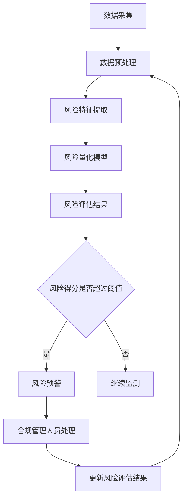

# 金融监管合规风险评估自动化平台

> 关键词：金融监管、合规风险评估、自动化平台、风险量化、机器学习

> 摘要：本文围绕金融监管合规风险评估自动化平台展开全面探讨。首先介绍了平台开发的背景、目的、预期读者等基础信息。接着详细阐述了核心概念、算法原理、数学模型等理论内容，通过Python代码对算法进行了具体实现和解释。然后结合实际项目，展示了开发环境搭建、源代码实现与解读等实践过程。还分析了平台的实际应用场景，推荐了相关学习资源、开发工具框架和论文著作。最后总结了平台的未来发展趋势与挑战，并提供常见问题解答和参考资料，旨在为金融行业从业者和相关技术人员提供全面的技术和实践指导，助力金融监管合规风险评估的自动化和智能化发展。

## 1. 背景介绍 
### 1.1 目的和范围
在金融行业，监管合规要求日益严格和复杂。传统的合规风险评估方式不仅效率低下，还容易出现人为误差，难以满足快速变化的监管环境和大规模业务数据的处理需求。金融监管合规风险评估自动化平台的目的在于利用先进的信息技术，实现对金融业务合规风险的快速、准确评估，提高评估效率和准确性，降低合规成本。

本平台的范围涵盖了多种金融业务类型，包括银行、证券、保险等领域的各类交易活动，能够对客户身份识别、反洗钱、反恐怖主义融资、市场交易合规等多个方面的风险进行评估。

### 1.2 预期读者
本文的预期读者包括金融机构的合规管理人员、风险评估人员、信息技术人员，以及对金融监管和合规风险评估自动化技术感兴趣的研究人员和学者。对于金融机构的从业人员，本文可作为实际工作中的技术参考和指导；对于研究人员和学者，可提供相关的理论和实践案例，为进一步的研究提供思路。

### 1.3 文档结构概述
本文将按照以下结构进行阐述：首先介绍核心概念与联系，明确平台所涉及的关键概念和它们之间的关系；接着详细讲解核心算法原理和具体操作步骤，通过Python代码进行示例；然后介绍数学模型和公式，并结合实例进行说明；之后通过项目实战，展示平台的开发环境搭建、源代码实现和代码解读；再分析平台的实际应用场景；推荐相关的工具和资源；最后总结平台的未来发展趋势与挑战，提供常见问题解答和参考资料。

### 1.4 术语表
#### 1.4.1 核心术语定义
- **金融监管**：指政府通过特定的机构（如中央银行、金融监管局等）对金融交易行为主体进行的某种限制或规定，旨在维持金融市场的稳定和安全。
- **合规风险**：指金融机构因未能遵循法律法规、监管要求、规则、自律性组织制定的有关准则，以及适用于金融机构自身业务活动的行为准则，而可能遭受法律制裁或监管处罚、重大财务损失或声誉损失的风险。
- **风险评估**：是对风险的可能性和影响程度进行分析和评价的过程，以确定风险的等级和应对措施。
- **自动化平台**：利用信息技术手段，实现业务流程自动化处理的系统，减少人工干预，提高工作效率和准确性。

#### 1.4.2 相关概念解释
- **机器学习**：是一门多领域交叉学科，涉及概率论、统计学、逼近论、凸分析、算法复杂度理论等多门学科。它专门研究计算机怎样模拟或实现人类的学习行为，以获取新的知识或技能，重新组织已有的知识结构使之不断改善自身的性能。在金融监管合规风险评估中，机器学习可用于数据挖掘、风险预测等任务。
- **数据挖掘**：是指从大量的数据中通过算法搜索隐藏于其中信息的过程。在金融领域，数据挖掘可用于发现潜在的合规风险模式和异常交易行为。

#### 1.4.3 缩略词列表
- **AML**：Anti - Money Laundering，反洗钱
- **CTF**：Countering the Financing of Terrorism，反恐怖主义融资
- **AI**：Artificial Intelligence，人工智能
- **ML**：Machine Learning，机器学习

## 2. 核心概念与联系 

### 核心概念原理
金融监管合规风险评估自动化平台主要基于以下几个核心概念：
- **数据采集**：从金融机构的各个业务系统、数据库中收集与业务交易、客户信息等相关的数据。这些数据是风险评估的基础，包括客户身份信息、交易记录、账户余额等。
- **数据预处理**：对采集到的数据进行清洗、转换和集成等操作，以提高数据的质量和可用性。例如，去除重复数据、处理缺失值、统一数据格式等。
- **风险特征提取**：从预处理后的数据中提取能够反映合规风险的特征。这些特征可以是交易金额、交易频率、交易时间、客户身份类型等。
- **风险量化模型**：利用机器学习、统计分析等方法，建立风险量化模型，对提取的风险特征进行分析和评估，计算出风险得分。
- **风险预警**：根据风险得分，设定相应的风险阈值，当风险得分超过阈值时，系统自动发出预警信号，提醒合规管理人员采取相应的措施。

### 架构的文本示意图
金融监管合规风险评估自动化平台的架构主要包括以下几个层次：
- **数据层**：负责数据的采集、存储和管理，包括各种业务数据库、数据仓库等。
- **处理层**：对数据进行预处理、特征提取和风险量化等操作，主要由数据处理模块、机器学习算法模块等组成。
- **应用层**：提供风险评估结果的展示、风险预警、合规报告生成等功能，包括用户界面、报表生成模块等。
- **管理层**：对平台的参数设置、用户权限管理、系统监控等进行管理，确保平台的正常运行和数据安全。

### Mermaid 流程图


## 3. 核心算法原理 & 具体操作步骤 

### 核心算法原理
在金融监管合规风险评估自动化平台中，常用的核心算法包括逻辑回归、决策树、随机森林等机器学习算法。这里以逻辑回归算法为例进行详细讲解。

逻辑回归是一种用于二分类问题的广义线性模型，它通过逻辑函数将线性回归的结果映射到[0, 1]区间，用于表示样本属于某个类别的概率。逻辑回归的基本公式为：

$$P(y = 1|x)=\frac{1}{1 + e^{-(w^T x + b)}}$$

其中，$x$ 是输入特征向量，$w$ 是权重向量，$b$ 是偏置项，$P(y = 1|x)$ 表示在输入特征 $x$ 的条件下，样本属于正类（$y = 1$）的概率。

### 具体操作步骤
以下是使用Python实现逻辑回归算法进行风险评估的具体步骤：

```python
import numpy as np
from sklearn.linear_model import LogisticRegression
from sklearn.model_selection import train_test_split
from sklearn.metrics import accuracy_score

# 1. 数据准备
# 假设我们有一个包含风险特征的数据集 X 和对应的风险标签 y
# 这里使用随机生成的数据作为示例
np.random.seed(0)
X = np.random.randn(100, 5)  # 100 个样本，每个样本有 5 个特征
y = np.random.randint(0, 2, 100)  # 随机生成 0 或 1 的标签

# 2. 数据划分
# 将数据集划分为训练集和测试集
X_train, X_test, y_train, y_test = train_test_split(X, y, test_size=0.2, random_state=42)

# 3. 模型训练
# 创建逻辑回归模型
model = LogisticRegression()
# 训练模型
model.fit(X_train, y_train)

# 4. 模型预测
# 对测试集进行预测
y_pred = model.predict(X_test)

# 5. 模型评估
# 计算模型的准确率
accuracy = accuracy_score(y_test, y_pred)
print(f"模型准确率: {accuracy}")
```

### 代码解释
- **数据准备**：使用 `numpy` 库随机生成了一个包含 100 个样本，每个样本有 5 个特征的数据集 `X`，以及对应的风险标签 `y`。
- **数据划分**：使用 `sklearn` 库的 `train_test_split` 函数将数据集划分为训练集和测试集，测试集占比为 20%。
- **模型训练**：创建 `LogisticRegression` 模型对象，并使用训练集数据对模型进行训练。
- **模型预测**：使用训练好的模型对测试集数据进行预测，得到预测结果 `y_pred`。
- **模型评估**：使用 `accuracy_score` 函数计算模型的准确率，即预测正确的样本数占总样本数的比例。

## 4. 数学模型和公式 & 详细讲解 & 举例说明 

### 逻辑回归的损失函数
逻辑回归的目标是找到一组最优的权重 $w$ 和偏置 $b$，使得模型对训练数据的预测结果尽可能接近真实标签。为了实现这个目标，我们需要定义一个损失函数来衡量模型预测结果与真实标签之间的差异。逻辑回归常用的损失函数是对数损失函数（Log Loss），也称为交叉熵损失函数（Cross - Entropy Loss）。

对于单个样本 $(x_i, y_i)$，对数损失函数的定义为：

$$L(y_i, \hat{y}_i)=-y_i\log(\hat{y}_i)-(1 - y_i)\log(1 - \hat{y}_i)$$

其中，$y_i$ 是真实标签（0 或 1），$\hat{y}_i$ 是模型预测的概率。

对于整个训练数据集，对数损失函数的定义为：

$$J(w, b)=\frac{1}{m}\sum_{i = 1}^{m}L(y_i, \hat{y}_i)$$

其中，$m$ 是训练样本的数量。

### 详细讲解
对数损失函数的作用是惩罚模型预测结果与真实标签之间的差异。当真实标签 $y_i = 1$ 时，损失函数变为 $- \log(\hat{y}_i)$，此时如果模型预测的概率 $\hat{y}_i$ 接近 1，则损失函数的值接近 0；如果 $\hat{y}_i$ 接近 0，则损失函数的值趋近于正无穷。当真实标签 $y_i = 0$ 时，损失函数变为 $- \log(1 - \hat{y}_i)$，情况类似。

为了找到最优的权重 $w$ 和偏置 $b$，我们通常使用梯度下降法来最小化损失函数 $J(w, b)$。梯度下降法的基本思想是沿着损失函数的负梯度方向更新权重和偏置，直到损失函数收敛到最小值。

### 举例说明
假设我们有一个简单的二分类问题，有两个样本 $(x_1, y_1)=(1, 1)$ 和 $(x_2, y_2)=(0, 0)$，模型预测的概率分别为 $\hat{y}_1 = 0.8$ 和 $\hat{y}_2 = 0.2$。

对于样本 $(x_1, y_1)$，损失函数的值为：

$$L(y_1, \hat{y}_1)=-y_1\log(\hat{y}_1)-(1 - y_1)\log(1 - \hat{y}_1)=-\log(0.8)\approx0.223$$

对于样本 $(x_2, y_2)$，损失函数的值为：

$$L(y_2, \hat{y}_2)=-y_2\log(\hat{y}_2)-(1 - y_2)\log(1 - \hat{y}_2)=-\log(1 - 0.2)=-\log(0.8)\approx0.223$$

整个数据集的损失函数值为：

$$J(w, b)=\frac{1}{2}(L(y_1, \hat{y}_1)+L(y_2, \hat{y}_2))=\frac{1}{2}(0.223 + 0.223)=0.223$$

## 5. 项目实战：代码实际案例和详细解释说明 

### 5.1  开发环境搭建
#### 硬件环境
- 服务器：建议使用多核处理器、较大内存（如 16GB 及以上）和足够的存储空间（如 500GB 及以上）的服务器，以满足大规模数据处理和模型训练的需求。
- 客户端：普通的台式机或笔记本电脑，具备基本的计算和显示能力即可。

#### 软件环境
- 操作系统：服务器端建议使用 Linux 系统（如 Ubuntu、CentOS 等），客户端可以使用 Windows、Mac OS 等操作系统。
- 编程语言：Python 3.x，是数据处理、机器学习和深度学习的常用编程语言，具有丰富的开源库和工具。
- 数据库：可以选择关系型数据库（如 MySQL、Oracle 等）或非关系型数据库（如 MongoDB、Redis 等），用于存储业务数据和模型训练结果。
- 开发框架：使用 `scikit - learn` 进行机器学习模型的开发，`pandas` 进行数据处理，`numpy` 进行数值计算，`Flask` 或 `Django` 搭建 Web 应用程序。

#### 安装步骤
1. 安装 Python 3.x：可以从 Python 官方网站（https://www.python.org/downloads/） 下载并安装。
2. 安装必要的 Python 库：使用 `pip` 命令进行安装，例如：
```sh
pip install scikit-learn pandas numpy flask
```
3. 安装数据库：根据选择的数据库类型，按照相应的官方文档进行安装和配置。

### 5.2  源代码详细实现和代码解读
以下是一个简单的金融监管合规风险评估自动化平台的 Web 应用程序示例，使用 Flask 框架实现：

```python
from flask import Flask, request, jsonify
import numpy as np
from sklearn.linear_model import LogisticRegression
import pandas as pd

# 加载训练好的模型
model = LogisticRegression()
# 假设我们已经有训练好的模型参数，这里简单模拟加载过程
# 实际应用中需要从文件或数据库中加载
model.coef_ = np.array([[0.1, 0.2, 0.3, 0.4, 0.5]])
model.intercept_ = np.array([0.1])

app = Flask(__name__)

@app.route('/risk_evaluation', methods=['POST'])
def risk_evaluation():
    try:
        # 获取请求中的数据
        data = request.get_json()
        # 将数据转换为 DataFrame 格式
        df = pd.DataFrame(data)
        # 提取特征
        X = df.values
        # 进行风险评估
        y_pred = model.predict(X)
        # 返回预测结果
        result = {'risk_labels': y_pred.tolist()}
        return jsonify(result)
    except Exception as e:
        return jsonify({'error': str(e)}), 500

if __name__ == '__main__':
    app.run(debug=True)
```

### 5.3  代码解读与分析
- **模型加载**：使用 `LogisticRegression` 类创建一个逻辑回归模型对象，并模拟加载训练好的模型参数。在实际应用中，需要从文件或数据库中加载真实的模型参数。
- **Flask 应用程序创建**：使用 `Flask` 框架创建一个 Web 应用程序，并定义一个 `/risk_evaluation` 的 POST 请求接口。
- **数据处理**：在接口函数中，首先获取请求中的 JSON 数据，然后将其转换为 `pandas` 的 `DataFrame` 格式，提取特征数据。
- **风险评估**：使用加载的模型对特征数据进行预测，得到风险标签。
- **结果返回**：将预测结果以 JSON 格式返回给客户端。如果发生异常，返回错误信息和 500 状态码。

## 6. 实际应用场景 
### 客户身份识别与反洗钱
金融机构在客户开户、进行大额交易等业务场景中，需要对客户的身份进行识别，防范洗钱风险。金融监管合规风险评估自动化平台可以通过对客户的身份信息、交易记录等数据进行分析，提取风险特征，如客户的职业、资金来源、交易频率和金额等，利用机器学习模型对客户的洗钱风险进行评估。当客户的风险得分超过设定的阈值时，系统自动发出预警，提醒合规管理人员进行进一步的调查和审核。

### 市场交易合规
在证券、期货等市场交易中，平台可以对交易行为进行实时监测，分析交易的时间、价格、数量等特征，判断是否存在内幕交易、操纵市场等违规行为。例如，通过分析交易数据的异常波动、交易模式的相似性等，识别潜在的违规交易行为，并及时发出预警，帮助监管机构和金融机构维护市场秩序。

### 信贷风险评估
在银行等金融机构的信贷业务中，平台可以对借款人的信用状况进行评估，预测借款人的违约风险。通过分析借款人的个人信息、财务状况、信用记录等数据，提取相关的风险特征，利用机器学习模型计算借款人的违约概率。银行可以根据违约概率来决定是否批准贷款申请、确定贷款额度和利率等，降低信贷风险。

## 7. 工具和资源推荐
### 7.1 学习资源推荐
#### 7.1.1 书籍推荐
- 《Python 机器学习》（Sebastian Raschka 著）：本书全面介绍了 Python 在机器学习领域的应用，包括数据预处理、模型选择、评估和优化等内容，适合初学者和有一定基础的开发者。
- 《深度学习》（Ian Goodfellow、Yoshua Bengio 和 Aaron Courville 著）：深度学习领域的经典著作，详细介绍了深度学习的基本原理、算法和应用，对理解机器学习在金融监管合规风险评估中的应用有很大帮助。
- 《金融科技：应用实践与未来展望》：本书结合金融行业的实际需求，介绍了金融科技的各种应用场景和技术，包括金融监管合规、风险评估等方面的内容。

#### 7.1.2 在线课程
- Coursera 上的 “机器学习” 课程（Andrew Ng 教授授课）：该课程是机器学习领域的经典入门课程，通过视频讲解、编程作业等方式，系统地介绍了机器学习的基本概念、算法和应用。
- edX 上的 “深度学习微硕士项目”：提供了深度学习的深入学习课程，包括神经网络、卷积神经网络、循环神经网络等内容，适合有一定机器学习基础的学习者。
- 中国大学 MOOC 上的 “金融科技概论” 课程：介绍了金融科技的基本概念、技术和应用，包括金融监管合规、风险评估等方面的内容，帮助学习者了解金融科技在金融行业的应用。

#### 7.1.3 技术博客和网站
- 机器学习中文社区（https://www.jiqizhixin.com/）：提供了丰富的机器学习、人工智能相关的技术文章、教程和案例，对金融监管合规风险评估自动化技术的学习有很大帮助。
- 金融科技前沿（https://www.fintechfrontier.com/）：专注于金融科技领域的最新动态、技术应用和行业趋势，为金融从业者和技术人员提供了一个交流和学习的平台。
- 数据派（https://www.datapi.cn/）：提供了大量的数据挖掘、机器学习、人工智能等领域的技术文章和案例，对金融数据处理和风险评估有一定的参考价值。

### 7.2 开发工具框架推荐
#### 7.2.1 IDE和编辑器
- PyCharm：是一款专门为 Python 开发设计的集成开发环境（IDE），具有代码编辑、调试、版本控制等功能，支持多种 Python 框架和库，适合开发金融监管合规风险评估自动化平台。
- Jupyter Notebook：是一个开源的 Web 应用程序，允许用户创建和共享包含代码、文本、可视化等内容的文档，非常适合数据探索、模型训练和验证等工作。
- Visual Studio Code：是一款轻量级的代码编辑器，支持多种编程语言和插件，具有丰富的扩展功能，可用于 Python 代码的开发和调试。

#### 7.2.2 调试和性能分析工具
- `pdb`：Python 内置的调试器，可以在代码中设置断点，逐行执行代码，查看变量的值和程序的执行流程，帮助开发者快速定位和解决问题。
- `cProfile`：Python 标准库中的性能分析工具，可以统计程序中各个函数的执行时间和调用次数，帮助开发者找出性能瓶颈，优化代码。
- TensorBoard：是 TensorFlow 提供的可视化工具，可以用于可视化深度学习模型的训练过程、损失函数的变化、模型结构等信息，帮助开发者更好地理解和优化模型。

#### 7.2.3 相关框架和库
- `scikit - learn`：是一个简单易用的机器学习库，提供了各种机器学习算法和工具，如分类、回归、聚类、降维等，适合快速开发和实现金融监管合规风险评估模型。
- `pandas`：是一个强大的数据处理和分析库，提供了数据结构（如 `DataFrame` 和 `Series`）和数据操作方法，方便对金融数据进行清洗、转换和分析。
- `numpy`：是 Python 中用于科学计算的基础库，提供了高效的多维数组对象和各种数学函数，是许多机器学习和数据分析库的基础。

### 7.3 相关论文著作推荐
#### 7.3.1 经典论文
- “Credit Risk Modeling Using the Merton Model”（Robert C. Merton 著）：该论文提出了著名的 Merton 模型，用于评估企业的信用风险，是信用风险评估领域的经典论文。
- “A Machine Learning Approach to Detecting Money Laundering Patterns”：介绍了使用机器学习算法检测洗钱模式的方法和技术，对金融监管合规风险评估中的反洗钱应用有重要参考价值。
- “Risk Assessment in Financial Markets: A Review of Quantitative Methods”：对金融市场中的风险评估定量方法进行了综述，包括风险度量、风险建模和风险管理等方面的内容。

#### 7.3.2 最新研究成果
- 近年来，随着人工智能和大数据技术的发展，越来越多的研究关注如何利用深度学习、强化学习等技术提高金融监管合规风险评估的准确性和效率。例如，一些研究提出了基于深度学习的风险预测模型，能够更好地处理复杂的金融数据和非线性关系。
- 还有研究关注如何将区块链技术应用于金融监管合规领域，利用区块链的不可篡改、可追溯等特性，提高金融数据的安全性和可信度，加强对金融交易的监管。

#### 7.3.3 应用案例分析
- 一些国际知名金融机构和监管机构已经在金融监管合规风险评估中应用了自动化技术，并取得了一定的成效。例如，美国证券交易委员会（SEC）利用数据分析和机器学习技术对市场交易进行监测，及时发现和查处内幕交易、操纵市场等违规行为。
- 一些银行通过建立自动化的信贷风险评估系统，提高了信贷审批的效率和准确性，降低了信贷风险。这些应用案例为其他金融机构和监管机构提供了宝贵的经验和参考。

## 8. 总结：未来发展趋势与挑战
### 未来发展趋势
- **智能化和自动化程度不断提高**：随着人工智能技术的不断发展，金融监管合规风险评估自动化平台将越来越智能化，能够自动学习和适应不断变化的监管要求和金融业务环境，实现更高效、准确的风险评估和预警。
- **多技术融合应用**：未来的平台将融合人工智能、区块链、大数据、云计算等多种技术，充分发挥各种技术的优势。例如，利用区块链技术保证金融数据的安全性和可信度，利用大数据技术进行大规模数据的存储和分析，利用云计算技术提供强大的计算能力。
- **跨行业、跨领域的监管协作**：金融行业与其他行业的联系日益紧密，未来的金融监管合规风险评估将不再局限于金融行业内部，而是需要与其他行业进行跨行业、跨领域的监管协作。例如，金融机构需要与电商平台、社交网络等合作，共享数据和信息，共同防范金融风险。

### 挑战
- **数据质量和安全问题**：金融监管合规风险评估依赖于大量的金融数据，数据的质量和安全直接影响评估结果的准确性和可靠性。如何保证数据的完整性、准确性和安全性，防止数据泄露和滥用，是一个重要的挑战。
- **技术复杂性和人才短缺**：人工智能、区块链等技术的应用增加了平台的技术复杂性，需要具备专业知识和技能的人才进行开发、维护和管理。目前，金融行业和技术领域的复合型人才短缺，如何培养和吸引相关人才是一个亟待解决的问题。
- **监管政策和法律的适应性**：随着金融科技的快速发展，新的金融业务模式和产品不断涌现，现有的监管政策和法律可能无法及时适应这些变化。如何制定和完善相关的监管政策和法律，保证金融监管合规风险评估自动化平台的合法合规运行，是一个重要的挑战。

## 9. 附录：常见问题与解答
### 1. 如何确保金融监管合规风险评估自动化平台的准确性？
- 确保数据质量是关键，对采集到的数据进行严格的清洗、验证和预处理，去除错误和缺失数据。
- 选择合适的机器学习算法和模型，并进行充分的训练和优化，使用交叉验证等方法评估模型的性能。
- 定期对模型进行更新和调整，以适应不断变化的金融业务和监管要求。

### 2. 平台如何处理大规模数据？
- 采用分布式计算和存储技术，如 Hadoop、Spark 等，提高数据处理和存储的效率。
- 进行数据采样和降维处理，减少数据量，同时保留重要的信息。
- 优化算法和代码，提高计算效率。

### 3. 平台的安全性如何保障？
- 采用数据加密技术，对敏感数据进行加密存储和传输，防止数据泄露。
- 建立严格的用户权限管理系统，对不同用户的操作权限进行控制。
- 定期进行安全审计和漏洞扫描，及时发现和修复安全漏洞。

### 4. 如何将平台与现有的金融业务系统集成？
- 可以通过 API 接口实现平台与现有业务系统的数据交互和共享。
- 对现有业务系统进行改造和升级，使其能够与平台兼容。
- 采用数据同步和更新机制，保证平台和现有业务系统的数据一致性。

## 10. 扩展阅读 & 参考资料
- 《金融科技时代的监管科技：内涵、应用与挑战》
- 《人工智能在金融风险管理中的应用研究》
- 金融监管机构发布的相关政策文件和报告
- 各金融机构的官方网站和年报，了解其在金融监管合规风险评估方面的实践和经验。