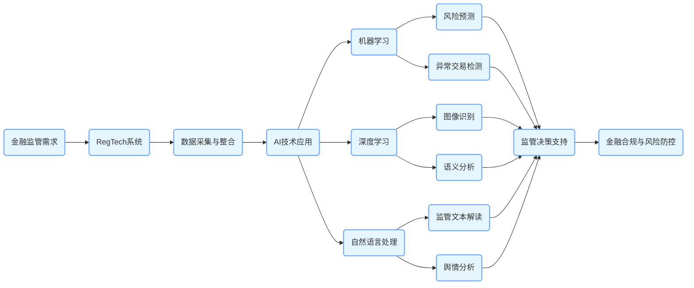

# 金融监管科技（RegTech）中的AI应用

> 关键词：金融监管科技、RegTech、人工智能、AI应用、金融合规、风险监测、数据分析

> 摘要：本文深入探讨了金融监管科技（RegTech）中人工智能（AI）的应用。首先介绍了金融监管科技的背景和相关概念，明确了研究目的、范围和预期读者。接着详细阐述了AI与RegTech相关的核心概念及联系，通过文本示意图和Mermaid流程图进行直观展示。对核心算法原理进行讲解，并结合Python源代码说明具体操作步骤。从数学模型和公式的角度深入剖析，辅以举例说明。通过项目实战，给出代码实际案例并详细解释。探讨了AI在金融监管科技中的实际应用场景，推荐了相关的学习资源、开发工具框架以及论文著作。最后总结了未来发展趋势与挑战，解答常见问题并提供扩展阅读和参考资料，旨在全面呈现AI在金融监管科技领域的重要作用和应用价值。

## 1. 背景介绍 
### 1.1 目的和范围
金融行业的监管环境日益复杂，传统的监管手段面临效率低、成本高、难以应对海量数据等挑战。金融监管科技（RegTech）应运而生，旨在利用先进的技术手段提升金融监管的效率和效果。本文的目的是深入研究人工智能（AI）在RegTech中的应用，探讨其原理、方法和实际效果。范围涵盖AI在金融合规、风险监测、反洗钱、客户身份识别等多个监管领域的应用，分析相关的算法、模型和技术实现。

### 1.2 预期读者
本文预期读者包括金融监管机构的工作人员、金融机构的合规与风险管理部门人员、科技企业中从事金融科技研发的技术人员、对金融监管科技和人工智能感兴趣的学者和研究人员。希望通过本文，能为不同背景的读者提供有价值的参考和启示，帮助他们更好地理解和应用AI技术提升金融监管水平。

### 1.3 文档结构概述
本文将按照以下结构展开：首先介绍金融监管科技及相关概念，为后续内容奠定基础；接着阐述AI与RegTech相关的核心概念及联系，通过可视化方式呈现；然后详细讲解核心算法原理和具体操作步骤，结合Python代码进行说明；从数学模型和公式角度深入剖析AI在RegTech中的应用；通过项目实战给出具体代码案例并进行详细解读；探讨AI在金融监管中的实际应用场景；推荐相关的学习资源、开发工具框架和论文著作；总结未来发展趋势与挑战；解答常见问题并提供扩展阅读和参考资料。

### 1.4 术语表
#### 1.4.1 核心术语定义
- **金融监管科技（RegTech）**：是指利用信息技术来辅助金融监管机构和金融机构满足监管要求，提升监管效率和效果的技术和服务。
- **人工智能（AI）**：是研究、开发用于模拟、延伸和扩展人的智能的理论、方法、技术及应用系统的一门新的技术科学。在金融监管科技中，AI主要包括机器学习、深度学习、自然语言处理等技术。
- **金融合规**：是指金融机构及其员工的经营管理和业务行为符合法律法规、监管要求、行业自律规则以及内部规章制度等规定。
- **风险监测**：是指对金融机构面临的各种风险进行识别、度量、分析和预警的过程。

#### 1.4.2 相关概念解释
- **机器学习**：是一门多领域交叉学科，涉及概率论、统计学、逼近论、凸分析、算法复杂度理论等多门学科。它专门研究计算机怎样模拟或实现人类的学习行为，以获取新的知识或技能，重新组织已有的知识结构使之不断改善自身的性能。在金融监管中，机器学习可用于风险预测、异常交易检测等。
- **深度学习**：是机器学习的一个分支领域，它是一种基于对数据进行表征学习的方法。深度学习通过构建具有很多层的神经网络模型，自动从大量数据中学习复杂的模式和特征。在金融监管中，深度学习可用于图像识别、自然语言处理等任务，例如对金融文件的语义分析。
- **自然语言处理（NLP）**：是计算机科学与语言学的交叉领域，旨在让计算机能够理解、处理和生成人类语言。在金融监管中，NLP可用于监管文本的解读、舆情分析等。

#### 1.4.3 缩略词列表
- **RegTech**：Regulatory Technology（金融监管科技）
- **AI**：Artificial Intelligence（人工智能）
- **ML**：Machine Learning（机器学习）
- **DL**：Deep Learning（深度学习）
- **NLP**：Natural Language Processing（自然语言处理）

## 2. 核心概念与联系 

### 2.1 核心概念原理
#### 2.1.1 金融监管科技（RegTech）原理
金融监管科技的核心原理是利用先进的信息技术手段，对金融业务数据进行采集、处理、分析和挖掘，以实现金融监管的自动化、智能化和高效化。通过建立监管规则引擎，将监管要求转化为计算机可执行的规则，对金融机构的业务数据进行实时监测和分析，及时发现违规行为和潜在风险。

#### 2.1.2 人工智能（AI）原理
人工智能的原理基于对人类智能的模拟和扩展。机器学习是AI的重要组成部分，其原理是通过对大量数据的学习和训练，构建模型来预测和分类新的数据。深度学习则通过构建多层神经网络，自动从数据中提取复杂的特征和模式。自然语言处理基于语言学和统计学原理，对文本数据进行分析和处理，实现语言的理解和生成。

### 2.2 核心概念联系
AI是推动RegTech发展的关键技术，为金融监管提供了强大的工具和方法。在金融合规方面，AI可以通过自然语言处理技术对监管文件进行解读，将监管要求转化为可执行的规则；利用机器学习和深度学习算法对金融机构的业务数据进行分析，监测是否符合监管要求。在风险监测方面，AI可以通过对历史数据的学习，构建风险预测模型，实时监测金融机构面临的各种风险，如信用风险、市场风险等。

### 2.3 文本示意图
金融监管科技（RegTech）与人工智能（AI）的关系可以用以下文本示意图表示：

RegTech（金融监管科技）
|
|-- AI（人工智能）
|   |-- 机器学习（ML）
|   |   |-- 监督学习
|   |   |-- 无监督学习
|   |   |-- 强化学习
|   |-- 深度学习（DL）
|   |   |-- 卷积神经网络（CNN）
|   |   |-- 循环神经网络（RNN）
|   |   |-- 长短时记忆网络（LSTM）
|   |-- 自然语言处理（NLP）
|       |-- 文本分类
|       |-- 命名实体识别
|       |-- 情感分析
|
|-- 数据采集与整合
|-- 监管规则引擎
|-- 可视化与报告

### 2.4 Mermaid流程图


## 3. 核心算法原理 & 具体操作步骤 

### 3.1 核心算法原理
#### 3.1.1 机器学习算法 - 逻辑回归
逻辑回归是一种常用的监督学习算法，用于二分类问题。其原理是通过对输入特征进行线性组合，然后通过逻辑函数（sigmoid函数）将线性组合的结果映射到[0, 1]区间，得到样本属于正类的概率。逻辑回归的目标是找到一组最优的参数，使得模型对训练数据的预测概率最大。

#### 3.1.2 深度学习算法 - 卷积神经网络（CNN）
卷积神经网络是一种专门用于处理具有网格结构数据（如图像、音频等）的深度学习模型。其核心原理是通过卷积层对输入数据进行特征提取，池化层对特征图进行降维，最后通过全连接层进行分类或回归。卷积层中的卷积核可以自动学习数据中的局部特征，从而提高模型的特征提取能力。

#### 3.1.3 自然语言处理算法 - 词嵌入（Word Embedding）
词嵌入是将文本中的单词表示为低维向量的技术。其原理是通过在大规模语料库上训练神经网络模型，使得语义相近的单词在向量空间中距离较近。常见的词嵌入模型有Word2Vec、GloVe等。词嵌入可以将文本数据转化为数值向量，便于机器学习和深度学习模型进行处理。

### 3.2 具体操作步骤
#### 3.2.1 数据准备
首先需要收集和整理金融监管相关的数据，包括金融业务数据、监管文件、舆情信息等。对数据进行清洗和预处理，去除噪声和缺失值，将数据转化为适合模型训练的格式。

#### 3.2.2 模型训练
根据具体的任务选择合适的AI模型，如逻辑回归、卷积神经网络、词嵌入模型等。使用训练数据对模型进行训练，调整模型的参数，使得模型在训练数据上的性能最优。

#### 3.2.3 模型评估
使用测试数据对训练好的模型进行评估，计算模型的准确率、召回率、F1值等评估指标，评估模型的性能。

#### 3.2.4 模型部署与应用
将训练好的模型部署到实际的金融监管系统中，对实时数据进行处理和分析，实现金融合规监测、风险预警等功能。

### 3.3 Python源代码示例
#### 3.3.1 逻辑回归示例
```python
import numpy as np
from sklearn.linear_model import LogisticRegression
from sklearn.model_selection import train_test_split
from sklearn.metrics import accuracy_score

# 生成示例数据
X = np.random.randn(100, 5)
y = np.random.randint(0, 2, 100)

# 划分训练集和测试集
X_train, X_test, y_train, y_test = train_test_split(X, y, test_size=0.2, random_state=42)

# 创建逻辑回归模型
model = LogisticRegression()

# 训练模型
model.fit(X_train, y_train)

# 预测
y_pred = model.predict(X_test)

# 评估模型
accuracy = accuracy_score(y_test, y_pred)
print(f"Accuracy: {accuracy}")
```

#### 3.3.2 卷积神经网络示例
```python
import tensorflow as tf
from tensorflow.keras.datasets import mnist
from tensorflow.keras.models import Sequential
from tensorflow.keras.layers import Conv2D, MaxPooling2D, Flatten, Dense

# 加载MNIST数据集
(x_train, y_train), (x_test, y_test) = mnist.load_data()

# 数据预处理
x_train = x_train.reshape(-1, 28, 28, 1).astype('float32') / 255.0
x_test = x_test.reshape(-1, 28, 28, 1).astype('float32') / 255.0
y_train = tf.keras.utils.to_categorical(y_train, 10)
y_test = tf.keras.utils.to_categorical(y_test, 10)

# 创建卷积神经网络模型
model = Sequential([
    Conv2D(32, (3, 3), activation='relu', input_shape=(28, 28, 1)),
    MaxPooling2D((2, 2)),
    Conv2D(64, (3, 3), activation='relu'),
    MaxPooling2D((2, 2)),
    Flatten(),
    Dense(64, activation='relu'),
    Dense(10, activation='softmax')
])

# 编译模型
model.compile(optimizer='adam',
              loss='categorical_crossentropy',
              metrics=['accuracy'])

# 训练模型
model.fit(x_train, y_train, epochs=5, batch_size=64)

# 评估模型
test_loss, test_acc = model.evaluate(x_test, y_test)
print(f"Test accuracy: {test_acc}")
```

#### 3.3.3 词嵌入示例
```python
from gensim.models import Word2Vec
import nltk
from nltk.tokenize import word_tokenize
nltk.download('punkt')

# 示例文本数据
sentences = [
    "I love natural language processing",
    "Natural language processing is interesting",
    "Machine learning is also great"
]

# 分词
tokenized_sentences = [word_tokenize(sentence.lower()) for sentence in sentences]

# 训练Word2Vec模型
model = Word2Vec(tokenized_sentences, min_count=1)

# 获取单词的向量表示
vector = model.wv['natural']
print(f"Vector for 'natural': {vector}")
```

## 4. 数学模型和公式 & 详细讲解 & 举例说明 

### 4.1 逻辑回归数学模型和公式
#### 4.1.1 线性组合
逻辑回归的线性组合公式为：
$$ z = \theta_0 + \theta_1x_1 + \theta_2x_2 + \cdots + \theta_nx_n = \theta^T x $$
其中，$\theta = [\theta_0, \theta_1, \cdots, \theta_n]^T$ 是模型的参数向量，$x = [1, x_1, x_2, \cdots, x_n]^T$ 是输入特征向量。

#### 4.1.2 逻辑函数（sigmoid函数）
逻辑函数将线性组合的结果映射到[0, 1]区间，公式为：
$$ h_{\theta}(x) = \frac{1}{1 + e^{-z}} = \frac{1}{1 + e^{-\theta^T x}} $$
$h_{\theta}(x)$ 表示样本属于正类的概率。

#### 4.1.3 损失函数
逻辑回归的损失函数通常使用对数损失函数，公式为：
$$ J(\theta) = -\frac{1}{m} \sum_{i=1}^{m} [y^{(i)}\log(h_{\theta}(x^{(i)})) + (1 - y^{(i)})\log(1 - h_{\theta}(x^{(i)}))] $$
其中，$m$ 是样本数量，$y^{(i)}$ 是第 $i$ 个样本的真实标签。

#### 4.1.4 举例说明
假设我们有一个二分类问题，输入特征向量 $x = [1, 2, 3]$，模型参数 $\theta = [0.1, 0.2, 0.3]$，则线性组合为：
$$ z = \theta^T x = 0.1\times1 + 0.2\times2 + 0.3\times3 = 0.1 + 0.4 + 0.9 = 1.4 $$
通过逻辑函数得到样本属于正类的概率为：
$$ h_{\theta}(x) = \frac{1}{1 + e^{-1.4}} \approx 0.802 $$

### 4.2 卷积神经网络数学模型和公式
#### 4.2.1 卷积操作
卷积操作的公式为：
$$ y_{i,j} = \sum_{m=0}^{M-1} \sum_{n=0}^{N-1} x_{i+m,j+n} w_{m,n} + b $$
其中，$x$ 是输入特征图，$w$ 是卷积核，$b$ 是偏置，$M$ 和 $N$ 是卷积核的尺寸，$y$ 是输出特征图。

#### 4.2.2 池化操作
最大池化操作的公式为：
$$ y_{i,j} = \max_{m=0}^{M-1} \max_{n=0}^{N-1} x_{i\times s + m,j\times s + n} $$
其中，$s$ 是池化步长，$M$ 和 $N$ 是池化窗口的尺寸。

#### 4.2.3 举例说明
假设我们有一个输入特征图 $x$ 是一个 $3\times3$ 的矩阵：
$$ x = \begin{bmatrix}
1 & 2 & 3 \\
4 & 5 & 6 \\
7 & 8 & 9
\end{bmatrix} $$
卷积核 $w$ 是一个 $2\times2$ 的矩阵：
$$ w = \begin{bmatrix}
1 & 2 \\
3 & 4
\end{bmatrix} $$
偏置 $b = 1$，则卷积操作的结果为：
$$ y_{0,0} = 1\times1 + 2\times2 + 4\times3 + 5\times4 + 1 = 1 + 4 + 12 + 20 + 1 = 38 $$
$$ y_{0,1} = 2\times1 + 3\times2 + 5\times3 + 6\times4 + 1 = 2 + 6 + 15 + 24 + 1 = 48 $$
$$ y_{1,0} = 4\times1 + 5\times2 + 7\times3 + 8\times4 + 1 = 4 + 10 + 21 + 32 + 1 = 68 $$
$$ y_{1,1} = 5\times1 + 6\times2 + 8\times3 + 9\times4 + 1 = 5 + 12 + 24 + 36 + 1 = 78 $$
输出特征图 $y$ 为：
$$ y = \begin{bmatrix}
38 & 48 \\
68 & 78
\end{bmatrix} $$

### 4.3 词嵌入数学模型和公式
#### 4.3.1 Word2Vec模型
Word2Vec模型的目标是最大化给定上下文单词预测中心单词的概率。以Skip-gram模型为例，其目标函数为：
$$ J(\theta) = \prod_{t=1}^{T} \prod_{-c\leq j\leq c, j\neq0} p(w_{t+j} | w_t; \theta) $$
其中，$T$ 是语料库中单词的数量，$c$ 是上下文窗口的大小，$w_t$ 是中心单词，$w_{t+j}$ 是上下文单词，$\theta$ 是模型的参数。

#### 4.3.2 负采样
为了提高训练效率，Word2Vec模型通常使用负采样技术。负采样的目标是最大化正样本的概率，同时最小化负样本的概率。负采样的目标函数为：
$$ J_{ns}(\theta) = \log\sigma(v_{w_O}^T v_{w_I}) + \sum_{i=1}^{k} \log\sigma(-v_{w_{N_i}}^T v_{w_I}) $$
其中，$v_{w_I}$ 是中心单词的向量表示，$v_{w_O}$ 是正样本上下文单词的向量表示，$v_{w_{N_i}}$ 是负样本单词的向量表示，$k$ 是负样本的数量，$\sigma$ 是sigmoid函数。

#### 4.3.3 举例说明
假设我们有一个语料库，其中包含句子 “I love natural language processing”。以 “natural” 为中心单词，上下文窗口大小 $c = 2$，则上下文单词为 “I”、“love”、“language”、“processing”。在训练Word2Vec模型时，模型会学习到 “natural” 及其上下文单词的向量表示，使得语义相近的单词在向量空间中距离较近。

## 5. 项目实战：代码实际案例和详细解释说明 

### 5.1 开发环境搭建
#### 5.1.1 安装Python
首先需要安装Python环境，建议使用Python 3.7及以上版本。可以从Python官方网站（https://www.python.org/downloads/）下载并安装。

#### 5.1.2 安装依赖库
使用pip命令安装项目所需的依赖库，包括NumPy、Pandas、Scikit-learn、TensorFlow、Gensim等。
```sh
pip install numpy pandas scikit-learn tensorflow gensim
```

### 5.2 源代码详细实现和代码解读
#### 5.2.1 异常交易检测项目
```python
import numpy as np
import pandas as pd
from sklearn.model_selection import train_test_split
from sklearn.ensemble import IsolationForest
from sklearn.metrics import classification_report

# 加载数据集
data = pd.read_csv('transaction_data.csv')

# 提取特征和标签
X = data.drop('label', axis=1)
y = data['label']

# 划分训练集和测试集
X_train, X_test, y_train, y_test = train_test_split(X, y, test_size=0.2, random_state=42)

# 创建Isolation Forest模型
model = IsolationForest(contamination=0.05)

# 训练模型
model.fit(X_train)

# 预测
y_pred = model.predict(X_test)

# 将预测结果转换为0和1
y_pred = [1 if x == -1 else 0 for x in y_pred]

# 评估模型
print(classification_report(y_test, y_pred))
```
代码解读：
1. **数据加载**：使用Pandas库读取包含交易数据的CSV文件。
2. **特征提取和标签分离**：从数据集中提取特征和标签。
3. **数据集划分**：使用Scikit-learn的`train_test_split`函数将数据集划分为训练集和测试集。
4. **模型创建**：创建Isolation Forest模型，`contamination`参数表示异常样本的比例。
5. **模型训练**：使用训练集数据对模型进行训练。
6. **模型预测**：使用测试集数据进行预测，并将预测结果转换为0和1。
7. **模型评估**：使用`classification_report`函数评估模型的性能，输出准确率、召回率、F1值等指标。

#### 5.2.2 监管文本分类项目
```python
import pandas as pd
from sklearn.feature_extraction.text import TfidfVectorizer
from sklearn.naive_bayes import MultinomialNB
from sklearn.model_selection import train_test_split
from sklearn.metrics import accuracy_score

# 加载数据集
data = pd.read_csv('regulatory_text_data.csv')

# 提取特征和标签
X = data['text']
y = data['label']

# 文本特征提取
vectorizer = TfidfVectorizer()
X = vectorizer.fit_transform(X)

# 划分训练集和测试集
X_train, X_test, y_train, y_test = train_test_split(X, y, test_size=0.2, random_state=42)

# 创建Multinomial Naive Bayes模型
model = MultinomialNB()

# 训练模型
model.fit(X_train, y_train)

# 预测
y_pred = model.predict(X_test)

# 评估模型
accuracy = accuracy_score(y_test, y_pred)
print(f"Accuracy: {accuracy}")
```
代码解读：
1. **数据加载**：使用Pandas库读取包含监管文本数据的CSV文件。
2. **特征提取和标签分离**：从数据集中提取文本特征和标签。
3. **文本特征提取**：使用`TfidfVectorizer`将文本数据转换为TF-IDF特征向量。
4. **数据集划分**：使用`train_test_split`函数将数据集划分为训练集和测试集。
5. **模型创建**：创建Multinomial Naive Bayes模型。
6. **模型训练**：使用训练集数据对模型进行训练。
7. **模型预测**：使用测试集数据进行预测。
8. **模型评估**：使用`accuracy_score`函数评估模型的准确率。

### 5.3 代码解读与分析
#### 5.3.1 异常交易检测项目分析
Isolation Forest是一种无监督学习算法，用于检测数据中的异常值。在异常交易检测项目中，我们假设异常交易数据在数据集中所占比例较小，因此可以使用Isolation Forest算法进行检测。通过设置`contamination`参数，可以控制异常样本的比例。模型的评估指标包括准确率、召回率、F1值等，这些指标可以帮助我们评估模型的性能。

#### 5.3.2 监管文本分类项目分析
Multinomial Naive Bayes是一种基于贝叶斯定理的分类算法，适用于文本分类任务。在监管文本分类项目中，我们使用TF-IDF特征提取方法将文本数据转换为数值特征向量，然后使用Multinomial Naive Bayes模型进行分类。模型的评估指标主要是准确率，准确率越高，说明模型的分类性能越好。

## 6. 实际应用场景 
### 6.1 金融合规监测
AI技术可以帮助金融机构自动监测业务活动是否符合监管要求。通过自然语言处理技术对监管文件进行解读，将监管要求转化为可执行的规则；利用机器学习和深度学习算法对金融机构的业务数据进行分析，监测是否存在违规行为。例如，对银行的贷款业务进行监测，检查贷款审批流程是否符合监管要求，贷款额度是否超过规定上限等。

### 6.2 风险监测与预警
AI可以通过对历史数据的学习，构建风险预测模型，实时监测金融机构面临的各种风险，如信用风险、市场风险、操作风险等。例如，利用机器学习算法对客户的信用数据进行分析，预测客户的违约概率；通过深度学习算法对市场数据进行分析，预测市场趋势和风险。当监测到风险超过一定阈值时，系统可以及时发出预警，提醒金融机构采取相应的措施。

### 6.3 反洗钱监测
AI技术可以帮助金融机构识别可疑的洗钱交易。通过对客户的交易数据进行分析，利用机器学习和深度学习算法发现异常的交易模式和行为。例如，监测客户的大额资金频繁转移、跨地区交易等行为，识别可能的洗钱活动。同时，AI还可以对客户的身份信息进行验证和分析，防止身份盗用和虚假开户等洗钱手段。

### 6.4 客户身份识别
AI可以利用图像识别和自然语言处理技术，对客户的身份信息进行验证和识别。例如，通过人脸识别技术对客户的身份证照片和现场照片进行比对，验证客户的身份真实性；利用自然语言处理技术对客户的身份信息文本进行分析，检查信息的完整性和准确性。

### 6.5 监管报告生成
AI可以自动收集和分析金融机构的业务数据，生成符合监管要求的报告。通过自然语言生成技术，将数据分析结果转化为清晰、准确的文本报告。例如，自动生成金融机构的财务报表、风险评估报告等，提高监管报告的生成效率和质量。

## 7. 工具和资源推荐
### 7.1 学习资源推荐
#### 7.1.1 书籍推荐
- 《机器学习》（周志华）：全面介绍了机器学习的基本概念、算法和应用，是机器学习领域的经典教材。
- 《深度学习》（Ian Goodfellow、Yoshua Bengio、Aaron Courville）：深入探讨了深度学习的原理、方法和应用，是深度学习领域的权威著作。
- 《自然语言处理入门》（何晗）：系统介绍了自然语言处理的基本概念、算法和应用，适合初学者学习。

#### 7.1.2 在线课程
- Coursera上的“机器学习”课程（Andrew Ng教授）：是一门非常经典的机器学习入门课程，讲解详细，案例丰富。
- edX上的“深度学习微专业”课程：由深度学习领域的知名学者授课，涵盖深度学习的多个方向。
- 中国大学MOOC上的“自然语言处理”课程：国内知名高校的教授授课，内容全面，适合国内学生学习。

#### 7.1.3 技术博客和网站
- Medium：是一个技术博客平台，有很多关于人工智能、金融科技等领域的优质文章。
- arXiv：是一个预印本数据库，提供了大量的学术论文，包括AI和RegTech领域的最新研究成果。
- 机器之心：是一个专注于人工智能领域的科技媒体，提供了丰富的技术文章和行业资讯。

### 7.2 开发工具框架推荐
#### 7.2.1 IDE和编辑器
- PyCharm：是一款专门为Python开发设计的集成开发环境，功能强大，支持代码调试、自动补全、版本控制等功能。
- Jupyter Notebook：是一个交互式的开发环境，适合数据探索、模型训练和实验验证。
- Visual Studio Code：是一款轻量级的代码编辑器，支持多种编程语言和插件扩展，可用于AI和RegTech项目的开发。

#### 7.2.2 调试和性能分析工具
- TensorBoard：是TensorFlow的可视化工具，可用于查看模型的训练过程、性能指标、网络结构等。
- PyTorch Profiler：是PyTorch的性能分析工具，可用于分析模型的运行时间、内存使用情况等。
- Scikit-learn的GridSearchCV：可用于模型的超参数调优，通过网格搜索的方式找到最优的超参数组合。

#### 7.2.3 相关框架和库
- TensorFlow：是一个开源的深度学习框架，提供了丰富的深度学习模型和工具，可用于构建和训练各种AI模型。
- PyTorch：是另一个流行的深度学习框架，具有动态图机制，易于使用和调试。
- Scikit-learn：是一个简单易用的机器学习库，提供了各种机器学习算法和工具，适合快速开发和实验。
- Gensim：是一个用于主题建模、文档索引和相似性检索的Python库，可用于自然语言处理任务。

### 7.3 相关论文著作推荐
#### 7.3.1 经典论文
- “Deep Learning”（Yoshua Bengio、Ian Goodfellow、Aaron Courville）：是深度学习领域的经典综述论文，全面介绍了深度学习的发展历程、原理和应用。
- “Attention Is All You Need”（Ashish Vaswani等人）：提出了Transformer模型，是自然语言处理领域的重要突破。
- “Isolation Forest”（Fei Tony Liu等人）：介绍了Isolation Forest算法，是异常检测领域的经典论文。

#### 7.3.2 最新研究成果
- 在顶级学术会议（如NeurIPS、ICML、ACL等）和期刊（如Journal of Artificial Intelligence Research、Journal of Machine Learning Research等）上查找关于AI和RegTech的最新研究论文。
- 关注知名研究机构（如斯坦福大学、麻省理工学院、谷歌研究院等）的研究成果。

#### 7.3.3 应用案例分析
- 金融机构（如银行、证券、保险等）发布的关于AI在金融监管中的应用案例报告。
- 咨询公司（如麦肯锡、波士顿咨询等）发布的关于金融科技和RegTech的研究报告和案例分析。

## 8. 总结：未来发展趋势与挑战
### 8.1 未来发展趋势
#### 8.1.1 智能化程度不断提高
未来，AI在金融监管科技中的应用将更加智能化。深度学习、强化学习等技术将不断发展，使得AI模型能够自动学习和适应复杂的金融监管环境，提高监管的准确性和效率。

#### 8.1.2 跨领域融合加深
AI将与区块链、物联网等技术深度融合，共同推动金融监管科技的发展。例如，区块链技术可以提供可信的数据存储和共享平台，物联网技术可以实时采集金融业务数据，与AI技术结合可以实现更加全面、实时的金融监管。

#### 8.1.3 监管沙箱模式推广
监管沙箱模式将得到更广泛的推广和应用。监管沙箱为金融科技创新提供了一个安全的试验环境，允许金融机构和科技企业在一定范围内进行创新实践，同时监管机构可以实时监测和评估创新的风险和效果。

#### 8.1.4 国际合作加强
随着金融全球化的发展，国际间的金融监管合作将不断加强。各国监管机构将共同研究和制定AI在金融监管中的标准和规范，促进AI技术在全球金融监管领域的应用和发展。

### 8.2 挑战
#### 8.2.1 数据隐私和安全问题
AI在金融监管中需要处理大量的敏感金融数据，数据隐私和安全问题是一个重要挑战。如何保护客户的个人信息和金融数据不被泄露和滥用，是需要解决的关键问题。

#### 8.2.2 算法可解释性问题
深度学习等AI算法通常是黑盒模型，其决策过程难以解释。在金融监管中，监管机构和金融机构需要了解AI模型的决策依据，以便进行风险评估和监管决策。因此，提高AI算法的可解释性是一个重要挑战。

#### 8.2.3 技术人才短缺
AI和金融监管科技是跨学科领域，需要既懂AI技术又懂金融业务和监管知识的复合型人才。目前，这类技术人才短缺，制约了AI在金融监管科技中的应用和发展。

#### 8.2.4 监管政策和法规滞后
AI技术发展迅速，而相关的监管政策和法规相对滞后。如何制定适应AI发展的监管政策和法规，确保AI在金融监管中的合法、合规应用，是需要解决的问题。

## 9. 附录：常见问题与解答
### 9.1 AI在金融监管科技中的应用是否会取代人类监管人员？
不会。AI在金融监管科技中的应用是为了辅助人类监管人员，提高监管效率和效果。虽然AI可以处理大量的数据和复杂的任务，但人类监管人员的经验、判断力和决策能力仍然是不可或缺的。AI和人类监管人员可以相互协作，共同完成金融监管任务。

### 9.2 如何确保AI模型在金融监管中的准确性和可靠性？
可以通过以下方法确保AI模型的准确性和可靠性：
1. **数据质量**：确保训练数据的质量，包括数据的准确性、完整性和一致性。
2. **模型评估**：使用多种评估指标对模型进行评估，如准确率、召回率、F1值等。
3. **模型验证**：使用独立的测试数据集对模型进行验证，确保模型在新数据上的性能。
4. **模型监控**：实时监控模型的性能，当模型性能下降时及时进行调整和优化。

### 9.3 AI在金融监管科技中的应用面临哪些法律和伦理问题？
AI在金融监管科技中的应用面临以下法律和伦理问题：
1. **数据隐私**：如何保护客户的个人信息和金融数据不被泄露和滥用。
2. **算法歧视**：AI模型可能存在对某些群体的歧视，如性别、种族等。
3. **责任认定**：当AI模型出现错误或失误时，如何确定责任主体。
4. **透明度**：AI模型的决策过程需要具有透明度，以便监管机构和金融机构进行监督和审查。

### 9.4 如何提高金融机构员工对AI在金融监管科技中应用的接受度？
可以通过以下方法提高金融机构员工对AI应用的接受度：
1. **培训和教育**：为员工提供相关的培训和教育，让他们了解AI技术的原理、应用和优势。
2. **沟通和交流**：与员工进行沟通和交流，听取他们的意见和建议，让他们参与到AI应用的过程中。
3. **案例分享**：分享AI在金融监管科技中成功应用的案例，让员工看到AI的实际效果。
4. **激励机制**：建立激励机制，鼓励员工积极参与和支持AI应用。

## 10. 扩展阅读 & 参考资料
### 10.1 扩展阅读
- 《金融科技：框架与实践》
- 《AI未来：科技驱动金融创新》
- 《区块链与金融监管》

### 10.2 参考资料
1. 周志华. 机器学习[M]. 清华大学出版社, 2016.
2. Ian Goodfellow, Yoshua Bengio, Aaron Courville. Deep Learning[M]. MIT Press, 2016.
3. 何晗. 自然语言处理入门[M]. 人民邮电出版社, 2019.
4. Fei Tony Liu, Kai Ming Ting, Zhi-Hua Zhou. Isolation Forest[C]. Proceedings of the 2008 Eighth IEEE International Conference on Data Mining, 2008.
5. Ashish Vaswani, Noam Shazeer, Niki Parmar, et al. Attention Is All You Need[C]. Advances in Neural Information Processing Systems 30, 2017.