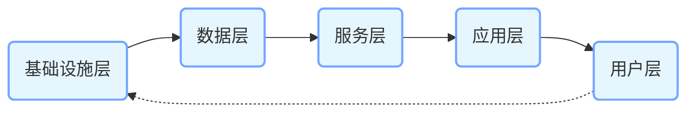

# 金融科技创新孵化平台

> 关键词：金融科技、创新孵化平台、区块链、人工智能、大数据、云计算、监管科技

> 摘要：本文围绕金融科技创新孵化平台展开深入探讨。首先介绍了其产生的背景、目的、预期读者等内容。接着详细阐述了金融科技创新孵化平台的核心概念与联系，包括其原理和架构，并配以Mermaid流程图辅助理解。核心算法原理部分用Python代码进行了详细讲解，同时给出了相关的数学模型和公式。在项目实战中，展示了开发环境搭建、源代码实现及解读。随后分析了该平台的实际应用场景，推荐了学习资源、开发工具框架以及相关论文著作。最后总结了其未来发展趋势与挑战，并在附录中解答了常见问题，提供了扩展阅读与参考资料，旨在全面深入地剖析金融科技创新孵化平台，为相关领域的研究和实践提供有价值的参考。

## 1. 背景介绍 
### 1.1 目的和范围
金融科技创新孵化平台的目的在于推动金融科技领域的创新发展，加速新技术在金融行业的应用和落地。通过提供资源整合、技术支持、创业指导等服务，帮助金融科技初创企业和创新团队降低创业门槛，提高创新成功率。其范围涵盖了多种金融科技领域，如区块链、人工智能、大数据、云计算等在金融业务中的应用，包括支付结算、信贷融资、投资管理、保险科技等多个金融细分领域的创新探索。

### 1.2 预期读者
本文的预期读者包括金融科技领域的创业者、从业者，对金融科技感兴趣的研究人员、学者，以及金融监管机构的相关人员。创业者可以从本文中获取关于金融科技创新孵化平台的详细信息，了解如何借助平台实现自身的创新项目；从业者能够通过本文深入了解行业发展动态和趋势，为自身的职业发展提供参考；研究人员和学者可以将本文作为研究金融科技生态系统的重要资料；金融监管机构人员可以通过本文更好地理解金融科技创新的模式和风险，以便制定合理的监管政策。

### 1.3 文档结构概述
本文首先介绍金融科技创新孵化平台的背景信息，包括目的、预期读者和文档结构等。接着阐述核心概念与联系，帮助读者理解平台的基本原理和架构。然后详细讲解核心算法原理和具体操作步骤，通过Python代码进行示例。之后给出相关的数学模型和公式，并举例说明。在项目实战部分，展示开发环境搭建、源代码实现及代码解读。再分析实际应用场景，为读者呈现平台的实际价值。随后推荐学习资源、开发工具框架和相关论文著作。最后总结未来发展趋势与挑战，在附录中解答常见问题，并提供扩展阅读与参考资料。

### 1.4 术语表
#### 1.4.1 核心术语定义
- **金融科技（FinTech）**：指金融与科技的融合，利用各类科技手段创新传统金融行业所提供的产品和服务，提升效率并有效降低运营成本。
- **创新孵化平台**：是一种为创新项目和初创企业提供资源、服务和支持的平台，旨在促进创新成果的转化和商业化。
- **区块链（Blockchain）**：是一种分布式账本技术，通过去中心化、不可篡改、共识机制等特点，实现数据的安全存储和可信传输，在金融领域有广泛应用前景。
- **人工智能（Artificial Intelligence）**：研究如何使计算机能够模拟人类的智能行为，包括机器学习、自然语言处理、计算机视觉等技术，可应用于金融风险评估、客户服务等方面。
- **大数据（Big Data）**：指海量、高增长率和多样化的信息资产，通过对大数据的分析和挖掘，可以为金融决策提供支持。
- **云计算（Cloud Computing）**：是一种基于互联网的计算方式，通过将计算资源、存储资源等提供给用户，实现资源的共享和高效利用，降低金融机构的运营成本。
- **监管科技（RegTech）**：指利用科技手段帮助金融机构更好地满足监管要求，提高监管效率，降低合规成本。

#### 1.4.2 相关概念解释
- **金融科技生态系统**：由金融机构、科技企业、监管机构、投资者、创业者等多个参与主体构成的生态系统，各主体之间相互协作、相互影响，共同推动金融科技的发展。
- **创新生态**：强调创新过程中各要素之间的相互作用和协同发展，包括创新主体、创新资源、创新环境等，金融科技创新孵化平台是创新生态的重要组成部分。
- **金融创新**：指在金融领域内创造新的金融产品、服务、技术、业务模式等，以满足不断变化的市场需求和提升金融效率。

#### 1.4.3 缩略词列表
- **AI**：Artificial Intelligence（人工智能）
- **BD**：Big Data（大数据）
- **BC**：Blockchain（区块链）
- **CC**：Cloud Computing（云计算）
- **RT**：RegTech（监管科技）

## 2. 核心概念与联系 
金融科技创新孵化平台是一个综合性的服务平台，其核心目标是促进金融科技领域的创新和创业。它通过整合金融机构、科技企业、投资者、科研机构等多方资源，为金融科技初创企业和创新团队提供全方位的支持和服务。

### 核心概念原理
金融科技创新孵化平台的原理基于资源整合和协同创新。平台汇聚了资金、技术、人才、市场等多种资源，通过合理的配置和管理，将这些资源提供给有创新需求的企业和团队。同时，平台促进不同主体之间的交流与合作，形成协同创新的氛围，加速创新项目的孵化和成长。

### 架构的文本示意图
金融科技创新孵化平台的架构主要包括以下几个层次：
1. **基础设施层**：提供硬件设施、网络环境、云计算资源等基础支撑，确保平台的稳定运行。
2. **数据层**：收集、存储和管理各类金融科技相关的数据，包括市场数据、用户数据、创新项目数据等，为平台的决策和服务提供数据支持。
3. **服务层**：提供多种服务，如技术咨询、创业培训、项目孵化、投融资对接等，满足不同创新主体的需求。
4. **应用层**：包括各类金融科技应用和创新项目，这些项目在平台的支持下得以开发、测试和推广。
5. **用户层**：涵盖金融科技创业者、金融机构、投资者、监管机构等不同类型的用户，他们通过平台进行交流、合作和互动。

### Mermaid 流程图


这个流程图展示了金融科技创新孵化平台各层次之间的关系。基础设施层为数据层提供基础支撑，数据层为服务层提供数据支持，服务层支持应用层的开发和运行，应用层面向用户层提供服务，而用户层的需求和反馈又会反过来影响基础设施层的建设和优化。

## 3. 核心算法原理 & 具体操作步骤 
### 核心算法原理
在金融科技创新孵化平台中，一个重要的算法是项目评估算法，用于对提交到平台的创新项目进行评估和筛选，以确定哪些项目具有较高的潜力和价值，值得平台给予更多的支持和资源。以下是一个基于机器学习的项目评估算法原理：

我们可以使用逻辑回归算法对项目进行分类评估，判断项目是否具有高潜力。逻辑回归是一种广泛应用于分类问题的机器学习算法，它通过对输入特征进行线性组合，然后使用逻辑函数将结果映射到[0, 1]区间，得到一个概率值，根据这个概率值来进行分类决策。

### Python源代码实现
```python
import numpy as np
from sklearn.linear_model import LogisticRegression
from sklearn.model_selection import train_test_split
from sklearn.metrics import accuracy_score

# 模拟项目数据
# 假设有4个特征：技术创新性、市场需求、团队实力、商业可行性
# 每个特征的值范围为0-10
# 标签：0表示低潜力项目，1表示高潜力项目
X = np.array([
    [7, 8, 6, 7],
    [3, 4, 3, 4],
    [6, 7, 5, 6],
    [2, 3, 2, 3],
    [8, 9, 7, 8],
    [4, 5, 4, 5]
])
y = np.array([1, 0, 1, 0, 1, 0])

# 划分训练集和测试集
X_train, X_test, y_train, y_test = train_test_split(X, y, test_size=0.2, random_state=42)

# 创建逻辑回归模型
model = LogisticRegression()

# 训练模型
model.fit(X_train, y_train)

# 预测测试集
y_pred = model.predict(X_test)

# 计算准确率
accuracy = accuracy_score(y_test, y_pred)
print(f"模型准确率: {accuracy}")

# 对新的项目进行预测
new_project = np.array([[7, 8, 6, 7]])
prediction = model.predict(new_project)
print(f"新项目的预测结果: {'高潜力项目' if prediction[0] == 1 else '低潜力项目'}")
```

### 具体操作步骤
1. **数据准备**：收集和整理项目相关的数据，包括项目的各种特征和对应的标签（高潜力或低潜力）。
2. **数据预处理**：对数据进行清洗、归一化等处理，确保数据的质量和一致性。
3. **划分数据集**：将数据集划分为训练集和测试集，一般按照80:20或70:30的比例进行划分。
4. **模型选择**：选择合适的机器学习模型，如逻辑回归、决策树、随机森林等。
5. **模型训练**：使用训练集对模型进行训练，调整模型的参数，使其能够准确地对项目进行分类。
6. **模型评估**：使用测试集对训练好的模型进行评估，计算准确率、召回率、F1值等指标，评估模型的性能。
7. **预测应用**：使用训练好的模型对新的项目进行预测，判断其是否具有高潜力。

## 4. 数学模型和公式 & 详细讲解 & 举例说明 
### 逻辑回归数学模型和公式
逻辑回归的数学模型基于线性回归模型，通过逻辑函数将线性回归的输出映射到[0, 1]区间，得到一个概率值。

线性回归模型的表达式为：
$$ z = \theta_0 + \theta_1x_1 + \theta_2x_2 + \cdots + \theta_nx_n = \theta^T x $$
其中，$z$ 是线性回归的输出，$\theta$ 是模型的参数向量，$x$ 是输入特征向量。

逻辑函数（也称为 sigmoid 函数）的表达式为：
$$ h_{\theta}(x) = \frac{1}{1 + e^{-z}} = \frac{1}{1 + e^{-\theta^T x}} $$
$h_{\theta}(x)$ 表示在给定输入特征 $x$ 和模型参数 $\theta$ 的情况下，样本属于正类（高潜力项目）的概率。

逻辑回归的损失函数（对数损失函数）为：
$$ J(\theta) = -\frac{1}{m} \sum_{i=1}^{m} [y^{(i)} \log(h_{\theta}(x^{(i)})) + (1 - y^{(i)}) \log(1 - h_{\theta}(x^{(i)}))] $$
其中，$m$ 是样本数量，$y^{(i)}$ 是第 $i$ 个样本的真实标签，$h_{\theta}(x^{(i)})$ 是第 $i$ 个样本的预测概率。

### 详细讲解
逻辑回归的目标是通过最小化损失函数 $J(\theta)$ 来找到最优的模型参数 $\theta$。可以使用梯度下降等优化算法来更新参数 $\theta$，直到损失函数收敛。

梯度下降算法的参数更新公式为：
$$ \theta_j := \theta_j - \alpha \frac{\partial J(\theta)}{\partial \theta_j} $$
其中，$\alpha$ 是学习率，控制参数更新的步长。

### 举例说明
假设我们有一个简单的逻辑回归问题，只有一个特征 $x$，模型参数 $\theta_0 = 0.5$，$\theta_1 = 1$。对于一个输入样本 $x = 2$，我们可以计算线性回归的输出 $z$：
$$ z = \theta_0 + \theta_1x = 0.5 + 1 \times 2 = 2.5 $$
然后计算逻辑函数的输出 $h_{\theta}(x)$：
$$ h_{\theta}(x) = \frac{1}{1 + e^{-2.5}} \approx 0.924 $$
这表示该样本属于正类（高潜力项目）的概率约为 0.924。

## 5. 项目实战：代码实际案例和详细解释说明 
### 5.1  开发环境搭建
#### 操作系统
可以选择 Linux（如 Ubuntu）、Windows 或 macOS 作为开发环境的操作系统。

#### 编程语言和工具
- **Python**：作为主要的编程语言，版本建议使用 Python 3.7 及以上。
- **Anaconda**：用于管理 Python 环境和安装相关的库，方便快捷。

#### 库和框架
- **NumPy**：用于数值计算和数组操作。
- **Pandas**：用于数据处理和分析。
- **Scikit-learn**：用于机器学习模型的实现和训练。
- **Flask**：用于构建 Web 应用，实现金融科技创新孵化平台的前端界面和接口。

#### 数据库
可以选择 MySQL 或 MongoDB 作为数据库，用于存储项目数据、用户信息等。

### 5.2  源代码详细实现和代码解读
以下是一个简单的基于 Flask 的金融科技创新孵化平台的示例代码：

```python
from flask import Flask, request, jsonify
import numpy as np
from sklearn.linear_model import LogisticRegression

app = Flask(__name__)

# 模拟训练好的模型
# 假设有4个特征：技术创新性、市场需求、团队实力、商业可行性
X = np.array([
    [7, 8, 6, 7],
    [3, 4, 3, 4],
    [6, 7, 5, 6],
    [2, 3, 2, 3],
    [8, 9, 7, 8],
    [4, 5, 4, 5]
])
y = np.array([1, 0, 1, 0, 1, 0])

model = LogisticRegression()
model.fit(X, y)

@app.route('/predict', methods=['POST'])
def predict():
    data = request.get_json()
    features = np.array([data['technology_innovation'], data['market_demand'], data['team_strength'], data['business_feasibility']])
    features = features.reshape(1, -1)
    prediction = model.predict(features)
    result = '高潜力项目' if prediction[0] == 1 else '低潜力项目'
    return jsonify({'prediction': result})

if __name__ == '__main__':
    app.run(debug=True)
```

### 代码解读与分析
1. **导入必要的库**：导入 Flask 用于构建 Web 应用，导入 NumPy 和 LogisticRegression 用于数据处理和机器学习模型。
2. **创建 Flask 应用**：使用 `Flask(__name__)` 创建一个 Flask 应用实例。
3. **模拟训练好的模型**：使用示例数据训练一个逻辑回归模型，用于项目评估。
4. **定义 API 接口**：使用 `@app.route('/predict', methods=['POST'])` 定义一个 POST 请求的接口 `/predict`，用于接收项目的特征数据并进行预测。
5. **处理请求数据**：在 `predict` 函数中，使用 `request.get_json()` 获取请求的 JSON 数据，将其转换为特征向量。
6. **进行预测**：使用训练好的模型对特征向量进行预测，得到预测结果。
7. **返回结果**：将预测结果以 JSON 格式返回给客户端。

## 6. 实际应用场景 
### 金融科技初创企业孵化
金融科技创新孵化平台为金融科技初创企业提供了一个良好的发展环境。初创企业可以在平台上获取资金支持，通过平台的投融资对接服务，与投资者进行沟通和合作，解决资金难题。同时，平台提供的技术咨询和创业培训服务，帮助初创企业提升技术水平和管理能力，加速产品的研发和推广。例如，一些专注于区块链支付的初创企业，通过平台的资源整合，能够更快地完成产品的开发和测试，进入市场。

### 金融机构创新项目支持
金融机构可以利用金融科技创新孵化平台开展内部创新项目。平台为金融机构提供了一个开放的创新生态系统，金融机构可以与科技企业、科研机构等合作，共同开展创新项目。例如，银行可以与人工智能科技公司合作，利用平台的资源和技术，开发智能客服系统，提升客户服务效率和质量。

### 金融科技人才培养
金融科技创新孵化平台是一个汇聚金融和科技人才的平台。通过平台的交流活动和项目实践，金融科技人才可以不断学习和提升自己的能力。同时，平台也为高校和科研机构提供了一个实践教学的平台，学生可以参与平台的创新项目，积累实践经验，为未来的职业发展打下基础。

### 金融监管创新
金融科技创新孵化平台可以为金融监管机构提供一个了解金融科技创新动态的窗口。监管机构可以通过平台收集金融科技项目的数据和信息，利用监管科技手段对项目进行风险监测和评估。例如，监管机构可以利用大数据分析技术，对金融科技项目的交易数据进行监测，及时发现潜在的风险，制定相应的监管政策。

## 7. 工具和资源推荐
### 7.1 学习资源推荐
#### 7.1.1 书籍推荐
- 《金融科技：架构与实践》：全面介绍了金融科技的概念、技术和应用，对金融科技的架构和实践进行了深入探讨。
- 《区块链：技术驱动金融》：详细介绍了区块链技术的原理、应用和发展趋势，是了解区块链技术在金融领域应用的重要书籍。
- 《人工智能：现代方法》：经典的人工智能教材，涵盖了人工智能的各个方面，包括机器学习、自然语言处理、计算机视觉等。

#### 7.1.2 在线课程
- Coursera 上的“Financial Technology (FinTech): Foundations and Applications”：由知名教授授课，系统地介绍了金融科技的基础知识和应用案例。
- edX 上的“Blockchain and Money”：深入讲解了区块链技术和数字货币的相关知识。
- 网易云课堂上的“Python 数据分析实战”：帮助学习者掌握 Python 在数据分析领域的应用，为金融科技数据分析提供技术支持。

#### 7.1.3 技术博客和网站
- Medium：有许多金融科技领域的专家和从业者在上面分享最新的技术和行业动态。
- 零壹财经：专注于金融科技领域的研究和报道，提供丰富的行业资讯和研究报告。
- 巴比特：国内领先的区块链技术媒体，提供区块链技术的最新进展和应用案例。

### 7.2 开发工具框架推荐
#### 7.2.1 IDE和编辑器
- PyCharm：专业的 Python 集成开发环境，提供丰富的功能和插件，方便 Python 开发。
- Visual Studio Code：轻量级的代码编辑器，支持多种编程语言，有丰富的扩展插件，适合快速开发。

#### 7.2.2 调试和性能分析工具
- PDB：Python 自带的调试工具，方便调试 Python 代码。
- cProfile：Python 的性能分析工具，用于分析代码的性能瓶颈。

#### 7.2.3 相关框架和库
- TensorFlow：开源的机器学习框架，广泛应用于人工智能领域。
- PyTorch：另一个流行的深度学习框架，具有动态图的优势。
- Pandas：用于数据处理和分析的 Python 库，提供了高效的数据结构和数据操作方法。

### 7.3 相关论文著作推荐
#### 7.3.1 经典论文
- “Bitcoin: A Peer-to-Peer Electronic Cash System”：比特币的白皮书，介绍了比特币的原理和实现，开创了区块链技术的先河。
- “The Promise of Blockchain Technology in Financial Services”：探讨了区块链技术在金融服务领域的应用前景和挑战。

#### 7.3.2 最新研究成果
- 可以关注 IEEE、ACM 等学术会议和期刊上的最新研究成果，了解金融科技领域的前沿技术和研究动态。

#### 7.3.3 应用案例分析
- 一些金融机构和科技企业会发布自己的金融科技应用案例，可以通过这些案例了解金融科技在实际应用中的效果和经验。

## 8. 总结：未来发展趋势与挑战
### 未来发展趋势
1. **技术融合加速**：金融科技将继续融合多种技术，如区块链、人工智能、大数据、云计算等，创造出更加创新的金融产品和服务。例如，区块链与人工智能的结合可以实现更加智能和可信的金融交易。
2. **监管科技发展**：随着金融科技的快速发展，监管机构将越来越重视监管科技的应用，利用科技手段提高监管效率和精准度，降低金融风险。
3. **普惠金融深化**：金融科技创新孵化平台将推动普惠金融的发展，使更多的人群能够享受到金融服务。通过技术创新，降低金融服务的门槛和成本，扩大金融服务的覆盖范围。
4. **国际化合作加强**：金融科技是全球性的创新领域，未来各国之间的金融科技合作将不断加强，共同推动金融科技的发展和应用。

### 挑战
1. **技术安全风险**：金融科技涉及大量的金融数据和敏感信息，技术安全风险是一个重要的挑战。如区块链技术的安全性、人工智能模型的可解释性和鲁棒性等问题都需要解决。
2. **监管政策不确定性**：金融科技的快速发展使得监管政策难以跟上创新的步伐，监管政策的不确定性给金融科技企业带来了一定的风险。
3. **人才短缺**：金融科技领域需要既懂金融又懂技术的复合型人才，目前这类人才短缺，制约了金融科技的发展。
4. **市场竞争激烈**：金融科技市场竞争激烈，初创企业面临着来自传统金融机构和其他科技企业的竞争压力，如何在竞争中脱颖而出是一个挑战。

## 9. 附录：常见问题与解答
### 问题 1：金融科技创新孵化平台对初创企业有哪些具体的支持？
解答：金融科技创新孵化平台对初创企业的支持包括资金支持，通过投融资对接服务帮助企业获取资金；技术支持，提供技术咨询和技术资源，帮助企业提升技术水平；创业培训，开展创业课程和讲座，提升企业的管理能力和运营能力；市场推广，帮助企业对接市场资源，推广产品和服务。

### 问题 2：如何申请入驻金融科技创新孵化平台？
解答：一般来说，申请入驻金融科技创新孵化平台需要提交项目计划书，包括项目的技术方案、市场分析、商业计划等内容。平台会对申请项目进行评估和筛选，符合要求的项目将获得入驻资格。具体的申请流程和要求可以在平台的官方网站上查询。

### 问题 3：金融科技创新孵化平台如何保证项目的质量和安全性？
解答：平台通过多种方式保证项目的质量和安全性。在项目评估阶段，会对项目的技术创新性、市场需求、团队实力等进行综合评估，筛选出具有潜力和价值的项目。在项目实施过程中，平台会对项目进行监督和管理，确保项目按照计划进行。同时，平台会采取一系列的安全措施，如数据加密、访问控制等，保障项目数据的安全。

### 问题 4：金融科技创新孵化平台与传统金融机构有什么关系？
解答：金融科技创新孵化平台与传统金融机构是相互合作、相互促进的关系。传统金融机构可以借助金融科技创新孵化平台开展创新项目，提升自身的竞争力；金融科技创新孵化平台可以为传统金融机构提供创新的思路和技术支持。同时，传统金融机构也可以作为投资者参与平台的项目，为初创企业提供资金支持。

## 10. 扩展阅读 & 参考资料
### 扩展阅读
- 《金融科技时代的创新与监管》
- 《数字金融：科技重塑金融未来》

### 参考资料
- 相关金融科技行业报告
- 金融科技领域的学术论文和研究成果
- 金融科技创新孵化平台的官方文档和资料