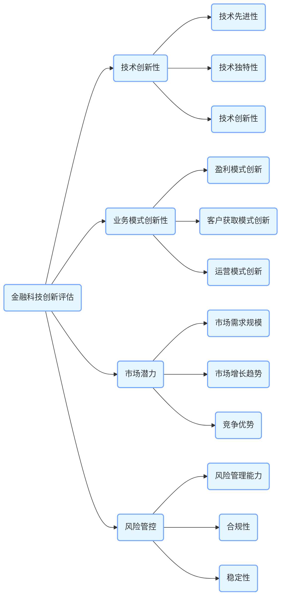

# 金融科技创新评估框架

> 关键词：金融科技、创新评估、评估框架、技术应用、金融服务

> 摘要：本文旨在构建一个全面、系统的金融科技创新评估框架。随着金融科技的快速发展，创新成果不断涌现，但缺乏统一、科学的评估体系来衡量其价值和潜力。通过深入分析金融科技创新的特点和要素，结合行业实践和学术研究，提出了涵盖技术创新性、业务模式创新性、市场潜力、风险管控等多个维度的评估框架。详细阐述了该框架的核心概念、算法原理、数学模型，并通过项目实战案例进行验证和说明。此外，还探讨了该框架在实际应用场景中的作用，推荐了相关的学习资源、开发工具和研究论文，最后对金融科技创新评估的未来发展趋势与挑战进行了总结和展望，以期为金融科技行业的创新发展提供有力的支持和指导。

## 1. 背景介绍 
### 1.1 目的和范围
金融科技作为金融与科技深度融合的产物，正以前所未有的速度改变着传统金融行业的格局。新的技术、业务模式和金融产品不断涌现，为金融服务的效率、质量和可及性带来了显著提升。然而，金融科技创新的快速发展也带来了一系列问题，如创新的盲目性、风险的不确定性以及监管的难度等。因此，建立一个科学、合理、全面的金融科技创新评估框架具有重要的现实意义。

本评估框架的目的在于为金融科技企业、监管机构、投资者等相关主体提供一个统一的标准和方法，用以评估金融科技创新的价值、潜力和风险。通过对金融科技创新项目的全面评估，帮助企业更好地把握创新方向，优化资源配置；帮助监管机构加强对金融科技创新的监管，防范金融风险；帮助投资者做出更加明智的投资决策。

本评估框架的范围涵盖了金融科技领域的各个方面，包括但不限于支付清算、借贷融资、财富管理、保险科技、区块链应用、人工智能在金融领域的应用等。评估对象包括金融科技企业的创新产品、服务、业务模式以及技术解决方案等。

### 1.2 预期读者
本评估框架的预期读者主要包括以下几类：
1. **金融科技企业从业者**：包括企业的管理人员、研发人员、市场营销人员等。他们可以利用本评估框架来评估自身的创新项目，发现优势和不足，为企业的战略规划和产品研发提供参考。
2. **监管机构工作人员**：监管机构可以借助本评估框架来了解金融科技创新的动态和风险，制定相应的监管政策和措施，维护金融市场的稳定和安全。
3. **投资者**：投资者可以依据本评估框架对金融科技企业的创新项目进行评估，判断其投资价值和风险，做出合理的投资决策。
4. **学术界研究人员**：学术界研究人员可以将本评估框架作为研究金融科技创新的工具和参考，深入探讨金融科技创新的理论和实践问题。

### 1.3 文档结构概述
本文将按照以下结构展开：
1. **背景介绍**：阐述金融科技创新评估框架的目的、范围、预期读者和文档结构概述，以及相关术语的定义和解释。
2. **核心概念与联系**：介绍金融科技创新评估框架的核心概念，包括技术创新性、业务模式创新性、市场潜力、风险管控等，并通过文本示意图和 Mermaid 流程图展示各概念之间的关系。
3. **核心算法原理 & 具体操作步骤**：详细讲解评估框架所采用的核心算法原理，并通过 Python 源代码展示具体的操作步骤。
4. **数学模型和公式 & 详细讲解 & 举例说明**：建立金融科技创新评估的数学模型，给出相关公式，并通过具体例子进行详细讲解。
5. **项目实战：代码实际案例和详细解释说明**：通过一个实际的金融科技创新项目案例，展示如何应用本评估框架进行评估，包括开发环境搭建、源代码实现和代码解读。
6. **实际应用场景**：探讨本评估框架在金融科技企业、监管机构、投资者等不同主体中的实际应用场景。
7. **工具和资源推荐**：推荐与金融科技创新评估相关的学习资源、开发工具框架和研究论文。
8. **总结：未来发展趋势与挑战**：总结金融科技创新评估的未来发展趋势，分析面临的挑战，并提出相应的对策和建议。
9. **附录：常见问题与解答**：对读者可能关心的常见问题进行解答。
10. **扩展阅读 & 参考资料**：提供相关的扩展阅读资料和参考文献。

### 1.4 术语表
#### 1.4.1 核心术语定义
1. **金融科技（Fintech）**：指金融与科技的融合，利用现代科技手段创新金融产品、服务和业务模式，提高金融效率和服务质量。
2. **金融科技创新**：指在金融科技领域中，通过引入新的技术、理念、方法或业务模式，创造出具有创新性和竞争力的金融产品、服务或解决方案。
3. **评估框架**：指一套系统的、结构化的方法和标准，用于评估金融科技创新的价值、潜力和风险。
4. **技术创新性**：指金融科技创新所采用的技术在先进性、独特性、创新性等方面的表现。
5. **业务模式创新性**：指金融科技创新所采用的业务模式在盈利模式、客户获取模式、运营模式等方面的创新程度。
6. **市场潜力**：指金融科技创新产品或服务在市场上的需求规模、增长趋势、竞争优势等方面的潜力。
7. **风险管控**：指金融科技创新在风险管理、合规性、稳定性等方面的能力和措施。

#### 1.4.2 相关概念解释
1. **区块链**：一种分布式账本技术，具有去中心化、不可篡改、安全可靠等特点，在金融领域有广泛的应用前景。
2. **人工智能**：指计算机系统能够执行通常需要人类智能才能完成的任务，如机器学习、自然语言处理、图像识别等，在金融领域可用于风险评估、客户服务、投资决策等。
3. **大数据**：指海量的数据集合，通过对大数据的分析和挖掘，可以发现潜在的商业价值和风险，在金融领域可用于客户画像、市场预测等。
4. **云计算**：指通过互联网提供计算资源和服务，具有灵活性、可扩展性、成本效益高等特点，在金融领域可用于数据存储、计算和处理。

#### 1.4.3 缩略词列表
1. **AI**：Artificial Intelligence，人工智能
2. **Big Data**：大数据
3. **Blockchain**：区块链
4. **Cloud Computing**：云计算
5. **Fintech**：金融科技

## 2. 核心概念与联系 
金融科技创新评估框架的核心概念主要包括技术创新性、业务模式创新性、市场潜力和风险管控。这些概念相互关联、相互影响，共同构成了金融科技创新评估的整体框架。

### 核心概念原理
1. **技术创新性**：技术创新性是金融科技创新的基础，它反映了金融科技创新所采用的技术在先进性、独特性、创新性等方面的表现。先进的技术可以提高金融服务的效率和质量，降低成本，增强竞争力。例如，区块链技术的去中心化、不可篡改等特点，可以提高金融交易的安全性和透明度；人工智能技术的机器学习、自然语言处理等功能，可以实现智能客服、风险评估等金融服务的自动化和智能化。
2. **业务模式创新性**：业务模式创新性是金融科技创新的关键，它反映了金融科技创新所采用的业务模式在盈利模式、客户获取模式、运营模式等方面的创新程度。创新的业务模式可以打破传统金融业务的局限，开拓新的市场空间，提高市场份额。例如，互联网金融平台通过线上渠道获取客户，采用多样化的盈利模式，如手续费、利息收入、广告收入等，实现了金融服务的普惠化和个性化。
3. **市场潜力**：市场潜力是金融科技创新的动力，它反映了金融科技创新产品或服务在市场上的需求规模、增长趋势、竞争优势等方面的潜力。具有较大市场潜力的金融科技创新产品或服务，可以获得更多的市场机会和利润空间。例如，随着移动支付的普及，移动支付市场的需求规模不断扩大，为移动支付企业带来了巨大的发展机遇。
4. **风险管控**：风险管控是金融科技创新的保障，它反映了金融科技创新在风险管理、合规性、稳定性等方面的能力和措施。有效的风险管控可以降低金融科技创新的风险，保障金融市场的稳定和安全。例如，金融科技企业通过建立完善的风险管理制度和内部控制体系，加强对客户身份识别、反洗钱、反恐怖主义融资等方面的管理，防范金融风险的发生。

### 文本示意图
```plaintext
金融科技创新评估框架
|-- 技术创新性
|   |-- 技术先进性
|   |-- 技术独特性
|   |-- 技术创新性
|-- 业务模式创新性
|   |-- 盈利模式创新
|   |-- 客户获取模式创新
|   |-- 运营模式创新
|-- 市场潜力
|   |-- 市场需求规模
|   |-- 市场增长趋势
|   |-- 竞争优势
|-- 风险管控
|   |-- 风险管理能力
|   |-- 合规性
|   |-- 稳定性
```

### Mermaid 流程图


## 3. 核心算法原理 & 具体操作步骤 
### 核心算法原理
本评估框架采用综合评价法对金融科技创新进行评估。综合评价法是一种将多个评价指标综合起来，对评价对象进行全面、客观评价的方法。具体步骤如下：
1. **确定评价指标体系**：根据金融科技创新的特点和评估目的，确定技术创新性、业务模式创新性、市场潜力和风险管控四个一级指标，并进一步细化为若干个二级指标。
2. **确定指标权重**：采用层次分析法（AHP）确定各指标的权重。层次分析法是一种将复杂问题分解为多个层次，通过比较各层次元素之间的相对重要性，确定各元素权重的方法。
3. **指标量化**：对各评价指标进行量化处理，将定性指标转化为定量指标。例如，对于技术创新性中的技术先进性指标，可以采用专家评分法进行量化，将技术先进性分为五个等级：非常先进、比较先进、一般、比较落后、非常落后，分别对应 5 分、4 分、3 分、2 分、1 分。
4. **计算综合得分**：根据各指标的权重和量化值，计算金融科技创新的综合得分。综合得分的计算公式为：
$$S = \sum_{i=1}^{n} w_i x_i$$
其中，$S$ 为综合得分，$w_i$ 为第 $i$ 个指标的权重，$x_i$ 为第 $i$ 个指标的量化值，$n$ 为指标的个数。

### 具体操作步骤（Python 源代码）
```python
import numpy as np
from scipy.stats import rankdata

# 定义评价指标体系和权重
# 一级指标权重
weights_1 = np.array([0.3, 0.3, 0.2, 0.2])
# 二级指标权重
weights_2 = {
    '技术创新性': np.array([0.3, 0.3, 0.4]),
    '业务模式创新性': np.array([0.3, 0.3, 0.4]),
    '市场潜力': np.array([0.3, 0.3, 0.4]),
    '风险管控': np.array([0.3, 0.3, 0.4])
}

# 定义指标量化函数
def quantify_index(index_value):
    if index_value == '非常先进' or index_value == '非常创新' or index_value == '非常大' or index_value == '非常强':
        return 5
    elif index_value == '比较先进' or index_value == '比较创新' or index_value == '比较大' or index_value == '比较强':
        return 4
    elif index_value == '一般':
        return 3
    elif index_value == '比较落后' or index_value == '比较不创新' or index_value == '比较小' or index_value == '比较弱':
        return 2
    elif index_value == '非常落后' or index_value == '非常不创新' or index_value == '非常小' or index_value == '非常弱':
        return 1
    else:
        return 0

# 定义综合得分计算函数
def calculate_score(data):
    scores_2 = {}
    for key, values in data.items():
        quantified_values = np.array([quantify_index(value) for value in values])
        scores_2[key] = np.dot(weights_2[key], quantified_values)
    
    scores_1 = np.array(list(scores_2.values()))
    final_score = np.dot(weights_1, scores_1)
    return final_score

# 示例数据
data = {
    '技术创新性': ['比较先进', '非常创新', '一般'],
    '业务模式创新性': ['一般', '比较创新', '非常创新'],
    '市场潜力': ['比较大', '一般', '非常大'],
    '风险管控': ['比较强', '一般', '非常强']
}

# 计算综合得分
score = calculate_score(data)
print(f"金融科技创新综合得分: {score}")
```

### 代码解释
1. **定义评价指标体系和权重**：定义了一级指标权重和二级指标权重，用于后续的加权计算。
2. **定义指标量化函数**：将定性的指标值转化为定量的分数，方便后续计算。
3. **定义综合得分计算函数**：根据各指标的权重和量化值，计算金融科技创新的综合得分。
4. **示例数据**：提供了一个示例数据，用于演示如何使用上述函数进行综合得分的计算。
5. **计算综合得分**：调用综合得分计算函数，计算示例数据的综合得分，并输出结果。

## 4. 数学模型和公式 & 详细讲解 & 举例说明 
### 数学模型
本评估框架的数学模型基于综合评价法，通过对多个评价指标进行加权求和，得到金融科技创新的综合得分。具体数学模型如下：

设金融科技创新的评价指标体系包括 $m$ 个一级指标 $I_1, I_2, \cdots, I_m$，每个一级指标又包含 $n_i$ 个二级指标 $I_{ij} (j = 1, 2, \cdots, n_i)$。各一级指标的权重为 $w_i (i = 1, 2, \cdots, m)$，且 $\sum_{i=1}^{m} w_i = 1$；各二级指标的权重为 $w_{ij} (j = 1, 2, \cdots, n_i)$，且 $\sum_{j=1}^{n_i} w_{ij} = 1$。

对于第 $i$ 个一级指标 $I_i$，其得分 $S_i$ 为：
$$S_i = \sum_{j=1}^{n_i} w_{ij} x_{ij}$$
其中，$x_{ij}$ 为第 $i$ 个一级指标下第 $j$ 个二级指标的量化值。

金融科技创新的综合得分 $S$ 为：
$$S = \sum_{i=1}^{m} w_i S_i$$

### 详细讲解
1. **指标体系构建**：首先，根据金融科技创新的特点和评估目的，构建包含多个一级指标和二级指标的评价指标体系。一级指标反映了金融科技创新的不同方面，如技术创新性、业务模式创新性、市场潜力和风险管控；二级指标则是对一级指标的进一步细化，更具体地描述了各方面的特征。
2. **权重确定**：采用层次分析法（AHP）确定各指标的权重。层次分析法通过比较各指标之间的相对重要性，构建判断矩阵，然后求解判断矩阵的特征向量，得到各指标的权重。权重的确定反映了各指标在综合评价中的重要程度。
3. **指标量化**：将定性的指标值转化为定量的分数，以便进行后续的计算。可以采用专家评分法、问卷调查法等方法进行指标量化。
4. **综合得分计算**：根据各指标的权重和量化值，按照上述数学模型计算金融科技创新的综合得分。综合得分越高，说明金融科技创新的水平越高。

### 举例说明
假设某金融科技创新项目的评价指标体系和权重如下：

| 一级指标 | 权重 | 二级指标 | 权重 |
|---|---|---|---|
| 技术创新性 | 0.3 | 技术先进性 | 0.3 |
|  |  | 技术独特性 | 0.3 |
|  |  | 技术创新性 | 0.4 |
| 业务模式创新性 | 0.3 | 盈利模式创新 | 0.3 |
|  |  | 客户获取模式创新 | 0.3 |
|  |  | 运营模式创新 | 0.4 |
| 市场潜力 | 0.2 | 市场需求规模 | 0.3 |
|  |  | 市场增长趋势 | 0.3 |
|  |  | 竞争优势 | 0.4 |
| 风险管控 | 0.2 | 风险管理能力 | 0.3 |
|  |  | 合规性 | 0.3 |
|  |  | 稳定性 | 0.4 |

该项目各二级指标的量化值如下：

| 一级指标 | 二级指标 | 量化值 |
|---|---|---|
| 技术创新性 | 技术先进性 | 4 |
|  | 技术独特性 | 3 |
|  | 技术创新性 | 5 |
| 业务模式创新性 | 盈利模式创新 | 3 |
|  | 客户获取模式创新 | 4 |
|  | 运营模式创新 | 5 |
| 市场潜力 | 市场需求规模 | 4 |
|  | 市场增长趋势 | 3 |
|  | 竞争优势 | 5 |
| 风险管控 | 风险管理能力 | 3 |
|  | 合规性 | 4 |
|  | 稳定性 | 5 |

首先，计算各一级指标的得分：

- 技术创新性得分 $S_1$：
$$S_1 = 0.3 \times 4 + 0.3 \times 3 + 0.4 \times 5 = 4.1$$

- 业务模式创新性得分 $S_2$：
$$S_2 = 0.3 \times 3 + 0.3 \times 4 + 0.4 \times 5 = 4.1$$

- 市场潜力得分 $S_3$：
$$S_3 = 0.3 \times 4 + 0.3 \times 3 + 0.4 \times 5 = 4.1$$

- 风险管控得分 $S_4$：
$$S_4 = 0.3 \times 3 + 0.3 \times 4 + 0.4 \times 5 = 4.1$$

然后，计算该项目的综合得分 $S$：
$$S = 0.3 \times 4.1 + 0.3 \times 4.1 + 0.2 \times 4.1 + 0.2 \times 4.1 = 4.1$$

因此，该金融科技创新项目的综合得分为 4.1 分。

## 5. 项目实战：代码实际案例和详细解释说明 
### 5.1  开发环境搭建
为了实现金融科技创新评估框架的代码，我们需要搭建以下开发环境：
1. **Python 环境**：建议使用 Python 3.7 及以上版本。可以从 Python 官方网站（https://www.python.org/downloads/）下载并安装。
2. **开发工具**：可以使用 PyCharm、VS Code 等集成开发环境（IDE），也可以使用 Jupyter Notebook 进行交互式开发。
3. **必要的库**：需要安装 `numpy`、`scipy` 等库，用于数值计算和统计分析。可以使用以下命令进行安装：
```sh
pip install numpy scipy
```

### 5.2  源代码详细实现和代码解读
以下是一个完整的金融科技创新评估框架的 Python 代码实现：
```python
import numpy as np
from scipy.stats import rankdata

# 定义评价指标体系和权重
# 一级指标权重
weights_1 = np.array([0.3, 0.3, 0.2, 0.2])
# 二级指标权重
weights_2 = {
    '技术创新性': np.array([0.3, 0.3, 0.4]),
    '业务模式创新性': np.array([0.3, 0.3, 0.4]),
    '市场潜力': np.array([0.3, 0.3, 0.4]),
    '风险管控': np.array([0.3, 0.3, 0.4])
}

# 定义指标量化函数
def quantify_index(index_value):
    if index_value == '非常先进' or index_value == '非常创新' or index_value == '非常大' or index_value == '非常强':
        return 5
    elif index_value == '比较先进' or index_value == '比较创新' or index_value == '比较大' or index_value == '比较强':
        return 4
    elif index_value == '一般':
        return 3
    elif index_value == '比较落后' or index_value == '比较不创新' or index_value == '比较小' or index_value == '比较弱':
        return 2
    elif index_value == '非常落后' or index_value == '非常不创新' or index_value == '非常小' or index_value == '非常弱':
        return 1
    else:
        return 0

# 定义综合得分计算函数
def calculate_score(data):
    scores_2 = {}
    for key, values in data.items():
        quantified_values = np.array([quantify_index(value) for value in values])
        scores_2[key] = np.dot(weights_2[key], quantified_values)
    
    scores_1 = np.array(list(scores_2.values()))
    final_score = np.dot(weights_1, scores_1)
    return final_score

# 示例数据
data = {
    '技术创新性': ['比较先进', '非常创新', '一般'],
    '业务模式创新性': ['一般', '比较创新', '非常创新'],
    '市场潜力': ['比较大', '一般', '非常大'],
    '风险管控': ['比较强', '一般', '非常强']
}

# 计算综合得分
score = calculate_score(data)
print(f"金融科技创新综合得分: {score}")
```

### 5.3  代码解读与分析
1. **评价指标体系和权重定义**：
    - `weights_1` 定义了一级指标的权重，分别为技术创新性、业务模式创新性、市场潜力和风险管控的权重。
    - `weights_2` 是一个字典，定义了各一级指标下二级指标的权重。
2. **指标量化函数**：`quantify_index` 函数将定性的指标值转化为定量的分数，方便后续的计算。
3. **综合得分计算函数**：`calculate_score` 函数根据各指标的权重和量化值，计算金融科技创新的综合得分。具体步骤如下：
    - 遍历数据字典，对每个一级指标下的二级指标进行量化处理，并计算该一级指标的得分。
    - 将各一级指标的得分存储在 `scores_2` 字典中。
    - 将 `scores_2` 字典中的得分转换为数组 `scores_1`，并根据一级指标的权重计算综合得分。
4. **示例数据**：`data` 字典提供了一个示例数据，包含了各一级指标下二级指标的定性值。
5. **计算综合得分**：调用 `calculate_score` 函数，计算示例数据的综合得分，并输出结果。

通过这个代码示例，我们可以看到如何使用 Python 实现金融科技创新评估框架的核心功能，包括指标量化和综合得分计算。

## 6. 实际应用场景 
### 金融科技企业
1. **产品研发决策**：金融科技企业在进行新产品研发时，可以使用本评估框架对不同的创新方案进行评估，选择技术创新性高、业务模式创新、市场潜力大且风险可控的方案进行研发，提高研发成功率和产品竞争力。
2. **战略规划**：企业可以通过对自身和竞争对手的金融科技创新进行评估，了解行业发展趋势和竞争态势，制定合理的战略规划，明确企业的发展方向和重点。
3. **资源配置**：根据评估结果，企业可以合理配置资源，将更多的资源投入到具有高潜力的创新项目中，提高资源利用效率。

### 监管机构
1. **风险监测**：监管机构可以利用本评估框架对金融科技企业的创新项目进行风险监测，及时发现潜在的风险点，采取相应的监管措施，防范金融风险的发生。
2. **政策制定**：通过对金融科技创新的评估，监管机构可以了解行业的发展需求和问题，制定更加科学、合理的监管政策，促进金融科技行业的健康发展。
3. **市场准入管理**：在金融科技企业进入市场时，监管机构可以使用本评估框架对其创新能力和风险管控能力进行评估，决定是否给予市场准入资格，保障金融市场的稳定和安全。

### 投资者
1. **投资决策**：投资者在选择投资项目时，可以使用本评估框架对金融科技企业的创新项目进行评估，判断其投资价值和风险，做出更加明智的投资决策。
2. **投资组合管理**：通过对不同金融科技项目的评估，投资者可以合理配置投资组合，降低投资风险，提高投资收益。
3. **投资后管理**：投资者可以在投资后使用本评估框架对被投资企业的创新项目进行跟踪评估，及时了解项目的进展和风险情况，采取相应的措施，保障投资权益。

## 7. 工具和资源推荐
### 7.1 学习资源推荐
#### 7.1.1 书籍推荐
1. 《金融科技：架构与实践》：本书全面介绍了金融科技的概念、技术架构和实践案例，对于了解金融科技的发展和应用具有重要的参考价值。
2. 《区块链：技术驱动金融》：详细介绍了区块链技术的原理、应用和发展趋势，是学习区块链技术在金融领域应用的经典书籍。
3. 《人工智能：现代方法》：系统地介绍了人工智能的基本概念、算法和应用，对于理解人工智能在金融领域的应用具有重要的帮助。

#### 7.1.2 在线课程
1. Coursera 上的“Financial Technology (FinTech) Specialization”：该课程由哥伦比亚大学等机构提供，涵盖了金融科技的各个方面，包括区块链、人工智能、大数据等在金融领域的应用。
2. edX 上的“Blockchain and Cryptocurrency Technologies”：由麻省理工学院提供，深入介绍了区块链和加密货币的技术原理和应用。
3. Udemy 上的“Artificial Intelligence A-Z™: Learn How To Build An AI”：全面介绍了人工智能的基本概念、算法和实践应用，适合初学者学习。

#### 7.1.3 技术博客和网站
1. 金融科技前沿（https://www.fintechfrontier.cn/）：提供金融科技行业的最新动态、研究报告和案例分析，是了解金融科技行业发展的重要渠道。
2. 巴比特（https://www.8btc.com/）：专注于区块链技术和应用的资讯平台，提供区块链行业的最新消息、技术文章和项目介绍。
3. 机器之心（https://www.alienai.com/）：专注于人工智能领域的资讯平台，提供人工智能的最新技术、研究成果和应用案例。

### 7.2 开发工具框架推荐
#### 7.2.1 IDE和编辑器
1. PyCharm：一款专业的 Python 集成开发环境，具有代码编辑、调试、版本控制等功能，适合 Python 开发者使用。
2. VS Code：一款轻量级的代码编辑器，支持多种编程语言，具有丰富的插件和扩展功能，可用于金融科技项目的开发。
3. Jupyter Notebook：一种交互式的开发环境，适合进行数据分析、模型训练和代码演示，在金融科技领域有广泛的应用。

#### 7.2.2 调试和性能分析工具
1. PySnooper：一个简单易用的 Python 调试工具，可以自动记录函数的调用过程和变量的值，方便调试代码。
2. cProfile：Python 内置的性能分析工具，可以分析代码的执行时间和函数调用次数，帮助优化代码性能。
3. TensorBoard：一个用于可视化深度学习模型训练过程和结果的工具，可用于分析人工智能模型的性能。

#### 7.2.3 相关框架和库
1. NumPy：一个用于科学计算的 Python 库，提供了高效的数组操作和数学函数，是金融科技数据分析和模型训练的基础库。
2. Pandas：一个用于数据处理和分析的 Python 库，提供了灵活的数据结构和数据操作方法，可用于金融数据的清洗、整理和分析。
3. Scikit-learn：一个用于机器学习的 Python 库，提供了丰富的机器学习算法和工具，可用于金融风险评估、客户分类等任务。

### 7.3 相关论文著作推荐
#### 7.3.1 经典论文
1. “Bitcoin: A Peer-to-Peer Electronic Cash System”：比特币的白皮书，介绍了比特币的原理和实现方法，是区块链技术的经典文献。
2. “Deep Learning”：由 Yann LeCun、Yoshua Bengio 和 Geoffrey Hinton 撰写的深度学习综述论文，系统地介绍了深度学习的发展历程、基本原理和应用领域。
3. “A Taxonomy of Cryptocurrencies”：对加密货币进行分类和分析的论文，对于了解加密货币的特点和发展趋势具有重要的参考价值。

#### 7.3.2 最新研究成果
1. 关注顶级学术期刊如《Journal of Financial Economics》、《Review of Financial Studies》等，这些期刊会发表金融科技领域的最新研究成果。
2. 参加国际学术会议如 IEEE International Conference on Financial Technology（IEEE FinTech）等，了解金融科技领域的前沿研究动态。

#### 7.3.3 应用案例分析
1. 《金融科技案例集》：收集了金融科技领域的各种应用案例，包括支付清算、借贷融资、财富管理等方面的案例，对于了解金融科技的实际应用具有重要的参考价值。
2. 各大金融科技企业的官方网站和年报，会介绍企业的创新产品和服务，以及相关的应用案例和实践经验。

## 8. 总结：未来发展趋势与挑战
### 未来发展趋势
1. **技术融合创新**：金融科技将不断融合区块链、人工智能、大数据、云计算等多种技术，实现技术的协同创新，推动金融服务的智能化、数字化和普惠化。
2. **场景化应用拓展**：金融科技将更加注重场景化应用，结合不同行业的需求，提供个性化、定制化的金融服务，拓展金融服务的边界和范围。
3. **监管科技发展**：随着金融科技的快速发展，监管科技将成为重要的发展方向。监管机构将利用科技手段加强对金融科技创新的监管，提高监管效率和精准度。
4. **国际化合作加强**：金融科技是全球性的创新领域，各国之间的合作将不断加强。国际间的金融科技标准制定、监管协调、技术交流等将日益频繁，推动金融科技的全球化发展。

### 挑战
1. **技术安全风险**：金融科技的发展依赖于先进的技术，但技术的安全风险也不容忽视。如区块链技术的智能合约漏洞、人工智能模型的对抗攻击等，可能导致金融数据泄露、资金损失等风险。
2. **监管难度加大**：金融科技的创新速度快、业务模式复杂，给监管机构带来了巨大的挑战。如何在鼓励创新的同时，有效防范金融风险，维护金融市场的稳定和安全，是监管机构面临的重要问题。
3. **数据隐私保护**：金融科技的发展需要大量的用户数据，但数据隐私保护问题日益突出。如何在利用数据的同时，保障用户的隐私安全，是金融科技企业需要解决的重要问题。
4. **人才短缺**：金融科技是一个跨学科的领域，需要既懂金融又懂技术的复合型人才。目前，市场上这类人才短缺，制约了金融科技的发展。

### 对策和建议
1. **加强技术研发和安全保障**：金融科技企业应加大技术研发投入，加强技术安全保障体系建设，提高技术的安全性和可靠性。
2. **完善监管体系**：监管机构应加强对金融科技的研究和监管，完善监管政策和法规，建立适应金融科技发展的监管体系。
3. **强化数据隐私保护**：金融科技企业应加强数据隐私保护意识，建立健全数据隐私保护制度，采用先进的技术手段保障用户数据的安全。
4. **加强人才培养**：高校和职业培训机构应加强金融科技相关专业的建设，培养更多的复合型人才。企业也应加强内部培训，提高员工的专业素质和创新能力。

## 9. 附录：常见问题与解答
### 1. 本评估框架适用于所有金融科技创新项目吗？
本评估框架是一个通用的评估框架，适用于大多数金融科技创新项目。但不同的项目可能具有不同的特点和需求，在实际应用中，可以根据项目的具体情况对评估指标和权重进行适当的调整。

### 2. 如何确定各指标的权重？
本评估框架采用层次分析法（AHP）确定各指标的权重。层次分析法通过比较各指标之间的相对重要性，构建判断矩阵，然后求解判断矩阵的特征向量，得到各指标的权重。在实际应用中，可以邀请相关领域的专家进行判断和打分，以提高权重确定的准确性。

### 3. 指标量化的方法有哪些？
指标量化的方法有很多种，常见的有专家评分法、问卷调查法、数据统计法等。本评估框架采用专家评分法对定性指标进行量化，将定性指标分为不同的等级，每个等级对应一个分数。在实际应用中，可以根据指标的特点和数据的可获取性选择合适的量化方法。

### 4. 本评估框架的评估结果是否具有权威性？
本评估框架是基于科学的方法和理论构建的，具有一定的科学性和合理性。但评估结果的权威性还受到评估人员的专业水平、数据的准确性等因素的影响。在实际应用中，应尽量确保评估人员的专业性和数据的准确性，以提高评估结果的权威性。

### 5. 如何应用本评估框架进行金融科技创新项目的评估？
可以按照以下步骤应用本评估框架进行金融科技创新项目的评估：
1. 确定评估对象和评估目的。
2. 收集相关数据和信息，包括项目的技术方案、业务模式、市场分析、风险评估等。
3. 根据本评估框架的指标体系和权重，对各指标进行量化处理。
4. 计算综合得分，根据综合得分对项目进行评估和排名。
5. 根据评估结果，提出改进建议和决策依据。

## 10. 扩展阅读 & 参考资料
### 扩展阅读
1. 《金融科技时代的监管挑战与对策》
2. 《人工智能在金融风险管理中的应用》
3. 《区块链技术在金融交易中的应用前景》

### 参考资料
1. 中国人民银行发布的《金融科技（FinTech）发展规划（2019 - 2021 年）》
2. 国际金融稳定理事会（FSB）发布的《金融科技的全景描述与分析框架报告》
3. 相关学术期刊和会议论文，如《Journal of Financial Economics》、《Review of Financial Studies》、IEEE International Conference on Financial Technology（IEEE FinTech）等。