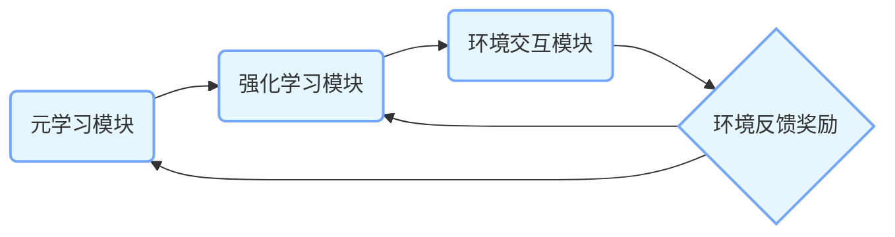

# 金融领域元强化学习在投资策略中的应用

> 关键词：金融领域、元强化学习、投资策略、智能决策、算法原理、应用场景

> 摘要：本文聚焦于金融领域中，元强化学习在投资策略制定方面的应用。首先介绍了相关背景知识，包括研究目的、预期读者、文档结构等内容。接着深入阐述了元强化学习的核心概念与联系，通过文本示意图和 Mermaid 流程图清晰展示其架构。详细讲解了核心算法原理，并给出 Python 源代码进行说明，同时介绍了相关数学模型和公式。通过项目实战部分，展示了如何搭建开发环境、实现源代码并进行解读。探讨了元强化学习在金融投资中的实际应用场景，推荐了学习资源、开发工具框架以及相关论文著作。最后总结了未来发展趋势与挑战，解答常见问题，并提供扩展阅读和参考资料，旨在为金融领域的从业者和研究者提供全面且深入的关于元强化学习在投资策略中应用的知识体系。

## 1. 背景介绍 
### 1.1 目的和范围
在金融市场中，投资决策的复杂性和不确定性不断增加。传统的投资策略往往依赖于历史数据和固定的模型假设，难以适应市场的动态变化。元强化学习作为一种新兴的人工智能技术，为解决这些问题提供了新的思路和方法。本文的目的在于深入探讨元强化学习在金融投资策略中的应用，包括其原理、算法实现、实际应用场景等方面。范围涵盖了从理论基础到实践应用的多个层面，旨在为金融从业者和研究者提供全面的参考。

### 1.2 预期读者
本文预期读者包括金融领域的投资经理、分析师、交易员等从业者，他们希望通过新技术提升投资决策的效率和准确性；也包括计算机科学、人工智能领域的研究者和开发者，对将元强化学习应用于金融领域感兴趣；还适合相关专业的学生，作为学习和研究的参考资料。

### 1.3 文档结构概述
本文将按照以下结构进行组织：首先介绍元强化学习在金融投资策略应用的背景知识；接着阐述元强化学习的核心概念与联系，包括其原理和架构；然后详细讲解核心算法原理及具体操作步骤，并给出 Python 源代码；介绍相关的数学模型和公式，并举例说明；通过项目实战展示代码的实际案例和详细解释；探讨元强化学习在金融投资中的实际应用场景；推荐相关的学习资源、开发工具框架和论文著作；最后总结未来发展趋势与挑战，解答常见问题，并提供扩展阅读和参考资料。

### 1.4 术语表
#### 1.4.1 核心术语定义
- **元强化学习（Meta-Reinforcement Learning）**：是一种强化学习的扩展，旨在让智能体能够快速适应新的任务和环境。它通过学习如何学习，使得智能体能够在有限的数据和时间内，更好地解决不同的任务。
- **投资策略（Investment Strategy）**：是指投资者为了实现投资目标，在投资过程中所采取的一系列决策和行动方案。包括资产配置、选股、择时等方面的决策。
- **智能体（Agent）**：在强化学习和元强化学习中，智能体是指能够感知环境状态、采取行动并从环境中获得奖励的实体。
- **环境（Environment）**：是智能体所处的外部世界，它为智能体提供状态信息，并根据智能体的行动给出相应的奖励。

#### 1.4.2 相关概念解释
- **强化学习（Reinforcement Learning）**：是一种机器学习方法，智能体通过与环境进行交互，尝试不同的行动，并根据环境反馈的奖励来学习最优的行动策略。
- **元学习（Meta-Learning）**：也称为“学习如何学习”，旨在让模型能够快速适应新的任务，通过在多个任务上进行训练，学习到通用的学习策略。
- **金融市场（Financial Market）**：是指资金供求双方运用各种金融工具，通过各种途径实现货币借贷和资金融通的交易活动的总称。包括股票市场、债券市场、期货市场等。

#### 1.4.3 缩略词列表
- **RL**：Reinforcement Learning（强化学习）
- **MRL**：Meta-Reinforcement Learning（元强化学习）
- **AI**：Artificial Intelligence（人工智能）
- **ML**：Machine Learning（机器学习）

## 2. 核心概念与联系 

### 元强化学习的核心概念原理
元强化学习结合了元学习和强化学习的思想。传统的强化学习中，智能体需要在一个特定的环境中进行大量的试验和学习，才能找到最优的策略。而元强化学习则希望智能体能够从多个不同的任务中学习到通用的学习策略，从而能够在面对新的任务时，快速地适应并找到较好的策略。

元强化学习的核心在于元策略（meta-policy）的学习。元策略是一种关于如何学习的策略，它决定了智能体在不同任务中的学习过程。通过在多个任务上进行训练，元策略能够学习到不同任务之间的共性和规律，从而在新任务中引导智能体快速收敛到较好的策略。

### 元强化学习与投资策略的联系
在金融投资领域，市场环境复杂多变，不同的市场条件和投资目标构成了不同的任务。元强化学习可以帮助投资者快速适应这些变化，制定出更有效的投资策略。例如，当市场行情发生变化时，元强化学习智能体可以利用之前学习到的元策略，快速调整投资组合，以实现收益最大化和风险最小化的目标。

### 元强化学习的架构文本示意图
元强化学习的架构主要包括元学习模块、强化学习模块和环境交互模块。元学习模块负责学习元策略，强化学习模块根据元策略在具体任务中进行学习，环境交互模块则负责智能体与金融市场环境的交互。

```plaintext
+------------------+        +------------------+        +------------------+
|  元学习模块      | -----> |  强化学习模块    | -----> |  环境交互模块    |
|  学习元策略      |        |  根据元策略学习  |        |  与金融市场交互  |
+------------------+        +------------------+        +------------------+
```

### Mermaid 流程图


## 3. 核心算法原理 & 具体操作步骤 

### 核心算法原理
元强化学习的核心算法包括模型无关的元强化学习（Model-Agnostic Meta-Reinforcement Learning, MAML）和基于记忆的元强化学习（Memory-Based Meta-Reinforcement Learning）等。这里以 MAML 为例进行讲解。

MAML 的基本思想是在多个任务上进行训练，使得智能体的初始参数能够快速适应新的任务。具体来说，MAML 首先在多个任务上进行内循环的梯度更新，得到每个任务的临时参数；然后在这些临时参数的基础上，进行外循环的梯度更新，更新智能体的初始参数。

### 具体操作步骤
1. **初始化参数**：随机初始化智能体的参数 $\theta$。
2. **采样任务**：从任务分布 $\mathcal{T}$ 中采样一批任务 $\tau_1, \tau_2, \cdots, \tau_n$。
3. **内循环更新**：对于每个任务 $\tau_i$，进行以下操作：
    - 采集一批数据 $D_i$ 来自任务 $\tau_i$。
    - 使用数据 $D_i$ 计算梯度 $\nabla_{\theta} L(\theta, \tau_i)$，其中 $L$ 是损失函数。
    - 更新临时参数 $\theta_i' = \theta - \alpha \nabla_{\theta} L(\theta, \tau_i)$，其中 $\alpha$ 是内循环学习率。
4. **外循环更新**：计算外循环的梯度 $\nabla_{\theta} \sum_{i=1}^{n} L(\theta_i', \tau_i)$，并更新智能体的参数 $\theta = \theta - \beta \nabla_{\theta} \sum_{i=1}^{n} L(\theta_i', \tau_i)$，其中 $\beta$ 是外循环学习率。
5. **重复步骤 2 - 4**：直到智能体的性能达到满意的程度。

### Python 源代码实现
```python
import torch
import torch.nn as nn
import torch.optim as optim

# 定义一个简单的策略网络
class PolicyNetwork(nn.Module):
    def __init__(self, input_dim, output_dim):
        super(PolicyNetwork, self).__init__()
        self.fc1 = nn.Linear(input_dim, 64)
        self.fc2 = nn.Linear(64, output_dim)

    def forward(self, x):
        x = torch.relu(self.fc1(x))
        x = self.fc2(x)
        return x

# 定义 MAML 算法
class MAML:
    def __init__(self, input_dim, output_dim, alpha=0.01, beta=0.001):
        self.policy = PolicyNetwork(input_dim, output_dim)
        self.alpha = alpha
        self.beta = beta
        self.optimizer = optim.Adam(self.policy.parameters(), lr=beta)

    def inner_loop(self, task_data):
        # 复制当前参数
        theta_prime = [p.clone() for p in self.policy.parameters()]
        for x, y in task_data:
            # 前向传播
            output = self.policy(x)
            loss = nn.MSELoss()(output, y)
            # 计算梯度
            grads = torch.autograd.grad(loss, self.policy.parameters())
            # 更新临时参数
            theta_prime = [p - self.alpha * g for p, g in zip(theta_prime, grads)]
        return theta_prime

    def outer_loop(self, tasks):
        meta_loss = 0
        for task_data in tasks:
            theta_prime = self.inner_loop(task_data)
            # 计算外循环损失
            for x, y in task_data:
                output = self.policy(x)
                loss = nn.MSELoss()(output, y)
                meta_loss += loss
        # 外循环更新
        self.optimizer.zero_grad()
        meta_loss.backward()
        self.optimizer.step()
        return meta_loss.item()
```

## 4. 数学模型和公式 & 详细讲解 & 举例说明 

### 数学模型和公式
#### 损失函数
在元强化学习中，常用的损失函数是基于策略梯度的损失函数。对于一个任务 $\tau$，智能体的策略 $\pi_{\theta}$ 的期望累积奖励可以表示为：

$$J(\theta, \tau) = \mathbb{E}_{\tau \sim \mathcal{T}} \left[ \sum_{t=0}^{T} \gamma^t r_t \right]$$

其中，$\gamma$ 是折扣因子，$r_t$ 是在时间步 $t$ 获得的奖励。

MAML 的目标是最大化所有任务的期望累积奖励，即：

$$\max_{\theta} \sum_{\tau \in \mathcal{T}} J(\theta', \tau)$$

其中，$\theta'$ 是在任务 $\tau$ 上进行内循环更新后的参数。

#### 梯度更新公式
内循环的梯度更新公式为：

$$\theta_i' = \theta - \alpha \nabla_{\theta} L(\theta, \tau_i)$$

外循环的梯度更新公式为：

$$\theta = \theta - \beta \nabla_{\theta} \sum_{i=1}^{n} L(\theta_i', \tau_i)$$

### 详细讲解
损失函数 $J(\theta, \tau)$ 表示了智能体在任务 $\tau$ 上的性能。MAML 的目标是通过调整智能体的初始参数 $\theta$，使得在不同任务上进行少量的梯度更新后，能够获得较高的累积奖励。

内循环的梯度更新是在每个任务上进行的，目的是找到一个临时的参数 $\theta_i'$，使得智能体在该任务上的性能得到提升。外循环的梯度更新则是在所有任务的临时参数基础上进行的，目的是更新智能体的初始参数 $\theta$，使得它能够更好地适应不同的任务。

### 举例说明
假设我们有两个投资任务：任务 A 是在牛市中进行投资，任务 B 是在熊市中进行投资。智能体的初始参数为 $\theta$。在任务 A 上，通过内循环的梯度更新，得到临时参数 $\theta_A'$；在任务 B 上，得到临时参数 $\theta_B'$。然后，通过外循环的梯度更新，更新智能体的初始参数 $\theta$，使得它在任务 A 和任务 B 上都能够快速适应并获得较好的投资收益。

## 5. 项目实战：代码实际案例和详细解释说明 

### 5.1  开发环境搭建
#### 操作系统
可以选择 Windows、Linux 或 macOS 操作系统。

#### 编程语言
使用 Python 3.x 版本。

#### 依赖库
安装以下 Python 库：
- `torch`：用于深度学习模型的构建和训练。
- `numpy`：用于数值计算。
- `pandas`：用于数据处理和分析。

可以使用以下命令进行安装：
```sh
pip install torch numpy pandas
```

### 5.2  源代码详细实现和代码解读
以下是一个简单的元强化学习在投资策略中的项目实战代码示例：

```python
import torch
import torch.nn as nn
import torch.optim as optim
import numpy as np
import pandas as pd

# 定义一个简单的策略网络
class PolicyNetwork(nn.Module):
    def __init__(self, input_dim, output_dim):
        super(PolicyNetwork, self).__init__()
        self.fc1 = nn.Linear(input_dim, 64)
        self.fc2 = nn.Linear(64, output_dim)

    def forward(self, x):
        x = torch.relu(self.fc1(x))
        x = self.fc2(x)
        return x

# 定义 MAML 算法
class MAML:
    def __init__(self, input_dim, output_dim, alpha=0.01, beta=0.001):
        self.policy = PolicyNetwork(input_dim, output_dim)
        self.alpha = alpha
        self.beta = beta
        self.optimizer = optim.Adam(self.policy.parameters(), lr=beta)

    def inner_loop(self, task_data):
        # 复制当前参数
        theta_prime = [p.clone() for p in self.policy.parameters()]
        for x, y in task_data:
            # 前向传播
            output = self.policy(x)
            loss = nn.MSELoss()(output, y)
            # 计算梯度
            grads = torch.autograd.grad(loss, self.policy.parameters())
            # 更新临时参数
            theta_prime = [p - self.alpha * g for p, g in zip(theta_prime, grads)]
        return theta_prime

    def outer_loop(self, tasks):
        meta_loss = 0
        for task_data in tasks:
            theta_prime = self.inner_loop(task_data)
            # 计算外循环损失
            for x, y in task_data:
                output = self.policy(x)
                loss = nn.MSELoss()(output, y)
                meta_loss += loss
        # 外循环更新
        self.optimizer.zero_grad()
        meta_loss.backward()
        self.optimizer.step()
        return meta_loss.item()

# 生成模拟投资数据
def generate_data(num_tasks, num_samples_per_task, input_dim, output_dim):
    tasks = []
    for _ in range(num_tasks):
        X = np.random.randn(num_samples_per_task, input_dim)
        y = np.random.randn(num_samples_per_task, output_dim)
        X = torch.tensor(X, dtype=torch.float32)
        y = torch.tensor(y, dtype=torch.float32)
        task_data = [(X[i], y[i]) for i in range(num_samples_per_task)]
        tasks.append(task_data)
    return tasks

# 主函数
if __name__ == "__main__":
    input_dim = 10
    output_dim = 1
    num_tasks = 5
    num_samples_per_task = 100
    num_epochs = 100

    maml = MAML(input_dim, output_dim)
    tasks = generate_data(num_tasks, num_samples_per_task, input_dim, output_dim)

    for epoch in range(num_epochs):
        loss = maml.outer_loop(tasks)
        if epoch % 10 == 0:
            print(f"Epoch {epoch}: Loss = {loss}")
```

### 5.3  代码解读与分析
- **策略网络定义**：`PolicyNetwork` 类定义了一个简单的两层全连接神经网络，用于表示智能体的策略。
- **MAML 算法实现**：`MAML` 类实现了 MAML 算法的内循环和外循环。内循环在每个任务上进行梯度更新，得到临时参数；外循环在所有任务的临时参数基础上进行梯度更新，更新智能体的初始参数。
- **数据生成**：`generate_data` 函数生成模拟的投资数据，包括输入特征和目标输出。
- **主函数**：在主函数中，我们初始化 MAML 算法，生成模拟数据，并进行多个 epoch 的训练。每 10 个 epoch 打印一次损失值。

通过这个项目实战，我们可以看到元强化学习在投资策略中的基本实现过程，包括数据生成、模型训练和参数更新。

## 6. 实际应用场景 
### 资产配置
在资产配置中，投资者需要根据市场环境和自身的风险偏好，将资金分配到不同的资产类别中，如股票、债券、基金等。元强化学习可以帮助投资者快速适应市场的变化，动态调整资产配置比例。例如，当市场行情发生变化时，元强化学习智能体可以根据之前学习到的元策略，快速判断不同资产的预期收益和风险，从而调整资产配置，实现收益最大化和风险最小化的目标。

### 选股策略
选股是投资决策中的重要环节。元强化学习可以通过分析大量的股票数据，包括财务指标、市场情绪等，学习到不同股票的特征和规律。在面对新的股票时，智能体可以利用元策略快速评估股票的投资价值，筛选出具有潜力的股票。同时，元强化学习还可以根据市场的变化，及时调整选股策略，提高选股的准确性和效率。

### 择时交易
择时交易是指投资者根据市场的时机选择买卖股票的时间点。元强化学习可以通过对市场趋势的分析和预测，帮助投资者确定最佳的买卖时机。例如，当市场处于上升趋势时，智能体可以根据元策略判断是否应该买入股票；当市场出现下跌趋势时，判断是否应该卖出股票。通过准确的择时交易，投资者可以降低交易成本，提高投资收益。

### 风险管理
在金融投资中，风险管理是至关重要的。元强化学习可以通过对市场风险的实时监测和评估，帮助投资者制定合理的风险管理策略。例如，当市场风险增加时，智能体可以根据元策略调整投资组合，降低风险暴露；当市场风险降低时，适当增加投资组合的风险，以获取更高的收益。

## 7. 工具和资源推荐
### 7.1 学习资源推荐
#### 7.1.1 书籍推荐
- 《强化学习：原理与Python实现》：这本书详细介绍了强化学习的基本原理和算法，通过 Python 代码示例帮助读者理解和实现强化学习算法。
- 《深度学习》：由 Ian Goodfellow、Yoshua Bengio 和 Aaron Courville 合著，是深度学习领域的经典教材，涵盖了深度学习的基本概念、算法和应用。
- 《元学习：基础与前沿》：专门介绍元学习的书籍，深入讲解了元学习的原理、算法和应用场景。

#### 7.1.2 在线课程
- Coursera 上的“强化学习专项课程”：由 DeepMind 的 David Silver 教授授课，系统地介绍了强化学习的理论和实践。
- edX 上的“深度学习基础”：由 Andrew Ng 教授授课，是深度学习领域的经典在线课程，涵盖了深度学习的基本概念和算法。
- 哔哩哔哩上的“元学习入门教程”：一些博主分享的元学习入门教程，通过视频讲解和代码演示，帮助初学者快速入门。

#### 7.1.3 技术博客和网站
- arXiv：一个预印本数据库，提供了大量的最新研究论文，包括元强化学习和金融领域的相关研究。
- Medium：一个技术博客平台，有很多关于人工智能、机器学习和金融科技的优秀博客文章。
- Towards Data Science：专注于数据科学和机器学习的技术博客，提供了很多实用的教程和案例分析。

### 7.2 开发工具框架推荐
#### 7.2.1 IDE和编辑器
- PyCharm：一款专业的 Python 集成开发环境，提供了丰富的代码编辑、调试和项目管理功能。
- Jupyter Notebook：一个交互式的开发环境，适合进行数据探索、模型训练和结果可视化。
- Visual Studio Code：一款轻量级的代码编辑器，支持多种编程语言和插件扩展，非常适合快速开发和调试。

#### 7.2.2 调试和性能分析工具
- TensorBoard：TensorFlow 提供的可视化工具，可以帮助用户监控模型的训练过程、查看模型的结构和性能指标。
- PyTorch Profiler：PyTorch 提供的性能分析工具，可以帮助用户分析模型的性能瓶颈，优化代码。
- cProfile：Python 内置的性能分析工具，可以帮助用户分析代码的执行时间和函数调用情况。

#### 7.2.3 相关框架和库
- PyTorch：一个开源的深度学习框架，提供了丰富的神经网络模块和优化算法，方便用户进行模型的构建和训练。
- TensorFlow：另一个广泛使用的深度学习框架，具有强大的分布式训练和部署能力。
- Stable Baselines：一个基于 OpenAI Gym 的强化学习库，提供了多种强化学习算法的实现，方便用户进行强化学习实验。

### 7.3 相关论文著作推荐
#### 7.3.1 经典论文
- “Model-Agnostic Meta-Learning for Fast Adaptation of Deep Networks”：介绍了 MAML 算法的经典论文，奠定了元强化学习的基础。
- “Proximal Policy Optimization Algorithms”：介绍了近端策略优化算法（PPO）的论文，是强化学习领域的经典算法之一。
- “Deep Reinforcement Learning for Trading”：探讨了深度强化学习在金融交易中的应用的论文。

#### 7.3.2 最新研究成果
- 关注 arXiv 上关于元强化学习和金融领域的最新研究论文，了解该领域的最新发展动态。
- 参加国际机器学习会议（ICML）、神经信息处理系统大会（NeurIPS）等顶级学术会议，获取最新的研究成果。

#### 7.3.3 应用案例分析
- 一些金融科技公司的技术博客和研究报告，分享了他们在实际应用中使用元强化学习的案例和经验。
- 学术期刊和会议论文中关于元强化学习在金融投资中的应用案例分析，提供了实际应用的参考和借鉴。

## 8. 总结：未来发展趋势与挑战
### 未来发展趋势
- **多模态数据融合**：未来的元强化学习在投资策略中的应用将更加注重多模态数据的融合，包括文本数据、图像数据、音频数据等。通过融合多种类型的数据，智能体可以更全面地了解市场环境，提高投资决策的准确性。
- **与其他技术的结合**：元强化学习将与区块链、量子计算等其他前沿技术相结合，为金融投资带来更多的创新和机遇。例如，区块链技术可以提供更安全、透明的交易环境，量子计算可以提高模型的计算效率。
- **个性化投资服务**：随着人工智能技术的发展，元强化学习将能够为投资者提供更加个性化的投资服务。根据投资者的风险偏好、投资目标和财务状况等因素，智能体可以为每个投资者制定专属的投资策略。

### 挑战
- **数据质量和隐私问题**：在金融领域，数据的质量和隐私问题至关重要。元强化学习需要大量的高质量数据进行训练，但金融数据往往存在噪声、缺失值等问题。同时，保护投资者的隐私也是一个重要的挑战。
- **模型可解释性**：元强化学习模型通常是复杂的黑盒模型，其决策过程难以解释。在金融投资中，投资者需要了解模型的决策依据，以便做出合理的投资决策。因此，提高模型的可解释性是一个亟待解决的问题。
- **市场不确定性**：金融市场具有高度的不确定性，市场行情随时可能发生变化。元强化学习模型需要能够快速适应市场的变化，但在实际应用中，如何准确地捕捉市场的变化并及时调整投资策略仍然是一个挑战。

## 9. 附录：常见问题与解答
### 问题 1：元强化学习与传统强化学习有什么区别？
传统强化学习需要在一个特定的环境中进行大量的试验和学习，才能找到最优的策略。而元强化学习则通过学习如何学习，使得智能体能够从多个不同的任务中学习到通用的学习策略，从而在面对新的任务时，能够快速地适应并找到较好的策略。

### 问题 2：元强化学习在金融投资中的应用有哪些局限性？
元强化学习在金融投资中的应用存在一些局限性，例如数据质量和隐私问题、模型可解释性问题、市场不确定性问题等。此外，元强化学习模型的训练需要大量的计算资源和时间，这也限制了其在实际应用中的推广。

### 问题 3：如何评估元强化学习模型在投资策略中的性能？
可以使用多种指标来评估元强化学习模型在投资策略中的性能，例如收益率、夏普比率、最大回撤等。收益率反映了投资的收益情况，夏普比率衡量了投资的风险调整后收益，最大回撤则反映了投资的最大损失情况。

### 问题 4：元强化学习模型在实际应用中需要注意哪些问题？
在实际应用中，需要注意数据的质量和隐私保护，确保模型的可解释性，以及及时调整模型以适应市场的变化。此外，还需要对模型进行充分的测试和验证，确保其在不同的市场环境下都能表现良好。

## 10. 扩展阅读 & 参考资料
### 扩展阅读
- 《金融科技前沿：人工智能在金融领域的应用》
- 《智能投资：算法与实践》
- 《量化投资：策略与技术》

### 参考资料
- 相关的学术论文和研究报告，如 arXiv 上的论文、国际机器学习会议和神经信息处理系统大会的论文等。
- 金融科技公司的技术博客和官方文档，如蚂蚁金服、腾讯金融科技等公司的相关资料。
- 相关的书籍和在线课程，如前文推荐的书籍和在线课程。