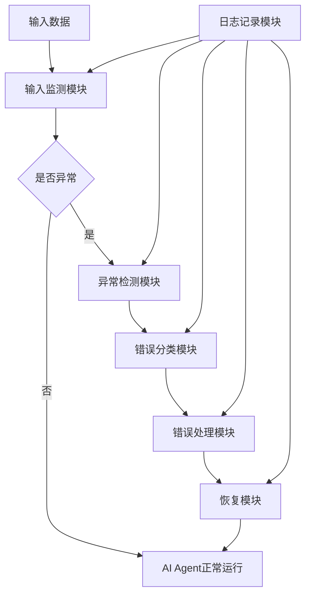

# 错误处理与恢复：提高AI Agent的鲁棒性

> 关键词：错误处理、恢复机制、AI Agent、鲁棒性、异常检测、容错技术、故障恢复

> 摘要：本文围绕提高AI Agent鲁棒性的错误处理与恢复机制展开深入探讨。首先介绍了错误处理与恢复在AI Agent应用中的背景和重要性，阐述了相关的核心概念及联系。接着详细讲解了核心算法原理和具体操作步骤，借助Python代码进行阐述，并给出了相应的数学模型和公式。通过项目实战案例，展示了代码的实际应用和详细解释。分析了AI Agent在不同场景下错误处理与恢复的实际应用，推荐了相关的学习资源、开发工具框架和论文著作。最后总结了未来发展趋势与挑战，提供了常见问题解答和扩展阅读参考资料，旨在帮助读者全面了解如何通过有效的错误处理与恢复手段提升AI Agent的鲁棒性。

## 1. 背景介绍 
### 1.1 目的和范围
随着人工智能技术的飞速发展，AI Agent在众多领域得到了广泛应用，如智能客服、自动驾驶、工业自动化等。然而，在实际运行过程中，AI Agent面临着各种不确定性和干扰，可能会出现错误或故障。本文章的目的在于探讨如何通过有效的错误处理与恢复机制，提高AI Agent的鲁棒性，使其能够在复杂多变的环境中稳定、可靠地运行。范围涵盖了错误处理与恢复的基本概念、核心算法、数学模型、实际应用案例以及相关的工具和资源等方面。

### 1.2 预期读者
本文预期读者包括人工智能领域的研究人员、开发者、工程师，以及对AI Agent鲁棒性感兴趣的技术爱好者。对于正在从事AI Agent开发和优化工作的专业人士，本文提供了深入的技术分析和实践指导；对于初学者，本文有助于其建立对错误处理与恢复机制的基本认识和理解。

### 1.3 文档结构概述
本文首先介绍错误处理与恢复的背景信息，包括目的、预期读者和文档结构。接着阐述核心概念与联系，通过文本示意图和Mermaid流程图进行说明。然后详细讲解核心算法原理和具体操作步骤，结合Python代码进行解释。随后给出数学模型和公式，并举例说明。通过项目实战案例展示代码的实际应用和详细解释。分析实际应用场景，推荐相关的工具和资源。最后总结未来发展趋势与挑战，提供常见问题解答和扩展阅读参考资料。

### 1.4 术语表
#### 1.4.1 核心术语定义
- **AI Agent**：人工智能代理，是一种能够感知环境、进行决策并采取行动以实现特定目标的软件实体。
- **鲁棒性**：系统在存在不确定性、干扰或异常情况下，仍能保持其性能和功能的能力。
- **错误处理**：识别、捕获和处理系统中出现的错误或异常情况的过程。
- **恢复机制**：在错误或故障发生后，使系统恢复到正常运行状态或采取适当措施继续执行任务的机制。
- **异常检测**：检测系统中出现的异常行为或数据的过程。

#### 1.4.2 相关概念解释
- **容错技术**：通过冗余设计、备份机制等手段，使系统在出现故障时仍能继续运行或快速恢复的技术。
- **故障注入**：在系统测试过程中，故意引入故障或错误，以验证系统的错误处理和恢复能力。
- **状态恢复**：在系统出现错误后，将系统的状态恢复到错误发生前的某个一致状态的过程。

#### 1.4.3 缩略词列表
- **AI**：Artificial Intelligence（人工智能）
- **ML**：Machine Learning（机器学习）
- **DL**：Deep Learning（深度学习）
- **RNN**：Recurrent Neural Network（循环神经网络）
- **LSTM**：Long Short - Term Memory（长短期记忆网络）

## 2. 核心概念与联系 

### 核心概念原理
错误处理与恢复的核心目标是提高AI Agent的鲁棒性，使其能够在面对各种错误和异常情况时，保持稳定的性能和功能。主要涉及以下几个核心概念：

- **异常检测**：通过对AI Agent的输入、输出和内部状态进行实时监测，识别出与正常行为模式不符的异常情况。常见的异常检测方法包括基于统计模型的方法、基于机器学习的方法和基于规则的方法等。
- **错误分类**：将检测到的异常情况进行分类，以便采取不同的处理策略。常见的错误类型包括输入错误、算法错误、系统故障等。
- **错误处理策略**：根据错误的类型和严重程度，选择合适的处理策略。常见的处理策略包括重试、回滚、容错、降级等。
- **恢复机制**：在错误处理完成后，使AI Agent恢复到正常运行状态或采取适当措施继续执行任务。恢复机制可以包括状态恢复、数据恢复、模型重新训练等。

### 架构的文本示意图
AI Agent的错误处理与恢复架构主要包括以下几个部分：

- **输入监测模块**：负责对AI Agent的输入数据进行实时监测，检测是否存在异常输入。
- **异常检测模块**：对输入数据、AI Agent的内部状态和输出结果进行分析，识别异常情况。
- **错误分类模块**：将检测到的异常情况进行分类，确定错误的类型和严重程度。
- **错误处理模块**：根据错误分类结果，选择合适的处理策略进行错误处理。
- **恢复模块**：在错误处理完成后，执行恢复操作，使AI Agent恢复到正常运行状态。
- **日志记录模块**：记录错误发生的时间、类型、处理过程和恢复结果等信息，以便后续分析和调试。

### Mermaid流程图


## 3. 核心算法原理 & 具体操作步骤 

### 异常检测算法原理
异常检测是错误处理与恢复的关键步骤，下面介绍一种基于统计模型的异常检测算法——基于高斯分布的异常检测算法。

#### 算法原理
假设AI Agent的输入数据 $x$ 服从高斯分布 $N(\mu,\sigma^2)$，其中 $\mu$ 是均值，$\sigma^2$ 是方差。对于一个新的输入数据点 $x_i$，可以计算其概率密度函数值 $p(x_i)$：

$$p(x_i)=\frac{1}{\sqrt{2\pi\sigma^2}}\exp\left(-\frac{(x_i - \mu)^2}{2\sigma^2}\right)$$

如果 $p(x_i)$ 小于某个阈值 $\epsilon$，则认为 $x_i$ 是异常数据点。

#### Python代码实现
```python
import numpy as np

def estimate_gaussian(X):
    """
    估计高斯分布的均值和方差
    :param X: 输入数据，形状为 (m, n)，m 是样本数量，n 是特征数量
    :return: 均值 mu 和方差 sigma2
    """
    m, n = X.shape
    mu = np.mean(X, axis=0)
    sigma2 = np.var(X, axis=0)
    return mu, sigma2

def multivariate_gaussian(X, mu, sigma2):
    """
    计算多元高斯分布的概率密度函数值
    :param X: 输入数据，形状为 (m, n)，m 是样本数量，n 是特征数量
    :param mu: 均值，形状为 (n,)
    :param sigma2: 方差，形状为 (n,)
    :return: 概率密度函数值 p，形状为 (m,)
    """
    k = len(mu)
    if sigma2.ndim == 1:
        sigma2 = np.diag(sigma2)
    X = X - mu
    p = (2 * np.pi) ** (-k / 2) * np.linalg.det(sigma2) ** (-0.5) * np.exp(-0.5 * np.sum(np.dot(X, np.linalg.pinv(sigma2)) * X, axis=1))
    return p

def select_threshold(yval, pval):
    """
    选择合适的阈值 epsilon
    :param yval: 验证集的标签，形状为 (m,)
    :param pval: 验证集的概率密度函数值，形状为 (m,)
    :return: 最佳阈值 epsilon 和对应的 F1 值
    """
    best_epsilon = 0
    best_f1 = 0
    stepsize = (np.max(pval) - np.min(pval)) / 1000
    for epsilon in np.arange(np.min(pval), np.max(pval), stepsize):
        predictions = (pval < epsilon).astype(int)
        tp = np.sum((predictions == 1) & (yval == 1))
        fp = np.sum((predictions == 1) & (yval == 0))
        fn = np.sum((predictions == 0) & (yval == 1))
        prec = tp / (tp + fp) if (tp + fp) > 0 else 0
        rec = tp / (tp + fn) if (tp + fn) > 0 else 0
        f1 = 2 * prec * rec / (prec + rec) if (prec + rec) > 0 else 0
        if f1 > best_f1:
            best_f1 = f1
            best_epsilon = epsilon
    return best_epsilon, best_f1
```

### 错误处理与恢复的具体操作步骤
1. **数据收集与预处理**：收集AI Agent的输入数据和历史数据，对数据进行清洗、归一化等预处理操作。
2. **异常检测**：使用上述异常检测算法对输入数据进行实时监测，识别异常数据点。
3. **错误分类**：根据异常数据点的特征和上下文信息，对错误进行分类，确定错误的类型和严重程度。
4. **错误处理**：根据错误分类结果，选择合适的处理策略进行错误处理。例如，如果是输入错误，可以进行数据修正或提示用户重新输入；如果是算法错误，可以进行算法调整或重新训练模型；如果是系统故障，可以进行系统重启或切换到备用系统。
5. **恢复操作**：在错误处理完成后，执行恢复操作，使AI Agent恢复到正常运行状态。例如，恢复系统的状态、重新加载数据、重新启动模型等。
6. **日志记录与分析**：记录错误发生的时间、类型、处理过程和恢复结果等信息，以便后续分析和调试。通过对日志数据的分析，可以发现系统中潜在的问题，进一步优化错误处理与恢复机制。

## 4. 数学模型和公式 & 详细讲解 & 举例说明 

### 高斯分布模型
在异常检测中，我们使用高斯分布模型来描述数据的正常分布情况。高斯分布（也称为正态分布）是一种常见的概率分布，其概率密度函数为：

$$p(x)=\frac{1}{\sqrt{2\pi\sigma^2}}\exp\left(-\frac{(x - \mu)^2}{2\sigma^2}\right)$$

其中，$x$ 是随机变量，$\mu$ 是均值，$\sigma^2$ 是方差。高斯分布的形状由均值和方差决定，均值 $\mu$ 决定了分布的中心位置，方差 $\sigma^2$ 决定了分布的宽度。

### 多元高斯分布模型
在实际应用中，输入数据通常是多维的，因此需要使用多元高斯分布模型。多元高斯分布的概率密度函数为：

$$p(x)=\frac{1}{(2\pi)^{n/2}|\Sigma|^{1/2}}\exp\left(-\frac{1}{2}(x - \mu)^T\Sigma^{-1}(x - \mu)\right)$$

其中，$x$ 是 $n$ 维随机向量，$\mu$ 是 $n$ 维均值向量，$\Sigma$ 是 $n\times n$ 的协方差矩阵，$|\Sigma|$ 是协方差矩阵的行列式，$\Sigma^{-1}$ 是协方差矩阵的逆矩阵。

### 阈值选择的数学原理
在异常检测中，需要选择合适的阈值 $\epsilon$ 来判断数据点是否为异常点。通常使用验证集来选择阈值，通过计算不同阈值下的 F1 值，选择 F1 值最大的阈值作为最佳阈值。

F1 值是精确率（Precision）和召回率（Recall）的调和平均值，计算公式为：

$$F1 = 2\times\frac{Precision\times Recall}{Precision + Recall}$$

其中，精确率 $Precision$ 定义为：

$$Precision=\frac{TP}{TP + FP}$$

召回率 $Recall$ 定义为：

$$Recall=\frac{TP}{TP + FN}$$

$TP$ 表示真正例（True Positive），即预测为异常且实际为异常的样本数量；$FP$ 表示假正例（False Positive），即预测为异常但实际为正常的样本数量；$FN$ 表示假反例（False Negative），即预测为正常但实际为异常的样本数量。

### 举例说明
假设我们有一个一维的输入数据集 $X = [1, 2, 3, 4, 5, 100]$，其中 $100$ 是异常数据点。我们可以使用上述高斯分布异常检测算法来检测这个异常点。

```python
import numpy as np

# 输入数据
X = np.array([1, 2, 3, 4, 5, 100]).reshape(-1, 1)

# 估计高斯分布的均值和方差
mu, sigma2 = estimate_gaussian(X)

# 计算概率密度函数值
p = multivariate_gaussian(X, mu, sigma2)

# 选择阈值
yval = np.array([0, 0, 0, 0, 0, 1])  # 验证集标签
pval = p
epsilon, f1 = select_threshold(yval, pval)

# 检测异常点
outliers = np.where(p < epsilon)[0]
print("异常点的索引：", outliers)
```

运行上述代码，我们可以得到异常点的索引为 $[5]$，即数据点 $100$ 被检测为异常点。

## 5. 项目实战：代码实际案例和详细解释说明 

### 5.1  开发环境搭建
在进行项目实战之前，需要搭建相应的开发环境。我们使用Python作为开发语言，主要依赖以下库：

- **NumPy**：用于数值计算和数组操作。
- **Scikit-learn**：用于机器学习算法和数据处理。
- **Matplotlib**：用于数据可视化。

可以使用以下命令安装这些库：

```sh
pip install numpy scikit-learn matplotlib
```

### 5.2  源代码详细实现和代码解读
下面我们通过一个简单的AI Agent错误处理与恢复的项目实战案例，来详细说明代码的实现和解读。

#### 项目背景
假设我们有一个简单的AI Agent，用于预测房价。该AI Agent使用线性回归模型进行预测，输入数据为房屋的面积，输出数据为预测的房价。在实际运行过程中，可能会出现输入数据异常、模型训练失败等错误情况，我们需要实现相应的错误处理与恢复机制。

#### 源代码实现
```python
import numpy as np
from sklearn.linear_model import LinearRegression
import matplotlib.pyplot as plt

# 模拟训练数据
X_train = np.array([100, 200, 300, 400, 500]).reshape(-1, 1)
y_train = np.array([200000, 400000, 600000, 800000, 1000000])

# 模拟异常输入数据
X_test_abnormal = np.array([10000]).reshape(-1, 1)

# 异常检测函数
def detect_anomaly(X, mu, sigma2, epsilon):
    p = multivariate_gaussian(X, mu, sigma2)
    return p < epsilon

# 训练模型
model = LinearRegression()
try:
    model.fit(X_train, y_train)
except Exception as e:
    print("模型训练失败：", e)
    # 恢复机制：重新加载数据或使用备用模型
    # 这里简单地打印恢复信息
    print("尝试恢复：重新加载数据...")

# 估计高斯分布的均值和方差
mu, sigma2 = estimate_gaussian(X_train)
epsilon, _ = select_threshold(np.zeros_like(X_train), multivariate_gaussian(X_train, mu, sigma2))

# 预测房价
try:
    if detect_anomaly(X_test_abnormal, mu, sigma2, epsilon):
        print("检测到异常输入数据，进行错误处理...")
        # 错误处理：提示用户重新输入或进行数据修正
        print("请输入合理的房屋面积！")
    else:
        y_pred = model.predict(X_test_abnormal)
        print("预测的房价：", y_pred)
except Exception as e:
    print("预测过程中出现错误：", e)
    # 恢复机制：重新训练模型或使用备用模型
    print("尝试恢复：重新训练模型...")
```

#### 代码解读
1. **数据准备**：首先模拟了训练数据 `X_train` 和 `y_train`，以及异常输入数据 `X_test_abnormal`。
2. **模型训练**：使用 `LinearRegression` 模型进行训练，使用 `try-except` 语句捕获可能出现的训练失败异常，并进行相应的恢复操作。
3. **异常检测**：使用前面介绍的基于高斯分布的异常检测算法，对输入数据进行异常检测。
4. **预测过程**：在预测过程中，先检测输入数据是否异常，如果异常则进行错误处理；如果正常则进行预测。同样使用 `try-except` 语句捕获可能出现的预测错误，并进行相应的恢复操作。

### 5.3  代码解读与分析
通过上述代码实现，我们可以看到错误处理与恢复机制在AI Agent中的应用。在模型训练和预测过程中，使用 `try-except` 语句捕获异常，根据异常的类型进行相应的错误处理和恢复操作。异常检测模块可以提前发现输入数据中的异常情况，避免将异常数据输入到模型中，从而提高AI Agent的鲁棒性。

同时，我们可以根据实际需求对错误处理和恢复机制进行扩展和优化。例如，可以使用更复杂的异常检测算法，增加更多的错误类型和处理策略，实现更完善的状态恢复机制等。

## 6. 实际应用场景 
### 智能客服
在智能客服系统中，AI Agent需要处理用户的各种问题和请求。可能会出现用户输入异常、模型回答错误等情况。通过错误处理与恢复机制，可以对用户的异常输入进行检测和处理，例如提示用户重新输入或进行模糊匹配；当模型回答错误时，可以进行模型调整或重新训练，以提高回答的准确性和可靠性。

### 自动驾驶
在自动驾驶系统中，AI Agent需要实时感知环境、做出决策并控制车辆行驶。可能会出现传感器故障、算法错误、环境异常等情况。通过错误处理与恢复机制，可以对传感器故障进行检测和处理，例如切换到备用传感器；当算法出现错误时，可以进行算法调整或重新训练；当遇到环境异常时，可以采取减速、停车等措施，确保行车安全。

### 工业自动化
在工业自动化系统中，AI Agent需要控制生产设备的运行和生产过程的监控。可能会出现设备故障、数据传输错误、模型预测不准确等情况。通过错误处理与恢复机制，可以对设备故障进行检测和处理，例如切换到备用设备；当数据传输错误时，可以进行数据重传或数据修正；当模型预测不准确时，可以进行模型调整或重新训练，以提高生产效率和质量。

## 7. 工具和资源推荐
### 7.1 学习资源推荐
#### 7.1.1 书籍推荐
- 《人工智能：一种现代的方法》：全面介绍了人工智能的基本概念、算法和应用，是人工智能领域的经典教材。
- 《机器学习》：详细介绍了机器学习的各种算法和模型，对于理解AI Agent的核心算法有很大帮助。
- 《深度学习》：深入讲解了深度学习的原理、方法和应用，是深度学习领域的权威著作。

#### 7.1.2 在线课程
- Coursera上的“Machine Learning”课程：由Andrew Ng教授主讲，是机器学习领域的经典课程，适合初学者学习。
- edX上的“Deep Learning Specialization”课程：由深度学习领域的知名学者授课，系统地介绍了深度学习的各个方面。
- 中国大学MOOC上的“人工智能基础”课程：国内高校的优质课程，内容丰富，适合国内学生学习。

#### 7.1.3 技术博客和网站
- Medium：一个技术博客平台，有很多关于人工智能、机器学习和深度学习的优秀文章。
- Towards Data Science：专注于数据科学和机器学习领域的博客，提供了很多实用的技术文章和案例分析。
- AI开源社区：国内的人工智能开源社区，有很多关于AI Agent开发和优化的技术分享和经验交流。

### 7.2 开发工具框架推荐
#### 7.2.1 IDE和编辑器
- PyCharm：一款专业的Python集成开发环境，提供了丰富的代码编辑、调试和项目管理功能。
- Jupyter Notebook：一种交互式的开发环境，适合进行数据探索、模型训练和代码演示。
- Visual Studio Code：一款轻量级的代码编辑器，支持多种编程语言和插件扩展，适合快速开发和调试。

#### 7.2.2 调试和性能分析工具
- PDB：Python自带的调试器，可以帮助开发者定位和解决代码中的问题。
- cProfile：Python的性能分析工具，可以分析代码的运行时间和资源消耗情况，帮助优化代码性能。
- TensorBoard：TensorFlow的可视化工具，可以帮助开发者可视化模型的训练过程和性能指标。

#### 7.2.3 相关框架和库
- TensorFlow：一个开源的深度学习框架，提供了丰富的深度学习模型和工具，适合开发各种AI Agent。
- PyTorch：另一个流行的深度学习框架，具有动态计算图和易于使用的特点，适合快速开发和实验。
- Scikit-learn：一个简单易用的机器学习库，提供了各种机器学习算法和工具，适合进行数据处理和模型训练。

### 7.3 相关论文著作推荐
#### 7.3.1 经典论文
- “Deep Residual Learning for Image Recognition”：提出了残差网络（ResNet），解决了深度神经网络训练中的梯度消失和梯度爆炸问题。
- “Attention Is All You Need”：提出了Transformer架构，在自然语言处理领域取得了巨大成功。
- “Generative Adversarial Networks”：提出了生成对抗网络（GAN），开创了生成式模型的新纪元。

#### 7.3.2 最新研究成果
- 关注顶级学术会议如NeurIPS、ICML、CVPR等的最新论文，了解AI Agent错误处理与恢复领域的最新研究动态。
- 关注知名学术期刊如Journal of Artificial Intelligence Research（JAIR）、Artificial Intelligence等的相关研究论文。

#### 7.3.3 应用案例分析
- 研究工业界的AI Agent应用案例，如Google、Facebook、Amazon等公司的相关技术报告和论文，了解实际应用中的错误处理与恢复策略和方法。

## 8. 总结：未来发展趋势与挑战
### 未来发展趋势
- **融合多模态信息**：未来的AI Agent将融合更多的多模态信息，如视觉、听觉、触觉等，以提高对环境的感知和理解能力。错误处理与恢复机制也需要适应多模态信息的特点，处理更复杂的异常情况。
- **强化学习与自适应恢复**：强化学习可以使AI Agent在不断的交互中学习最优的决策策略。结合强化学习的自适应恢复机制，能够使AI Agent在面对不同的错误和异常情况时，自动调整处理策略，提高恢复效率和性能。
- **联邦学习与分布式错误处理**：随着数据隐私和安全问题的日益关注，联邦学习将成为未来AI Agent的重要发展方向。分布式错误处理机制需要在多个节点之间协同工作，确保整个系统的鲁棒性和可靠性。

### 挑战
- **复杂环境下的异常检测**：在复杂多变的环境中，异常情况的表现形式更加复杂多样，传统的异常检测方法可能无法满足需求。需要研究更高效、准确的异常检测算法，能够实时、动态地检测各种异常情况。
- **模型的可解释性与错误诊断**：深度学习模型通常是黑盒模型，其决策过程难以解释。在错误发生时，很难准确地诊断错误的原因和位置。需要研究模型的可解释性技术，提高错误诊断的准确性和效率。
- **系统的容错性和可靠性设计**：设计具有高容错性和可靠性的AI Agent系统是一个挑战。需要综合考虑硬件、软件、算法等多个方面的因素，采用冗余设计、备份机制、故障隔离等技术，确保系统在出现故障时能够快速恢复。

## 9. 附录：常见问题与解答
### 问题1：异常检测的阈值如何选择？
答：通常使用验证集来选择阈值，通过计算不同阈值下的F1值，选择F1值最大的阈值作为最佳阈值。具体实现可以参考前面介绍的 `select_threshold` 函数。

### 问题2：错误处理策略有哪些？
答：常见的错误处理策略包括重试、回滚、容错、降级等。重试是指在错误发生后，尝试重新执行操作；回滚是指将系统的状态恢复到错误发生前的某个一致状态；容错是指通过冗余设计、备份机制等手段，使系统在出现故障时仍能继续运行；降级是指在系统出现故障或资源不足时，降低系统的功能和性能要求，以保证系统的基本运行。

### 问题3：如何实现状态恢复？
答：状态恢复可以通过保存系统的状态信息，在错误发生后将系统的状态恢复到错误发生前的某个一致状态。具体实现可以根据系统的特点和需求，采用不同的方法，如定期保存状态快照、使用日志记录状态变化等。

### 问题4：错误处理与恢复机制会影响AI Agent的性能吗？
答：错误处理与恢复机制在一定程度上会影响AI Agent的性能，因为需要进行异常检测、错误分类、错误处理和恢复操作等额外的计算和处理。但是，通过合理的设计和优化，可以将性能影响降到最低，同时提高AI Agent的鲁棒性和可靠性，从而在整体上提高系统的性能和可用性。

## 10. 扩展阅读 & 参考资料
- 《人工智能及其应用》，蔡自兴等著
- 《机器学习实战》，Peter Harrington著
- 《Python深度学习》，Francois Chollet著
- NeurIPS、ICML、CVPR等学术会议的相关论文
- TensorFlow、PyTorch等官方文档和教程
- Medium、Towards Data Science等技术博客平台的相关文章