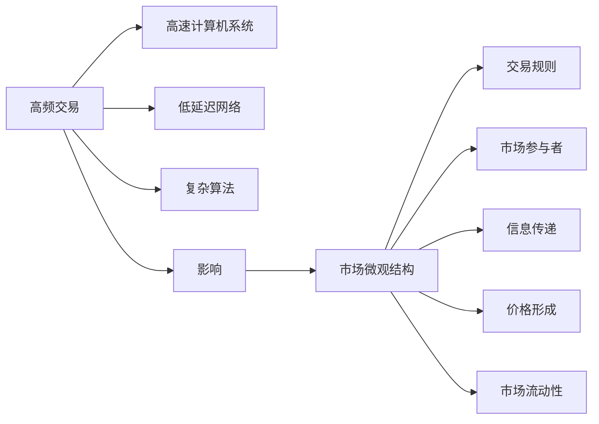

# 高频交易策略：技术创新如何改变市场微观结构

> 关键词：高频交易策略、技术创新、市场微观结构、算法交易、金融科技、量化分析、交易速度

> 摘要：本文聚焦于高频交易策略以及技术创新对市场微观结构的影响。首先介绍了高频交易和市场微观结构的相关背景知识，包括其目的、预期读者等内容。接着阐述了高频交易与市场微观结构的核心概念及联系，详细讲解了高频交易的核心算法原理和具体操作步骤，并通过数学模型和公式进行深入剖析。通过项目实战展示了高频交易策略的代码实现和解读，探讨了高频交易的实际应用场景。同时推荐了相关的学习资源、开发工具框架以及论文著作。最后总结了高频交易未来的发展趋势与挑战，还设置了常见问题解答和扩展阅读参考资料，旨在全面深入地分析技术创新下高频交易策略对市场微观结构的改变。

## 1. 背景介绍 
### 1.1 目的和范围
高频交易作为金融市场中一种极具创新性和影响力的交易方式，近年来发展迅猛。本文章的目的在于深入探讨高频交易策略背后的技术创新，以及这些创新如何对市场微观结构产生影响。我们将涵盖高频交易的基本概念、核心算法、数学模型，通过实际案例展示其应用，并分析其在不同市场环境下的作用。范围涉及股票市场、期货市场等金融领域，旨在为读者提供一个全面且深入的视角来理解高频交易与市场微观结构之间的关系。

### 1.2 预期读者
本文预期读者包括金融从业者，如交易员、投资经理、分析师等，他们可以通过本文深入了解高频交易策略的技术细节，以便在实际工作中更好地运用和评估这些策略。同时，对于计算机科学和金融工程领域的研究人员和学生，本文提供了一个跨学科的研究视角，有助于他们开展相关的学术研究和实践项目。此外，对金融市场和技术创新感兴趣的普通投资者也能从本文中获得有价值的信息，提升对市场的理解和认识。

### 1.3 文档结构概述
本文将按照以下结构展开：首先介绍高频交易和市场微观结构的背景知识，包括术语定义和相关概念解释。接着阐述高频交易与市场微观结构的核心概念及联系，通过文本示意图和 Mermaid 流程图进行直观展示。然后详细讲解高频交易的核心算法原理和具体操作步骤，并用 Python 源代码进行说明。随后通过数学模型和公式对高频交易进行深入分析，并举例说明。项目实战部分将展示高频交易策略的代码实现和解读。之后探讨高频交易的实际应用场景。还会推荐相关的学习资源、开发工具框架以及论文著作。最后总结高频交易未来的发展趋势与挑战，设置常见问题解答和扩展阅读参考资料。

### 1.4 术语表
#### 1.4.1 核心术语定义
- **高频交易（High-Frequency Trading, HFT）**：指利用高速计算机系统和复杂的算法，在极短时间内进行大量交易的交易策略。高频交易通常利用市场中的微小价格差异来获取利润，交易时间尺度可以从毫秒到秒不等。
- **市场微观结构（Market Microstructure）**：研究金融市场中资产交易的过程和机制，包括交易规则、市场参与者的行为、信息传递等因素如何影响资产价格的形成和市场流动性。
- **算法交易（Algorithmic Trading）**：指通过计算机程序自动执行交易指令的交易方式。算法交易可以根据预设的条件和规则，在市场中自动寻找交易机会并执行交易，提高交易效率和准确性。
- **流动性（Liquidity）**：指资产能够以合理价格快速买卖的能力。在金融市场中，流动性高的资产意味着交易成本低、交易速度快，市场参与者能够更容易地进出市场。

#### 1.4.2 相关概念解释
- **做市商（Market Maker）**：指在金融市场中，为买卖双方提供报价并愿意在该报价上进行交易的市场参与者。做市商通过提供流动性来赚取买卖价差，是维持市场正常运行的重要力量。
- **订单簿（Order Book）**：记录市场中所有未成交订单的列表，包括买单和卖单。订单簿按照价格和时间优先的原则排列，反映了市场参与者的买卖意愿和市场供需关系。
- **延迟（Latency）**：指信息从发送端到接收端所经历的时间延迟。在高频交易中，延迟是一个关键因素，因为微小的延迟可能导致交易机会的丧失或交易成本的增加。

#### 1.4.3 缩略词列表
- **HFT**：High-Frequency Trading（高频交易）
- **API**：Application Programming Interface（应用程序编程接口）
- **CPU**：Central Processing Unit（中央处理器）
- **GPU**：Graphics Processing Unit（图形处理器）

## 2. 核心概念与联系 

### 高频交易的核心概念
高频交易是一种基于先进技术和复杂算法的交易策略，其核心在于利用高速计算机系统和低延迟网络，在极短时间内进行大量的交易。高频交易的主要特点包括：
- **高速交易**：高频交易系统能够在毫秒甚至微秒级的时间内完成交易指令的生成、发送和执行，以捕捉市场中的微小价格波动。
- **大量交易**：高频交易通常会进行大量的交易，通过累积微小的利润来实现整体的盈利。
- **算法驱动**：高频交易依赖于复杂的算法来分析市场数据、识别交易机会并执行交易指令。这些算法可以基于技术分析、基本面分析、统计套利等多种方法。

### 市场微观结构的核心概念
市场微观结构研究的是金融市场中资产交易的过程和机制，它关注的是市场参与者的行为、交易规则、信息传递等因素如何影响资产价格的形成和市场流动性。市场微观结构的主要要素包括：
- **交易规则**：市场的交易规则规定了交易的方式、时间、价格形成机制等，对市场的运行和效率有着重要影响。
- **市场参与者**：包括投资者、做市商、经纪人等，他们的行为和决策会影响市场的供需关系和价格走势。
- **信息传递**：市场中的信息传递速度和效率会影响市场参与者的决策和交易行为，进而影响市场价格的形成。

### 高频交易与市场微观结构的联系
高频交易的发展对市场微观结构产生了深远的影响，主要体现在以下几个方面：
- **提高市场流动性**：高频交易做市商通过持续提供买卖报价，增加了市场的流动性，降低了交易成本。
- **加速价格发现**：高频交易系统能够快速处理和分析市场信息，使价格能够更快地反映市场的供需关系和新的信息，提高了价格发现的效率。
- **改变市场参与者结构**：高频交易的兴起使得市场参与者结构发生了变化，高频交易商成为市场中的重要力量，他们的交易行为和策略对市场的稳定性和效率产生了影响。

### 文本示意图
```plaintext
高频交易
|
|-- 高速计算机系统
|-- 低延迟网络
|-- 复杂算法
|
|-- 影响
|   |
|   |-- 市场微观结构
|       |
|       |-- 交易规则
|       |-- 市场参与者
|       |-- 信息传递
|       |-- 价格形成
|       |-- 市场流动性
```

### Mermaid 流程图


## 3. 核心算法原理 & 具体操作步骤 

### 核心算法原理
高频交易中常用的算法包括趋势跟踪算法、均值回归算法、统计套利算法等。下面以均值回归算法为例，详细讲解其原理。

均值回归算法基于这样一个假设：资产价格会围绕其均值波动，当价格偏离均值较大时，会有回归均值的趋势。该算法的基本步骤如下：
1. **计算均值**：选择一个合适的时间窗口，计算资产价格在该时间窗口内的均值。
2. **判断偏离程度**：计算当前价格与均值的差值，判断价格偏离均值的程度。
3. **生成交易信号**：当价格偏离均值超过一定阈值时，生成相应的交易信号。如果价格高于均值，且偏离程度超过阈值，则生成卖出信号；如果价格低于均值，且偏离程度超过阈值，则生成买入信号。

### Python 源代码实现
```python
import pandas as pd
import numpy as np

# 生成示例数据
np.random.seed(0)
dates = pd.date_range(start='2023-01-01', periods=100, freq='D')
prices = np.random.randn(100).cumsum() + 100
data = pd.DataFrame({'price': prices}, index=dates)

# 计算均值
window_size = 20
data['mean'] = data['price'].rolling(window=window_size).mean()

# 计算偏离程度
data['deviation'] = data['price'] - data['mean']

# 设定阈值
threshold = 2

# 生成交易信号
data['signal'] = 0
data.loc[data['deviation'] > threshold, 'signal'] = -1  # 卖出信号
data.loc[data['deviation'] < -threshold, 'signal'] = 1  # 买入信号

# 输出交易信号
print(data[['price', 'mean', 'deviation', 'signal']])
```

### 具体操作步骤
1. **数据获取**：从金融数据提供商获取资产的历史价格数据。可以使用 API 接口或者数据库来获取数据。
2. **数据预处理**：对获取的数据进行清洗、整理和转换，确保数据的质量和一致性。例如，处理缺失值、异常值等。
3. **算法实现**：根据选择的算法，编写相应的代码实现算法逻辑。在实现过程中，需要注意算法的参数设置和优化。
4. **信号生成**：根据算法计算结果，生成相应的交易信号。交易信号可以是买入、卖出或持有信号。
5. **交易执行**：根据生成的交易信号，通过交易接口向市场发送交易指令，执行交易操作。在执行交易时，需要考虑交易成本、市场流动性等因素。

## 4. 数学模型和公式 & 详细讲解 & 举例说明 

### 均值回归模型
均值回归模型的基本思想是资产价格会围绕其长期均值波动，当价格偏离均值时，会有回归均值的趋势。该模型可以用以下公式表示：

$$
P_t - \mu = \alpha (P_{t-1} - \mu) + \epsilon_t
$$

其中，$P_t$ 表示 $t$ 时刻的资产价格，$\mu$ 表示资产价格的长期均值，$\alpha$ 表示回归系数，$\epsilon_t$ 表示随机误差项。

### 详细讲解
- **回归系数 $\alpha$**：$\alpha$ 的取值范围在 $(-1, 1)$ 之间。当 $\alpha > 0$ 时，表明价格具有正的自相关性，即价格的偏离会在一定程度上延续；当 $\alpha < 0$ 时，表明价格具有负的自相关性，即价格的偏离会有回归均值的趋势。$\alpha$ 的绝对值越接近 1，价格的自相关性越强；$\alpha$ 的绝对值越接近 0，价格的自相关性越弱。
- **随机误差项 $\epsilon_t$**：$\epsilon_t$ 表示价格波动中无法用均值回归模型解释的部分，通常假设 $\epsilon_t$ 服从均值为 0、方差为 $\sigma^2$ 的正态分布。

### 举例说明
假设某资产的价格序列为 $P = [100, 102, 105, 103, 101, 99, 98, 100, 102, 104]$，我们可以使用 Python 来计算该资产价格的均值和回归系数。

```python
import numpy as np
import statsmodels.api as sm

# 定义价格序列
P = np.array([100, 102, 105, 103, 101, 99, 98, 100, 102, 104])

# 计算均值
mu = np.mean(P)

# 计算回归系数
X = P[:-1] - mu
y = P[1:] - mu
X = sm.add_constant(X)
model = sm.OLS(y, X)
results = model.fit()
alpha = results.params[1]

print(f"均值: {mu}")
print(f"回归系数: {alpha}")
```

在上述代码中，我们首先计算了价格序列的均值 $\mu$，然后使用最小二乘法计算了回归系数 $\alpha$。通过计算得到的均值和回归系数，我们可以对该资产价格的均值回归特性进行分析。

## 5. 项目实战：代码实际案例和详细解释说明 

### 5.1  开发环境搭建
1. **安装 Python**：从 Python 官方网站（https://www.python.org/downloads/）下载并安装 Python 3.x 版本。
2. **安装必要的库**：使用 `pip` 命令安装所需的库，包括 `pandas`、`numpy`、`statsmodels`、`matplotlib` 等。
```bash
pip install pandas numpy statsmodels matplotlib
```
3. **选择开发工具**：可以选择使用 Jupyter Notebook、PyCharm 等开发工具来编写和运行代码。

### 5.2  源代码详细实现和代码解读
以下是一个完整的高频交易策略的代码示例，基于均值回归算法实现。

```python
import pandas as pd
import numpy as np
import matplotlib.pyplot as plt
import statsmodels.api as sm

# 生成示例数据
np.random.seed(0)
dates = pd.date_range(start='2023-01-01', periods=200, freq='D')
prices = np.random.randn(200).cumsum() + 100
data = pd.DataFrame({'price': prices}, index=dates)

# 计算均值
window_size = 20
data['mean'] = data['price'].rolling(window=window_size).mean()

# 计算偏离程度
data['deviation'] = data['price'] - data['mean']

# 设定阈值
threshold = 2

# 生成交易信号
data['signal'] = 0
data.loc[data['deviation'] > threshold, 'signal'] = -1  # 卖出信号
data.loc[data['deviation'] < -threshold, 'signal'] = 1  # 买入信号

# 计算持仓
data['position'] = data['signal'].cumsum()

# 计算收益
data['returns'] = data['price'].pct_change()
data['strategy_returns'] = data['position'].shift(1) * data['returns']

# 计算累计收益
data['cumulative_returns'] = (1 + data['strategy_returns']).cumprod()

# 绘制收益曲线
plt.figure(figsize=(12, 6))
plt.plot(data['cumulative_returns'], label='Strategy Returns')
plt.plot((1 + data['returns']).cumprod(), label='Buy and Hold Returns')
plt.title('Mean Reversion Strategy Performance')
plt.xlabel('Date')
plt.ylabel('Cumulative Returns')
plt.legend()
plt.show()
```

### 代码解读与分析
1. **数据生成**：使用 `numpy` 和 `pandas` 生成示例价格数据，并将其存储在 `DataFrame` 中。
2. **均值计算**：使用 `rolling` 方法计算价格的滚动均值，窗口大小为 20 天。
3. **偏离程度计算**：计算当前价格与均值的差值，得到价格的偏离程度。
4. **交易信号生成**：根据价格的偏离程度和设定的阈值，生成买入和卖出信号。
5. **持仓计算**：根据交易信号计算持仓情况，即当前持有的资产数量。
6. **收益计算**：计算资产价格的每日收益率和策略的每日收益率。
7. **累计收益计算**：计算策略的累计收益率和买入持有策略的累计收益率。
8. **收益曲线绘制**：使用 `matplotlib` 绘制策略的累计收益曲线和买入持有策略的累计收益曲线，以便直观地比较策略的性能。

通过对代码的分析，我们可以看到均值回归策略的基本实现过程和效果。在实际应用中，需要根据市场情况和数据特点对策略进行优化和调整。

## 6. 实际应用场景 
### 股票市场
在股票市场中，高频交易策略可以用于捕捉股票价格的短期波动，实现快速盈利。高频交易商可以利用算法交易系统，在股票价格出现微小波动时迅速买入或卖出股票，获取价差收益。此外，高频交易还可以提高股票市场的流动性，降低交易成本，促进市场的有效运行。

### 期货市场
期货市场具有高杠杆、高流动性的特点，非常适合高频交易策略的应用。高频交易商可以利用期货合约的价格波动，进行套利交易和趋势跟踪交易。例如，通过同时买卖不同到期日的期货合约，利用价差变化获取收益；或者根据市场趋势，及时调整持仓，实现盈利。

### 外汇市场
外汇市场是全球最大的金融市场之一，交易规模巨大，流动性高。高频交易在外汇市场中也有广泛的应用。高频交易商可以利用外汇汇率的微小波动，进行快速的买卖交易，获取利润。此外，高频交易还可以提高外汇市场的价格发现效率，促进市场的稳定运行。

### 加密货币市场
加密货币市场具有高度的波动性和不确定性，为高频交易提供了丰富的机会。高频交易商可以利用加密货币价格的快速变化，进行高频交易，获取利润。同时，高频交易也可以提高加密货币市场的流动性，降低交易成本，促进市场的发展。

## 7. 工具和资源推荐
### 7.1 学习资源推荐
#### 7.1.1 书籍推荐
- 《高频交易：新的市场微观结构》（High-Frequency Trading: New Market Microstructure）：本书深入探讨了高频交易的技术、策略和市场影响，是学习高频交易的经典著作。
- 《算法交易：金融工程和风险管理的新前沿》（Algorithmic Trading: Winning Strategies and Their Rationale）：介绍了算法交易的基本原理、策略和实现方法，对高频交易有详细的讲解。
- 《金融市场微观结构理论》（The Economic Theory of Financial Markets）：系统地阐述了金融市场微观结构的理论和方法，为理解高频交易与市场微观结构的关系提供了理论基础。

#### 7.1.2 在线课程
- Coursera 上的“Algorithmic Trading and Quantitative Analysis”：该课程由知名教授授课，介绍了算法交易的基本概念、策略和实现方法，包括高频交易的相关内容。
- edX 上的“Financial Engineering and Risk Management”：课程涵盖了金融工程的基本原理和方法，对高频交易和市场微观结构有深入的讲解。
- Udemy 上的“High-Frequency Trading Strategies”：该课程通过实际案例介绍了高频交易的策略和实现方法，适合有一定编程基础的学习者。

#### 7.1.3 技术博客和网站
- QuantNet（https://www.quantnet.com/）：一个专注于量化金融的社区，提供了大量关于高频交易、算法交易和市场微观结构的讨论和资源。
- Towards Data Science（https://towardsdatascience.com/）：一个数据科学和机器学习的博客平台，有许多关于高频交易和量化分析的文章。
- Seeking Alpha（https://seekingalpha.com/）：一个金融投资分析网站，提供了股票、期货、外汇等市场的分析和评论，对高频交易的市场影响有深入的讨论。

### 7.2 开发工具框架推荐
#### 7.2.1 IDE和编辑器
- PyCharm：一款功能强大的 Python 集成开发环境，提供了代码编辑、调试、版本控制等功能，适合开发高频交易策略。
- Jupyter Notebook：一个交互式的开发环境，支持 Python、R 等多种编程语言，方便进行数据探索和策略开发。
- Visual Studio Code：一款轻量级的代码编辑器，支持多种编程语言和插件，可用于开发高频交易策略。

#### 7.2.2 调试和性能分析工具
- Pycharm Debugger：PyCharm 自带的调试工具，可以帮助开发者快速定位和解决代码中的问题。
- cProfile：Python 自带的性能分析工具，可以分析代码的运行时间和资源占用情况，帮助优化代码性能。
- Py-spy：一个用于分析 Python 程序性能的工具，可以实时监测程序的运行状态和性能瓶颈。

#### 7.2.3 相关框架和库
- Pandas：一个强大的数据处理和分析库，提供了高效的数据结构和数据操作方法，适合处理金融数据。
- Numpy：一个用于科学计算的 Python 库，提供了高效的数组操作和数学函数，是高频交易策略开发的基础库。
- Statsmodels：一个用于统计建模和数据分析的 Python 库，提供了多种统计模型和方法，可用于高频交易策略的建模和分析。

### 7.3 相关论文著作推荐
#### 7.3.1 经典论文
- “The High-Frequency Trading Arms Race: Frequent Batch Auctions as a Market Design Response” by Eric Budish, Peter Cramton, and John Shim：该论文提出了频繁批量拍卖作为一种市场设计方案，以应对高频交易带来的问题。
- “Liquidity Provision and Trading in the Dark” by Maureen O'Hara and Ohad Kadan：探讨了高频交易对市场流动性和交易透明度的影响。
- “Automated Trading and the New Market Makers” by Joel Hasbrouck and Gideon Saar：研究了高频交易做市商的行为和市场影响。

#### 7.3.2 最新研究成果
- 关注顶级金融学术期刊，如 the Journal of Finance、the Review of Financial Studies 等，这些期刊上发表了许多关于高频交易和市场微观结构的最新研究成果。
- 参加金融学术会议，如 the American Finance Association (AFA) Annual Meeting、the Western Finance Association (WFA) Annual Meeting 等，了解最新的研究动态和前沿观点。

#### 7.3.3 应用案例分析
- 阅读金融机构和高频交易公司的研究报告和案例分析，了解他们在高频交易策略开发和应用方面的经验和实践。
- 参考行业媒体和资讯平台的报道，如 Bloomberg、Reuters 等，获取高频交易在实际市场中的应用案例和市场动态。

## 8. 总结：未来发展趋势与挑战
### 未来发展趋势
- **技术创新持续推动**：随着计算机技术、网络技术和人工智能技术的不断发展，高频交易策略将不断创新和升级。例如，人工智能算法将被更广泛地应用于高频交易中，提高交易策略的智能化水平和适应性。
- **市场全球化**：金融市场的全球化趋势将进一步加强，高频交易将在全球范围内开展。不同市场之间的联系将更加紧密，高频交易商将面临更多的机遇和挑战。
- **监管加强**：为了维护金融市场的稳定和公平，监管机构将加强对高频交易的监管。高频交易商需要遵守更加严格的监管规定，确保交易行为的合规性。

### 挑战
- **技术风险**：高频交易依赖于高速计算机系统和低延迟网络，技术故障和网络中断可能导致交易失败和损失。因此，高频交易商需要加强技术风险管理，确保系统的稳定性和可靠性。
- **市场风险**：高频交易策略通常基于历史数据和统计模型，市场环境的变化可能导致策略失效。高频交易商需要不断调整和优化交易策略，以适应市场的变化。
- **监管风险**：监管政策的变化可能对高频交易产生重大影响。高频交易商需要密切关注监管动态，及时调整交易策略和业务模式，以确保合规经营。

## 9. 附录：常见问题与解答
### 高频交易是否合法？
高频交易本身是合法的，但需要遵守相关的法律法规和监管规定。不同国家和地区对高频交易的监管政策有所不同，高频交易商需要了解并遵守当地的监管要求。

### 高频交易对市场有哪些影响？
高频交易对市场的影响具有两面性。一方面，高频交易可以提高市场流动性，降低交易成本，加速价格发现；另一方面，高频交易也可能导致市场波动加剧，增加市场风险，影响市场的稳定性和公平性。

### 如何学习高频交易？
学习高频交易需要具备一定的金融知识和编程技能。可以通过阅读相关书籍、参加在线课程、实践项目等方式来学习高频交易。同时，还需要关注市场动态和行业研究成果，不断更新知识和技能。

### 高频交易策略是否适合普通投资者？
高频交易策略通常需要高速计算机系统、低延迟网络和大量的资金投入，对技术和资金要求较高，不适合普通投资者。普通投资者可以选择适合自己的投资策略，如长期投资、价值投资等。

## 10. 扩展阅读 & 参考资料
### 扩展阅读
- 《金融科技前沿：算法交易与高频交易》
- 《量化投资：策略与技术》
- 《金融市场技术分析》

### 参考资料
- 相关金融学术期刊上的论文
- 金融机构和高频交易公司的研究报告
- 监管机构发布的政策文件和报告
- 行业媒体和资讯平台的报道