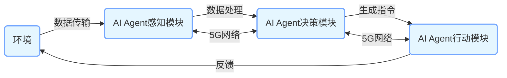

# 5G+AI：探索高速网络下的AI Agent新应用

> 关键词：5G、AI、AI Agent、高速网络、新应用、智能交互、边缘计算

> 摘要：本文聚焦于5G与AI融合背景下AI Agent的新应用。首先介绍了5G和AI Agent的相关背景知识，阐述了研究的目的、范围、预期读者等内容。接着深入剖析5G和AI Agent的核心概念及其联系，详细讲解了相关核心算法原理和具体操作步骤，并给出了数学模型和公式。通过项目实战展示了代码实现和详细解释，探讨了其实际应用场景。同时推荐了学习、开发相关的工具和资源，包括书籍、在线课程、开发框架等。最后总结了未来发展趋势与挑战，提供常见问题解答和扩展阅读参考资料，旨在全面深入地探索高速网络下AI Agent的新应用。

## 1. 背景介绍 
### 1.1 目的和范围
随着5G技术的广泛部署，其高速率、低时延、大容量的特性为各个领域带来了变革性的影响。同时，人工智能领域中的AI Agent技术也在不断发展，具有自主决策、智能交互等能力。本研究的目的在于探索5G与AI Agent结合后在高速网络环境下产生的新应用。研究范围涵盖了5G和AI Agent的基础理论、相关技术的融合原理、算法实现，以及在不同行业中的实际应用案例分析等。

### 1.2 预期读者
本文预期读者包括从事通信技术、人工智能领域的专业研究人员和开发人员，他们可以从技术细节和算法实现等方面获取有价值的信息；也包括相关行业的从业者，如智能交通、工业制造、医疗等领域，能够了解5G+AI Agent在本行业的应用前景和潜在价值；此外，对新兴技术感兴趣的学生和爱好者也可以通过本文初步了解5G和AI Agent结合的相关知识。

### 1.3 文档结构概述
本文首先介绍5G和AI Agent的背景知识，包括研究目的、预期读者等内容。然后深入讲解5G和AI Agent的核心概念及其联系，通过文本示意图和Mermaid流程图进行直观展示。接着详细阐述核心算法原理，并给出Python源代码实现和具体操作步骤。之后介绍相关的数学模型和公式，并举例说明。通过项目实战，展示代码的实际案例和详细解释。探讨5G+AI Agent在不同领域的实际应用场景。推荐学习和开发相关的工具和资源。最后总结未来发展趋势与挑战，提供常见问题解答和扩展阅读参考资料。

### 1.4 术语表
#### 1.4.1 核心术语定义
- **5G**：第五代移动通信技术，具有高速率、低时延、大容量等特点，相比前几代通信技术有了质的飞跃，能够满足更广泛和更高要求的通信需求。
- **AI（Artificial Intelligence）**：人工智能，是研究、开发用于模拟、延伸和扩展人的智能的理论、方法、技术及应用系统的一门新的技术科学。
- **AI Agent**：智能体，是一种能够感知环境、自主决策并采取行动以实现特定目标的实体。它可以根据环境的变化动态调整自己的行为，具有一定的自主性和智能性。
- **边缘计算**：在靠近物或数据源头的一侧，采用网络、计算、存储、应用核心能力为一体的开放平台，就近提供最近端服务。

#### 1.4.2 相关概念解释
- **高速网络**：指具有较高数据传输速率的网络，5G网络就是典型的高速网络，其峰值速率可达数十Gbps，能够快速传输大量的数据。
- **智能交互**：指人与系统、系统与系统之间通过智能技术实现自然、高效、准确的交互过程。AI Agent可以通过语音识别、图像识别等技术实现智能交互。

#### 1.4.3 缩略词列表
- **5G**：Fifth Generation Mobile Communication Technology
- **AI**：Artificial Intelligence
- **IoT**：Internet of Things（物联网）

## 2. 核心概念与联系 

### 2.1 5G核心概念
5G作为新一代移动通信技术，主要有以下三个关键特性：
- **高速率**：5G网络的峰值速率可以达到数十Gbps，相比4G网络有了显著提升。这使得用户能够在短时间内下载大量的高清视频、大型文件等，大大提高了数据传输效率。
- **低时延**：5G网络的端到端时延可以降低到1毫秒以下，能够满足对实时性要求极高的应用场景，如自动驾驶、远程手术等。
- **大容量**：5G网络能够支持每平方公里百万级的设备连接，为物联网的大规模发展提供了有力支撑。

### 2.2 AI Agent核心概念
AI Agent是一个具有自主性、反应性、社会性和主动性的实体。它由以下几个主要部分组成：
- **感知模块**：负责感知环境信息，如通过传感器获取物理环境的数据，或通过网络获取虚拟环境的信息。
- **决策模块**：根据感知到的信息，运用人工智能算法进行推理和决策，选择合适的行动方案。
- **行动模块**：执行决策模块选择的行动，与环境进行交互。

### 2.3 5G与AI Agent的联系
5G的高速率特性使得AI Agent能够快速获取和传输大量的数据，如高清图像、视频等，从而提高其感知能力。低时延特性则保证了AI Agent能够实时响应环境变化，做出及时的决策和行动。大容量特性为多个AI Agent同时运行和大量设备接入提供了可能，促进了AI Agent在物联网等领域的广泛应用。

### 2.4 文本示意图
5G网络为AI Agent提供了高速、低时延、大容量的通信支持，AI Agent通过5G网络与外界环境进行数据交互。AI Agent的感知模块获取的数据通过5G网络快速传输到决策模块进行处理，决策模块生成的行动指令再通过5G网络发送到行动模块执行。

### 2.5 Mermaid流程图


## 3. 核心算法原理 & 具体操作步骤 

### 3.1 核心算法原理
在5G+AI Agent的应用中，常用的核心算法包括强化学习算法和深度学习算法。

#### 3.1.1 强化学习算法
强化学习是一种通过智能体与环境进行交互，不断尝试不同的行动并根据环境反馈的奖励信号来学习最优策略的算法。其基本原理可以用马尔可夫决策过程（MDP）来描述。

马尔可夫决策过程由一个四元组 $(S, A, P, R)$ 组成，其中：
- $S$ 是状态集合，表示智能体所处的环境状态。
- $A$ 是行动集合，表示智能体可以采取的行动。
- $P$ 是状态转移概率，表示在状态 $s$ 采取行动 $a$ 后转移到状态 $s'$ 的概率，即 $P(s'|s, a)$。
- $R$ 是奖励函数，表示在状态 $s$ 采取行动 $a$ 转移到状态 $s'$ 后获得的奖励，即 $R(s, a, s')$。

智能体的目标是找到一个最优策略 $\pi^*$，使得长期累积奖励最大化。

#### 3.1.2 深度学习算法
深度学习是一种基于人工神经网络的机器学习方法，常用于处理复杂的感知任务，如图像识别、语音识别等。在AI Agent中，深度学习可以用于感知模块，对环境信息进行特征提取和分类。

以卷积神经网络（CNN）为例，它通过卷积层、池化层和全连接层对图像进行处理。卷积层通过卷积核提取图像的特征，池化层对特征图进行降维，全连接层将特征图转换为分类结果。

### 3.2 Python源代码实现
以下是一个简单的强化学习算法（Q-learning）的Python实现示例：

```python
import numpy as np

# 定义环境参数
num_states = 5
num_actions = 2
gamma = 0.9  # 折扣因子
alpha = 0.1  # 学习率

# 初始化Q表
Q = np.zeros((num_states, num_actions))

# 定义奖励函数
rewards = np.array([
    [0, 1],
    [1, 0],
    [0, 1],
    [1, 0],
    [0, 1]
])

# 定义Q-learning算法
def q_learning(num_episodes):
    for episode in range(num_episodes):
        state = np.random.randint(0, num_states)  # 随机初始化状态
        done = False
        while not done:
            # 选择行动
            if np.random.uniform(0, 1) < 0.1:  # 探索
                action = np.random.randint(0, num_actions)
            else:  # 利用
                action = np.argmax(Q[state, :])
            
            # 获取奖励和下一个状态
            next_state = np.random.randint(0, num_states)
            reward = rewards[state, action]
            
            # 更新Q表
            Q[state, action] = Q[state, action] + alpha * (reward + gamma * np.max(Q[next_state, :]) - Q[state, action])
            
            state = next_state
            
            # 判断是否结束
            if np.random.uniform(0, 1) < 0.1:
                done = True
    
    return Q

# 训练Q表
Q = q_learning(1000)
print("Q表：", Q)
```

### 3.3 具体操作步骤
1. **环境建模**：根据具体的应用场景，定义状态集合 $S$、行动集合 $A$、状态转移概率 $P$ 和奖励函数 $R$。
2. **初始化Q表**：将Q表初始化为全零矩阵。
3. **训练Q表**：通过多次迭代，智能体与环境进行交互，根据Q-learning算法更新Q表。
4. **策略选择**：在实际应用中，根据训练好的Q表选择最优行动。

## 4. 数学模型和公式 & 详细讲解 & 举例说明 

### 4.1 马尔可夫决策过程（MDP）
马尔可夫决策过程的数学模型由一个四元组 $(S, A, P, R)$ 组成，其中：
- $S$ 是有限的状态集合，$s \in S$ 表示智能体所处的环境状态。
- $A$ 是有限的行动集合，$a \in A$ 表示智能体可以采取的行动。
- $P(s'|s, a)$ 是状态转移概率，表示在状态 $s$ 采取行动 $a$ 后转移到状态 $s'$ 的概率，满足 $\sum_{s' \in S} P(s'|s, a) = 1$。
- $R(s, a, s')$ 是奖励函数，表示在状态 $s$ 采取行动 $a$ 转移到状态 $s'$ 后获得的奖励。

### 4.2 Q-learning算法公式
Q-learning算法的核心公式是Q值更新公式：
$$Q(s, a) \leftarrow Q(s, a) + \alpha [R(s, a, s') + \gamma \max_{a'} Q(s', a') - Q(s, a)]$$
其中：
- $Q(s, a)$ 是状态 $s$ 下采取行动 $a$ 的Q值。
- $\alpha$ 是学习率，控制每次更新的步长。
- $R(s, a, s')$ 是在状态 $s$ 采取行动 $a$ 转移到状态 $s'$ 后获得的奖励。
- $\gamma$ 是折扣因子，用于平衡短期奖励和长期奖励。
- $\max_{a'} Q(s', a')$ 是状态 $s'$ 下所有行动的最大Q值。

### 4.3 举例说明
假设有一个简单的网格世界环境，智能体在一个 $3 \times 3$ 的网格中移动，目标是到达网格的右下角。智能体可以采取上、下、左、右四个行动。状态 $s$ 表示智能体在网格中的位置，行动 $a$ 表示智能体的移动方向。奖励函数定义为：如果智能体到达目标位置，获得奖励10；如果智能体撞到墙壁，获得奖励 -1；其他情况获得奖励0。

初始时，Q表全为零。智能体通过多次与环境交互，根据Q-learning算法更新Q表。经过训练后，Q表中的值会逐渐收敛，智能体可以根据Q表选择最优行动，快速到达目标位置。

## 5. 项目实战：代码实际案例和详细解释说明 

### 5.1 开发环境搭建
#### 5.1.1 硬件环境
- **服务器**：可以选择配置较高的云服务器或本地服务器，如阿里云ECS、腾讯云CVM等，要求至少有4核CPU、8GB内存。
- **网络设备**：支持5G网络的路由器或移动设备，确保能够稳定连接5G网络。

#### 5.1.2 软件环境
- **操作系统**：推荐使用Ubuntu 20.04 LTS或Windows 10。
- **编程语言**：Python 3.8及以上版本。
- **开发框架**：安装TensorFlow、PyTorch等深度学习框架，以及OpenAI Gym等强化学习环境库。

### 5.2 源代码详细实现和代码解读
以下是一个基于OpenAI Gym环境的强化学习项目示例：

```python
import gym
import numpy as np

# 创建环境
env = gym.make('CartPole-v1')

# 定义超参数
num_episodes = 1000
max_steps_per_episode = 500
learning_rate = 0.1
discount_rate = 0.99

# 初始化Q表
num_states = env.observation_space.shape[0]
num_actions = env.action_space.n
Q = np.zeros((num_states, num_actions))

# 训练Q表
for episode in range(num_episodes):
    state = env.reset()
    done = False
    for step in range(max_steps_per_episode):
        # 选择行动
        if np.random.uniform(0, 1) < 0.1:  # 探索
            action = env.action_space.sample()
        else:  # 利用
            action = np.argmax(Q[state, :])
        
        # 执行行动
        next_state, reward, done, _ = env.step(action)
        
        # 更新Q表
        Q[state, action] = Q[state, action] + learning_rate * (reward + discount_rate * np.max(Q[next_state, :]) - Q[state, action])
        
        state = next_state
        
        if done:
            break

# 测试Q表
state = env.reset()
done = False
total_reward = 0
while not done:
    action = np.argmax(Q[state, :])
    state, reward, done, _ = env.step(action)
    total_reward += reward

print("测试总奖励：", total_reward)
```

### 5.3 代码解读与分析
1. **环境创建**：使用 `gym.make('CartPole-v1')` 创建OpenAI Gym的CartPole环境。
2. **超参数定义**：设置训练的总回合数 `num_episodes`、每回合的最大步数 `max_steps_per_episode`、学习率 `learning_rate` 和折扣率 `discount_rate`。
3. **Q表初始化**：根据环境的状态空间和行动空间大小初始化Q表。
4. **训练Q表**：在每个回合中，智能体与环境进行交互，根据Q-learning算法更新Q表。
5. **测试Q表**：使用训练好的Q表进行测试，计算总奖励。

## 6. 实际应用场景 
### 6.1 智能交通
在智能交通领域，5G+AI Agent可以实现车辆的自动驾驶和交通流量的智能管理。AI Agent可以通过传感器感知周围环境信息，如车辆位置、速度、交通信号等，利用5G网络将这些信息实时传输到决策中心。决策中心的AI Agent根据这些信息进行决策，如车辆的行驶路线规划、交通信号的优化控制等。同时，车辆上的AI Agent可以根据决策中心的指令实时调整行驶状态，实现自动驾驶。

### 6.2 工业制造
在工业制造中，5G+AI Agent可以实现生产过程的自动化和智能化。AI Agent可以监测生产设备的运行状态，如温度、压力、振动等，利用5G网络将这些数据实时传输到监控中心。监控中心的AI Agent根据这些数据进行分析和决策，如设备的故障预警、生产计划的优化等。同时，生产线上的AI Agent可以根据监控中心的指令实时调整生产参数，实现生产过程的自动化控制。

### 6.3 医疗健康
在医疗健康领域，5G+AI Agent可以实现远程医疗和智能诊断。AI Agent可以通过可穿戴设备或医疗传感器收集患者的生理数据，如心率、血压、血糖等，利用5G网络将这些数据实时传输到医疗中心。医疗中心的AI Agent根据这些数据进行分析和诊断，如疾病的预测、治疗方案的推荐等。同时，医生可以通过5G网络远程控制医疗设备，对患者进行治疗，实现远程医疗。

### 6.4 智能家居
在智能家居领域，5G+AI Agent可以实现家居设备的智能控制和场景自动化。AI Agent可以通过传感器感知家居环境信息，如温度、湿度、光照等，利用5G网络将这些信息实时传输到智能控制中心。智能控制中心的AI Agent根据这些信息进行决策，如自动调节空调温度、开关灯光等。同时，用户可以通过手机APP或语音指令与AI Agent进行交互，实现家居设备的智能控制。

## 7. 工具和资源推荐
### 7.1 学习资源推荐
#### 7.1.1 书籍推荐
- 《深度学习》（Deep Learning），作者：Ian Goodfellow、Yoshua Bengio和Aaron Courville，这本书是深度学习领域的经典教材，全面介绍了深度学习的理论和方法。
- 《强化学习：原理与Python实现》，作者：智能系统实验室，这本书详细介绍了强化学习的基本原理和Python实现，适合初学者学习。

#### 7.1.2 在线课程
- Coursera上的“深度学习专项课程”（Deep Learning Specialization），由Andrew Ng教授授课，内容涵盖深度学习的各个方面。
- edX上的“强化学习基础”（Foundations of Reinforcement Learning），由DeepMind的研究人员授课，系统介绍了强化学习的理论和算法。

#### 7.1.3 技术博客和网站
- Medium上有很多关于5G、AI和AI Agent的技术博客，如Towards Data Science、The AI Blog等。
- 开源中国（OSChina）和CSDN等技术网站上也有很多相关的技术文章和案例分享。

### 7.2 开发工具框架推荐
#### 7.2.1 IDE和编辑器
- PyCharm：一款专业的Python集成开发环境，提供了丰富的代码编辑、调试和版本控制等功能。
- Visual Studio Code：一款轻量级的代码编辑器，支持多种编程语言，并且有大量的扩展插件可以使用。

#### 7.2.2 调试和性能分析工具
- TensorBoard：TensorFlow的可视化工具，可以用于查看训练过程中的损失函数、准确率等指标，以及模型的结构和参数。
- Py-Spy：一个用于Python程序的性能分析工具，可以帮助开发者找出程序中的性能瓶颈。

#### 7.2.3 相关框架和库
- TensorFlow：一个开源的机器学习框架，提供了丰富的深度学习模型和工具，支持分布式训练和部署。
- PyTorch：另一个开源的深度学习框架，具有动态图的特点，易于使用和调试。
- OpenAI Gym：一个用于开发和比较强化学习算法的工具包，提供了多种环境和基准测试。

### 7.3 相关论文著作推荐
#### 7.3.1 经典论文
- “Playing Atari with Deep Reinforcement Learning”，作者：Volodymyr Mnih等，这篇论文首次提出了深度Q网络（DQN）算法，开创了深度强化学习的先河。
- “Attention Is All You Need”，作者：Ashish Vaswani等，这篇论文提出了Transformer模型，在自然语言处理领域取得了巨大成功。

#### 7.3.2 最新研究成果
- 可以关注arXiv.org上的最新研究论文，了解5G、AI和AI Agent领域的最新进展。
- 国际顶级学术会议，如NeurIPS（神经信息处理系统大会）、ICML（国际机器学习会议）等，会发表很多相关的研究成果。

#### 7.3.3 应用案例分析
- 《5G应用案例集》，这本书收集了5G在各个领域的应用案例，包括智能交通、工业制造、医疗健康等。
- 各大科技公司的官方博客和技术报告，如华为、谷歌、微软等，会分享一些5G+AI Agent的应用案例和实践经验。

## 8. 总结：未来发展趋势与挑战
### 8.1 未来发展趋势
- **更广泛的应用领域**：5G+AI Agent将在更多领域得到应用，如农业、教育、金融等，推动这些领域的智能化升级。
- **边缘智能的发展**：随着边缘计算技术的不断发展，AI Agent将更多地部署在边缘设备上，实现数据的本地处理和决策，减少对云端的依赖。
- **多智能体协同**：多个AI Agent之间的协同工作将成为未来的发展方向，如智能交通中的车辆协同、工业制造中的机器人协同等。

### 8.2 挑战
- **安全和隐私问题**：5G+AI Agent涉及大量的数据传输和处理，安全和隐私问题成为关键挑战。需要加强数据加密、访问控制等技术，保障用户数据的安全和隐私。
- **标准和规范的缺失**：目前5G+AI Agent领域还缺乏统一的标准和规范，导致不同厂商的产品和系统之间难以兼容和互操作。需要加快标准和规范的制定，促进产业的健康发展。
- **人才短缺**：5G和AI Agent领域的发展需要大量的专业人才，包括通信技术、人工智能、软件工程等方面的人才。目前人才短缺问题比较突出，需要加强人才培养和引进。

## 9. 附录：常见问题与解答
### 9.1 5G和AI Agent结合的优势是什么？
5G的高速率、低时延、大容量特性为AI Agent提供了更好的通信支持，使得AI Agent能够快速获取和传输大量的数据，实时响应环境变化，并且支持多个AI Agent同时运行和大量设备接入。同时，AI Agent的智能决策和行动能力可以充分利用5G网络的优势，实现更高效、智能的应用。

### 9.2 如何选择适合的AI Agent算法？
选择适合的AI Agent算法需要考虑应用场景、问题复杂度、数据规模等因素。如果问题具有明确的奖励函数和状态转移规则，可以选择强化学习算法；如果需要处理复杂的感知任务，如图像识别、语音识别等，可以选择深度学习算法。

### 9.3 5G+AI Agent在实际应用中会遇到哪些技术难题？
在实际应用中，5G+AI Agent可能会遇到信号覆盖不足、网络拥塞、数据安全和隐私等技术难题。此外，AI Agent的决策和行动可能会受到环境噪声、传感器误差等因素的影响，需要提高算法的鲁棒性和适应性。

## 10. 扩展阅读 & 参考资料
### 10.1 扩展阅读
- 《5G技术详解：原理、标准与网络部署》，这本书详细介绍了5G技术的原理、标准和网络部署方法。
- 《人工智能：一种现代的方法》（Artificial Intelligence: A Modern Approach），作者：Stuart Russell和Peter Norvig，这本书是人工智能领域的经典教材，全面介绍了人工智能的理论和方法。

### 10.2 参考资料
- 3GPP（第三代合作伙伴计划）官方网站，提供了5G技术的标准和规范。
- IEEE（电气和电子工程师协会）、ACM（美国计算机协会）等学术组织的期刊和会议论文，提供了5G、AI和AI Agent领域的最新研究成果。