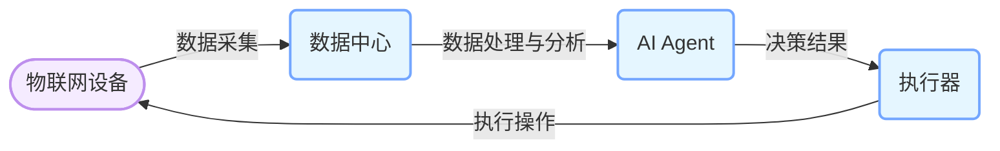

# AI Agent与物联网的结合应用

> 关键词：AI Agent、物联网、结合应用、智能决策、数据处理

> 摘要：本文深入探讨了AI Agent与物联网的结合应用。首先介绍了相关背景知识，包括目的、预期读者等内容。接着阐述了AI Agent与物联网的核心概念及联系，详细讲解了核心算法原理与具体操作步骤，同时给出了相关的数学模型和公式。通过项目实战展示了结合应用的代码实现及解读。分析了实际应用场景，推荐了学习所需的工具和资源。最后对未来发展趋势与挑战进行了总结，并给出常见问题解答和参考资料，旨在全面展现AI Agent与物联网结合的巨大潜力和广阔前景。

## 1. 背景介绍 
### 1.1 目的和范围
随着信息技术的飞速发展，物联网（Internet of Things, IoT）和人工智能（Artificial Intelligence, AI）领域都取得了长足的进步。物联网实现了设备之间的互联互通，产生了海量的数据；而AI Agent作为人工智能的重要分支，具备自主决策和学习的能力。本文章的目的在于探讨如何将AI Agent与物联网进行有效的结合，实现更智能、高效的系统应用。范围涵盖了AI Agent和物联网的基本概念、结合的原理、算法实现、实际应用场景以及未来发展趋势等方面。

### 1.2 预期读者
本文预期读者包括对物联网和人工智能领域感兴趣的技术爱好者、从事相关领域研究的科研人员、希望将AI Agent与物联网结合应用到实际项目中的开发者和企业技术人员等。

### 1.3 文档结构概述
本文首先介绍背景知识，包括目的、读者和文档结构等内容。然后阐述AI Agent与物联网的核心概念及它们之间的联系，通过文本示意图和Mermaid流程图进行直观展示。接着详细讲解核心算法原理和具体操作步骤，结合Python源代码进行说明。给出相关的数学模型和公式，并举例说明。通过项目实战展示结合应用的代码实现和详细解读。分析实际应用场景，推荐学习所需的工具和资源。最后总结未来发展趋势与挑战，给出常见问题解答和参考资料。

### 1.4 术语表
#### 1.4.1 核心术语定义
- **AI Agent（人工智能代理）**：是一种能够感知环境、自主决策并采取行动以实现特定目标的软件实体或系统。它可以根据环境的变化和自身的目标，灵活地调整自己的行为。
- **物联网（Internet of Things, IoT）**：通过各种信息传感设备，如射频识别（RFID）装置、红外感应器、全球定位系统、激光扫描器等种种装置与技术，实时采集任何需要监控、 连接、互动的物体或过程，采集其声、光、热、电、力学、化学、生物、位置等各种需要的信息，与互联网结合形成的一个巨大网络。其目的是实现物与物、物与人，所有的物品与网络的连接，方便识别、管理和控制。

#### 1.4.2 相关概念解释
- **智能决策**：AI Agent根据感知到的环境信息，运用一定的算法和策略，做出最优的决策以实现目标。
- **数据采集**：物联网中各种设备收集环境中的数据，如温度、湿度、压力等。

#### 1.4.3 缩略词列表
- **IoT**：Internet of Things（物联网）
- **AI**：Artificial Intelligence（人工智能）

## 2. 核心概念与联系 
### 核心概念原理
#### AI Agent
AI Agent是一个具有自主性、反应性、社会性和主动性的智能实体。自主性意味着它能够在没有人类干预的情况下独立运行；反应性表示它能够感知环境的变化并及时做出响应；社会性体现了它可以与其他Agent或人类进行交互；主动性则是指它能够主动地采取行动以实现自己的目标。

AI Agent通常由三个主要部分组成：感知模块、决策模块和执行模块。感知模块负责收集环境信息，决策模块根据这些信息和自身的目标进行决策，执行模块则将决策转化为实际的行动。

#### 物联网
物联网是通过各种传感器和网络技术，将物理世界中的物体连接到互联网上，实现物体之间的信息交换和远程控制。物联网的核心是传感器和网络，传感器负责采集物体的各种信息，网络则负责将这些信息传输到数据中心或其他设备上进行处理。

### 架构的文本示意图
AI Agent与物联网的结合架构可以描述如下：物联网中的各种设备（如传感器、执行器等）通过网络将采集到的数据传输到数据中心。数据中心对这些数据进行处理和分析，然后将分析结果发送给AI Agent。AI Agent根据这些信息进行决策，并将决策结果发送给执行器，执行器根据决策结果执行相应的操作。

### Mermaid流程图


## 3. 核心算法原理 & 具体操作步骤 
### 核心算法原理
在AI Agent与物联网的结合中，常用的算法包括强化学习算法。强化学习是一种通过智能体与环境进行交互，不断尝试和学习以最大化累积奖励的机器学习方法。

以下是一个简单的强化学习算法原理示例，使用Q - learning算法。Q - learning算法通过更新Q表来学习最优策略。Q表记录了在每个状态下采取每个动作的价值。

### Python源代码详细阐述
```python
import numpy as np

# 定义环境参数
num_states = 5
num_actions = 2
learning_rate = 0.1
discount_factor = 0.9
epsilon = 0.1
num_episodes = 100

# 初始化Q表
Q = np.zeros((num_states, num_actions))

# 定义环境交互函数
def get_reward(state, action):
    # 简单示例，根据状态和动作返回奖励
    if state == 2 and action == 1:
        return 10
    else:
        return -1

def get_next_state(state, action):
    # 简单示例，根据状态和动作返回下一个状态
    if action == 0:
        return (state - 1) % num_states
    else:
        return (state + 1) % num_states

# Q - learning算法
for episode in range(num_episodes):
    state = np.random.randint(0, num_states)
    done = False
    while not done:
        # 选择动作
        if np.random.uniform(0, 1) < epsilon:
            action = np.random.randint(0, num_actions)
        else:
            action = np.argmax(Q[state, :])
        
        # 执行动作，获取奖励和下一个状态
        reward = get_reward(state, action)
        next_state = get_next_state(state, action)
        
        # 更新Q表
        Q[state, action] = Q[state, action] + learning_rate * (reward + discount_factor * np.max(Q[next_state, :]) - Q[state, action])
        
        # 判断是否结束
        if state == 2 and action == 1:
            done = True
        state = next_state

print("最终的Q表:")
print(Q)
```

### 具体操作步骤
1. **初始化**：初始化Q表，设置学习率、折扣因子、探索率等参数。
2. **选择动作**：根据当前状态和探索率，选择一个动作。可以使用贪心策略或探索性策略。
3. **执行动作**：执行选择的动作，获取奖励和下一个状态。
4. **更新Q表**：根据奖励和下一个状态的最大Q值，更新当前状态和动作的Q值。
5. **判断是否结束**：判断是否达到终止条件，如果是则结束当前回合，否则继续下一个状态的处理。
6. **重复步骤2 - 5**：进行多个回合的训练，直到Q表收敛。

## 4. 数学模型和公式 & 详细讲解 & 举例说明 
### 数学模型和公式
在Q - learning算法中，核心的更新公式为：

$$Q(s, a) \leftarrow Q(s, a) + \alpha \left[ r + \gamma \max_{a'} Q(s', a') - Q(s, a) \right]$$

其中：
- $Q(s, a)$ 表示在状态 $s$ 下采取动作 $a$ 的Q值。
- $\alpha$ 是学习率，控制每次更新的步长。
- $r$ 是执行动作 $a$ 后获得的奖励。
- $\gamma$ 是折扣因子，用于权衡当前奖励和未来奖励的重要性。
- $s'$ 是执行动作 $a$ 后转移到的下一个状态。
- $\max_{a'} Q(s', a')$ 表示在下一个状态 $s'$ 下所有可能动作中最大的Q值。

### 详细讲解
这个公式的含义是，根据当前的奖励和下一个状态的最大Q值，对当前状态和动作的Q值进行更新。学习率 $\alpha$ 决定了每次更新的幅度，如果 $\alpha$ 较大，则更新速度较快，但可能会导致不稳定；如果 $\alpha$ 较小，则更新速度较慢，但更稳定。折扣因子 $\gamma$ 表示未来奖励的重要性，如果 $\gamma$ 接近1，则更看重未来的奖励；如果 $\gamma$ 接近0，则更看重当前的奖励。

### 举例说明
假设当前状态 $s = 1$，动作 $a = 0$，学习率 $\alpha = 0.1$，折扣因子 $\gamma = 0.9$，奖励 $r = -1$，下一个状态 $s' = 0$，下一个状态的最大Q值 $\max_{a'} Q(s', a') = 2$，当前状态和动作的Q值 $Q(s, a) = 1$。

则更新后的Q值为：

$$Q(1, 0) = 1 + 0.1 \left[ -1 + 0.9 \times 2 - 1 \right]$$
$$Q(1, 0) = 1 + 0.1 \left[ -1 + 1.8 - 1 \right]$$
$$Q(1, 0) = 1 + 0.1 \times (-0.2)$$
$$Q(1, 0) = 1 - 0.02 = 0.98$$

## 5. 项目实战：代码实际案例和详细解释说明 
### 5.1  开发环境搭建
#### 硬件环境
- 物联网设备：可以选择一些常见的传感器和执行器，如温度传感器、湿度传感器、继电器等。
- 开发板：如树莓派（Raspberry Pi），用于连接和控制物联网设备。

#### 软件环境
- 操作系统：可以选择Raspbian等适合树莓派的操作系统。
- 开发语言：Python，因为Python具有丰富的库和易于使用的特点。
- 相关库：`paho - mqtt` 用于MQTT通信，`RPi.GPIO` 用于控制树莓派的GPIO引脚。

### 5.2  源代码详细实现和代码解读
```python
import paho.mqtt.client as mqtt
import RPi.GPIO as GPIO
import time

# MQTT配置
MQTT_BROKER = "localhost"
MQTT_PORT = 1883
MQTT_TOPIC = "iot/sensor"

# GPIO配置
LED_PIN = 17

# 初始化GPIO
GPIO.setmode(GPIO.BCM)
GPIO.setup(LED_PIN, GPIO.OUT)

# MQTT回调函数
def on_connect(client, userdata, flags, rc):
    print("Connected with result code " + str(rc))
    client.subscribe(MQTT_TOPIC)

def on_message(client, userdata, msg):
    try:
        sensor_value = float(msg.payload.decode())
        if sensor_value > 50:
            GPIO.output(LED_PIN, GPIO.HIGH)
        else:
            GPIO.output(LED_PIN, GPIO.LOW)
    except ValueError:
        print("Invalid sensor value")

# 创建MQTT客户端
client = mqtt.Client()
client.on_connect = on_connect
client.on_message = on_message

# 连接到MQTT代理
client.connect(MQTT_BROKER, MQTT_PORT, 60)

# 开始循环处理网络流量
client.loop_start()

try:
    while True:
        time.sleep(1)
except KeyboardInterrupt:
    print("Exiting...")
    client.loop_stop()
    GPIO.cleanup()
```

### 5.3  代码解读与分析
1. **MQTT配置**：设置MQTT代理的地址、端口和订阅的主题。
2. **GPIO配置**：设置LED引脚，并将其初始化为输出模式。
3. **MQTT回调函数**：
    - `on_connect` 函数在连接到MQTT代理成功后被调用，用于订阅指定的主题。
    - `on_message` 函数在接收到MQTT消息时被调用，解析传感器数据，并根据数据的值控制LED的开关。
4. **创建MQTT客户端**：创建一个MQTT客户端实例，并设置回调函数。
5. **连接到MQTT代理**：连接到指定的MQTT代理，并开始循环处理网络流量。
6. **主循环**：使用 `time.sleep(1)` 保持程序运行，直到用户按下 `Ctrl + C` 退出。
7. **清理资源**：在程序退出时，停止MQTT循环，并清理GPIO资源。

## 6. 实际应用场景 
### 智能家居
在智能家居系统中，AI Agent与物联网的结合可以实现更智能的家居控制。例如，通过物联网传感器收集室内温度、湿度、光照等信息，AI Agent根据这些信息和用户的习惯进行智能决策，自动调节空调、灯光等设备的运行状态，提高家居的舒适度和能源效率。

### 工业自动化
在工业生产中，物联网设备可以实时监测生产设备的运行状态、温度、压力等参数。AI Agent可以根据这些数据进行故障预测和诊断，及时调整生产过程，提高生产效率和产品质量。同时，AI Agent还可以协调多个设备之间的工作，实现自动化生产。

### 智能交通
在智能交通系统中，物联网传感器可以收集车辆的位置、速度、行驶方向等信息。AI Agent可以根据这些信息进行交通流量预测和优化，调整交通信号灯的时间，引导车辆行驶，减少交通拥堵，提高交通安全性。

### 环境监测
通过物联网设备收集环境数据，如空气质量、水质、土壤湿度等。AI Agent可以对这些数据进行分析和处理，及时发现环境问题，并采取相应的措施进行治理和预防。

## 7. 工具和资源推荐
### 7.1 学习资源推荐
#### 7.1.1 书籍推荐
- 《人工智能：一种现代的方法》：全面介绍了人工智能的基本概念、算法和应用，是人工智能领域的经典教材。
- 《Python机器学习》：详细介绍了Python在机器学习中的应用，包括各种机器学习算法的实现和优化。
- 《物联网：技术、应用与标准》：系统介绍了物联网的技术原理、应用场景和相关标准。

#### 7.1.2 在线课程
- Coursera上的“人工智能基础”课程：由知名教授授课，内容涵盖人工智能的基本概念、算法和应用。
- edX上的“物联网基础”课程：介绍了物联网的技术原理、应用场景和开发方法。
- 网易云课堂上的“Python数据分析与机器学习实战”课程：通过实际案例，讲解Python在数据分析和机器学习中的应用。

#### 7.1.3 技术博客和网站
- 博客园：有许多技术博主分享人工智能和物联网的技术文章和经验。
- 开源中国：提供了丰富的开源项目和技术文章，涵盖了人工智能和物联网领域。
- IEEE Xplore：是电气和电子工程师协会（IEEE）的数字图书馆，提供了大量的学术论文和技术报告。

### 7.2 开发工具框架推荐
#### 7.2.1 IDE和编辑器
- PyCharm：是一款专门为Python开发设计的集成开发环境，具有代码自动补全、调试、版本控制等功能。
- Visual Studio Code：是一款轻量级的代码编辑器，支持多种编程语言，具有丰富的插件和扩展功能。

#### 7.2.2 调试和性能分析工具
- pdb：Python的内置调试器，可以帮助开发者进行代码调试。
- cProfile：Python的性能分析工具，可以分析代码的运行时间和资源占用情况。

#### 7.2.3 相关框架和库
- TensorFlow：是一个开源的机器学习框架，广泛应用于深度学习领域。
- PyTorch：是另一个流行的深度学习框架，具有动态计算图和易于使用的特点。
- scikit - learn：是一个简单高效的机器学习库，提供了各种机器学习算法和工具。

### 7.3 相关论文著作推荐
#### 7.3.1 经典论文
- “Reinforcement Learning: An Introduction”：介绍了强化学习的基本概念、算法和应用，是强化学习领域的经典论文。
- “The Internet of Things: A Survey”：对物联网的技术原理、应用场景和发展趋势进行了全面的综述。

#### 7.3.2 最新研究成果
- 可以通过IEEE Xplore、ACM Digital Library等学术数据库查找最新的关于AI Agent与物联网结合的研究成果。

#### 7.3.3 应用案例分析
- 可以参考一些企业和研究机构发布的关于AI Agent与物联网结合的应用案例分析报告，了解实际应用中的经验和挑战。

## 8. 总结：未来发展趋势与挑战
### 未来发展趋势
- **更深度的融合**：AI Agent与物联网将实现更深度的融合，AI Agent将更加紧密地嵌入到物联网设备中，实现设备的自主决策和智能控制。
- **边缘计算的应用**：随着边缘计算技术的发展，AI Agent可以在物联网设备的边缘进行数据处理和决策，减少数据传输延迟，提高系统的响应速度和可靠性。
- **跨领域应用**：AI Agent与物联网的结合将应用于更多的领域，如医疗保健、农业、能源等，为各个领域带来创新和变革。

### 挑战
- **数据安全和隐私**：物联网产生的大量数据涉及到用户的隐私和安全问题，如何保护这些数据的安全和隐私是一个重要的挑战。
- **标准和互操作性**：目前物联网设备和AI Agent的标准和协议不统一，导致不同设备和系统之间的互操作性较差，需要建立统一的标准和协议。
- **算法复杂度和资源限制**：一些复杂的AI算法需要大量的计算资源和存储空间，而物联网设备通常资源有限，如何在资源受限的情况下实现高效的AI算法是一个挑战。

## 9. 附录：常见问题与解答
### 问题1：AI Agent与物联网结合的关键技术有哪些？
答：关键技术包括传感器技术、网络通信技术、数据处理和分析技术、人工智能算法（如机器学习、深度学习、强化学习等）。

### 问题2：如何确保AI Agent在物联网中的决策是正确的？
答：可以通过以下方法确保决策的正确性：1. 收集大量准确的数据进行训练；2. 使用合适的算法和模型；3. 进行模型评估和验证；4. 结合人类的经验和知识进行决策。

### 问题3：AI Agent与物联网结合在实际应用中会遇到哪些问题？
答：可能会遇到数据安全和隐私问题、设备故障和可靠性问题、网络延迟和带宽问题、算法复杂度和资源限制问题等。

## 10. 扩展阅读 & 参考资料
### 扩展阅读
- 《人工智能时代的物联网安全》：深入探讨了人工智能时代物联网安全的相关问题和解决方案。
- 《智能物联网：技术与应用》：介绍了智能物联网的最新技术和应用案例。

### 参考资料
- IEEE Transactions on Industrial Informatics：发表了许多关于物联网和人工智能的学术论文。
- ACM Transactions on Sensor Networks：提供了传感器网络和物联网领域的研究成果。
- 相关企业和研究机构的官方网站，如Google AI、IBM Watson等。