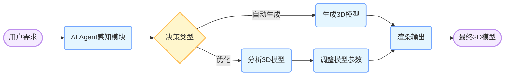

# AI Agent在3D建模中的应用：自动生成与优化

> 关键词：AI Agent、3D建模、自动生成、优化、人工智能

> 摘要：本文深入探讨了AI Agent在3D建模中的应用，着重研究其自动生成和优化的功能。首先介绍了相关背景知识，包括目的、预期读者、文档结构等。接着阐述了AI Agent和3D建模的核心概念及联系，详细讲解了核心算法原理与具体操作步骤，并给出了相应的数学模型和公式。通过项目实战展示了代码实际案例及详细解释。分析了AI Agent在3D建模中的实际应用场景，推荐了相关的工具和资源。最后总结了未来发展趋势与挑战，并提供了常见问题解答和扩展阅读参考资料，旨在为读者全面呈现AI Agent在3D建模领域的应用情况。

## 1. 背景介绍 
### 1.1 目的和范围
随着计算机图形学和人工智能技术的不断发展，3D建模在影视、游戏、工业设计、建筑等众多领域的应用越来越广泛。传统的3D建模方法往往需要专业的建模人员花费大量的时间和精力进行手工创作，效率较低且成本较高。AI Agent在3D建模中的应用为解决这些问题提供了新的思路和方法。

本文的目的在于深入探讨AI Agent在3D建模中自动生成和优化的应用原理、方法和技术。范围涵盖了AI Agent和3D建模的基本概念、核心算法、数学模型，以及通过项目实战展示具体的应用过程和效果。同时，分析了AI Agent在不同实际场景中的应用，并推荐了相关的学习资源、开发工具和研究论文。

### 1.2 预期读者
本文预期读者包括但不限于以下几类人群：
- 计算机图形学、人工智能领域的研究人员和学者，希望了解AI Agent在3D建模领域的最新研究进展和应用技术。
- 3D建模专业人员，包括游戏建模师、影视特效师、工业设计师等，希望借助AI Agent提高建模效率和质量。
- 对3D建模和人工智能感兴趣的程序员和开发者，希望学习相关的算法和编程实现。
- 相关专业的学生，如计算机科学、数字媒体技术等专业，作为学习和研究的参考资料。

### 1.3 文档结构概述
本文按照以下结构进行组织：
- 背景介绍：阐述本文的目的、范围、预期读者和文档结构，以及相关术语的定义和解释。
- 核心概念与联系：介绍AI Agent和3D建模的核心概念，以及它们之间的联系，并通过文本示意图和Mermaid流程图进行说明。
- 核心算法原理 & 具体操作步骤：详细讲解AI Agent在3D建模中自动生成和优化的核心算法原理，并给出具体的操作步骤和Python源代码实现。
- 数学模型和公式 & 详细讲解 & 举例说明：介绍相关的数学模型和公式，并通过具体的例子进行详细讲解。
- 项目实战：代码实际案例和详细解释说明：通过一个具体的项目实战，展示AI Agent在3D建模中自动生成和优化的代码实现和详细解释。
- 实际应用场景：分析AI Agent在3D建模中的实际应用场景，包括影视、游戏、工业设计等领域。
- 工具和资源推荐：推荐相关的学习资源、开发工具和研究论文，帮助读者进一步深入学习和研究。
- 总结：未来发展趋势与挑战：总结AI Agent在3D建模中的应用现状，分析未来的发展趋势和面临的挑战。
- 附录：常见问题与解答：解答读者在阅读和学习过程中可能遇到的常见问题。
- 扩展阅读 & 参考资料：提供相关的扩展阅读资料和参考书目，方便读者进一步深入学习和研究。

### 1.4 术语表
#### 1.4.1 核心术语定义
- **AI Agent（人工智能智能体）**：是一个能够感知环境、做出决策并采取行动的实体，它可以根据环境的变化自主地调整自己的行为，以实现特定的目标。
- **3D建模**：是一种利用计算机图形学技术创建三维物体模型的过程，通过对物体的几何形状、材质、纹理等属性进行定义和描述，生成逼真的三维图像。
- **自动生成**：指在3D建模过程中，利用AI Agent根据给定的输入条件和规则，自动创建3D模型的过程。
- **优化**：指对已有的3D模型进行改进和完善，提高模型的质量、效率和性能的过程。

#### 1.4.2 相关概念解释
- **计算机图形学**：是研究如何利用计算机生成、处理和显示图形的学科，是3D建模的基础。
- **人工智能**：是研究如何使计算机能够模拟人类智能的学科，包括机器学习、深度学习、自然语言处理等多个领域，AI Agent是人工智能的一种具体实现形式。
- **机器学习**：是一种让计算机通过数据学习模式和规律的方法，常用于AI Agent的训练和优化。
- **深度学习**：是机器学习的一个分支，通过构建多层神经网络来学习数据的复杂特征和模式，在图像识别、语音识别等领域取得了显著的成果。

#### 1.4.3 缩略词列表
- **AI**：Artificial Intelligence，人工智能
- **ML**：Machine Learning，机器学习
- **DL**：Deep Learning，深度学习
- **3D**：Three-Dimensional，三维

## 2. 核心概念与联系 

### 2.1 AI Agent核心概念
AI Agent是人工智能领域中的一个重要概念，它可以被看作是一个具有自主性、反应性、社会性和适应性的实体。自主性意味着AI Agent能够在没有人类干预的情况下独立地做出决策和采取行动；反应性表示AI Agent能够感知环境的变化并及时做出响应；社会性指AI Agent可以与其他Agent或人类进行交互和协作；适应性则说明AI Agent能够根据环境的变化和自身的经验不断调整自己的行为和策略。

AI Agent通常由以下几个部分组成：
- **感知模块**：用于感知环境的状态和信息，例如通过摄像头、传感器等设备获取图像、声音、温度等数据。
- **决策模块**：根据感知到的环境信息和自身的目标，运用一定的算法和策略做出决策，选择合适的行动。
- **行动模块**：根据决策模块的输出，执行相应的行动，例如控制机器人的运动、调整模型的参数等。
- **学习模块**：通过对环境的交互和经验的积累，不断学习和改进自己的行为和策略，提高自身的性能和智能水平。

### 2.2 3D建模核心概念
3D建模是创建三维物体模型的过程，它涉及到多个方面的知识和技术。从几何角度来看，3D模型是由一系列的点、线、面等基本几何元素组成的，通过对这些几何元素的组合和变换，可以构建出复杂的物体形状。从材质和纹理方面考虑，3D模型需要赋予物体不同的材质属性，如颜色、光泽、透明度等，以及纹理信息，如表面图案、细节等，以增加模型的真实感。

3D建模的流程通常包括以下几个步骤：
- **概念设计**：确定模型的主题、风格和大致形状，绘制草图或制作概念模型。
- **基础建模**：使用3D建模软件，根据概念设计的要求，创建模型的基本几何形状，如立方体、球体、圆柱体等，并进行组合和编辑。
- **细节雕刻**：对模型进行细节处理，如添加褶皱、纹理、凹凸等，使模型更加逼真。
- **材质和纹理映射**：为模型赋予合适的材质和纹理，调整颜色、光泽、反射等属性，使模型看起来更加真实。
- **渲染**：将3D模型转换为2D图像，通过光照、阴影、反射等效果的计算，生成逼真的图像。

### 2.3 AI Agent与3D建模的联系
AI Agent在3D建模中的应用主要体现在自动生成和优化两个方面。在自动生成方面，AI Agent可以根据用户的需求和输入条件，如模型的类型、风格、尺寸等，自动创建3D模型。例如，AI Agent可以学习大量的3D模型数据，掌握不同类型模型的特征和规律，然后根据用户的要求生成相应的模型。在优化方面，AI Agent可以对已有的3D模型进行分析和评估，找出模型存在的问题，如几何缺陷、材质不合理等，并自动调整模型的参数，提高模型的质量和性能。

### 2.4 文本示意图
AI Agent与3D建模的联系可以用以下文本示意图表示：

用户需求 -> AI Agent感知模块 -> AI Agent决策模块 -> 生成或优化3D模型 -> 渲染输出

### 2.5 Mermaid流程图


## 3. 核心算法原理 & 具体操作步骤 

### 3.1 自动生成3D模型的算法原理
自动生成3D模型的核心算法通常基于机器学习和深度学习技术，其中生成对抗网络（GAN）和变分自编码器（VAE）是常用的方法。

#### 3.1.1 生成对抗网络（GAN）
生成对抗网络由生成器（Generator）和判别器（Discriminator）两个部分组成。生成器的任务是根据随机噪声生成3D模型，判别器的任务是判断输入的3D模型是真实的还是生成的。生成器和判别器通过对抗训练的方式不断提高自己的性能，直到生成器能够生成逼真的3D模型。

#### 3.1.2 变分自编码器（VAE）
变分自编码器是一种无监督学习模型，它由编码器（Encoder）和解码器（Decoder）两个部分组成。编码器将输入的3D模型编码为低维的潜在向量，解码器将潜在向量解码为3D模型。通过对潜在向量的采样和重构，VAE可以生成新的3D模型。

### 3.2 优化3D模型的算法原理
优化3D模型的算法通常基于强化学习和遗传算法。

#### 3.2.1 强化学习
强化学习是一种通过智能体与环境的交互来学习最优策略的方法。在3D建模中，智能体可以是AI Agent，环境可以是3D模型的参数空间。AI Agent通过不断地尝试不同的模型参数，根据环境的反馈（如模型的质量评估指标）来调整自己的策略，最终找到最优的模型参数。

#### 3.2.2 遗传算法
遗传算法是一种模拟生物进化过程的优化算法。在3D建模中，每个3D模型可以看作是一个个体，模型的参数可以看作是个体的基因。通过选择、交叉和变异等操作，遗传算法可以不断地进化种群，找到最优的3D模型。

### 3.3 具体操作步骤及Python源代码实现

#### 3.3.1 自动生成3D模型的具体操作步骤及Python代码
以下是一个使用PyTorch实现简单的生成对抗网络（GAN）来生成3D模型的示例代码：

```python
import torch
import torch.nn as nn
import torch.optim as optim
import numpy as np

# 定义生成器
class Generator(nn.Module):
    def __init__(self, input_dim, output_dim):
        super(Generator, self).__init__()
        self.model = nn.Sequential(
            nn.Linear(input_dim, 128),
            nn.LeakyReLU(0.2),
            nn.Linear(128, 256),
            nn.BatchNorm1d(256),
            nn.LeakyReLU(0.2),
            nn.Linear(256, 512),
            nn.BatchNorm1d(512),
            nn.LeakyReLU(0.2),
            nn.Linear(512, output_dim),
            nn.Tanh()
        )

    def forward(self, z):
        return self.model(z)

# 定义判别器
class Discriminator(nn.Module):
    def __init__(self, input_dim):
        super(Discriminator, self).__init__()
        self.model = nn.Sequential(
            nn.Linear(input_dim, 512),
            nn.LeakyReLU(0.2),
            nn.Linear(512, 256),
            nn.LeakyReLU(0.2),
            nn.Linear(256, 1),
            nn.Sigmoid()
        )

    def forward(self, x):
        return self.model(x)

# 超参数设置
input_dim = 100
output_dim = 1000  # 假设3D模型用1000个特征表示
batch_size = 32
epochs = 100
lr = 0.0002

# 初始化生成器和判别器
generator = Generator(input_dim, output_dim)
discriminator = Discriminator(output_dim)

# 定义损失函数和优化器
criterion = nn.BCELoss()
g_optimizer = optim.Adam(generator.parameters(), lr=lr)
d_optimizer = optim.Adam(discriminator.parameters(), lr=lr)

# 训练过程
for epoch in range(epochs):
    # 生成随机噪声
    z = torch.randn(batch_size, input_dim)
    # 生成3D模型
    fake_models = generator(z)

    # 训练判别器
    real_labels = torch.ones(batch_size, 1)
    fake_labels = torch.zeros(batch_size, 1)

    # 计算判别器对真实模型的损失
    real_loss = criterion(discriminator(torch.randn(batch_size, output_dim)), real_labels)
    # 计算判别器对生成模型的损失
    fake_loss = criterion(discriminator(fake_models.detach()), fake_labels)
    d_loss = real_loss + fake_loss

    d_optimizer.zero_grad()
    d_loss.backward()
    d_optimizer.step()

    # 训练生成器
    g_loss = criterion(discriminator(fake_models), real_labels)

    g_optimizer.zero_grad()
    g_loss.backward()
    g_optimizer.step()

    if epoch % 10 == 0:
        print(f'Epoch {epoch}: Generator Loss = {g_loss.item()}, Discriminator Loss = {d_loss.item()}')
```

#### 3.3.2 优化3D模型的具体操作步骤及Python代码
以下是一个使用OpenAI Gym和PyTorch实现简单的强化学习算法（DQN）来优化3D模型的示例代码：

```python
import torch
import torch.nn as nn
import torch.optim as optim
import numpy as np
import gym
from collections import deque
import random

# 定义DQN网络
class DQN(nn.Module):
    def __init__(self, input_dim, output_dim):
        super(DQN, self).__init__()
        self.model = nn.Sequential(
            nn.Linear(input_dim, 128),
            nn.ReLU(),
            nn.Linear(128, 128),
            nn.ReLU(),
            nn.Linear(128, output_dim)
        )

    def forward(self, x):
        return self.model(x)

# 超参数设置
input_dim = 1000  # 假设3D模型用1000个特征表示
output_dim = 10  # 假设10个动作可以调整模型参数
batch_size = 32
gamma = 0.99
epsilon = 1.0
epsilon_decay = 0.995
epsilon_min = 0.01
memory_size = 10000
learning_rate = 0.001
epochs = 100

# 初始化DQN网络和目标网络
dqn = DQN(input_dim, output_dim)
target_dqn = DQN(input_dim, output_dim)
target_dqn.load_state_dict(dqn.state_dict())

# 定义损失函数和优化器
criterion = nn.MSELoss()
optimizer = optim.Adam(dqn.parameters(), lr=learning_rate)

# 经验回放缓冲区
memory = deque(maxlen=memory_size)

# 训练过程
for epoch in range(epochs):
    state = torch.randn(1, input_dim)  # 初始化状态
    total_reward = 0
    done = False

    while not done:
        if np.random.rand() <= epsilon:
            action = np.random.randint(0, output_dim)
        else:
            q_values = dqn(state)
            action = torch.argmax(q_values).item()

        # 执行动作并获取奖励和下一个状态
        next_state = state.clone()
        next_state[0][action] += np.random.randn()  # 简单模拟调整模型参数
        reward = -np.linalg.norm(next_state - torch.zeros(1, input_dim))  # 简单奖励函数
        done = np.abs(reward) < 1e-3

        memory.append((state, action, reward, next_state, done))

        if len(memory) >= batch_size:
            minibatch = random.sample(memory, batch_size)
            states, actions, rewards, next_states, dones = zip(*minibatch)

            states = torch.cat(states)
            actions = torch.tensor(actions).unsqueeze(1)
            rewards = torch.tensor(rewards).unsqueeze(1)
            next_states = torch.cat(next_states)
            dones = torch.tensor(dones).unsqueeze(1)

            q_values = dqn(states).gather(1, actions)
            next_q_values = target_dqn(next_states).max(1)[0].unsqueeze(1)
            target_q_values = rewards + gamma * next_q_values * (1 - dones.float())

            loss = criterion(q_values, target_q_values)

            optimizer.zero_grad()
            loss.backward()
            optimizer.step()

        state = next_state
        total_reward += reward

    if epsilon > epsilon_min:
        epsilon *= epsilon_decay

    if epoch % 10 == 0:
        target_dqn.load_state_dict(dqn.state_dict())
        print(f'Epoch {epoch}: Total Reward = {total_reward}, Epsilon = {epsilon}')
```

## 4. 数学模型和公式 & 详细讲解 & 举例说明 

### 4.1 生成对抗网络（GAN）的数学模型和公式
#### 4.1.1 数学模型
生成对抗网络的目标是找到生成器 $G$ 和判别器 $D$ 的最优参数，使得生成器能够生成逼真的3D模型，判别器能够准确地判断模型的真实性。GAN的目标函数可以表示为一个极小极大博弈问题：

$$
\min_{G} \max_{D} V(D, G) = \mathbb{E}_{x \sim p_{data}(x)}[\log D(x)] + \mathbb{E}_{z \sim p_{z}(z)}[\log(1 - D(G(z)))]
$$

其中，$p_{data}(x)$ 是真实3D模型的分布，$p_{z}(z)$ 是随机噪声的分布，$x$ 是真实3D模型，$z$ 是随机噪声，$G(z)$ 是生成器生成的3D模型，$D(x)$ 是判别器对真实模型的判断概率，$D(G(z))$ 是判别器对生成模型的判断概率。

#### 4.1.2 详细讲解
- **判别器的训练**：判别器的目标是最大化目标函数 $V(D, G)$，即尽量准确地判断真实模型和生成模型。判别器的损失函数可以表示为：

$$
L_D = -\mathbb{E}_{x \sim p_{data}(x)}[\log D(x)] - \mathbb{E}_{z \sim p_{z}(z)}[\log(1 - D(G(z)))]
$$

在训练判别器时，固定生成器的参数，通过梯度上升的方法更新判别器的参数，使得 $L_D$ 最小化。

- **生成器的训练**：生成器的目标是最小化目标函数 $V(D, G)$，即尽量生成能够骗过判别器的3D模型。生成器的损失函数可以表示为：

$$
L_G = -\mathbb{E}_{z \sim p_{z}(z)}[\log D(G(z))]
$$

在训练生成器时，固定判别器的参数，通过梯度下降的方法更新生成器的参数，使得 $L_G$ 最小化。

#### 4.1.3 举例说明
假设我们有一个简单的3D模型数据集，每个模型用一个10维的向量表示。随机噪声 $z$ 是一个5维的向量。生成器 $G$ 是一个多层感知机，将5维的随机噪声映射到10维的3D模型向量。判别器 $D$ 也是一个多层感知机，将10维的3D模型向量映射到一个概率值，表示该模型是真实模型的概率。

在训练过程中，判别器会尝试区分真实模型和生成模型，生成器会尝试生成更逼真的模型来骗过判别器。经过多次迭代训练，生成器最终能够生成接近真实分布的3D模型。

### 4.2 变分自编码器（VAE）的数学模型和公式
#### 4.2.1 数学模型
变分自编码器的目标是学习输入数据的潜在分布，并能够从潜在分布中采样生成新的数据。VAE的目标函数可以表示为：

$$
\mathcal{L}(\theta, \phi; x) = \mathbb{E}_{q_{\phi}(z|x)}[\log p_{\theta}(x|z)] - D_{KL}(q_{\phi}(z|x) || p(z))
$$

其中，$q_{\phi}(z|x)$ 是编码器的分布，将输入数据 $x$ 编码为潜在向量 $z$；$p_{\theta}(x|z)$ 是解码器的分布，将潜在向量 $z$ 解码为数据 $x$；$p(z)$ 是潜在向量的先验分布，通常假设为标准正态分布；$D_{KL}(q_{\phi}(z|x) || p(z))$ 是编码器分布和先验分布之间的KL散度。

#### 4.2.2 详细讲解
- **编码器**：编码器 $q_{\phi}(z|x)$ 通常由一个神经网络表示，它将输入数据 $x$ 映射到潜在向量 $z$ 的均值 $\mu$ 和方差 $\sigma^2$。为了能够进行随机采样，我们使用重参数化技巧，将 $z$ 表示为：

$$
z = \mu + \sigma \odot \epsilon
$$

其中，$\epsilon$ 是从标准正态分布中采样的随机变量。

- **解码器**：解码器 $p_{\theta}(x|z)$ 也是一个神经网络，它将潜在向量 $z$ 解码为数据 $x$。解码器的目标是最大化 $\mathbb{E}_{q_{\phi}(z|x)}[\log p_{\theta}(x|z)]$，即重构输入数据 $x$。

- **KL散度**：KL散度 $D_{KL}(q_{\phi}(z|x) || p(z))$ 衡量了编码器分布和先验分布之间的差异。通过最小化KL散度，我们可以使编码器学习到一个接近标准正态分布的潜在分布。

#### 4.2.3 举例说明
假设我们有一个3D模型数据集，每个模型用一个20维的向量表示。编码器将20维的模型向量编码为一个5维的潜在向量 $z$ 的均值 $\mu$ 和方差 $\sigma^2$。解码器将5维的潜在向量 $z$ 解码为20维的模型向量。

在训练过程中，VAE会尝试最大化重构损失 $\mathbb{E}_{q_{\phi}(z|x)}[\log p_{\theta}(x|z)]$，同时最小化KL散度 $D_{KL}(q_{\phi}(z|x) || p(z))$。经过训练，VAE可以学习到3D模型的潜在分布，并能够从潜在分布中采样生成新的3D模型。

### 4.3 强化学习的数学模型和公式
#### 4.3.1 数学模型
强化学习的目标是学习一个最优策略 $\pi$，使得智能体在环境中能够获得最大的累积奖励。强化学习的基本元素包括状态 $s$、动作 $a$、奖励 $r$ 和策略 $\pi$。智能体在每个时间步 $t$ 根据当前状态 $s_t$ 选择一个动作 $a_t$，执行动作后环境会转移到下一个状态 $s_{t+1}$ 并给出一个奖励 $r_{t+1}$。

强化学习的目标可以用值函数来表示，常见的值函数有状态值函数 $V^{\pi}(s)$ 和动作值函数 $Q^{\pi}(s, a)$。状态值函数 $V^{\pi}(s)$ 表示在策略 $\pi$ 下，从状态 $s$ 开始的期望累积奖励：

$$
V^{\pi}(s) = \mathbb{E}_{\pi}\left[\sum_{t=0}^{\infty} \gamma^t r_{t+1} | s_0 = s\right]
$$

动作值函数 $Q^{\pi}(s, a)$ 表示在策略 $\pi$ 下，从状态 $s$ 执行动作 $a$ 后的期望累积奖励：

$$
Q^{\pi}(s, a) = \mathbb{E}_{\pi}\left[\sum_{t=0}^{\infty} \gamma^t r_{t+1} | s_0 = s, a_0 = a\right]
$$

其中，$\gamma$ 是折扣因子，用于权衡当前奖励和未来奖励的重要性。

#### 4.3.2 详细讲解
- **策略迭代**：策略迭代是一种求解最优策略的方法，它包括策略评估和策略改进两个步骤。在策略评估步骤中，计算当前策略下的状态值函数或动作值函数；在策略改进步骤中，根据计算得到的值函数更新策略，使得策略能够获得更高的奖励。

- **Q学习**：Q学习是一种无模型的强化学习算法，它通过不断更新动作值函数 $Q(s, a)$ 来学习最优策略。Q学习的更新公式为：

$$
Q(s_t, a_t) \leftarrow Q(s_t, a_t) + \alpha \left[r_{t+1} + \gamma \max_{a} Q(s_{t+1}, a) - Q(s_t, a_t)\right]
$$

其中，$\alpha$ 是学习率。

#### 4.3.3 举例说明
在3D建模中，状态 $s$ 可以表示3D模型的当前参数，动作 $a$ 可以表示调整模型参数的操作，奖励 $r$ 可以表示调整后模型的质量评估指标。智能体通过不断地尝试不同的动作，根据奖励反馈更新动作值函数 $Q(s, a)$，最终找到最优的策略，即能够使模型质量最优的参数调整方法。

### 4.4 遗传算法的数学模型和公式
#### 4.4.1 数学模型
遗传算法是一种基于生物进化原理的优化算法，它通过模拟自然选择、交叉和变异等过程来寻找最优解。遗传算法的基本元素包括种群、个体、染色体、基因等。种群是一组个体的集合，每个个体表示一个可能的解，个体的染色体由多个基因组成，基因表示解的某个特征。

遗传算法的目标是最大化适应度函数 $f(x)$，其中 $x$ 表示个体的染色体。适应度函数衡量了个体的优劣程度，适应度越高的个体越有可能被选择进行繁殖。

#### 4.4.2 详细讲解
- **选择操作**：选择操作根据个体的适应度值来选择个体进行繁殖。常见的选择方法有轮盘赌选择、锦标赛选择等。轮盘赌选择的原理是将每个个体的适应度值作为其被选择的概率，适应度越高的个体被选择的概率越大。

- **交叉操作**：交叉操作是将两个父代个体的染色体进行交换，生成子代个体。常见的交叉方法有单点交叉、多点交叉等。单点交叉是在染色体上随机选择一个交叉点，将两个父代个体的染色体在交叉点处进行交换。

- **变异操作**：变异操作是对个体的染色体中的某些基因进行随机变异，以增加种群的多样性。变异操作可以防止算法陷入局部最优解。

#### 4.4.3 举例说明
在3D建模中，每个3D模型可以看作是一个个体，模型的参数可以看作是个体的基因。适应度函数可以是模型的质量评估指标，如模型的复杂度、真实感等。通过选择、交叉和变异等操作，遗传算法可以不断地进化种群，找到最优的3D模型。

## 5. 项目实战：代码实际案例和详细解释说明 

### 5.1  开发环境搭建
#### 5.1.1 操作系统
本项目可以在Windows、Linux或macOS等操作系统上进行开发。建议使用Ubuntu 18.04及以上版本的Linux系统，因为Linux系统在深度学习开发方面具有更好的稳定性和性能。

#### 5.1.2 编程语言和框架
- **Python**：Python是一种高级编程语言，具有丰富的科学计算和深度学习库，是本项目的主要编程语言。建议使用Python 3.7及以上版本。
- **PyTorch**：PyTorch是一个开源的深度学习框架，提供了丰富的神经网络模型和优化算法，方便进行深度学习开发。可以使用以下命令安装PyTorch：

```bash
pip install torch torchvision
```

- **NumPy**：NumPy是一个用于科学计算的Python库，提供了高效的多维数组对象和各种数学函数。可以使用以下命令安装NumPy：

```bash
pip install numpy
```

#### 5.1.3 3D建模软件
- **Blender**：Blender是一个开源的3D建模软件，支持Python脚本编程，可以与Python代码进行集成。可以从Blender官方网站下载并安装最新版本的Blender。

### 5.2  源代码详细实现和代码解读
#### 5.2.1 项目概述
本项目的目标是使用AI Agent自动生成和优化简单的3D立方体模型。具体步骤包括：使用生成对抗网络（GAN）自动生成3D立方体模型的参数，然后使用强化学习算法对生成的模型进行优化。

#### 5.2.2 代码实现

```python
import torch
import torch.nn as nn
import torch.optim as optim
import numpy as np
import random
from collections import deque

# 定义生成器
class Generator(nn.Module):
    def __init__(self, input_dim, output_dim):
        super(Generator, self).__init__()
        self.model = nn.Sequential(
            nn.Linear(input_dim, 128),
            nn.LeakyReLU(0.2),
            nn.Linear(128, 256),
            nn.BatchNorm1d(256),
            nn.LeakyReLU(0.2),
            nn.Linear(256, output_dim),
            nn.Tanh()
        )

    def forward(self, z):
        return self.model(z)

# 定义判别器
class Discriminator(nn.Module):
    def __init__(self, input_dim):
        super(Discriminator, self).__init__()
        self.model = nn.Sequential(
            nn.Linear(input_dim, 512),
            nn.LeakyReLU(0.2),
            nn.Linear(512, 256),
            nn.LeakyReLU(0.2),
            nn.Linear(256, 1),
            nn.Sigmoid()
        )

    def forward(self, x):
        return self.model(x)

# 定义DQN网络
class DQN(nn.Module):
    def __init__(self, input_dim, output_dim):
        super(DQN, self).__init__()
        self.model = nn.Sequential(
            nn.Linear(input_dim, 128),
            nn.ReLU(),
            nn.Linear(128, 128),
            nn.ReLU(),
            nn.Linear(128, output_dim)
        )

    def forward(self, x):
        return self.model(x)

# 超参数设置
input_dim = 100
output_dim = 6  # 3D立方体模型的参数：长、宽、高、位置x、位置y、位置z
batch_size = 32
epochs = 100
lr = 0.0002
gamma = 0.99
epsilon = 1.0
epsilon_decay = 0.995
epsilon_min = 0.01
memory_size = 10000
learning_rate = 0.001

# 初始化生成器和判别器
generator = Generator(input_dim, output_dim)
discriminator = Discriminator(output_dim)

# 定义损失函数和优化器
criterion = nn.BCELoss()
g_optimizer = optim.Adam(generator.parameters(), lr=lr)
d_optimizer = optim.Adam(discriminator.parameters(), lr=lr)

# 经验回放缓冲区
memory = deque(maxlen=memory_size)

# 初始化DQN网络和目标网络
dqn = DQN(output_dim, 10)  # 假设10个动作可以调整模型参数
target_dqn = DQN(output_dim, 10)
target_dqn.load_state_dict(dqn.state_dict())

# 定义损失函数和优化器
criterion_dqn = nn.MSELoss()
optimizer_dqn = optim.Adam(dqn.parameters(), lr=learning_rate)

# 训练生成对抗网络
for epoch in range(epochs):
    # 生成随机噪声
    z = torch.randn(batch_size, input_dim)
    # 生成3D模型
    fake_models = generator(z)

    # 训练判别器
    real_labels = torch.ones(batch_size, 1)
    fake_labels = torch.zeros(batch_size, 1)

    # 计算判别器对真实模型的损失
    real_loss = criterion(discriminator(torch.randn(batch_size, output_dim)), real_labels)
    # 计算判别器对生成模型的损失
    fake_loss = criterion(discriminator(fake_models.detach()), fake_labels)
    d_loss = real_loss + fake_loss

    d_optimizer.zero_grad()
    d_loss.backward()
    d_optimizer.step()

    # 训练生成器
    g_loss = criterion(discriminator(fake_models), real_labels)

    g_optimizer.zero_grad()
    g_loss.backward()
    g_optimizer.step()

    if epoch % 10 == 0:
        print(f'Epoch {epoch}: Generator Loss = {g_loss.item()}, Discriminator Loss = {d_loss.item()}')

# 训练强化学习算法
for epoch in range(epochs):
    state = generator(torch.randn(1, input_dim)).detach()  # 初始化状态
    total_reward = 0
    done = False

    while not done:
        if np.random.rand() <= epsilon:
            action = np.random.randint(0, 10)
        else:
            q_values = dqn(state)
            action = torch.argmax(q_values).item()

        # 执行动作并获取奖励和下一个状态
        next_state = state.clone()
        next_state[0][action % output_dim] += np.random.randn() * 0.1  # 简单模拟调整模型参数
        reward = -np.linalg.norm(next_state - torch.zeros(1, output_dim))  # 简单奖励函数
        done = np.abs(reward) < 1e-3

        memory.append((state, action, reward, next_state, done))

        if len(memory) >= batch_size:
            minibatch = random.sample(memory, batch_size)
            states, actions, rewards, next_states, dones = zip(*minibatch)

            states = torch.cat(states)
            actions = torch.tensor(actions).unsqueeze(1)
            rewards = torch.tensor(rewards).unsqueeze(1)
            next_states = torch.cat(next_states)
            dones = torch.tensor(dones).unsqueeze(1)

            q_values = dqn(states).gather(1, actions)
            next_q_values = target_dqn(next_states).max(1)[0].unsqueeze(1)
            target_q_values = rewards + gamma * next_q_values * (1 - dones.float())

            loss = criterion_dqn(q_values, target_q_values)

            optimizer_dqn.zero_grad()
            loss.backward()
            optimizer_dqn.step()

        state = next_state
        total_reward += reward

    if epsilon > epsilon_min:
        epsilon *= epsilon_decay

    if epoch % 10 == 0:
        target_dqn.load_state_dict(dqn.state_dict())
        print(f'Epoch {epoch}: Total Reward = {total_reward}, Epsilon = {epsilon}')

# 生成最终的3D模型
final_model = generator(torch.randn(1, input_dim)).detach()
print(f'Final 3D Model Parameters: {final_model}')
```

#### 5.2.3 代码解读
- **生成对抗网络（GAN）部分**：
  - **生成器**：将随机噪声 $z$ 映射到3D立方体模型的参数。生成器由多个全连接层和激活函数组成，最后使用Tanh激活函数将输出限制在 $[-1, 1]$ 范围内。
  - **判别器**：判断输入的3D模型参数是真实的还是生成的。判别器由多个全连接层和激活函数组成，最后使用Sigmoid激活函数将输出限制在 $[0, 1]$ 范围内。
  - **训练过程**：交替训练判别器和生成器，判别器的目标是最大化区分真实模型和生成模型的能力，生成器的目标是生成能够骗过判别器的模型。

- **强化学习（DQN）部分**：
  - **DQN网络**：用于学习最优策略，将3D模型的参数作为输入，输出每个动作的Q值。
  - **经验回放**：使用经验回放缓冲区存储智能体的经验，随机采样一批经验进行训练，提高训练的稳定性。
  - **训练过程**：智能体根据当前状态选择动作，执行动作后获取奖励和下一个状态，将经验存储到缓冲区中。当缓冲区中的经验足够时，随机采样一批经验进行训练，更新DQN网络的参数。

### 5.3  代码解读与分析
#### 5.3.1 代码优势
- **模块化设计**：代码将生成对抗网络和强化学习算法分开实现，具有良好的模块化结构，便于代码的维护和扩展。
- **使用经验回放**：强化学习部分使用了经验回放技术，提高了训练的稳定性和效率。
- **简单易懂**：代码使用了简单的网络结构和算法，便于初学者理解和学习。

#### 5.3.2 代码局限性
- **模型复杂度**：代码中使用的网络结构比较简单，对于复杂的3D建模任务可能效果不佳。
- **奖励函数**：奖励函数比较简单，可能无法准确地反映3D模型的质量，需要进一步优化。
- **缺乏可视化**：代码没有提供3D模型的可视化功能，无法直观地观察生成和优化的效果。

#### 5.3.3 改进建议
- **使用更复杂的网络结构**：可以尝试使用更复杂的生成对抗网络和强化学习网络，如卷积神经网络（CNN）和循环神经网络（RNN），提高模型的性能。
- **优化奖励函数**：设计更合理的奖励函数，综合考虑3D模型的多个方面，如几何形状、材质、纹理等，以提高模型的质量。
- **添加可视化功能**：使用3D建模软件或可视化库，将生成和优化的3D模型进行可视化，方便观察和分析。

## 6. 实际应用场景 

### 6.1 影视制作
在影视制作中，3D建模是创建特效场景、角色和道具的重要手段。AI Agent在3D建模中的应用可以大大提高建模效率和质量。例如，在制作科幻电影时，需要创建大量的外星生物和未来城市的模型。使用AI Agent可以根据导演的创意和要求，自动生成各种形态各异的外星生物模型和未来城市的建筑模型。同时，AI Agent还可以对生成的模型进行优化，调整模型的材质、纹理和光照效果，使其更加逼真。

### 6.2 游戏开发
游戏开发中，3D建模是创建游戏场景、角色和道具的核心工作。AI Agent可以帮助游戏开发者快速生成大量的3D模型，降低开发成本和时间。例如，在开发开放世界游戏时，需要创建大量的地形、建筑和植被模型。使用AI Agent可以根据游戏的地图和设定，自动生成不同风格的地形、建筑和植被模型。此外，AI Agent还可以根据玩家的行为和反馈，实时优化游戏中的3D模型，提高游戏的沉浸感和趣味性。

### 6.3 工业设计
在工业设计中，3D建模是产品设计和研发的重要工具。AI Agent可以帮助设计师快速生成产品的3D模型，进行虚拟样机的设计和测试。例如，在汽车设计中，设计师可以使用AI Agent根据汽车的功能和性能要求，自动生成汽车的外观和内饰模型。同时，AI Agent还可以对生成的模型进行优化，分析模型的结构强度、空气动力学性能等，帮助设计师改进产品设计。

### 6.4 建筑设计
在建筑设计中，3D建模可以直观地展示建筑的外观和内部结构。AI Agent可以根据建筑的场地条件、功能需求和设计风格，自动生成建筑的3D模型。例如，在设计住宅小区时，AI Agent可以根据小区的地形、日照条件和居民需求，自动生成不同布局和风格的建筑模型。此外，AI Agent还可以对生成的模型进行优化，分析建筑的能耗、采光和通风等性能，提高建筑的可持续性。

### 6.5 教育领域
在教育领域，3D建模可以帮助学生更好地理解和学习科学、工程和艺术等学科的知识。AI Agent可以为学生提供个性化的3D建模学习资源和指导。例如，在学习生物学时，学生可以使用AI Agent自动生成细胞、器官和生物体的3D模型，帮助他们更好地理解生物学的结构和功能。在学习工程学和建筑学时，学生可以使用AI Agent进行虚拟设计和实验，提高他们的创新能力和实践能力。

## 7. 工具和资源推荐

### 7.1 学习资源推荐
#### 7.1.1 书籍推荐
- 《深度学习》（Deep Learning）：由Ian Goodfellow、Yoshua Bengio和Aaron Courville合著，是深度学习领域的经典教材，全面介绍了深度学习的基本原理、算法和应用。
- 《Python深度学习》（Deep Learning with Python）：由Francois Chollet所著，以Python和Keras为工具，详细介绍了深度学习的实践方法和技巧。
- 《3D建模从入门到精通》：适合初学者学习3D建模的基础知识和技巧，介绍了常见的3D建模软件和建模流程。

#### 7.1.2 在线课程
- Coursera上的“深度学习专项课程”（Deep Learning Specialization）：由Andrew Ng教授授课，包括深度学习的基础、卷积神经网络、循环神经网络等多个课程，是学习深度学习的优质资源。
- Udemy上的“3D建模基础课程”：提供了3D建模的基础知识和实践操作，适合初学者学习。
- B站（哔哩哔哩）上有许多关于3D建模和人工智能的教程视频，可以根据自己的需求选择学习。

#### 7.1.3 技术博客和网站
- Medium：是一个技术博客平台，有许多关于AI Agent、3D建模和深度学习的优秀文章。
- arXiv：是一个预印本数据库，提供了大量的人工智能和计算机图形学领域的研究论文。
- 机器之心：是一个专注于人工智能领域的媒体平台，提供了最新