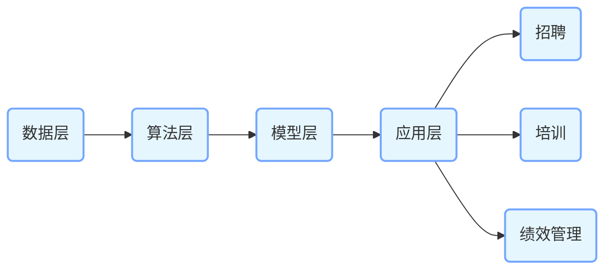

# AI Agent在企业人力资源管理中的全面应用

> 关键词：AI Agent、企业人力资源管理、智能招聘、员工培训、绩效管理

> 摘要：本文围绕AI Agent在企业人力资源管理中的全面应用展开探讨。首先介绍了相关背景，包括目的、预期读者等内容。接着阐述了AI Agent及企业人力资源管理的核心概念与联系，通过文本示意图和Mermaid流程图进行清晰展示。详细讲解了AI Agent应用涉及的核心算法原理，并给出Python源代码示例。深入分析了相关数学模型和公式，结合具体例子说明。通过项目实战，从开发环境搭建到源代码实现与解读，展示了AI Agent在人力资源管理中的具体应用。探讨了其实际应用场景，推荐了相关工具和资源。最后总结未来发展趋势与挑战，给出常见问题解答和扩展阅读参考资料，旨在为企业有效利用AI Agent提升人力资源管理效率和质量提供全面的技术指导和实践参考。

## 1. 背景介绍 
### 1.1 目的和范围
在当今数字化时代，企业面临着日益激烈的市场竞争，人力资源管理作为企业管理的重要组成部分，其效率和质量直接影响着企业的竞争力。AI Agent（人工智能代理）作为一种新兴的技术，具有自主学习、决策和执行任务的能力，能够为企业人力资源管理带来新的思路和方法。本文的目的在于全面探讨AI Agent在企业人力资源管理各个环节的应用，包括招聘、培训、绩效管理等，旨在为企业提供一套完整的解决方案，帮助企业提高人力资源管理的效率和质量，降低成本，增强企业的核心竞争力。

本文的范围涵盖了AI Agent在企业人力资源管理中的理论基础、算法原理、实际应用案例以及未来发展趋势等方面。通过对相关文献的研究和实际案例的分析，深入探讨AI Agent在企业人力资源管理中的应用潜力和挑战。

### 1.2 预期读者
本文预期读者包括企业人力资源管理人员、企业管理人员、人工智能技术开发者、研究人员以及对AI Agent在企业人力资源管理中应用感兴趣的相关人士。对于企业人力资源管理人员和企业管理人员来说，本文可以为他们提供新的管理思路和方法，帮助他们更好地利用AI Agent提升企业人力资源管理水平；对于人工智能技术开发者和研究人员来说，本文可以为他们提供相关的技术参考和研究方向，促进AI Agent技术在企业人力资源管理领域的进一步发展。

### 1.3 文档结构概述
本文共分为十个部分。第一部分为背景介绍，包括目的和范围、预期读者、文档结构概述和术语表；第二部分阐述核心概念与联系，通过文本示意图和Mermaid流程图展示AI Agent与企业人力资源管理的关系；第三部分详细讲解核心算法原理，并给出Python源代码示例；第四部分分析数学模型和公式，结合具体例子进行说明；第五部分通过项目实战，介绍开发环境搭建、源代码实现与解读；第六部分探讨实际应用场景；第七部分推荐相关工具和资源，包括学习资源、开发工具框架和相关论文著作；第八部分总结未来发展趋势与挑战；第九部分为附录，给出常见问题与解答；第十部分提供扩展阅读和参考资料。

### 1.4 术语表
#### 1.4.1 核心术语定义
- **AI Agent（人工智能代理）**：是一种能够感知环境、自主学习、做出决策并执行任务的人工智能实体。它可以根据预设的目标和规则，在复杂的环境中独立或协作地完成各种任务。
- **企业人力资源管理**：是指企业运用现代管理方法，对人力资源的获取（选人）、开发（育人）、保持（留人）和利用（用人）等方面所进行的计划、组织、指挥、控制和协调等一系列活动，最终达到实现企业发展目标的一种管理行为。

#### 1.4.2 相关概念解释
- **智能招聘**：是指利用人工智能技术，如自然语言处理、机器学习等，对招聘流程进行自动化和智能化处理，包括简历筛选、面试安排、候选人评估等环节。
- **员工培训**：是指企业为了提高员工的知识、技能和工作绩效，对员工进行有计划、有组织的培养和训练活动。AI Agent可以通过分析员工的学习需求和特点，提供个性化的培训方案。
- **绩效管理**：是指企业为了实现其战略目标，通过建立绩效指标体系，对员工的工作表现和工作成果进行评估和反馈的过程。AI Agent可以实时监控员工的工作绩效，提供及时的反馈和建议。

#### 1.4.3 缩略词列表
- **NLP（Natural Language Processing）**：自然语言处理
- **ML（Machine Learning）**：机器学习
- **HRM（Human Resource Management）**：人力资源管理

## 2. 核心概念与联系 
### 核心概念原理
AI Agent的核心原理基于人工智能技术，包括机器学习、自然语言处理、知识表示与推理等。机器学习使得AI Agent能够从大量的数据中学习模式和规律，从而不断优化自己的决策和行为；自然语言处理使得AI Agent能够理解和生成人类语言，与人类进行有效的交互；知识表示与推理使得AI Agent能够将领域知识进行形式化表示，并根据这些知识进行推理和决策。

在企业人力资源管理中，AI Agent可以作为一个智能助手，辅助人力资源管理人员完成各种任务。例如，在招聘过程中，AI Agent可以通过自然语言处理技术对简历进行筛选，提取关键信息，评估候选人的能力和素质；在员工培训中，AI Agent可以根据员工的学习进度和表现，提供个性化的学习建议和辅导；在绩效管理中，AI Agent可以实时监测员工的工作数据，分析工作绩效，提供反馈和改进建议。

### 架构的文本示意图
AI Agent在企业人力资源管理中的应用架构可以分为以下几个层次：
1. **数据层**：包括企业的人力资源数据，如员工信息、招聘数据、培训记录、绩效数据等。这些数据是AI Agent进行学习和决策的基础。
2. **算法层**：包括机器学习算法、自然语言处理算法、知识表示与推理算法等。这些算法用于对数据进行处理和分析，提取有用的信息和知识。
3. **模型层**：基于算法层的算法，构建各种AI Agent模型，如简历筛选模型、培训推荐模型、绩效评估模型等。
4. **应用层**：将AI Agent模型应用于企业人力资源管理的各个环节，如招聘、培训、绩效管理等，为人力资源管理人员提供智能决策支持。

### Mermaid流程图


## 3. 核心算法原理 & 具体操作步骤 
### 核心算法原理
在AI Agent在企业人力资源管理中的应用中，涉及到多种核心算法，下面以简历筛选为例，介绍机器学习中的朴素贝叶斯算法的原理。

朴素贝叶斯算法是一种基于贝叶斯定理和特征条件独立假设的分类算法。其基本思想是根据已知的训练数据，计算每个类别下各个特征的条件概率，然后在进行分类时，根据贝叶斯定理计算样本属于各个类别的概率，选择概率最大的类别作为样本的分类结果。

贝叶斯定理的公式为：
$P(C|X)=\frac{P(X|C)P(C)}{P(X)}$

其中，$P(C|X)$ 表示在特征 $X$ 出现的条件下，类别 $C$ 发生的概率；$P(X|C)$ 表示在类别 $C$ 发生的条件下，特征 $X$ 出现的概率；$P(C)$ 表示类别 $C$ 发生的先验概率；$P(X)$ 表示特征 $X$ 出现的概率。

在朴素贝叶斯算法中，假设各个特征之间是相互独立的，即：
$P(X|C)=\prod_{i=1}^{n}P(x_i|C)$

其中，$x_i$ 表示第 $i$ 个特征。

### 具体操作步骤
1. **数据准备**：收集大量的简历数据，并对其进行标注，分为合格和不合格两类。
2. **特征提取**：从简历中提取关键信息，如教育背景、工作经验、技能等，作为特征。
3. **训练模型**：使用朴素贝叶斯算法对训练数据进行训练，计算各个类别下各个特征的条件概率。
4. **模型评估**：使用测试数据对训练好的模型进行评估，计算模型的准确率、召回率等指标。
5. **应用模型**：将训练好的模型应用于实际的简历筛选中，对新的简历进行分类。

### Python源代码示例
```python
import numpy as np
from sklearn.feature_extraction.text import CountVectorizer
from sklearn.naive_bayes import MultinomialNB
from sklearn.model_selection import train_test_split
from sklearn.metrics import accuracy_score

# 示例数据
resumes = [
    "本科，5年工作经验，熟悉Python编程",
    "大专，2年工作经验，了解Java开发",
    "硕士，3年工作经验，精通数据分析",
    "高中，1年工作经验，会简单办公软件"
]
labels = [1, 0, 1, 0]  # 1表示合格，0表示不合格

# 特征提取
vectorizer = CountVectorizer()
X = vectorizer.fit_transform(resumes)

# 划分训练集和测试集
X_train, X_test, y_train, y_test = train_test_split(X, labels, test_size=0.2, random_state=42)

# 训练模型
clf = MultinomialNB()
clf.fit(X_train, y_train)

# 预测
y_pred = clf.predict(X_test)

# 评估模型
accuracy = accuracy_score(y_test, y_pred)
print("模型准确率：", accuracy)
```

## 4. 数学模型和公式 & 详细讲解 & 举例说明 
### 数学模型和公式
在AI Agent在企业人力资源管理中的应用中，涉及到多种数学模型和公式，下面以绩效评估为例，介绍线性回归模型的原理和公式。

线性回归模型是一种用于预测连续变量的统计模型，其基本形式为：
$y = \beta_0 + \beta_1x_1 + \beta_2x_2 + \cdots + \beta_nx_n + \epsilon$

其中，$y$ 表示因变量，即绩效得分；$x_1, x_2, \cdots, x_n$ 表示自变量，如工作时间、工作量、工作质量等；$\beta_0, \beta_1, \beta_2, \cdots, \beta_n$ 表示回归系数；$\epsilon$ 表示误差项。

线性回归的目标是找到一组回归系数 $\beta_0, \beta_1, \beta_2, \cdots, \beta_n$，使得预测值与实际值之间的误差最小。常用的误差度量方法是均方误差（MSE），其公式为：
$MSE = \frac{1}{m}\sum_{i=1}^{m}(y_i - \hat{y}_i)^2$

其中，$m$ 表示样本数量；$y_i$ 表示第 $i$ 个样本的实际值；$\hat{y}_i$ 表示第 $i$ 个样本的预测值。

为了最小化均方误差，可以使用最小二乘法求解回归系数。最小二乘法的公式为：
$\hat{\beta} = (X^TX)^{-1}X^Ty$

其中，$X$ 表示自变量矩阵；$y$ 表示因变量向量；$\hat{\beta}$ 表示回归系数向量。

### 详细讲解
线性回归模型的基本思想是通过对历史数据的学习，找到自变量与因变量之间的线性关系，然后利用这个关系对未来的绩效得分进行预测。在实际应用中，需要收集大量的员工工作数据，包括工作时间、工作量、工作质量等自变量，以及绩效得分因变量，然后使用最小二乘法求解回归系数。

### 举例说明
假设某企业有5名员工，他们的工作时间、工作量、工作质量和绩效得分如下表所示：

| 员工编号 | 工作时间（小时） | 工作量（件） | 工作质量（分） | 绩效得分（分） |
| ---- | ---- | ---- | ---- | ---- |
| 1 | 40 | 50 | 80 | 85 |
| 2 | 45 | 60 | 85 | 90 |
| 3 | 35 | 40 | 75 | 70 |
| 4 | 50 | 70 | 90 | 95 |
| 5 | 30 | 30 | 70 | 65 |

我们可以使用线性回归模型来预测员工的绩效得分。首先，将工作时间、工作量、工作质量作为自变量，绩效得分作为因变量，构建自变量矩阵 $X$ 和因变量向量 $y$：

$X = \begin{bmatrix} 1 & 40 & 50 & 80 \\ 1 & 45 & 60 & 85 \\ 1 & 35 & 40 & 75 \\ 1 & 50 & 70 & 90 \\ 1 & 30 & 30 & 70 \end{bmatrix}$

$y = \begin{bmatrix} 85 \\ 90 \\ 70 \\ 95 \\ 65 \end{bmatrix}$

然后，使用最小二乘法求解回归系数 $\hat{\beta}$：

$\hat{\beta} = (X^TX)^{-1}X^Ty$

最后，根据求解得到的回归系数，对新的员工工作数据进行绩效得分预测。

## 5. 项目实战：代码实际案例和详细解释说明 
### 5.1  开发环境搭建
在进行AI Agent在企业人力资源管理中的项目实战之前，需要搭建相应的开发环境。以下是具体的步骤：
1. **安装Python**：Python是一种广泛使用的编程语言，许多人工智能库都是基于Python开发的。可以从Python官方网站（https://www.python.org/downloads/）下载并安装Python 3.x版本。
2. **安装开发工具**：推荐使用PyCharm作为开发工具，它是一款功能强大的Python集成开发环境（IDE）。可以从JetBrains官方网站（https://www.jetbrains.com/pycharm/download/）下载并安装PyCharm。
3. **安装必要的库**：在项目中需要使用到一些Python库，如scikit-learn、pandas、numpy等。可以使用pip命令进行安装，例如：
```sh
pip install scikit-learn pandas numpy
```

### 5.2  源代码详细实现和代码解读
下面以员工培训推荐为例，给出一个完整的项目实战代码示例：

```python
import pandas as pd
from sklearn.feature_extraction.text import TfidfVectorizer
from sklearn.metrics.pairwise import cosine_similarity

# 示例数据
employees = pd.DataFrame({
    "员工编号": [1, 2, 3, 4, 5],
    "技能描述": ["Python编程、数据分析", "Java开发、数据库管理", "机器学习、深度学习", "前端开发、UI设计", "项目管理、团队协作"]
})

trainings = pd.DataFrame({
    "培训编号": [1, 2, 3, 4, 5],
    "培训内容描述": ["Python数据分析实战", "Java高级编程", "深度学习进阶", "前端优化技巧", "高效项目管理"]
})

# 特征提取
vectorizer = TfidfVectorizer()
employee_features = vectorizer.fit_transform(employees["技能描述"])
training_features = vectorizer.transform(trainings["培训内容描述"])

# 计算相似度
similarity_matrix = cosine_similarity(employee_features, training_features)

# 为每个员工推荐最相关的培训
recommendations = {}
for i in range(len(employees)):
    employee_id = employees.loc[i, "员工编号"]
    most_similar_index = similarity_matrix[i].argmax()
    training_id = trainings.loc[most_similar_index, "培训编号"]
    recommendations[employee_id] = training_id

# 输出推荐结果
for employee_id, training_id in recommendations.items():
    print(f"员工编号 {employee_id} 推荐的培训编号为 {training_id}")
```

### 5.3  代码解读与分析
1. **数据准备**：使用pandas库创建员工信息和培训信息的DataFrame，其中包含员工的技能描述和培训的内容描述。
2. **特征提取**：使用TfidfVectorizer将员工的技能描述和培训的内容描述转换为向量表示，以便进行相似度计算。
3. **相似度计算**：使用cosine_similarity函数计算员工技能向量和培训内容向量之间的余弦相似度，得到相似度矩阵。
4. **推荐生成**：对于每个员工，找到与其技能最相似的培训，将其培训编号作为推荐结果。
5. **结果输出**：输出每个员工的推荐培训编号。

通过这个项目实战，我们可以看到如何使用AI Agent技术为员工提供个性化的培训推荐，提高员工培训的针对性和效果。

## 6. 实际应用场景 
### 智能招聘
在智能招聘方面，AI Agent可以帮助企业提高招聘效率和质量。具体应用包括：
1. **简历筛选**：AI Agent可以通过自然语言处理技术对大量的简历进行快速筛选，提取关键信息，如教育背景、工作经验、技能等，根据预设的条件对简历进行分类，筛选出符合要求的候选人。
2. **面试安排**：AI Agent可以与候选人进行沟通，自动安排面试时间和地点，发送面试通知，减少人力资源管理人员的工作量。
3. **候选人评估**：AI Agent可以通过分析候选人的面试表现、在线测试结果等数据，对候选人的能力和素质进行评估，为企业提供客观的参考依据。

### 员工培训
在员工培训方面，AI Agent可以为员工提供个性化的培训方案，提高培训效果。具体应用包括：
1. **培训需求分析**：AI Agent可以通过分析员工的工作数据、绩效数据等，了解员工的技能短板和培训需求，为员工制定个性化的培训计划。
2. **培训内容推荐**：AI Agent可以根据员工的培训需求和学习偏好，推荐适合的培训课程和学习资源，提高员工的学习积极性和效果。
3. **学习过程监控**：AI Agent可以实时监控员工的学习进度和学习效果，及时给予反馈和建议，帮助员工调整学习策略。

### 绩效管理
在绩效管理方面，AI Agent可以帮助企业提高绩效管理的效率和准确性。具体应用包括：
1. **绩效指标设定**：AI Agent可以通过分析企业的战略目标和业务需求，结合员工的岗位职责，为员工设定合理的绩效指标。
2. **绩效数据收集**：AI Agent可以实时收集员工的工作数据，如工作时间、工作量、工作质量等，为绩效评估提供客观的数据支持。
3. **绩效评估与反馈**：AI Agent可以根据预设的绩效评估模型，对员工的绩效进行评估，生成绩效报告，并及时将评估结果反馈给员工，帮助员工改进工作。

### 员工关系管理
在员工关系管理方面，AI Agent可以帮助企业建立良好的员工关系，提高员工满意度和忠诚度。具体应用包括：
1. **员工咨询与服务**：AI Agent可以作为员工的智能助手，回答员工的常见问题，提供相关的政策咨询和服务，提高员工的满意度。
2. **员工情绪监测**：AI Agent可以通过分析员工的沟通记录、社交媒体信息等，监测员工的情绪状态，及时发现员工的问题和需求，采取相应的措施进行干预。
3. **企业文化传播**：AI Agent可以通过多种渠道向员工传播企业文化和价值观，增强员工的归属感和认同感。

## 7. 工具和资源推荐
### 7.1 学习资源推荐
#### 7.1.1 书籍推荐
- 《Python机器学习》：本书详细介绍了Python在机器学习领域的应用，包括各种机器学习算法的原理和实现，适合初学者和有一定基础的开发者阅读。
- 《人工智能：一种现代的方法》：这是一本经典的人工智能教材，全面介绍了人工智能的基本概念、算法和应用，是学习人工智能的必备书籍。
- 《人力资源管理概论》：本书系统地介绍了人力资源管理的基本理论、方法和实践，对于了解企业人力资源管理的基本流程和方法有很大的帮助。

#### 7.1.2 在线课程
- Coursera上的“机器学习”课程：由斯坦福大学教授Andrew Ng主讲，是一门非常经典的机器学习课程，适合初学者学习。
- edX上的“人工智能基础”课程：由麻省理工学院（MIT）教授Patrick Winston主讲，介绍了人工智能的基本概念、算法和应用，是学习人工智能的入门课程。
- 中国大学MOOC上的“人力资源管理”课程：由国内知名高校的教授主讲，系统地介绍了人力资源管理的基本理论和方法，对于了解企业人力资源管理有很大的帮助。

#### 7.1.3 技术博客和网站
- Medium：是一个技术博客平台，上面有很多关于人工智能、机器学习和人力资源管理的文章，可以从中获取最新的技术动态和行业趋势。
- Towards Data Science：是一个专注于数据科学和人工智能的技术博客，上面有很多高质量的技术文章和案例分析，对于学习和研究人工智能技术有很大的帮助。
- 人力资源管理网：是一个专注于人力资源管理的专业网站，上面有很多关于人力资源管理的政策法规、案例分析和经验分享，可以帮助企业人力资源管理人员提高管理水平。

### 7.2 开发工具框架推荐
#### 7.2.1 IDE和编辑器
- PyCharm：是一款功能强大的Python集成开发环境（IDE），提供了代码编辑、调试、版本控制等一系列功能，适合Python开发者使用。
- Visual Studio Code：是一款轻量级的代码编辑器，支持多种编程语言，具有丰富的插件扩展功能，适合快速开发和调试。

#### 7.2.2 调试和性能分析工具
- Py-Spy：是一个Python性能分析工具，可以实时监测Python程序的性能，找出性能瓶颈，帮助开发者优化代码。
- PDB：是Python自带的调试工具，可以在代码中设置断点，单步执行代码，查看变量的值，帮助开发者调试代码。

#### 7.2.3 相关框架和库
- scikit-learn：是一个常用的机器学习库，提供了各种机器学习算法的实现，如分类、回归、聚类等，方便开发者进行机器学习模型的开发和训练。
- TensorFlow：是一个开源的深度学习框架，由Google开发，提供了丰富的深度学习模型和工具，适合进行深度学习模型的开发和训练。
- Pandas：是一个数据处理和分析库，提供了高效的数据结构和数据处理工具，方便开发者进行数据清洗、转换和分析。

### 7.3 相关论文著作推荐
#### 7.3.1 经典论文
- “A Machine Learning Approach to Resume Screening”：该论文介绍了一种基于机器学习的简历筛选方法，通过对简历文本进行特征提取和分类，实现了简历的自动筛选。
- “Personalized Learning Recommendations for Employees Based on Machine Learning”：该论文提出了一种基于机器学习的员工个性化学习推荐方法，通过分析员工的学习行为和偏好，为员工推荐适合的学习资源。
- “Performance Management in the Digital Age: The Role of Artificial Intelligence”：该论文探讨了人工智能在绩效管理中的应用，分析了人工智能对绩效管理的影响和挑战。

#### 7.3.2 最新研究成果
- 近年来，随着人工智能技术的不断发展，关于AI Agent在企业人力资源管理中的应用研究也越来越多。可以通过查阅学术数据库，如IEEE Xplore、ACM Digital Library等，获取最新的研究成果。

#### 7.3.3 应用案例分析
- 许多企业已经开始尝试将AI Agent技术应用于企业人力资源管理中，并取得了一定的成效。可以通过查阅相关的企业案例分析报告，了解AI Agent在企业人力资源管理中的实际应用情况和经验教训。

## 8. 总结：未来发展趋势与挑战
### 未来发展趋势
1. **智能化程度不断提高**：随着人工智能技术的不断发展，AI Agent的智能化程度将不断提高，能够更加准确地理解和处理自然语言，进行更加复杂的决策和推理，为企业人力资源管理提供更加智能的支持。
2. **与其他技术的融合**：AI Agent将与其他技术，如大数据、云计算、物联网等进行深度融合，实现数据的共享和协同，为企业人力资源管理提供更加全面和深入的服务。
3. **个性化服务更加普及**：AI Agent将能够根据员工的个性化需求和特点，提供更加个性化的服务，如个性化的招聘、培训、绩效管理等，提高员工的满意度和忠诚度。
4. **应用范围不断扩大**：AI Agent在企业人力资源管理中的应用范围将不断扩大，不仅涵盖招聘、培训、绩效管理等传统领域，还将涉及员工关系管理、企业文化建设等更多领域。

### 挑战
1. **数据安全和隐私问题**：AI Agent在企业人力资源管理中的应用需要大量的员工数据，如个人信息、工作数据等，这些数据的安全和隐私保护是一个重要的问题。企业需要采取有效的措施，确保数据的安全和隐私。
2. **技术复杂性**：AI Agent技术涉及到多个领域的知识和技术，如机器学习、自然语言处理、知识表示与推理等，技术复杂性较高。企业需要培养和引进相关的技术人才，提高企业的技术水平。
3. **员工接受度**：AI Agent的应用可能会对员工的工作方式和职业发展产生一定的影响，部分员工可能会对其产生抵触情绪。企业需要加强员工培训和沟通，提高员工的接受度和参与度。
4. **伦理和法律问题**：AI Agent的应用可能会涉及到一些伦理和法律问题，如算法歧视、责任认定等。企业需要建立相应的伦理和法律框架，确保AI Agent的应用符合伦理和法律要求。

## 9. 附录：常见问题与解答
### 1. AI Agent在企业人力资源管理中的应用是否会取代人力资源管理人员？
不会。AI Agent在企业人力资源管理中的应用主要是辅助人力资源管理人员完成各种任务，提高管理效率和质量。人力资源管理人员仍然需要发挥其专业知识和经验，进行决策和沟通等工作。AI Agent与人力资源管理人员是一种协作关系，而不是取代关系。

### 2. AI Agent在企业人力资源管理中的应用需要哪些数据？
AI Agent在企业人力资源管理中的应用需要多种数据，包括员工的个人信息、工作经验、教育背景、技能水平、工作绩效等。这些数据可以来自企业的人力资源管理系统、员工的简历、在线测试结果等。

### 3. 如何确保AI Agent在企业人力资源管理中的应用安全可靠？
为了确保AI Agent在企业人力资源管理中的应用安全可靠，需要采取以下措施：
- 加强数据安全保护，对员工数据进行加密处理，防止数据泄露。
- 对AI Agent进行严格的测试和验证，确保其算法和模型的准确性和可靠性。
- 建立健全的管理制度和流程，规范AI Agent的使用和管理。
- 加强员工培训，提高员工的安全意识和操作技能。

### 4. AI Agent在企业人力资源管理中的应用成本高吗？
AI Agent在企业人力资源管理中的应用成本因企业的规模、应用场景和技术选型等因素而异。一般来说，前期需要投入一定的成本进行技术研发和系统建设，但从长期来看，AI Agent的应用可以提高企业的管理效率和质量，降低人力成本，带来显著的经济效益。

## 10. 扩展阅读 & 参考资料
### 扩展阅读
- 《AI未来进行式》：作者李开复和王咏刚，本书探讨了人工智能对未来社会和经济的影响，包括对企业管理的影响，对于了解AI Agent在企业中的应用有一定的启发。
- 《数字化转型：企业如何实现可持续增长》：本书介绍了企业数字化转型的理论和实践，包括人力资源管理的数字化转型，对于企业应用AI Agent进行人力资源管理有一定的参考价值。

### 参考资料
- 相关学术论文和研究报告，如IEEE Xplore、ACM Digital Library等学术数据库中的论文。
- 企业案例分析报告，如各大咨询公司发布的关于企业人力资源管理数字化转型的案例分析。
- 技术文档和官方网站，如scikit-learn、TensorFlow等开源框架的官方文档和网站。