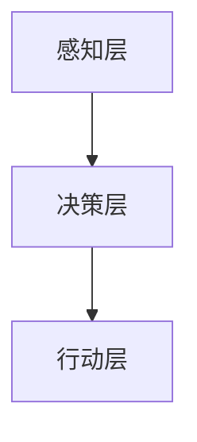

# AI Agent在企业员工健康与福利管理中的应用

> 关键词：AI Agent、企业员工健康管理、员工福利管理、人工智能应用、智能决策

> 摘要：本文聚焦于AI Agent在企业员工健康与福利管理中的应用。随着人工智能技术的飞速发展，AI Agent在各个领域展现出强大的应用潜力。在企业员工健康与福利管理方面，AI Agent能够凭借其智能分析、决策支持等功能，提升管理效率、优化资源分配、改善员工体验。文章将详细介绍AI Agent的核心概念与架构，阐述其核心算法原理及操作步骤，通过数学模型和公式深入剖析其工作机制，结合实际项目案例进行代码实现与解读，探讨其实际应用场景，推荐相关学习资源、开发工具和论文著作，最后总结未来发展趋势与挑战，为企业在员工健康与福利管理中更好地应用AI Agent提供全面的参考。

## 1. 背景介绍 
### 1.1 目的和范围
企业员工的健康与福利管理是企业管理中的重要环节，直接关系到员工的工作效率、满意度和企业的长期发展。传统的员工健康与福利管理方式往往面临着数据处理效率低、决策缺乏科学性、个性化服务不足等问题。本文的目的在于探讨AI Agent在企业员工健康与福利管理中的应用，通过引入AI Agent技术，解决传统管理方式存在的问题，提高管理的智能化水平和服务质量。

本文的范围涵盖了AI Agent的基本概念、在员工健康与福利管理中的应用原理、具体实现方法、实际应用场景以及未来发展趋势等方面。旨在为企业管理者、技术开发者和相关研究人员提供全面的技术参考和实践指导。

### 1.2 预期读者
本文的预期读者包括企业管理者、人力资源管理人员、IT技术人员、人工智能研究人员以及对企业员工健康与福利管理和人工智能应用感兴趣的人士。企业管理者可以从本文中了解AI Agent在员工管理中的应用价值和发展趋势，为企业决策提供参考；人力资源管理人员可以学习如何利用AI Agent优化员工健康与福利管理流程；IT技术人员可以获取AI Agent技术实现的详细信息，进行相关的开发和应用；人工智能研究人员可以深入探讨AI Agent在该领域的应用理论和技术创新；对该领域感兴趣的人士可以通过本文了解相关的前沿知识和实践案例。

### 1.3 文档结构概述
本文将按照以下结构进行阐述：首先介绍AI Agent的背景知识，包括其目的、预期读者和文档结构概述；接着详细讲解AI Agent的核心概念与联系，包括其原理和架构，并通过文本示意图和Mermaid流程图进行直观展示；然后阐述AI Agent的核心算法原理和具体操作步骤，结合Python源代码进行详细说明；再通过数学模型和公式深入剖析AI Agent的工作机制，并举例说明；之后通过项目实战，介绍开发环境搭建、源代码实现和代码解读；接着探讨AI Agent在企业员工健康与福利管理中的实际应用场景；推荐相关的学习资源、开发工具和论文著作；最后总结AI Agent在该领域的未来发展趋势与挑战，并提供常见问题与解答以及扩展阅读和参考资料。

### 1.4 术语表
#### 1.4.1 核心术语定义
- **AI Agent（人工智能代理）**：是一种能够感知环境、根据感知信息进行决策并采取行动的智能实体。它可以自主地完成特定的任务，与环境进行交互，并不断学习和优化自身的行为。
- **企业员工健康管理**：是指企业通过各种手段和措施，对员工的健康状况进行监测、评估、干预和促进，以提高员工的健康水平和工作效率。
- **员工福利管理**：是指企业根据国家法律法规和自身发展战略，为员工提供各种福利项目，并对这些福利项目进行规划、组织、实施和监控的过程。

#### 1.4.2 相关概念解释
- **机器学习**：是一门多领域交叉学科，涉及概率论、统计学、逼近论、凸分析、算法复杂度理论等多门学科。它专门研究计算机怎样模拟或实现人类的学习行为，以获取新的知识或技能，重新组织已有的知识结构使之不断改善自身的性能。
- **自然语言处理**：是计算机科学、人工智能和语言学的交叉领域，旨在让计算机能够理解、处理和生成人类语言。它包括文本分类、情感分析、机器翻译、问答系统等多个研究方向。
- **大数据**：指无法在一定时间范围内用常规软件工具进行捕捉、管理和处理的数据集合，是需要新处理模式才能具有更强的决策力、洞察发现力和流程优化能力的海量、高增长率和多样化的信息资产。

#### 1.4.3 缩略词列表
- **AI**：Artificial Intelligence，人工智能
- **ML**：Machine Learning，机器学习
- **NLP**：Natural Language Processing，自然语言处理
- **BI**：Business Intelligence，商业智能

## 2. 核心概念与联系 

### 2.1 AI Agent的原理
AI Agent的核心原理是基于感知、决策和行动的循环过程。它通过传感器感知环境信息，将这些信息输入到决策模块中。决策模块根据预设的规则、模型或算法对感知信息进行分析和处理，生成相应的决策。最后，行动模块根据决策结果采取相应的行动，对环境产生影响。这个过程不断循环，AI Agent通过与环境的交互不断学习和优化自身的行为。

### 2.2 AI Agent的架构
AI Agent的架构通常包括感知层、决策层和行动层。感知层负责收集环境信息，例如员工的健康数据、福利需求信息等。决策层对感知层收集到的信息进行分析和处理，运用机器学习、自然语言处理等技术生成决策。行动层根据决策结果执行相应的任务，例如提供健康建议、推荐福利方案等。

以下是AI Agent架构的文本示意图：

```plaintext
----------------------
|      感知层        |
| （收集员工信息）  |
----------------------
        |
        v
----------------------
|      决策层        |
| （分析处理信息）  |
----------------------
        |
        v
----------------------
|      行动层        |
| （执行相应任务）  |
----------------------
```

以下是AI Agent架构的Mermaid流程图：



### 2.3 AI Agent与员工健康与福利管理的联系
AI Agent在员工健康与福利管理中具有重要的作用。在员工健康管理方面，AI Agent可以通过收集员工的健康数据，如体检报告、运动数据、饮食信息等，运用机器学习算法对这些数据进行分析，为员工提供个性化的健康建议和干预措施。在员工福利管理方面，AI Agent可以根据员工的需求、岗位特点、工作绩效等信息，为员工推荐合适的福利方案，提高福利的针对性和有效性。同时，AI Agent还可以与员工进行自然语言交互，解答员工关于健康与福利的疑问，提供便捷的服务。

## 3. 核心算法原理 & 具体操作步骤 

### 3.1 核心算法原理
AI Agent在员工健康与福利管理中常用的算法包括机器学习算法和自然语言处理算法。

#### 3.1.1 机器学习算法 - 决策树算法
决策树算法是一种常用的机器学习算法，它通过构建决策树模型对数据进行分类和预测。决策树由节点和边组成，节点分为内部节点和叶节点。内部节点表示一个特征或属性，边表示该特征或属性的取值，叶节点表示分类结果或预测值。

以下是使用Python实现决策树算法的示例代码：

```python
from sklearn.datasets import load_iris
from sklearn.model_selection import train_test_split
from sklearn.tree import DecisionTreeClassifier
from sklearn.metrics import accuracy_score

# 加载数据集
iris = load_iris()
X = iris.data
y = iris.target

# 划分训练集和测试集
X_train, X_test, y_train, y_test = train_test_split(X, y, test_size=0.3, random_state=42)

# 创建决策树分类器
clf = DecisionTreeClassifier()

# 训练模型
clf.fit(X_train, y_train)

# 预测
y_pred = clf.predict(X_test)

# 计算准确率
accuracy = accuracy_score(y_test, y_pred)
print("Accuracy:", accuracy)
```

#### 3.1.2 自然语言处理算法 - 词袋模型
词袋模型是一种简单的文本表示方法，它将文本看作是一个无序的词集合，忽略词的顺序和语法结构。每个文本被表示为一个向量，向量的每个维度对应一个词，向量的值表示该词在文本中出现的频率。

以下是使用Python实现词袋模型的示例代码：

```python
from sklearn.feature_extraction.text import CountVectorizer

# 定义文本数据
corpus = [
    'This is the first document.',
    'This document is the second document.',
    'And this is the third one.',
    'Is this the first document?'
]

# 创建词袋模型
vectorizer = CountVectorizer()

# 转换文本数据
X = vectorizer.fit_transform(corpus)

# 获取特征名
feature_names = vectorizer.get_feature_names_out()

# 打印特征矩阵
print(X.toarray())
print(feature_names)
```

### 3.2 具体操作步骤
#### 3.2.1 数据收集
首先，需要收集员工的相关数据，包括健康数据、福利需求数据、个人信息等。健康数据可以通过体检报告、可穿戴设备等方式获取；福利需求数据可以通过问卷调查、员工反馈等方式收集；个人信息可以从企业的人力资源系统中获取。

#### 3.2.2 数据预处理
收集到的数据可能存在噪声、缺失值等问题，需要进行预处理。预处理步骤包括数据清洗、数据转换、数据归一化等。例如，对于缺失值可以采用均值填充、中位数填充等方法进行处理；对于文本数据可以进行分词、去除停用词等操作。

#### 3.2.3 模型训练
根据数据的特点和任务的需求，选择合适的算法进行模型训练。例如，对于员工健康数据的分类问题可以使用决策树算法；对于员工福利需求的文本分析问题可以使用词袋模型和机器学习算法。在训练模型时，需要将数据划分为训练集和测试集，使用训练集对模型进行训练，使用测试集对模型进行评估。

#### 3.2.4 模型部署
将训练好的模型部署到实际应用环境中，与AI Agent的感知层、决策层和行动层进行集成。当感知层收集到员工的相关信息时，将信息输入到决策层的模型中，模型根据输入信息生成决策，行动层根据决策结果执行相应的任务。

#### 3.2.5 模型优化
随着时间的推移和数据的积累，模型的性能可能会下降。需要定期对模型进行评估和优化，例如更新模型的参数、添加新的特征、使用更复杂的算法等，以提高模型的准确性和性能。

## 4. 数学模型和公式 & 详细讲解 & 举例说明 

### 4.1 决策树算法的数学模型和公式
#### 4.1.1 信息熵
信息熵是衡量数据不确定性的指标，它表示数据中包含的平均信息量。对于一个分类问题，设数据集 $D$ 包含 $n$ 个样本，共分为 $k$ 个类别，第 $i$ 个类别的样本数为 $n_i$，则数据集 $D$ 的信息熵 $H(D)$ 定义为：

$$H(D)=-\sum_{i=1}^{k}\frac{n_i}{n}\log_2\frac{n_i}{n}$$

信息熵越大，数据的不确定性越大。

#### 4.1.2 信息增益
信息增益是衡量特征对分类的重要性的指标，它表示使用某个特征进行划分后，数据集的信息熵减少的程度。设特征 $A$ 有 $v$ 个取值，将数据集 $D$ 划分为 $v$ 个子集 $D_1,D_2,\cdots,D_v$，则特征 $A$ 对数据集 $D$ 的信息增益 $Gain(D,A)$ 定义为：

$$Gain(D,A)=H(D)-\sum_{i=1}^{v}\frac{|D_i|}{|D|}H(D_i)$$

其中，$|D|$ 表示数据集 $D$ 的样本数，$|D_i|$ 表示子集 $D_i$ 的样本数。信息增益越大，特征 $A$ 对分类的重要性越高。

#### 4.1.3 举例说明
假设有一个数据集 $D$ 包含 10 个样本，分为 2 个类别，类别 1 有 6 个样本，类别 2 有 4 个样本。则数据集 $D$ 的信息熵为：

$$H(D)=-\frac{6}{10}\log_2\frac{6}{10}-\frac{4}{10}\log_2\frac{4}{10}\approx0.971$$

假设有一个特征 $A$，它有 2 个取值，将数据集 $D$ 划分为 2 个子集 $D_1$ 和 $D_2$，$D_1$ 包含 4 个样本，其中类别 1 有 3 个样本，类别 2 有 1 个样本；$D_2$ 包含 6 个样本，其中类别 1 有 3 个样本，类别 2 有 3 个样本。则子集 $D_1$ 的信息熵为：

$$H(D_1)=-\frac{3}{4}\log_2\frac{3}{4}-\frac{1}{4}\log_2\frac{1}{4}\approx0.811$$

子集 $D_2$ 的信息熵为：

$$H(D_2)=-\frac{3}{6}\log_2\frac{3}{6}-\frac{3}{6}\log_2\frac{3}{6}=1$$

特征 $A$ 对数据集 $D$ 的信息增益为：

$$Gain(D,A)=H(D)-\frac{4}{10}H(D_1)-\frac{6}{10}H(D_2)\approx0.971-\frac{4}{10}\times0.811-\frac{6}{10}\times1=0.0466$$

### 4.2 词袋模型的数学模型和公式
#### 4.2.1 文本表示
设文本集合 $T=\{t_1,t_2,\cdots,t_n\}$，词汇表 $V=\{w_1,w_2,\cdots,w_m\}$，其中 $n$ 表示文本的数量，$m$ 表示词汇表的大小。对于文本 $t_i$，它的词袋模型表示为一个 $m$ 维向量 $\mathbf{x}_i=(x_{i1},x_{i2},\cdots,x_{im})$，其中 $x_{ij}$ 表示词 $w_j$ 在文本 $t_i$ 中出现的频率。

#### 4.2.2 举例说明
假设有以下文本集合：

$T=\{ \text{'This is a cat.'}, \text{'That is a dog.'} \}$

词汇表 $V=\{ \text{'This'}, \text{'is'}, \text{'a'}, \text{'cat'}, \text{'That'}, \text{'dog'} \}$

则第一个文本的词袋模型表示为：

$\mathbf{x}_1=(1,1,1,1,0,0)$

第二个文本的词袋模型表示为：

$\mathbf{x}_2=(0,1,1,0,1,1)$

## 5. 项目实战：代码实际案例和详细解释说明 

### 5.1  开发环境搭建
#### 5.1.1 安装Python
首先，需要安装Python开发环境。可以从Python官方网站（https://www.python.org/downloads/） 下载适合自己操作系统的Python安装包，按照安装向导进行安装。

#### 5.1.2 安装必要的库
在项目中，需要使用一些Python库，如`pandas`、`numpy`、`scikit-learn`、`nltk`等。可以使用`pip`命令进行安装：

```sh
pip install pandas numpy scikit-learn nltk
```

#### 5.1.3 配置开发环境
可以使用集成开发环境（IDE）如PyCharm、VS Code等进行开发。在IDE中创建一个新的Python项目，并配置好Python解释器。

### 5.2  源代码详细实现和代码解读
#### 5.2.1 员工健康数据分类
以下是一个使用决策树算法对员工健康数据进行分类的示例代码：

```python
import pandas as pd
from sklearn.model_selection import train_test_split
from sklearn.tree import DecisionTreeClassifier
from sklearn.metrics import accuracy_score

# 加载员工健康数据
data = pd.read_csv('employee_health_data.csv')

# 划分特征和标签
X = data.drop('health_status', axis=1)
y = data['health_status']

# 划分训练集和测试集
X_train, X_test, y_train, y_test = train_test_split(X, y, test_size=0.3, random_state=42)

# 创建决策树分类器
clf = DecisionTreeClassifier()

# 训练模型
clf.fit(X_train, y_train)

# 预测
y_pred = clf.predict(X_test)

# 计算准确率
accuracy = accuracy_score(y_test, y_pred)
print("Accuracy:", accuracy)
```

代码解读：
- 首先，使用`pandas`库读取员工健康数据文件`employee_health_data.csv`。
- 然后，将数据划分为特征矩阵`X`和标签向量`y`，其中`health_status`列是标签。
- 接着，使用`train_test_split`函数将数据划分为训练集和测试集。
- 再创建决策树分类器`clf`，并使用训练集对模型进行训练。
- 最后，使用测试集进行预测，并计算预测的准确率。

#### 5.2.2 员工福利需求文本分析
以下是一个使用词袋模型和朴素贝叶斯算法对员工福利需求文本进行分析的示例代码：

```python
import pandas as pd
from sklearn.feature_extraction.text import CountVectorizer
from sklearn.naive_bayes import MultinomialNB
from sklearn.model_selection import train_test_split
from sklearn.metrics import accuracy_score

# 加载员工福利需求文本数据
data = pd.read_csv('employee_welfare_text_data.csv')

# 划分特征和标签
X = data['text']
y = data['category']

# 创建词袋模型
vectorizer = CountVectorizer()
X = vectorizer.fit_transform(X)

# 划分训练集和测试集
X_train, X_test, y_train, y_test = train_test_split(X, y, test_size=0.3, random_state=42)

# 创建朴素贝叶斯分类器
clf = MultinomialNB()

# 训练模型
clf.fit(X_train, y_train)

# 预测
y_pred = clf.predict(X_test)

# 计算准确率
accuracy = accuracy_score(y_test, y_pred)
print("Accuracy:", accuracy)
```

代码解读：
- 首先，使用`pandas`库读取员工福利需求文本数据文件`employee_welfare_text_data.csv`。
- 然后，将数据划分为特征文本`X`和标签`y`，其中`text`列是特征文本，`category`列是标签。
- 接着，使用`CountVectorizer`创建词袋模型，并将文本数据转换为特征矩阵。
- 再使用`train_test_split`函数将数据划分为训练集和测试集。
- 然后创建朴素贝叶斯分类器`clf`，并使用训练集对模型进行训练。
- 最后，使用测试集进行预测，并计算预测的准确率。

### 5.3  代码解读与分析
#### 5.3.1 员工健康数据分类代码分析
在员工健康数据分类代码中，决策树算法通过学习训练数据的特征和标签之间的关系，构建决策树模型。在预测时，决策树根据输入的特征值，沿着决策树的节点进行判断，最终得到分类结果。代码中的准确率反映了模型在测试集上的分类性能，准确率越高，说明模型的分类效果越好。

#### 5.3.2 员工福利需求文本分析代码分析
在员工福利需求文本分析代码中，词袋模型将文本数据转换为特征矩阵，使得文本数据可以被机器学习算法处理。朴素贝叶斯算法根据特征矩阵和标签之间的概率关系进行分类。代码中的准确率同样反映了模型在测试集上的分类性能。

## 6. 实际应用场景 
### 6.1 员工健康监测与预警
AI Agent可以通过连接员工的可穿戴设备，实时收集员工的健康数据，如心率、血压、运动步数等。运用机器学习算法对这些数据进行分析，当发现员工的健康数据出现异常时，及时向员工和企业管理者发出预警。例如，如果员工的心率持续过高，AI Agent可以提醒员工注意休息，并建议员工进行进一步的体检。

### 6.2 个性化健康建议与干预
AI Agent可以根据员工的健康数据、个人信息和生活习惯，为员工提供个性化的健康建议和干预措施。例如，对于患有高血压的员工，AI Agent可以推荐适合的饮食方案和运动计划；对于工作压力较大的员工，AI Agent可以提供心理调节的建议和放松技巧。

### 6.3 福利方案推荐
AI Agent可以根据员工的需求、岗位特点、工作绩效等信息，为员工推荐合适的福利方案。例如，对于有子女教育需求的员工，AI Agent可以推荐教育补贴、子女保险等福利项目；对于经常出差的员工，AI Agent可以推荐交通补贴、出差保险等福利项目。

### 6.4 员工反馈处理
AI Agent可以与员工进行自然语言交互，收集员工对健康与福利管理的反馈和建议。通过自然语言处理技术对员工的反馈进行分析，了解员工的需求和满意度，为企业管理者提供决策依据。例如，AI Agent可以分析员工对某项福利政策的评价，发现其中存在的问题，并及时提出改进建议。

## 7. 工具和资源推荐
### 7.1 学习资源推荐
#### 7.1.1 书籍推荐
- 《机器学习》（周志华著）：这本书是机器学习领域的经典教材，全面介绍了机器学习的基本概念、算法和应用。
- 《Python机器学习》（Sebastian Raschka著）：本书详细介绍了使用Python进行机器学习的方法和技巧，适合初学者学习。
- 《自然语言处理入门》（何晗著）：这本书系统地介绍了自然语言处理的基本理论和技术，以及如何使用Python实现自然语言处理任务。

#### 7.1.2 在线课程
- Coursera上的“Machine Learning”（Andrew Ng教授主讲）：这是一门非常经典的机器学习课程，涵盖了机器学习的基本概念、算法和应用。
- edX上的“Introduction to Artificial Intelligence”：该课程介绍了人工智能的基本概念、技术和应用，适合对人工智能感兴趣的初学者。
- 中国大学MOOC上的“自然语言处理”：这门课程由国内知名高校的教授主讲，系统地介绍了自然语言处理的理论和实践。

#### 7.1.3 技术博客和网站
- Medium：这是一个技术博客平台，上面有很多关于人工智能、机器学习、自然语言处理等领域的优秀文章。
- Towards Data Science：专注于数据科学和机器学习领域的技术博客，提供了很多实用的技术文章和案例分析。
- 机器之心：国内知名的人工智能媒体，及时报道人工智能领域的最新技术和研究成果。

### 7.2 开发工具框架推荐
#### 7.2.1 IDE和编辑器
- PyCharm：是一款专门为Python开发设计的集成开发环境，具有代码编辑、调试、自动补全、版本控制等功能，非常适合Python开发。
- VS Code：是一款轻量级的代码编辑器，支持多种编程语言，通过安装相关的插件可以实现Python开发的各种功能。
- Jupyter Notebook：是一个交互式的开发环境，适合进行数据探索、模型训练和可视化等工作。

#### 7.2.2 调试和性能分析工具
- PDB：是Python自带的调试工具，可以帮助开发者在代码中设置断点、单步执行、查看变量值等，方便调试代码。
- cProfile：是Python的性能分析工具，可以帮助开发者分析代码的性能瓶颈，找出耗时较长的函数和代码段。
- TensorBoard：是TensorFlow的可视化工具，可以帮助开发者可视化模型的训练过程、性能指标等，方便调试和优化模型。

#### 7.2.3 相关框架和库
- scikit-learn：是一个常用的机器学习库，提供了丰富的机器学习算法和工具，如分类、回归、聚类、降维等。
- NLTK：是一个自然语言处理库，提供了丰富的自然语言处理工具和数据集，如分词、词性标注、命名实体识别等。
- PyTorch：是一个深度学习框架，提供了高效的张量计算和自动求导功能，适合进行深度学习模型的开发和训练。

### 7.3 相关论文著作推荐
#### 7.3.1 经典论文
- “A Unified Approach to Interpreting Model Predictions”（Scott Lundberg等著）：这篇论文提出了一种统一的模型解释方法，有助于理解机器学习模型的决策过程。
- “Attention Is All You Need”（Ashish Vaswani等著）：这篇论文提出了Transformer模型，是自然语言处理领域的重要突破。
- “ImageNet Classification with Deep Convolutional Neural Networks”（Alex Krizhevsky等著）：这篇论文提出了AlexNet模型，开启了深度学习在计算机视觉领域的应用热潮。

#### 7.3.2 最新研究成果
- 关注顶级学术会议如NeurIPS、ICML、ACL等的最新研究成果，这些会议上的论文代表了人工智能领域的最新研究动态。
- 关注知名学术期刊如Journal of Artificial Intelligence Research、Artificial Intelligence等的最新论文，这些期刊上的文章具有较高的学术水平和影响力。

#### 7.3.3 应用案例分析
- 可以参考一些企业的技术博客和研究报告，了解AI Agent在员工健康与福利管理以及其他领域的实际应用案例和经验分享。
- 关注一些行业研究机构发布的报告，如Gartner、IDC等，这些报告中包含了很多关于人工智能应用的案例分析和趋势预测。

## 8. 总结：未来发展趋势与挑战
### 8.1 未来发展趋势
#### 8.1.1 智能化程度不断提高
随着人工智能技术的不断发展，AI Agent的智能化程度将不断提高。它将能够更好地理解员工的需求和意图，提供更加个性化、精准的服务。例如，AI Agent可以通过情感分析技术感知员工的情绪状态，提供相应的心理支持和福利推荐。

#### 8.1.2 与其他技术深度融合
AI Agent将与物联网、大数据、区块链等技术深度融合，实现数据的实时共享和交互。例如，通过物联网技术，AI Agent可以实时获取员工的健康数据和工作环境数据；通过区块链技术，AI Agent可以保证员工数据的安全性和隐私性。

#### 8.1.3 应用场景不断拓展
AI Agent在企业员工健康与福利管理中的应用场景将不断拓展。除了现有的健康监测、福利推荐等场景外，还将应用于员工培训、职业发展规划等领域。例如，AI Agent可以根据员工的技能水平和职业目标，为员工推荐个性化的培训课程和职业发展路径。

### 8.2 挑战
#### 8.2.1 数据隐私和安全问题
AI Agent在收集和处理员工数据的过程中，面临着数据隐私和安全的挑战。企业需要采取有效的措施保护员工的数据安全，防止数据泄露和滥用。例如，采用加密技术对员工数据进行加密处理，建立严格的访问控制机制。

#### 8.2.2 算法的可解释性和公正性
AI Agent所使用的算法往往具有较高的复杂性，其决策过程难以解释。这可能导致员工对AI Agent的决策产生质疑，影响员工的信任和接受度。同时，算法可能存在偏差和不公平性，对某些员工群体造成不利影响。因此，需要提高算法的可解释性和公正性，确保AI Agent的决策是公平、合理的。

#### 8.2.3 技术人才短缺
AI Agent的开发和应用需要具备人工智能、机器学习、自然语言处理等多方面知识的技术人才。目前，相关技术人才短缺，这给企业在AI Agent的应用和推广方面带来了一定的困难。企业需要加强人才培养和引进，提高自身的技术实力。

## 9. 附录：常见问题与解答
### 9.1 AI Agent在员工健康与福利管理中的应用是否会侵犯员工的隐私？
AI Agent在应用过程中会收集员工的相关数据，企业需要采取严格的数据隐私保护措施，确保员工数据的安全性和隐私性。例如，对员工数据进行匿名化处理，只保留与健康和福利管理相关的必要信息；建立严格的访问控制机制，只有经过授权的人员才能访问员工数据。

### 9.2 AI Agent的决策是否可靠？
AI Agent的决策是基于大量的数据和算法模型，其可靠性取决于数据的质量和算法的准确性。企业在应用AI Agent时，需要对数据进行严格的预处理和清洗，选择合适的算法进行模型训练，并对模型进行定期的评估和优化，以提高AI Agent决策的可靠性。

### 9.3 如何让员工接受AI Agent在健康与福利管理中的应用？
企业可以通过宣传和培训，让员工了解AI Agent在健康与福利管理中的作用和优势，提高员工的认知和接受度。同时，企业需要保证AI Agent的决策是公平、合理的，尊重员工的意见和反馈，让员工感受到AI Agent的应用是为了更好地服务他们。

## 10. 扩展阅读 & 参考资料
### 10.1 扩展阅读
- 《人工智能时代的管理变革》：这本书探讨了人工智能技术对企业管理的影响和变革，为企业管理者提供了新的思路和方法。
- 《未来简史：从智人到神人》：该书从人类历史和未来发展的角度，探讨了人工智能等技术对人类社会的影响和挑战。

### 10.2 参考资料
- 相关的学术论文和研究报告，如NeurIPS、ICML、ACL等会议的论文，以及Gartner、IDC等机构的研究报告。
- 相关的技术文档和开源项目，如scikit-learn、NLTK、PyTorch等框架的官方文档和开源代码。