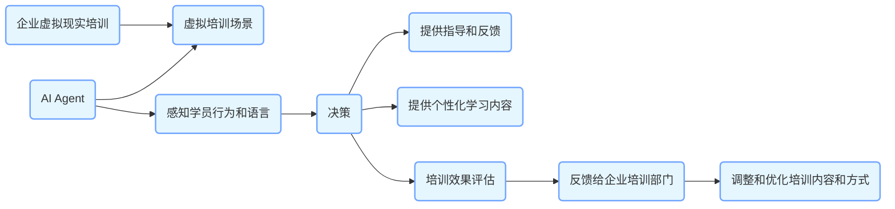

# AI Agent在企业虚拟现实培训中的应用

> 关键词：AI Agent、企业虚拟现实培训、智能交互、个性化学习、培训效果评估

> 摘要：本文深入探讨了AI Agent在企业虚拟现实培训中的应用。随着企业对员工培训的要求不断提高，虚拟现实培训凭借其沉浸式体验的优势逐渐受到关注。而AI Agent的引入，为虚拟现实培训带来了智能交互、个性化学习等诸多创新功能。文章首先介绍了相关背景知识，包括目的范围、预期读者等。接着阐述了AI Agent和企业虚拟现实培训的核心概念及联系，详细讲解了核心算法原理和具体操作步骤，并给出了相应的数学模型和公式。通过项目实战展示了AI Agent在虚拟现实培训中的代码实现和详细解释。同时，探讨了其实际应用场景，推荐了相关的工具和资源。最后总结了未来发展趋势与挑战，解答了常见问题，并提供了扩展阅读和参考资料，旨在为企业在虚拟现实培训中更好地应用AI Agent提供全面的技术指导和理论支持。

## 1. 背景介绍 
### 1.1 目的和范围
在当今竞争激烈的商业环境中，企业对员工的技能和知识要求日益提高。传统的培训方式往往存在效率低下、缺乏沉浸感等问题，难以满足企业的需求。虚拟现实（VR）技术的出现为企业培训带来了新的机遇，它能够提供高度沉浸式的培训环境，增强培训效果。然而，单纯的虚拟现实培训缺乏智能交互和个性化学习的能力。AI Agent（人工智能代理）作为一种能够感知环境、自主决策并执行任务的智能实体，可以与虚拟现实培训相结合，为学员提供更加智能、个性化的培训体验。

本文的范围主要聚焦于AI Agent在企业虚拟现实培训中的应用，包括其核心概念、算法原理、实际应用场景、项目实战等方面，旨在为企业和相关技术人员提供全面的技术指导和理论支持。

### 1.2 预期读者
本文的预期读者包括企业培训部门的管理人员、技术研发人员、虚拟现实技术爱好者、人工智能领域的研究人员等。对于企业培训管理人员来说，本文可以帮助他们了解AI Agent在虚拟现实培训中的应用价值，为企业的培训决策提供参考；对于技术研发人员，本文提供了详细的技术原理和实现步骤，有助于他们进行相关的技术开发；对于虚拟现实技术爱好者和人工智能领域的研究人员，本文可以拓宽他们的研究视野，激发创新思维。

### 1.3 文档结构概述
本文将按照以下结构进行阐述：首先介绍背景知识，包括目的范围、预期读者等；接着深入探讨AI Agent和企业虚拟现实培训的核心概念及联系，给出相应的文本示意图和Mermaid流程图；然后详细讲解核心算法原理和具体操作步骤，使用Python源代码进行阐述；再给出数学模型和公式，并进行详细讲解和举例说明；通过项目实战展示AI Agent在虚拟现实培训中的代码实现和详细解释；探讨其实际应用场景；推荐相关的工具和资源；最后总结未来发展趋势与挑战，解答常见问题，并提供扩展阅读和参考资料。

### 1.4 术语表
#### 1.4.1 核心术语定义
- **AI Agent（人工智能代理）**：是一种能够感知环境、自主决策并执行任务的智能实体。它可以根据环境的变化和预设的目标，自主地选择合适的行为策略。
- **企业虚拟现实培训**：利用虚拟现实技术为企业员工提供的一种高度沉浸式的培训方式。通过创建虚拟的培训场景，让学员身临其境地进行学习和实践。
- **智能交互**：指系统能够理解用户的意图，并以自然、高效的方式与用户进行交互。在AI Agent和虚拟现实培训中，智能交互可以表现为AI Agent能够根据学员的行为和语言做出相应的反应。
- **个性化学习**：根据学员的个体差异，如学习能力、知识水平、兴趣爱好等，为学员提供个性化的学习内容和学习路径。

#### 1.4.2 相关概念解释
- **虚拟现实（VR）**：是一种利用计算机技术生成的模拟环境，通过头戴式显示器、手柄等设备，让用户身临其境地感受虚拟世界。
- **增强现实（AR）**：是一种将虚拟信息与真实世界相结合的技术，通过摄像头等设备，将虚拟图像叠加在真实场景中。
- **机器学习**：是一门多领域交叉学科，涉及概率论、统计学、逼近论、凸分析、算法复杂度理论等多门学科。它专门研究计算机怎样模拟或实现人类的学习行为，以获取新的知识或技能，重新组织已有的知识结构使之不断改善自身的性能。

#### 1.4.3 缩略词列表
- **VR**：Virtual Reality（虚拟现实）
- **AR**：Augmented Reality（增强现实）
- **AI**：Artificial Intelligence（人工智能）

## 2. 核心概念与联系 

### 2.1 AI Agent的核心概念
AI Agent是人工智能领域的一个重要概念，它具有感知、决策和行动三个基本要素。感知是指AI Agent能够通过各种传感器获取环境信息；决策是指AI Agent根据感知到的信息和预设的目标，选择合适的行为策略；行动是指AI Agent根据决策结果，执行相应的动作。

AI Agent可以分为反应式Agent、基于模型的Agent、基于目标的Agent和基于效用的Agent等不同类型。反应式Agent只根据当前的感知信息做出反应，不考虑历史信息和未来目标；基于模型的Agent会维护一个环境模型，根据模型预测未来状态并做出决策；基于目标的Agent会设定一个或多个目标，通过规划行动来实现这些目标；基于效用的Agent会根据效用函数评估不同行动的价值，选择效用最大的行动。

### 2.2 企业虚拟现实培训的核心概念
企业虚拟现实培训是一种利用虚拟现实技术为企业员工提供的培训方式。它通过创建虚拟的培训场景，如生产车间、会议室、客户服务场景等，让学员身临其境地进行学习和实践。在虚拟现实培训中，学员可以通过头戴式显示器、手柄等设备与虚拟环境进行交互，进行操作练习、角色扮演等活动。

企业虚拟现实培训具有高度沉浸式、安全性高、可重复性强等优点。高度沉浸式的培训环境可以让学员更加投入地学习，提高学习效果；在虚拟环境中进行培训可以避免真实环境中的安全风险；培训内容可以多次重复使用，降低培训成本。

### 2.3 AI Agent与企业虚拟现实培训的联系
AI Agent与企业虚拟现实培训的结合可以为培训带来诸多创新功能。首先，AI Agent可以作为虚拟培训导师，与学员进行智能交互。它可以根据学员的行为和语言，实时给予指导和反馈，解答学员的疑问。其次，AI Agent可以实现个性化学习。它可以通过分析学员的学习数据，了解学员的学习能力、知识水平和兴趣爱好等，为学员提供个性化的学习内容和学习路径。此外，AI Agent还可以进行培训效果评估。它可以通过监测学员在虚拟环境中的表现，评估学员的学习效果，为企业提供培训效果的量化数据。

### 2.4 文本示意图
AI Agent与企业虚拟现实培训的关系可以用以下文本示意图表示：

企业虚拟现实培训创建虚拟培训场景，学员在虚拟环境中进行学习和实践。AI Agent作为智能实体，与虚拟环境和学员进行交互。AI Agent通过感知学员的行为和语言，获取环境信息，然后根据预设的目标和算法进行决策，为学员提供指导、反馈、个性化学习内容等服务。同时，AI Agent还可以对学员的学习效果进行评估，将评估结果反馈给企业培训部门，以便企业对培训内容和方式进行调整和优化。

### 2.5 Mermaid流程图


## 3. 核心算法原理 & 具体操作步骤 

### 3.1 核心算法原理
在AI Agent与企业虚拟现实培训的应用中，涉及到多种核心算法，如机器学习算法、自然语言处理算法、决策算法等。这里以强化学习算法为例，详细讲解其原理。

强化学习是一种通过智能体与环境进行交互，不断尝试不同的行为，以获得最大累积奖励的学习方法。在AI Agent的应用中，智能体就是AI Agent，环境就是企业虚拟现实培训的虚拟环境。AI Agent通过感知环境信息，选择一个行为执行，然后环境会根据AI Agent的行为给予一个奖励信号，AI Agent根据奖励信号调整自己的行为策略，以获得更多的奖励。

强化学习的核心是策略函数 $\pi(a|s)$，它表示在状态 $s$ 下选择行为 $a$ 的概率。AI Agent的目标是学习一个最优策略 $\pi^*$，使得在每个状态下选择的行为能够获得最大的累积奖励。

### 3.2 Python源代码实现
以下是一个简单的基于Q学习算法的强化学习示例代码，用于演示AI Agent在虚拟环境中的行为决策：

```python
import numpy as np

# 定义环境参数
num_states = 10
num_actions = 4
gamma = 0.9  # 折扣因子
alpha = 0.1  # 学习率

# 初始化Q表
Q = np.zeros((num_states, num_actions))

# 定义环境的状态转移和奖励函数
def environment(state, action):
    # 简单示例：随机转移到下一个状态，并给予一个奖励
    next_state = np.random.randint(0, num_states)
    reward = np.random.randint(-1, 2)
    return next_state, reward

# Q学习算法
def q_learning(num_episodes):
    for episode in range(num_episodes):
        state = np.random.randint(0, num_states)  # 随机初始化状态
        done = False
        while not done:
            # 选择行为
            if np.random.uniform(0, 1) < 0.1:  # 探索率
                action = np.random.randint(0, num_actions)
            else:
                action = np.argmax(Q[state, :])
            
            # 执行行为，获取下一个状态和奖励
            next_state, reward = environment(state, action)
            
            # 更新Q表
            Q[state, action] = Q[state, action] + alpha * (reward + gamma * np.max(Q[next_state, :]) - Q[state, action])
            
            state = next_state
            
            # 判断是否结束
            if np.random.uniform(0, 1) < 0.1:  # 结束概率
                done = True

# 训练AI Agent
q_learning(1000)

# 输出最终的Q表
print(Q)
```

### 3.3 具体操作步骤
1. **环境建模**：首先需要对企业虚拟现实培训的虚拟环境进行建模，包括定义环境的状态空间、行为空间、状态转移函数和奖励函数。状态空间表示环境的所有可能状态，行为空间表示AI Agent可以采取的所有行为，状态转移函数描述了在某个状态下执行某个行为后环境的状态变化，奖励函数则表示在某个状态下执行某个行为后获得的奖励。
2. **初始化Q表**：Q表是强化学习中用于存储状态-行为值的表格，它的行数等于状态空间的大小，列数等于行为空间的大小。在训练开始前，需要将Q表初始化为零。
3. **训练AI Agent**：使用Q学习算法对AI Agent进行训练。在每个训练周期中，AI Agent从一个随机状态开始，根据Q表选择一个行为执行，然后根据环境的反馈更新Q表。重复这个过程，直到达到预设的训练周期数。
4. **评估和优化**：训练完成后，需要对AI Agent的性能进行评估。可以通过在虚拟环境中测试AI Agent的行为，观察其获得的累积奖励和执行任务的成功率等指标。如果性能不理想，可以调整算法参数，如学习率、折扣因子等，重新进行训练。

## 4. 数学模型和公式 & 详细讲解 & 举例说明 

### 4.1 强化学习的数学模型
强化学习的数学模型可以用马尔可夫决策过程（MDP）来描述。一个MDP由一个五元组 $(S, A, P, R, \gamma)$ 组成，其中：
- $S$ 是状态空间，表示环境的所有可能状态。
- $A$ 是行为空间，表示AI Agent可以采取的所有行为。
- $P(s'|s, a)$ 是状态转移概率，表示在状态 $s$ 下执行行为 $a$ 后转移到状态 $s'$ 的概率。
- $R(s, a, s')$ 是奖励函数，表示在状态 $s$ 下执行行为 $a$ 后转移到状态 $s'$ 所获得的奖励。
- $\gamma \in [0, 1]$ 是折扣因子，用于平衡即时奖励和未来奖励的重要性。

### 4.2 Q学习算法的公式
Q学习算法的核心是更新Q表的公式：

$$Q(s, a) \leftarrow Q(s, a) + \alpha [R(s, a, s') + \gamma \max_{a'} Q(s', a') - Q(s, a)]$$

其中：
- $Q(s, a)$ 表示在状态 $s$ 下执行行为 $a$ 的Q值。
- $\alpha$ 是学习率，控制每次更新的步长。
- $R(s, a, s')$ 是在状态 $s$ 下执行行为 $a$ 后转移到状态 $s'$ 所获得的奖励。
- $\gamma$ 是折扣因子。
- $\max_{a'} Q(s', a')$ 表示在状态 $s'$ 下所有可能行为的最大Q值。

### 4.3 详细讲解
Q学习算法的基本思想是通过不断地尝试不同的行为，更新Q表中的Q值，使得Q值能够逐渐逼近最优Q值。在每个时间步，AI Agent根据当前的Q表选择一个行为执行，然后根据环境的反馈更新Q表。更新公式中的 $R(s, a, s') + \gamma \max_{a'} Q(s', a')$ 表示在状态 $s$ 下执行行为 $a$ 后获得的即时奖励加上未来可能获得的最大奖励的折扣值，$Q(s, a)$ 表示当前估计的Q值，两者的差值乘以学习率 $\alpha$ 就是需要更新的量。

### 4.4 举例说明
假设一个简单的虚拟环境，状态空间 $S = \{0, 1, 2\}$，行为空间 $A = \{0, 1\}$，初始Q表如下：

| 状态 | 行为0 | 行为1 |
| ---- | ---- | ---- |
| 0 | 0 | 0 |
| 1 | 0 | 0 |
| 2 | 0 | 0 |

当前状态 $s = 0$，AI Agent选择行为 $a = 0$，执行行为后转移到状态 $s' = 1$，获得奖励 $R(0, 0, 1) = 1$，学习率 $\alpha = 0.1$，折扣因子 $\gamma = 0.9$。

根据Q学习算法的更新公式，更新Q表中 $(0, 0)$ 位置的Q值：

$$Q(0, 0) \leftarrow Q(0, 0) + 0.1 [1 + 0.9 \max_{a'} Q(1, a') - Q(0, 0)]$$

由于初始Q表中 $Q(1, 0) = Q(1, 1) = 0$，所以 $\max_{a'} Q(1, a') = 0$，则：

$$Q(0, 0) \leftarrow 0 + 0.1 [1 + 0.9 \times 0 - 0] = 0.1$$

更新后的Q表如下：

| 状态 | 行为0 | 行为1 |
| ---- | ---- | ---- |
| 0 | 0.1 | 0 |
| 1 | 0 | 0 |
| 2 | 0 | 0 |

## 5. 项目实战：代码实际案例和详细解释说明 

### 5.1  开发环境搭建
1. **安装Python**：首先需要安装Python开发环境，建议使用Python 3.7及以上版本。可以从Python官方网站（https://www.python.org/downloads/） 下载安装包进行安装。
2. **安装必要的库**：在AI Agent和虚拟现实培训的开发中，需要使用一些必要的库，如NumPy、OpenAI Gym等。可以使用pip命令进行安装：
```sh
pip install numpy gym
```
3. **安装虚拟现实开发工具**：如果要开发虚拟现实培训应用，还需要安装相应的虚拟现实开发工具，如Unity 3D、Unreal Engine等。可以从官方网站下载安装包进行安装。

### 5.2  源代码详细实现和代码解读
以下是一个结合OpenAI Gym环境的AI Agent训练代码示例：

```python
import gym
import numpy as np

# 创建环境
env = gym.make('CartPole-v1')

# 定义超参数
num_episodes = 1000
gamma = 0.99
alpha = 0.1

# 初始化Q表
num_states = env.observation_space.shape[0]
num_actions = env.action_space.n
Q = np.zeros((num_states, num_actions))

# 定义epsilon-greedy策略
def epsilon_greedy(state, epsilon):
    if np.random.uniform(0, 1) < epsilon:
        action = env.action_space.sample()
    else:
        action = np.argmax(Q[state, :])
    return action

# Q学习算法
for episode in range(num_episodes):
    state = env.reset()
    done = False
    epsilon = 1 / (episode + 1)  # 衰减的探索率
    
    while not done:
        action = epsilon_greedy(state, epsilon)
        next_state, reward, done, _ = env.step(action)
        
        # 更新Q表
        Q[state, action] = Q[state, action] + alpha * (reward + gamma * np.max(Q[next_state, :]) - Q[state, action])
        
        state = next_state

# 测试AI Agent
state = env.reset()
done = False
total_reward = 0

while not done:
    action = np.argmax(Q[state, :])
    next_state, reward, done, _ = env.step(action)
    total_reward += reward
    state = next_state

print(f"Total reward: {total_reward}")

# 关闭环境
env.close()
```

### 5.3  代码解读与分析
1. **环境创建**：使用 `gym.make('CartPole-v1')` 创建一个OpenAI Gym的CartPole环境，这是一个经典的强化学习环境，目标是控制一个杆子保持平衡。
2. **超参数定义**：定义了训练的总周期数 `num_episodes`、折扣因子 `gamma` 和学习率 `alpha`。
3. **Q表初始化**：根据环境的状态空间和行为空间的大小，初始化Q表。
4. **epsilon-greedy策略**：定义了一个epsilon-greedy策略，用于在训练过程中平衡探索和利用。在每个时间步，以一定的概率 $\epsilon$ 随机选择一个行为，以 $1 - \epsilon$ 的概率选择Q值最大的行为。
5. **Q学习算法**：在每个训练周期中，AI Agent从环境的初始状态开始，根据epsilon-greedy策略选择一个行为执行，然后根据环境的反馈更新Q表。
6. **测试AI Agent**：训练完成后，使用训练好的Q表在环境中测试AI Agent的性能，记录总奖励。
7. **环境关闭**：最后关闭环境，释放资源。

## 6. 实际应用场景 
### 6.1 生产制造企业的技能培训
在生产制造企业中，新员工需要学习各种设备的操作技能和生产流程。使用AI Agent和虚拟现实培训可以创建逼真的虚拟生产车间，让新员工在虚拟环境中进行操作练习。AI Agent可以作为虚拟导师，实时指导新员工的操作，纠正错误，提供个性化的学习建议。例如，在汽车制造企业中，新员工可以在虚拟环境中学习汽车装配的流程和操作技巧，AI Agent可以根据员工的操作情况，及时给予反馈和指导，提高培训效率和质量。

### 6.2 医疗行业的手术培训
在医疗行业，手术培训是一项非常重要的工作。传统的手术培训往往需要在真实的患者身上进行，存在一定的风险。使用AI Agent和虚拟现实培训可以创建虚拟的手术场景，让医学生和实习医生在虚拟环境中进行手术操作练习。AI Agent可以模拟患者的生理状态和手术过程中的各种情况，根据医生的操作做出相应的反应，提供实时的指导和评估。例如，在心脏手术培训中，AI Agent可以模拟患者的心脏跳动、血压变化等生理指标，根据医生的手术操作，判断手术的效果，并给予相应的反馈和建议。

### 6.3 金融行业的客户服务培训
在金融行业，客户服务人员需要具备良好的沟通技巧和专业知识。使用AI Agent和虚拟现实培训可以创建虚拟的客户服务场景，让客户服务人员在虚拟环境中进行角色扮演练习。AI Agent可以模拟不同类型的客户，根据客户服务人员的回答做出相应的反应，提供实时的反馈和指导。例如，在银行的客户服务培训中，AI Agent可以模拟客户咨询贷款、信用卡等业务的场景，根据客户服务人员的回答，评估其沟通能力和专业知识水平，并给予相应的培训建议。

### 6.4 应急救援培训
在应急救援领域，救援人员需要在复杂的环境中迅速做出决策和采取行动。使用AI Agent和虚拟现实培训可以创建虚拟的应急救援场景，如火灾、地震、洪水等，让救援人员在虚拟环境中进行应急演练。AI Agent可以模拟各种复杂的情况，如烟雾弥漫、道路堵塞、人员伤亡等，根据救援人员的行动做出相应的反应，提供实时的指导和评估。例如，在火灾应急救援培训中，AI Agent可以模拟火灾的蔓延速度、烟雾浓度等情况，根据救援人员的灭火、疏散等行动，判断救援的效果，并给予相应的反馈和建议。

## 7. 工具和资源推荐
### 7.1 学习资源推荐
#### 7.1.1 书籍推荐
- 《人工智能：一种现代的方法》：这本书是人工智能领域的经典教材，全面介绍了人工智能的各个方面，包括搜索算法、知识表示、推理、机器学习、自然语言处理等。
- 《强化学习：原理与Python实现》：详细介绍了强化学习的基本原理和算法，通过Python代码实现了各种强化学习算法，并给出了实际应用案例。
- 《虚拟现实技术：原理、开发与应用》：介绍了虚拟现实技术的基本原理、开发工具和应用案例，对于学习虚拟现实技术有很大的帮助。

#### 7.1.2 在线课程
- Coursera上的“人工智能基础”课程：由知名高校的教授授课，系统地介绍了人工智能的基本概念、算法和应用。
- edX上的“强化学习”课程：深入讲解了强化学习的理论和实践，通过大量的案例和实验帮助学生掌握强化学习的算法和应用。
- Udemy上的“虚拟现实开发实战”课程：通过实际项目的开发，教授学生如何使用Unity 3D等工具进行虚拟现实应用的开发。

#### 7.1.3 技术博客和网站
- Medium：是一个技术博客平台，上面有很多关于人工智能、虚拟现实等领域的优秀文章和技术分享。
- arXiv：是一个预印本服务器，上面有很多最新的学术研究论文，对于了解人工智能和虚拟现实领域的最新研究成果有很大的帮助。
- OpenAI官方博客：OpenAI是人工智能领域的领先研究机构，其官方博客上有很多关于人工智能技术的最新进展和研究成果。

### 7.2 开发工具框架推荐
#### 7.2.1 IDE和编辑器
- PyCharm：是一款专门为Python开发设计的集成开发环境，具有代码自动补全、调试、版本控制等功能，非常适合AI Agent和虚拟现实培训的开发。
- Visual Studio Code：是一款轻量级的代码编辑器，支持多种编程语言和插件扩展，具有丰富的功能和良好的用户体验。
- Unity Hub：是Unity 3D的管理工具，通过Unity Hub可以方便地安装和管理不同版本的Unity 3D，进行虚拟现实应用的开发。

#### 7.2.2 调试和性能分析工具
- PDB：是Python自带的调试工具，可以在代码中设置断点，单步执行代码，查看变量的值等，方便调试AI Agent的代码。
- Unity Profiler：是Unity 3D自带的性能分析工具，可以分析虚拟现实应用的性能瓶颈，如CPU使用率、内存占用等，帮助优化应用的性能。
- TensorBoard：是TensorFlow的可视化工具，可以可视化训练过程中的各种指标，如损失函数、准确率等，方便分析和优化机器学习模型。

#### 7.2.3 相关框架和库
- NumPy：是Python的一个科学计算库，提供了高效的多维数组对象和各种数学函数，在AI Agent和虚拟现实培训的开发中经常用于数据处理和数值计算。
- OpenAI Gym：是一个开源的强化学习环境库，提供了各种经典的强化学习环境，如CartPole、MountainCar等，方便开发和测试AI Agent的算法。
- Unity ML-Agents：是Unity 3D的一个机器学习插件，提供了一系列工具和接口，方便在Unity 3D中开发和训练AI Agent，实现智能交互和行为控制。

### 7.3 相关论文著作推荐
#### 7.3.1 经典论文
- “Reinforcement Learning: A Survey”：这篇论文是强化学习领域的经典综述论文，全面介绍了强化学习的发展历程、基本概念、算法和应用。
- “Human-level control through deep reinforcement learning”：这篇论文提出了深度Q网络（DQN）算法，首次将深度学习和强化学习相结合，在Atari游戏中取得了人类水平的成绩。
- “Mastering the Game of Go with Deep Neural Networks and Tree Search”：这篇论文介绍了AlphaGo的实现原理，通过深度神经网络和蒙特卡罗树搜索算法，在围棋比赛中击败了人类冠军。

#### 7.3.2 最新研究成果
- 关注arXiv上关于人工智能和虚拟现实领域的最新研究论文，了解最新的技术进展和研究方向。
- 参加人工智能和虚拟现实领域的国际学术会议，如NeurIPS、ICML、CVPR等，获取最新的研究成果和行业动态。

#### 7.3.3 应用案例分析
- 研究一些知名企业在AI Agent和虚拟现实培训方面的应用案例，如波音公司在飞机维修培训中使用虚拟现实技术，谷歌在自动驾驶汽车研发中使用AI Agent进行环境感知和决策等。通过分析这些应用案例，可以了解实际应用中的技术难点和解决方案，为自己的项目提供参考。

## 8. 总结：未来发展趋势与挑战
### 8.1 未来发展趋势
- **更加智能的交互**：未来的AI Agent将具备更加智能的交互能力，能够理解人类的自然语言、情感和意图，与学员进行更加自然、高效的交互。例如，AI Agent可以通过语音识别和自然语言处理技术，实时理解学员的问题，并以自然语言的方式给予回答和指导。
- **个性化学习的深入发展**：随着人工智能技术的不断发展，AI Agent将能够更加准确地了解学员的个体差异，为学员提供更加个性化的学习内容和学习路径。例如，AI Agent可以通过分析学员的学习数据、行为习惯、兴趣爱好等，为学员定制专属的培训计划，提高学习效果。
- **与其他技术的融合**：AI Agent将与其他技术，如增强现实（AR）、物联网（IoT）等进行融合，创造更加丰富、真实的培训场景。例如，在工业培训中，可以将AI Agent与AR技术相结合，让学员在真实的工作环境中通过AR设备获取虚拟的指导和提示，提高培训的实用性和效果。
- **云端服务的普及**：随着云计算技术的发展，AI Agent和虚拟现实培训将越来越多地采用云端服务的模式。企业可以将培训内容和AI Agent的算法部署在云端，学员可以通过互联网随时随地进行培训，降低培训成本，提高培训的灵活性和可扩展性。

### 8.2 挑战
- **技术难题**：AI Agent和虚拟现实培训涉及到多种复杂的技术，如人工智能、虚拟现实、自然语言处理等。目前，这些技术还存在一些局限性，如人工智能的可解释性问题、虚拟现实的沉浸感和交互性问题等。需要进一步的研究和开发，解决这些技术难题。
- **数据安全和隐私问题**：在AI Agent和虚拟现实培训中，需要收集和处理大量的学员数据，如学习数据、行为数据、生理数据等。这些数据涉及到学员的隐私和安全，需要采取有效的措施进行保护，防止数据泄露和滥用。
- **成本问题**：虚拟现实培训的设备和软件成本较高，对于一些中小企业来说，可能难以承担。此外，开发和维护AI Agent的算法也需要一定的技术和人力成本。需要寻找降低成本的方法，提高AI Agent和虚拟现实培训的性价比。
- **用户接受度问题**：一些用户可能对虚拟现实技术和AI Agent存在疑虑和不适应，如担心虚拟现实设备的舒适度、AI Agent的可靠性等。需要加强宣传和推广，提高用户对这些技术的接受度和认可度。

## 9. 附录：常见问题与解答
### 9.1 问题1：AI Agent在虚拟现实培训中的准确性如何保证？
解答：为了保证AI Agent在虚拟现实培训中的准确性，可以采取以下措施：
- **数据质量**：使用高质量的训练数据对AI Agent进行训练，确保数据的准确性和完整性。
- **算法优化**：不断优化AI Agent的算法，提高其决策的准确性和可靠性。例如，使用更复杂的机器学习算法，如深度学习算法，提高AI Agent的学习能力和预测能力。
- **评估和验证**：在训练完成后，对AI Agent进行严格的评估和验证，通过实际测试和对比实验，评估其性能和准确性。根据评估结果，对AI Agent进行调整和优化。

### 9.2 问题2：虚拟现实培训设备的选择有哪些注意事项？
解答：选择虚拟现实培训设备时，需要考虑以下几个方面：
- **性能**：选择性能稳定、分辨率高、刷新率快的设备，以提供良好的沉浸感和视觉体验。
- **舒适度**：考虑设备的重量、佩戴方式、透气性等因素，选择舒适度高的设备，减少用户在使用过程中的疲劳感。
- **兼容性**：确保设备与虚拟现实培训软件和AI Agent的算法兼容，避免出现兼容性问题。
- **成本**：根据企业的预算和需求，选择性价比高的设备。

### 9.3 问题3：如何评估AI Agent在虚拟现实培训中的效果？
解答：可以从以下几个方面评估AI Agent在虚拟现实培训中的效果：
- **学习效果**：通过测试学员在培训前后的知识水平和技能掌握情况，评估AI Agent对学员学习效果的提升程度。
- **交互体验**：收集学员对AI Agent交互体验的反馈，如交互的自然度、响应速度、指导的准确性等，评估AI Agent的交互性能。
- **培训效率**：分析学员完成培训任务的时间和成功率，评估AI Agent对培训效率的影响。
- **用户满意度**：通过问卷调查等方式，了解学员对AI Agent和虚拟现实培训的满意度，评估整体的培训效果。

## 10. 扩展阅读 & 参考资料
### 10.1 扩展阅读
- 《深度学习》：这本书是深度学习领域的经典著作，深入介绍了深度学习的原理、算法和应用，对于进一步了解AI Agent的技术基础有很大的帮助。
- 《人类简史：从动物到上帝》：虽然这本书不是技术类书籍，但它从人类的发展历程和认知角度，探讨了人工智能对人类社会的影响，对于思考AI Agent在企业培训中的应用和未来发展有一定的启发。
- 《创新者的窘境》：这本书探讨了企业在面对技术创新时的挑战和机遇，对于企业在引入AI Agent和虚拟现实培训等新技术时，如何进行战略决策和组织变革有一定的参考价值。

### 10.2 参考资料
- 相关的学术论文和研究报告，可以通过学术数据库，如IEEE Xplore、ACM Digital Library等进行查找。
- 虚拟现实和人工智能领域的技术论坛和社区，如Reddit上的r/virtualreality、r/artificialintelligence等，上面有很多行业专家和爱好者的讨论和分享。
- 企业和机构发布的技术文档和白皮书，如Unity 3D、OpenAI等官方发布的技术文档和白皮书，对于了解相关技术的最新进展和应用案例有很大的帮助。