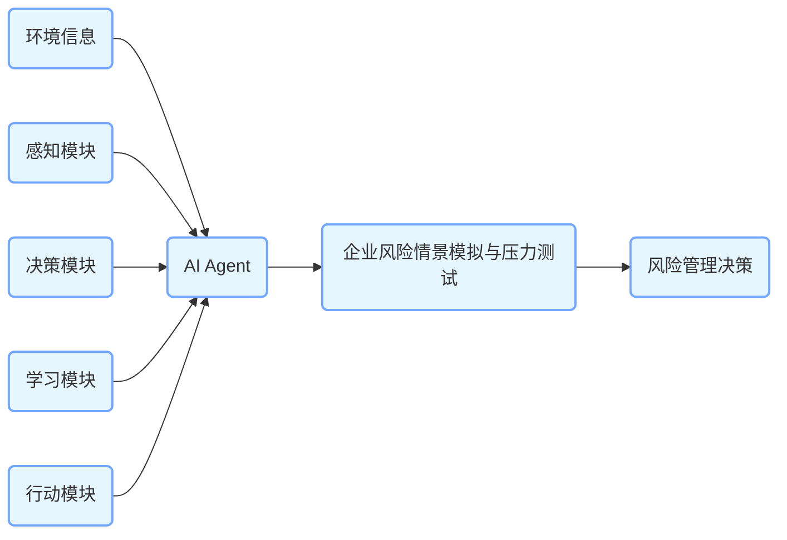

# AI Agent在企业风险情景模拟与压力测试中的应用

> 关键词：AI Agent、企业风险、情景模拟、压力测试、人工智能应用

> 摘要：本文深入探讨了AI Agent在企业风险情景模拟与压力测试中的应用。首先介绍了相关背景知识，包括目的、预期读者等内容。接着阐述了AI Agent及企业风险情景模拟与压力测试的核心概念及联系，并给出了相应的原理和架构示意图与流程图。详细讲解了核心算法原理及具体操作步骤，同时给出数学模型和公式并举例说明。通过项目实战展示了代码实际案例及详细解释。分析了其实际应用场景，推荐了相关工具和资源。最后总结了未来发展趋势与挑战，解答常见问题并提供扩展阅读和参考资料，旨在为企业利用AI Agent进行风险情景模拟与压力测试提供全面的技术指导和理论支持。

## 1. 背景介绍 
### 1.1 目的和范围
企业在运营过程中面临着各种各样的风险，如市场风险、信用风险、操作风险等。为了更好地管理这些风险，企业需要进行风险情景模拟与压力测试，以评估不同情景下企业的风险承受能力和稳定性。传统的风险情景模拟与压力测试方法往往存在计算效率低、情景设置不够灵活、对复杂风险因素考虑不足等问题。

AI Agent作为一种具有自主决策和学习能力的智能实体，能够在复杂环境中感知信息、做出决策并采取行动。将AI Agent应用于企业风险情景模拟与压力测试中，可以提高模拟的准确性和效率，更全面地考虑各种风险因素，为企业的风险管理提供更有力的支持。

本文的范围涵盖了AI Agent在企业风险情景模拟与压力测试中的基本概念、核心算法、数学模型、项目实战、应用场景等方面，旨在为读者提供一个全面的技术指导和理论参考。

### 1.2 预期读者
本文的预期读者包括企业风险管理领域的从业者，如风险管理人员、金融分析师等；人工智能领域的研究人员和开发者，如AI工程师、数据科学家等；以及对企业风险管理和人工智能应用感兴趣的学者和学生。

### 1.3 文档结构概述
本文将按照以下结构进行组织：
1. **背景介绍**：介绍本文的目的、范围、预期读者和文档结构概述，以及相关术语的定义和解释。
2. **核心概念与联系**：阐述AI Agent、企业风险情景模拟与压力测试的核心概念，以及它们之间的联系，并给出相应的原理和架构示意图与流程图。
3. **核心算法原理 & 具体操作步骤**：详细讲解AI Agent在企业风险情景模拟与压力测试中使用的核心算法原理，并给出具体的操作步骤，同时使用Python源代码进行详细阐述。
4. **数学模型和公式 & 详细讲解 & 举例说明**：给出AI Agent在企业风险情景模拟与压力测试中的数学模型和公式，并进行详细讲解和举例说明。
5. **项目实战：代码实际案例和详细解释说明**：通过一个实际项目案例，展示AI Agent在企业风险情景模拟与压力测试中的代码实现和详细解释。
6. **实际应用场景**：分析AI Agent在企业风险情景模拟与压力测试中的实际应用场景。
7. **工具和资源推荐**：推荐相关的学习资源、开发工具框架和论文著作。
8. **总结：未来发展趋势与挑战**：总结AI Agent在企业风险情景模拟与压力测试中的未来发展趋势和面临的挑战。
9. **附录：常见问题与解答**：解答读者在阅读本文过程中可能遇到的常见问题。
10. **扩展阅读 & 参考资料**：提供相关的扩展阅读资料和参考书目。

### 1.4 术语表
#### 1.4.1 核心术语定义
- **AI Agent（人工智能智能体）**：是一种能够感知环境、做出决策并采取行动的智能实体，具有自主学习和适应能力。
- **企业风险情景模拟**：是指通过设定不同的风险情景，模拟企业在这些情景下的运营情况和风险暴露程度。
- **企业压力测试**：是指在极端风险情景下，评估企业的风险承受能力和稳定性，以确定企业是否能够在不利情况下继续生存和发展。

#### 1.4.2 相关概念解释
- **风险因素**：是指可能导致企业面临风险的各种因素，如市场波动、信用违约、操作失误等。
- **风险度量指标**：是指用于衡量企业风险暴露程度的指标，如风险价值（VaR）、条件风险价值（CVaR）等。
- **情景生成**：是指根据一定的方法和规则，生成不同的风险情景。

#### 1.4.3 缩略词列表
- **VaR**：Value at Risk，风险价值
- **CVaR**：Conditional Value at Risk，条件风险价值

## 2. 核心概念与联系 

### 2.1 AI Agent的核心概念
AI Agent是一种具有自主决策和学习能力的智能实体，它可以在复杂的环境中感知信息、做出决策并采取行动。AI Agent通常由以下几个部分组成：
- **感知模块**：用于感知环境中的信息，如市场数据、企业运营数据等。
- **决策模块**：根据感知到的信息，使用一定的算法和策略做出决策。
- **行动模块**：根据决策结果，采取相应的行动，如调整投资组合、优化业务流程等。
- **学习模块**：通过与环境的交互，不断学习和优化自己的决策和行动策略。

### 2.2 企业风险情景模拟与压力测试的核心概念
企业风险情景模拟是指通过设定不同的风险情景，模拟企业在这些情景下的运营情况和风险暴露程度。风险情景可以根据历史数据、专家经验、市场趋势等因素进行设定。企业压力测试是指在极端风险情景下，评估企业的风险承受能力和稳定性，以确定企业是否能够在不利情况下继续生存和发展。

### 2.3 核心概念的联系
AI Agent可以在企业风险情景模拟与压力测试中发挥重要作用。具体来说，AI Agent可以：
- **情景生成**：利用其学习和决策能力，生成更加合理和多样化的风险情景。
- **模拟计算**：在不同的风险情景下，模拟企业的运营情况和风险暴露程度，提高模拟的准确性和效率。
- **压力测试评估**：评估企业在极端风险情景下的风险承受能力和稳定性，为企业的风险管理提供决策支持。

### 2.4 核心概念原理和架构的文本示意图
```plaintext
                          ┌─────────────┐
                          │  环境信息   │
                          └─────────────┘
                                 │
                                 ▼
              ┌───────────────────────────────┐
              │           AI Agent            │
              │ ┌─────────┐ ┌─────────┐ ┌─────┴─────┐ ┌─────────┐ │
              │ │ 感知模块 │ │ 决策模块 │ │ 学习模块 │ │ 行动模块 │ │
              │ └─────────┘ └─────────┘ └───────────┘ └─────────┘ │
              └───────────────────────────────┘
                                 │
                                 ▼
                          ┌─────────────┐
                          │ 企业风险情景模拟与压力测试  │
                          └─────────────┘
                                 │
                                 ▼
                          ┌─────────────┐
                          │ 风险管理决策 │
                          └─────────────┘
```

### 2.5 Mermaid流程图


## 3. 核心算法原理 & 具体操作步骤 

### 3.1 核心算法原理
在企业风险情景模拟与压力测试中，AI Agent常用的算法包括强化学习算法、遗传算法等。下面以强化学习算法为例，介绍其核心原理。

强化学习是一种通过智能体与环境进行交互，不断学习最优策略的机器学习方法。在强化学习中，智能体在环境中执行动作，环境会根据智能体的动作返回一个奖励信号和下一个状态。智能体的目标是通过不断地与环境交互，学习到一个最优策略，使得累积奖励最大化。

强化学习的核心概念包括状态（State）、动作（Action）、奖励（Reward）和策略（Policy）。状态表示智能体所处的环境状态，动作表示智能体可以采取的行动，奖励表示智能体执行动作后从环境中获得的反馈，策略表示智能体在不同状态下选择动作的规则。

### 3.2 具体操作步骤
下面是使用强化学习算法进行企业风险情景模拟与压力测试的具体操作步骤：
1. **定义环境**：定义企业风险情景模拟与压力测试的环境，包括状态空间、动作空间和奖励函数。
2. **初始化智能体**：初始化强化学习智能体，包括选择合适的算法（如Q-learning、Deep Q-Network等）和初始化参数。
3. **训练智能体**：让智能体在环境中不断地进行交互，根据奖励信号更新智能体的策略。
4. **评估智能体**：在训练完成后，评估智能体的性能，验证其在不同风险情景下的有效性。
5. **应用智能体**：将训练好的智能体应用到实际的企业风险情景模拟与压力测试中，为风险管理决策提供支持。

### 3.3 Python源代码详细阐述
下面是一个使用Q-learning算法进行简单企业风险情景模拟的Python示例代码：
```python
import numpy as np

# 定义环境
class RiskSimulationEnv:
    def __init__(self):
        # 状态空间：简单示例，假设有10个状态
        self.state_space = np.arange(10)
        # 动作空间：假设有3个动作
        self.action_space = np.arange(3)
        # 初始状态
        self.state = np.random.choice(self.state_space)

    def step(self, action):
        # 根据动作更新状态
        if action == 0:
            self.state = max(self.state - 1, 0)
        elif action == 1:
            self.state = min(self.state + 1, 9)
        else:
            self.state = np.random.choice(self.state_space)

        # 定义奖励函数
        if self.state == 9:
            reward = 10
        else:
            reward = -1

        # 判断是否结束
        done = (self.state == 9)

        return self.state, reward, done

    def reset(self):
        self.state = np.random.choice(self.state_space)
        return self.state

# 定义Q-learning智能体
class QLearningAgent:
    def __init__(self, state_space_size, action_space_size, learning_rate=0.1, discount_factor=0.9):
        self.state_space_size = state_space_size
        self.action_space_size = action_space_size
        self.learning_rate = learning_rate
        self.discount_factor = discount_factor
        # 初始化Q表
        self.q_table = np.zeros((state_space_size, action_space_size))

    def choose_action(self, state, epsilon=0.1):
        if np.random.uniform(0, 1) < epsilon:
            # 探索：随机选择动作
            action = np.random.choice(self.action_space_size)
        else:
            # 利用：选择Q值最大的动作
            action = np.argmax(self.q_table[state, :])
        return action

    def update_q_table(self, state, action, reward, next_state):
        # Q-learning更新公式
        max_q_next = np.max(self.q_table[next_state, :])
        self.q_table[state, action] += self.learning_rate * (reward + self.discount_factor * max_q_next - self.q_table[state, action])

# 训练智能体
env = RiskSimulationEnv()
agent = QLearningAgent(state_space_size=10, action_space_size=3)

num_episodes = 1000
for episode in range(num_episodes):
    state = env.reset()
    done = False
    while not done:
        action = agent.choose_action(state)
        next_state, reward, done = env.step(action)
        agent.update_q_table(state, action, reward, next_state)
        state = next_state

# 评估智能体
state = env.reset()
done = False
total_reward = 0
while not done:
    action = agent.choose_action(state, epsilon=0)
    next_state, reward, done = env.step(action)
    total_reward += reward
    state = next_state

print("Total reward:", total_reward)
```
在上述代码中，我们首先定义了一个简单的企业风险情景模拟环境`RiskSimulationEnv`，包括状态空间、动作空间、奖励函数等。然后定义了一个Q-learning智能体`QLearningAgent`，包括Q表的初始化、动作选择和Q表更新等方法。最后进行训练和评估，输出智能体在评估阶段的总奖励。

## 4. 数学模型和公式 & 详细讲解 & 举例说明 

### 4.1 强化学习的数学模型和公式
强化学习的目标是学习一个最优策略 $\pi^*$，使得智能体在环境中获得的累积奖励最大化。累积奖励可以表示为：
$$G_t = \sum_{k=0}^{\infty} \gamma^k r_{t+k+1}$$
其中，$G_t$ 表示从时间步 $t$ 开始的累积奖励，$r_{t+k+1}$ 表示在时间步 $t + k + 1$ 获得的奖励，$\gamma$ 是折扣因子，用于权衡近期奖励和远期奖励。

Q-learning算法的核心是更新Q表，Q表表示在某个状态下采取某个动作的价值。Q-learning的更新公式为：
$$Q(s_t, a_t) \leftarrow Q(s_t, a_t) + \alpha [r_{t+1} + \gamma \max_{a} Q(s_{t+1}, a) - Q(s_t, a_t)]$$
其中，$Q(s_t, a_t)$ 表示在状态 $s_t$ 下采取动作 $a_t$ 的Q值，$\alpha$ 是学习率，$r_{t+1}$ 是在时间步 $t + 1$ 获得的奖励，$s_{t+1}$ 是下一个状态。

### 4.2 详细讲解
- **累积奖励**：累积奖励 $G_t$ 表示智能体从时间步 $t$ 开始在未来所有时间步获得的奖励的总和。折扣因子 $\gamma$ 的取值范围是 $[0, 1]$，当 $\gamma$ 接近1时，智能体更注重远期奖励；当 $\gamma$ 接近0时，智能体更注重近期奖励。
- **Q-learning更新公式**：Q-learning更新公式的核心思想是根据当前的奖励和下一个状态的最大Q值来更新当前状态-动作对的Q值。学习率 $\alpha$ 控制了每次更新的步长，$\alpha$ 越大，更新越快，但可能会导致不稳定；$\alpha$ 越小，更新越慢，但更稳定。

### 4.3 举例说明
假设我们有一个简单的企业风险情景模拟环境，状态空间为 $\{0, 1, 2\}$，动作空间为 $\{0, 1\}$。初始Q表如下：
| State | Action 0 | Action 1 |
|-------|----------|----------|
| 0     | 0        | 0        |
| 1     | 0        | 0        |
| 2     | 0        | 0        |

假设在某个时间步，智能体处于状态 $s_t = 0$，采取动作 $a_t = 1$，获得奖励 $r_{t+1} = 1$，下一个状态 $s_{t+1} = 1$。学习率 $\alpha = 0.1$，折扣因子 $\gamma = 0.9$。

首先，计算下一个状态的最大Q值：$\max_{a} Q(s_{t+1}, a) = \max\{Q(1, 0), Q(1, 1)\} = 0$。

然后，根据Q-learning更新公式更新Q表：
$$Q(0, 1) \leftarrow Q(0, 1) + \alpha [r_{t+1} + \gamma \max_{a} Q(s_{t+1}, a) - Q(0, 1)]$$
$$Q(0, 1) \leftarrow 0 + 0.1 [1 + 0.9 \times 0 - 0] = 0.1$$

更新后的Q表如下：
| State | Action 0 | Action 1 |
|-------|----------|----------|
| 0     | 0        | 0.1      |
| 1     | 0        | 0        |
| 2     | 0        | 0        |

## 5. 项目实战：代码实际案例和详细解释说明 

### 5.1  开发环境搭建
在进行AI Agent在企业风险情景模拟与压力测试的项目实战之前，需要搭建相应的开发环境。以下是具体的步骤：
1. **安装Python**：建议安装Python 3.7及以上版本。可以从Python官方网站（https://www.python.org/downloads/）下载并安装。
2. **安装必要的库**：在命令行中使用以下命令安装必要的库：
```sh
pip install numpy matplotlib gym
```
其中，`numpy` 用于数值计算，`matplotlib` 用于数据可视化，`gym` 是一个开源的强化学习环境库，提供了各种模拟环境。

### 5.2  源代码详细实现和代码解读
下面是一个使用OpenAI Gym库中的`CartPole-v1`环境进行企业风险情景模拟与压力测试的示例代码：
```python
import gym
import numpy as np
import matplotlib.pyplot as plt

# 创建环境
env = gym.make('CartPole-v1')

# 定义Q-learning智能体
class QLearningAgent:
    def __init__(self, state_space_size, action_space_size, learning_rate=0.1, discount_factor=0.9, epsilon=0.1):
        self.state_space_size = state_space_size
        self.action_space_size = action_space_size
        self.learning_rate = learning_rate
        self.discount_factor = discount_factor
        self.epsilon = epsilon
        # 初始化Q表
        self.q_table = np.zeros((state_space_size, action_space_size))

    def choose_action(self, state):
        if np.random.uniform(0, 1) < self.epsilon:
            # 探索：随机选择动作
            action = np.random.choice(self.action_space_size)
        else:
            # 利用：选择Q值最大的动作
            action = np.argmax(self.q_table[state, :])
        return action

    def update_q_table(self, state, action, reward, next_state):
        # Q-learning更新公式
        max_q_next = np.max(self.q_table[next_state, :])
        self.q_table[state, action] += self.learning_rate * (reward + self.discount_factor * max_q_next - self.q_table[state, action])

# 离散化状态空间
def discretize_state(state, bins):
    discrete_state = []
    for i in range(len(state)):
        discrete_state.append(np.digitize(state[i], bins[i]) - 1)
    return tuple(discrete_state)

# 定义状态空间的离散化区间
bins = [
    np.linspace(-4.8, 4.8, 20),
    np.linspace(-4, 4, 20),
    np.linspace(-0.418, 0.418, 20),
    np.linspace(-4, 4, 20)
]

# 初始化智能体
state_space_size = tuple(len(bin) for bin in bins)
action_space_size = env.action_space.n
agent = QLearningAgent(state_space_size=np.prod(state_space_size), action_space_size=action_space_size)

# 训练智能体
num_episodes = 1000
episode_rewards = []
for episode in range(num_episodes):
    state = env.reset()
    discrete_state = discretize_state(state, bins)
    state_index = np.ravel_multi_index(discrete_state, state_space_size)
    done = False
    episode_reward = 0
    while not done:
        action = agent.choose_action(state_index)
        next_state, reward, done, _ = env.step(action)
        next_discrete_state = discretize_state(next_state, bins)
        next_state_index = np.ravel_multi_index(next_discrete_state, state_space_size)
        agent.update_q_table(state_index, action, reward, next_state_index)
        state_index = next_state_index
        episode_reward += reward
    episode_rewards.append(episode_reward)

# 绘制奖励曲线
plt.plot(episode_rewards)
plt.xlabel('Episode')
plt.ylabel('Reward')
plt.title('Training Rewards')
plt.show()

# 评估智能体
state = env.reset()
discrete_state = discretize_state(state, bins)
state_index = np.ravel_multi_index(discrete_state, state_space_size)
done = False
total_reward = 0
while not done:
    action = agent.choose_action(state_index, epsilon=0)
    next_state, reward, done, _ = env.step(action)
    next_discrete_state = discretize_state(next_state, bins)
    next_state_index = np.ravel_multi_index(next_discrete_state, state_space_size)
    state_index = next_state_index
    total_reward += reward

print("Total reward in evaluation:", total_reward)

# 关闭环境
env.close()
```
### 5.3  代码解读与分析
1. **环境创建**：使用`gym.make('CartPole-v1')`创建OpenAI Gym库中的`CartPole-v1`环境。这个环境可以模拟一个倒立摆系统，智能体的目标是通过控制小车的左右移动来保持杆子的平衡。
2. **Q-learning智能体定义**：定义了一个Q-learning智能体类`QLearningAgent`，包括Q表的初始化、动作选择和Q表更新等方法。
3. **状态空间离散化**：由于`CartPole-v1`环境的状态空间是连续的，而Q-learning算法需要离散的状态空间，因此需要对状态空间进行离散化处理。使用`discretize_state`函数将连续的状态转换为离散的状态。
4. **训练智能体**：在训练过程中，智能体不断地与环境进行交互，根据奖励信号更新Q表。记录每个回合的奖励，用于后续的可视化分析。
5. **绘制奖励曲线**：使用`matplotlib`库绘制训练过程中的奖励曲线，直观地展示智能体的学习过程。
6. **评估智能体**：在训练完成后，对智能体进行评估，计算智能体在评估阶段的总奖励。
7. **关闭环境**：最后关闭环境，释放资源。

## 6. 实际应用场景 
AI Agent在企业风险情景模拟与压力测试中有广泛的实际应用场景，以下是一些具体的例子：
### 6.1 金融企业风险管理
在金融企业中，如银行、证券公司等，需要对市场风险、信用风险等进行管理。AI Agent可以用于生成不同的市场情景和信用违约情景，模拟企业在这些情景下的资产价值变化和风险暴露程度。通过压力测试，评估企业在极端市场条件下的风险承受能力，为风险管理决策提供支持。例如，银行可以使用AI Agent模拟不同利率波动、汇率变化等情景下的贷款组合风险，及时调整贷款策略和风险敞口。

### 6.2 供应链风险管理
在供应链管理中，企业面临着供应商违约、物流中断、需求波动等风险。AI Agent可以模拟不同的供应链风险情景，如供应商破产、运输延误等，评估企业在这些情景下的供应链稳定性和运营成本。通过压力测试，企业可以制定相应的应对策略，如寻找备用供应商、优化库存管理等，提高供应链的韧性。

### 6.3 项目风险管理
在项目管理中，项目可能面临着进度延迟、成本超支、技术难题等风险。AI Agent可以模拟不同的项目风险情景，如关键人员离职、技术故障等，评估项目在这些情景下的成功概率和风险影响。通过压力测试，项目管理者可以提前制定风险应对措施，如调整项目计划、增加资源投入等，确保项目的顺利进行。

### 6.4 保险企业风险管理
在保险企业中，需要对保险风险进行评估和管理。AI Agent可以模拟不同的保险风险情景，如自然灾害、疾病流行等，评估企业在这些情景下的理赔支出和风险储备。通过压力测试，保险企业可以合理确定保险费率、调整风险策略，确保企业的财务稳定性。

## 7. 工具和资源推荐
### 7.1 学习资源推荐
#### 7.1.1 书籍推荐
- 《强化学习：原理与Python实现》：本书详细介绍了强化学习的基本原理和算法，并通过Python代码实现了多个实际案例，适合初学者和有一定基础的读者学习。
- 《人工智能：一种现代的方法》：这是一本经典的人工智能教材，涵盖了人工智能的各个领域，包括搜索算法、机器学习、自然语言处理等，对于理解AI Agent的基础理论有很大帮助。
- 《风险管理与金融机构》：本书介绍了金融机构风险管理的基本概念、方法和技术，对于了解企业风险情景模拟与压力测试在金融领域的应用有重要参考价值。

#### 7.1.2 在线课程
- Coursera上的“强化学习专项课程”：由知名高校的教授授课，系统地介绍了强化学习的理论和实践，包括Q-learning、深度强化学习等内容。
- edX上的“人工智能基础”：该课程涵盖了人工智能的基本概念、算法和应用，对于初学者来说是一个很好的入门课程。
- Udemy上的“企业风险管理实战”：通过实际案例介绍了企业风险管理的流程和方法，对于了解企业风险情景模拟与压力测试的实际应用有很大帮助。

#### 7.1.3 技术博客和网站
- OpenAI官方博客：提供了关于人工智能和强化学习的最新研究成果和技术动态，是了解前沿技术的重要渠道。
- Medium上的人工智能专栏：有很多优秀的技术文章，涵盖了AI Agent、强化学习、企业风险管理等领域的内容。
- Kaggle：是一个数据科学和机器学习竞赛平台，上面有很多关于风险管理和人工智能的竞赛和案例，可以学习到实际应用中的经验和技巧。

### 7.2 开发工具框架推荐
#### 7.2.1 IDE和编辑器
- PyCharm：是一款专业的Python集成开发环境，提供了丰富的代码编辑、调试和项目管理功能，适合开发Python项目。
- Visual Studio Code：是一款轻量级的代码编辑器，支持多种编程语言，有丰富的插件可以扩展功能，对于快速开发和调试代码非常方便。

#### 7.2.2 调试和性能分析工具
- pdb：是Python自带的调试器，可以在代码中设置断点，逐步执行代码，查看变量的值和程序的执行流程。
- cProfile：是Python的性能分析工具，可以分析代码的性能瓶颈，找出耗时较长的函数和操作。

#### 7.2.3 相关框架和库
- OpenAI Gym：是一个开源的强化学习环境库，提供了各种模拟环境，方便开发者进行强化学习算法的开发和测试。
- Stable Baselines3：是一个基于PyTorch的强化学习库，提供了多种预训练的强化学习算法和工具，方便开发者快速实现强化学习模型。
- TensorFlow和PyTorch：是两个常用的深度学习框架，对于实现深度强化学习算法非常有用。

### 7.3 相关论文著作推荐
#### 7.3.1 经典论文
- “Reinforcement Learning: An Introduction”：这是强化学习领域的经典论文，系统地介绍了强化学习的基本概念、算法和理论。
- “Playing Atari with Deep Reinforcement Learning”：该论文提出了深度Q网络（DQN）算法，将深度学习和强化学习相结合，在Atari游戏中取得了很好的效果。
- “Risk Management and Financial Institutions”：这篇论文介绍了金融机构风险管理的基本理论和方法，对于理解企业风险情景模拟与压力测试在金融领域的应用有重要参考价值。

#### 7.3.2 最新研究成果
- 关注顶级学术会议如NeurIPS（神经信息处理系统大会）、ICML（国际机器学习会议）等上关于强化学习和风险管理的最新研究成果。这些会议上的论文通常代表了该领域的前沿技术和研究方向。
- 查阅相关学术期刊如《Journal of Financial Economics》《Management Science》等上的论文，了解企业风险情景模拟与压力测试的最新研究进展。

#### 7.3.3 应用案例分析
- 一些金融机构和企业会发布关于风险管理和压力测试的应用案例报告，可以通过他们的官方网站或相关行业报告平台获取。这些案例报告通常包含了实际应用中的问题、解决方案和经验教训，对于实际项目的开展有很大的参考价值。

## 8. 总结：未来发展趋势与挑战
### 8.1 未来发展趋势
- **多智能体协同**：未来，AI Agent在企业风险情景模拟与压力测试中可能会采用多智能体协同的方式。不同的智能体可以代表不同的部门、业务单元或利益相关者，通过协同工作，更全面地模拟企业的复杂运营环境和风险情景，提高风险评估的准确性和可靠性。
- **与大数据和云计算的融合**：随着大数据和云计算技术的发展，AI Agent可以利用更大量、更全面的数据进行风险情景模拟和压力测试。云计算提供的强大计算能力可以支持更复杂的模型和算法，提高模拟和测试的效率。
- **深度强化学习的应用**：深度强化学习在处理复杂环境和高维数据方面具有很大的优势。未来，深度强化学习算法可能会更多地应用于AI Agent在企业风险情景模拟与压力测试中，提高智能体的决策能力和适应性。
- **可解释性和透明度**：随着AI技术的广泛应用，人们对AI系统的可解释性和透明度提出了更高的要求。未来，AI Agent在企业风险情景模拟与压力测试中需要提供更清晰的决策依据和解释，以便企业管理者和监管机构能够理解和信任智能体的决策结果。

### 8.2 挑战
- **数据质量和隐私问题**：AI Agent的训练和决策需要大量的数据支持，但数据质量和隐私问题是一个挑战。低质量的数据可能会导致模型的不准确和不稳定，而数据隐私问题可能会涉及到法律和道德风险。
- **模型复杂性和计算资源**：随着AI Agent模型的不断复杂，对计算资源的需求也越来越高。企业需要投入更多的硬件资源和计算成本来支持模型的训练和运行，这对于一些中小企业来说可能是一个挑战。
- **不确定性和风险评估的局限性**：企业面临的风险具有很大的不确定性，AI Agent在风险情景模拟和压力测试中可能无法完全准确地捕捉到所有的风险因素和不确定性。此外，现有的风险评估方法和指标也存在一定的局限性，需要进一步改进和完善。
- **技术人才短缺**：AI Agent在企业风险情景模拟与压力测试中需要具备人工智能、风险管理等多领域知识的技术人才。目前，这类复合型人才相对短缺，企业在招聘和培养相关人才方面面临一定的困难。

## 9. 附录：常见问题与解答
### 9.1 什么是AI Agent？
AI Agent是一种能够感知环境、做出决策并采取行动的智能实体，具有自主学习和适应能力。它可以在复杂的环境中根据感知到的信息，使用一定的算法和策略做出决策，并采取相应的行动。

### 9.2 AI Agent在企业风险情景模拟与压力测试中有什么优势？
AI Agent在企业风险情景模拟与压力测试中的优势包括：
- 可以生成更加合理和多样化的风险情景，提高模拟的准确性和全面性。
- 能够在不同的风险情景下快速模拟企业的运营情况和风险暴露程度，提高计算效率。
- 可以根据环境的变化不断学习和优化自己的决策策略，更好地适应复杂多变的风险环境。

### 9.3 如何选择适合的AI Agent算法？
选择适合的AI Agent算法需要考虑以下因素：
- 问题的性质和复杂度：如果问题比较简单，可以选择传统的强化学习算法，如Q-learning；如果问题比较复杂，涉及高维数据和复杂环境，可以考虑使用深度强化学习算法，如DQN、A3C等。
- 数据的可用性和质量：不同的算法对数据的要求不同，需要根据数据的可用性和质量选择合适的算法。
- 计算资源和时间限制：一些复杂的算法需要更多的计算资源和时间，需要根据实际情况进行选择。

### 9.4 如何评估AI Agent在企业风险情景模拟与压力测试中的性能？
可以从以下几个方面评估AI Agent在企业风险情景模拟与压力测试中的性能：
- 准确性：评估智能体生成的风险情景和模拟结果的准确性，与实际情况进行对比。
- 稳定性：观察智能体在不同风险情景下的决策和模拟结果的稳定性，是否存在较大的波动。
- 效率：评估智能体的计算效率，包括模拟和测试的时间和资源消耗。
- 适应性：观察智能体在环境变化时的适应能力，是否能够及时调整决策策略。

### 9.5 AI Agent在企业风险情景模拟与压力测试中存在哪些局限性？
AI Agent在企业风险情景模拟与压力测试中存在以下局限性：
- 数据依赖：AI Agent的性能高度依赖于数据的质量和数量，如果数据存在偏差或缺失，可能会影响模拟和测试的结果。
- 模型假设：AI Agent的模型和算法通常基于一定的假设，这些假设可能与实际情况存在偏差，导致模拟和测试结果的不准确。
- 不确定性处理：企业面临的风险具有很大的不确定性，AI Agent可能无法完全准确地捕捉到所有的不确定性因素。
- 可解释性：一些复杂的AI Agent模型，如深度强化学习模型，缺乏良好的可解释性，难以理解其决策依据和过程。

## 10. 扩展阅读 & 参考资料
### 10.1 扩展阅读
- 《AI 3.0》：这本书探讨了人工智能的发展历程、现状和未来趋势，对于了解人工智能技术的整体发展有很大帮助。
- 《风险与好的决策》：介绍了风险管理和决策的相关理论和方法，对于理解企业风险情景模拟与压力测试的决策过程有一定的参考价值。
- 《深度强化学习实战》：深入介绍了深度强化学习的算法和应用，对于想要进一步学习深度强化学习在企业风险情景模拟与压力测试中应用的读者来说是一本很好的书籍。

### 10.2 参考资料
- Sutton, R. S., & Barto, A. G. (2018). Reinforcement Learning: An Introduction. MIT press.
- Mnih, V., Kavukcuoglu, K., Silver, D., Rusu, A. A., Veness, J., Bellemare, M. G., ... & Petersen, S. (2015). Human-level control through deep reinforcement learning. Nature, 518(7540), 529-533.
- Hull, J. C. (2015). Risk Management and Financial Institutions. Pearson.
- OpenAI Gym官方文档：https://gym.openai.com/docs/
- Stable Baselines3官方文档：https://stable-baselines3.readthedocs.io/en/master/ 