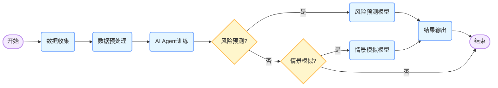

# AI Agent在企业风险预测与情景模拟中的应用

> 关键词：AI Agent、企业风险预测、情景模拟、人工智能、风险管理、机器学习、数据分析

> 摘要：本文聚焦于AI Agent在企业风险预测与情景模拟中的应用。首先介绍了相关背景，包括目的、预期读者等内容。接着阐述了AI Agent、企业风险预测和情景模拟的核心概念及其联系，通过文本示意图和Mermaid流程图展示架构。详细讲解了核心算法原理，并结合Python源代码进行说明。探讨了相关数学模型和公式，通过具体例子加深理解。进行项目实战，包括开发环境搭建、源代码实现与解读。分析了AI Agent在企业中的实际应用场景，推荐了学习资源、开发工具框架以及相关论文著作。最后总结了未来发展趋势与挑战，给出常见问题解答和扩展阅读参考资料，旨在为企业利用AI Agent进行风险预测与情景模拟提供全面、深入的技术指导。

## 1. 背景介绍 
### 1.1 目的和范围
在当今复杂多变的商业环境中，企业面临着各种各样的风险，如市场风险、信用风险、运营风险等。准确地预测这些风险并进行有效的情景模拟，对于企业制定合理的战略决策、降低损失、提高竞争力具有至关重要的意义。本文章的目的在于深入探讨AI Agent在企业风险预测与情景模拟中的应用，涵盖从基本概念到实际应用的各个方面，包括核心算法原理、数学模型、项目实战等内容，旨在为企业管理者、技术人员等提供全面的技术指导和理论支持。

### 1.2 预期读者
本文的预期读者包括企业管理人员，他们可以通过了解AI Agent在风险预测与情景模拟中的应用，更好地制定企业战略和决策；数据科学家和分析师，他们可以从算法原理、数学模型等技术层面深入学习和研究；软件开发人员，他们可以参考项目实战部分进行相关系统的开发；以及对人工智能和企业风险管理感兴趣的研究人员和学生等。

### 1.3 文档结构概述
本文将按照以下结构展开：首先介绍相关背景知识，包括目的、读者、文档结构和术语表；接着阐述AI Agent、企业风险预测和情景模拟的核心概念及其联系，并通过流程图展示架构；详细讲解核心算法原理，结合Python源代码进行说明；探讨相关数学模型和公式，并举例说明；进行项目实战，包括开发环境搭建、源代码实现与解读；分析AI Agent在企业中的实际应用场景；推荐学习资源、开发工具框架以及相关论文著作；最后总结未来发展趋势与挑战，给出常见问题解答和扩展阅读参考资料。

### 1.4 术语表
#### 1.4.1 核心术语定义
- **AI Agent（人工智能代理）**：是一种能够感知环境、进行决策并采取行动以实现特定目标的智能实体。它可以通过学习和推理来适应不同的环境和任务。
- **企业风险预测**：是指运用各种方法和技术，对企业在未来可能面临的风险进行识别、评估和预测的过程。
- **情景模拟**：是指通过构建不同的情景，模拟企业在各种可能情况下的运营和发展，以评估企业的风险承受能力和应对策略的有效性。

#### 1.4.2 相关概念解释
- **机器学习**：是一门多领域交叉学科，涉及概率论、统计学、逼近论、凸分析、算法复杂度理论等多门学科。它专门研究计算机怎样模拟或实现人类的学习行为，以获取新的知识或技能，重新组织已有的知识结构使之不断改善自身的性能。
- **数据分析**：是指用适当的统计分析方法对收集来的大量数据进行分析，提取有用信息和形成结论而对数据加以详细研究和概括总结的过程。

#### 1.4.3 缩略词列表
- **AI**：Artificial Intelligence（人工智能）
- **ML**：Machine Learning（机器学习）
- **DL**：Deep Learning（深度学习）

## 2. 核心概念与联系 

### 核心概念原理
#### AI Agent
AI Agent是人工智能领域的一个重要概念，它基于感知、决策和行动的循环来实现智能行为。AI Agent通过传感器感知环境信息，然后利用内部的决策机制对这些信息进行处理和分析，最后根据决策结果采取相应的行动。AI Agent可以分为反应式Agent、基于模型的Agent、基于目标的Agent和基于效用的Agent等不同类型。

#### 企业风险预测
企业风险预测是企业风险管理的重要环节。它通过收集和分析企业内部和外部的各种数据，如市场数据、财务数据、运营数据等，运用各种预测模型和方法，对企业未来可能面临的风险进行识别、评估和预测。常见的风险预测方法包括统计分析方法、机器学习方法、专家系统等。

#### 情景模拟
情景模拟是一种通过构建不同情景来评估企业风险和决策效果的方法。它基于一定的假设和前提，构建出各种可能的情景，然后模拟企业在这些情景下的运营和发展，分析企业的风险承受能力和应对策略的有效性。情景模拟可以帮助企业管理者更好地理解企业面临的风险和不确定性，制定更加合理的战略决策。

### 架构的文本示意图
AI Agent在企业风险预测与情景模拟中的应用架构主要包括数据层、模型层和应用层。数据层负责收集和存储企业内部和外部的各种数据，如市场数据、财务数据、运营数据等。模型层基于数据层提供的数据，运用各种机器学习和深度学习模型进行风险预测和情景模拟。应用层将模型层的结果展示给企业管理者和决策者，帮助他们进行决策和制定策略。

### Mermaid流程图


## 3. 核心算法原理 & 具体操作步骤 

### 核心算法原理
在企业风险预测与情景模拟中，常用的AI Agent算法包括强化学习算法、深度学习算法等。这里以强化学习算法中的Q - learning算法为例进行讲解。

Q - learning算法是一种无模型的强化学习算法，它通过学习一个动作价值函数Q(s, a)来实现最优策略的学习。Q(s, a)表示在状态s下采取动作a的期望累积奖励。Q - learning算法的核心思想是通过不断地更新Q值，使得智能体能够在不同的状态下选择最优的动作。

### 具体操作步骤
1. **初始化Q表**：创建一个Q表，用于存储每个状态和动作对应的Q值。
2. **选择动作**：在每个时间步，智能体根据当前状态s，使用某种策略（如ε - greedy策略）选择一个动作a。
3. **执行动作**：智能体执行选择的动作a，环境会返回一个新的状态s'和一个奖励r。
4. **更新Q值**：根据Q - learning算法的更新公式更新Q(s, a)的值。
5. **重复步骤2 - 4**：直到达到终止条件。

### Python源代码实现
```python
import numpy as np

# 定义环境参数
num_states = 10
num_actions = 4
gamma = 0.9  # 折扣因子
alpha = 0.1  # 学习率
epsilon = 0.1  # ε - greedy策略的ε值

# 初始化Q表
Q = np.zeros((num_states, num_actions))

# 定义ε - greedy策略
def epsilon_greedy(state, Q, epsilon, num_actions):
    if np.random.uniform(0, 1) < epsilon:
        action = np.random.choice(num_actions)
    else:
        action = np.argmax(Q[state, :])
    return action

# Q - learning算法
def q_learning(Q, num_episodes, gamma, alpha, epsilon, num_states, num_actions):
    for episode in range(num_episodes):
        state = np.random.randint(0, num_states)  # 随机初始化状态
        done = False
        while not done:
            action = epsilon_greedy(state, Q, epsilon, num_actions)
            # 模拟环境反馈
            next_state = np.random.randint(0, num_states)
            reward = np.random.randint(-1, 2)
            # 更新Q值
            Q[state, action] = Q[state, action] + alpha * (reward + gamma * np.max(Q[next_state, :]) - Q[state, action])
            state = next_state
            # 终止条件判断
            if np.random.uniform(0, 1) < 0.1:
                done = True
    return Q

# 训练Q表
Q = q_learning(Q, 1000, gamma, alpha, epsilon, num_states, num_actions)
print("训练后的Q表：")
print(Q)
```

## 4. 数学模型和公式 & 详细讲解 & 举例说明 

### 数学模型和公式
#### Q - learning算法的更新公式
Q - learning算法的更新公式为：
$$Q(s, a) \leftarrow Q(s, a) + \alpha [r + \gamma \max_{a'} Q(s', a') - Q(s, a)]$$
其中：
- $Q(s, a)$ 表示在状态 $s$ 下采取动作 $a$ 的Q值。
- $\alpha$ 是学习率，控制每次更新的步长。
- $r$ 是执行动作 $a$ 后获得的即时奖励。
- $\gamma$ 是折扣因子，用于衡量未来奖励的重要性。
- $s'$ 是执行动作 $a$ 后转移到的新状态。
- $\max_{a'} Q(s', a')$ 表示在新状态 $s'$ 下所有可能动作的最大Q值。

### 详细讲解
Q - learning算法的更新公式基于贝尔曼方程。贝尔曼方程描述了最优动作价值函数的递归性质，即当前状态的最优Q值等于即时奖励加上未来最优Q值的折扣和。Q - learning算法通过不断地更新Q值，使得智能体能够逐步逼近最优策略。

学习率 $\alpha$ 控制了每次更新的步长。如果 $\alpha$ 太大，智能体可能会过于激进地更新Q值，导致不稳定的学习；如果 $\alpha$ 太小，智能体的学习速度会很慢。折扣因子 $\gamma$ 用于衡量未来奖励的重要性。如果 $\gamma$ 接近1，智能体更注重未来的长期奖励；如果 $\gamma$ 接近0，智能体更注重即时奖励。

### 举例说明
假设智能体处于状态 $s = 1$，选择动作 $a = 2$，执行动作后获得即时奖励 $r = 1$，转移到新状态 $s' = 3$。当前的Q值 $Q(1, 2) = 0.5$，在新状态 $s' = 3$ 下所有可能动作的最大Q值 $\max_{a'} Q(3, a') = 0.8$，学习率 $\alpha = 0.1$，折扣因子 $\gamma = 0.9$。

根据Q - learning算法的更新公式：
$$Q(1, 2) \leftarrow 0.5 + 0.1 \times [1 + 0.9 \times 0.8 - 0.5]$$
$$Q(1, 2) \leftarrow 0.5 + 0.1 \times [1 + 0.72 - 0.5]$$
$$Q(1, 2) \leftarrow 0.5 + 0.1 \times 1.22$$
$$Q(1, 2) \leftarrow 0.5 + 0.122$$
$$Q(1, 2) \leftarrow 0.622$$

更新后的Q值 $Q(1, 2) = 0.622$。

## 5. 项目实战：代码实际案例和详细解释说明 

### 5.1  开发环境搭建
#### 操作系统
可以选择Windows、Linux或macOS等主流操作系统。这里以Ubuntu 20.04为例进行说明。

#### 编程语言
使用Python 3.8及以上版本。可以通过以下命令安装Python：
```bash
sudo apt update
sudo apt install python3.8
```

#### 依赖库安装
安装项目所需的依赖库，如NumPy、Pandas、Scikit - learn等。可以使用以下命令进行安装：
```bash
pip install numpy pandas scikit-learn
```

### 5.2  源代码详细实现和代码解读
#### 数据准备
假设我们有一个企业风险数据集，包含多个特征和一个风险标签。首先，我们需要读取数据并进行预处理。
```python
import pandas as pd
from sklearn.preprocessing import StandardScaler
from sklearn.model_selection import train_test_split

# 读取数据
data = pd.read_csv('risk_data.csv')

# 分离特征和标签
X = data.drop('risk_label', axis = 1)
y = data['risk_label']

# 数据标准化
scaler = StandardScaler()
X_scaled = scaler.fit_transform(X)

# 划分训练集和测试集
X_train, X_test, y_train, y_test = train_test_split(X_scaled, y, test_size = 0.2, random_state = 42)
```

#### 模型训练
使用一个简单的逻辑回归模型进行风险预测。
```python
from sklearn.linear_model import LogisticRegression

# 创建逻辑回归模型
model = LogisticRegression()

# 训练模型
model.fit(X_train, y_train)
```

#### 模型评估
使用测试集对模型进行评估。
```python
from sklearn.metrics import accuracy_score, classification_report

# 预测
y_pred = model.predict(X_test)

# 计算准确率
accuracy = accuracy_score(y_test, y_pred)
print(f"模型准确率: {accuracy}")

# 打印分类报告
print(classification_report(y_test, y_pred))
```

### 5.3  代码解读与分析
#### 数据准备部分
- `pd.read_csv('risk_data.csv')`：使用Pandas库读取CSV格式的风险数据集。
- `data.drop('risk_label', axis = 1)`：从数据集中删除风险标签列，得到特征矩阵 $X$。
- `data['risk_label']`：提取风险标签列，得到标签向量 $y$。
- `StandardScaler().fit_transform(X)`：使用StandardScaler对特征矩阵进行标准化处理，使得每个特征的均值为0，标准差为1。
- `train_test_split(X_scaled, y, test_size = 0.2, random_state = 42)`：将数据集划分为训练集和测试集，测试集占比为20%。

#### 模型训练部分
- `LogisticRegression()`：创建一个逻辑回归模型对象。
- `model.fit(X_train, y_train)`：使用训练集对逻辑回归模型进行训练。

#### 模型评估部分
- `model.predict(X_test)`：使用训练好的模型对测试集进行预测，得到预测标签 $y_{pred}$。
- `accuracy_score(y_test, y_pred)`：计算模型的准确率，即预测正确的样本数占总样本数的比例。
- `classification_report(y_test, y_pred)`：打印分类报告，包含精确率、召回率、F1值等评估指标。

## 6. 实际应用场景 
### 市场风险预测
企业在市场中面临着各种不确定性，如市场价格波动、需求变化等。AI Agent可以通过收集和分析市场数据，如股票价格、汇率、商品价格等，运用机器学习和深度学习模型进行市场风险预测。例如，预测股票价格的走势，帮助企业管理者做出合理的投资决策；预测商品价格的变化，帮助企业制定合理的采购和销售策略。

### 信用风险评估
信用风险是企业面临的重要风险之一。AI Agent可以通过分析客户的信用历史、财务状况、还款能力等信息，运用信用评分模型对客户的信用风险进行评估。例如，银行可以使用AI Agent评估借款人的信用风险，决定是否给予贷款以及贷款的额度和利率；企业可以使用AI Agent评估供应商的信用风险，决定是否与其合作以及合作的方式和条款。

### 运营风险预警
企业在运营过程中可能会面临各种风险，如生产故障、供应链中断、人员流失等。AI Agent可以通过实时监测企业的运营数据，如生产效率、库存水平、员工满意度等，运用异常检测模型对运营风险进行预警。例如，当生产效率突然下降或库存水平异常时，AI Agent可以及时发出警报，提醒企业管理者采取相应的措施，避免损失的扩大。

### 战略决策情景模拟
企业在制定战略决策时，需要考虑各种可能的情景和不确定性。AI Agent可以通过构建不同的情景模型，模拟企业在各种情景下的运营和发展，帮助企业管理者评估不同战略决策的效果和风险。例如，企业可以使用AI Agent模拟市场需求变化、竞争对手策略调整等情景，分析不同战略决策对企业业绩的影响，从而选择最优的战略方案。

## 7. 工具和资源推荐
### 7.1 学习资源推荐
#### 7.1.1 书籍推荐
- 《人工智能：一种现代的方法》：这是一本经典的人工智能教材，全面介绍了人工智能的基本概念、算法和应用。
- 《机器学习》：由周志华教授编写，系统地介绍了机器学习的基本理论和算法，是机器学习领域的经典教材。
- 《深度学习》：由Ian Goodfellow、Yoshua Bengio和Aaron Courville编写，是深度学习领域的权威著作，深入介绍了深度学习的原理、算法和应用。

#### 7.1.2 在线课程
- Coursera上的“Machine Learning”课程：由Andrew Ng教授授课，是机器学习领域的经典在线课程，适合初学者学习。
- edX上的“Deep Learning Specialization”课程：由深度学习领域的知名学者授课，系统地介绍了深度学习的理论和实践。
- 中国大学MOOC上的“人工智能基础”课程：由国内知名高校的教授授课，介绍了人工智能的基本概念、算法和应用。

#### 7.1.3 技术博客和网站
- Medium：是一个技术博客平台，上面有很多关于人工智能、机器学习和深度学习的优秀文章。
- Towards Data Science：是一个专注于数据科学和人工智能的博客网站，提供了大量的技术文章和案例分析。
- arXiv：是一个预印本数据库，上面有很多最新的人工智能和机器学习研究论文。

### 7.2 开发工具框架推荐
#### 7.2.1 IDE和编辑器
- PyCharm：是一款专门为Python开发设计的集成开发环境，具有强大的代码编辑、调试和自动完成功能。
- Jupyter Notebook：是一个交互式的开发环境，适合进行数据探索、模型训练和可视化。
- Visual Studio Code：是一款轻量级的代码编辑器，支持多种编程语言和插件，具有丰富的扩展功能。

#### 7.2.2 调试和性能分析工具
- TensorBoard：是TensorFlow的可视化工具，可以帮助用户可视化训练过程、模型结构和性能指标。
- PyTorch Profiler：是PyTorch的性能分析工具，可以帮助用户分析模型的性能瓶颈和内存使用情况。
- cProfile：是Python的内置性能分析工具，可以帮助用户分析Python代码的性能瓶颈。

#### 7.2.3 相关框架和库
- TensorFlow：是一个开源的机器学习框架，由Google开发，广泛应用于深度学习领域。
- PyTorch：是一个开源的深度学习框架，由Facebook开发，具有动态计算图和易于使用的特点。
- Scikit - learn：是一个开源的机器学习库，提供了丰富的机器学习算法和工具，适合初学者使用。

### 7.3 相关论文著作推荐
#### 7.3.1 经典论文
- “A Logical Calculus of the Ideas Immanent in Nervous Activity”：由Warren McCulloch和Walter Pitts发表，提出了神经元模型，是神经网络领域的经典论文。
- “Learning Representations by Back - Propagating Errors”：由David Rumelhart、Geoffrey Hinton和Ronald Williams发表，提出了反向传播算法，是深度学习领域的重要突破。
- “Playing Atari with Deep Reinforcement Learning”：由Volodymyr Mnih等人发表，提出了深度强化学习算法，在Atari游戏中取得了很好的效果。

#### 7.3.2 最新研究成果
- 关注顶级学术会议，如NeurIPS（神经信息处理系统大会）、ICML（国际机器学习会议）、CVPR（计算机视觉与模式识别会议）等，这些会议上会发表很多最新的人工智能和机器学习研究成果。
- 关注知名学术期刊，如Journal of Artificial Intelligence Research（JAIR）、Artificial Intelligence等，这些期刊上会发表很多高质量的研究论文。

#### 7.3.3 应用案例分析
- 《人工智能应用案例集》：收集了人工智能在各个领域的应用案例，包括医疗、金融、交通等，通过实际案例分析，帮助读者更好地理解人工智能的应用场景和价值。
- 各大企业的技术博客和研究报告，如Google AI Blog、Facebook AI Research等，会分享很多企业在人工智能领域的应用案例和研究成果。

## 8. 总结：未来发展趋势与挑战
### 未来发展趋势
#### 多模态融合
未来的AI Agent将更加注重多模态数据的融合，如文本、图像、语音等。通过融合多模态数据，AI Agent可以更全面地感知环境，提高风险预测和情景模拟的准确性和可靠性。

#### 强化学习与深度学习的结合
强化学习和深度学习的结合将成为未来AI Agent发展的重要方向。通过强化学习，AI Agent可以在复杂的环境中学习最优策略；通过深度学习，AI Agent可以处理高维的感知数据。两者的结合将使AI Agent在企业风险预测与情景模拟中发挥更大的作用。

#### 可解释性AI
随着AI Agent在企业决策中的应用越来越广泛，其可解释性变得越来越重要。未来的AI Agent将更加注重可解释性，能够向企业管理者和决策者解释其决策过程和依据，提高决策的可信度和透明度。

### 挑战
#### 数据质量和隐私问题
AI Agent的性能和效果很大程度上依赖于数据的质量和数量。然而，企业在收集和使用数据时可能会面临数据质量不高、数据缺失、数据隐私等问题。如何保证数据的质量和隐私，是AI Agent在企业风险预测与情景模拟中面临的重要挑战。

#### 模型复杂度和计算资源
随着AI Agent模型的不断发展和复杂化，模型的训练和推理需要大量的计算资源。如何在有限的计算资源下提高模型的性能和效率，是AI Agent面临的另一个挑战。

#### 伦理和法律问题
AI Agent的应用可能会带来一些伦理和法律问题，如算法歧视、责任认定等。如何制定相应的伦理和法律规范，确保AI Agent的合理应用，是需要解决的重要问题。

## 9. 附录：常见问题与解答
### 1. AI Agent在企业风险预测与情景模拟中的准确率如何保证？
要保证AI Agent在企业风险预测与情景模拟中的准确率，需要从多个方面入手。首先，要保证数据的质量，包括数据的准确性、完整性和一致性。其次，要选择合适的模型和算法，根据具体的应用场景和数据特点进行选择。此外，还需要进行模型的调优和评估，不断优化模型的性能。

### 2. AI Agent在企业中的应用是否会导致人员失业？
AI Agent在企业中的应用不会导致人员失业，而是会改变企业的工作方式和人员结构。AI Agent可以帮助企业提高效率、降低成本、提高决策的准确性，但它不能完全替代人类的工作。人类在创造力、情感理解、沟通等方面具有独特的优势，这些优势是AI Agent无法替代的。因此，企业需要对员工进行培训和转型，使他们能够与AI Agent协同工作，发挥各自的优势。

### 3. 如何选择适合企业的AI Agent开发工具和框架？
选择适合企业的AI Agent开发工具和框架需要考虑多个因素。首先，要考虑企业的技术栈和开发人员的技术水平，选择与现有技术栈兼容、开发人员熟悉的工具和框架。其次，要考虑工具和框架的功能和性能，选择能够满足企业需求、性能稳定的工具和框架。此外，还要考虑工具和框架的社区支持和文档资源，选择社区活跃、文档丰富的工具和框架。

## 10. 扩展阅读 & 参考资料
### 扩展阅读
- 《人工智能简史》：介绍了人工智能的发展历程和重要里程碑，帮助读者了解人工智能的发展脉络。
- 《数据科学实战》：通过实际案例介绍了数据科学的方法和技术，帮助读者将理论知识应用到实际项目中。
- 《智能时代》：探讨了人工智能对社会和经济的影响，以及人类如何应对智能时代的挑战。

### 参考资料
- 相关学术论文和研究报告，如IEEE Transactions on Neural Networks and Learning Systems、ACM Transactions on Intelligent Systems and Technology等。
- 各大企业的技术文档和白皮书，如Google AI、Microsoft AI等。
- 开源项目的官方文档和代码库，如TensorFlow、PyTorch等。