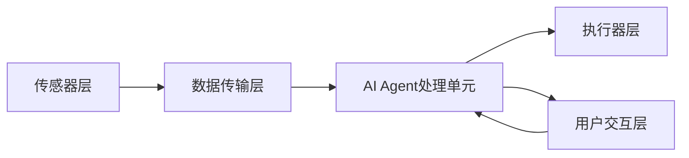

# AI Agent在智能书桌中的学习氛围营造

> 关键词：AI Agent、智能书桌、学习氛围营造、人工智能、环境感知、个性化服务

> 摘要：本文围绕AI Agent在智能书桌中的学习氛围营造展开深入探讨。详细介绍了AI Agent和智能书桌的核心概念及联系，阐述了相关核心算法原理与具体操作步骤，给出了数学模型和公式并举例说明。通过项目实战展示了代码实现及解读，分析了实际应用场景。同时推荐了学习、开发相关的工具和资源，最后总结了未来发展趋势与挑战，解答了常见问题并提供扩展阅读和参考资料，旨在为利用AI Agent优化智能书桌学习氛围提供全面且深入的技术指导和理论支持。

## 1. 背景介绍 
### 1.1 目的和范围
随着科技的飞速发展，人们对于学习环境的要求越来越高，智能书桌作为一种新兴的学习辅助设备，逐渐走进人们的生活。本文章的目的在于深入探讨如何利用AI Agent技术来营造智能书桌的学习氛围，提高学习效率和舒适度。范围涵盖了AI Agent和智能书桌的相关理论、技术实现、实际应用以及未来发展等方面。

### 1.2 预期读者
本文预期读者包括对人工智能、智能家居领域感兴趣的技术爱好者，从事相关领域研究和开发的科研人员、工程师，以及关注学习环境优化的教育工作者和学生家长等。

### 1.3 文档结构概述
本文首先介绍背景信息，包括目的、预期读者和文档结构概述等。接着阐述AI Agent和智能书桌的核心概念与联系，详细讲解核心算法原理和具体操作步骤，给出数学模型和公式并举例说明。然后通过项目实战展示代码实现和解读，分析实际应用场景。之后推荐相关的学习、开发工具和资源，最后总结未来发展趋势与挑战，解答常见问题并提供扩展阅读和参考资料。

### 1.4 术语表
#### 1.4.1 核心术语定义
- **AI Agent（人工智能代理）**：是一种能够感知环境、根据感知信息进行决策并采取行动的智能实体。它可以自主地或在人类的指导下完成特定的任务。
- **智能书桌**：是一种集成了多种传感器、执行器和智能控制模块的书桌，能够感知使用者的行为和环境信息，并根据这些信息提供相应的服务和支持。
- **学习氛围**：指的是在学习过程中，周围环境所营造出的一种能够影响学习者情绪、注意力和学习效果的氛围。

#### 1.4.2 相关概念解释
- **环境感知**：AI Agent通过各种传感器收集周围环境的信息，如光线强度、声音分贝、温度、湿度等。
- **个性化服务**：根据使用者的个人偏好和学习习惯，为其提供定制化的学习环境和服务。

#### 1.4.3 缩略词列表
- **AI**：Artificial Intelligence（人工智能）
- **IoT**：Internet of Things（物联网）

## 2. 核心概念与联系 

### 核心概念原理
AI Agent是一种基于人工智能技术的智能实体，它通过感知环境中的各种信息，运用内置的算法和模型进行分析和决策，然后采取相应的行动来实现特定的目标。在智能书桌的场景中，AI Agent可以通过安装在书桌上的传感器感知光线、声音、温度、湿度等环境信息，以及使用者的坐姿、学习状态等行为信息。

智能书桌则是一个集成了多种硬件设备和软件系统的智能终端。它不仅提供了基本的学习空间，还通过与AI Agent的结合，实现了对学习环境的智能调节和个性化服务。例如，当AI Agent感知到光线不足时，智能书桌可以自动调节灯光亮度；当检测到使用者长时间保持不良坐姿时，智能书桌可以发出提醒并调整桌面高度。

### 架构的文本示意图
智能书桌的架构主要包括以下几个部分：
1. **传感器层**：负责收集环境信息和使用者的行为信息，如光线传感器、声音传感器、压力传感器、摄像头等。
2. **数据传输层**：将传感器收集到的数据传输到AI Agent的处理单元，通常采用有线或无线通信技术，如Wi-Fi、蓝牙等。
3. **AI Agent处理单元**：对收集到的数据进行分析和处理，运用机器学习、深度学习等算法进行决策，并生成相应的控制指令。
4. **执行器层**：根据AI Agent的控制指令，执行相应的动作，如调节灯光、调整桌面高度、播放音乐等。
5. **用户交互层**：提供用户与智能书桌之间的交互界面，如触摸屏、语音交互设备等，方便用户设置个性化需求和获取相关信息。

### Mermaid流程图


## 3. 核心算法原理 & 具体操作步骤 

### 环境感知算法原理
环境感知是AI Agent在智能书桌中营造学习氛围的基础。以光线感知为例，我们可以使用光线传感器来获取当前环境的光线强度。以下是一个简单的Python代码示例：
```python
import RPi.GPIO as GPIO
import time

# 设置GPIO模式
GPIO.setmode(GPIO.BCM)

# 定义光线传感器引脚
LIGHT_SENSOR_PIN = 17

# 设置引脚为输入模式
GPIO.setup(LIGHT_SENSOR_PIN, GPIO.IN)

def read_light_intensity():
    try:
        while True:
            light_status = GPIO.input(LIGHT_SENSOR_PIN)
            if light_status == 1:
                print("光线充足")
            else:
                print("光线不足")
            time.sleep(1)
    except KeyboardInterrupt:
        print("程序终止")
    finally:
        GPIO.cleanup()

if __name__ == "__main__":
    read_light_intensity()
```
在上述代码中，我们使用了树莓派的GPIO接口来读取光线传感器的状态。如果传感器输出为1，则表示光线充足；如果输出为0，则表示光线不足。

### 个性化服务算法原理
个性化服务是根据使用者的个人偏好和学习习惯来提供定制化的学习环境和服务。例如，我们可以根据使用者的历史学习数据，使用机器学习算法来预测使用者的学习状态和需求。以下是一个简单的基于K近邻算法的个性化服务示例：
```python
import numpy as np
from sklearn.neighbors import KNeighborsClassifier

# 假设我们有一些历史学习数据
X_train = np.array([[1, 2], [2, 3], [3, 4], [4, 5]])
y_train = np.array([0, 0, 1, 1])

# 创建K近邻分类器
knn = KNeighborsClassifier(n_neighbors=3)

# 训练模型
knn.fit(X_train, y_train)

# 假设我们有一个新的学习数据
new_data = np.array([[3, 3]])

# 预测学习状态
prediction = knn.predict(new_data)
print("预测学习状态:", prediction)
```
在上述代码中，我们使用了Python的`sklearn`库中的`KNeighborsClassifier`类来实现K近邻算法。通过训练模型，我们可以根据新的学习数据预测使用者的学习状态。

### 具体操作步骤
1. **硬件安装**：将各种传感器和执行器安装在智能书桌的相应位置，并连接到数据传输模块。
2. **软件配置**：在AI Agent的处理单元上安装相应的操作系统和开发环境，配置好数据传输和通信协议。
3. **算法实现**：根据需求实现环境感知、个性化服务等算法，并将其集成到AI Agent的处理单元中。
4. **用户交互界面开发**：开发用户交互界面，如触摸屏应用程序或语音交互系统，方便用户设置个性化需求和获取相关信息。
5. **系统测试**：对整个智能书桌系统进行测试，确保各个模块正常工作，AI Agent能够准确感知环境信息并提供相应的服务。

## 4. 数学模型和公式 & 详细讲解 & 举例说明 

### 光线调节模型
在智能书桌中，光线调节是营造学习氛围的重要环节。我们可以使用线性回归模型来根据环境光线强度调节灯光亮度。线性回归模型的数学公式为：
$$y = \beta_0 + \beta_1x + \epsilon$$
其中，$y$ 表示灯光亮度，$x$ 表示环境光线强度，$\beta_0$ 和 $\beta_1$ 是模型的参数，$\epsilon$ 是误差项。

我们可以通过收集大量的环境光线强度和对应的灯光亮度数据，使用最小二乘法来估计模型的参数 $\beta_0$ 和 $\beta_1$。以下是一个简单的Python代码示例：
```python
import numpy as np
from sklearn.linear_model import LinearRegression

# 假设我们有一些环境光线强度和对应的灯光亮度数据
X = np.array([[100], [200], [300], [400]])
y = np.array([50, 100, 150, 200])

# 创建线性回归模型
model = LinearRegression()

# 训练模型
model.fit(X, y)

# 预测新的灯光亮度
new_light_intensity = np.array([[250]])
predicted_brightness = model.predict(new_light_intensity)
print("预测灯光亮度:", predicted_brightness)
```
在上述代码中，我们使用了Python的`sklearn`库中的`LinearRegression`类来实现线性回归模型。通过训练模型，我们可以根据新的环境光线强度预测对应的灯光亮度。

### 学习状态预测模型
为了实现个性化服务，我们可以使用机器学习算法来预测使用者的学习状态。以逻辑回归模型为例，逻辑回归模型的数学公式为：
$$P(y = 1|x) = \frac{1}{1 + e^{-(\beta_0 + \beta_1x_1 + \cdots + \beta_nx_n)}}$$
其中，$P(y = 1|x)$ 表示在给定特征 $x$ 的情况下，学习状态为1（例如专注）的概率，$\beta_0, \beta_1, \cdots, \beta_n$ 是模型的参数。

我们可以通过收集大量的学习数据和对应的学习状态标签，使用最大似然估计法来估计模型的参数。以下是一个简单的Python代码示例：
```python
import numpy as np
from sklearn.linear_model import LogisticRegression

# 假设我们有一些学习数据和对应的学习状态标签
X = np.array([[1, 2], [2, 3], [3, 4], [4, 5]])
y = np.array([0, 0, 1, 1])

# 创建逻辑回归模型
model = LogisticRegression()

# 训练模型
model.fit(X, y)

# 预测新的学习状态
new_data = np.array([[3, 3]])
predicted_status = model.predict(new_data)
print("预测学习状态:", predicted_status)
```
在上述代码中，我们使用了Python的`sklearn`库中的`LogisticRegression`类来实现逻辑回归模型。通过训练模型，我们可以根据新的学习数据预测使用者的学习状态。

## 5. 项目实战：代码实际案例和详细解释说明 

### 5.1  开发环境搭建
1. **硬件准备**：选择合适的智能书桌硬件平台，如树莓派、Arduino等。同时，准备好各种传感器和执行器，如光线传感器、声音传感器、电机等。
2. **软件安装**：在硬件平台上安装相应的操作系统，如Raspbian、Ubuntu等。安装Python开发环境和相关的库，如`RPi.GPIO`、`sklearn`等。

### 5.2  源代码详细实现和代码解读
以下是一个完整的智能书桌学习氛围营造系统的Python代码示例：
```python
import RPi.GPIO as GPIO
import time
from sklearn.linear_model import LinearRegression
from sklearn.neighbors import KNeighborsClassifier

# 设置GPIO模式
GPIO.setmode(GPIO.BCM)

# 定义光线传感器引脚
LIGHT_SENSOR_PIN = 17
# 定义灯光控制引脚
LIGHT_CONTROL_PIN = 18

# 设置引脚为输入和输出模式
GPIO.setup(LIGHT_SENSOR_PIN, GPIO.IN)
GPIO.setup(LIGHT_CONTROL_PIN, GPIO.OUT)

# 假设我们有一些环境光线强度和对应的灯光亮度数据
X_train_light = np.array([[100], [200], [300], [400]])
y_train_light = np.array([50, 100, 150, 200])

# 创建线性回归模型
light_model = LinearRegression()

# 训练模型
light_model.fit(X_train_light, y_train_light)

# 假设我们有一些历史学习数据
X_train_learning = np.array([[1, 2], [2, 3], [3, 4], [4, 5]])
y_train_learning = np.array([0, 0, 1, 1])

# 创建K近邻分类器
learning_model = KNeighborsClassifier(n_neighbors=3)

# 训练模型
learning_model.fit(X_train_learning, y_train_learning)

def read_light_intensity():
    return GPIO.input(LIGHT_SENSOR_PIN)

def adjust_light_brightness(light_intensity):
    predicted_brightness = light_model.predict([[light_intensity]])
    # 模拟控制灯光亮度
    if predicted_brightness > 0:
        GPIO.output(LIGHT_CONTROL_PIN, GPIO.HIGH)
    else:
        GPIO.output(LIGHT_CONTROL_PIN, GPIO.LOW)

def predict_learning_status(learning_data):
    return learning_model.predict([learning_data])

try:
    while True:
        light_intensity = read_light_intensity()
        adjust_light_brightness(light_intensity)

        # 模拟学习数据
        learning_data = [3, 3]
        learning_status = predict_learning_status(learning_data)
        print("预测学习状态:", learning_status)

        time.sleep(1)
except KeyboardInterrupt:
    print("程序终止")
finally:
    GPIO.cleanup()
```
### 5.3  代码解读与分析
1. **环境感知**：通过`read_light_intensity`函数读取光线传感器的状态，获取当前环境的光线强度。
2. **光线调节**：使用线性回归模型`light_model`根据环境光线强度预测灯光亮度，并通过`adjust_light_brightness`函数模拟控制灯光亮度。
3. **学习状态预测**：使用K近邻分类器`learning_model`根据学习数据预测使用者的学习状态，并通过`predict_learning_status`函数返回预测结果。
4. **主循环**：在主循环中，不断读取环境光线强度，调节灯光亮度，并预测学习状态，实现智能书桌的学习氛围营造功能。

## 6. 实际应用场景 
### 家庭学习场景
在家庭学习场景中，智能书桌可以根据孩子的学习习惯和环境信息，自动调节灯光亮度、播放舒缓的背景音乐，营造一个舒适的学习氛围。例如，当孩子在晚上学习时，智能书桌可以根据环境光线强度自动调节灯光亮度，避免眼睛疲劳；当孩子长时间学习感到疲劳时，智能书桌可以播放一些轻松的音乐，帮助孩子放松身心。

### 学校学习场景
在学校学习场景中，智能书桌可以为学生提供个性化的学习支持。例如，根据学生的学习进度和状态，智能书桌可以推荐相关的学习资料和练习题；当学生坐姿不正确时，智能书桌可以及时发出提醒，帮助学生养成良好的学习习惯。

### 办公学习场景
在办公学习场景中，智能书桌可以提高员工的工作效率和舒适度。例如，根据员工的工作状态和环境信息，智能书桌可以自动调节桌面高度、调整空调温度，为员工提供一个舒适的工作环境。

## 7. 工具和资源推荐
### 7.1 学习资源推荐
#### 7.1.1 书籍推荐
- 《人工智能：一种现代的方法》：全面介绍了人工智能的基本概念、算法和应用，是人工智能领域的经典教材。
- 《Python机器学习》：详细介绍了Python在机器学习领域的应用，包括各种机器学习算法的实现和案例分析。
- 《传感器技术与应用》：介绍了各种传感器的工作原理、应用场景和使用方法，对于智能书桌的开发具有重要的参考价值。

#### 7.1.2 在线课程
- Coursera上的“机器学习”课程：由斯坦福大学的Andrew Ng教授授课，是学习机器学习的经典课程。
- edX上的“人工智能基础”课程：介绍了人工智能的基本概念、算法和应用，适合初学者学习。
- 中国大学MOOC上的“传感器原理与应用”课程：详细介绍了各种传感器的工作原理和应用，对于智能书桌的开发具有重要的指导意义。

#### 7.1.3 技术博客和网站
- Medium：是一个技术博客平台，上面有很多关于人工智能、智能家居等领域的优秀文章。
- GitHub：是一个开源代码托管平台，上面有很多关于智能书桌、人工智能等领域的开源项目，可以参考学习。
- 知乎：是一个知识问答社区，上面有很多关于人工智能、智能家居等领域的讨论和分享，可以获取最新的技术动态和经验。

### 7.2 开发工具框架推荐
#### 7.2.1 IDE和编辑器
- PyCharm：是一款专业的Python集成开发环境，具有代码编辑、调试、版本控制等功能，适合Python开发。
- Visual Studio Code：是一款轻量级的代码编辑器，支持多种编程语言，具有丰富的插件和扩展功能，适合快速开发。
- Arduino IDE：是一款专门为Arduino开发的集成开发环境，具有简单易用的特点，适合硬件开发。

#### 7.2.2 调试和性能分析工具
- gdb：是一款强大的调试工具，支持多种编程语言，可以帮助开发者定位和解决代码中的问题。
- Profiler：是Python自带的性能分析工具，可以帮助开发者分析代码的性能瓶颈，优化代码。
- Logic Analyzer：是一款硬件调试工具，可以帮助开发者分析硬件电路的信号和时序，解决硬件问题。

#### 7.2.3 相关框架和库
- TensorFlow：是一个开源的机器学习框架，提供了丰富的机器学习算法和工具，适合开发人工智能应用。
- PyTorch：是一个开源的深度学习框架，具有简洁易用的特点，适合快速开发深度学习模型。
- RPi.GPIO：是一个Python库，用于控制树莓派的GPIO接口，适合智能书桌的硬件开发。

### 7.3 相关论文著作推荐
#### 7.3.1 经典论文
- “A Logical Calculus of the Ideas Immanent in Nervous Activity”：由Warren S. McCulloch和Walter Pitts发表，是人工智能领域的经典论文，提出了神经元模型。
- “Learning Representations by Back-propagating Errors”：由David E. Rumelhart、Geoffrey E. Hinton和Ronald J. Williams发表，是深度学习领域的经典论文，提出了反向传播算法。
- “A Unified Approach to Interpreting Model Predictions”：由Scott Lundberg和Su-In Lee发表，提出了SHAP值的概念，用于解释机器学习模型的预测结果。

#### 7.3.2 最新研究成果
- 关注顶级学术会议如NeurIPS、ICML、CVPR等的最新研究成果，了解人工智能领域的最新技术和发展趋势。
- 关注知名学术期刊如Journal of Artificial Intelligence Research、Artificial Intelligence等的最新论文，获取人工智能领域的前沿研究。

#### 7.3.3 应用案例分析
- 分析国内外智能书桌、智能家居等领域的成功应用案例，了解实际应用中的技术方案和实现细节。
- 参考相关企业的技术博客和白皮书，获取企业在人工智能应用方面的经验和实践。

## 8. 总结：未来发展趋势与挑战
### 未来发展趋势
1. **智能化程度不断提高**：随着人工智能技术的不断发展，AI Agent在智能书桌中的应用将越来越深入，智能书桌将能够更加准确地感知环境信息和使用者的需求，提供更加个性化、智能化的服务。
2. **与其他智能设备的融合**：智能书桌将与其他智能设备如智能音箱、智能灯具、智能窗帘等进行深度融合，形成一个智能学习生态系统，为使用者提供更加便捷、舒适的学习环境。
3. **教育功能的拓展**：智能书桌将不仅仅是一个学习辅助设备，还将成为一个教育平台，提供在线学习、智能辅导、学习评估等功能，帮助学生提高学习成绩。

### 挑战
1. **数据隐私和安全问题**：智能书桌在收集和处理使用者的个人信息和学习数据时，需要保证数据的隐私和安全，防止数据泄露和滥用。
2. **技术标准和规范的缺失**：目前智能书桌领域缺乏统一的技术标准和规范，导致不同品牌和型号的智能书桌之间兼容性差，影响了用户体验。
3. **用户接受度问题**：一些用户可能对智能书桌的功能和使用方法不熟悉，需要加强宣传和培训，提高用户的接受度和使用意愿。

## 9. 附录：常见问题与解答
### 智能书桌的传感器精度如何保证？
可以通过选择高质量的传感器、定期校准传感器、优化传感器的安装位置等方法来保证传感器的精度。

### 智能书桌的AI Agent如何进行升级和优化？
可以通过软件升级的方式对AI Agent进行升级和优化，例如更新算法模型、修复漏洞、添加新功能等。

### 智能书桌的功耗如何控制？
可以通过优化硬件设计、采用低功耗的芯片和传感器、合理设置设备的工作模式等方法来控制智能书桌的功耗。

## 10. 扩展阅读 & 参考资料
### 扩展阅读
- 《智能家居：原理、应用与发展》：深入介绍了智能家居的原理、技术和应用，对于理解智能书桌的发展趋势具有重要的参考价值。
- 《人工智能时代的教育变革》：探讨了人工智能技术对教育领域的影响和变革，为智能书桌的教育功能拓展提供了思路。

### 参考资料
- [1] 李开复. 人工智能[M]. 文化发展出版社, 2017.
- [2] 周志华. 机器学习[M]. 清华大学出版社, 2016.
- [3] 谢希仁. 计算机网络（第5版）[M]. 电子工业出版社, 2012.