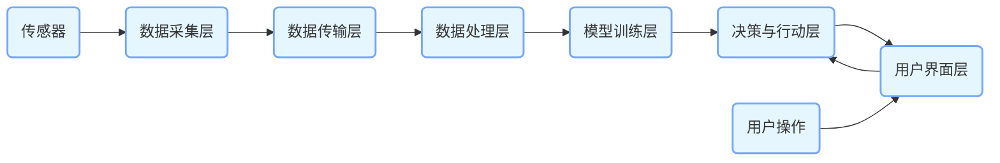

# AI Agent在智能农业产量预测中的实践

> 关键词：AI Agent、智能农业、产量预测、机器学习、数据分析、农业模型、传感器技术

> 摘要：本文聚焦于AI Agent在智能农业产量预测中的实践应用。首先介绍了相关背景知识，包括目的、预期读者等内容。接着阐述了AI Agent及智能农业产量预测的核心概念与联系，通过文本示意图和Mermaid流程图进行清晰展示。详细讲解了核心算法原理，并给出Python源代码示例。探讨了相关的数学模型和公式，结合具体例子进行说明。通过项目实战，展示了开发环境搭建、源代码实现与解读。分析了AI Agent在智能农业产量预测中的实际应用场景，推荐了相关的工具和资源。最后总结了未来发展趋势与挑战，提供了常见问题解答和扩展阅读参考资料，旨在为智能农业产量预测领域的研究和实践提供全面且深入的参考。

## 1. 背景介绍 
### 1.1 目的和范围
随着全球人口的不断增长，对粮食的需求也日益增加。农业作为粮食的主要来源，其产量的稳定和提高至关重要。智能农业的兴起为提高农业生产效率和产量提供了新的途径。AI Agent作为一种智能实体，能够感知环境、做出决策并采取行动，将其应用于智能农业产量预测中，可以充分利用农业生产过程中的各种数据，提高产量预测的准确性，为农业生产决策提供科学依据。

本文的范围涵盖了AI Agent在智能农业产量预测中的基本概念、算法原理、数学模型、项目实践、应用场景等方面，旨在全面介绍AI Agent在该领域的应用实践，为相关研究和实践人员提供参考。

### 1.2 预期读者
本文的预期读者包括从事智能农业、机器学习、数据分析等领域的研究人员和工程师，农业生产管理人员，以及对智能农业产量预测感兴趣的爱好者。

### 1.3 文档结构概述
本文首先介绍了AI Agent在智能农业产量预测中的背景信息，包括目的、预期读者和文档结构概述等。接着阐述了核心概念与联系，通过文本示意图和Mermaid流程图展示AI Agent与智能农业产量预测的关系。然后详细讲解了核心算法原理，并给出Python源代码示例。探讨了相关的数学模型和公式，结合具体例子进行说明。通过项目实战，展示了开发环境搭建、源代码实现与解读。分析了AI Agent在智能农业产量预测中的实际应用场景，推荐了相关的工具和资源。最后总结了未来发展趋势与挑战，提供了常见问题解答和扩展阅读参考资料。

### 1.4 术语表
#### 1.4.1 核心术语定义
- **AI Agent（人工智能代理）**：是一种能够感知环境、根据感知信息做出决策并采取行动的智能实体。在智能农业产量预测中，AI Agent可以感知农业生产环境中的各种数据，如气象数据、土壤数据等，并根据这些数据进行产量预测和决策。
- **智能农业**：是将现代信息技术与农业生产、经营、管理和服务等环节深度融合的新型农业发展模式。它利用传感器、物联网、大数据、人工智能等技术，实现农业生产的精准化、智能化和高效化。
- **产量预测**：是指根据农业生产过程中的各种因素，如气象条件、土壤质量、种植品种等，对农作物的产量进行预先估计的过程。

#### 1.4.2 相关概念解释
- **机器学习**：是一门多领域交叉学科，涉及概率论、统计学、逼近论、凸分析、算法复杂度理论等多门学科。它专门研究计算机怎样模拟或实现人类的学习行为，以获取新的知识或技能，重新组织已有的知识结构使之不断改善自身的性能。在智能农业产量预测中，机器学习算法可以用于分析农业生产数据，建立产量预测模型。
- **数据分析**：是指用适当的统计分析方法对收集来的大量数据进行分析，提取有用信息和形成结论而对数据加以详细研究和概括总结的过程。在智能农业产量预测中，数据分析可以帮助我们理解农业生产数据的特征和规律，为产量预测提供依据。
- **传感器技术**：是指能感受规定的被测量并按照一定的规律转换成可用信号的器件或装置。在智能农业中，传感器可以用于实时监测农业生产环境中的各种数据，如温度、湿度、光照强度等，为AI Agent提供感知信息。

#### 1.4.3 缩略词列表
- **AI**：Artificial Intelligence（人工智能）
- **ML**：Machine Learning（机器学习）
- **IoT**：Internet of Things（物联网）

## 2. 核心概念与联系 

### 核心概念原理
AI Agent在智能农业产量预测中的核心原理是通过感知农业生产环境中的各种数据，利用机器学习等技术对这些数据进行分析和处理，建立产量预测模型，从而实现对农作物产量的准确预测。

AI Agent通常由感知模块、决策模块和行动模块组成。感知模块负责收集农业生产环境中的各种数据，如气象数据、土壤数据、作物生长数据等。决策模块利用机器学习算法对感知模块收集的数据进行分析和处理，建立产量预测模型，并根据模型的预测结果做出决策。行动模块根据决策模块的决策结果采取相应的行动，如调整灌溉量、施肥量等，以提高农作物的产量和质量。

### 架构的文本示意图
AI Agent在智能农业产量预测中的架构可以分为以下几个层次：
1. **数据采集层**：通过各种传感器收集农业生产环境中的各种数据，如气象数据、土壤数据、作物生长数据等。
2. **数据传输层**：将数据采集层收集的数据传输到数据处理中心。
3. **数据处理层**：对数据传输层传输的数据进行清洗、预处理和特征提取等操作，为机器学习算法提供高质量的数据。
4. **模型训练层**：利用机器学习算法对数据处理层处理后的数据进行训练，建立产量预测模型。
5. **决策与行动层**：根据模型训练层建立的产量预测模型，做出决策并采取相应的行动，如调整灌溉量、施肥量等。
6. **用户界面层**：为用户提供交互界面，使用户可以查看产量预测结果、管理农业生产过程等。

### Mermaid流程图


## 3. 核心算法原理 & 具体操作步骤 

### 核心算法原理
在智能农业产量预测中，常用的机器学习算法包括线性回归、决策树、随机森林、支持向量机等。下面以线性回归算法为例，详细讲解其原理。

线性回归是一种用于建立自变量和因变量之间线性关系的统计模型。在智能农业产量预测中，自变量可以是气象数据、土壤数据、作物生长数据等，因变量是农作物的产量。线性回归模型的一般形式为：

$$y = \beta_0 + \beta_1x_1 + \beta_2x_2 + \cdots + \beta_nx_n + \epsilon$$

其中，$y$ 是因变量（农作物产量），$x_1, x_2, \cdots, x_n$ 是自变量（气象数据、土壤数据等），$\beta_0, \beta_1, \cdots, \beta_n$ 是模型的参数，$\epsilon$ 是误差项。

线性回归的目标是找到一组最优的参数 $\beta_0, \beta_1, \cdots, \beta_n$，使得模型的预测值与实际值之间的误差最小。常用的方法是最小二乘法，即最小化误差平方和：

$$S(\beta) = \sum_{i=1}^{m}(y_i - \hat{y}_i)^2 = \sum_{i=1}^{m}(y_i - (\beta_0 + \beta_1x_{i1} + \beta_2x_{i2} + \cdots + \beta_nx_{in}))^2$$

其中，$m$ 是样本数量，$y_i$ 是第 $i$ 个样本的实际值，$\hat{y}_i$ 是第 $i$ 个样本的预测值。

### 具体操作步骤
1. **数据收集**：收集农业生产环境中的各种数据，如气象数据、土壤数据、作物生长数据等。
2. **数据预处理**：对收集到的数据进行清洗、缺失值处理、异常值处理、数据标准化等操作，以提高数据的质量。
3. **特征选择**：从预处理后的数据中选择与农作物产量相关性较高的特征，以减少模型的复杂度。
4. **模型训练**：使用线性回归算法对特征选择后的数据进行训练，得到线性回归模型。
5. **模型评估**：使用评估指标（如均方误差、均方根误差、决定系数等）对训练好的模型进行评估，以评估模型的性能。
6. **模型预测**：使用训练好的模型对新的数据进行预测，得到农作物的产量预测值。

### Python源代码示例
```python
import numpy as np
from sklearn.linear_model import LinearRegression
from sklearn.model_selection import train_test_split
from sklearn.metrics import mean_squared_error, r2_score

# 生成示例数据
np.random.seed(0)
X = np.random.rand(100, 3)  # 自变量
y = 2 * X[:, 0] + 3 * X[:, 1] + 4 * X[:, 2] + np.random.randn(100)  # 因变量

# 划分训练集和测试集
X_train, X_test, y_train, y_test = train_test_split(X, y, test_size=0.2, random_state=0)

# 创建线性回归模型
model = LinearRegression()

# 模型训练
model.fit(X_train, y_train)

# 模型预测
y_pred = model.predict(X_test)

# 模型评估
mse = mean_squared_error(y_test, y_pred)
r2 = r2_score(y_test, y_pred)

print(f"均方误差: {mse}")
print(f"决定系数: {r2}")
```

## 4. 数学模型和公式 & 详细讲解 & 举例说明 

### 数学模型和公式
#### 线性回归模型
线性回归模型的一般形式为：

$$y = \beta_0 + \beta_1x_1 + \beta_2x_2 + \cdots + \beta_nx_n + \epsilon$$

其中，$y$ 是因变量（农作物产量），$x_1, x_2, \cdots, x_n$ 是自变量（气象数据、土壤数据等），$\beta_0, \beta_1, \cdots, \beta_n$ 是模型的参数，$\epsilon$ 是误差项。

#### 最小二乘法
最小二乘法的目标是最小化误差平方和：

$$S(\beta) = \sum_{i=1}^{m}(y_i - \hat{y}_i)^2 = \sum_{i=1}^{m}(y_i - (\beta_0 + \beta_1x_{i1} + \beta_2x_{i2} + \cdots + \beta_nx_{in}))^2$$

其中，$m$ 是样本数量，$y_i$ 是第 $i$ 个样本的实际值，$\hat{y}_i$ 是第 $i$ 个样本的预测值。

#### 评估指标
- **均方误差（Mean Squared Error, MSE）**：

$$MSE = \frac{1}{m}\sum_{i=1}^{m}(y_i - \hat{y}_i)^2$$

- **均方根误差（Root Mean Squared Error, RMSE）**：

$$RMSE = \sqrt{\frac{1}{m}\sum_{i=1}^{m}(y_i - \hat{y}_i)^2}$$

- **决定系数（Coefficient of Determination, $R^2$）**：

$$R^2 = 1 - \frac{\sum_{i=1}^{m}(y_i - \hat{y}_i)^2}{\sum_{i=1}^{m}(y_i - \bar{y})^2}$$

其中，$\bar{y}$ 是因变量的均值。

### 详细讲解
- **线性回归模型**：线性回归模型假设自变量和因变量之间存在线性关系，通过找到一组最优的参数 $\beta_0, \beta_1, \cdots, \beta_n$，可以建立自变量和因变量之间的线性关系，从而实现对因变量的预测。
- **最小二乘法**：最小二乘法是一种常用的求解线性回归模型参数的方法，它通过最小化误差平方和来找到最优的参数。误差平方和越小，说明模型的预测值与实际值之间的误差越小，模型的性能越好。
- **评估指标**：均方误差和均方根误差衡量了模型预测值与实际值之间的平均误差，误差越小，说明模型的性能越好。决定系数衡量了模型对数据的拟合程度，$R^2$ 值越接近 1，说明模型对数据的拟合程度越好。

### 举例说明
假设我们有以下一组数据：

| 温度（$x_1$） | 湿度（$x_2$） | 光照强度（$x_3$） | 产量（$y$） |
| --- | --- | --- | --- |
| 20 | 60 | 1000 | 50 |
| 22 | 65 | 1200 | 55 |
| 24 | 70 | 1400 | 60 |
| 26 | 75 | 1600 | 65 |
| 28 | 80 | 1800 | 70 |

我们可以使用线性回归模型来建立温度、湿度、光照强度与产量之间的关系。

首先，我们将数据表示为矩阵形式：

$$X = \begin{bmatrix}
1 & 20 & 60 & 1000 \\
1 & 22 & 65 & 1200 \\
1 & 24 & 70 & 1400 \\
1 & 26 & 75 & 1600 \\
1 & 28 & 80 & 1800
\end{bmatrix}$$

$$y = \begin{bmatrix}
50 \\
55 \\
60 \\
65 \\
70
\end{bmatrix}$$

然后，我们使用最小二乘法求解线性回归模型的参数 $\beta$：

$$\beta = (X^TX)^{-1}X^Ty$$

最后，我们可以得到线性回归模型：

$$y = \beta_0 + \beta_1x_1 + \beta_2x_2 + \beta_3x_3$$

通过这个模型，我们可以对新的温度、湿度、光照强度数据进行产量预测。

## 5. 项目实战：代码实际案例和详细解释说明 

### 5.1  开发环境搭建
#### 操作系统
本项目可以在 Windows、Linux 或 macOS 操作系统上进行开发。

#### 编程语言
本项目使用 Python 编程语言进行开发，建议使用 Python 3.6 及以上版本。

#### 开发工具
可以使用 PyCharm、Jupyter Notebook 等开发工具进行代码的编写和调试。

#### 安装依赖库
在命令行中使用以下命令安装所需的依赖库：

```sh
pip install numpy pandas scikit-learn matplotlib
```

### 5.2  源代码详细实现和代码解读
以下是一个完整的智能农业产量预测项目的源代码示例：

```python
import numpy as np
import pandas as pd
from sklearn.linear_model import LinearRegression
from sklearn.model_selection import train_test_split
from sklearn.metrics import mean_squared_error, r2_score
import matplotlib.pyplot as plt

# 加载数据
data = pd.read_csv('agriculture_data.csv')

# 提取特征和标签
X = data.drop('yield', axis=1).values
y = data['yield'].values

# 划分训练集和测试集
X_train, X_test, y_train, y_test = train_test_split(X, y, test_size=0.2, random_state=0)

# 创建线性回归模型
model = LinearRegression()

# 模型训练
model.fit(X_train, y_train)

# 模型预测
y_pred = model.predict(X_test)

# 模型评估
mse = mean_squared_error(y_test, y_pred)
rmse = np.sqrt(mse)
r2 = r2_score(y_test, y_pred)

print(f"均方误差: {mse}")
print(f"均方根误差: {rmse}")
print(f"决定系数: {r2}")

# 可视化预测结果
plt.scatter(y_test, y_pred)
plt.xlabel('实际产量')
plt.ylabel('预测产量')
plt.title('实际产量 vs 预测产量')
plt.show()
```

### 代码解读与分析
1. **数据加载**：使用 `pandas` 库的 `read_csv` 函数加载农业生产数据。
2. **特征和标签提取**：使用 `drop` 方法从数据中提取特征（除了产量列），并使用 `values` 属性将其转换为 numpy 数组。同时，提取产量列作为标签。
3. **数据集划分**：使用 `train_test_split` 函数将数据集划分为训练集和测试集，测试集占总数据集的 20%。
4. **模型创建**：使用 `LinearRegression` 类创建线性回归模型。
5. **模型训练**：使用 `fit` 方法对模型进行训练，传入训练集的特征和标签。
6. **模型预测**：使用 `predict` 方法对测试集的特征进行预测，得到预测结果。
7. **模型评估**：使用 `mean_squared_error` 函数计算均方误差，使用 `np.sqrt` 函数计算均方根误差，使用 `r2_score` 函数计算决定系数。
8. **可视化**：使用 `matplotlib` 库的 `scatter` 函数绘制实际产量和预测产量的散点图，直观展示模型的预测效果。

## 6. 实际应用场景 
### 精准农业生产管理
AI Agent可以实时感知农业生产环境中的各种数据，如气象数据、土壤数据、作物生长数据等，并根据这些数据进行产量预测。根据预测结果，AI Agent可以自动调整灌溉量、施肥量、农药使用量等，实现精准农业生产管理，提高农作物的产量和质量。

### 农业保险理赔
保险公司可以使用AI Agent对农作物的产量进行预测，根据预测结果制定保险费率和理赔方案。当农作物因自然灾害等原因减产时，保险公司可以根据AI Agent的预测结果快速、准确地进行理赔，降低保险理赔的成本和风险。

### 农产品市场预测
AI Agent可以对农作物的产量进行预测，根据预测结果对农产品市场的供需情况进行分析和预测。农业生产企业和农产品经销商可以根据AI Agent的预测结果合理安排生产和销售计划，降低市场风险，提高经济效益。

### 农业政策制定
政府部门可以使用AI Agent对农作物的产量进行预测，根据预测结果制定农业政策，如农业补贴政策、粮食储备政策等。合理的农业政策可以促进农业生产的稳定发展，保障国家的粮食安全。

## 7. 工具和资源推荐
### 7.1 学习资源推荐
#### 7.1.1 书籍推荐
- 《机器学习》（周志华著）：全面介绍了机器学习的基本概念、算法和应用，是机器学习领域的经典教材。
- 《Python机器学习实战》（Sebastian Raschka著）：通过实际案例介绍了Python在机器学习中的应用，适合初学者学习。
- 《智能农业：原理与实践》（[美] 罗伯特·E. 赫德森著）：全面介绍了智能农业的基本概念、技术和应用，是智能农业领域的权威著作。

#### 7.1.2 在线课程
- Coursera平台上的“机器学习”课程（Andrew Ng教授主讲）：是机器学习领域的经典在线课程，适合初学者学习。
- edX平台上的“人工智能基础”课程：介绍了人工智能的基本概念、算法和应用，是人工智能领域的入门课程。
- 中国大学MOOC平台上的“智能农业概论”课程：介绍了智能农业的基本概念、技术和应用，适合对智能农业感兴趣的学习者。

#### 7.1.3 技术博客和网站
- 机器学习算法全栈工程师：提供了丰富的机器学习算法和实践案例，是机器学习领域的优质技术博客。
- 机器之心：专注于人工智能领域的技术和应用，提供了最新的人工智能技术资讯和研究成果。
- 中国农业信息网：提供了丰富的农业信息和技术资源，是了解智能农业发展动态的重要网站。

### 7.2 开发工具框架推荐
#### 7.2.1 IDE和编辑器
- PyCharm：是一款专门为Python开发设计的集成开发环境，提供了丰富的功能和插件，适合Python开发。
- Jupyter Notebook：是一款基于Web的交互式笔记本，支持多种编程语言，适合数据科学和机器学习的开发和实验。
- Visual Studio Code：是一款轻量级的代码编辑器，支持多种编程语言，提供了丰富的插件和扩展，适合快速开发和调试。

#### 7.2.2 调试和性能分析工具
- PySnooper：是一款简单易用的Python调试工具，可以自动记录函数的执行过程和变量的值，方便调试。
- cProfile：是Python标准库中的性能分析工具，可以分析Python程序的性能瓶颈，帮助优化代码。
- Scikit-learn的GridSearchCV：是一个超参数调优工具，可以帮助我们找到最优的模型参数，提高模型的性能。

#### 7.2.3 相关框架和库
- Scikit-learn：是一个简单易用的Python机器学习库，提供了丰富的机器学习算法和工具，适合初学者和快速开发。
- TensorFlow：是一个开源的深度学习框架，提供了丰富的深度学习模型和工具，适合开发复杂的深度学习应用。
- PyTorch：是一个开源的深度学习框架，具有简洁易用的API和高效的计算性能，适合研究和开发深度学习模型。

### 7.3 相关论文著作推荐
#### 7.3.1 经典论文
- “Gradient-based learning applied to document recognition”（Yann LeCun等著）：介绍了卷积神经网络（CNN）在手写数字识别中的应用，是深度学习领域的经典论文。
- “Learning representations by back-propagating errors”（David E. Rumelhart等著）：介绍了反向传播算法在神经网络中的应用，是神经网络领域的经典论文。
- “A logical calculus of the ideas immanent in nervous activity”（Warren S. McCulloch和Walter Pitts著）：提出了人工神经元模型，是神经网络领域的奠基性论文。

#### 7.3.2 最新研究成果
- 可以关注《Nature》、《Science》、《Artificial Intelligence》等顶级学术期刊，以及NeurIPS、ICML、CVPR等顶级学术会议，了解AI Agent在智能农业产量预测中的最新研究成果。

#### 7.3.3 应用案例分析
- 可以关注一些智能农业领域的实际应用案例，如精准农业生产管理、农业保险理赔、农产品市场预测等，了解AI Agent在这些领域的具体应用和效果。

## 8. 总结：未来发展趋势与挑战
### 未来发展趋势
- **多源数据融合**：未来的AI Agent将融合更多来源的数据，如卫星遥感数据、无人机图像数据等，以获取更全面、准确的农业生产信息，提高产量预测的准确性。
- **深度学习技术的应用**：深度学习技术在图像识别、自然语言处理等领域取得了显著的成果，未来将在智能农业产量预测中得到更广泛的应用，如利用卷积神经网络对作物图像进行分析，预测作物的生长状况和产量。
- **智能化决策与控制**：AI Agent将不仅能够进行产量预测，还能够根据预测结果进行智能化决策和控制，如自动调整灌溉系统、施肥系统等，实现农业生产的自动化和智能化。
- **与区块链技术的结合**：区块链技术具有去中心化、不可篡改、可追溯等特点，将其与AI Agent相结合，可以提高农业数据的安全性和可信度，保障农业生产的质量和安全。

### 挑战
- **数据质量和安全问题**：农业生产数据的质量和安全是AI Agent在智能农业产量预测中面临的重要挑战。数据的不准确、不完整、不一致等问题会影响产量预测的准确性，而数据的泄露和滥用会威胁到农业生产的安全和隐私。
- **算法复杂度和计算资源需求**：随着数据量的增加和模型复杂度的提高，AI Agent的算法复杂度和计算资源需求也会相应增加。如何在有限的计算资源下实现高效的产量预测是一个亟待解决的问题。
- **跨学科知识和人才短缺**：智能农业产量预测涉及到农业、计算机科学、数学等多个学科的知识，需要具备跨学科知识和技能的人才。目前，这类人才相对短缺，限制了AI Agent在智能农业产量预测中的应用和发展。
- **法律法规和伦理问题**：AI Agent在智能农业产量预测中的应用涉及到一些法律法规和伦理问题，如数据的所有权和使用权、算法的透明度和可解释性等。如何制定相应的法律法规和伦理准则，保障AI Agent的合法、合规、安全应用是一个重要的挑战。

## 9. 附录：常见问题与解答
### 1. AI Agent在智能农业产量预测中的准确性如何保证？
AI Agent在智能农业产量预测中的准确性可以通过以下几个方面来保证：
- **数据质量**：确保收集到的农业生产数据准确、完整、一致。可以通过数据清洗、缺失值处理、异常值处理等方法提高数据质量。
- **特征选择**：选择与农作物产量相关性较高的特征，以减少模型的复杂度，提高模型的准确性。
- **模型选择和调优**：选择合适的机器学习模型，并对模型的参数进行调优，以提高模型的性能。
- **模型评估和验证**：使用评估指标（如均方误差、均方根误差、决定系数等）对模型进行评估和验证，不断优化模型，提高模型的准确性。

### 2. AI Agent在智能农业产量预测中的应用成本高吗？
AI Agent在智能农业产量预测中的应用成本主要包括数据采集设备的成本、数据传输和存储的成本、模型训练和计算的成本等。随着技术的发展和成本的降低，这些成本在逐渐减少。同时，AI Agent的应用可以提高农业生产效率和产量，降低生产成本，带来显著的经济效益。因此，从长远来看，AI Agent在智能农业产量预测中的应用成本是可以接受的。

### 3. AI Agent在智能农业产量预测中会取代人类农业专家吗？
AI Agent在智能农业产量预测中不会取代人类农业专家。虽然AI Agent可以利用大数据和机器学习技术对农业生产数据进行分析和处理，实现产量预测和决策，但它缺乏人类的经验、判断力和创造力。人类农业专家可以根据自己的经验和知识，对AI Agent的预测结果进行评估和验证，提供更准确、更可靠的决策建议。因此，AI Agent和人类农业专家应该相互协作，共同推动智能农业的发展。

## 10. 扩展阅读 & 参考资料
### 扩展阅读
- 《人工智能：一种现代的方法》（Stuart Russell和Peter Norvig著）：全面介绍了人工智能的基本概念、算法和应用，是人工智能领域的经典教材。
- 《大数据时代：生活、工作与思维的大变革》（维克托·迈尔 - 舍恩伯格和肯尼斯·库克耶著）：介绍了大数据的基本概念、技术和应用，以及大数据对社会和生活的影响。
- 《第四次工业革命》（克劳斯·施瓦布著）：介绍了第四次工业革命的基本概念、技术和影响，以及如何应对第四次工业革命带来的挑战和机遇。

### 参考资料
- 相关学术论文和研究报告
- 智能农业领域的行业标准和规范
- 相关技术博客和网站的文章和资料