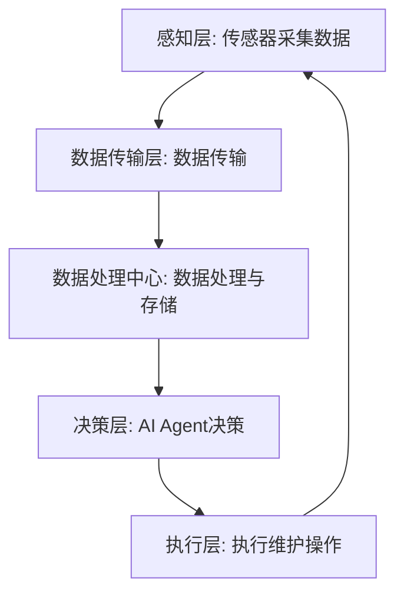

# AI Agent在智能地下管网维护中的实践

> 关键词：AI Agent、智能地下管网、管网维护、人工智能、自动化、数据分析、决策支持

> 摘要：本文围绕AI Agent在智能地下管网维护中的实践展开。详细阐述了AI Agent的核心概念及其与地下管网维护的联系，深入剖析其核心算法原理和具体操作步骤，通过数学模型和公式进行理论支持，并结合实际案例进行详细说明。同时，探讨了AI Agent在地下管网维护中的实际应用场景，推荐了相关的学习资源、开发工具框架以及论文著作。最后总结了未来发展趋势与挑战，为AI Agent在智能地下管网维护领域的进一步发展提供了全面的参考。

## 1. 背景介绍 
### 1.1 目的和范围
随着城市化进程的加速，地下管网系统日益复杂庞大，其维护和管理面临着巨大的挑战。传统的管网维护方式效率低下、成本高昂且难以做到实时监测和精准决策。AI Agent作为一种智能化的技术手段，能够通过感知、决策和行动，实现对地下管网的高效维护。本文的目的在于探讨AI Agent在智能地下管网维护中的应用实践，范围涵盖AI Agent的原理、算法、实际案例以及未来发展趋势等方面。

### 1.2 预期读者
本文预期读者包括从事地下管网维护管理的专业人员、人工智能领域的研究人员和开发者、相关领域的学者以及对智能地下管网维护感兴趣的技术爱好者。

### 1.3 文档结构概述
本文首先介绍AI Agent和智能地下管网维护的相关背景知识，包括术语定义和概念解释。接着阐述AI Agent的核心概念及其与地下管网维护的联系，通过文本示意图和Mermaid流程图进行直观展示。然后详细讲解AI Agent的核心算法原理和具体操作步骤，并用Python源代码进行说明。再通过数学模型和公式对其进行理论支持，并举例说明。之后通过实际案例展示AI Agent在智能地下管网维护中的应用，包括开发环境搭建、源代码实现和代码解读。随后探讨AI Agent在地下管网维护中的实际应用场景。接着推荐相关的学习资源、开发工具框架以及论文著作。最后总结未来发展趋势与挑战，并提供常见问题与解答以及扩展阅读和参考资料。

### 1.4 术语表
#### 1.4.1 核心术语定义
- **AI Agent（人工智能代理）**：是一种能够感知环境、进行决策并采取行动以实现特定目标的智能实体。
- **智能地下管网**：指利用现代信息技术，实现对地下管网的实时监测、数据分析和智能决策的管网系统。
- **管网维护**：包括对地下管网的检测、修复、更新等一系列确保管网正常运行的活动。

#### 1.4.2 相关概念解释
- **感知**：AI Agent通过各种传感器获取地下管网的状态信息，如压力、流量、温度等。
- **决策**：AI Agent根据感知到的信息，运用算法和模型进行分析，制定出最优的维护策略。
- **行动**：AI Agent根据决策结果，执行相应的维护操作，如启动修复设备、调整管网参数等。

#### 1.4.3 缩略词列表
- **AI**：Artificial Intelligence（人工智能）
- **IoT**：Internet of Things（物联网）

## 2. 核心概念与联系 

### 核心概念原理
AI Agent的核心原理基于感知 - 决策 - 行动的循环。它通过传感器感知地下管网的环境信息，将这些信息输入到决策模块中，决策模块根据预设的规则和算法进行分析，制定出最优的行动策略，然后通过执行器执行相应的行动。在智能地下管网维护中，AI Agent可以实时监测管网的运行状态，及时发现故障和隐患，并采取相应的措施进行修复和预防。

### 架构的文本示意图
AI Agent在智能地下管网维护中的架构可以分为以下几个层次：
1. **感知层**：由各种传感器组成，如压力传感器、流量传感器、温度传感器等，负责实时采集地下管网的状态信息。
2. **数据传输层**：将感知层采集到的数据传输到数据处理中心，可采用有线或无线通信技术。
3. **数据处理中心**：对传输过来的数据进行清洗、分析和存储，为决策层提供数据支持。
4. **决策层**：AI Agent的核心部分，根据数据处理中心提供的数据，运用算法和模型进行决策，制定出最优的维护策略。
5. **执行层**：根据决策层制定的策略，通过执行器执行相应的维护操作，如启动修复设备、调整管网参数等。

### Mermaid 流程图


## 3. 核心算法原理 & 具体操作步骤 

### 核心算法原理
在智能地下管网维护中，AI Agent常用的算法包括机器学习算法和优化算法。例如，使用机器学习算法中的决策树算法可以对管网故障进行分类和预测，使用优化算法中的遗传算法可以对维护策略进行优化。

以下是一个使用Python实现的简单决策树算法示例：
```python
from sklearn.datasets import load_iris
from sklearn.model_selection import train_test_split
from sklearn.tree import DecisionTreeClassifier
from sklearn.metrics import accuracy_score

# 加载数据集
iris = load_iris()
X = iris.data
y = iris.target

# 划分训练集和测试集
X_train, X_test, y_train, y_test = train_test_split(X, y, test_size=0.3, random_state=42)

# 创建决策树分类器
clf = DecisionTreeClassifier()

# 训练模型
clf.fit(X_train, y_train)

# 预测
y_pred = clf.predict(X_test)

# 计算准确率
accuracy = accuracy_score(y_test, y_pred)
print(f"Accuracy: {accuracy}")
```
### 具体操作步骤
1. **数据采集**：通过感知层的传感器采集地下管网的状态信息，如压力、流量、温度等。
2. **数据预处理**：对采集到的数据进行清洗、归一化等处理，去除噪声和异常值。
3. **特征提取**：从预处理后的数据中提取有用的特征，如均值、方差、最大值等。
4. **模型训练**：使用机器学习算法对提取的特征进行训练，建立故障分类和预测模型。
5. **决策制定**：根据训练好的模型，对管网的状态进行实时监测和分析，制定出最优的维护策略。
6. **行动执行**：根据决策结果，通过执行器执行相应的维护操作。

## 4. 数学模型和公式 & 详细讲解 & 举例说明 

### 数学模型和公式
在智能地下管网维护中，常用的数学模型包括线性回归模型、逻辑回归模型等。以线性回归模型为例，其数学公式为：
$$y = \beta_0 + \beta_1x_1 + \beta_2x_2 + \cdots + \beta_nx_n + \epsilon$$
其中，$y$ 是因变量，$x_1, x_2, \cdots, x_n$ 是自变量，$\beta_0, \beta_1, \beta_2, \cdots, \beta_n$ 是回归系数，$\epsilon$ 是误差项。

### 详细讲解
线性回归模型的目的是通过自变量 $x_1, x_2, \cdots, x_n$ 来预测因变量 $y$ 的值。回归系数 $\beta_0, \beta_1, \beta_2, \cdots, \beta_n$ 可以通过最小二乘法来估计，即通过最小化误差项 $\epsilon$ 的平方和来确定。

### 举例说明
假设我们要预测地下管网的压力 $y$ 与流量 $x_1$ 和温度 $x_2$ 之间的关系。我们可以收集一定数量的样本数据，然后使用线性回归模型进行拟合。以下是一个使用Python实现的简单线性回归示例：
```python
import numpy as np
from sklearn.linear_model import LinearRegression

# 生成样本数据
X = np.array([[1, 2], [2, 3], [3, 4], [4, 5]])
y = np.array([3, 5, 7, 9])

# 创建线性回归模型
model = LinearRegression()

# 训练模型
model.fit(X, y)

# 预测
new_X = np.array([[5, 6]])
prediction = model.predict(new_X)
print(f"Prediction: {prediction}")
```

## 5. 项目实战：代码实际案例和详细解释说明 

### 5.1  开发环境搭建
- **操作系统**：推荐使用Linux系统，如Ubuntu 18.04及以上版本。
- **编程语言**：Python 3.6及以上版本。
- **开发工具**：推荐使用PyCharm作为集成开发环境。
- **相关库**：安装 `numpy`、`pandas`、`scikit-learn` 等库，可使用以下命令进行安装：
```sh
pip install numpy pandas scikit-learn
```

### 5.2  源代码详细实现和代码解读
以下是一个简单的AI Agent在智能地下管网维护中的代码示例：
```python
import numpy as np
from sklearn.linear_model import LinearRegression

# 模拟地下管网的状态数据
pressure_data = np.array([10, 12, 14, 16, 18])
flow_data = np.array([5, 6, 7, 8, 9])
temperature_data = np.array([20, 22, 24, 26, 28])

# 合并数据
X = np.column_stack((flow_data, temperature_data))
y = pressure_data

# 创建线性回归模型
model = LinearRegression()

# 训练模型
model.fit(X, y)

# 模拟新的状态数据
new_flow = np.array([10])
new_temperature = np.array([30])
new_X = np.column_stack((new_flow, new_temperature))

# 预测压力
predicted_pressure = model.predict(new_X)
print(f"Predicted pressure: {predicted_pressure}")

# 根据预测结果进行决策
if predicted_pressure > 20:
    print("Warning: High pressure! Take maintenance actions.")
else:
    print("Normal pressure. No immediate maintenance needed.")
```
### 代码解读与分析
1. **数据模拟**：使用 `numpy` 数组模拟地下管网的压力、流量和温度数据。
2. **数据处理**：将流量和温度数据合并为一个二维数组 `X`，压力数据作为目标变量 `y`。
3. **模型训练**：使用 `sklearn` 中的 `LinearRegression` 模型进行训练。
4. **预测**：根据新的流量和温度数据，使用训练好的模型预测压力。
5. **决策制定**：根据预测结果判断压力是否过高，如果过高则发出警告并建议采取维护措施，否则认为压力正常，无需立即维护。

## 6. 实际应用场景 
### 故障检测与预警
AI Agent可以实时监测地下管网的运行状态，通过对传感器数据的分析，及时发现故障和隐患，并发出预警。例如，当管网中的压力突然升高或流量突然下降时，AI Agent可以快速判断可能存在的故障，并通知相关人员进行处理。

### 维护策略优化
AI Agent可以根据管网的历史数据和实时状态，运用优化算法制定出最优的维护策略。例如，通过遗传算法对维护计划进行优化，合理安排维护时间和资源，降低维护成本。

### 管网状态评估
AI Agent可以对地下管网的整体状态进行评估，通过建立评估模型，对管网的健康状况进行量化分析。例如，根据管网的压力、流量、温度等参数，计算出管网的健康指数，为管网的更新和改造提供决策依据。

### 应急响应
在发生突发事故时，AI Agent可以快速响应，根据事故的类型和严重程度，制定出相应的应急处理方案。例如，当管网发生泄漏时，AI Agent可以迅速定位泄漏点，并指挥相关设备进行堵漏和修复。

## 7. 工具和资源推荐
### 7.1 学习资源推荐
#### 7.1.1 书籍推荐
- 《人工智能：一种现代的方法》：全面介绍了人工智能的基本概念、算法和应用，是学习人工智能的经典教材。
- 《Python机器学习实战》：通过实际案例介绍了Python在机器学习中的应用，适合初学者入门。
- 《智能系统中的概率推理：可信性网络》：介绍了概率推理在智能系统中的应用，对于理解AI Agent的决策机制有很大帮助。

#### 7.1.2 在线课程
- Coursera上的“机器学习”课程：由斯坦福大学教授Andrew Ng主讲，是学习机器学习的经典课程。
- edX上的“人工智能基础”课程：介绍了人工智能的基本概念、算法和应用，适合初学者。
- 中国大学MOOC上的“Python语言程序设计”课程：适合初学者学习Python编程语言。

#### 7.1.3 技术博客和网站
- Medium：上面有很多关于人工智能和机器学习的技术文章和案例分享。
- 博客园：国内的技术博客平台，有很多关于人工智能和Python编程的技术文章。
- 开源中国：提供了丰富的开源项目和技术文章，对于学习人工智能和智能地下管网维护有很大帮助。

### 7.2 开发工具框架推荐
#### 7.2.1 IDE和编辑器
- PyCharm：是一款专门为Python开发设计的集成开发环境，具有代码自动补全、调试等功能，适合Python开发。
- Visual Studio Code：是一款轻量级的代码编辑器，支持多种编程语言，具有丰富的插件扩展功能。
- Jupyter Notebook：是一款交互式的开发环境，适合进行数据分析和机器学习实验。

#### 7.2.2 调试和性能分析工具
- PDB：Python自带的调试工具，可以帮助开发者进行代码调试。
- cProfile：Python自带的性能分析工具，可以分析代码的性能瓶颈。
- TensorBoard：是TensorFlow的可视化工具，可以帮助开发者可视化训练过程和模型结构。

#### 7.2.3 相关框架和库
- Scikit-learn：是一个开源的机器学习库，提供了丰富的机器学习算法和工具，适合初学者。
- TensorFlow：是一个开源的深度学习框架，由Google开发，广泛应用于人工智能领域。
- PyTorch：是一个开源的深度学习框架，由Facebook开发，具有动态计算图的特点，适合研究和开发。

### 7.3 相关论文著作推荐
#### 7.3.1 经典论文
- “A Logical Calculus of the Ideas Immanent in Nervous Activity”：这篇论文是神经网络领域的经典论文，为人工智能的发展奠定了基础。
- “Learning Representations by Back-propagating Errors”：这篇论文提出了反向传播算法，是神经网络训练的重要算法。
- “Playing Atari with Deep Reinforcement Learning”：这篇论文提出了深度强化学习算法，在游戏领域取得了很好的效果。

#### 7.3.2 最新研究成果
- 关注顶级学术会议，如NeurIPS、ICML、CVPR等，这些会议上的论文代表了人工智能领域的最新研究成果。
- 关注知名学术期刊，如Journal of Artificial Intelligence Research、Artificial Intelligence等，这些期刊上的论文也具有很高的学术价值。

#### 7.3.3 应用案例分析
- 查阅相关的行业报告和案例分析，了解AI Agent在智能地下管网维护中的实际应用案例和效果。
- 参考一些开源项目的文档和代码，学习他人的经验和做法。

## 8. 总结：未来发展趋势与挑战
### 未来发展趋势
- **智能化程度不断提高**：AI Agent将不断融合更先进的人工智能技术，如深度学习、强化学习等，实现更智能的决策和行动，提高地下管网维护的效率和质量。
- **与物联网深度融合**：随着物联网技术的发展，AI Agent将与更多的传感器和设备进行连接，实现对地下管网的全面实时监测和控制。
- **多智能体协同**：多个AI Agent将协同工作，实现对复杂地下管网系统的高效维护和管理。
- **可视化与交互性增强**：通过可视化技术，将地下管网的状态信息以直观的方式展示给用户，同时提供更友好的交互界面，方便用户进行操作和决策。

### 挑战
- **数据质量和安全问题**：地下管网的监测数据量巨大，数据质量参差不齐，同时数据安全也是一个重要问题，需要采取有效的措施确保数据的准确性和安全性。
- **算法复杂度和计算资源需求**：先进的人工智能算法往往具有较高的复杂度，需要大量的计算资源，如何在有限的计算资源下实现高效的算法是一个挑战。
- **标准和规范缺乏**：目前智能地下管网维护领域缺乏统一的标准和规范，不同的系统和设备之间难以实现互联互通，需要加快标准和规范的制定。
- **人才短缺**：AI Agent在智能地下管网维护中的应用需要既懂人工智能又懂地下管网维护的复合型人才，目前这类人才短缺，需要加强人才培养。

## 9. 附录：常见问题与解答
### 问题1：AI Agent在智能地下管网维护中的准确性如何保证？
答：可以通过提高传感器的精度、优化数据预处理算法、选择合适的机器学习模型以及进行大量的实验和验证等方式来保证AI Agent的准确性。

### 问题2：AI Agent的决策过程是否可以解释？
答：部分AI Agent的决策过程可以解释，例如基于规则的决策系统。对于一些复杂的机器学习模型，如深度学习模型，其决策过程解释起来相对困难，但可以通过一些方法，如特征重要性分析、局部可解释性模型等，来提高决策的可解释性。

### 问题3：AI Agent在智能地下管网维护中的成本如何？
答：AI Agent的成本包括硬件成本（如传感器、执行器等）、软件成本（如算法开发、模型训练等）以及维护成本等。具体成本因项目规模和需求而异，随着技术的发展和普及，成本有望逐渐降低。

### 问题4：AI Agent是否可以替代人工进行地下管网维护？
答：目前AI Agent还不能完全替代人工进行地下管网维护，但可以辅助人工进行决策和操作，提高维护效率和质量。在一些复杂的情况下，仍需要人工进行干预和处理。

## 10. 扩展阅读 & 参考资料
### 扩展阅读
- 《深度学习》：由Ian Goodfellow、Yoshua Bengio和Aaron Courville合著，深入介绍了深度学习的原理和应用。
- 《强化学习：原理与Python实现》：介绍了强化学习的基本原理和算法，并通过Python代码进行实现。
- 《数据挖掘：概念与技术》：全面介绍了数据挖掘的基本概念、算法和应用，对于理解数据预处理和特征提取有很大帮助。

### 参考资料
- 相关的行业标准和规范，如《城镇排水管道检测与评估技术规程》等。
- 国内外相关的研究报告和学术论文。
- 开源项目的文档和代码，如TensorFlow、PyTorch等的官方文档。