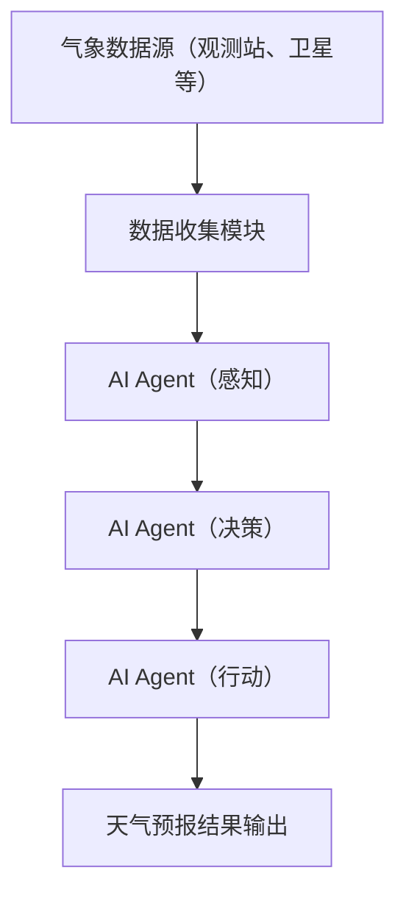

# AI Agent在智能天气预报中的实践

> 关键词：AI Agent、智能天气预报、气象数据、机器学习、预测模型、数据融合、决策智能

> 摘要：本文聚焦于AI Agent在智能天气预报中的实践应用。首先介绍了相关背景知识，包括目的范围、预期读者等内容。接着阐述了AI Agent与智能天气预报的核心概念及联系，通过文本示意图和Mermaid流程图进行清晰展示。详细讲解了核心算法原理，结合Python源代码说明具体操作步骤，同时给出数学模型和公式并举例。在项目实战部分，展示了开发环境搭建、源代码实现与解读。还探讨了AI Agent在智能天气预报中的实际应用场景，推荐了相关工具和资源，最后总结未来发展趋势与挑战，给出常见问题解答及扩展阅读参考资料，旨在全面深入地剖析AI Agent在智能天气预报领域的应用实践。

## 1. 背景介绍 
### 1.1 目的和范围
智能天气预报对于人们的日常生活、农业生产、交通运输、能源管理等众多领域都有着至关重要的意义。传统的天气预报方法主要依赖于数值天气预报模型，这些模型虽然在一定程度上能够提供准确的预报，但面临着计算资源需求大、对复杂气象现象的模拟能力有限等问题。

本文的目的在于探讨AI Agent在智能天气预报中的应用实践，分析其如何利用先进的人工智能技术，对气象数据进行高效处理和分析，从而提高天气预报的准确性和及时性。范围涵盖了AI Agent的基本概念、相关算法原理、在天气预报中的具体应用场景，以及实际项目中的开发和实现过程。

### 1.2 预期读者
本文预期读者包括对人工智能和天气预报领域感兴趣的科研人员、气象工作者、软件开发人员、学生等。对于科研人员，本文可以提供新的研究思路和方法；对于气象工作者，有助于了解如何利用AI Agent改进现有的预报流程；对于软件开发人员，可作为实现相关项目的技术参考；对于学生，则可以作为学习人工智能在气象领域应用的入门资料。

### 1.3 文档结构概述
本文将按照以下结构进行阐述：首先介绍背景知识，包括目的范围、预期读者等；接着讲解AI Agent与智能天气预报的核心概念及联系，通过文本示意图和Mermaid流程图展示；然后详细说明核心算法原理和具体操作步骤，结合Python源代码；再给出数学模型和公式并举例；之后进行项目实战，包括开发环境搭建、源代码实现与解读；探讨实际应用场景；推荐相关工具和资源；最后总结未来发展趋势与挑战，给出常见问题解答及扩展阅读参考资料。

### 1.4 术语表
#### 1.4.1 核心术语定义
- **AI Agent（人工智能智能体）**：是一个能够感知环境，根据感知到的信息进行决策，并采取行动以实现特定目标的实体。在智能天气预报中，AI Agent可以感知气象数据，分析数据并做出预报决策。
- **智能天气预报**：利用先进的信息技术和人工智能方法，对气象数据进行处理和分析，以提供更准确、及时的天气预报信息。
- **气象数据**：包括温度、湿度、气压、风速、风向等与大气状态相关的数据，是天气预报的基础。

#### 1.4.2 相关概念解释
- **机器学习**：是一门多领域交叉学科，涉及概率论、统计学、逼近论、凸分析、算法复杂度理论等多门学科。它专门研究计算机怎样模拟或实现人类的学习行为，以获取新的知识或技能，重新组织已有的知识结构使之不断改善自身的性能。在智能天气预报中，机器学习算法可用于对气象数据进行建模和预测。
- **数据融合**：将来自多个数据源的信息进行整合，以获得更全面、准确的信息。在天气预报中，不同的气象观测站和卫星等数据源提供的数据可以通过数据融合技术进行处理。

#### 1.4.3 缩略词列表
- **ML（Machine Learning）**：机器学习
- **NN（Neural Network）**：神经网络
- **CNN（Convolutional Neural Network）**：卷积神经网络
- **RNN（Recurrent Neural Network）**：循环神经网络

## 2. 核心概念与联系 

### 核心概念原理
AI Agent在智能天气预报中的应用基于其感知、决策和行动的基本原理。AI Agent通过传感器或数据接口感知气象环境中的各种数据，如温度、湿度、气压等。这些数据被收集后，AI Agent利用内部的决策模型对数据进行分析和处理，该决策模型可以是基于机器学习算法构建的，如神经网络、决策树等。根据决策结果，AI Agent可以生成天气预报信息，如预测未来的天气状况、发布气象预警等。

智能天气预报则是一个综合性的系统，它需要整合多种数据源，包括地面气象观测站、气象卫星、雷达等获取的数据。通过对这些数据的分析和处理，利用科学的模型和算法，预测未来的天气变化。AI Agent的引入可以提高智能天气预报系统的智能化水平，使其能够更快速、准确地做出决策。

### 文本示意图
```plaintext
           +---------------------+
           | 气象数据源（观测站、卫星等） |
           +---------------------+
                     |
                     v
           +---------------------+
           |      数据收集模块      |
           +---------------------+
                     |
                     v
           +---------------------+
           |    AI Agent（感知）    |
           +---------------------+
                     |
                     v
           +---------------------+
           |    AI Agent（决策）    |
           +---------------------+
                     |
                     v
           +---------------------+
           |    AI Agent（行动）    |
           +---------------------+
                     |
                     v
           +---------------------+
           |    天气预报结果输出    |
           +---------------------+
```

### Mermaid流程图


## 3. 核心算法原理 & 具体操作步骤 

### 核心算法原理
在智能天气预报中，常用的AI算法包括神经网络算法。以卷积神经网络（CNN）为例，CNN是一种专门为处理具有网格结构数据（如图像）而设计的神经网络。在气象数据处理中，气象数据可以看作是具有时空结构的数据，CNN可以有效地提取数据中的特征。

CNN主要由卷积层、池化层和全连接层组成。卷积层通过卷积核在输入数据上滑动，提取数据的局部特征。池化层用于对卷积层的输出进行下采样，减少数据的维度，同时保留重要的特征。全连接层将池化层的输出进行连接，输出最终的预测结果。

### 具体操作步骤及Python源代码
以下是一个简单的使用Python和Keras库实现的CNN模型用于气象数据预测的示例代码：

```python
import numpy as np
from keras.models import Sequential
from keras.layers import Conv1D, MaxPooling1D, Flatten, Dense

# 生成示例数据
# 假设我们有1000个样本，每个样本有10个时间步长，每个时间步长有5个特征
data = np.random.rand(1000, 10, 5)
labels = np.random.randint(0, 2, 1000)

# 划分训练集和测试集
train_data = data[:800]
train_labels = labels[:800]
test_data = data[800:]
test_labels = labels[800:]

# 构建CNN模型
model = Sequential()
model.add(Conv1D(filters=32, kernel_size=3, activation='relu', input_shape=(10, 5)))
model.add(MaxPooling1D(pool_size=2))
model.add(Flatten())
model.add(Dense(10, activation='relu'))
model.add(Dense(1, activation='sigmoid'))

# 编译模型
model.compile(optimizer='adam', loss='binary_crossentropy', metrics=['accuracy'])

# 训练模型
model.fit(train_data, train_labels, epochs=10, batch_size=32)

# 评估模型
test_loss, test_acc = model.evaluate(test_data, test_labels)
print(f"Test accuracy: {test_acc}")
```

### 代码解释
1. **数据生成**：使用`np.random.rand`生成随机的气象数据，`np.random.randint`生成对应的标签。
2. **数据划分**：将数据划分为训练集和测试集，80%的数据用于训练，20%的数据用于测试。
3. **模型构建**：使用`Sequential`模型构建CNN模型，添加卷积层、池化层、全连接层。
4. **模型编译**：使用`adam`优化器和`binary_crossentropy`损失函数进行编译。
5. **模型训练**：使用`fit`方法对模型进行训练，设置训练轮数和批次大小。
6. **模型评估**：使用`evaluate`方法对模型在测试集上的性能进行评估。

## 4. 数学模型和公式 & 详细讲解 & 举例说明 

### 卷积层数学模型
在卷积层中，卷积操作可以用以下公式表示：

$$y_{j}^{l}=\sum_{i \in M_{j}} x_{i}^{l - 1} * k_{ij}^{l}+b_{j}^{l}$$

其中，$y_{j}^{l}$ 是第 $l$ 层第 $j$ 个特征图的输出，$x_{i}^{l - 1}$ 是第 $l - 1$ 层第 $i$ 个特征图的输入，$k_{ij}^{l}$ 是第 $l$ 层连接第 $i$ 个输入特征图和第 $j$ 个输出特征图的卷积核，$b_{j}^{l}$ 是第 $l$ 层第 $j$ 个特征图的偏置，$M_{j}$ 是与第 $j$ 个输出特征图相连的输入特征图的集合。

### 详细讲解
卷积操作的本质是将卷积核在输入特征图上滑动，进行元素相乘并求和的操作。通过不同的卷积核，可以提取输入数据中的不同特征。偏置项 $b_{j}^{l}$ 用于调整输出的偏移量。

### 举例说明
假设我们有一个输入特征图 $x$ 是一个 $3 \times 3$ 的矩阵：

$$x=\begin{bmatrix}
1 & 2 & 3 \\
4 & 5 & 6 \\
7 & 8 & 9
\end{bmatrix}$$

卷积核 $k$ 是一个 $2 \times 2$ 的矩阵：

$$k=\begin{bmatrix}
1 & 0 \\
0 & 1
\end{bmatrix}$$

进行卷积操作时，卷积核在输入特征图上滑动，每次取一个 $2 \times 2$ 的子矩阵与卷积核进行元素相乘并求和。例如，当卷积核位于输入特征图的左上角时：

$$\begin{bmatrix}
1 & 2 \\
4 & 5
\end{bmatrix} \odot \begin{bmatrix}
1 & 0 \\
0 & 1
\end{bmatrix} = 1\times1 + 2\times0 + 4\times0 + 5\times1 = 6$$

其中 $\odot$ 表示元素相乘操作。通过不断滑动卷积核，可以得到卷积层的输出特征图。

### 池化层数学模型
最大池化是一种常用的池化操作，其数学模型可以表示为：

$$y_{j}^{l}=\max_{(m,n) \in R_{j}} x_{mn}^{l - 1}$$

其中，$y_{j}^{l}$ 是第 $l$ 层第 $j$ 个池化单元的输出，$x_{mn}^{l - 1}$ 是第 $l - 1$ 层在区域 $R_{j}$ 内的输入值，$R_{j}$ 是第 $j$ 个池化单元对应的输入区域。

### 详细讲解
最大池化操作是在每个池化区域内选择最大值作为输出。通过池化操作，可以减少数据的维度，同时保留重要的特征信息。

### 举例说明
假设我们有一个输入特征图 $x$ 是一个 $4 \times 4$ 的矩阵：

$$x=\begin{bmatrix}
1 & 2 & 3 & 4 \\
5 & 6 & 7 & 8 \\
9 & 10 & 11 & 12 \\
13 & 14 & 15 & 16
\end{bmatrix}$$

池化窗口大小为 $2 \times 2$，步长为 2。则第一个池化区域为：

$$\begin{bmatrix}
1 & 2 \\
5 & 6
\end{bmatrix}$$

该区域的最大值为 6，同理可以计算其他池化区域的最大值，最终得到池化层的输出特征图。

## 5. 项目实战：代码实际案例和详细解释说明 

### 5.1  开发环境搭建
#### 操作系统
可以选择Windows、Linux（如Ubuntu）或macOS等操作系统。

#### 编程语言和环境
- **Python**：建议使用Python 3.6及以上版本。
- **Anaconda**：是一个用于科学计算的Python发行版，包含了许多常用的科学计算库和工具。可以从Anaconda官方网站下载并安装。

#### 库和框架
- **NumPy**：用于数值计算。
- **Pandas**：用于数据处理和分析。
- **Keras**：是一个高级神经网络API，可用于快速构建和训练神经网络模型。
- **TensorFlow**：是一个开源的机器学习框架，Keras可以基于TensorFlow后端运行。

可以使用以下命令安装所需的库：

```bash
pip install numpy pandas keras tensorflow
```

### 5.2  源代码详细实现和代码解读
以下是一个更完整的使用CNN模型进行气象数据预测的项目示例代码：

```python
import numpy as np
import pandas as pd
from sklearn.model_selection import train_test_split
from keras.models import Sequential
from keras.layers import Conv1D, MaxPooling1D, Flatten, Dense

# 加载气象数据
data = pd.read_csv('weather_data.csv')

# 提取特征和标签
features = data.drop('target', axis=1).values
labels = data['target'].values

# 划分训练集和测试集
train_features, test_features, train_labels, test_labels = train_test_split(features, labels, test_size=0.2, random_state=42)

# 调整数据形状以适应CNN模型输入
train_features = np.expand_dims(train_features, axis=2)
test_features = np.expand_dims(test_features, axis=2)

# 构建CNN模型
model = Sequential()
model.add(Conv1D(filters=64, kernel_size=3, activation='relu', input_shape=(train_features.shape[1], 1)))
model.add(MaxPooling1D(pool_size=2))
model.add(Conv1D(filters=32, kernel_size=3, activation='relu'))
model.add(MaxPooling1D(pool_size=2))
model.add(Flatten())
model.add(Dense(64, activation='relu'))
model.add(Dense(1, activation='sigmoid'))

# 编译模型
model.compile(optimizer='adam', loss='binary_crossentropy', metrics=['accuracy'])

# 训练模型
model.fit(train_features, train_labels, epochs=20, batch_size=32, validation_split=0.1)

# 评估模型
test_loss, test_acc = model.evaluate(test_features, test_labels)
print(f"Test accuracy: {test_acc}")

# 进行预测
predictions = model.predict(test_features)
```

### 5.3  代码解读与分析
1. **数据加载**：使用`pandas`库的`read_csv`函数加载气象数据文件`weather_data.csv`。
2. **特征和标签提取**：使用`drop`方法提取除目标列之外的特征，使用`values`属性将数据转换为NumPy数组。
3. **数据划分**：使用`train_test_split`函数将数据划分为训练集和测试集，测试集占比为20%。
4. **数据形状调整**：使用`np.expand_dims`函数在特征数据的最后一维添加一个维度，以适应CNN模型的输入要求。
5. **模型构建**：构建一个包含两个卷积层、两个池化层和两个全连接层的CNN模型。
6. **模型编译**：使用`adam`优化器和`binary_crossentropy`损失函数进行编译。
7. **模型训练**：使用`fit`方法对模型进行训练，设置训练轮数、批次大小和验证集比例。
8. **模型评估**：使用`evaluate`方法对模型在测试集上的性能进行评估。
9. **预测**：使用`predict`方法对测试集进行预测。

## 6. 实际应用场景 
### 日常天气预报
AI Agent可以实时收集和分析气象数据，包括地面气象观测站、气象卫星、雷达等数据源的数据。通过对这些数据的处理和分析，AI Agent可以预测未来几小时、几天甚至更长时间的天气状况，为人们的日常生活提供准确的天气预报信息，帮助人们合理安排出行、活动等。

### 农业生产
在农业生产中，天气状况对农作物的生长和收成有着重要影响。AI Agent可以根据天气预报信息，为农民提供种植建议，如播种时间、灌溉时间、施肥时间等。同时，还可以提前预警自然灾害，如暴雨、干旱、台风等，帮助农民采取相应的防范措施，减少损失。

### 交通运输
交通运输行业对天气变化非常敏感。AI Agent可以为航空公司、铁路部门、公路运输企业等提供实时的天气信息和预报，帮助他们合理安排航班、列车和车辆的运行计划，提高运输效率和安全性。例如，在遇到恶劣天气时，及时调整航班起降时间，避免航班延误和事故发生。

### 能源管理
能源生产和供应也与天气状况密切相关。例如，风力发电和太阳能发电的产量受到风速、光照强度等气象因素的影响。AI Agent可以根据天气预报信息，预测能源需求和供应情况，帮助能源企业合理安排生产和调度，提高能源利用效率，降低成本。

## 7. 工具和资源推荐
### 7.1 学习资源推荐
#### 7.1.1 书籍推荐
- 《Python深度学习》：由Francois Chollet所著，详细介绍了使用Python和Keras进行深度学习的方法和技巧，对于学习神经网络在气象数据处理中的应用有很大帮助。
- 《机器学习》：由周志华所著，全面介绍了机器学习的基本概念、算法和应用，是学习机器学习的经典教材。
- 《气象学与气候学》：介绍了气象学的基本原理和气候学的相关知识，对于理解气象数据和天气预报的原理有重要意义。

#### 7.1.2 在线课程
- Coursera上的“深度学习专项课程”：由Andrew Ng教授讲授，包括神经网络、卷积神经网络、循环神经网络等深度学习的核心内容。
- edX上的“数据科学与机器学习微硕士学位课程”：提供了数据处理、机器学习算法、深度学习等方面的系统学习。
- 中国大学MOOC上的“气象学与气候学”：由国内高校的教授讲授，介绍了气象学的基础知识和应用。

#### 7.1.3 技术博客和网站
- Medium：上面有很多关于人工智能、机器学习和气象学的技术文章和案例分享。
- Kaggle：是一个数据科学和机器学习竞赛平台，上面有很多关于气象数据处理和预测的竞赛和开源代码。
- 中国气象数据网：提供了丰富的气象数据和相关的研究报告。

### 7.2 开发工具框架推荐
#### 7.2.1 IDE和编辑器
- PyCharm：是一款专门为Python开发设计的集成开发环境，具有强大的代码编辑、调试和版本控制功能。
- Jupyter Notebook：是一个交互式的开发环境，适合进行数据探索、模型训练和结果展示。
- Visual Studio Code：是一款轻量级的代码编辑器，支持多种编程语言和插件扩展。

#### 7.2.2 调试和性能分析工具
- TensorBoard：是TensorFlow的可视化工具，可以用于查看模型的训练过程、损失函数变化、准确率等指标。
- Py-Spy：是一个用于Python程序性能分析的工具，可以帮助找出程序中的性能瓶颈。

#### 7.2.3 相关框架和库
- Scikit-learn：是一个简单易用的机器学习库，提供了各种机器学习算法和工具，如数据预处理、模型选择、评估等。
- XGBoost：是一个高效的梯度提升库，在机器学习竞赛中经常被使用，可用于气象数据的预测和分类任务。
- Prophet：是Facebook开发的一个时间序列预测库，适用于气象数据的时间序列分析和预测。

### 7.3 相关论文著作推荐
#### 7.3.1 经典论文
- “Convolutional Neural Networks for Weather Forecasting”：介绍了卷积神经网络在天气预报中的应用原理和方法。
- “Machine Learning in Meteorology: A Review”：对机器学习在气象学中的应用进行了全面的综述。

#### 7.3.2 最新研究成果
- 可以通过IEEE Xplore、ACM Digital Library等学术数据库搜索关于AI Agent和智能天气预报的最新研究论文。

#### 7.3.3 应用案例分析
- 可以参考一些实际的气象预报系统和项目的案例分析，了解AI Agent在实际应用中的实现方法和效果。

## 8. 总结：未来发展趋势与挑战
### 未来发展趋势
- **多源数据融合**：未来的智能天气预报系统将整合更多的数据源，包括物联网设备、无人机等获取的气象数据，通过数据融合技术提高预报的准确性。
- **深度学习模型优化**：不断优化深度学习模型的结构和算法，提高模型的性能和效率，如使用更复杂的神经网络架构、引入注意力机制等。
- **智能决策与服务**：AI Agent将不仅提供天气预报信息，还将根据用户的需求和场景，提供智能决策建议和个性化的服务，如旅游天气推荐、农业灾害预警等。
- **与其他领域的融合**：智能天气预报将与其他领域，如交通、能源、环保等进行更深入的融合，实现跨领域的协同发展。

### 挑战
- **数据质量和一致性**：不同数据源提供的气象数据可能存在质量差异和不一致性，如何对这些数据进行有效的清洗和整合是一个挑战。
- **模型可解释性**：深度学习模型通常是黑盒模型，其决策过程难以解释。在智能天气预报中，需要提高模型的可解释性，以便用户理解和信任预报结果。
- **计算资源需求**：复杂的深度学习模型需要大量的计算资源进行训练和推理，如何在有限的计算资源下实现高效的预报是一个挑战。
- **不确定性处理**：气象系统本身具有很大的不确定性，如何在智能天气预报中有效地处理这些不确定性，提高预报的可靠性是一个重要的研究方向。

## 9. 附录：常见问题与解答
### 1. 如何选择合适的AI算法用于智能天气预报？
选择合适的AI算法需要考虑数据的特点、问题的复杂度和计算资源等因素。对于具有时空结构的气象数据，卷积神经网络（CNN）和循环神经网络（RNN）等深度学习算法通常比较有效。如果数据量较小或问题相对简单，传统的机器学习算法如决策树、支持向量机等也可以考虑。

### 2. 如何提高智能天气预报的准确性？
可以从以下几个方面提高智能天气预报的准确性：
- 收集更多、更准确的气象数据，包括多源数据的融合。
- 优化AI模型的结构和参数，通过实验和调优找到最佳的模型配置。
- 结合传统的数值天气预报模型和AI方法，发挥各自的优势。
- 不断更新和改进模型，适应气象系统的变化。

### 3. AI Agent在智能天气预报中的运行效率如何提高？
可以采取以下措施提高AI Agent的运行效率：
- 使用高效的硬件设备，如GPU、TPU等进行加速计算。
- 优化算法的实现，减少不必要的计算和内存开销。
- 采用分布式计算和并行计算技术，提高计算效率。
- 对数据进行预处理和压缩，减少数据传输和存储的负担。

### 4. 如何处理气象数据中的缺失值和异常值？
处理气象数据中的缺失值和异常值可以采用以下方法：
- 对于缺失值，可以使用插值方法，如线性插值、样条插值等进行填充；也可以删除包含缺失值的样本。
- 对于异常值，可以使用统计方法，如基于标准差的方法、基于四分位数的方法等进行检测和处理；也可以使用机器学习算法进行异常值检测和修复。

## 10. 扩展阅读 & 参考资料
### 扩展阅读
- 《人工智能：一种现代的方法》：全面介绍了人工智能的基本概念、算法和应用，对于深入理解AI Agent有很大帮助。
- 《大气科学中的机器学习》：专门介绍了机器学习在大气科学中的应用，包括天气预报、气候模拟等方面的内容。

### 参考资料
- 相关的气象数据和研究报告可以从中国气象数据网、世界气象组织官网等获取。
- 机器学习和深度学习的相关文档和教程可以从Scikit-learn、Keras、TensorFlow等官方网站获取。