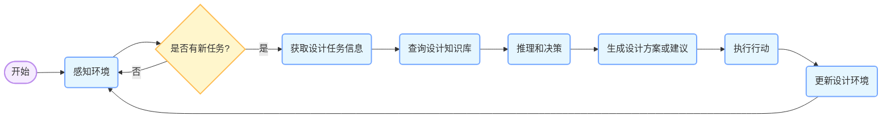

# AI Agent在智能工程设计中的应用

> 关键词：AI Agent、智能工程设计、自动化、决策支持、协同设计、优化算法、机器学习

> 摘要：本文深入探讨了AI Agent在智能工程设计中的应用。首先介绍了相关背景，包括目的范围、预期读者等内容。接着阐述了AI Agent的核心概念及其与智能工程设计的联系，详细讲解了其核心算法原理与具体操作步骤，通过数学模型和公式进行了理论支撑。然后结合项目实战，给出了代码实际案例并进行详细解释。还介绍了AI Agent在智能工程设计中的实际应用场景，推荐了相关的工具和资源。最后对未来发展趋势与挑战进行了总结，并提供了常见问题解答和扩展阅读参考资料，旨在全面展示AI Agent在智能工程设计领域的重要价值和应用潜力。

## 1. 背景介绍 
### 1.1 目的和范围
智能工程设计是一个复杂的过程，涉及到多学科知识的融合、大量的计算和决策。传统的工程设计方法往往效率低下，难以满足现代工程设计的需求。AI Agent作为一种具有自主性、反应性、社会性和主动性的智能实体，为智能工程设计提供了新的思路和方法。本文的目的是探讨AI Agent在智能工程设计中的应用，包括其原理、算法、实际案例等，范围涵盖了从基本概念到实际应用的各个方面。

### 1.2 预期读者
本文预期读者包括从事工程设计领域的专业人员，如机械工程师、电气工程师、土木工程师等，他们希望了解AI Agent如何提升工程设计的效率和质量；计算机科学和人工智能领域的研究人员和开发者，对AI Agent的算法和技术实现感兴趣；以及对智能工程设计和人工智能交叉领域有兴趣的学生和爱好者。

### 1.3 文档结构概述
本文首先介绍AI Agent和智能工程设计的相关背景知识，包括术语表。接着阐述AI Agent的核心概念及其与智能工程设计的联系，给出原理和架构的文本示意图和Mermaid流程图。然后详细讲解AI Agent的核心算法原理和具体操作步骤，并通过Python源代码进行阐述。之后介绍相关的数学模型和公式，并举例说明。再结合项目实战，介绍开发环境搭建、源代码实现和代码解读。随后探讨AI Agent在智能工程设计中的实际应用场景。接着推荐相关的工具和资源，包括学习资源、开发工具框架和相关论文著作。最后总结未来发展趋势与挑战，提供常见问题解答和扩展阅读参考资料。

### 1.4 术语表
#### 1.4.1 核心术语定义
- **AI Agent（人工智能代理）**：是一种能够感知环境、进行推理和决策，并采取行动以实现特定目标的智能实体。它可以自主地与环境进行交互，根据环境的变化调整自己的行为。
- **智能工程设计**：利用人工智能技术和方法，辅助或自动化完成工程设计过程，提高设计效率和质量，实现设计的智能化和优化。
- **自动化**：指在工程设计过程中，通过计算机程序和算法自动完成某些重复性、规律性的任务，减少人工干预。
- **决策支持**：利用AI Agent的推理和分析能力，为工程设计中的决策提供依据和建议，帮助设计师做出更合理的决策。
- **协同设计**：多个AI Agent或设计师之间通过协作和沟通，共同完成一个工程设计任务，实现信息共享和资源优化。

#### 1.4.2 相关概念解释
- **自主性**：AI Agent能够独立地感知环境、进行推理和决策，不需要外部的直接控制。
- **反应性**：AI Agent能够对环境的变化做出及时的反应，调整自己的行为以适应环境。
- **社会性**：AI Agent能够与其他Agent或人类进行交互和协作，共同完成任务。
- **主动性**：AI Agent能够主动地寻找机会，采取行动以实现自己的目标。

#### 1.4.3 缩略词列表
- **AI**：Artificial Intelligence（人工智能）
- **CAD**：Computer-Aided Design（计算机辅助设计）
- **CAM**：Computer-Aided Manufacturing（计算机辅助制造）
- **MDP**：Markov Decision Process（马尔可夫决策过程）

## 2. 核心概念与联系 

### 核心概念原理
AI Agent的核心原理基于人工智能的多个领域，包括机器学习、知识表示与推理、自然语言处理等。一个典型的AI Agent通常由感知模块、决策模块和行动模块组成。感知模块负责收集环境信息，决策模块根据感知到的信息进行推理和决策，行动模块则根据决策结果采取相应的行动。

在智能工程设计中，AI Agent可以扮演不同的角色，如设计助手、优化器、协调者等。设计助手可以根据设计师的需求提供相关的设计知识和建议；优化器可以对设计方案进行优化，提高设计的性能和质量；协调者可以促进多个设计师或设计团队之间的协作和沟通。

### 架构的文本示意图
AI Agent在智能工程设计中的架构可以描述如下：

智能工程设计环境是一个复杂的系统，包含多个子系统和组件，如设计知识库、设计工具、设计流程管理系统等。AI Agent作为一个独立的智能实体，通过感知接口与设计环境进行交互，获取设计任务、设计约束、设计资源等信息。然后，AI Agent利用自身的决策模块，结合设计知识库中的知识和算法，进行推理和决策，生成设计方案或优化建议。最后，AI Agent通过行动接口将决策结果反馈给设计环境，影响设计过程和结果。

### Mermaid流程图


这个流程图展示了AI Agent在智能工程设计中的基本工作流程。首先，AI Agent感知环境，检查是否有新的设计任务。如果有新任务，获取任务信息并查询设计知识库，然后进行推理和决策，生成设计方案或建议，最后执行行动并更新设计环境。这个过程不断循环，直到设计任务完成。

## 3. 核心算法原理 & 具体操作步骤 

### 核心算法原理
在AI Agent的决策过程中，马尔可夫决策过程（MDP）是一种常用的算法。MDP是一种用于建模顺序决策问题的数学框架，它假设环境的状态转移是马尔可夫的，即未来的状态只取决于当前的状态和采取的行动。

MDP可以用一个五元组 $(S, A, P, R, \gamma)$ 来表示，其中：
- $S$ 是状态空间，包含所有可能的环境状态。
- $A$ 是行动空间，包含所有可能的行动。
- $P(s'|s, a)$ 是状态转移概率，表示在状态 $s$ 下采取行动 $a$ 后转移到状态 $s'$ 的概率。
- $R(s, a, s')$ 是奖励函数，表示在状态 $s$ 下采取行动 $a$ 并转移到状态 $s'$ 后获得的奖励。
- $\gamma$ 是折扣因子，取值范围为 $[0, 1]$，用于平衡短期和长期奖励。

AI Agent的目标是找到一个最优策略 $\pi^*: S \to A$，使得在每个状态下采取的行动能够最大化长期累积奖励。

### 具体操作步骤
1. **初始化**：初始化状态空间 $S$、行动空间 $A$、状态转移概率 $P$、奖励函数 $R$ 和折扣因子 $\gamma$。
2. **策略评估**：对于当前策略 $\pi$，计算每个状态的价值函数 $V^\pi(s)$，可以使用迭代法或动态规划算法。
3. **策略改进**：根据价值函数 $V^\pi(s)$，更新策略 $\pi$，使得在每个状态下采取的行动能够最大化下一个状态的价值。
4. **终止条件判断**：判断策略是否收敛，如果收敛则停止迭代，否则返回步骤2继续进行策略评估和改进。

### Python源代码阐述
```python
import numpy as np

# 定义MDP的参数
S = 3  # 状态空间大小
A = 2  # 行动空间大小
P = np.array([[[0.7, 0.3, 0.0], [0.1, 0.9, 0.0]],
              [[0.0, 0.6, 0.4], [0.0, 0.3, 0.7]],
              [[0.0, 0.0, 1.0], [0.0, 0.0, 1.0]]])  # 状态转移概率
R = np.array([[1, -1], [2, -2], [0, 0]])  # 奖励函数
gamma = 0.9  # 折扣因子

# 初始化策略
policy = np.ones((S, A)) / A

# 策略评估函数
def policy_evaluation(policy, P, R, gamma, theta=0.0001):
    V = np.zeros(S)
    while True:
        delta = 0
        for s in range(S):
            v = 0
            for a in range(A):
                for s_prime in range(S):
                    v += policy[s, a] * P[s, a, s_prime] * (R[s, a] + gamma * V[s_prime])
            delta = max(delta, np.abs(v - V[s]))
            V[s] = v
        if delta < theta:
            break
    return V

# 策略改进函数
def policy_improvement(V, P, R, gamma):
    policy = np.zeros((S, A))
    for s in range(S):
        q_values = np.zeros(A)
        for a in range(A):
            for s_prime in range(S):
                q_values[a] += P[s, a, s_prime] * (R[s, a] + gamma * V[s_prime])
        best_action = np.argmax(q_values)
        policy[s, best_action] = 1
    return policy

# 策略迭代算法
def policy_iteration(P, R, gamma):
    policy = np.ones((S, A)) / A
    while True:
        V = policy_evaluation(policy, P, R, gamma)
        new_policy = policy_improvement(V, P, R, gamma)
        if np.allclose(new_policy, policy):
            break
        policy = new_policy
    return policy, V

# 执行策略迭代算法
optimal_policy, optimal_value = policy_iteration(P, R, gamma)
print("最优策略:", optimal_policy)
print("最优价值函数:", optimal_value)
```

这段代码实现了基于MDP的策略迭代算法，用于找到AI Agent的最优策略。首先定义了MDP的参数，包括状态空间、行动空间、状态转移概率、奖励函数和折扣因子。然后实现了策略评估、策略改进和策略迭代三个函数。最后调用策略迭代函数，输出最优策略和最优价值函数。

## 4. 数学模型和公式 & 详细讲解 & 举例说明 

### 数学模型和公式
#### 价值函数
价值函数 $V^\pi(s)$ 表示在策略 $\pi$ 下，从状态 $s$ 开始的长期累积奖励的期望值，定义为：
$$V^\pi(s) = \mathbb{E}_\pi\left[\sum_{t=0}^{\infty} \gamma^t R(S_t, A_t, S_{t+1}) | S_0 = s\right]$$
其中，$S_t$ 表示时刻 $t$ 的状态，$A_t$ 表示时刻 $t$ 采取的行动，$\gamma^t$ 是折扣因子的 $t$ 次幂。

#### 动作价值函数
动作价值函数 $Q^\pi(s, a)$ 表示在策略 $\pi$ 下，从状态 $s$ 采取行动 $a$ 后的长期累积奖励的期望值，定义为：
$$Q^\pi(s, a) = \mathbb{E}_\pi\left[\sum_{t=0}^{\infty} \gamma^t R(S_t, A_t, S_{t+1}) | S_0 = s, A_0 = a\right]$$

#### 最优价值函数和最优动作价值函数
最优价值函数 $V^*(s)$ 是所有策略下的最大价值函数，定义为：
$$V^*(s) = \max_{\pi} V^\pi(s)$$
最优动作价值函数 $Q^*(s, a)$ 是所有策略下的最大动作价值函数，定义为：
$$Q^*(s, a) = \max_{\pi} Q^\pi(s, a)$$

#### 贝尔曼方程
价值函数和动作价值函数满足贝尔曼方程，对于价值函数有：
$$V^\pi(s) = \sum_{a \in A} \pi(s, a) \sum_{s' \in S} P(s'|s, a) (R(s, a, s') + \gamma V^\pi(s'))$$
对于最优价值函数有：
$$V^*(s) = \max_{a \in A} \sum_{s' \in S} P(s'|s, a) (R(s, a, s') + \gamma V^*(s'))$$

### 详细讲解
价值函数和动作价值函数是MDP中的核心概念，它们用于衡量在不同状态和行动下的长期累积奖励。贝尔曼方程是MDP的基本方程，它描述了价值函数之间的递推关系。通过求解贝尔曼方程，可以得到最优价值函数和最优策略。

策略迭代算法是一种基于贝尔曼方程的求解方法，它通过交替进行策略评估和策略改进，逐步逼近最优策略。在策略评估阶段，计算当前策略下的价值函数；在策略改进阶段，根据价值函数更新策略，使得在每个状态下采取的行动能够最大化下一个状态的价值。

### 举例说明
假设一个简单的智能工程设计场景，有三个状态 $S = \{s_1, s_2, s_3\}$ 和两个行动 $A = \{a_1, a_2\}$。状态转移概率 $P$ 和奖励函数 $R$ 如下：
- $P(s_1, a_1, s_1) = 0.7, P(s_1, a_1, s_2) = 0.3, P(s_1, a_2, s_1) = 0.1, P(s_1, a_2, s_2) = 0.9$
- $P(s_2, a_1, s_2) = 0.6, P(s_2, a_1, s_3) = 0.4, P(s_2, a_2, s_2) = 0.3, P(s_2, a_2, s_3) = 0.7$
- $P(s_3, a_1, s_3) = 1.0, P(s_3, a_2, s_3) = 1.0$
- $R(s_1, a_1) = 1, R(s_1, a_2) = -1, R(s_2, a_1) = 2, R(s_2, a_2) = -2, R(s_3, a_1) = 0, R(s_3, a_2) = 0$

折扣因子 $\gamma = 0.9$。

使用上述的策略迭代算法，可以计算出最优策略和最优价值函数。在状态 $s_1$ 下，最优策略可能是采取行动 $a_1$，因为采取 $a_1$ 有较大的概率留在状态 $s_1$ 并获得正奖励；在状态 $s_2$ 下，最优策略可能是采取行动 $a_1$，因为采取 $a_1$ 有较大的概率转移到状态 $s_3$ 并获得较高的奖励。通过计算最优价值函数，可以评估不同状态的长期价值，为工程设计决策提供依据。

## 5. 项目实战：代码实际案例和详细解释说明 

### 5.1  开发环境搭建
#### 操作系统
可以选择常见的操作系统，如Windows、Linux或macOS。本文以Ubuntu 20.04为例进行说明。

#### Python环境
安装Python 3.8或更高版本。可以使用以下命令安装：
```bash
sudo apt update
sudo apt install python3.8
```

#### 依赖库安装
安装项目所需的依赖库，包括`numpy`等。可以使用以下命令安装：
```bash
pip install numpy
```

### 5.2  源代码详细实现和代码解读
以下是一个更完整的项目实战代码示例，模拟一个简单的智能工程设计任务，使用AI Agent进行设计方案的优化。

```python
import numpy as np

# 定义设计任务的参数
num_design_variables = 5  # 设计变量的数量
num_design_solutions = 10  # 设计方案的数量
max_iterations = 100  # 最大迭代次数
learning_rate = 0.1  # 学习率

# 初始化设计方案
design_solutions = np.random.rand(num_design_solutions, num_design_variables)

# 定义目标函数，用于评估设计方案的优劣
def objective_function(design_solution):
    # 这里简单地使用设计变量的平方和作为目标函数
    return np.sum(design_solution ** 2)

# 定义AI Agent类
class AI_Agent:
    def __init__(self, num_design_variables, learning_rate):
        self.num_design_variables = num_design_variables
        self.learning_rate = learning_rate
        self.weights = np.random.rand(num_design_variables)

    def predict(self, design_solution):
        # 预测设计方案的得分
        return np.dot(design_solution, self.weights)

    def update_weights(self, design_solution, target_score):
        # 更新权重
        prediction = self.predict(design_solution)
        error = target_score - prediction
        self.weights += self.learning_rate * error * design_solution

# 初始化AI Agent
agent = AI_Agent(num_design_variables, learning_rate)

# 训练AI Agent
for iteration in range(max_iterations):
    for solution in design_solutions:
        # 计算目标得分
        target_score = objective_function(solution)
        # 更新AI Agent的权重
        agent.update_weights(solution, target_score)

# 生成优化后的设计方案
optimized_solutions = []
for solution in design_solutions:
    score = agent.predict(solution)
    optimized_solutions.append(solution)

# 输出优化后的设计方案
print("优化后的设计方案:")
for solution in optimized_solutions:
    print(solution)
```

### 5.3  代码解读与分析
#### 代码结构
1. **参数定义**：定义了设计任务的参数，包括设计变量的数量、设计方案的数量、最大迭代次数和学习率。
2. **设计方案初始化**：随机生成一定数量的设计方案。
3. **目标函数**：定义了一个简单的目标函数，用于评估设计方案的优劣。
4. **AI Agent类**：定义了AI Agent的结构和方法，包括预测和权重更新。
5. **训练过程**：通过多次迭代，使用目标函数计算目标得分，并更新AI Agent的权重。
6. **优化后的设计方案生成**：使用训练好的AI Agent预测每个设计方案的得分，并输出优化后的设计方案。

#### 代码分析
这个代码示例展示了如何使用AI Agent进行智能工程设计方案的优化。AI Agent通过不断学习设计方案和目标得分之间的关系，调整自己的权重，从而能够更好地预测设计方案的得分。在训练过程中，AI Agent根据预测误差更新权重，使得预测结果逐渐接近目标得分。最后，使用训练好的AI Agent生成优化后的设计方案。

## 6. 实际应用场景 
### 机械工程设计
在机械工程设计中，AI Agent可以用于优化机械零件的结构和参数。例如，在设计发动机的活塞时，AI Agent可以根据发动机的性能要求和工作条件，自动调整活塞的形状、尺寸和材料，以提高发动机的效率和可靠性。AI Agent还可以辅助设计师进行机械系统的装配设计，通过模拟装配过程，提前发现潜在的装配问题，并提供解决方案。

### 电气工程设计
在电气工程设计中，AI Agent可以用于电路设计和优化。例如，在设计印刷电路板（PCB）时，AI Agent可以根据电路的功能要求和布局约束，自动生成最优的电路布线方案，减少布线长度和信号干扰。AI Agent还可以用于电力系统的规划和调度，通过实时监测电力系统的运行状态，预测电力需求和故障风险，并提供相应的调度策略。

### 土木工程设计
在土木工程设计中，AI Agent可以用于建筑结构的设计和优化。例如，在设计高层建筑时，AI Agent可以根据建筑的功能要求、地质条件和抗震要求，自动生成最优的建筑结构方案，提高建筑的安全性和经济性。AI Agent还可以用于土木工程的施工管理，通过实时监测施工进度和质量，预测施工风险，并提供相应的管理措施。

### 协同设计场景
在大型工程设计项目中，往往需要多个设计师或设计团队进行协同设计。AI Agent可以作为协调者，促进不同设计师之间的沟通和协作。例如，AI Agent可以自动收集和整理设计师的意见和建议，将其反馈给相关的设计师；可以根据设计师的任务分配和进度安排，协调资源的分配和使用；还可以通过模拟和分析不同设计方案的优缺点，为设计师提供决策支持，帮助他们做出更合理的设计决策。

## 7. 工具和资源推荐
### 7.1 学习资源推荐
#### 7.1.1 书籍推荐
- 《人工智能：一种现代的方法》（Artificial Intelligence: A Modern Approach）：这是一本经典的人工智能教材，全面介绍了人工智能的各个领域，包括搜索算法、知识表示与推理、机器学习、自然语言处理等，对于理解AI Agent的原理和技术有很大的帮助。
- 《强化学习：原理与Python实现》（Reinforcement Learning: An Introduction）：该书系统地介绍了强化学习的理论和算法，是学习基于强化学习的AI Agent的重要参考书籍。
- 《工程设计：系统方法》（Engineering Design: A Systematic Approach）：这本书从工程设计的角度出发，介绍了工程设计的基本原理、方法和流程，对于理解智能工程设计的背景和需求有很大的帮助。

#### 7.1.2 在线课程
- Coursera上的“人工智能基础”（Fundamentals of Artificial Intelligence）课程：该课程由知名大学的教授授课，内容涵盖了人工智能的基本概念、算法和应用，适合初学者学习。
- edX上的“强化学习”（Reinforcement Learning）课程：该课程深入介绍了强化学习的理论和算法，并提供了大量的实践案例，对于学习基于强化学习的AI Agent非常有帮助。
- Udemy上的“智能工程设计实战”（Practical Intelligent Engineering Design）课程：该课程结合实际项目，介绍了智能工程设计的方法和技术，包括AI Agent的应用，适合有一定编程基础的学习者。

#### 7.1.3 技术博客和网站
- Medium：这是一个技术博客平台，上面有很多关于人工智能和工程设计的文章，包括AI Agent的最新研究成果和应用案例。
- arXiv：这是一个预印本数据库，上面有很多关于人工智能和工程设计的学术论文，可以及时了解最新的研究动态。
- Towards Data Science：该网站专注于数据科学和人工智能领域的技术分享，有很多关于AI Agent的技术文章和教程。

### 7.2 开发工具框架推荐
#### 7.2.1 IDE和编辑器
- PyCharm：这是一款专业的Python集成开发环境（IDE），具有强大的代码编辑、调试和分析功能，适合开发基于Python的AI Agent应用。
- Visual Studio Code：这是一款轻量级的代码编辑器，支持多种编程语言和插件，具有丰富的扩展功能，可以方便地进行AI Agent的开发和调试。

#### 7.2.2 调试和性能分析工具
- PDB：这是Python自带的调试工具，可以在代码中设置断点，逐步执行代码，查看变量的值和程序的执行流程，帮助调试AI Agent的代码。
- cProfile：这是Python的性能分析工具，可以分析代码的执行时间和函数调用关系，帮助优化AI Agent的性能。

#### 7.2.3 相关框架和库
- TensorFlow：这是一个开源的机器学习框架，提供了丰富的工具和库，用于开发深度学习模型，可用于实现AI Agent的感知和决策模块。
- PyTorch：这是另一个流行的深度学习框架，具有动态计算图的特点，适合快速开发和实验AI Agent的算法。
- OpenAI Gym：这是一个用于开发和比较强化学习算法的工具包，提供了多种环境和任务，可用于训练和测试基于强化学习的AI Agent。

### 7.3 相关论文著作推荐
#### 7.3.1 经典论文
- “Reinforcement Learning: A Survey”：这篇论文是强化学习领域的经典综述论文，系统地介绍了强化学习的发展历程、基本概念和算法，对于理解基于强化学习的AI Agent有重要的参考价值。
- “Agent-Based Modeling and Simulation: A Tutorial”：该论文介绍了基于Agent的建模和仿真方法，包括Agent的定义、结构和交互机制，对于理解AI Agent在复杂系统中的应用有很大的帮助。

#### 7.3.2 最新研究成果
- 可以通过搜索学术数据库，如IEEE Xplore、ACM Digital Library等，获取关于AI Agent在智能工程设计中的最新研究成果。这些研究成果通常涉及到新的算法、模型和应用案例，可以为进一步的研究和实践提供参考。

#### 7.3.3 应用案例分析
- 一些知名的学术会议和期刊，如AAAI（Association for the Advancement of Artificial Intelligence）、IJCAI（International Joint Conference on Artificial Intelligence）等，会发表关于AI Agent在工程设计领域的应用案例分析。这些案例分析可以帮助我们了解AI Agent在实际项目中的应用效果和经验教训。

## 8. 总结：未来发展趋势与挑战
### 未来发展趋势
#### 多智能体系统的发展
未来，AI Agent将更多地以多智能体系统的形式出现，多个AI Agent之间通过协作和竞争，共同完成复杂的工程设计任务。多智能体系统可以实现知识共享、资源优化和协同创新，提高工程设计的效率和质量。

#### 与其他技术的融合
AI Agent将与其他技术，如物联网、大数据、云计算等深度融合。物联网可以为AI Agent提供丰富的环境信息，大数据可以为AI Agent的学习和决策提供数据支持，云计算可以为AI Agent的计算和存储提供强大的资源保障。

#### 自主学习和进化能力的提升
未来的AI Agent将具有更强的自主学习和进化能力，能够在不断变化的环境中自动调整自己的行为和策略。通过强化学习、元学习等技术，AI Agent可以快速适应新的任务和环境，提高自身的智能水平。

### 挑战
#### 算法复杂度和计算资源需求
随着AI Agent的功能和应用场景的不断扩展，其算法复杂度和计算资源需求也会不断增加。如何在有限的计算资源下实现高效的算法，是一个亟待解决的问题。

#### 伦理和法律问题
AI Agent的应用可能会带来一系列的伦理和法律问题，如隐私保护、责任认定、安全风险等。如何制定相应的伦理和法律规范，确保AI Agent的安全、可靠和合法应用，是一个重要的挑战。

#### 人类与AI Agent的协作与信任
在智能工程设计中，人类设计师仍然起着重要的作用。如何实现人类与AI Agent的有效协作，建立人类对AI Agent的信任，是一个需要解决的问题。需要研究人类与AI Agent的交互机制、沟通方式和信任模型，提高协作效率和质量。

## 9. 附录：常见问题与解答
### 问题1：AI Agent和传统的计算机程序有什么区别？
AI Agent具有自主性、反应性、社会性和主动性等特点，能够独立地感知环境、进行推理和决策，并与其他Agent或人类进行交互和协作。而传统的计算机程序通常是按照预定的规则和流程执行，缺乏自主学习和适应环境的能力。

### 问题2：如何选择适合的AI Agent算法？
选择适合的AI Agent算法需要考虑多个因素，如问题的性质、环境的复杂度、计算资源的限制等。对于简单的决策问题，可以使用基于规则的算法；对于复杂的优化问题，可以使用基于机器学习的算法，如强化学习、遗传算法等。

### 问题3：AI Agent在智能工程设计中的应用是否会取代人类设计师？
AI Agent在智能工程设计中的应用不会取代人类设计师，而是辅助人类设计师提高设计效率和质量。人类设计师具有创造力、判断力和审美能力等方面的优势，而AI Agent可以提供大量的信息和建议，帮助人类设计师做出更合理的决策。两者相互补充，共同推动智能工程设计的发展。

### 问题4：如何评估AI Agent在智能工程设计中的性能？
可以从多个方面评估AI Agent在智能工程设计中的性能，如设计方案的质量、设计效率、决策的准确性等。可以使用一些客观的指标，如目标函数值、设计时间、错误率等，来衡量AI Agent的性能。同时，也可以通过用户反馈和实际应用效果来评估AI Agent的性能。

## 10. 扩展阅读 & 参考资料
### 扩展阅读
- 《智能系统原理与设计》（Principles and Design of Intelligent Systems）：该书进一步深入介绍了智能系统的原理和设计方法，包括AI Agent的相关内容，可以作为进一步学习的参考书籍。
- 《工程优化：理论与实践》（Engineering Optimization: Theory and Practice）：这本书详细介绍了工程优化的理论和方法，对于理解AI Agent在工程设计中的优化应用有很大的帮助。

### 参考资料
- 相关的学术论文和研究报告，如在IEEE、ACM等学术数据库中搜索到的关于AI Agent和智能工程设计的论文。
- 开源项目和代码库，如GitHub上的相关项目，可以参考其中的代码实现和技术细节。
- 官方文档和技术手册，如TensorFlow、PyTorch等框架的官方文档，提供了详细的使用说明和示例代码。