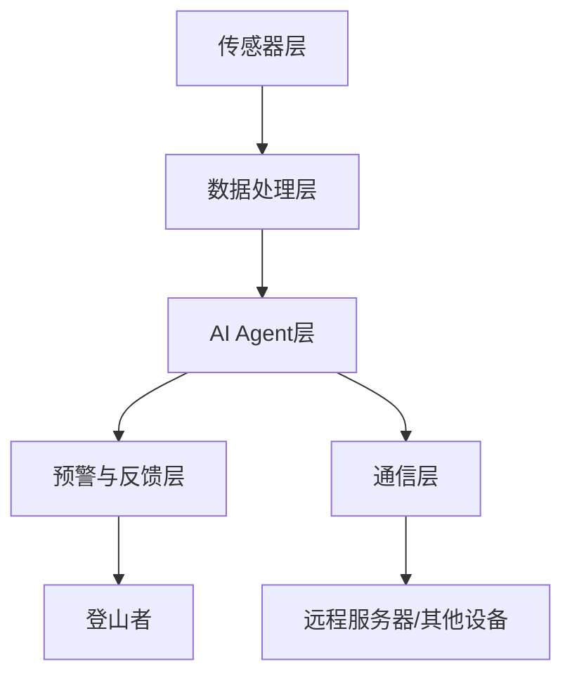

# AI Agent在智能登山装备中的高原反应预防

> 关键词：AI Agent、智能登山装备、高原反应预防、传感器技术、数据分析

> 摘要：本文聚焦于AI Agent在智能登山装备中对高原反应预防的应用。首先介绍了相关背景，包括目的范围、预期读者等内容。接着阐述了AI Agent、智能登山装备及高原反应预防的核心概念与联系，并通过流程图进行清晰展示。深入讲解了核心算法原理，利用Python代码详细说明。呈现了相关数学模型和公式，并举例说明。通过项目实战，从开发环境搭建到源代码实现与解读，全面展示了技术的实际应用。探讨了该技术在登山等场景中的实际应用，推荐了学习资源、开发工具框架及相关论文著作。最后总结了未来发展趋势与挑战，还提供了常见问题解答及参考资料，旨在为利用AI Agent提升智能登山装备预防高原反应的能力提供全面且深入的技术指导。

## 1. 背景介绍 
### 1.1 目的和范围
随着登山运动的日益普及，越来越多的人选择挑战高海拔山峰。然而，高原反应是登山者面临的重大健康风险之一，严重时甚至会危及生命。本研究的目的在于探讨如何将AI Agent应用于智能登山装备中，实现对高原反应的有效预防。范围涵盖了AI Agent的原理与应用、智能登山装备的相关技术，以及高原反应的生理机制和预防方法。通过结合这些领域的知识，旨在开发出能够实时监测登山者身体状况和环境信息，并提前预警高原反应的智能登山装备。

### 1.2 预期读者
本文的预期读者包括从事人工智能、智能硬件开发的专业技术人员，登山装备制造商，登山爱好者以及对高原医学和智能健康监测感兴趣的研究人员。对于技术人员，本文提供了AI Agent在智能登山装备中应用的详细技术方案和实现思路；对于登山装备制造商，有助于了解如何将先进的AI技术融入产品中，提升产品的竞争力；对于登山爱好者，能让他们了解智能登山装备在预防高原反应方面的作用和优势；对于研究人员，则为进一步的研究提供了理论和实践参考。

### 1.3 文档结构概述
本文将按照以下结构展开：首先介绍背景信息，包括目的范围、预期读者和文档结构概述等；接着阐述核心概念与联系，包括AI Agent、智能登山装备和高原反应预防的相关概念及它们之间的关系；然后详细讲解核心算法原理和具体操作步骤，通过Python代码进行说明；再介绍相关的数学模型和公式，并举例说明；之后进行项目实战，包括开发环境搭建、源代码实现和代码解读；探讨实际应用场景；推荐学习资源、开发工具框架和相关论文著作；最后总结未来发展趋势与挑战，提供常见问题解答和参考资料。

### 1.4 术语表
#### 1.4.1 核心术语定义
- **AI Agent（人工智能智能体）**：是一种能够感知环境、进行决策并采取行动的智能实体。在本文中，AI Agent通过分析智能登山装备收集的各种数据，对登山者的高原反应风险进行评估和预警。
- **智能登山装备**：指集成了传感器、数据处理模块和通信模块等技术的登山装备，如智能手表、智能头盔等，能够实时监测登山者的身体状况和环境信息。
- **高原反应**：是人到达一定海拔高度后，身体为适应因海拔高度而造成的气压差、含氧量少、空气干燥等变化，而产生的自然生理反应。

#### 1.4.2 相关概念解释
- **传感器技术**：是智能登山装备获取数据的关键技术，包括心率传感器、血氧传感器、气压传感器等，能够实时监测登山者的身体参数和环境参数。
- **数据分析**：对传感器收集到的数据进行处理和分析，提取有价值的信息，以便AI Agent进行决策。
- **预警系统**：根据AI Agent的分析结果，当登山者的高原反应风险达到一定程度时，发出警报，提醒登山者采取相应的措施。

#### 1.4.3 缩略词列表
- **AI**：Artificial Intelligence（人工智能）
- **ECG**：Electrocardiogram（心电图）
- **SpO₂**：Blood Oxygen Saturation（血氧饱和度）

## 2. 核心概念与联系 

### 核心概念原理
#### AI Agent原理
AI Agent的核心原理是基于感知、决策和行动的循环过程。它通过传感器感知环境信息，将这些信息输入到决策模块中，决策模块根据预设的规则或学习到的模型进行分析和判断，然后输出相应的行动指令。在智能登山装备中，AI Agent通过传感器收集登山者的身体参数（如心率、血氧饱和度等）和环境参数（如气压、温度等），分析这些数据以评估登山者的高原反应风险，并根据评估结果发出预警或提供建议。

#### 智能登山装备原理
智能登山装备集成了多种传感器和数据处理模块。传感器负责实时采集登山者的身体状况和环境信息，数据处理模块对采集到的数据进行初步处理和存储，并将其传输到AI Agent进行进一步分析。智能登山装备还具备通信功能，能够将数据传输到远程服务器或其他设备，以便登山者或相关人员进行实时监测。

#### 高原反应预防原理
高原反应的预防主要基于对登山者身体状况和环境因素的监测和分析。通过实时监测登山者的心率、血氧饱和度等生理指标，结合环境的气压、温度等因素，可以判断登山者是否存在高原反应的风险。当风险达到一定程度时，及时采取相应的措施，如休息、吸氧等，以预防高原反应的发生。

### 架构的文本示意图
智能登山装备中的AI Agent系统主要由以下几个部分组成：
1. **传感器层**：包括心率传感器、血氧传感器、气压传感器、温度传感器等，负责实时采集登山者的身体参数和环境参数。
2. **数据处理层**：对传感器采集到的数据进行初步处理，如滤波、降噪等，然后将处理后的数据存储在本地存储器中。
3. **AI Agent层**：接收数据处理层传输的数据，运用预设的算法和模型对数据进行分析，评估登山者的高原反应风险，并根据评估结果做出决策。
4. **预警与反馈层**：根据AI Agent的决策结果，发出相应的预警信息，如声音警报、震动提醒等，并向登山者提供预防高原反应的建议。
5. **通信层**：负责将智能登山装备采集的数据和AI Agent的决策结果传输到远程服务器或其他设备，以便登山者或相关人员进行实时监测和管理。

### Mermaid流程图


## 3. 核心算法原理 & 具体操作步骤 

### 核心算法原理
在智能登山装备中，AI Agent主要采用机器学习算法来评估登山者的高原反应风险。常用的机器学习算法包括逻辑回归、决策树、支持向量机等。这里以逻辑回归算法为例进行说明。

逻辑回归是一种二分类算法，它通过对输入数据进行线性组合，然后经过逻辑函数（如Sigmoid函数）将结果映射到[0, 1]区间，得到一个概率值。在高原反应风险评估中，逻辑回归算法根据登山者的身体参数（如心率、血氧饱和度等）和环境参数（如气压、温度等），计算登山者发生高原反应的概率。

### 具体操作步骤
#### 数据收集
使用智能登山装备中的传感器实时收集登山者的身体参数和环境参数，包括心率、血氧饱和度、气压、温度等。

#### 数据预处理
对收集到的数据进行预处理，包括数据清洗、缺失值处理、异常值处理等。例如，对于缺失的心率数据，可以采用均值填充的方法进行处理；对于异常高或异常低的血氧饱和度数据，可以将其视为无效数据进行剔除。

#### 特征选择
从预处理后的数据中选择与高原反应风险相关的特征，如心率、血氧饱和度、气压等。可以使用相关性分析、特征重要性排序等方法进行特征选择。

#### 模型训练
使用训练数据集对逻辑回归模型进行训练。训练数据集包括登山者的身体参数、环境参数和对应的高原反应标签（发生或未发生）。通过不断调整模型的参数，使得模型能够准确地预测登山者的高原反应风险。

#### 模型评估
使用测试数据集对训练好的模型进行评估，计算模型的准确率、召回率、F1值等指标，评估模型的性能。

#### 实时预测
将实时收集到的数据输入到训练好的模型中，计算登山者发生高原反应的概率。当概率超过设定的阈值时，发出预警信息。

### Python源代码实现
```python
import numpy as np
from sklearn.linear_model import LogisticRegression
from sklearn.model_selection import train_test_split
from sklearn.metrics import accuracy_score, recall_score, f1_score

# 模拟数据收集
# 假设有100个样本，每个样本有4个特征（心率、血氧饱和度、气压、温度）和1个标签（高原反应标签）
np.random.seed(42)
X = np.random.rand(100, 4)  # 特征数据
y = np.random.randint(0, 2, 100)  # 标签数据

# 数据预处理（这里简单示例，实际中需要更复杂的处理）
# 假设没有缺失值和异常值，不需要特殊处理

# 特征选择（这里简单选择所有特征）
selected_features = X

# 划分训练集和测试集
X_train, X_test, y_train, y_test = train_test_split(selected_features, y, test_size=0.2, random_state=42)

# 模型训练
model = LogisticRegression()
model.fit(X_train, y_train)

# 模型评估
y_pred = model.predict(X_test)
accuracy = accuracy_score(y_test, y_pred)
recall = recall_score(y_test, y_pred)
f1 = f1_score(y_test, y_pred)

print(f"Accuracy: {accuracy}")
print(f"Recall: {recall}")
print(f"F1 Score: {f1}")

# 实时预测
new_data = np.random.rand(1, 4)  # 模拟实时收集的数据
probability = model.predict_proba(new_data)[:, 1]  # 计算发生高原反应的概率
threshold = 0.5  # 设定阈值
if probability > threshold:
    print("Warning: High risk of altitude sickness!")
else:
    print("Low risk of altitude sickness.")
```

## 4. 数学模型和公式 & 详细讲解 & 举例说明 

### 逻辑回归数学模型
逻辑回归的数学模型可以表示为：
$$P(y = 1|x) = \frac{1}{1 + e^{-(w_0 + w_1x_1 + w_2x_2 + \cdots + w_nx_n)}}$$
其中，$P(y = 1|x)$ 表示在给定特征 $x = [x_1, x_2, \cdots, x_n]$ 的情况下，样本属于正类（发生高原反应）的概率；$w_0, w_1, w_2, \cdots, w_n$ 是模型的参数；$e$ 是自然常数。

### 详细讲解
逻辑回归模型通过对输入特征进行线性组合，得到一个线性回归值 $z = w_0 + w_1x_1 + w_2x_2 + \cdots + w_nx_n$。然后，将线性回归值 $z$ 输入到Sigmoid函数 $\sigma(z) = \frac{1}{1 + e^{-z}}$ 中，将其映射到[0, 1]区间，得到一个概率值。当概率值大于设定的阈值时，将样本预测为正类；否则，预测为负类。

### 举例说明
假设我们有一个简单的逻辑回归模型，用于预测登山者的高原反应风险。模型的输入特征包括心率 $x_1$ 和血氧饱和度 $x_2$，模型的参数为 $w_0 = -2$，$w_1 = 0.5$，$w_2 = -0.3$。现在有一个登山者，其心率为80次/分钟，血氧饱和度为90%，我们可以计算该登山者发生高原反应的概率：
1. 计算线性回归值 $z$：
$$z = w_0 + w_1x_1 + w_2x_2 = -2 + 0.5\times80 + (-0.3)\times90 = -2 + 40 - 27 = 11$$
2. 计算概率值 $P(y = 1|x)$：
$$P(y = 1|x) = \frac{1}{1 + e^{-z}} = \frac{1}{1 + e^{-11}} \approx 0.9999$$
由于概率值接近1，我们可以预测该登山者发生高原反应的风险很高。

## 5. 项目实战：代码实际案例和详细解释说明 

### 5.1  开发环境搭建
#### 硬件环境
- **智能登山装备**：选择一款集成了心率传感器、血氧传感器、气压传感器、温度传感器等多种传感器的智能手表或智能头盔。
- **开发板**：选择一款性能稳定、易于开发的开发板，如Arduino、Raspberry Pi等。
- **通信模块**：选择一款支持无线通信的模块，如蓝牙模块、Wi-Fi模块等，用于将智能登山装备采集的数据传输到开发板或远程服务器。

#### 软件环境
- **开发语言**：选择Python作为开发语言，因为Python具有丰富的机器学习库和数据处理库，方便进行算法实现和数据处理。
- **开发工具**：选择PyCharm作为开发工具，它提供了强大的代码编辑、调试和运行功能。
- **机器学习库**：安装scikit-learn、numpy、pandas等机器学习库，用于实现逻辑回归算法和数据处理。

### 5.2  源代码详细实现和代码解读
#### 传感器数据采集代码
```python
import time
import random

# 模拟传感器数据采集
def read_heart_rate():
    return random.randint(60, 120)  # 模拟心率数据

def read_blood_oxygen():
    return random.randint(80, 100)  # 模拟血氧饱和度数据

def read_air_pressure():
    return random.uniform(900, 1100)  # 模拟气压数据

def read_temperature():
    return random.uniform(0, 30)  # 模拟温度数据

while True:
    heart_rate = read_heart_rate()
    blood_oxygen = read_blood_oxygen()
    air_pressure = read_air_pressure()
    temperature = read_temperature()
    print(f"Heart Rate: {heart_rate} bpm, Blood Oxygen: {blood_oxygen}%, Air Pressure: {air_pressure} hPa, Temperature: {temperature} °C")
    time.sleep(1)  # 每隔1秒采集一次数据
```
代码解读：
- `read_heart_rate()` 函数用于模拟心率数据的采集，返回一个60到120之间的随机整数。
- `read_blood_oxygen()` 函数用于模拟血氧饱和度数据的采集，返回一个80到100之间的随机整数。
- `read_air_pressure()` 函数用于模拟气压数据的采集，返回一个900到1100之间的随机浮点数。
- `read_temperature()` 函数用于模拟温度数据的采集，返回一个0到30之间的随机浮点数。
- `while True` 循环用于不断采集数据，并将采集到的数据打印输出，每隔1秒采集一次数据。

#### 逻辑回归模型训练和预测代码
```python
import numpy as np
from sklearn.linear_model import LogisticRegression

# 模拟训练数据
np.random.seed(42)
X_train = np.random.rand(100, 4)  # 特征数据
y_train = np.random.randint(0, 2, 100)  # 标签数据

# 模型训练
model = LogisticRegression()
model.fit(X_train, y_train)

# 模拟实时数据采集和预测
heart_rate = 80
blood_oxygen = 90
air_pressure = 1000
temperature = 20

new_data = np.array([[heart_rate, blood_oxygen, air_pressure, temperature]])
probability = model.predict_proba(new_data)[:, 1]  # 计算发生高原反应的概率
threshold = 0.5  # 设定阈值
if probability > threshold:
    print("Warning: High risk of altitude sickness!")
else:
    print("Low risk of altitude sickness.")
```
代码解读：
- 首先，模拟了100个训练样本，每个样本有4个特征（心率、血氧饱和度、气压、温度）和1个标签（高原反应标签）。
- 然后，使用 `LogisticRegression()` 函数创建一个逻辑回归模型，并使用训练数据对模型进行训练。
- 接着，模拟实时数据采集，获取心率、血氧饱和度、气压和温度数据。
- 最后，将实时数据输入到训练好的模型中，计算发生高原反应的概率，并根据概率值和阈值判断是否发出预警信息。

### 5.3  代码解读与分析
#### 传感器数据采集代码分析
该代码通过模拟函数实现了传感器数据的采集，实际应用中需要根据具体的传感器型号和接口协议进行修改。在采集数据时，需要注意数据的准确性和稳定性，可以采用滤波、校准等方法提高数据质量。

#### 逻辑回归模型训练和预测代码分析
该代码使用了逻辑回归算法对高原反应风险进行预测，实际应用中可以根据具体情况选择更合适的机器学习算法，如决策树、支持向量机等。在模型训练时，需要注意数据的平衡性和多样性，避免过拟合和欠拟合问题。同时，需要定期更新模型，以适应不同的登山环境和登山者个体差异。

## 6. 实际应用场景 
### 登山运动
在登山运动中，智能登山装备中的AI Agent可以实时监测登山者的身体状况和环境信息，提前预警高原反应的风险。当登山者的高原反应风险达到一定程度时，AI Agent会发出警报，提醒登山者采取相应的措施，如休息、吸氧等，从而有效预防高原反应的发生，保障登山者的生命安全。

### 高原旅游
对于高原旅游爱好者来说，智能登山装备中的AI Agent可以提供个性化的高原反应预防建议。根据旅游路线和行程安排，AI Agent可以提前预测高原反应的风险，并根据登山者的身体状况和环境信息，提供合理的休息、饮食和运动建议，帮助游客更好地适应高原环境，提高旅游的舒适度和安全性。

### 高原科考
在高原科考活动中，智能登山装备中的AI Agent可以为科考人员提供实时的健康监测和高原反应预警。科考人员在高原地区进行长时间的科学研究，面临着较大的高原反应风险。AI Agent可以实时监测科考人员的身体状况，及时发现潜在的健康问题，并提供相应的医疗建议，保障科考人员的身体健康和科研工作的顺利进行。

## 7. 工具和资源推荐
### 7.1 学习资源推荐
#### 7.1.1 书籍推荐
- 《机器学习》（周志华著）：全面介绍了机器学习的基本概念、算法和应用，是机器学习领域的经典教材。
- 《Python机器学习实战》（Sebastian Raschka著）：通过实际案例详细介绍了Python在机器学习中的应用，适合初学者学习。
- 《人工智能：一种现代的方法》（Stuart Russell、Peter Norvig著）：系统介绍了人工智能的基本理论、算法和应用，是人工智能领域的权威著作。

#### 7.1.2 在线课程
- Coursera上的“Machine Learning”课程（Andrew Ng教授主讲）：是机器学习领域的经典在线课程，全面介绍了机器学习的基本概念、算法和应用。
- edX上的“Artificial Intelligence”课程（麻省理工学院开设）：系统介绍了人工智能的基本理论、算法和应用，适合有一定编程基础的学习者。
- 中国大学MOOC上的“Python语言程序设计”课程（嵩天教授主讲）：全面介绍了Python语言的基本语法和应用，适合初学者学习。

#### 7.1.3 技术博客和网站
- Medium：是一个技术博客平台，上面有很多关于人工智能、机器学习和智能硬件的技术文章和案例分享。
- Towards Data Science：是一个专注于数据科学和机器学习的技术博客，上面有很多高质量的技术文章和教程。
- Kaggle：是一个数据科学竞赛平台，上面有很多关于机器学习和数据分析的数据集和竞赛项目，可以帮助学习者提高实践能力。

### 7.2 开发工具框架推荐
#### 7.2.1 IDE和编辑器
- PyCharm：是一款专门为Python开发设计的集成开发环境，提供了强大的代码编辑、调试和运行功能，适合Python开发者使用。
- Visual Studio Code：是一款轻量级的代码编辑器，支持多种编程语言和插件扩展，适合快速开发和调试。
- Jupyter Notebook：是一个交互式的笔记本环境，支持Python、R等多种编程语言，适合数据探索和模型实验。

#### 7.2.2 调试和性能分析工具
- PDB：是Python自带的调试工具，可以帮助开发者定位和解决代码中的问题。
- cProfile：是Python自带的性能分析工具，可以帮助开发者分析代码的性能瓶颈。
- TensorBoard：是TensorFlow的可视化工具，可以帮助开发者可视化模型的训练过程和性能指标。

#### 7.2.3 相关框架和库
- scikit-learn：是一个常用的机器学习库，提供了丰富的机器学习算法和工具，适合初学者和中级开发者使用。
- TensorFlow：是一个开源的深度学习框架，提供了强大的深度学习模型训练和部署功能，适合高级开发者使用。
- PyTorch：是一个开源的深度学习框架，提供了动态图和静态图两种编程模式，适合科研人员和开发者使用。

### 7.3 相关论文著作推荐
#### 7.3.1 经典论文
- “A Logical Calculus of the Ideas Immanent in Nervous Activity”（Warren S. McCulloch、Walter Pitts著）：是神经网络领域的经典论文，提出了神经元模型和神经网络的基本概念。
- “A Mathematical Theory of Communication”（Claude E. Shannon著）：是信息论领域的经典论文，奠定了现代通信理论的基础。
- “Gradient-Based Learning Applied to Document Recognition”（Yann LeCun、Léon Bottou、Yoshua Bengio、Patrick Haffner著）：是深度学习领域的经典论文，提出了卷积神经网络（CNN）的概念和应用。

#### 7.3.2 最新研究成果
- 关注顶级学术会议，如NeurIPS（神经信息处理系统大会）、ICML（国际机器学习会议）、CVPR（计算机视觉与模式识别会议）等，了解人工智能和机器学习领域的最新研究成果。
- 关注顶级学术期刊，如Journal of Artificial Intelligence Research（JAIR）、Artificial Intelligence（AI）、IEEE Transactions on Pattern Analysis and Machine Intelligence（TPAMI）等，了解人工智能和机器学习领域的最新研究进展。

#### 7.3.3 应用案例分析
- 分析一些实际应用案例，如智能医疗、智能交通、智能安防等领域的应用案例，了解AI Agent在不同领域的应用场景和实现方法。
- 参考一些开源项目，如OpenAI Gym、TensorFlow Object Detection API等，了解AI Agent的具体实现和应用。

## 8. 总结：未来发展趋势与挑战
### 未来发展趋势
#### 多模态数据融合
未来的智能登山装备将集成更多类型的传感器，如加速度传感器、陀螺仪传感器等，实现多模态数据的融合。通过综合分析多种数据，可以更全面、准确地评估登山者的身体状况和高原反应风险。

#### 个性化预防方案
随着人工智能技术的不断发展，AI Agent将能够根据登山者的个体差异，如年龄、性别、身体状况等，提供个性化的高原反应预防方案。个性化预防方案将更加符合登山者的实际需求，提高预防效果。

#### 智能交互与决策支持
未来的智能登山装备将具备更强大的智能交互功能，如语音交互、手势交互等。登山者可以通过与智能登山装备进行交互，获取实时的健康信息和高原反应预防建议。同时，AI Agent将能够根据登山者的当前状况和环境信息，提供智能决策支持，帮助登山者做出更合理的决策。

### 挑战
#### 数据质量和隐私保护
智能登山装备采集的大量数据是AI Agent进行决策的基础，因此数据的质量至关重要。然而，在实际应用中，传感器数据可能存在噪声、缺失值等问题，影响数据的质量。同时，登山者的个人健康数据属于敏感信息，需要加强隐私保护，防止数据泄露。

#### 算法复杂度和计算资源
随着智能登山装备功能的不断增加和数据量的不断增大，AI Agent所使用的算法复杂度也会相应增加。这将对智能登山装备的计算资源提出更高的要求，需要在算法优化和硬件设计方面进行改进，以满足实际应用的需求。

#### 环境适应性和可靠性
登山环境复杂多变，智能登山装备需要具备良好的环境适应性和可靠性。在高海拔、低温、强风等恶劣环境下，智能登山装备的传感器和电子元件可能会受到影响，导致数据采集不准确或设备故障。因此，需要加强智能登山装备的环境适应性和可靠性设计。

## 9. 附录：常见问题与解答
### 1. 智能登山装备中的AI Agent如何保证数据的准确性？
智能登山装备中的AI Agent通过多种方式保证数据的准确性。首先，选择高精度、高可靠性的传感器，确保数据采集的准确性。其次，对采集到的数据进行预处理，如滤波、降噪、校准等，去除噪声和误差。此外，还可以采用多传感器融合的方法，综合分析多种传感器的数据，提高数据的准确性和可靠性。

### 2. 智能登山装备中的AI Agent如何进行模型更新？
智能登山装备中的AI Agent可以通过以下方式进行模型更新：
- **在线学习**：在智能登山装备中集成在线学习算法，实时更新模型参数，以适应不同的登山环境和登山者个体差异。
- **远程更新**：通过无线通信模块将智能登山装备采集的数据传输到远程服务器，在服务器上进行模型训练和更新，然后将更新后的模型传输到智能登山装备中。

### 3. 智能登山装备中的AI Agent能否替代医生的诊断？
智能登山装备中的AI Agent不能替代医生的诊断。AI Agent只是根据采集到的数据和预设的模型对登山者的高原反应风险进行评估和预警，提供参考建议。医生的诊断需要综合考虑更多的因素，如登山者的病史、症状、体征等，因此，在出现高原反应症状时，应及时就医，接受专业的诊断和治疗。

## 10. 扩展阅读 & 参考资料
### 扩展阅读
- 《智能硬件开发实战》：详细介绍了智能硬件的开发流程和技术，包括传感器技术、数据处理技术、通信技术等，适合对智能硬件开发感兴趣的读者阅读。
- 《人工智能与健康医疗》：探讨了人工智能在健康医疗领域的应用，包括疾病诊断、健康管理、药物研发等，适合对人工智能和健康医疗交叉领域感兴趣的读者阅读。
- 《高原医学》：系统介绍了高原医学的基本理论、诊断和治疗方法，包括高原反应的生理机制、预防和治疗措施等，适合对高原医学感兴趣的读者阅读。

### 参考资料
- 相关学术论文和研究报告，如在IEEE、ACM等学术数据库中搜索关于AI Agent、智能登山装备和高原反应预防的相关论文。
- 智能登山装备制造商的产品说明书和技术文档，了解智能登山装备的功能和技术参数。
- 登山协会和高原医学研究机构发布的相关指南和标准，了解登山运动和高原反应预防的最新要求和建议。