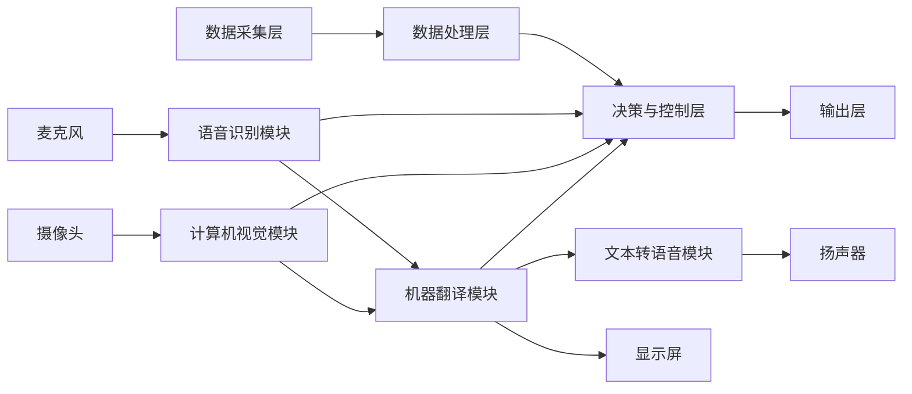

# AI Agent在智能眼镜中的实时翻译功能

> 关键词：AI Agent、智能眼镜、实时翻译、自然语言处理、计算机视觉

> 摘要：本文深入探讨了AI Agent在智能眼镜中实现实时翻译功能的相关技术。首先介绍了该技术的背景，包括目的、预期读者、文档结构和相关术语。接着阐述了核心概念与联系，详细讲解了核心算法原理及具体操作步骤，给出了数学模型和公式并举例说明。通过项目实战，展示了代码实际案例及详细解释。还探讨了实际应用场景，推荐了相关工具和资源。最后总结了未来发展趋势与挑战，并提供了常见问题解答和扩展阅读参考资料，旨在为该领域的研究和开发提供全面的技术指导。

## 1. 背景介绍 
### 1.1 目的和范围
智能眼镜作为一种新兴的可穿戴设备，具有广阔的应用前景。其中，实时翻译功能能够打破语言障碍，方便人们在跨语言环境下的交流与沟通。本文的目的在于详细介绍AI Agent如何在智能眼镜中实现实时翻译功能，包括相关技术原理、算法实现、项目实战以及实际应用场景等方面。范围涵盖了从基础概念到具体实现的各个环节，旨在为相关技术人员和研究者提供全面的技术参考。

### 1.2 预期读者
本文预期读者包括人工智能领域的研究人员、智能眼镜开发者、自然语言处理工程师、计算机视觉工程师以及对智能可穿戴设备和实时翻译技术感兴趣的技术爱好者。

### 1.3 文档结构概述
本文将按照以下结构进行阐述：首先介绍背景信息，包括目的、预期读者、文档结构和术语表；接着讲解核心概念与联系，包括相关原理和架构的文本示意图及Mermaid流程图；然后详细说明核心算法原理及具体操作步骤，并给出Python源代码；再介绍数学模型和公式并举例说明；通过项目实战展示代码实际案例和详细解释；探讨实际应用场景；推荐相关工具和资源；最后总结未来发展趋势与挑战，提供常见问题解答和扩展阅读参考资料。

### 1.4 术语表
#### 1.4.1 核心术语定义
- **AI Agent**：人工智能代理，是一种能够感知环境、做出决策并采取行动以实现特定目标的智能实体。
- **智能眼镜**：一种可穿戴的智能设备，通常集成了摄像头、麦克风、显示屏等多种传感器和硬件组件，具备一定的计算和处理能力。
- **实时翻译**：在短时间内将一种语言的语音或文本转换为另一种语言的语音或文本的过程。
- **自然语言处理（NLP）**：研究如何让计算机理解、处理和生成人类语言的技术领域。
- **计算机视觉（CV）**：研究如何让计算机从图像或视频中提取信息、理解场景的技术领域。

#### 1.4.2 相关概念解释
- **语音识别（ASR）**：将语音信号转换为文本的技术，是实时翻译的前端环节。
- **机器翻译（MT）**：将一种自然语言的文本转换为另一种自然语言的文本的技术。
- **文本转语音（TTS）**：将文本转换为语音的技术，用于将翻译后的文本以语音形式输出。

#### 1.4.3 缩略词列表
- **ASR**：Automatic Speech Recognition（自动语音识别）
- **MT**：Machine Translation（机器翻译）
- **TTS**：Text-to-Speech（文本转语音）
- **NLP**：Natural Language Processing（自然语言处理）
- **CV**：Computer Vision（计算机视觉）

## 2. 核心概念与联系 

### 核心概念原理
AI Agent在智能眼镜中实现实时翻译功能主要涉及自然语言处理和计算机视觉两个核心领域。其工作原理是通过智能眼镜的麦克风采集语音信号，利用语音识别技术将其转换为文本；然后使用机器翻译技术将源语言文本转换为目标语言文本；最后通过文本转语音技术将翻译后的文本转换为语音输出。同时，计算机视觉技术可以辅助实时翻译，例如识别图像中的文字并进行翻译。

### 架构的文本示意图
智能眼镜的实时翻译系统架构主要包括以下几个部分：
1. **数据采集层**：由智能眼镜的麦克风和摄像头组成，负责采集语音和图像数据。
2. **数据处理层**：包括语音识别模块、机器翻译模块、文本转语音模块和计算机视觉模块。语音识别模块将语音信号转换为文本；机器翻译模块将源语言文本转换为目标语言文本；文本转语音模块将翻译后的文本转换为语音；计算机视觉模块用于识别图像中的文字。
3. **决策与控制层**：AI Agent作为核心决策单元，负责协调各个模块的工作，根据不同的场景和需求做出决策。
4. **输出层**：通过智能眼镜的扬声器和显示屏输出翻译后的语音和文本。

### Mermaid 流程图


## 3. 核心算法原理 & 具体操作步骤 

### 语音识别算法原理
语音识别的核心是将语音信号转换为文本。目前，常用的语音识别算法是基于深度学习的端到端模型，如基于Transformer架构的Wav2Vec 2.0。其原理是通过神经网络直接从语音信号中学习特征，然后将其映射到对应的文本序列。

以下是一个简单的使用Python和SpeechRecognition库进行语音识别的示例代码：
```python
import speech_recognition as sr

# 创建一个Recognizer对象
r = sr.Recognizer()

# 使用麦克风作为音频源
with sr.Microphone() as source:
    print("请说话...")
    audio = r.listen(source)

try:
    # 使用Google Web Speech API进行语音识别
    text = r.recognize_google(audio, language='zh-CN')
    print("识别结果: " + text)
except sr.UnknownValueError:
    print("无法识别语音")
except sr.RequestError as e:
    print("请求错误; {0}".format(e))
```
### 机器翻译算法原理
机器翻译的主要任务是将一种语言的文本转换为另一种语言的文本。目前，基于Transformer架构的神经机器翻译模型（如Google的Transformer模型、OpenAI的GPT系列）在机器翻译领域取得了很好的效果。其原理是通过编码器-解码器架构，将源语言文本编码为中间表示，然后解码器根据中间表示生成目标语言文本。

以下是一个使用Python和transformers库进行机器翻译的示例代码：
```python
from transformers import AutoTokenizer, AutoModelForSeq2SeqLM

# 加载预训练的翻译模型和分词器
tokenizer = AutoTokenizer.from_pretrained("Helsinki-NLP/opus-mt-zh-en")
model = AutoModelForSeq2SeqLM.from_pretrained("Helsinki-NLP/opus-mt-zh-en")

# 待翻译的文本
text = "你好，世界！"

# 对文本进行分词
input_ids = tokenizer(text, return_tensors="pt").input_ids

# 进行翻译
outputs = model.generate(input_ids)

# 将翻译结果解码为文本
translation = tokenizer.decode(outputs[0], skip_special_tokens=True)
print("翻译结果: " + translation)
```
### 文本转语音算法原理
文本转语音的主要任务是将文本转换为语音。目前，常用的文本转语音算法是基于深度学习的端到端模型，如Tacotron 2和WaveGlow。其原理是通过神经网络将文本转换为语音的频谱表示，然后通过声码器将频谱表示转换为语音信号。

以下是一个使用Python和gTTS库进行文本转语音的示例代码：
```python
from gtts import gTTS
import os

# 待转换的文本
text = "Hello, world!"

# 创建gTTS对象
tts = gTTS(text=text, lang='en')

# 保存语音文件
tts.save("output.mp3")

# 播放语音文件
os.system("mpg321 output.mp3")
```
### 具体操作步骤
1. **语音采集**：智能眼镜的麦克风采集语音信号。
2. **语音识别**：使用语音识别算法将语音信号转换为文本。
3. **机器翻译**：将识别得到的源语言文本使用机器翻译算法转换为目标语言文本。
4. **文本转语音**：将翻译后的目标语言文本使用文本转语音算法转换为语音。
5. **输出结果**：通过智能眼镜的扬声器输出翻译后的语音，通过显示屏显示翻译后的文本。

## 4. 数学模型和公式 & 详细讲解 & 举例说明 

### 语音识别的数学模型
语音识别可以看作是一个寻找最可能的文本序列 $\mathbf{w}$ 来匹配输入语音信号 $\mathbf{x}$ 的过程，即求解 $P(\mathbf{w}|\mathbf{x})$ 的最大值。根据贝叶斯定理，有：
$$P(\mathbf{w}|\mathbf{x}) = \frac{P(\mathbf{x}|\mathbf{w})P(\mathbf{w})}{P(\mathbf{x})}$$
其中，$P(\mathbf{x}|\mathbf{w})$ 是声学模型，表示给定文本序列 $\mathbf{w}$ 时语音信号 $\mathbf{x}$ 的概率；$P(\mathbf{w})$ 是语言模型，表示文本序列 $\mathbf{w}$ 出现的概率；$P(\mathbf{x})$ 是语音信号 $\mathbf{x}$ 出现的概率，在求解最大值时可以忽略。

例如，在一个简单的语音识别任务中，假设语音信号 $\mathbf{x}$ 对应的可能文本序列有 $\mathbf{w}_1$ 和 $\mathbf{w}_2$，通过声学模型和语言模型计算得到 $P(\mathbf{x}|\mathbf{w}_1)P(\mathbf{w}_1) = 0.6$，$P(\mathbf{x}|\mathbf{w}_2)P(\mathbf{w}_2) = 0.4$，则最可能的文本序列为 $\mathbf{w}_1$。

### 机器翻译的数学模型
机器翻译可以看作是一个寻找最可能的目标语言文本序列 $\mathbf{y}$ 来匹配源语言文本序列 $\mathbf{x}$ 的过程，即求解 $P(\mathbf{y}|\mathbf{x})$ 的最大值。同样根据贝叶斯定理，有：
$$P(\mathbf{y}|\mathbf{x}) = \frac{P(\mathbf{x}|\mathbf{y})P(\mathbf{y})}{P(\mathbf{x})}$$
其中，$P(\mathbf{x}|\mathbf{y})$ 是翻译模型，表示给定目标语言文本序列 $\mathbf{y}$ 时源语言文本序列 $\mathbf{x}$ 的概率；$P(\mathbf{y})$ 是目标语言的语言模型，表示目标语言文本序列 $\mathbf{y}$ 出现的概率；$P(\mathbf{x})$ 是源语言文本序列 $\mathbf{x}$ 出现的概率，在求解最大值时可以忽略。

例如，在一个简单的机器翻译任务中，假设源语言文本序列 $\mathbf{x}$ 对应的可能目标语言文本序列有 $\mathbf{y}_1$ 和 $\mathbf{y}_2$，通过翻译模型和语言模型计算得到 $P(\mathbf{x}|\mathbf{y}_1)P(\mathbf{y}_1) = 0.7$，$P(\mathbf{x}|\mathbf{y}_2)P(\mathbf{y}_2) = 0.3$，则最可能的目标语言文本序列为 $\mathbf{y}_1$。

### 文本转语音的数学模型
文本转语音可以看作是一个将文本序列 $\mathbf{w}$ 转换为语音频谱序列 $\mathbf{s}$ 的过程，即求解 $P(\mathbf{s}|\mathbf{w})$ 的最大值。在基于深度学习的端到端模型中，通常通过神经网络直接学习文本序列 $\mathbf{w}$ 到语音频谱序列 $\mathbf{s}$ 的映射关系。

例如，在Tacotron 2模型中，输入是文本序列 $\mathbf{w}$，经过编码器得到中间表示 $\mathbf{h}$，然后解码器根据中间表示 $\mathbf{h}$ 生成语音频谱序列 $\mathbf{s}$。通过训练大量的文本-语音对，模型可以学习到文本序列 $\mathbf{w}$ 到语音频谱序列 $\mathbf{s}$ 的最优映射关系。

## 5. 项目实战：代码实际案例和详细解释说明 

### 5.1  开发环境搭建
1. **安装Python**：建议使用Python 3.7及以上版本，可以从Python官方网站（https://www.python.org/downloads/）下载安装。
2. **安装必要的库**：使用pip命令安装SpeechRecognition、transformers、gTTS等库。
```bash
pip install SpeechRecognition transformers gTTS
```
3. **配置开发环境**：可以使用PyCharm、VS Code等集成开发环境进行代码开发和调试。

### 5.2  源代码详细实现和代码解读
以下是一个完整的AI Agent在智能眼镜中实现实时翻译功能的示例代码：
```python
import speech_recognition as sr
from transformers import AutoTokenizer, AutoModelForSeq2SeqLM
from gtts import gTTS
import os

# 加载预训练的翻译模型和分词器
tokenizer = AutoTokenizer.from_pretrained("Helsinki-NLP/opus-mt-zh-en")
model = AutoModelForSeq2SeqLM.from_pretrained("Helsinki-NLP/opus-mt-zh-en")

# 创建一个Recognizer对象
r = sr.Recognizer()

while True:
    try:
        # 使用麦克风作为音频源
        with sr.Microphone() as source:
            print("请说话...")
            audio = r.listen(source)

        # 使用Google Web Speech API进行语音识别
        text = r.recognize_google(audio, language='zh-CN')
        print("识别结果: " + text)

        # 对文本进行分词
        input_ids = tokenizer(text, return_tensors="pt").input_ids

        # 进行翻译
        outputs = model.generate(input_ids)

        # 将翻译结果解码为文本
        translation = tokenizer.decode(outputs[0], skip_special_tokens=True)
        print("翻译结果: " + translation)

        # 创建gTTS对象
        tts = gTTS(text=translation, lang='en')

        # 保存语音文件
        tts.save("output.mp3")

        # 播放语音文件
        os.system("mpg321 output.mp3")

    except sr.UnknownValueError:
        print("无法识别语音")
    except sr.RequestError as e:
        print("请求错误; {0}".format(e))
    except Exception as e:
        print("发生错误: {0}".format(e))
```
### 5.3  代码解读与分析
1. **语音识别部分**：使用`speech_recognition`库的`Recognizer`对象监听麦克风输入的语音信号，然后使用Google Web Speech API将语音信号转换为文本。
2. **机器翻译部分**：使用`transformers`库加载预训练的翻译模型和分词器，将识别得到的中文文本转换为英文文本。
3. **文本转语音部分**：使用`gTTS`库将翻译后的英文文本转换为语音，并保存为MP3文件，然后使用`mpg321`命令播放语音文件。
4. **循环处理**：使用`while True`循环不断监听麦克风输入，实现实时翻译功能。
5. **异常处理**：使用`try-except`语句捕获并处理可能出现的异常，如语音识别失败、请求错误等。

## 6. 实际应用场景 
### 旅游场景
在旅游过程中，游客可能会遇到语言不通的问题。智能眼镜的实时翻译功能可以帮助游客与当地居民进行交流，例如在餐厅点餐、在商店购物、问路等场景中，游客只需说出自己的需求，智能眼镜就可以实时将其翻译为当地语言，方便沟通。

### 商务场景
在国际商务活动中，不同国家和地区的商务人员可能使用不同的语言。智能眼镜的实时翻译功能可以帮助商务人员进行跨语言的会议、谈判、交流等活动，提高沟通效率，促进商务合作。

### 教育场景
在跨国教育交流中，学生和教师可能面临语言障碍。智能眼镜的实时翻译功能可以帮助学生更好地理解外教的授课内容，也可以帮助教师更好地与学生进行交流，促进教育资源的共享和交流。

### 社交场景
在社交活动中，人们可能会结识来自不同国家和地区的朋友。智能眼镜的实时翻译功能可以帮助人们打破语言障碍，更好地进行交流和互动，增进彼此之间的了解和友谊。

## 7. 工具和资源推荐
### 7.1 学习资源推荐
#### 7.1.1 书籍推荐
- 《自然语言处理入门》：介绍了自然语言处理的基本概念、算法和技术，适合初学者入门。
- 《深度学习》：全面介绍了深度学习的基本原理、模型和应用，对理解语音识别、机器翻译等技术有很大帮助。
- 《计算机视觉：算法与应用》：讲解了计算机视觉的基本算法和应用，对智能眼镜中计算机视觉技术的应用有指导作用。

#### 7.1.2 在线课程
- Coursera上的“Natural Language Processing Specialization”：由顶尖大学的教授授课，系统地介绍了自然语言处理的相关知识和技术。
- edX上的“Deep Learning Specialization”：全面介绍了深度学习的理论和实践，对掌握语音识别、机器翻译等深度学习模型有很大帮助。
- Udemy上的“Computer Vision A-Z™: Hands-On Artificial Intelligence”：通过实践项目讲解计算机视觉的基本算法和应用，适合初学者学习。

#### 7.1.3 技术博客和网站
- Medium：有很多关于人工智能、自然语言处理、计算机视觉等领域的技术博客和文章，提供了最新的技术动态和研究成果。
- arXiv：是一个预印本论文库，包含了大量关于人工智能、自然语言处理、计算机视觉等领域的最新研究论文。
- Towards Data Science：专注于数据科学和人工智能领域的技术博客，提供了很多实用的技术教程和案例分析。

### 7.2 开发工具框架推荐
#### 7.2.1 IDE和编辑器
- PyCharm：是一款专门为Python开发设计的集成开发环境，提供了丰富的功能和插件，方便代码开发和调试。
- VS Code：是一款轻量级的代码编辑器，支持多种编程语言和插件，具有良好的扩展性和灵活性。
- Jupyter Notebook：是一个交互式的开发环境，适合进行数据分析、模型训练和实验验证等工作。

#### 7.2.2 调试和性能分析工具
- Py-Spy：是一个用于Python代码性能分析的工具，可以帮助开发者找出代码中的性能瓶颈。
- TensorBoard：是TensorFlow提供的一个可视化工具，可以帮助开发者可视化模型训练过程和性能指标。
- PDB：是Python自带的调试工具，可以帮助开发者调试代码中的错误。

#### 7.2.3 相关框架和库
- SpeechRecognition：是一个用于语音识别的Python库，支持多种语音识别引擎，如Google Web Speech API、CMU Sphinx等。
- transformers：是Hugging Face开发的一个用于自然语言处理的Python库，提供了大量预训练的语言模型和工具，方便进行机器翻译、文本分类等任务。
- gTTS：是一个用于文本转语音的Python库，支持多种语言，可以将文本转换为语音并保存为音频文件。

### 7.3 相关论文著作推荐
#### 7.3.1 经典论文
- “Attention Is All You Need”：提出了Transformer架构，是目前自然语言处理领域的经典论文，对机器翻译等任务产生了深远影响。
- “Wav2Vec 2.0: A Framework for Self-Supervised Learning of Speech Representations”：提出了Wav2Vec 2.0模型，是语音识别领域的重要成果。
- “Tacotron 2: Natural-Speaking Speech Synthesis Through Deep Attention Networks”：提出了Tacotron 2模型，是文本转语音领域的经典论文。

#### 7.3.2 最新研究成果
- 关注arXiv等预印本论文库，及时了解人工智能、自然语言处理、计算机视觉等领域的最新研究成果。
- 参加相关的学术会议，如ACL（Association for Computational Linguistics）、CVPR（Computer Vision and Pattern Recognition）等，了解最新的研究动态和技术趋势。

#### 7.3.3 应用案例分析
- 研究一些实际应用案例，如Google Glass、Microsoft HoloLens等智能眼镜的应用案例，了解它们在实时翻译等功能方面的实现方法和技术细节。
- 分析一些开源的实时翻译项目，如Mozilla DeepSpeech、OpenNMT等，学习它们的代码实现和技术架构。

## 8. 总结：未来发展趋势与挑战
### 未来发展趋势
1. **精度和效率的提升**：随着人工智能技术的不断发展，语音识别、机器翻译和文本转语音等技术的精度和效率将不断提高，实时翻译的质量将得到进一步提升。
2. **多模态融合**：未来的智能眼镜实时翻译功能将不仅仅局限于语音和文本的翻译，还将融合计算机视觉、手势识别等多模态信息，实现更加自然和高效的交互。
3. **个性化定制**：根据用户的语言习惯、口音、偏好等信息，提供个性化的实时翻译服务，提高用户体验。
4. **集成化和小型化**：智能眼镜的硬件将不断集成化和小型化，同时具备更强的计算和处理能力，为实时翻译功能的实现提供更好的硬件支持。

### 挑战
1. **语言多样性**：世界上有数千种语言，每种语言都有其独特的语法、词汇和发音规则，实现对所有语言的高质量实时翻译是一个巨大的挑战。
2. **环境噪声**：在实际应用中，智能眼镜可能会受到各种环境噪声的干扰，影响语音识别的准确性，需要研究有效的噪声处理技术。
3. **隐私和安全**：智能眼镜实时翻译功能涉及用户的语音、文本等敏感信息，需要加强隐私保护和安全措施，防止信息泄露和滥用。
4. **计算资源限制**：智能眼镜的计算资源相对有限，需要研究高效的算法和模型，在保证实时翻译质量的前提下，降低计算资源的消耗。

## 9. 附录：常见问题与解答
### 1. 智能眼镜的实时翻译功能支持哪些语言？
不同的智能眼镜和翻译系统支持的语言可能不同。一般来说，常见的语言如中文、英文、日文、韩文、法文、德文等都可以支持。具体支持的语言可以参考相应产品的说明书或官方网站。

### 2. 实时翻译的准确性如何保证？
实时翻译的准确性受到多种因素的影响，如语音识别的准确性、机器翻译的质量、语言的复杂性等。为了提高准确性，可以采用以下方法：
- 使用高质量的语音识别引擎和机器翻译模型。
- 对语音信号进行预处理，如降噪、增强等。
- 不断优化和训练翻译模型，提高其性能。

### 3. 智能眼镜的实时翻译功能在不同环境下的表现如何？
在安静的环境下，智能眼镜的实时翻译功能通常可以正常工作，表现较好。但在嘈杂的环境中，语音识别的准确性可能会受到影响，导致翻译结果不准确。为了提高在不同环境下的表现，可以采用以下方法：
- 采用抗噪的麦克风和语音处理技术。
- 结合计算机视觉等多模态信息，辅助语音识别和翻译。

### 4. 智能眼镜的实时翻译功能是否会侵犯用户的隐私？
智能眼镜的实时翻译功能涉及用户的语音、文本等敏感信息，如果处理不当，可能会侵犯用户的隐私。为了保护用户的隐私，智能眼镜制造商通常会采取以下措施：
- 对用户的语音和文本信息进行加密处理。
- 严格遵守相关的隐私政策和法律法规，不将用户的信息泄露给第三方。
- 提供用户隐私设置选项，让用户可以自主选择是否开启实时翻译功能和共享相关信息。

## 10. 扩展阅读 & 参考资料
1. 《人工智能：一种现代的方法》，作者：Stuart Russell、Peter Norvig
2. 《自然语言处理实战：基于Python和深度学习》，作者：霍斯特·霍夫曼
3. 相关学术论文：在ACM Digital Library、IEEE Xplore等学术数据库中搜索关于AI Agent、智能眼镜、实时翻译等相关的学术论文。
4. 开源项目：在GitHub等开源代码平台上搜索相关的开源项目，如SpeechRecognition、transformers等，学习其代码实现和技术细节。
5. 智能眼镜产品官网：访问Google Glass、Microsoft HoloLens等智能眼镜产品的官网，了解其功能和技术特点。