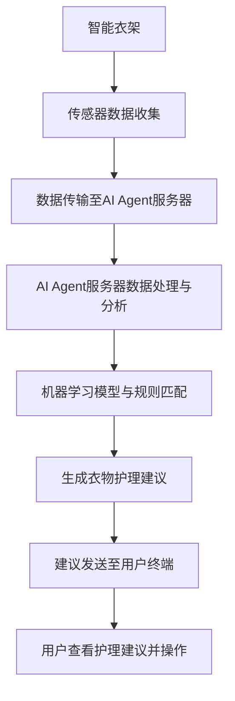

# AI Agent在智能衣架中的衣物护理建议

> 关键词：AI Agent、智能衣架、衣物护理、人工智能、智能家居、传感器技术、数据分析

> 摘要：本文聚焦于AI Agent在智能衣架中的应用，探讨其如何为用户提供精准的衣物护理建议。首先介绍了相关的背景知识，包括目的范围、预期读者等内容。接着阐述了AI Agent和智能衣架的核心概念及联系，详细讲解了核心算法原理与具体操作步骤，并给出了对应的Python源代码。然后通过数学模型和公式深入剖析其工作机制，结合实际案例进行说明。在项目实战部分，从开发环境搭建到源代码实现及解读，全面展示了AI Agent在智能衣架中的应用过程。同时分析了其实际应用场景，推荐了相关的学习资源、开发工具框架以及论文著作。最后总结了未来发展趋势与挑战，提供了常见问题的解答和扩展阅读参考资料，旨在为相关领域的研究和应用提供全面且深入的技术指导。

## 1. 背景介绍 
### 1.1 目的和范围
随着智能家居时代的到来，人们对于生活品质的追求不断提高，对衣物护理的需求也日益精细化。本研究的目的在于探索如何利用AI Agent技术，使智能衣架能够根据衣物的不同特性和状态，为用户提供个性化、精准的衣物护理建议。范围涵盖了AI Agent的基本原理、智能衣架的硬件组成、两者结合的技术实现，以及在实际生活中的应用场景和未来发展方向。

### 1.2 预期读者
本文预期读者包括对智能家居、人工智能技术感兴趣的普通爱好者，从事相关领域研究的科研人员，以及致力于开发智能衣物护理产品的企业技术人员和产品经理。希望通过本文，为不同层次的读者提供有价值的技术参考和思路启发。

### 1.3 文档结构概述
本文将按照以下结构展开：首先介绍背景知识，包括目的、读者和术语表；接着阐述AI Agent和智能衣架的核心概念及联系，通过示意图和流程图直观展示；然后详细讲解核心算法原理和具体操作步骤，给出Python源代码；再通过数学模型和公式深入分析其工作机制，并举例说明；在项目实战部分，从开发环境搭建到源代码实现及解读，全面展示应用过程；分析实际应用场景；推荐相关的学习资源、开发工具框架和论文著作；最后总结未来发展趋势与挑战，提供常见问题解答和扩展阅读参考资料。

### 1.4 术语表
#### 1.4.1 核心术语定义
- **AI Agent（人工智能代理）**：是一种能够感知环境、进行推理和决策，并通过执行动作与环境进行交互的智能实体。在智能衣架中，AI Agent可以根据衣物的相关信息，为用户提供护理建议。
- **智能衣架**：集成了多种传感器和通信模块的衣架，能够收集衣物的状态信息，并与AI Agent进行数据交互。
- **衣物护理建议**：根据衣物的材质、颜色、污渍程度等因素，为用户提供的关于清洗、晾晒、熨烫等护理操作的指导信息。

#### 1.4.2 相关概念解释
- **传感器技术**：用于收集衣物的各种信息，如温度、湿度、重量、颜色等。常见的传感器包括温度传感器、湿度传感器、重量传感器、颜色传感器等。
- **数据分析**：对传感器收集到的数据进行处理和分析，提取有价值的信息，为AI Agent的决策提供依据。
- **机器学习**：AI Agent可以利用机器学习算法，对大量的衣物护理数据进行学习和训练，提高护理建议的准确性和个性化程度。

#### 1.4.3 缩略词列表
- **AI**：Artificial Intelligence（人工智能）
- **IoT**：Internet of Things（物联网）
- **ML**：Machine Learning（机器学习）

## 2. 核心概念与联系 

### 核心概念原理
#### AI Agent原理
AI Agent是人工智能领域的核心概念之一，其基本原理是通过感知环境中的信息，利用内部的知识库和推理机制进行决策，并通过执行器对环境产生影响。在智能衣架的应用中，AI Agent通过与智能衣架上的传感器进行数据交互，获取衣物的状态信息，然后根据预设的规则和机器学习模型，为用户提供合适的衣物护理建议。

#### 智能衣架原理
智能衣架集成了多种传感器和通信模块，传感器用于收集衣物的各种信息，如温度、湿度、重量、颜色等。通信模块则负责将传感器收集到的数据传输给AI Agent。智能衣架还可以配备执行器，如小型的烘干装置、熨烫装置等，根据AI Agent的指令对衣物进行初步的护理操作。

### 架构的文本示意图
智能衣架系统主要由智能衣架、AI Agent服务器和用户终端三部分组成。智能衣架通过传感器收集衣物的状态信息，并将数据通过无线通信模块发送到AI Agent服务器。AI Agent服务器对数据进行处理和分析，利用机器学习模型和预设的规则生成衣物护理建议，并将建议发送到用户终端。用户可以通过终端查看护理建议，并根据建议对衣物进行护理操作。

### Mermaid流程图


## 3. 核心算法原理 & 具体操作步骤 

### 核心算法原理
在智能衣架中，AI Agent主要使用机器学习算法来生成衣物护理建议。常用的机器学习算法包括决策树、支持向量机、神经网络等。这里以决策树算法为例，介绍其基本原理。

决策树是一种基于树结构进行决策的机器学习算法。它通过对训练数据的学习，构建一棵决策树，每个内部节点表示一个属性上的测试，每个分支表示一个测试输出，每个叶节点表示一个类别或值。在智能衣架的应用中，决策树可以根据衣物的材质、颜色、污渍程度等属性，为用户提供不同的衣物护理建议。

### 具体操作步骤
1. **数据收集**：智能衣架上的传感器收集衣物的状态信息，如温度、湿度、重量、颜色等。
2. **数据预处理**：对收集到的数据进行清洗、归一化等预处理操作，去除噪声和异常值，使数据具有可比性。
3. **特征提取**：从预处理后的数据中提取有价值的特征，如衣物的材质、颜色、污渍程度等。
4. **模型训练**：使用决策树算法对训练数据进行学习，构建决策树模型。
5. **模型预测**：将新的衣物状态信息输入到训练好的决策树模型中，得到对应的衣物护理建议。
6. **建议反馈**：将生成的衣物护理建议发送到用户终端，用户可以根据建议对衣物进行护理操作。

### Python源代码
```python
import pandas as pd
from sklearn.tree import DecisionTreeClassifier
from sklearn.model_selection import train_test_split
from sklearn.preprocessing import LabelEncoder

# 示例数据
data = {
    '材质': ['棉质', '麻质', '丝绸', '棉质'],
    '颜色': ['白色', '黑色', '彩色', '白色'],
    '污渍程度': ['轻度', '中度', '重度', '轻度'],
    '护理建议': ['轻柔洗涤', '正常洗涤', '专业清洗', '轻柔洗涤']
}

df = pd.DataFrame(data)

# 数据预处理
le = LabelEncoder()
df['材质'] = le.fit_transform(df['材质'])
df['颜色'] = le.fit_transform(df['颜色'])
df['污渍程度'] = le.fit_transform(df['污渍程度'])
df['护理建议'] = le.fit_transform(df['护理建议'])

# 特征提取
X = df[['材质', '颜色', '污渍程度']]
y = df['护理建议']

# 划分训练集和测试集
X_train, X_test, y_train, y_test = train_test_split(X, y, test_size=0.2, random_state=42)

# 模型训练
clf = DecisionTreeClassifier()
clf.fit(X_train, y_train)

# 模型预测
new_data = pd.DataFrame({
    '材质': [le.transform(['棉质'])[0]],
    '颜色': [le.transform(['白色'])[0]],
    '污渍程度': [le.transform(['轻度'])[0]]
})

prediction = clf.predict(new_data)
print("预测的护理建议编码:", prediction[0])
print("对应的护理建议:", le.inverse_transform(prediction)[0])
```

## 4. 数学模型和公式 & 详细讲解 & 举例说明 

### 决策树算法的数学模型
决策树算法的核心是信息增益（Information Gain）。信息增益是衡量特征对分类结果影响程度的指标，它表示在使用某个特征进行划分后，信息熵的减少量。信息熵是衡量数据不确定性的指标，数据越混乱，信息熵越大。

信息熵的计算公式为：
$$H(X) = -\sum_{i=1}^{n} p(x_i) \log_2 p(x_i)$$
其中，$X$ 是一个随机变量，$p(x_i)$ 是 $X$ 取值为 $x_i$ 的概率。

条件熵的计算公式为：
$$H(X|Y) = \sum_{j=1}^{m} p(y_j) H(X|Y=y_j)$$
其中，$Y$ 是另一个随机变量，$p(y_j)$ 是 $Y$ 取值为 $y_j$ 的概率，$H(X|Y=y_j)$ 是在 $Y=y_j$ 的条件下 $X$ 的信息熵。

信息增益的计算公式为：
$$IG(X,Y) = H(X) - H(X|Y)$$

### 详细讲解
在决策树算法中，我们通过计算每个特征的信息增益，选择信息增益最大的特征作为当前节点的划分特征。然后递归地对划分后的子节点进行同样的操作，直到满足停止条件（如所有样本属于同一类别或没有更多特征可用）。

### 举例说明
假设有一个衣物护理数据集，包含衣物的材质（棉质、麻质、丝绸）、颜色（白色、黑色、彩色）、污渍程度（轻度、中度、重度）和护理建议（轻柔洗涤、正常洗涤、专业清洗）四个特征。我们可以计算每个特征的信息增益，选择信息增益最大的特征作为根节点的划分特征。

例如，计算材质特征的信息增益：
1. 首先计算护理建议的信息熵 $H(护理建议)$。
2. 然后计算在材质特征下护理建议的条件熵 $H(护理建议|材质)$。
3. 最后计算信息增益 $IG(护理建议,材质) = H(护理建议) - H(护理建议|材质)$。

重复上述步骤，计算颜色和污渍程度特征的信息增益，选择信息增益最大的特征作为根节点的划分特征。

## 5. 项目实战：代码实际案例和详细解释说明 

### 5.1  开发环境搭建
#### 硬件环境
- **智能衣架**：选择一款支持多种传感器（如温度传感器、湿度传感器、重量传感器、颜色传感器等）和无线通信模块（如Wi-Fi、蓝牙等）的智能衣架。
- **开发板**：选择一款性能稳定、易于开发的开发板，如Arduino、Raspberry Pi等。
- **传感器模块**：根据智能衣架的需求，选择合适的传感器模块，并将其连接到开发板上。

#### 软件环境
- **操作系统**：选择适合开发板的操作系统，如Raspbian、Arduino IDE等。
- **开发工具**：选择Python作为开发语言，使用常见的Python开发工具，如PyCharm、Jupyter Notebook等。
- **机器学习库**：安装必要的机器学习库，如scikit-learn、pandas等。

### 5.2  源代码详细实现和代码解读
#### 数据收集部分
```python
import serial
import time

# 串口通信设置
ser = serial.Serial('COM3', 9600, timeout=1)

while True:
    if ser.in_waiting:
        data = ser.readline().decode('utf-8').rstrip()
        print("收到的数据:", data)
    time.sleep(0.1)
```
代码解读：这段代码通过串口通信从智能衣架上的传感器收集数据。使用 `serial.Serial` 函数打开串口，然后通过 `ser.readline` 函数读取传感器发送的数据。

#### 数据预处理部分
```python
import pandas as pd
from sklearn.preprocessing import LabelEncoder

# 示例数据
data = {
    '材质': ['棉质', '麻质', '丝绸', '棉质'],
    '颜色': ['白色', '黑色', '彩色', '白色'],
    '污渍程度': ['轻度', '中度', '重度', '轻度'],
    '护理建议': ['轻柔洗涤', '正常洗涤', '专业清洗', '轻柔洗涤']
}

df = pd.DataFrame(data)

# 数据预处理
le = LabelEncoder()
df['材质'] = le.fit_transform(df['材质'])
df['颜色'] = le.fit_transform(df['颜色'])
df['污渍程度'] = le.fit_transform(df['污渍程度'])
df['护理建议'] = le.fit_transform(df['护理建议'])

print("预处理后的数据:", df)
```
代码解读：这段代码使用 `pandas` 库将数据转换为DataFrame格式，然后使用 `LabelEncoder` 对文本数据进行编码，将其转换为数值数据，以便机器学习算法处理。

#### 模型训练和预测部分
```python
from sklearn.tree import DecisionTreeClassifier
from sklearn.model_selection import train_test_split

# 特征提取
X = df[['材质', '颜色', '污渍程度']]
y = df['护理建议']

# 划分训练集和测试集
X_train, X_test, y_train, y_test = train_test_split(X, y, test_size=0.2, random_state=42)

# 模型训练
clf = DecisionTreeClassifier()
clf.fit(X_train, y_train)

# 模型预测
new_data = pd.DataFrame({
    '材质': [le.transform(['棉质'])[0]],
    '颜色': [le.transform(['白色'])[0]],
    '污渍程度': [le.transform(['轻度'])[0]]
})

prediction = clf.predict(new_data)
print("预测的护理建议编码:", prediction[0])
print("对应的护理建议:", le.inverse_transform(prediction)[0])
```
代码解读：这段代码使用 `DecisionTreeClassifier` 构建决策树模型，使用 `train_test_split` 函数将数据集划分为训练集和测试集，然后使用训练集对模型进行训练。最后，将新的衣物状态信息输入到训练好的模型中，得到对应的护理建议。

### 5.3  代码解读与分析
#### 数据收集部分
通过串口通信收集传感器数据是一种常见的方式。在实际应用中，需要根据传感器的通信协议和数据格式进行相应的调整。同时，为了保证数据的准确性和稳定性，需要进行数据校验和错误处理。

#### 数据预处理部分
使用 `LabelEncoder` 对文本数据进行编码是一种简单有效的方法。但在实际应用中，可能需要根据数据的特点选择更合适的编码方式，如One-Hot编码。此外，还需要对数据进行归一化、标准化等处理，以提高模型的性能。

#### 模型训练和预测部分
决策树算法是一种简单易懂、计算效率高的机器学习算法。但在实际应用中，可能需要根据数据的特点和问题的复杂度选择更合适的算法，如支持向量机、神经网络等。同时，为了提高模型的泛化能力，需要进行模型评估和调优。

## 6. 实际应用场景 
### 家庭场景
在家庭中，智能衣架可以根据衣物的材质、颜色、污渍程度等信息，为用户提供个性化的衣物护理建议。例如，对于棉质白色衣物，建议轻柔洗涤；对于丝绸彩色衣物，建议专业清洗。用户可以根据建议选择合适的洗涤方式和洗涤剂，延长衣物的使用寿命。

### 酒店场景
在酒店中，智能衣架可以帮助酒店工作人员更好地管理客人的衣物。例如，根据衣物的状态信息，及时为客人提供干洗、熨烫等服务，提高客人的满意度。

### 洗衣店场景
在洗衣店中，智能衣架可以帮助工作人员快速准确地了解衣物的情况，为客人提供更专业的洗衣建议。例如，根据衣物的材质和污渍程度，选择合适的洗衣程序和洗涤剂，提高洗衣质量和效率。

## 7. 工具和资源推荐
### 7.1 学习资源推荐
#### 7.1.1 书籍推荐
- 《Python机器学习实战》：介绍了Python在机器学习领域的应用，包括决策树、支持向量机、神经网络等算法的实现。
- 《人工智能：一种现代的方法》：全面介绍了人工智能的基本概念、算法和应用，是人工智能领域的经典教材。
- 《智能家居技术与应用》：介绍了智能家居的基本原理、技术和应用，包括智能衣架等智能设备的开发和应用。

#### 7.1.2 在线课程
- Coursera上的《机器学习》课程：由斯坦福大学教授Andrew Ng主讲，是机器学习领域的经典课程。
- edX上的《人工智能基础》课程：介绍了人工智能的基本概念、算法和应用，适合初学者学习。
- 中国大学MOOC上的《智能家居系统设计与应用》课程：介绍了智能家居系统的设计和应用，包括智能衣架等智能设备的开发和应用。

#### 7.1.3 技术博客和网站
- Medium：是一个技术博客平台，上面有很多关于人工智能、智能家居等领域的优秀文章。
- 开源中国：是一个开源技术社区，上面有很多关于智能家居、人工智能等领域的开源项目和技术文章。
- 机器之心：是一个专注于人工智能领域的媒体平台，上面有很多关于人工智能技术和应用的最新资讯和深度分析。

### 7.2 开发工具框架推荐
#### 7.2.1 IDE和编辑器
- PyCharm：是一款专业的Python集成开发环境，具有代码编辑、调试、代码分析等功能。
- Jupyter Notebook：是一个交互式的开发环境，适合进行数据探索、模型训练和可视化等工作。
- Visual Studio Code：是一款轻量级的代码编辑器，支持多种编程语言，具有丰富的插件和扩展功能。

#### 7.2.2 调试和性能分析工具
- pdb：是Python自带的调试工具，可以帮助开发者调试代码。
- cProfile：是Python自带的性能分析工具，可以帮助开发者分析代码的性能瓶颈。
- TensorBoard：是TensorFlow的可视化工具，可以帮助开发者可视化模型的训练过程和性能指标。

#### 7.2.3 相关框架和库
- scikit-learn：是一个常用的机器学习库，提供了丰富的机器学习算法和工具。
- pandas：是一个数据处理和分析库，提供了DataFrame等数据结构和数据处理工具。
- TensorFlow：是一个开源的深度学习框架，提供了丰富的深度学习模型和工具。

### 7.3 相关论文著作推荐
#### 7.3.1 经典论文
- 《A Decision-Theoretic Approach to Classification and Regression Trees》：介绍了决策树算法的基本原理和应用。
- 《Support-Vector Networks》：介绍了支持向量机算法的基本原理和应用。
- 《Gradient-Based Learning Applied to Document Recognition》：介绍了神经网络算法的基本原理和应用。

#### 7.3.2 最新研究成果
- 《AI-Enabled Smart Home Systems: A Survey》：对人工智能在智能家居系统中的应用进行了全面的综述。
- 《Intelligent Clothing Care Systems: A Review》：对智能衣物护理系统的研究现状和发展趋势进行了综述。
- 《Machine Learning for Smart Home Devices: A Review》：对机器学习在智能家居设备中的应用进行了综述。

#### 7.3.3 应用案例分析
- 《Case Study: Smart Hanger for Intelligent Clothing Care》：介绍了智能衣架在衣物护理中的应用案例。
- 《Case Study: AI-Enabled Laundry Management System》：介绍了人工智能在洗衣管理系统中的应用案例。
- 《Case Study: Smart Home System for Personalized Clothing Care》：介绍了智能家居系统在个性化衣物护理中的应用案例。

## 8. 总结：未来发展趋势与挑战
### 未来发展趋势
- **智能化程度不断提高**：随着人工智能技术的不断发展，AI Agent在智能衣架中的应用将越来越智能化。例如，AI Agent可以通过学习用户的使用习惯和偏好，提供更加个性化的衣物护理建议。
- **与其他智能家居设备的融合**：智能衣架将与其他智能家居设备（如智能洗衣机、智能烘干机、智能衣柜等）进行融合，实现衣物护理的自动化和智能化。例如，智能衣架可以根据衣物的状态信息，自动控制智能洗衣机和烘干机的运行。
- **云服务的应用**：智能衣架将与云服务进行结合，实现数据的存储和共享。例如，用户可以通过手机APP随时随地查看衣物的状态信息和护理建议，还可以将衣物的信息上传到云端，与其他用户进行分享和交流。

### 挑战
- **数据安全和隐私问题**：智能衣架收集的衣物状态信息涉及用户的隐私，因此需要采取有效的数据安全和隐私保护措施，防止数据泄露和滥用。
- **传感器技术的局限性**：目前的传感器技术还存在一定的局限性，如精度不够高、可靠性不够强等。因此，需要不断提高传感器技术的性能，以提高智能衣架的准确性和可靠性。
- **用户接受度问题**：智能衣架作为一种新型的智能家居设备，用户对其的接受度还需要进一步提高。因此，需要加强对智能衣架的宣传和推广，提高用户对其的认知度和信任度。

## 9. 附录：常见问题与解答
### 问题1：智能衣架的传感器数据准确吗？
解答：智能衣架的传感器数据准确性取决于传感器的质量和性能。一般来说，采用高质量的传感器可以提高数据的准确性。同时，还可以通过数据校准和滤波等方法，进一步提高数据的准确性。

### 问题2：AI Agent生成的衣物护理建议可靠吗？
解答：AI Agent生成的衣物护理建议的可靠性取决于机器学习模型的训练数据和算法的选择。一般来说，使用大量的高质量训练数据和合适的算法可以提高护理建议的可靠性。同时，还可以通过人工审核和反馈等方式，不断优化护理建议的准确性。

### 问题3：智能衣架的使用寿命有多长？
解答：智能衣架的使用寿命取决于其硬件质量和使用环境。一般来说，采用高质量的硬件和合理的使用环境可以延长智能衣架的使用寿命。同时，还需要定期对智能衣架进行维护和保养，以保证其正常运行。

## 10. 扩展阅读 & 参考资料
### 扩展阅读
- 《智能家居革命：改变未来生活的科技力量》
- 《人工智能时代：从技术到应用》
- 《物联网：开启智能生活新时代》

### 参考资料
- [scikit-learn官方文档](https://scikit-learn.org/stable/)
- [pandas官方文档](https://pandas.pydata.org/)
- [TensorFlow官方文档](https://www.tensorflow.org/)
- [Arduino官方文档](https://www.arduino.cc/en/Reference/HomePage)
- [Raspberry Pi官方文档](https://www.raspberrypi.org/documentation/)