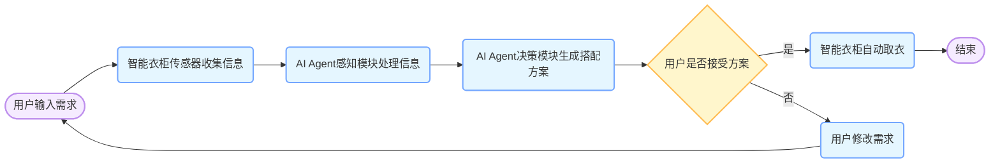

# AI Agent在智能衣柜中的个人形象设计师

> 关键词：AI Agent、智能衣柜、个人形象设计、人工智能、时尚搭配、个性化推荐、智能家居

> 摘要：本文聚焦于AI Agent在智能衣柜中作为个人形象设计师的应用。随着人工智能技术的飞速发展，智能衣柜逐渐成为家居领域的热门产品。AI Agent凭借其强大的数据分析和决策能力，能够为用户提供个性化的服装搭配建议，实现从传统衣柜到智能形象设计助手的转变。文章深入探讨了AI Agent的核心概念、算法原理、数学模型，通过项目实战展示其具体实现，分析实际应用场景，并推荐相关的学习资源、开发工具和研究论文，最后总结其未来发展趋势与挑战，旨在为相关领域的研究和实践提供全面且深入的参考。

## 1. 背景介绍 
### 1.1 目的和范围
随着人们生活水平的提高，对个人形象的关注度日益增加，传统衣柜仅作为衣物存放空间的功能已无法满足需求。本研究旨在探索如何将AI Agent引入智能衣柜，使其成为用户的个人形象设计师，提供个性化的服装搭配方案。研究范围涵盖AI Agent的核心概念、实现算法、数学模型，以及在智能衣柜中的具体应用和未来发展趋势。

### 1.2 预期读者
本文预期读者包括人工智能领域的研究人员、智能家具开发者、时尚行业从业者、对智能生活感兴趣的爱好者以及相关专业的学生。希望通过本文，能为他们在不同领域的应用和研究提供有价值的参考。

### 1.3 文档结构概述
本文首先介绍AI Agent和智能衣柜的相关背景知识，包括术语定义和概念解释。接着阐述AI Agent的核心概念、原理和架构，通过流程图展示其工作流程。然后详细讲解核心算法原理，并使用Python代码进行具体实现。随后介绍相关的数学模型和公式，并举例说明。通过项目实战展示AI Agent在智能衣柜中的具体应用，包括开发环境搭建、源代码实现和代码解读。分析实际应用场景，推荐相关的学习资源、开发工具和研究论文。最后总结AI Agent在智能衣柜中作为个人形象设计师的未来发展趋势与挑战，并提供常见问题解答和扩展阅读参考资料。

### 1.4 术语表
#### 1.4.1 核心术语定义
- **AI Agent（人工智能代理）**：是一种能够感知环境、进行推理和决策，并采取行动以实现特定目标的智能实体。在本文中，AI Agent作为智能衣柜的核心，根据用户的需求和环境信息提供服装搭配建议。
- **智能衣柜**：集成了人工智能、传感器、通信等技术的新型衣柜，能够实现衣物管理、智能搭配、环境感知等功能。
- **个人形象设计**：根据个人的身材、肤色、气质、场合等因素，选择合适的服装、配饰等，以达到美化形象的目的。

#### 1.4.2 相关概念解释
- **机器学习**：是一门多领域交叉学科，涉及概率论、统计学、逼近论、凸分析、算法复杂度理论等多门学科。它专门研究计算机怎样模拟或实现人类的学习行为，以获取新的知识或技能，重新组织已有的知识结构使之不断改善自身的性能。在AI Agent中，机器学习算法用于学习用户的偏好和服装搭配规则。
- **计算机视觉**：是一门研究如何使机器“看”的科学，更进一步的说，就是指用摄影机和电脑代替人眼对目标进行识别、跟踪和测量等机器视觉，并进一步做图形处理，使电脑处理成为更适合人眼观察或传送给仪器检测的图像。在智能衣柜中，计算机视觉技术可用于衣物识别和图像分析。

#### 1.4.3 缩略词列表
- **AI**：Artificial Intelligence，人工智能
- **ML**：Machine Learning，机器学习
- **CV**：Computer Vision，计算机视觉

## 2. 核心概念与联系 

### 2.1 AI Agent核心概念
AI Agent是一种能够自主感知环境、进行推理和决策，并采取行动以实现特定目标的智能实体。在智能衣柜中，AI Agent的主要目标是根据用户的需求和环境信息，提供个性化的服装搭配建议。AI Agent通常由感知模块、决策模块和执行模块组成。

感知模块负责收集用户和环境的相关信息，如用户的身材、肤色、当前天气、场合等。决策模块根据感知模块收集的信息，运用机器学习算法和时尚知识进行推理和决策，生成服装搭配方案。执行模块将决策模块生成的搭配方案呈现给用户，如通过显示屏展示搭配图片、语音播报搭配建议等。

### 2.2 AI Agent与智能衣柜的联系
AI Agent是智能衣柜实现智能化的核心。智能衣柜作为AI Agent的运行载体，为AI Agent提供了衣物信息存储和管理的功能。AI Agent通过与智能衣柜的交互，获取衣物的种类、颜色、款式等信息，并根据这些信息进行搭配推荐。同时，智能衣柜可以通过传感器感知用户的行为和环境信息，为AI Agent提供更准确的决策依据。

### 2.3 文本示意图
AI Agent在智能衣柜中的工作流程可以用以下文本描述：用户向智能衣柜输入需求（如场合、天气等），智能衣柜的传感器收集相关环境信息和用户信息，将这些信息传递给AI Agent的感知模块。感知模块对信息进行处理和分析，将结果传递给决策模块。决策模块根据感知模块提供的信息，运用机器学习算法和时尚知识进行推理和决策，生成服装搭配方案。执行模块将搭配方案呈现给用户，用户可以选择接受或修改方案。如果用户接受方案，智能衣柜可以通过自动控制装置帮助用户取出相应的衣物。

### 2.4 Mermaid流程图


## 3. 核心算法原理 & 具体操作步骤 

### 3.1 核心算法原理
AI Agent在智能衣柜中生成服装搭配方案主要使用了机器学习中的推荐算法。推荐算法可以分为基于内容的推荐、协同过滤推荐和混合推荐等。在本应用中，我们主要使用基于内容的推荐算法。

基于内容的推荐算法通过分析物品的属性和用户的偏好，为用户推荐与他们喜欢的物品相似的物品。在智能衣柜中，物品就是衣物，物品的属性包括颜色、款式、材质等，用户的偏好可以通过用户的历史搭配记录、评价等信息来表示。

### 3.2 具体操作步骤
1. **数据收集**：收集衣物的属性信息（如颜色、款式、材质等）和用户的历史搭配记录、评价等信息。
2. **特征提取**：从收集到的数据中提取有用的特征，如将颜色转换为数值表示，将款式进行分类编码等。
3. **模型训练**：使用机器学习算法（如决策树、支持向量机等）对提取的特征进行训练，建立用户偏好模型和服装搭配规则模型。
4. **搭配推荐**：根据用户的输入（如场合、天气等），结合训练好的模型，生成服装搭配方案。
5. **方案评估和优化**：根据用户的反馈（如是否喜欢推荐的搭配），对模型进行评估和优化，提高推荐的准确性。

### 3.3 Python源代码实现
```python
import pandas as pd
from sklearn.tree import DecisionTreeClassifier
from sklearn.preprocessing import LabelEncoder

# 数据收集
data = {
    '颜色': ['红色', '蓝色', '黑色', '白色'],
    '款式': ['上衣', '裤子', '裙子', '外套'],
    '场合': ['正式', '休闲', '运动', '正式'],
    '用户评价': ['喜欢', '不喜欢', '喜欢', '喜欢']
}
df = pd.DataFrame(data)

# 特征提取
le_color = LabelEncoder()
le_style = LabelEncoder()
le_occasion = LabelEncoder()
le_rating = LabelEncoder()

df['颜色'] = le_color.fit_transform(df['颜色'])
df['款式'] = le_style.fit_transform(df['款式'])
df['场合'] = le_occasion.fit_transform(df['场合'])
df['用户评价'] = le_rating.fit_transform(df['用户评价'])

# 划分特征和标签
X = df[['颜色', '款式', '场合']]
y = df['用户评价']

# 模型训练
model = DecisionTreeClassifier()
model.fit(X, y)

# 搭配推荐
new_data = {
    '颜色': ['红色'],
    '款式': ['上衣'],
    '场合': ['正式']
}
new_df = pd.DataFrame(new_data)
new_df['颜色'] = le_color.transform(new_df['颜色'])
new_df['款式'] = le_style.transform(new_df['款式'])
new_df['场合'] = le_occasion.transform(new_df['场合'])

prediction = model.predict(new_df)
print("预测用户评价：", le_rating.inverse_transform(prediction))
```

### 3.4 代码解释
1. **数据收集**：使用字典创建一个包含衣物属性和用户评价的数据集，并将其转换为Pandas DataFrame。
2. **特征提取**：使用`LabelEncoder`对分类特征（如颜色、款式、场合、用户评价）进行编码，将其转换为数值表示。
3. **模型训练**：使用`DecisionTreeClassifier`作为分类模型，对提取的特征进行训练。
4. **搭配推荐**：创建一个新的数据集，包含用户输入的衣物属性信息，对其进行特征编码后，使用训练好的模型进行预测，并将预测结果转换为原始的用户评价标签。

## 4. 数学模型和公式 & 详细讲解 & 举例说明 

### 4.1 数学模型
在基于内容的推荐算法中，我们可以使用向量空间模型来表示衣物和用户的偏好。假设每个衣物可以用一个特征向量 $\mathbf{x} = [x_1, x_2, \cdots, x_n]$ 表示，其中 $x_i$ 表示衣物的第 $i$ 个特征（如颜色、款式、材质等）。用户的偏好也可以用一个特征向量 $\mathbf{u} = [u_1, u_2, \cdots, u_n]$ 表示。

### 4.2 相似度计算
为了计算衣物和用户偏好之间的相似度，我们可以使用余弦相似度公式：
$$
\cos(\mathbf{x}, \mathbf{u}) = \frac{\mathbf{x} \cdot \mathbf{u}}{\|\mathbf{x}\| \|\mathbf{u}\|}
$$
其中，$\mathbf{x} \cdot \mathbf{u}$ 表示向量 $\mathbf{x}$ 和 $\mathbf{u}$ 的点积，$\|\mathbf{x}\|$ 和 $\|\mathbf{u}\|$ 分别表示向量 $\mathbf{x}$ 和 $\mathbf{u}$ 的模。

### 4.3 详细讲解
余弦相似度的取值范围在 $[-1, 1]$ 之间，值越接近 1 表示两个向量越相似，值越接近 -1 表示两个向量越不相似。在智能衣柜中，我们可以根据余弦相似度计算每个衣物与用户偏好的相似度，然后选择相似度较高的衣物进行搭配推荐。

### 4.4 举例说明
假设我们有两个衣物的特征向量 $\mathbf{x}_1 = [1, 2, 3]$ 和 $\mathbf{x}_2 = [4, 5, 6]$，用户的偏好向量 $\mathbf{u} = [2, 3, 4]$。

首先计算 $\mathbf{x}_1$ 和 $\mathbf{u}$ 的余弦相似度：
$$
\mathbf{x}_1 \cdot \mathbf{u} = 1 \times 2 + 2 \times 3 + 3 \times 4 = 2 + 6 + 12 = 20
$$
$$
\|\mathbf{x}_1\| = \sqrt{1^2 + 2^2 + 3^2} = \sqrt{1 + 4 + 9} = \sqrt{14}
$$
$$
\|\mathbf{u}\| = \sqrt{2^2 + 3^2 + 4^2} = \sqrt{4 + 9 + 16} = \sqrt{29}
$$
$$
\cos(\mathbf{x}_1, \mathbf{u}) = \frac{20}{\sqrt{14} \sqrt{29}} \approx 0.97
$$

然后计算 $\mathbf{x}_2$ 和 $\mathbf{u}$ 的余弦相似度：
$$
\mathbf{x}_2 \cdot \mathbf{u} = 4 \times 2 + 5 \times 3 + 6 \times 4 = 8 + 15 + 24 = 47
$$
$$
\|\mathbf{x}_2\| = \sqrt{4^2 + 5^2 + 6^2} = \sqrt{16 + 25 + 36} = \sqrt{77}
$$
$$
\cos(\mathbf{x}_2, \mathbf{u}) = \frac{47}{\sqrt{77} \sqrt{29}} \approx 0.99
$$

由于 $\cos(\mathbf{x}_2, \mathbf{u}) > \cos(\mathbf{x}_1, \mathbf{u})$，所以衣物 $\mathbf{x}_2$ 与用户的偏好更相似，在搭配推荐中更有可能被选择。

## 5. 项目实战：代码实际案例和详细解释说明 

### 5.1  开发环境搭建
1. **操作系统**：推荐使用Windows 10、macOS或Linux（如Ubuntu）。
2. **Python环境**：安装Python 3.7及以上版本。可以从Python官方网站（https://www.python.org/downloads/）下载并安装。
3. **开发工具**：推荐使用PyCharm或VS Code作为集成开发环境（IDE）。
4. **依赖库安装**：使用以下命令安装所需的依赖库：
```sh
pip install pandas scikit-learn
```

### 5.2  源代码详细实现和代码解读
```python
import pandas as pd
from sklearn.tree import DecisionTreeClassifier
from sklearn.preprocessing import LabelEncoder
from sklearn.model_selection import train_test_split
from sklearn.metrics import accuracy_score

# 数据收集
data = {
    '颜色': ['红色', '蓝色', '黑色', '白色', '灰色', '黄色'],
    '款式': ['上衣', '裤子', '裙子', '外套', '衬衫', '短裤'],
    '场合': ['正式', '休闲', '运动', '正式', '休闲', '运动'],
    '天气': ['晴天', '阴天', '雨天', '晴天', '阴天', '雨天'],
    '用户评价': ['喜欢', '不喜欢', '喜欢', '喜欢', '不喜欢', '喜欢']
}
df = pd.DataFrame(data)

# 特征提取
le_color = LabelEncoder()
le_style = LabelEncoder()
le_occasion = LabelEncoder()
le_weather = LabelEncoder()
le_rating = LabelEncoder()

df['颜色'] = le_color.fit_transform(df['颜色'])
df['款式'] = le_style.fit_transform(df['款式'])
df['场合'] = le_occasion.fit_transform(df['场合'])
df['天气'] = le_weather.fit_transform(df['天气'])
df['用户评价'] = le_rating.fit_transform(df['用户评价'])

# 划分特征和标签
X = df[['颜色', '款式', '场合', '天气']]
y = df['用户评价']

# 划分训练集和测试集
X_train, X_test, y_train, y_test = train_test_split(X, y, test_size=0.2, random_state=42)

# 模型训练
model = DecisionTreeClassifier()
model.fit(X_train, y_train)

# 模型评估
y_pred = model.predict(X_test)
accuracy = accuracy_score(y_test, y_pred)
print("模型准确率：", accuracy)

# 搭配推荐
new_data = {
    '颜色': ['红色'],
    '款式': ['上衣'],
    '场合': ['正式'],
    '天气': ['晴天']
}
new_df = pd.DataFrame(new_data)
new_df['颜色'] = le_color.transform(new_df['颜色'])
new_df['款式'] = le_style.transform(new_df['款式'])
new_df['场合'] = le_occasion.transform(new_df['场合'])
new_df['天气'] = le_weather.transform(new_df['天气'])

prediction = model.predict(new_df)
print("预测用户评价：", le_rating.inverse_transform(prediction))
```

### 5.3  代码解读与分析
1. **数据收集**：创建一个包含衣物属性、场合、天气和用户评价的数据集，并将其转换为Pandas DataFrame。
2. **特征提取**：使用`LabelEncoder`对分类特征进行编码，将其转换为数值表示。
3. **划分训练集和测试集**：使用`train_test_split`函数将数据集划分为训练集和测试集，测试集占比为 20%。
4. **模型训练**：使用`DecisionTreeClassifier`作为分类模型，对训练集进行训练。
5. **模型评估**：使用`accuracy_score`函数计算模型在测试集上的准确率。
6. **搭配推荐**：创建一个新的数据集，包含用户输入的衣物属性、场合和天气信息，对其进行特征编码后，使用训练好的模型进行预测，并将预测结果转换为原始的用户评价标签。

通过对代码的分析，我们可以看到如何使用机器学习算法实现AI Agent在智能衣柜中的服装搭配推荐功能。同时，通过模型评估可以了解模型的性能，为后续的优化提供依据。

## 6. 实际应用场景 
### 6.1 日常穿搭
用户在每天出门前，可以通过智能衣柜的AI Agent获取当天的服装搭配建议。AI Agent会根据当天的天气、用户的日程安排等因素，推荐合适的衣物。例如，在晴天且有商务会议的情况下，推荐一套正式的西装；在阴天且是休息日的情况下，推荐休闲的运动装。

### 6.2 特殊场合
在参加特殊场合（如婚礼、晚宴、面试等）时，用户可以向AI Agent输入场合信息，AI Agent会根据不同的场合风格，提供相应的服装搭配方案。例如，在婚礼上，为男性推荐黑色或深蓝色的西装，为女性推荐优雅的晚礼服。

### 6.3 旅行穿搭
当用户计划旅行时，AI Agent可以根据旅行的目的地、时长和当地的气候条件，为用户规划旅行期间的服装搭配。例如，去热带地区旅行，推荐轻薄透气的夏装；去寒冷地区旅行，推荐保暖的羽绒服、毛衣等。

### 6.4 时尚风格探索
用户可以通过AI Agent尝试不同的时尚风格，发现新的穿搭灵感。AI Agent可以根据用户的身材、肤色等特点，推荐适合的时尚风格，并提供相应的服装搭配方案。例如，用户想尝试复古风格，AI Agent可以推荐复古的连衣裙、西装外套等。

## 7. 工具和资源推荐
### 7.1 学习资源推荐
#### 7.1.1 书籍推荐
- 《Python机器学习》：这本书全面介绍了Python在机器学习领域的应用，包括各种机器学习算法的原理和实现，适合初学者和有一定基础的开发者。
- 《人工智能：一种现代的方法》：这是人工智能领域的经典教材，系统地介绍了人工智能的基本概念、算法和应用，对于深入理解AI Agent的原理有很大帮助。
- 《时尚心理学》：从心理学的角度探讨时尚和个人形象的关系，对于理解用户的时尚需求和偏好有很大的启发。

#### 7.1.2 在线课程
- Coursera上的“Machine Learning”课程：由Andrew Ng教授主讲，是机器学习领域的经典课程，对于学习机器学习算法和原理非常有帮助。
- edX上的“Artificial Intelligence”课程：全面介绍了人工智能的各个方面，包括AI Agent、机器学习、自然语言处理等。
- 中国大学MOOC上的“时尚穿搭与形象设计”课程：由时尚领域的专家授课，介绍了时尚穿搭的基本原理和方法，对于理解个人形象设计有很大的帮助。

#### 7.1.3 技术博客和网站
- Medium：上面有很多关于人工智能、机器学习和时尚科技的文章，作者来自世界各地的专业人士和爱好者，可以从中获取最新的技术动态和应用案例。
- Towards Data Science：专注于数据科学和机器学习领域的技术博客，有很多关于算法实现和应用的文章，对于学习和实践非常有帮助。
- Vogue官网：时尚界的权威网站，提供最新的时尚资讯、潮流趋势和穿搭建议，对于了解时尚文化和风格有很大的帮助。

### 7.2 开发工具框架推荐
#### 7.2.1 IDE和编辑器
- PyCharm：是一款专门为Python开发设计的集成开发环境，具有代码自动补全、调试、版本控制等功能，非常适合Python项目的开发。
- VS Code：是一款轻量级的代码编辑器，支持多种编程语言和插件扩展，具有丰富的开发工具和功能，适合快速开发和调试。

#### 7.2.2 调试和性能分析工具
- PDB：Python自带的调试工具，可以帮助开发者定位和解决代码中的问题。
- cProfile：Python的性能分析工具，可以分析代码的运行时间和资源消耗，帮助开发者优化代码性能。

#### 7.2.3 相关框架和库
- Scikit-learn：是Python中常用的机器学习库，提供了各种机器学习算法的实现，包括分类、回归、聚类等，对于实现AI Agent的推荐算法非常方便。
- TensorFlow：是Google开发的深度学习框架，具有强大的计算能力和丰富的工具集，适合开发复杂的人工智能模型。
- OpenCV：是计算机视觉领域的开源库，提供了各种图像处理和计算机视觉算法的实现，对于智能衣柜中的衣物识别和图像分析非常有用。

### 7.3 相关论文著作推荐
#### 7.3.1 经典论文
- “A Framework for Cooperative Intelligent Agents in a Multi-Agent System”：介绍了多智能体系统中合作智能体的框架和算法，对于理解AI Agent的协作机制有很大的帮助。
- “Content-Based Image Retrieval at the End of the Early Years”：综述了基于内容的图像检索技术的发展历程和现状，对于智能衣柜中的衣物图像检索有一定的参考价值。

#### 7.3.2 最新研究成果
- “AI-Enhanced Fashion Recommendation Systems: A Review”：综述了人工智能在时尚推荐系统中的应用现状和发展趋势，对于了解AI Agent在智能衣柜中的最新研究成果有很大的帮助。
- “Personalized Fashion Recommendation Using Deep Learning and User Preferences”：介绍了使用深度学习和用户偏好实现个性化时尚推荐的方法，对于实现AI Agent的个性化推荐功能有一定的参考价值。

#### 7.3.3 应用案例分析
- “Smart Wardrobe: A Case Study of Integrating AI and IoT in Fashion Industry”：以智能衣柜为例，分析了人工智能和物联网在时尚行业中的应用案例，对于实际项目的开发有很大的参考价值。
- “Fashion Retail and AI: Transforming the Customer Experience”：探讨了人工智能在时尚零售领域的应用，包括个性化推荐、虚拟试衣等，对于理解AI Agent在智能衣柜中的应用场景和价值有很大的帮助。

## 8. 总结：未来发展趋势与挑战
### 8.1 未来发展趋势
- **更加个性化**：随着人工智能技术的不断发展，AI Agent将能够更好地理解用户的个性化需求和偏好，提供更加精准的服装搭配建议。例如，通过分析用户的社交媒体数据、健康数据等，进一步了解用户的生活方式和个性特点，为用户提供更加符合其身份和风格的服装搭配。
- **多模态交互**：未来的智能衣柜将支持多种交互方式，如语音交互、手势交互、眼神交互等。用户可以通过更加自然和便捷的方式与AI Agent进行交互，提高使用体验。例如，用户可以通过语音指令告诉AI Agent自己的需求，AI Agent可以通过语音和图像反馈搭配建议。
- **物联网集成**：智能衣柜将与其他智能家居设备进行集成，实现更加智能化的家居生活。例如，智能衣柜可以与智能镜子、智能洗衣机等设备进行联动，用户可以在智能镜子中查看搭配效果，智能洗衣机可以根据衣物的材质和颜色进行自动清洗和护理。
- **虚拟试衣**：结合增强现实（AR）和虚拟现实（VR）技术，实现虚拟试衣功能。用户可以在不试穿的情况下，通过虚拟试衣系统查看服装的上身效果，提高购物效率和体验。

### 8.2 挑战
- **数据隐私和安全**：AI Agent需要收集和分析用户的大量个人信息，如衣物信息、搭配记录、身体数据等，这些数据的隐私和安全是一个重要的问题。如何确保用户数据不被泄露和滥用，是智能衣柜发展过程中需要解决的关键问题。
- **时尚知识的更新**：时尚行业的潮流和风格变化非常快，AI Agent需要不断更新和学习时尚知识，以提供符合最新潮流的服装搭配建议。如何建立有效的时尚知识更新机制，是一个挑战。
- **算法的可解释性**：AI Agent使用的机器学习算法通常是黑盒模型，其决策过程和结果难以解释。在服装搭配推荐中，用户需要了解为什么推荐这些衣物，因此如何提高算法的可解释性，是一个需要解决的问题。
- **用户接受度**：智能衣柜作为一种新兴的产品，用户对其接受度还需要进一步提高。如何让用户相信AI Agent的搭配建议，以及如何提高用户的使用意愿和满意度，是智能衣柜推广过程中需要解决的问题。

## 9. 附录：常见问题与解答
### 9.1 如何确保AI Agent推荐的服装搭配符合我的风格？
AI Agent会通过分析你的历史搭配记录、评价和偏好信息，学习你的风格特点。同时，你也可以在使用过程中不断反馈你的意见和需求，帮助AI Agent更好地理解你的风格，从而提供更加符合你风格的服装搭配建议。

### 9.2 智能衣柜中的衣物信息如何录入？
可以通过以下几种方式录入衣物信息：手动输入，即你可以在智能衣柜的操作界面上手动输入衣物的颜色、款式、材质等信息；图像识别，智能衣柜可以配备摄像头，通过计算机视觉技术识别衣物的图像，自动提取衣物的信息；RFID标签，在衣物上安装RFID标签，智能衣柜可以通过RFID读写器读取标签信息，获取衣物的详细信息。

### 9.3 AI Agent推荐的服装搭配是否考虑了衣物的实际尺寸？
目前，AI Agent主要根据衣物的属性和用户的偏好进行搭配推荐，可能没有直接考虑衣物的实际尺寸。但在未来的发展中，可以结合用户的身体数据和衣物的尺寸信息，提供更加合身的服装搭配建议。

### 9.4 智能衣柜的安全性如何保障？
智能衣柜采用了多种安全技术来保障用户数据的安全和隐私。例如，数据加密技术可以对用户的个人信息和衣物信息进行加密处理，防止数据在传输和存储过程中被泄露；访问控制技术可以限制只有授权用户才能访问智能衣柜的系统和数据；安全审计技术可以对系统的操作和访问进行审计和记录，及时发现和处理安全问题。

### 9.5 如果我不喜欢AI Agent推荐的搭配方案怎么办？
你可以直接在智能衣柜的操作界面上反馈你的意见，如选择“不喜欢”或提供具体的修改建议。AI Agent会根据你的反馈对推荐算法和模型进行调整和优化，下次为你提供更符合你需求的搭配方案。

## 10. 扩展阅读 & 参考资料
- 《人工智能基础教程》
- 《Python数据科学手册》
- 《时尚产业经济学》
- Kaggle上的时尚相关数据集和竞赛
- 各大时尚品牌的官方网站和社交媒体账号
- 相关的学术期刊和会议论文，如ACM Transactions on Intelligent Systems and Technology、IEEE International Conference on Artificial Intelligence and Applications等。

通过以上扩展阅读和参考资料，你可以进一步深入了解AI Agent在智能衣柜中的应用，以及人工智能、时尚等相关领域的最新研究成果和发展趋势。