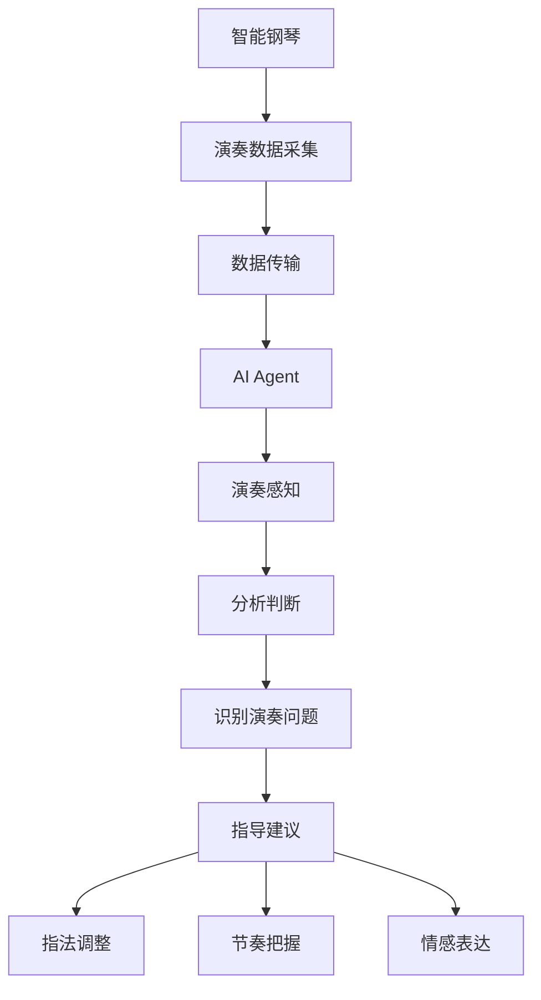

# AI Agent在智能钢琴中的演奏技巧指导

> 关键词：AI Agent、智能钢琴、演奏技巧指导、音乐人工智能、人机交互

> 摘要：本文聚焦于AI Agent在智能钢琴中的演奏技巧指导应用。随着人工智能技术的飞速发展，AI Agent为智能钢琴领域带来了全新的变革。通过深入探讨AI Agent的核心概念、算法原理、数学模型等，详细阐述其如何在智能钢琴中实现演奏技巧的精准指导。同时，结合项目实战案例，分析其实际应用场景，并推荐相关学习资源、开发工具和研究论文，最后总结未来发展趋势与挑战，旨在为该领域的研究和应用提供全面且深入的参考。

## 1. 背景介绍 
### 1.1 目的和范围
随着音乐教育的普及和科技的进步，智能钢琴逐渐成为音乐学习和演奏的热门工具。AI Agent在智能钢琴中的应用旨在为学习者提供更加个性化、高效的演奏技巧指导，提升学习效果和演奏体验。本文的范围涵盖了AI Agent在智能钢琴中应用的各个方面，包括核心概念、算法原理、数学模型、项目实战、实际应用场景等。

### 1.2 预期读者
本文预期读者包括音乐教育工作者、智能钢琴开发者、人工智能研究人员、音乐爱好者以及对智能音乐设备感兴趣的技术人员等。这些读者可以从不同角度了解AI Agent在智能钢琴中演奏技巧指导的相关知识和技术。

### 1.3 文档结构概述
本文首先介绍背景信息，包括目的、预期读者和文档结构。接着阐述AI Agent和智能钢琴的核心概念及其联系，详细讲解核心算法原理和具体操作步骤，通过数学模型和公式进行理论支持。然后通过项目实战展示代码实现和详细解释，分析实际应用场景。随后推荐相关工具和资源，最后总结未来发展趋势与挑战，并提供常见问题解答和扩展阅读参考资料。

### 1.4 术语表
#### 1.4.1 核心术语定义
- **AI Agent（人工智能代理）**：是一种能够感知环境、做出决策并采取行动以实现特定目标的智能实体。在智能钢琴中，AI Agent可以感知演奏者的演奏情况，做出分析和判断，并提供相应的演奏技巧指导。
- **智能钢琴**：结合了传统钢琴的演奏功能和现代信息技术的钢琴设备，能够实现智能教学、自动伴奏、音乐录制等多种功能。
- **演奏技巧指导**：指针对演奏者在钢琴演奏过程中存在的问题，提供相应的改进方法和建议，帮助演奏者提高演奏水平。

#### 1.4.2 相关概念解释
- **音乐特征提取**：从音乐信号中提取出能够反映音乐本质特征的参数，如音高、节奏、音色等。这些特征是AI Agent进行演奏分析和指导的基础。
- **机器学习**：是一门多领域交叉学科，涉及概率论、统计学、逼近论、凸分析、算法复杂度理论等多门学科。它专门研究计算机怎样模拟或实现人类的学习行为，以获取新的知识或技能，重新组织已有的知识结构使之不断改善自身的性能。在智能钢琴中，机器学习算法可以用于对演奏数据的分析和模型训练。

#### 1.4.3 缩略词列表
- **ML（Machine Learning）**：机器学习
- **AI（Artificial Intelligence）**：人工智能
- **MIDI（Musical Instrument Digital Interface）**：乐器数字接口

## 2. 核心概念与联系 

### 2.1 AI Agent核心概念
AI Agent是一种自主的智能实体，它能够感知环境中的信息，根据自身的目标和策略进行决策，并采取相应的行动。在智能钢琴的场景中，AI Agent的主要功能包括：
- **演奏感知**：通过传感器或MIDI接口获取演奏者的演奏数据，如按键时间、力度、音符序列等。
- **分析判断**：对获取的演奏数据进行分析，与标准的演奏数据进行对比，判断演奏者在演奏技巧方面存在的问题。
- **指导建议**：根据分析结果，为演奏者提供针对性的演奏技巧指导建议，如指法调整、节奏把握、情感表达等。

### 2.2 智能钢琴核心概念
智能钢琴是传统钢琴与现代信息技术相结合的产物，它具有以下特点：
- **数字化功能**：能够将演奏的音乐信号转换为数字信号，方便进行存储、传输和处理。
- **智能教学功能**：提供多种教学模式，如跟弹、纠错、示范演奏等，帮助学习者提高演奏水平。
- **互动性**：可以与其他设备或软件进行连接，实现互动教学、远程教学等功能。

### 2.3 两者联系
AI Agent与智能钢琴之间存在着紧密的联系。AI Agent为智能钢琴提供了智能决策和分析的能力，使智能钢琴能够更加精准地感知演奏者的需求，并提供个性化的演奏技巧指导。而智能钢琴则为AI Agent提供了应用场景和数据来源，使AI Agent能够不断学习和优化自己的决策策略。

### 2.4 文本示意图
```plaintext
智能钢琴
|-- 演奏数据采集（传感器、MIDI接口）
|   |-- 按键时间
|   |-- 力度
|   |-- 音符序列
|
|-- 数据传输
|
|-- AI Agent
    |-- 演奏感知
    |-- 分析判断
    |   |-- 与标准数据对比
    |   |-- 识别演奏问题
    |
    |-- 指导建议
        |-- 指法调整
        |-- 节奏把握
        |-- 情感表达
```

### 2.5 Mermaid流程图


## 3. 核心算法原理 & 具体操作步骤 

### 3.1 核心算法原理
在AI Agent对智能钢琴演奏技巧进行指导的过程中，主要涉及到以下几种核心算法：

#### 3.1.1 音乐特征提取算法
音乐特征提取是对演奏数据进行分析的基础。常用的音乐特征包括音高、节奏、力度等。以下是一个简单的Python代码示例，用于提取MIDI文件中的音符序列（音高）：
```python
import midi

def extract_note_sequence(midi_file):
    pattern = midi.read_midifile(midi_file)
    note_sequence = []
    for track in pattern:
        for event in track:
            if isinstance(event, midi.NoteOnEvent):
                note_sequence.append(event.get_pitch())
    return note_sequence
```
#### 3.1.2 机器学习算法
机器学习算法可以用于对演奏数据进行分类和预测，从而判断演奏者的演奏水平和存在的问题。以支持向量机（SVM）为例，以下是一个简单的Python代码示例，用于对演奏数据进行分类：
```python
from sklearn import svm
from sklearn.model_selection import train_test_split
import numpy as np

# 假设我们有一些演奏数据和对应的标签
X = np.array([[1, 2], [2, 3], [3, 4], [4, 5]])
y = np.array([0, 0, 1, 1])

# 划分训练集和测试集
X_train, X_test, y_train, y_test = train_test_split(X, y, test_size=0.2)

# 创建SVM分类器
clf = svm.SVC()

# 训练模型
clf.fit(X_train, y_train)

# 预测
y_pred = clf.predict(X_test)
```
#### 3.1.3 模式匹配算法
模式匹配算法可以用于将演奏者的演奏数据与标准的演奏数据进行对比，找出差异和问题。以下是一个简单的Python代码示例，用于比较两个音符序列的相似度：
```python
def compare_note_sequences(seq1, seq2):
    count = 0
    for i in range(min(len(seq1), len(seq2))):
        if seq1[i] == seq2[i]:
            count += 1
    similarity = count / max(len(seq1), len(seq2))
    return similarity
```

### 3.2 具体操作步骤
#### 3.2.1 数据采集
通过智能钢琴的传感器或MIDI接口，采集演奏者的演奏数据，包括按键时间、力度、音符序列等。

#### 3.2.2 数据预处理
对采集到的演奏数据进行预处理，包括数据清洗、归一化、特征提取等操作，以便后续的分析和处理。

#### 3.2.3 模型训练
使用机器学习算法对预处理后的演奏数据进行训练，建立演奏技巧评估模型和问题识别模型。

#### 3.2.4 实时分析
在演奏过程中，实时采集演奏者的演奏数据，并使用训练好的模型进行分析，判断演奏者的演奏水平和存在的问题。

#### 3.2.5 指导建议生成
根据分析结果，为演奏者生成针对性的演奏技巧指导建议，如指法调整、节奏把握、情感表达等。

#### 3.2.6 反馈与优化
将指导建议反馈给演奏者，并根据演奏者的后续表现，不断优化模型和指导策略。

## 4. 数学模型和公式 & 详细讲解 & 举例说明 

### 4.1 音乐特征提取数学模型
#### 4.1.1 音高
音高是音乐中最基本的特征之一，通常用频率来表示。在MIDI系统中，音高用音符编号表示，音符编号与频率之间的关系可以用以下公式表示：
$$f = 440 \times 2^{\frac{n - 69}{12}}$$
其中，$f$ 表示频率，$n$ 表示音符编号。

例如，音符编号为69的音符对应的频率为440Hz，即标准音A4。

#### 4.1.2 节奏
节奏可以用音符的时长和间隔来表示。在MIDI文件中，音符的时长和间隔通常用时间戳来表示。例如，一个音符的起始时间为 $t_1$，结束时间为 $t_2$，则该音符的时长为 $t_2 - t_1$。

### 4.2 机器学习数学模型
#### 4.2.1 支持向量机（SVM）
支持向量机是一种常用的机器学习算法，用于分类和回归分析。其基本思想是在特征空间中找到一个最优的超平面，使得不同类别的样本能够被最大程度地分开。

对于线性可分的情况，支持向量机的目标是找到一个超平面 $w^T x + b = 0$，使得所有正类样本满足 $w^T x + b \geq 1$，所有负类样本满足 $w^T x + b \leq -1$，并且使间隔 $2 / \|w\|$ 最大。这可以转化为以下优化问题：
$$\min_{w, b} \frac{1}{2} \|w\|^2$$
$$s.t. \quad y_i (w^T x_i + b) \geq 1, \quad i = 1, 2, \cdots, n$$
其中，$w$ 是超平面的法向量，$b$ 是偏置，$x_i$ 是样本点，$y_i$ 是样本的标签（$y_i \in \{-1, 1\}$），$n$ 是样本数量。

#### 4.2.2 示例
假设有两个二维样本点 $(1, 2)$ 和 $(3, 4)$，分别属于正类和负类。我们可以使用支持向量机来找到一个最优的超平面将它们分开。

### 4.3 模式匹配数学模型
#### 4.3.1 相似度计算
模式匹配中常用的相似度计算方法包括欧几里得距离、余弦相似度等。以欧几里得距离为例，对于两个向量 $x = (x_1, x_2, \cdots, x_n)$ 和 $y = (y_1, y_2, \cdots, y_n)$，它们之间的欧几里得距离可以用以下公式表示：
$$d(x, y) = \sqrt{\sum_{i = 1}^{n} (x_i - y_i)^2}$$
欧几里得距离越小，说明两个向量越相似。

#### 4.3.2 示例
假设有两个音符序列 $x = [60, 62, 64]$ 和 $y = [60, 63, 64]$，我们可以计算它们之间的欧几里得距离：
$$d(x, y) = \sqrt{(60 - 60)^2 + (62 - 63)^2 + (64 - 64)^2} = 1$$

## 5. 项目实战：代码实际案例和详细解释说明 

### 5.1  开发环境搭建
#### 5.1.1 硬件环境
- 智能钢琴：支持MIDI接口或传感器数据采集。
- 计算机：具备足够的计算能力和存储容量。

#### 5.1.2 软件环境
- 操作系统：Windows、Linux或Mac OS。
- 编程语言：Python 3.x。
- 相关库：midi、sklearn等。可以使用以下命令安装：
```sh
pip install midiutil
pip install scikit-learn
```

### 5.2  源代码详细实现和代码解读
#### 5.2.1 数据采集模块
```python
import midi

def collect_performance_data(midi_file):
    pattern = midi.read_midifile(midi_file)
    performance_data = []
    for track in pattern:
        for event in track:
            if isinstance(event, midi.NoteOnEvent):
                note = event.get_pitch()
                velocity = event.get_velocity()
                time = event.tick
                performance_data.append((note, velocity, time))
    return performance_data
```
**代码解读**：该函数用于从MIDI文件中采集演奏数据，包括音符编号、力度和时间戳。

#### 5.2.2 数据预处理模块
```python
import numpy as np

def preprocess_data(performance_data):
    notes = [data[0] for data in performance_data]
    velocities = [data[1] for data in performance_data]
    times = [data[2] for data in performance_data]

    # 归一化处理
    notes = np.array(notes) / 127
    velocities = np.array(velocities) / 127
    times = np.array(times) / max(times)

    preprocessed_data = np.column_stack((notes, velocities, times))
    return preprocessed_data
```
**代码解读**：该函数用于对采集到的演奏数据进行预处理，包括提取音符、力度和时间信息，并进行归一化处理。

#### 5.2.3 模型训练模块
```python
from sklearn import svm
from sklearn.model_selection import train_test_split

def train_model(preprocessed_data, labels):
    X_train, X_test, y_train, y_test = train_test_split(preprocessed_data, labels, test_size=0.2)
    clf = svm.SVC()
    clf.fit(X_train, y_train)
    return clf
```
**代码解读**：该函数用于使用支持向量机对预处理后的演奏数据进行训练，建立演奏技巧评估模型。

#### 5.2.4 实时分析模块
```python
def real_time_analysis(clf, new_data):
    prediction = clf.predict(new_data.reshape(1, -1))
    return prediction
```
**代码解读**：该函数用于在演奏过程中，实时采集演奏数据，并使用训练好的模型进行分析，判断演奏者的演奏水平。

#### 5.2.5 指导建议生成模块
```python
def generate_advice(prediction):
    if prediction == 0:
        advice = "你的演奏节奏有些过快，需要适当放慢速度。"
    elif prediction == 1:
        advice = "你的指法不太准确，需要注意手指的位置和动作。"
    else:
        advice = "你的演奏表现不错，继续保持！"
    return advice
```
**代码解读**：该函数用于根据分析结果，为演奏者生成针对性的演奏技巧指导建议。

### 5.3  代码解读与分析
#### 5.3.1 数据采集
通过 `collect_performance_data` 函数从MIDI文件中采集演奏数据，确保数据的完整性和准确性。

#### 5.3.2 数据预处理
`preprocess_data` 函数对采集到的数据进行归一化处理，使得不同特征具有相同的尺度，便于后续的模型训练。

#### 5.3.3 模型训练
`train_model` 函数使用支持向量机对预处理后的数据进行训练，建立演奏技巧评估模型。

#### 5.3.4 实时分析
`real_time_analysis` 函数在演奏过程中实时采集数据，并使用训练好的模型进行分析，及时反馈演奏者的演奏水平。

#### 5.3.5 指导建议生成
`generate_advice` 函数根据分析结果，为演奏者生成具体的指导建议，帮助演奏者提高演奏技巧。

## 6. 实际应用场景 
### 6.1 音乐教育
在音乐教育领域，AI Agent在智能钢琴中的应用可以为学生提供个性化的演奏技巧指导。学生可以通过智能钢琴进行演奏练习，AI Agent会实时分析学生的演奏情况，指出存在的问题，并提供针对性的改进建议。例如，对于初学者，AI Agent可以重点指导指法和节奏的把握；对于有一定基础的学生，AI Agent可以提供更深入的音乐表达和情感处理方面的建议。

### 6.2 音乐创作
在音乐创作过程中，AI Agent可以作为创作者的辅助工具。创作者可以在智能钢琴上进行即兴创作，AI Agent可以分析创作者的创作思路和风格，提供一些音乐元素的建议，如和弦进行、旋律走向等。同时，AI Agent还可以根据创作者的演奏风格，生成一些与之匹配的伴奏，帮助创作者更好地完善作品。

### 6.3 音乐表演
在音乐表演中，AI Agent可以为表演者提供实时的演奏反馈。表演者可以在表演过程中佩戴智能设备，与智能钢琴连接，AI Agent可以实时监测表演者的演奏情况，当表演者出现失误或偏差时，及时提醒表演者进行调整，确保表演的顺利进行。

### 6.4 音乐康复治疗
对于一些患有神经系统疾病或身体残疾的患者，音乐康复治疗是一种有效的治疗方法。智能钢琴结合AI Agent可以为患者提供个性化的音乐康复训练方案。AI Agent可以根据患者的身体状况和康复进度，调整训练难度和内容，帮助患者提高手指的灵活性和协调性，促进神经系统的恢复。

## 7. 工具和资源推荐
### 7.1 学习资源推荐
#### 7.1.1 书籍推荐
- 《音乐人工智能与音乐信息检索》：全面介绍了音乐人工智能领域的基本概念、算法和应用，对于理解AI Agent在音乐领域的应用有很大的帮助。
- 《Python机器学习实战》：详细讲解了Python在机器学习中的应用，包括各种机器学习算法的原理和实现，对于学习AI Agent的算法原理有很大的帮助。
- 《音乐理论基础》：是音乐学习的基础书籍，对于理解音乐的基本概念、音高、节奏等有很大的帮助，为AI Agent在智能钢琴中的应用提供了理论支持。

#### 7.1.2 在线课程
- Coursera上的“Music Information Retrieval”：由知名大学的教授授课，系统地介绍了音乐信息检索的相关知识和技术，包括音乐特征提取、音乐分类、音乐推荐等。
- edX上的“Artificial Intelligence”：全面介绍了人工智能的基本概念、算法和应用，对于学习AI Agent的原理和技术有很大的帮助。
- 中国大学MOOC上的“音乐鉴赏”：可以帮助学习者提高音乐鉴赏能力，更好地理解音乐的内涵和表达，为AI Agent在智能钢琴中的应用提供了艺术素养支持。

#### 7.1.3 技术博客和网站
- Music Technology Blog：专注于音乐技术领域的博客，介绍了音乐技术的最新发展和应用案例，包括AI Agent在音乐中的应用。
- Towards Data Science：是一个数据科学领域的博客，提供了大量关于机器学习、人工智能等方面的技术文章和案例分析，对于学习AI Agent的算法原理和实现有很大的帮助。
- 音乐之友网：是一个音乐爱好者的交流平台，提供了丰富的音乐资源和音乐知识，对于了解音乐行业的动态和趋势有很大的帮助。

### 7.2 开发工具框架推荐
#### 7.2.1 IDE和编辑器
- PyCharm：是一款专业的Python集成开发环境，提供了丰富的代码编辑、调试、测试等功能，对于开发AI Agent在智能钢琴中的应用程序有很大的帮助。
- Visual Studio Code：是一款轻量级的代码编辑器，支持多种编程语言和插件扩展，具有良好的代码编辑和调试功能，适合快速开发和测试。

#### 7.2.2 调试和性能分析工具
- pdb：是Python的内置调试工具，可以帮助开发者在代码中设置断点、单步执行、查看变量值等，方便进行代码调试。
- cProfile：是Python的性能分析工具，可以帮助开发者分析代码的执行时间和资源消耗情况，找出性能瓶颈，进行优化。

#### 7.2.3 相关框架和库
- midiutil：是一个Python库，用于创建和处理MIDI文件，方便进行音乐数据的采集和处理。
- scikit-learn：是一个强大的机器学习库，提供了各种机器学习算法的实现，包括分类、回归、聚类等，对于开发AI Agent的模型训练和分析功能有很大的帮助。
- librosa：是一个Python库，用于音频信号处理和音乐特征提取，提供了丰富的音频处理和特征提取函数，对于分析演奏者的音频数据有很大的帮助。

### 7.3 相关论文著作推荐
#### 7.3.1 经典论文
- “Automatic Music Transcription: Challenges and Future Directions”：该论文探讨了自动音乐转录的挑战和未来发展方向，对于理解音乐特征提取和音乐信息处理有很大的帮助。
- “Support Vector Machines for Pattern Recognition”：是支持向量机领域的经典论文，详细介绍了支持向量机的原理和算法，对于学习机器学习算法在AI Agent中的应用有很大的帮助。
- “Music Information Retrieval: Current Directions and Future Challenges”：该论文总结了音乐信息检索领域的研究现状和未来挑战，对于了解音乐人工智能的发展趋势有很大的帮助。

#### 7.3.2 最新研究成果
- 关注ACM Multimedia、IEEE Transactions on Audio, Speech, and Language Processing等学术会议和期刊，及时了解AI Agent在音乐领域的最新研究成果和应用案例。

#### 7.3.3 应用案例分析
- 研究一些知名智能钢琴产品的技术文档和应用案例，了解AI Agent在实际产品中的应用方式和效果，为自己的项目开发提供参考。

## 8. 总结：未来发展趋势与挑战
### 8.1 未来发展趋势
#### 8.1.1 个性化程度更高
未来，AI Agent在智能钢琴中的应用将更加注重个性化。通过对演奏者的演奏习惯、音乐偏好、学习进度等多方面数据的分析，AI Agent可以为每个演奏者提供更加个性化的演奏技巧指导和学习方案，真正实现因材施教。

#### 8.1.2 多模态交互
随着技术的发展，智能钢琴与AI Agent的交互将不再局限于传统的按键和MIDI接口。未来可能会引入更多的交互方式，如手势识别、语音交互、表情识别等，实现更加自然、便捷的人机交互。

#### 8.1.3 与虚拟现实（VR）/增强现实（AR）技术结合
将智能钢琴与VR/AR技术结合，可以为演奏者创造更加沉浸式的音乐学习和演奏体验。例如，在VR环境中，演奏者可以仿佛置身于音乐厅中进行演奏，与虚拟的乐队成员一起合奏，增强演奏的趣味性和互动性。

#### 8.1.4 云端服务和大数据分析
通过云端服务，智能钢琴可以将演奏者的演奏数据上传到云端进行存储和分析。利用大数据分析技术，AI Agent可以对大量的演奏数据进行挖掘和分析，不断优化自己的指导策略和模型，提高指导的准确性和有效性。

### 8.2 挑战
#### 8.2.1 数据隐私和安全问题
在智能钢琴与AI Agent的应用中，会涉及到大量的演奏者个人数据和演奏数据。如何保证这些数据的隐私和安全，防止数据泄露和滥用，是一个亟待解决的问题。

#### 8.2.2 音乐理解和表达的局限性
虽然AI Agent在音乐特征提取和分析方面取得了一定的进展，但对于音乐的理解和表达仍然存在很大的局限性。音乐是一种高度艺术化和情感化的表达形式，如何让AI Agent更好地理解音乐的内涵和情感，提供更加准确和深入的演奏技巧指导，是一个挑战。

#### 8.2.3 技术成本和普及难度
智能钢琴和AI Agent相关技术的研发和应用需要较高的成本，这可能会限制其在市场上的普及程度。如何降低技术成本，提高产品的性价比，让更多的音乐爱好者能够享受到智能钢琴和AI Agent带来的便利和乐趣，是一个需要解决的问题。

## 9. 附录：常见问题与解答
### 9.1 智能钢琴与普通钢琴有什么区别？
智能钢琴在具备普通钢琴演奏功能的基础上，还结合了现代信息技术，具有智能教学、自动伴奏、音乐录制等多种功能。同时，智能钢琴可以与AI Agent结合，为演奏者提供个性化的演奏技巧指导。

### 9.2 AI Agent在智能钢琴中是如何工作的？
AI Agent通过智能钢琴的传感器或MIDI接口采集演奏者的演奏数据，对数据进行分析和处理，与标准的演奏数据进行对比，判断演奏者在演奏技巧方面存在的问题，并提供相应的指导建议。

### 9.3 使用AI Agent进行演奏技巧指导需要具备一定的音乐基础吗？
不需要。AI Agent可以根据演奏者的实际水平提供相应的指导建议，对于初学者，AI Agent可以从最基础的指法和节奏开始指导；对于有一定基础的演奏者，AI Agent可以提供更深入的音乐表达和情感处理方面的建议。

### 9.4 智能钢琴和AI Agent的应用会取代音乐教师吗？
不会。虽然智能钢琴和AI Agent可以提供个性化的演奏技巧指导，但音乐教育不仅仅是技巧的传授，还包括音乐素养的培养、情感的表达和艺术的熏陶等方面。音乐教师可以通过面对面的教学和交流，更好地引导学生理解音乐的内涵和表达，培养学生的音乐创造力和审美能力。因此，智能钢琴和AI Agent可以作为音乐教师的辅助工具，提高教学效率和质量。

### 9.5 如何保证AI Agent提供的指导建议的准确性？
AI Agent的指导建议的准确性取决于其训练数据的质量和模型的性能。为了保证指导建议的准确性，需要收集大量的高质量的演奏数据，并使用先进的机器学习算法进行模型训练。同时，还需要不断对模型进行优化和更新，以适应不同演奏者的需求和音乐风格的变化。

## 10. 扩展阅读 & 参考资料
### 10.1 扩展阅读
- 《人工智能：现代方法》：全面介绍了人工智能的基本概念、算法和应用，对于深入理解AI Agent的原理和技术有很大的帮助。
- 《音乐心理学》：从心理学的角度探讨了音乐的感知、认知、情感等方面的问题，对于理解音乐的本质和演奏者的心理状态有很大的帮助。
- 《智能乐器的发展与应用》：介绍了智能乐器的发展历程和应用现状，包括智能钢琴、智能吉他等，对于了解智能乐器的发展趋势和应用前景有很大的帮助。

### 10.2 参考资料
- 相关学术论文和研究报告：可以从ACM Digital Library、IEEE Xplore等学术数据库中查找AI Agent在音乐领域的相关研究论文和报告。
- 智能钢琴产品的官方文档和技术资料：可以从各智能钢琴厂商的官方网站上获取产品的详细信息和技术资料。
- 在线技术论坛和社区：如Stack Overflow、GitHub等，可以在这些平台上查找相关的技术问题和解决方案，与其他开发者进行交流和分享。