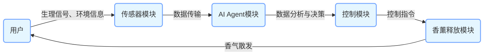

# AI Agent在智能香薰机中的情绪调节

> 关键词：AI Agent、智能香薰机、情绪调节、人工智能、传感器、用户体验

> 摘要：本文深入探讨了AI Agent在智能香薰机中实现情绪调节的相关技术与应用。详细阐述了AI Agent和智能香薰机的核心概念及其联系，剖析了实现情绪调节的核心算法原理与具体操作步骤，借助数学模型和公式加深对其的理解。通过项目实战给出代码实际案例并进行详细解释，介绍了其在不同场景下的实际应用。同时推荐了相关的学习资源、开发工具框架以及论文著作，最后对未来发展趋势与挑战进行总结，并提供常见问题解答和参考资料，旨在为该领域的研究和实践提供全面且深入的技术指导。

## 1. 背景介绍 
### 1.1 目的和范围
随着人们对生活品质的追求不断提高，对情绪健康的关注也日益增加。智能香薰机作为一种能够改善室内气味环境的设备，逐渐成为人们日常生活中的一部分。而AI Agent的引入，使得智能香薰机不仅能够简单地散发香气，还能根据用户的情绪状态进行智能化的调节，从而更好地满足用户的需求。本文章的目的在于深入探讨AI Agent在智能香薰机中实现情绪调节的技术原理、实现方法以及应用场景，范围涵盖了从核心概念的讲解到实际项目的开发，再到相关资源的推荐和未来趋势的展望。

### 1.2 预期读者
本文预期读者包括对人工智能、智能家居、情绪调节技术等领域感兴趣的研究人员、开发者、技术爱好者以及相关行业的从业者。无论是希望深入了解AI Agent在智能香薰机中应用的原理，还是想要进行相关项目开发的人员，都能从本文中获得有价值的信息。

### 1.3 文档结构概述
本文首先介绍AI Agent和智能香薰机的背景知识，包括目的、预期读者和文档结构等内容。接着阐述核心概念与联系，通过文本示意图和Mermaid流程图展示其架构。然后详细讲解核心算法原理和具体操作步骤，并给出Python源代码。之后介绍数学模型和公式，结合举例说明。再通过项目实战给出代码实际案例并进行详细解释。随后介绍实际应用场景，推荐相关工具和资源。最后总结未来发展趋势与挑战，提供常见问题解答和参考资料。

### 1.4 术语表
#### 1.4.1 核心术语定义
- **AI Agent（人工智能代理）**：是一种能够感知环境、进行决策并采取行动以实现特定目标的智能实体。它可以通过学习和推理来适应不同的环境和任务。
- **智能香薰机**：一种具备智能化功能的香薰设备，能够通过各种传感器感知环境信息，并根据预设的程序或用户指令散发不同的香气。
- **情绪调节**：通过各种手段和方法，对个体的情绪状态进行调整和优化，使其达到更加积极、稳定的状态。

#### 1.4.2 相关概念解释
- **传感器技术**：用于感知环境中的各种物理量和化学量，如温度、湿度、气味、人体生理信号等，为AI Agent提供决策所需的信息。
- **机器学习算法**：AI Agent通过机器学习算法对传感器采集的数据进行分析和处理，从而学习用户的情绪模式和偏好，实现智能化的决策。
- **香气疗法**：利用植物精油的香气来调节人的情绪和生理状态，不同的香气具有不同的功效，如放松、提神、舒缓压力等。

#### 1.4.3 缩略词列表
- **AI**：Artificial Intelligence（人工智能）
- **ML**：Machine Learning（机器学习）
- **IoT**：Internet of Things（物联网）

## 2. 核心概念与联系 

### 核心概念原理
AI Agent在智能香薰机中的情绪调节主要基于以下几个核心概念：
- **感知**：智能香薰机通过各种传感器收集环境信息和用户的生理信号，如温度、湿度、心率、皮肤电反应等。这些传感器就像是AI Agent的“眼睛”和“耳朵”，为其提供决策所需的原始数据。
- **决策**：AI Agent根据感知到的数据，利用机器学习算法进行分析和处理，判断用户的情绪状态。然后根据预设的规则和模型，选择合适的香气和散发模式，以实现情绪调节的目的。
- **行动**：智能香薰机根据AI Agent的决策，控制香薰的散发量、散发时间和香气种类等参数，将合适的香气释放到环境中，从而影响用户的情绪和心理状态。

### 架构的文本示意图
```plaintext
智能香薰机系统架构

用户
|
| 生理信号（心率、皮肤电反应等）
| 环境信息（温度、湿度、气味等）
v
传感器模块
|
| 数据传输
v
AI Agent模块
|
| 数据分析与决策
v
控制模块
|
| 控制指令
v
香薰释放模块
|
| 香气散发
v
用户（情绪得到调节）
```

### Mermaid流程图


## 3. 核心算法原理 & 具体操作步骤 

### 核心算法原理
AI Agent在智能香薰机中实现情绪调节的核心算法主要基于机器学习和模式识别技术。具体步骤如下：
1. **数据采集**：通过传感器收集用户的生理信号和环境信息，如心率、皮肤电反应、温度、湿度等。
2. **数据预处理**：对采集到的数据进行清洗、归一化等预处理操作，以提高数据的质量和可用性。
3. **特征提取**：从预处理后的数据中提取能够反映用户情绪状态的特征，如心率变异性、皮肤电反应的变化率等。
4. **模型训练**：使用机器学习算法，如支持向量机（SVM）、神经网络等，对提取的特征进行训练，建立情绪识别模型。
5. **情绪识别**：将实时采集到的数据输入到训练好的模型中，进行情绪识别，判断用户的情绪状态。
6. **决策制定**：根据识别出的情绪状态，结合预设的规则和模型，选择合适的香气和散发模式。
7. **控制执行**：将决策结果转化为控制指令，发送给智能香薰机的控制模块，控制香薰的散发。

### 具体操作步骤及Python源代码
以下是一个简单的示例代码，演示了如何使用Python实现基于心率数据的情绪识别和香薰控制：

```python
import numpy as np
from sklearn.svm import SVC

# 模拟心率数据采集
def collect_heart_rate():
    # 这里简单模拟心率数据，实际应用中需要通过传感器采集
    heart_rate = np.random.randint(60, 120)
    return heart_rate

# 数据预处理
def preprocess_data(heart_rate):
    # 简单的归一化处理
    normalized_heart_rate = (heart_rate - 60) / (120 - 60)
    return normalized_heart_rate

# 特征提取
def extract_features(normalized_heart_rate):
    # 这里简单将归一化后的心率作为特征
    features = [normalized_heart_rate]
    return features

# 模型训练
def train_model():
    # 模拟训练数据
    X_train = np.array([[0.2], [0.4], [0.6], [0.8]])
    y_train = np.array([0, 0, 1, 1])  # 0表示平静，1表示紧张

    # 使用支持向量机进行训练
    model = SVC()
    model.fit(X_train, y_train)
    return model

# 情绪识别
def recognize_emotion(model, features):
    emotion = model.predict([features])
    return emotion

# 决策制定
def make_decision(emotion):
    if emotion == 0:
        # 平静状态，选择放松的香气
        aroma = "薰衣草"
        intensity = 0.5
    else:
        # 紧张状态，选择提神的香气
        aroma = "薄荷"
        intensity = 0.8
    return aroma, intensity

# 控制执行
def control_fragrance(aroma, intensity):
    print(f"释放香气：{aroma}，强度：{intensity}")

# 主程序
if __name__ == "__main__":
    # 训练模型
    model = train_model()

    # 数据采集
    heart_rate = collect_heart_rate()

    # 数据预处理
    normalized_heart_rate = preprocess_data(heart_rate)

    # 特征提取
    features = extract_features(normalized_heart_rate)

    # 情绪识别
    emotion = recognize_emotion(model, features)

    # 决策制定
    aroma, intensity = make_decision(emotion)

    # 控制执行
    control_fragrance(aroma, intensity)
```

## 4. 数学模型和公式 & 详细讲解 & 举例说明 

### 数据预处理 - 归一化公式
在数据预处理阶段，常用的归一化方法是线性归一化，其公式为：
$$
x_{normalized} = \frac{x - x_{min}}{x_{max} - x_{min}}
$$
其中，$x$ 是原始数据，$x_{min}$ 和 $x_{max}$ 分别是数据的最小值和最大值，$x_{normalized}$ 是归一化后的数据。

例如，假设心率数据的最小值为 60，最大值为 120，当前采集到的心率为 80，则归一化后的心率为：
$$
x_{normalized} = \frac{80 - 60}{120 - 60} = \frac{20}{60} \approx 0.33
$$

### 支持向量机（SVM）模型
支持向量机是一种常用的机器学习算法，用于分类和回归分析。在情绪识别中，我们可以使用SVM来对用户的情绪状态进行分类。

SVM的基本思想是在特征空间中找到一个最优的超平面，使得不同类别的样本能够被最大程度地分开。对于二分类问题，SVM的目标是找到一个超平面 $w^T x + b = 0$，其中 $w$ 是超平面的法向量，$b$ 是偏置项，满足以下条件：
$$
\begin{cases}
w^T x_i + b \geq 1, & y_i = 1 \\
w^T x_i + b \leq -1, & y_i = -1
\end{cases}
$$
其中，$x_i$ 是样本数据，$y_i$ 是样本的标签（1 或 -1）。

为了找到最优的超平面，我们需要最小化以下目标函数：
$$
\min_{w, b} \frac{1}{2} \| w \|^2 + C \sum_{i=1}^{n} \xi_i
$$
其中，$C$ 是惩罚参数，$\xi_i$ 是松弛变量，用于处理样本的误分类情况。

### 举例说明
假设我们有以下训练数据：
| 心率（归一化后） | 情绪标签 |
| --- | --- |
| 0.2 | 0（平静） |
| 0.4 | 0（平静） |
| 0.6 | 1（紧张） |
| 0.8 | 1（紧张） |

使用SVM算法对这些数据进行训练，得到的最优超平面可以将平静和紧张的样本分开。当我们采集到新的心率数据时，将其归一化后输入到训练好的SVM模型中，就可以预测用户的情绪状态。

## 5. 项目实战：代码实际案例和详细解释说明 

### 5.1  开发环境搭建
- **硬件环境**：
    - 智能香薰机：具备香薰释放控制功能和通信接口。
    - 传感器模块：包括心率传感器、皮肤电反应传感器、温度传感器、湿度传感器等。
    - 开发板：如树莓派、Arduino等，用于数据采集和处理。
- **软件环境**：
    - 操作系统：如Raspbian（树莓派）、Arduino IDE（Arduino）等。
    - 编程语言：Python，用于实现AI Agent的算法和控制逻辑。
    - 机器学习库：如Scikit-learn，用于实现机器学习算法。
    - 通信库：如PySerial，用于与传感器模块和智能香薰机进行通信。

### 5.2  源代码详细实现和代码解读
以下是一个完整的项目实战代码示例，实现了基于多种传感器数据的情绪调节功能：

```python
import serial
import numpy as np
from sklearn.svm import SVC

# 串口通信配置
ser = serial.Serial('/dev/ttyUSB0', 9600)

# 模拟训练数据
X_train = np.array([[0.2, 0.3], [0.4, 0.4], [0.6, 0.6], [0.8, 0.7]])
y_train = np.array([0, 0, 1, 1])  # 0表示平静，1表示紧张

# 模型训练
model = SVC()
model.fit(X_train, y_train)

# 数据采集
def collect_data():
    # 从串口读取传感器数据
    data = ser.readline().decode('utf-8').strip().split(',')
    heart_rate = float(data[0])
    skin_conductance = float(data[1])
    return heart_rate, skin_conductance

# 数据预处理
def preprocess_data(heart_rate, skin_conductance):
    # 心率归一化
    normalized_heart_rate = (heart_rate - 60) / (120 - 60)
    # 皮肤电反应归一化
    normalized_skin_conductance = (skin_conductance - 0) / (1 - 0)
    return normalized_heart_rate, normalized_skin_conductance

# 特征提取
def extract_features(normalized_heart_rate, normalized_skin_conductance):
    features = [normalized_heart_rate, normalized_skin_conductance]
    return features

# 情绪识别
def recognize_emotion(model, features):
    emotion = model.predict([features])
    return emotion

# 决策制定
def make_decision(emotion):
    if emotion == 0:
        # 平静状态，选择放松的香气
        aroma = "薰衣草"
        intensity = 0.5
    else:
        # 紧张状态，选择提神的香气
        aroma = "薄荷"
        intensity = 0.8
    return aroma, intensity

# 控制执行
def control_fragrance(aroma, intensity):
    # 发送控制指令到智能香薰机
    command = f"{aroma},{intensity}"
    ser.write(command.encode('utf-8'))

# 主程序
if __name__ == "__main__":
    while True:
        # 数据采集
        heart_rate, skin_conductance = collect_data()

        # 数据预处理
        normalized_heart_rate, normalized_skin_conductance = preprocess_data(heart_rate, skin_conductance)

        # 特征提取
        features = extract_features(normalized_heart_rate, normalized_skin_conductance)

        # 情绪识别
        emotion = recognize_emotion(model, features)

        # 决策制定
        aroma, intensity = make_decision(emotion)

        # 控制执行
        control_fragrance(aroma, intensity)
```

### 5.3  代码解读与分析
- **串口通信配置**：使用 `serial.Serial` 函数配置串口通信，与传感器模块和智能香薰机进行数据传输。
- **模型训练**：使用 `SVC` 类创建支持向量机模型，并使用模拟训练数据进行训练。
- **数据采集**：从串口读取传感器数据，包括心率和皮肤电反应。
- **数据预处理**：对采集到的数据进行归一化处理，提高数据的可用性。
- **特征提取**：将归一化后的数据作为特征，用于情绪识别。
- **情绪识别**：使用训练好的模型对特征进行预测，判断用户的情绪状态。
- **决策制定**：根据情绪状态选择合适的香气和散发强度。
- **控制执行**：将决策结果转化为控制指令，发送到智能香薰机。

## 6. 实际应用场景 
### 家庭环境
在家庭环境中，智能香薰机可以根据家庭成员的情绪状态进行香气调节。例如，当家庭成员工作或学习感到压力大时，智能香薰机可以释放薄荷等提神的香气，帮助他们集中注意力；当家庭成员休息或放松时，智能香薰机可以释放薰衣草等放松的香气，帮助他们缓解压力、促进睡眠。

### 办公环境
在办公环境中，智能香薰机可以提高员工的工作效率和情绪状态。例如，在工作日的上午，智能香薰机可以释放柠檬等清新的香气，帮助员工提神醒脑；在工作日的下午，智能香薰机可以释放茉莉花等舒缓的香气，帮助员工缓解疲劳。

### 医疗保健机构
在医疗保健机构中，智能香薰机可以用于辅助治疗和康复。例如，在心理咨询室中，智能香薰机可以释放檀香等安神的香气，帮助患者放松心情、缓解焦虑；在康复病房中，智能香薰机可以释放玫瑰等愉悦的香气，帮助患者提高情绪状态、促进康复。

### 酒店和旅游场所
在酒店和旅游场所中，智能香薰机可以提升顾客的体验感和满意度。例如，在酒店客房中，智能香薰机可以根据顾客的喜好和情绪状态释放不同的香气，营造舒适的住宿环境；在旅游景区的休息区中，智能香薰机可以释放香草等自然的香气，让游客感受到身心的放松。

## 7. 工具和资源推荐
### 7.1 学习资源推荐
#### 7.1.1 书籍推荐
- 《Python机器学习实战》：介绍了Python在机器学习领域的应用，包括各种机器学习算法的原理和实现。
- 《人工智能：一种现代的方法》：全面介绍了人工智能的基本概念、算法和应用，是人工智能领域的经典教材。
- 《香气疗法全书》：详细介绍了香气疗法的原理、方法和应用，对于了解香气对情绪的影响有很大的帮助。

#### 7.1.2 在线课程
- Coursera上的“机器学习”课程：由斯坦福大学教授Andrew Ng主讲，是机器学习领域的经典课程。
- edX上的“人工智能基础”课程：介绍了人工智能的基本概念、算法和应用，适合初学者学习。
- Udemy上的“Python数据分析与机器学习实战”课程：通过实际项目案例，介绍了Python在数据分析和机器学习领域的应用。

#### 7.1.3 技术博客和网站
- Medium：一个开放的技术博客平台，有很多关于人工智能、机器学习和智能家居的技术文章。
- 机器之心：专注于人工智能领域的资讯和技术分享，提供了很多有价值的技术文章和研究报告。
- 智能家居网：提供智能家居领域的最新资讯、产品评测和技术分享，对于了解智能香薰机的发展和应用有很大的帮助。

### 7.2 开发工具框架推荐
#### 7.2.1 IDE和编辑器
- PyCharm：一款专业的Python集成开发环境，提供了丰富的功能和插件，适合Python项目的开发。
- Visual Studio Code：一款轻量级的代码编辑器，支持多种编程语言和插件，适合快速开发和调试。
- Arduino IDE：用于Arduino开发板的集成开发环境，提供了简单易用的编程界面和工具。

#### 7.2.2 调试和性能分析工具
- pdb：Python的内置调试工具，可以帮助开发者调试Python代码。
- cProfile：Python的性能分析工具，可以帮助开发者分析代码的性能瓶颈。
- Serial Monitor：Arduino IDE自带的串口监视器，用于调试串口通信。

#### 7.2.3 相关框架和库
- Scikit-learn：一个强大的Python机器学习库，提供了各种机器学习算法和工具。
- TensorFlow：一个开源的深度学习框架，用于构建和训练深度学习模型。
- PySerial：一个Python串口通信库，用于与串口设备进行通信。

### 7.3 相关论文著作推荐
#### 7.3.1 经典论文
- “Support-Vector Networks”：介绍了支持向量机的基本原理和算法，是支持向量机领域的经典论文。
- “A Neural Algorithm of Artistic Style”：介绍了深度学习在艺术风格迁移中的应用，为人工智能在艺术领域的发展奠定了基础。
- “The Emotion Machine: Commonsense Thinking, Artificial Intelligence, and the Future of the Human Mind”：探讨了人工智能与人类情绪的关系，对于理解AI Agent在情绪调节中的应用有很大的启发。

#### 7.3.2 最新研究成果
- “Emotion Recognition from Physiological Signals: A Review”：对基于生理信号的情绪识别技术进行了全面的综述，介绍了最新的研究成果和发展趋势。
- “Smart Home Systems for Emotion Regulation: A Survey”：对智能家居系统在情绪调节中的应用进行了调查和分析，介绍了最新的研究成果和应用案例。
- “Aroma Therapy and Emotion Regulation: A Meta-Analysis”：通过元分析的方法，对香气疗法在情绪调节中的效果进行了评估，为智能香薰机的设计和应用提供了科学依据。

#### 7.3.3 应用案例分析
- “Case Study: Using AI-Enabled Smart Diffusers for Mood Enhancement in Office Environments”：介绍了在办公环境中使用AI智能香薰机进行情绪调节的应用案例，分析了其效果和应用前景。
- “Application of Smart Fragrance Diffusers in Healthcare Settings: A Case Report”：介绍了智能香薰机在医疗保健机构中的应用案例，分析了其在辅助治疗和康复中的作用。
- “Enhancing Customer Experience with Smart Fragrance Systems in Hotels: A Case Study”：介绍了在酒店中使用智能香薰系统提升顾客体验的应用案例，分析了其市场潜力和经济效益。

## 8. 总结：未来发展趋势与挑战
### 未来发展趋势
- **个性化定制**：未来的智能香薰机将能够根据用户的个人偏好、情绪模式和生理特征，提供更加个性化的香气调节方案，满足用户的多样化需求。
- **多模态融合**：智能香薰机将不仅仅依赖于生理信号和环境信息进行情绪识别，还将融合语音、图像、文本等多模态信息，提高情绪识别的准确性和可靠性。
- **与其他智能家居设备的集成**：智能香薰机将与其他智能家居设备，如智能灯光、智能音响等进行集成，实现更加智能化、协同化的家居环境控制，为用户提供更加舒适、便捷的生活体验。
- **云服务和大数据分析**：通过云服务和大数据分析，智能香薰机可以收集和分析大量的用户数据，不断优化情绪识别模型和香气调节策略，提高系统的性能和效果。

### 挑战
- **情绪识别的准确性**：目前，情绪识别技术仍然存在一定的局限性，准确性有待提高。如何通过多模态信息融合、深度学习等技术，提高情绪识别的准确性和可靠性，是未来需要解决的关键问题之一。
- **用户隐私和数据安全**：智能香薰机在收集和处理用户的生理信号和个人信息时，需要充分考虑用户隐私和数据安全问题。如何采用加密技术、匿名化处理等手段，保障用户的隐私和数据安全，是未来需要关注的重要问题。
- **香气的标准化和质量控制**：不同的香气对情绪的影响可能存在差异，而且香气的质量和纯度也会影响其效果。如何建立香气的标准化体系，控制香气的质量和纯度，是未来需要解决的问题之一。
- **用户接受度**：智能香薰机作为一种新兴的智能家居设备，用户对其功能和效果的认知和接受度还需要进一步提高。如何通过宣传和推广，提高用户对智能香薰机的认知和接受度，是未来需要解决的市场问题之一。

## 9. 附录：常见问题与解答
### 1. 智能香薰机的情绪识别准确率有多高？
目前，智能香薰机的情绪识别准确率受到多种因素的影响，如传感器的精度、算法的复杂度、用户个体差异等。一般来说，基于单一生理信号的情绪识别准确率在70% - 80%左右，而通过多模态信息融合的方法，可以将准确率提高到80% - 90%左右。

### 2. 智能香薰机对人体健康有影响吗？
智能香薰机使用的植物精油一般是天然的，对人体健康没有明显的副作用。但是，某些人可能对某些香气过敏或不适应，使用时需要注意观察自己的身体反应。此外，过量使用香薰可能会导致头晕、恶心等不适症状，因此需要合理控制香薰的散发量和时间。

### 3. 智能香薰机可以使用哪些香气？
智能香薰机可以使用各种植物精油，常见的香气包括薰衣草、薄荷、柠檬、茉莉花、玫瑰、檀香等。不同的香气具有不同的功效，如放松、提神、舒缓压力、促进睡眠等，可以根据自己的需求和情绪状态选择合适的香气。

### 4. 智能香薰机的使用寿命有多长？
智能香薰机的使用寿命受到多种因素的影响，如使用频率、使用环境、维护保养等。一般来说，正常使用情况下，智能香薰机的使用寿命在2 - 5年左右。定期进行清洁和维护，可以延长智能香薰机的使用寿命。

### 5. 智能香薰机可以与手机APP连接吗？
大多数智能香薰机都支持与手机APP连接，通过手机APP可以实现远程控制、香气调节、情绪监测等功能。用户可以根据自己的需求和喜好，在手机APP上设置智能香薰机的工作模式和参数。

## 10. 扩展阅读 & 参考资料
### 扩展阅读
- 《智能家居技术与应用》：介绍了智能家居的基本概念、技术和应用，对于了解智能香薰机在智能家居系统中的地位和作用有很大的帮助。
- 《情绪心理学》：介绍了情绪的基本概念、理论和研究方法，对于深入理解情绪调节的原理和机制有很大的帮助。
- 《人工智能的未来》：探讨了人工智能的发展趋势和未来前景，对于思考AI Agent在智能香薰机中的应用前景和发展方向有很大的启发。

### 参考资料
- [Scikit-learn官方文档](https://scikit-learn.org/stable/)
- [TensorFlow官方文档](https://www.tensorflow.org/)
- [PySerial官方文档](https://pythonhosted.org/pyserial/)
- [相关学术期刊和会议论文](https://www.sciencedirect.com/、https://ieeexplore.ieee.org/)