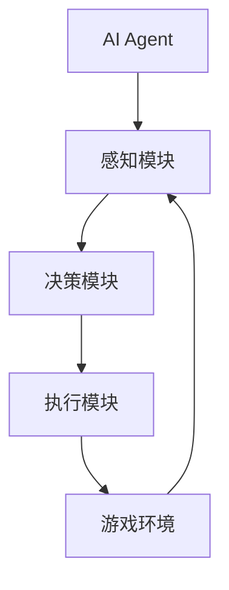

# AI Agent在游戏产业中的应用

> 关键词：AI Agent、游戏产业、智能决策、行为模拟、游戏开发、玩家体验、游戏平衡

> 摘要：本文深入探讨了AI Agent在游戏产业中的应用。首先介绍了AI Agent的背景知识，包括其概念、与游戏产业结合的目的和范围等。接着阐述了AI Agent的核心概念与联系，通过示意图和流程图展示其架构原理。详细讲解了核心算法原理，用Python代码进行阐述，并给出数学模型和公式。通过项目实战展示了AI Agent在游戏中的具体实现和代码解读。分析了AI Agent在游戏产业中的实际应用场景，推荐了相关的学习资源、开发工具框架和论文著作。最后总结了AI Agent在游戏产业中的未来发展趋势与挑战，还提供了常见问题与解答以及扩展阅读和参考资料，旨在全面深入地剖析AI Agent在游戏产业中的应用情况。

## 1. 背景介绍 
### 1.1 目的和范围
AI Agent在游戏产业中的应用研究旨在探索如何利用智能体技术提升游戏的趣味性、真实感和挑战性，为玩家带来更加优质的游戏体验。其范围涵盖了从简单的单机游戏到复杂的大型多人在线游戏，涉及游戏中的非玩家角色（NPC）行为模拟、游戏关卡设计、游戏平衡调整等多个方面。通过研究AI Agent在游戏产业中的应用，能够推动游戏技术的创新发展，使游戏更加智能、更加贴近现实。

### 1.2 预期读者
本文预期读者包括游戏开发者、人工智能研究者、游戏行业从业者以及对游戏技术和人工智能感兴趣的爱好者。对于游戏开发者来说，可以从中获取关于AI Agent在游戏开发中的具体实现方法和技术思路；人工智能研究者可以了解AI Agent在游戏领域的应用场景和挑战，为进一步的研究提供方向；游戏行业从业者能够了解行业的技术发展趋势，为产品的规划和设计提供参考；而爱好者则可以通过本文深入了解游戏背后的技术原理，增加对游戏的兴趣和认知。

### 1.3 文档结构概述
本文首先介绍AI Agent的背景知识，包括目的、预期读者和文档结构等。接着阐述AI Agent的核心概念与联系，通过文本示意图和Mermaid流程图展示其架构原理。然后详细讲解核心算法原理，用Python代码进行阐述，并给出数学模型和公式。通过项目实战展示AI Agent在游戏中的具体实现和代码解读。分析AI Agent在游戏产业中的实际应用场景，推荐相关的学习资源、开发工具框架和论文著作。最后总结AI Agent在游戏产业中的未来发展趋势与挑战，还提供常见问题与解答以及扩展阅读和参考资料。

### 1.4 术语表
#### 1.4.1 核心术语定义
- **AI Agent（人工智能智能体）**：是一种能够感知环境、进行决策并采取行动的智能实体。在游戏中，AI Agent可以模拟各种角色的行为，如非玩家角色（NPC）的移动、攻击、防御等。
- **游戏产业**：指与游戏的开发、发行、运营等相关的一系列产业活动，包括单机游戏、网络游戏、移动游戏等多个领域。
- **非玩家角色（NPC）**：是游戏中不由玩家控制的角色，其行为通常由游戏程序或AI Agent控制。
- **游戏平衡**：指游戏中各个元素之间的相对关系达到一种合理、公平的状态，以保证游戏的趣味性和挑战性。

#### 1.4.2 相关概念解释
- **智能决策**：AI Agent根据感知到的环境信息，运用一定的算法和策略进行分析和判断，从而做出最优的决策。
- **行为模拟**：通过AI Agent模拟真实角色的行为模式，使游戏中的角色更加生动、真实。
- **游戏关卡设计**：指设计游戏中的各个关卡，包括关卡的难度、任务目标、场景布局等，AI Agent可以在关卡设计中发挥重要作用。

#### 1.4.3 缩略词列表
- **NPC**：Non-Player Character（非玩家角色）
- **AI**：Artificial Intelligence（人工智能）

## 2. 核心概念与联系 
### 2.1 AI Agent的概念原理
AI Agent是一种能够自主感知环境、进行决策并采取行动的智能实体。它通常由感知模块、决策模块和执行模块组成。感知模块负责收集环境信息，如游戏中的地图信息、其他角色的位置等；决策模块根据感知到的信息，运用一定的算法和策略进行分析和判断，做出最优的决策；执行模块则根据决策模块的结果，采取相应的行动，如移动、攻击等。

### 2.2 AI Agent与游戏产业的联系
AI Agent在游戏产业中有着广泛的应用，它可以提升游戏的趣味性、真实感和挑战性。通过AI Agent可以模拟非玩家角色（NPC）的行为，使NPC更加智能、更加真实，增加游戏的互动性；可以优化游戏关卡设计，根据玩家的游戏水平和行为习惯动态调整关卡难度，提高游戏的挑战性；还可以进行游戏平衡调整，确保游戏中各个元素之间的相对关系达到合理、公平的状态。

### 2.3 文本示意图
```plaintext
         +----------------+
         |  AI Agent      |
         | +------------+ |
         | | 感知模块   | |
         | +------------+ |
         | +------------+ |
         | | 决策模块   | |
         | +------------+ |
         | +------------+ |
         | | 执行模块   | |
         | +------------+ |
         +----------------+
                |
                v
         +----------------+
         | 游戏环境       |
         | +------------+ |
         | | 地图信息   | |
         | +------------+ |
         | +------------+ |
         | | 角色信息   | |
         | +------------+ |
         | +------------+ |
         | | 其他信息   | |
         | +------------+ |
         +----------------+
```

### 2.4 Mermaid流程图


## 3. 核心算法原理 & 具体操作步骤 
### 3.1 核心算法原理
在AI Agent中，常用的算法包括有限状态机（Finite State Machine，FSM）、行为树（Behavior Tree）、强化学习（Reinforcement Learning）等。下面以有限状态机为例进行详细讲解。

有限状态机是一种数学模型，它由一组状态、状态之间的转移条件和动作组成。在游戏中，AI Agent可以根据当前的状态和环境信息，决定是否进行状态转移，并执行相应的动作。

### 3.2 Python源代码详细阐述
```python
# 定义状态类
class State:
    def __init__(self, name):
        self.name = name

    def enter(self):
        print(f"Entering state: {self.name}")

    def execute(self):
        print(f"Executing state: {self.name}")

    def exit(self):
        print(f"Exiting state: {self.name}")

# 定义有限状态机类
class FiniteStateMachine:
    def __init__(self):
        self.current_state = None
        self.states = {}

    def add_state(self, state):
        self.states[state.name] = state

    def set_initial_state(self, state_name):
        self.current_state = self.states[state_name]
        self.current_state.enter()

    def update(self):
        if self.current_state:
            self.current_state.execute()

    def transition_to(self, state_name):
        if self.current_state:
            self.current_state.exit()
        self.current_state = self.states[state_name]
        self.current_state.enter()

# 示例使用
if __name__ == "__main__":
    # 创建状态
    idle_state = State("Idle")
    move_state = State("Move")
    attack_state = State("Attack")

    # 创建有限状态机
    fsm = FiniteStateMachine()
    fsm.add_state(idle_state)
    fsm.add_state(move_state)
    fsm.add_state(attack_state)

    # 设置初始状态
    fsm.set_initial_state("Idle")

    # 模拟状态转移
    fsm.transition_to("Move")
    fsm.update()
    fsm.transition_to("Attack")
    fsm.update()
```

### 3.3 具体操作步骤
1. **定义状态类**：定义一个状态类，包含状态的名称、进入状态的方法、执行状态的方法和退出状态的方法。
2. **定义有限状态机类**：定义一个有限状态机类，包含当前状态、状态集合等属性，以及添加状态、设置初始状态、更新状态和状态转移等方法。
3. **创建状态和有限状态机**：创建具体的状态对象，并将其添加到有限状态机中。
4. **设置初始状态**：设置有限状态机的初始状态，并调用进入状态的方法。
5. **模拟状态转移**：根据环境信息，调用状态转移方法，实现状态的切换，并调用相应的进入、执行和退出方法。

## 4. 数学模型和公式 & 详细讲解 & 举例说明 
### 4.1 数学模型
有限状态机可以用一个五元组 $M = (Q, \Sigma, \delta, q_0, F)$ 来表示，其中：
- $Q$ 是一个有限的状态集合；
- $\Sigma$ 是一个有限的输入符号集合；
- $\delta: Q \times \Sigma \rightarrow Q$ 是状态转移函数，表示在当前状态下接收到输入符号后转移到的下一个状态；
- $q_0 \in Q$ 是初始状态；
- $F \subseteq Q$ 是终止状态集合。

### 4.2 详细讲解
在游戏中，状态集合 $Q$ 可以表示AI Agent的不同状态，如空闲状态、移动状态、攻击状态等；输入符号集合 $\Sigma$ 可以表示环境信息，如玩家的位置、敌人的位置等；状态转移函数 $\delta$ 则根据当前状态和输入信息，决定AI Agent的下一个状态。初始状态 $q_0$ 是AI Agent开始时的状态，终止状态集合 $F$ 可以表示游戏结束或AI Agent完成任务的状态。

### 4.3 举例说明
假设一个简单的游戏场景，AI Agent有三个状态：空闲状态（$q_1$）、移动状态（$q_2$）和攻击状态（$q_3$）。输入符号集合 $\Sigma = \{s_1, s_2\}$，其中 $s_1$ 表示玩家靠近，$s_2$ 表示玩家远离。状态转移函数 $\delta$ 定义如下：
- $\delta(q_1, s_1) = q_2$：当AI Agent处于空闲状态，且玩家靠近时，转移到移动状态。
- $\delta(q_2, s_1) = q_3$：当AI Agent处于移动状态，且玩家靠近时，转移到攻击状态。
- $\delta(q_3, s_2) = q_2$：当AI Agent处于攻击状态，且玩家远离时，转移到移动状态。
- $\delta(q_2, s_2) = q_1$：当AI Agent处于移动状态，且玩家远离时，转移到空闲状态。

初始状态 $q_0 = q_1$，没有终止状态（$F = \varnothing$）。这样，AI Agent就可以根据玩家的位置信息，动态地切换状态，实现智能行为。

## 5. 项目实战：代码实际案例和详细解释说明 
### 5.1  开发环境搭建
#### 5.1.1 安装Python
首先需要安装Python，建议使用Python 3.x版本。可以从Python官方网站（https://www.python.org/downloads/）下载并安装适合自己操作系统的Python版本。

#### 5.1.2 安装游戏开发库
在本项目中，我们使用Pygame库来开发游戏。可以使用以下命令来安装Pygame：
```sh
pip install pygame
```

### 5.2  源代码详细实现和代码解读
```python
import pygame
import random

# 初始化Pygame
pygame.init()

# 定义屏幕尺寸
SCREEN_WIDTH = 800
SCREEN_HEIGHT = 600

# 创建屏幕对象
screen = pygame.display.set_mode((SCREEN_WIDTH, SCREEN_HEIGHT))
pygame.display.set_caption("AI Agent in Game")

# 定义颜色
WHITE = (255, 255, 255)
BLACK = (0, 0, 0)
RED = (255, 0, 0)

# 定义玩家类
class Player(pygame.sprite.Sprite):
    def __init__(self):
        super().__init__()
        self.image = pygame.Surface((50, 50))
        self.image.fill(RED)
        self.rect = self.image.get_rect()
        self.rect.center = (SCREEN_WIDTH // 2, SCREEN_HEIGHT // 2)
        self.speed = 5

    def update(self):
        keys = pygame.key.get_pressed()
        if keys[pygame.K_UP] and self.rect.top > 0:
            self.rect.y -= self.speed
        if keys[pygame.K_DOWN] and self.rect.bottom < SCREEN_HEIGHT:
            self.rect.y += self.speed
        if keys[pygame.K_LEFT] and self.rect.left > 0:
            self.rect.x -= self.speed
        if keys[pygame.K_RIGHT] and self.rect.right < SCREEN_WIDTH:
            self.rect.x += self.speed

# 定义AI Agent类
class AIAgent(pygame.sprite.Sprite):
    def __init__(self):
        super().__init__()
        self.image = pygame.Surface((50, 50))
        self.image.fill(BLACK)
        self.rect = self.image.get_rect()
        self.rect.x = random.randint(0, SCREEN_WIDTH - 50)
        self.rect.y = random.randint(0, SCREEN_HEIGHT - 50)
        self.speed = 3
        self.state = "idle"

    def update(self, player):
        if self.state == "idle":
            if pygame.sprite.collide_rect(self, player):
                self.state = "attack"
            else:
                # 随机移动
                dx = random.randint(-1, 1) * self.speed
                dy = random.randint(-1, 1) * self.speed
                new_x = self.rect.x + dx
                new_y = self.rect.y + dy
                if 0 <= new_x <= SCREEN_WIDTH - 50 and 0 <= new_y <= SCREEN_HEIGHT - 50:
                    self.rect.x = new_x
                    self.rect.y = new_y
        elif self.state == "attack":
            if pygame.sprite.collide_rect(self, player):
                # 攻击玩家
                print("Attacking player!")
            else:
                # 追逐玩家
                if player.rect.x > self.rect.x:
                    self.rect.x += self.speed
                elif player.rect.x < self.rect.x:
                    self.rect.x -= self.speed
                if player.rect.y > self.rect.y:
                    self.rect.y += self.speed
                elif player.rect.y < self.rect.y:
                    self.rect.y -= self.speed
                if not pygame.sprite.collide_rect(self, player):
                    self.state = "idle"

# 创建玩家和AI Agent对象
player = Player()
ai_agent = AIAgent()

# 创建精灵组
all_sprites = pygame.sprite.Group()
all_sprites.add(player)
all_sprites.add(ai_agent)

# 游戏主循环
running = True
clock = pygame.time.Clock()

while running:
    # 处理事件
    for event in pygame.event.get():
        if event.type == pygame.QUIT:
            running = False

    # 更新精灵
    all_sprites.update(player)

    # 绘制屏幕
    screen.fill(WHITE)
    all_sprites.draw(screen)

    # 更新显示
    pygame.display.flip()

    # 控制帧率
    clock.tick(60)

# 退出Pygame
pygame.quit()
```

### 5.3  代码解读与分析
#### 5.3.1 玩家类（Player）
- `__init__` 方法：初始化玩家的图像、位置和速度。
- `update` 方法：根据用户的按键输入，更新玩家的位置。

#### 5.3.2 AI Agent类（AIAgent）
- `__init__` 方法：初始化AI Agent的图像、位置、速度和初始状态。
- `update` 方法：根据当前状态和玩家的位置，更新AI Agent的行为。当处于空闲状态时，随机移动；当与玩家碰撞时，切换到攻击状态；在攻击状态下，攻击玩家或追逐玩家。

#### 5.3.3 游戏主循环
- 处理事件：包括退出事件。
- 更新精灵：调用玩家和AI Agent的 `update` 方法。
- 绘制屏幕：将所有精灵绘制到屏幕上。
- 更新显示：刷新屏幕显示。
- 控制帧率：确保游戏以60帧每秒的速度运行。

## 6. 实际应用场景 
### 6.1 非玩家角色（NPC）行为模拟
在游戏中，AI Agent可以模拟非玩家角色（NPC）的行为，使NPC更加智能、更加真实。例如，在角色扮演游戏中，NPC可以根据玩家的行为和对话做出不同的反应，增加游戏的互动性；在策略游戏中，NPC可以根据游戏局势制定不同的战略，提高游戏的挑战性。

### 6.2 游戏关卡设计
AI Agent可以在游戏关卡设计中发挥重要作用。通过分析玩家的游戏水平和行为习惯，动态调整关卡难度，使游戏更加适合玩家的能力。例如，在动作游戏中，如果玩家在某个关卡中多次失败，AI Agent可以降低关卡的难度，增加玩家的成功率；如果玩家轻松通过关卡，AI Agent可以提高关卡的难度，增加游戏的挑战性。

### 6.3 游戏平衡调整
AI Agent可以用于游戏平衡调整，确保游戏中各个元素之间的相对关系达到合理、公平的状态。例如，在多人在线竞技游戏中，AI Agent可以根据玩家的技能水平和游戏表现，动态调整玩家的匹配对手，使比赛更加公平；在游戏中，AI Agent可以调整不同角色的属性和技能，确保各个角色之间的平衡性。

### 6.4 游戏剧情生成
AI Agent可以根据玩家的行为和选择，动态生成游戏剧情，使游戏剧情更加丰富、多样化。例如，在冒险游戏中，玩家的不同选择会导致不同的剧情发展，AI Agent可以根据玩家的选择生成相应的剧情内容，增加游戏的趣味性和重玩性。

## 7. 工具和资源推荐
### 7.1 学习资源推荐
#### 7.1.1 书籍推荐
- 《人工智能：一种现代的方法》：这是一本经典的人工智能教材，全面介绍了人工智能的基本概念、算法和应用，对于理解AI Agent的原理和技术有很大帮助。
- 《游戏人工智能编程案例精粹》：专门介绍了游戏人工智能的相关知识和技术，通过实际案例详细讲解了AI Agent在游戏中的应用。

#### 7.1.2 在线课程
- Coursera上的“人工智能基础”课程：由知名高校的教授授课，系统地介绍了人工智能的基础知识和算法。
- Udemy上的“游戏开发中的人工智能”课程：专注于游戏开发中人工智能的应用，通过实际项目讲解AI Agent的实现方法。

#### 7.1.3 技术博客和网站
- AI社区（https://www.ai.com）：提供了丰富的人工智能技术文章和案例，包括AI Agent在各个领域的应用。
- 游戏开发者论坛（https://www.gamedev.net）：游戏开发者交流的平台，有很多关于游戏人工智能的讨论和经验分享。

### 7.2 开发工具框架推荐
#### 7.2.1 IDE和编辑器
- PyCharm：一款专业的Python集成开发环境，提供了丰富的代码编辑、调试和管理功能，适合Python游戏开发。
- Visual Studio Code：一款轻量级的代码编辑器，支持多种编程语言和插件，可用于快速开发游戏。

#### 7.2.2 调试和性能分析工具
- PDB：Python自带的调试工具，可以帮助开发者调试Python代码，定位问题。
- cProfile：Python的性能分析工具，可以分析代码的执行时间和性能瓶颈。

#### 7.2.3 相关框架和库
- Pygame：一个简单易用的Python游戏开发库，提供了图形、声音、输入等功能，适合初学者快速开发游戏。
- TensorFlow：一个开源的机器学习框架，可以用于实现AI Agent的深度学习算法。

### 7.3 相关论文著作推荐
#### 7.3.1 经典论文
- “Playing Atari with Deep Reinforcement Learning”：介绍了使用深度强化学习算法玩Atari游戏的方法，为AI Agent在游戏中的应用提供了重要的理论基础。
- “AlphaGo Zero: Learning from Scratch”：阐述了AlphaGo Zero的原理和实现方法，展示了AI Agent在复杂游戏中的强大能力。

#### 7.3.2 最新研究成果
- 关注顶级学术会议如NeurIPS、ICML等上关于游戏人工智能的研究论文，了解最新的研究进展和技术趋势。

#### 7.3.3 应用案例分析
- 分析一些成功的游戏产品，如《星际争霸》《英雄联盟》等，了解AI Agent在实际游戏中的应用和优化方法。

## 8. 总结：未来发展趋势与挑战
### 8.1 未来发展趋势
#### 8.1.1 更加智能和真实的NPC
未来，AI Agent将使非玩家角色（NPC）更加智能和真实。NPC将能够理解玩家的情感和意图，做出更加自然和个性化的反应，与玩家建立更加深入的互动关系。

#### 8.1.2 动态游戏世界
AI Agent将推动游戏世界的动态化发展。游戏世界将根据玩家的行为和选择实时变化，生成不同的场景、任务和剧情，为玩家带来更加丰富和多样化的游戏体验。

#### 8.1.3 跨平台和多玩家协作
随着互联网和移动技术的发展，AI Agent将支持跨平台和多玩家协作。玩家可以在不同的设备上与其他玩家和AI Agent进行互动，共同完成游戏任务，增加游戏的社交性和趣味性。

#### 8.1.4 结合虚拟现实和增强现实技术
AI Agent将与虚拟现实（VR）和增强现实（AR）技术相结合，为玩家带来更加沉浸式的游戏体验。玩家可以身临其境地感受游戏世界，与AI Agent进行更加真实和直观的互动。

### 8.2 挑战
#### 8.2.1 计算资源需求
AI Agent的实现通常需要大量的计算资源，尤其是深度学习算法。在游戏开发中，如何在有限的计算资源下实现高效的AI Agent是一个挑战。

#### 8.2.2 算法复杂度和可解释性
一些复杂的AI算法，如深度强化学习，具有较高的复杂度和较低的可解释性。在游戏中，如何确保AI Agent的行为可预测、可解释，是一个需要解决的问题。

#### 8.2.3 数据隐私和安全
AI Agent在运行过程中需要收集和处理大量的玩家数据，如何保护玩家的隐私和数据安全是一个重要的挑战。

#### 8.2.4 伦理和道德问题
AI Agent的应用可能会引发一些伦理和道德问题，如AI Agent的行为是否符合人类的价值观和道德准则等。在游戏开发中，需要考虑这些问题，确保AI Agent的应用是合法、合规和道德的。

## 9. 附录：常见问题与解答
### 9.1 AI Agent在游戏中会取代玩家吗？
不会。AI Agent的主要作用是提升游戏的趣味性、真实感和挑战性，为玩家提供更好的游戏体验。它可以模拟非玩家角色的行为，与玩家进行互动，但不能完全取代玩家的角色和体验。

### 9.2 实现AI Agent需要很高的技术门槛吗？
实现简单的AI Agent可以使用一些基本的算法和技术，技术门槛相对较低。但要实现复杂的、具有高级智能的AI Agent，则需要掌握深度学习、强化学习等先进的技术，技术门槛较高。

### 9.3 AI Agent在游戏中的性能如何保证？
可以通过优化算法、减少计算复杂度、合理分配计算资源等方法来保证AI Agent在游戏中的性能。同时，使用高效的开发工具和框架也可以提高AI Agent的性能。

### 9.4 AI Agent在游戏中的应用会增加游戏的开发成本吗？
在一定程度上会增加游戏的开发成本。因为实现AI Agent需要投入更多的人力、物力和时间，尤其是使用复杂的算法和技术时。但从长远来看，AI Agent的应用可以提升游戏的品质和竞争力，为游戏带来更多的收益。

## 10. 扩展阅读 & 参考资料
### 10.1 扩展阅读
- 《深度学习》：深入介绍了深度学习的原理和应用，对于理解AI Agent中的深度学习算法有很大帮助。
- 《游戏设计艺术》：从游戏设计的角度介绍了游戏的各种要素和设计方法，对于理解AI Agent在游戏中的应用场景和设计思路有启发作用。

### 10.2 参考资料
- 人工智能相关的学术论文和研究报告。
- 游戏开发相关的技术文档和教程。
- 各大游戏公司的官方网站和技术博客，了解他们在AI Agent应用方面的经验和实践。