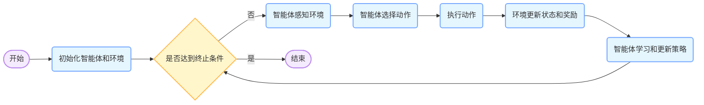

# AI Agent的多Agent博弈：策略学习与优化

> 关键词：AI Agent、多Agent博弈、策略学习、策略优化、博弈论、强化学习、智能决策

> 摘要：本文聚焦于AI Agent的多Agent博弈领域，深入探讨策略学习与优化的相关技术和方法。首先介绍多Agent博弈的背景知识，包括其目的、范围、预期读者等。接着阐述核心概念与联系，通过文本示意图和Mermaid流程图展示多Agent博弈的原理和架构。详细讲解核心算法原理，结合Python源代码进行具体操作步骤的说明。分析相关数学模型和公式，并举例说明。通过项目实战，展示代码实际案例并进行详细解释。探讨多Agent博弈的实际应用场景，推荐相关的学习资源、开发工具框架以及论文著作。最后总结未来发展趋势与挑战，解答常见问题并提供扩展阅读和参考资料，旨在为读者全面呈现多Agent博弈中策略学习与优化的全貌。

## 1. 背景介绍 
### 1.1 目的和范围
多Agent博弈是人工智能领域中一个极具挑战性和实际应用价值的研究方向。其目的在于研究多个智能体在相互作用的环境中如何制定和优化策略，以实现各自或共同的目标。范围涵盖了从简单的二人博弈到复杂的多智能体系统，涉及不同的博弈类型，如合作博弈、竞争博弈和混合博弈等。研究内容包括智能体的策略表示、学习算法、优化方法以及博弈过程的建模和分析。

### 1.2 预期读者
本文预期读者包括人工智能、计算机科学、控制科学等相关领域的研究人员、工程师和学生。对于对多智能体系统、博弈论和强化学习感兴趣的爱好者也具有一定的参考价值。读者需要具备基本的编程知识和数学基础，如线性代数、概率论和优化理论等。

### 1.3 文档结构概述
本文将按照以下结构展开：首先介绍多Agent博弈的背景知识，包括目的、范围、预期读者和术语表。然后阐述核心概念与联系，通过文本示意图和Mermaid流程图展示多Agent博弈的原理和架构。接着详细讲解核心算法原理，结合Python源代码进行具体操作步骤的说明。分析相关数学模型和公式，并举例说明。通过项目实战，展示代码实际案例并进行详细解释。探讨多Agent博弈的实际应用场景，推荐相关的学习资源、开发工具框架以及论文著作。最后总结未来发展趋势与挑战，解答常见问题并提供扩展阅读和参考资料。

### 1.4 术语表
#### 1.4.1 核心术语定义
- **AI Agent（人工智能智能体）**：具有感知、决策和行动能力的智能实体，能够在环境中自主地执行任务。
- **多Agent博弈**：多个智能体在相互作用的环境中，通过策略选择来实现各自或共同目标的过程。
- **策略学习**：智能体通过与环境交互，不断调整和改进自己的策略，以提高在博弈中的表现。
- **策略优化**：在给定的策略空间中，寻找最优或近似最优策略的过程。
- **博弈论**：研究决策主体在相互作用时的策略选择和均衡问题的数学理论。
- **强化学习**：智能体通过与环境交互，根据环境反馈的奖励信号来学习最优策略的机器学习方法。

#### 1.4.2 相关概念解释
- **合作博弈**：多个智能体通过合作来实现共同目标的博弈类型。在合作博弈中，智能体之间需要协调策略，以达到整体最优的结果。
- **竞争博弈**：多个智能体之间存在利益冲突，通过竞争来实现各自目标的博弈类型。在竞争博弈中，智能体需要考虑对手的策略，以制定自己的最优策略。
- **混合博弈**：既包含合作又包含竞争的博弈类型。在混合博弈中，智能体需要根据具体情况灵活调整策略，以实现自己的目标。
- **纳什均衡**：在博弈中，每个智能体的策略都是对其他智能体策略的最优反应，此时的策略组合称为纳什均衡。纳什均衡是博弈论中的一个重要概念，用于描述博弈的稳定状态。

#### 1.4.3 缩略词列表
- **RL**：强化学习（Reinforcement Learning）
- **MDP**：马尔可夫决策过程（Markov Decision Process）
- **Q - learning**：Q学习算法（Q - learning Algorithm）
- **SARSA**：状态 - 动作 - 奖励 - 状态 - 动作算法（State - Action - Reward - State - Action Algorithm）

## 2. 核心概念与联系 

### 核心概念原理
多Agent博弈的核心在于多个智能体之间的相互作用。每个智能体都有自己的目标和策略空间，在博弈过程中，智能体根据自己的感知和对其他智能体的预测来选择策略。智能体的策略选择会影响其他智能体的收益，同时也会受到其他智能体策略的影响。

从博弈论的角度来看，多Agent博弈可以用一个元组 $G=(N, S, u)$ 来表示，其中 $N=\{1,2,\cdots,n\}$ 是智能体的集合，$S = S_1\times S_2\times\cdots\times S_n$ 是策略空间的笛卡尔积，$S_i$ 是第 $i$ 个智能体的策略空间，$u=(u_1,u_2,\cdots,u_n)$ 是效用函数的集合，$u_i:S\rightarrow\mathbb{R}$ 表示第 $i$ 个智能体的效用函数，它描述了第 $i$ 个智能体在不同策略组合下的收益。

在强化学习中，智能体通过与环境交互来学习最优策略。环境会根据智能体的动作给出奖励信号，智能体的目标是最大化长期累积奖励。多Agent强化学习则是在多智能体环境中，每个智能体都通过强化学习算法来学习自己的策略。

### 架构的文本示意图
多Agent博弈系统通常由多个智能体、环境和通信模块组成。智能体通过感知模块获取环境信息，根据自己的策略选择动作，动作作用于环境，环境产生新的状态和奖励信号反馈给智能体。同时，智能体之间可以通过通信模块进行信息交流，以协调策略。

以下是一个简单的文本描述：

智能体1 -- 感知 --> 环境 -- 奖励、状态 --> 智能体1
智能体2 -- 感知 --> 环境 -- 奖励、状态 --> 智能体2
...
智能体n -- 感知 --> 环境 -- 奖励、状态 --> 智能体n

智能体1 <-- 通信 --> 智能体2 <-- 通信 --> ... <-- 通信 --> 智能体n

### Mermaid流程图


## 3. 核心算法原理 & 具体操作步骤 

### Q - learning算法原理
Q - learning是一种无模型的强化学习算法，用于在马尔可夫决策过程中学习最优策略。其核心思想是通过不断更新Q值（状态 - 动作值）来逼近最优策略。

Q值的更新公式为：
$$Q(s,a)\leftarrow Q(s,a)+\alpha\left[r+\gamma\max_{a'}Q(s',a') - Q(s,a)\right]$$
其中，$Q(s,a)$ 表示在状态 $s$ 下采取动作 $a$ 的Q值，$\alpha$ 是学习率，$r$ 是即时奖励，$\gamma$ 是折扣因子，$s'$ 是执行动作 $a$ 后转移到的新状态。

### Python源代码实现
```python
import numpy as np

class QLearningAgent:
    def __init__(self, state_space_size, action_space_size, learning_rate=0.1, discount_factor=0.9):
        self.state_space_size = state_space_size
        self.action_space_size = action_space_size
        self.learning_rate = learning_rate
        self.discount_factor = discount_factor
        # 初始化Q表
        self.q_table = np.zeros((state_space_size, action_space_size))

    def choose_action(self, state, epsilon=0.1):
        if np.random.uniform(0, 1) < epsilon:
            # 探索：随机选择动作
            action = np.random.choice(self.action_space_size)
        else:
            # 利用：选择Q值最大的动作
            action = np.argmax(self.q_table[state, :])
        return action

    def update_q_table(self, state, action, reward, next_state):
        # 根据Q - learning公式更新Q表
        max_q_next = np.max(self.q_table[next_state, :])
        self.q_table[state, action] += self.learning_rate * (reward + self.discount_factor * max_q_next - self.q_table[state, action])
```

### 具体操作步骤
1. **初始化**：初始化智能体的Q表，设置学习率 $\alpha$、折扣因子 $\gamma$ 和探索率 $\epsilon$。
2. **循环训练**：
    - 智能体观察当前状态 $s$。
    - 根据 $\epsilon$ - 贪心策略选择动作 $a$。
    - 执行动作 $a$，得到奖励 $r$ 和新状态 $s'$。
    - 根据Q - learning公式更新Q表：$Q(s,a)\leftarrow Q(s,a)+\alpha\left[r+\gamma\max_{a'}Q(s',a') - Q(s,a)\right]$。
    - 更新当前状态 $s = s'$。
3. **终止条件**：当达到最大训练步数或满足其他终止条件时，训练结束。

## 4. 数学模型和公式 & 详细讲解 & 举例说明 

### 马尔可夫决策过程（MDP）
马尔可夫决策过程是一个五元组 $(S, A, P, R, \gamma)$，其中：
- $S$ 是有限的状态集合。
- $A$ 是有限的动作集合。
- $P:S\times A\times S\rightarrow[0,1]$ 是状态转移概率函数，表示在状态 $s$ 下执行动作 $a$ 转移到状态 $s'$ 的概率，即 $P(s'|s,a)$。
- $R:S\times A\rightarrow\mathbb{R}$ 是奖励函数，表示在状态 $s$ 下执行动作 $a$ 获得的即时奖励 $R(s,a)$。
- $\gamma\in[0,1]$ 是折扣因子，用于衡量未来奖励的重要性。

### 价值函数
- **状态价值函数**：$V^\pi(s)=\mathbb{E}_\pi\left[\sum_{t = 0}^{\infty}\gamma^tR_{t + 1}|S_0 = s\right]$，表示在策略 $\pi$ 下，从状态 $s$ 开始的期望累积折扣奖励。
- **动作价值函数**：$Q^\pi(s,a)=\mathbb{E}_\pi\left[\sum_{t = 0}^{\infty}\gamma^tR_{t + 1}|S_0 = s,A_0 = a\right]$，表示在策略 $\pi$ 下，从状态 $s$ 开始执行动作 $a$ 后的期望累积折扣奖励。

### 贝尔曼方程
- **状态价值函数的贝尔曼方程**：
$$V^\pi(s)=\sum_{a\in A}\pi(a|s)\sum_{s'\in S}P(s'|s,a)\left[R(s,a)+\gamma V^\pi(s')\right]$$
- **动作价值函数的贝尔曼方程**：
$$Q^\pi(s,a)=\sum_{s'\in S}P(s'|s,a)\left[R(s,a)+\gamma\sum_{a'\in A}\pi(a'|s')Q^\pi(s',a')\right]$$

### 举例说明
考虑一个简单的网格世界环境，智能体的目标是从起点到达终点。环境有 $4\times 4$ 个格子，智能体可以选择上、下、左、右四个动作。当智能体到达终点时，获得奖励 $+10$，否则获得奖励 $-1$。

设状态空间 $S$ 包含 $16$ 个状态，动作空间 $A$ 包含 $4$ 个动作。状态转移概率 $P(s'|s,a)$ 取决于智能体的动作和环境的边界条件。例如，如果智能体在边界上选择向外的动作，状态保持不变。奖励函数 $R(s,a)$ 根据智能体的位置和是否到达终点来确定。

假设折扣因子 $\gamma = 0.9$，智能体采用随机策略 $\pi$，则可以根据贝尔曼方程计算状态价值函数和动作价值函数。

## 5. 项目实战：代码实际案例和详细解释说明 

### 5.1  开发环境搭建
- **操作系统**：Windows、Linux或Mac OS。
- **编程语言**：Python 3.x。
- **依赖库**：`numpy`、`matplotlib`（用于可视化）。

可以使用以下命令安装依赖库：
```sh
pip install numpy matplotlib
```

### 5.2  源代码详细实现和代码解读
```python
import numpy as np
import matplotlib.pyplot as plt

# 定义网格世界环境
class GridWorld:
    def __init__(self, grid_size=4):
        self.grid_size = grid_size
        self.start_state = 0
        self.end_state = grid_size * grid_size - 1
        self.current_state = self.start_state

    def reset(self):
        self.current_state = self.start_state
        return self.current_state

    def step(self, action):
        # 0: 上, 1: 下, 2: 左, 3: 右
        if action == 0 and self.current_state >= self.grid_size:
            self.current_state -= self.grid_size
        elif action == 1 and self.current_state < self.grid_size * (self.grid_size - 1):
            self.current_state += self.grid_size
        elif action == 2 and self.current_state % self.grid_size != 0:
            self.current_state -= 1
        elif action == 3 and (self.current_state + 1) % self.grid_size != 0:
            self.current_state += 1

        if self.current_state == self.end_state:
            reward = 10
            done = True
        else:
            reward = -1
            done = False

        return self.current_state, reward, done

# 定义QLearningAgent类
class QLearningAgent:
    def __init__(self, state_space_size, action_space_size, learning_rate=0.1, discount_factor=0.9, epsilon=0.1):
        self.state_space_size = state_space_size
        self.action_space_size = action_space_size
        self.learning_rate = learning_rate
        self.discount_factor = discount_factor
        self.epsilon = epsilon
        self.q_table = np.zeros((state_space_size, action_space_size))

    def choose_action(self, state):
        if np.random.uniform(0, 1) < self.epsilon:
            action = np.random.choice(self.action_space_size)
        else:
            action = np.argmax(self.q_table[state, :])
        return action

    def update_q_table(self, state, action, reward, next_state):
        max_q_next = np.max(self.q_table[next_state, :])
        self.q_table[state, action] += self.learning_rate * (reward + self.discount_factor * max_q_next - self.q_table[state, action])

# 训练智能体
def train_agent(env, agent, num_episodes=1000):
    total_rewards = []
    for episode in range(num_episodes):
        state = env.reset()
        total_reward = 0
        done = False
        while not done:
            action = agent.choose_action(state)
            next_state, reward, done = env.step(action)
            agent.update_q_table(state, action, reward, next_state)
            state = next_state
            total_reward += reward
        total_rewards.append(total_reward)
    return total_rewards

# 主函数
if __name__ == "__main__":
    grid_size = 4
    env = GridWorld(grid_size)
    state_space_size = grid_size * grid_size
    action_space_size = 4
    agent = QLearningAgent(state_space_size, action_space_size)
    total_rewards = train_agent(env, agent, num_episodes=1000)

    # 绘制奖励曲线
    plt.plot(total_rewards)
    plt.xlabel('Episode')
    plt.ylabel('Total Reward')
    plt.title('Training Curve')
    plt.show()
```

### 5.3  代码解读与分析
1. **GridWorld类**：定义了网格世界环境，包括初始化环境、重置环境和执行动作的方法。
2. **QLearningAgent类**：实现了Q - learning算法，包括选择动作和更新Q表的方法。
3. **train_agent函数**：训练智能体，通过循环多个回合，让智能体与环境交互，更新Q表并记录每回合的总奖励。
4. **主函数**：创建环境和智能体，调用训练函数进行训练，并绘制奖励曲线。

从奖励曲线可以观察到，随着训练回合的增加，智能体的总奖励逐渐增加，说明智能体在不断学习和优化策略。

## 6. 实际应用场景 
### 机器人协作
在机器人协作任务中，多个机器人可以看作是多个智能体。例如，在仓库物流场景中，多个机器人需要协作完成货物搬运任务。每个机器人需要根据其他机器人的位置和任务分配情况，选择最优的行动策略，以提高整体的工作效率。通过多Agent博弈和策略学习优化，可以实现机器人之间的高效协作。

### 交通流量控制
在交通系统中，车辆、交通信号灯等都可以看作是智能体。车辆需要根据交通状况和其他车辆的行为选择行驶路线和速度，交通信号灯需要根据实时交通流量调整信号周期。多Agent博弈和策略学习优化可以用于优化交通流量控制策略，减少交通拥堵，提高道路通行效率。

### 经济市场竞争
在经济市场中，企业之间存在竞争关系。每个企业需要根据市场需求、竞争对手的策略等因素，制定自己的生产、定价和营销策略。多Agent博弈和策略学习优化可以帮助企业更好地理解市场动态，制定最优的竞争策略，提高企业的竞争力和经济效益。

### 游戏开发
在游戏中，多个玩家或游戏角色可以看作是智能体。例如，在策略游戏中，玩家需要根据对手的策略和游戏局势，选择最优的行动策略。多Agent博弈和策略学习优化可以用于开发智能的游戏AI，提高游戏的趣味性和挑战性。

## 7. 工具和资源推荐
### 7.1 学习资源推荐
#### 7.1.1 书籍推荐
- 《博弈论导论》（Introduction to Game Theory）：由Steven Tadelis编写，全面介绍了博弈论的基本概念、模型和方法。
- 《强化学习：原理与Python实现》：由智能系统实验室编写，详细讲解了强化学习的原理和算法，并提供了Python代码实现。
- 《多智能体系统：算法、博弈论和机器学习基础》（Multiagent Systems: Algorithmic, Game - Theoretic, and Logical Foundations）：由Yoav Shoham和Kevin Leyton - Brown编写，深入探讨了多智能体系统的相关理论和技术。

#### 7.1.2 在线课程
- Coursera上的“博弈论”（Game Theory）课程：由宾夕法尼亚大学的教授授课，介绍了博弈论的基本概念和应用。
- edX上的“强化学习基础”（Foundations of Reinforcement Learning）课程：由加拿大阿尔伯塔大学的教授授课，系统讲解了强化学习的原理和算法。
- 中国大学MOOC上的“多智能体系统”课程：由国内高校的教授授课，介绍了多智能体系统的理论和技术。

#### 7.1.3 技术博客和网站
- OpenAI博客（https://openai.com/blog/）：提供了关于人工智能和强化学习的最新研究成果和应用案例。
- Medium上的Towards Data Science（https://towardsdatascience.com/）：有许多关于机器学习和强化学习的技术文章。
- AI Stack Exchange（https://ai.stackexchange.com/）：一个问答社区，用户可以在这里提问和交流关于人工智能的问题。

### 7.2 开发工具框架推荐
#### 7.2.1 IDE和编辑器
- PyCharm：一款功能强大的Python集成开发环境，提供了代码编辑、调试、版本控制等功能。
- Visual Studio Code：一款轻量级的代码编辑器，支持多种编程语言，有丰富的插件可以扩展功能。

#### 7.2.2 调试和性能分析工具
- pdb：Python自带的调试器，可以帮助开发者调试Python代码。
- cProfile：Python的性能分析工具，可以分析代码的运行时间和函数调用情况。

#### 7.2.3 相关框架和库
- OpenAI Gym：一个用于开发和比较强化学习算法的工具包，提供了多种环境和接口。
- Stable Baselines3：一个基于PyTorch的强化学习库，提供了多种预训练的强化学习算法。
- PettingZoo：一个用于多智能体强化学习的环境库，支持多种多智能体环境。

### 7.3 相关论文著作推荐
#### 7.3.1 经典论文
- “Reinforcement Learning: A Survey”（Richard S. Sutton和Andrew G. Barto）：这篇论文是强化学习领域的经典综述，介绍了强化学习的基本概念、算法和应用。
- “Nash Equilibrium and the History of Economic Theory”（Roger B. Myerson）：探讨了纳什均衡在经济学中的重要性和应用。
- “Multi - Agent Reinforcement Learning: A Selective Overview of Theories and Algorithms”（Lina M. Nguyen等人）：对多智能体强化学习的理论和算法进行了综述。

#### 7.3.2 最新研究成果
- 关注顶级学术会议如NeurIPS（神经信息处理系统大会）、ICML（国际机器学习会议）、AAAI（美国人工智能协会会议）等，这些会议上有许多关于多Agent博弈和强化学习的最新研究成果。
- 查阅相关学术期刊如Journal of Artificial Intelligence Research（JAIR）、Artificial Intelligence等，这些期刊发表了人工智能领域的高质量研究论文。

#### 7.3.3 应用案例分析
- 许多科技公司和研究机构会发布多Agent博弈和强化学习的应用案例，如谷歌DeepMind在游戏、机器人等领域的应用案例，这些案例可以帮助我们更好地理解多Agent博弈的实际应用。

## 8. 总结：未来发展趋势与挑战
### 未来发展趋势
- **深度强化学习的融合**：将深度神经网络与强化学习相结合，提高智能体的感知和决策能力，能够处理更复杂的环境和任务。
- **多智能体协作的发展**：研究更高效的多智能体协作机制，实现智能体之间的深度协作和知识共享，提高整体性能。
- **应用领域的拓展**：将多Agent博弈和策略学习优化应用到更多领域，如医疗、能源、教育等，解决实际问题。
- **理论研究的深入**：进一步完善多Agent博弈和强化学习的理论体系，为算法的设计和优化提供更坚实的理论基础。

### 挑战
- **计算复杂度**：随着智能体数量和环境复杂度的增加，多Agent博弈的计算复杂度会急剧上升，如何降低计算复杂度是一个挑战。
- **策略的可解释性**：深度强化学习算法往往是黑盒模型，策略的可解释性较差，如何提高策略的可解释性，让人类更好地理解和信任智能体的决策是一个重要问题。
- **环境的不确定性**：在实际应用中，环境往往是不确定的，智能体需要具备适应环境变化的能力，如何在不确定环境中学习和优化策略是一个挑战。
- **多智能体的通信和协调**：多个智能体之间的通信和协调是一个复杂的问题，如何设计高效的通信协议和协调机制，确保智能体之间的协作是一个挑战。

## 9. 附录：常见问题与解答
### 问题1：多Agent博弈和单Agent强化学习有什么区别？
单Agent强化学习是单个智能体在环境中学习最优策略，环境是固定的，智能体的决策只影响自己的收益。而多Agent博弈中存在多个智能体，每个智能体的决策会影响其他智能体的收益，智能体需要考虑其他智能体的策略，因此更加复杂。

### 问题2：如何选择合适的学习率和折扣因子？
学习率 $\alpha$ 控制了Q值更新的步长，太大可能导致算法不稳定，太小则收敛速度慢。一般可以通过实验来选择合适的学习率，例如从0.1开始尝试，根据训练效果进行调整。折扣因子 $\gamma$ 衡量了未来奖励的重要性，$\gamma$ 越接近1，智能体越注重长远利益；$\gamma$ 越接近0，智能体越注重即时奖励。通常可以根据具体任务来选择合适的折扣因子，如在一些需要快速决策的任务中，$\gamma$ 可以选择较小的值。

### 问题3：多Agent博弈中如何处理智能体之间的冲突？
可以采用合作博弈的方法，让智能体通过协商和合作来解决冲突，实现共同目标。也可以采用竞争博弈的方法，让智能体通过竞争来争取自己的利益，达到纳什均衡。还可以设计合理的奖励机制，引导智能体采取合作或竞争的策略，以减少冲突。

### 问题4：如何评估多Agent博弈算法的性能？
可以从多个方面评估，如智能体的平均收益、任务完成时间、策略的稳定性等。可以通过多次实验，统计这些指标的平均值和方差，来评估算法的性能。还可以与其他基准算法进行比较，以确定算法的优势和不足。

## 10. 扩展阅读 & 参考资料
### 扩展阅读
- 《人工智能：一种现代的方法》（Artificial Intelligence: A Modern Approach）：全面介绍了人工智能的各个领域，包括多智能体系统和博弈论。
- 《深度学习》（Deep Learning）：详细讲解了深度学习的原理和应用，对于理解深度强化学习有帮助。
- 《算法博弈论》（Algorithmic Game Theory）：结合算法和博弈论，介绍了如何设计和分析算法以解决博弈问题。

### 参考资料
- Richard S. Sutton和Andrew G. Barto的《Reinforcement Learning: An Introduction》
- 相关学术论文和研究报告
- 在线技术文档和教程，如OpenAI Gym、Stable Baselines3等的官方文档。