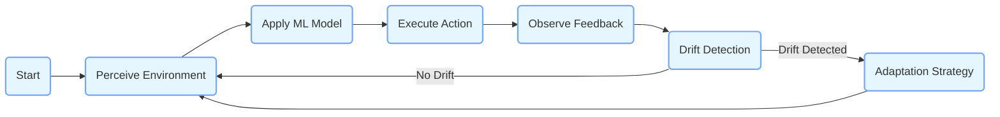

# AI Agent的概念漂移检测与适应

> 关键词：AI Agent、概念漂移、检测算法、适应策略、机器学习

> 摘要：本文围绕AI Agent的概念漂移检测与适应展开深入探讨。首先介绍了概念漂移在AI Agent应用场景中的背景和重要性，阐述了相关核心概念及其联系。接着详细讲解了核心检测算法的原理，并给出Python代码示例。同时，介绍了相关数学模型和公式，通过具体例子进行说明。在项目实战部分，提供了开发环境搭建、源代码实现及解读。还探讨了概念漂移检测与适应在实际中的应用场景，推荐了学习资源、开发工具框架以及相关论文著作。最后对未来发展趋势与挑战进行总结，并在附录中解答常见问题，提供扩展阅读和参考资料，旨在为研究和应用AI Agent的概念漂移检测与适应提供全面的技术指导。

## 1. 背景介绍 
### 1.1 目的和范围
在当今的人工智能领域，AI Agent被广泛应用于各种复杂的动态环境中，如自动驾驶、金融风险评估、智能医疗诊断等。然而，这些环境中的数据分布往往会随时间发生变化，这种变化被称为概念漂移。概念漂移可能导致AI Agent的性能下降，甚至失效。因此，对概念漂移进行准确的检测和有效的适应是确保AI Agent在动态环境中稳定、高效运行的关键。

本文的范围涵盖了AI Agent概念漂移的基本概念、检测方法、适应策略，以及相关的数学模型和实际应用案例。通过详细的理论讲解和代码实现，旨在为读者提供一个全面而深入的关于AI Agent概念漂移检测与适应的技术指南。

### 1.2 预期读者
本文预期读者包括但不限于人工智能领域的研究人员、机器学习工程师、数据科学家、软件开发者，以及对AI Agent和概念漂移感兴趣的技术爱好者。无论是希望深入研究概念漂移理论的学术人员，还是需要在实际项目中应用概念漂移检测与适应技术的工程人员，都能从本文中获得有价值的信息。

### 1.3 文档结构概述
本文将按照以下结构进行组织：
1. **背景介绍**：阐述概念漂移在AI Agent中的重要性、预期读者和文档结构。
2. **核心概念与联系**：介绍AI Agent、概念漂移等核心概念及其相互关系，并通过示意图和流程图进行直观展示。
3. **核心算法原理 & 具体操作步骤**：详细讲解概念漂移检测的核心算法原理，并给出Python代码实现。
4. **数学模型和公式 & 详细讲解 & 举例说明**：介绍相关数学模型和公式，通过具体例子进行解释。
5. **项目实战：代码实际案例和详细解释说明**：提供开发环境搭建步骤，展示源代码实现并进行详细解读。
6. **实际应用场景**：探讨概念漂移检测与适应在不同领域的实际应用。
7. **工具和资源推荐**：推荐学习资源、开发工具框架和相关论文著作。
8. **总结：未来发展趋势与挑战**：总结概念漂移检测与适应的未来发展趋势和面临的挑战。
9. **附录：常见问题与解答**：解答读者可能遇到的常见问题。
10. **扩展阅读 & 参考资料**：提供相关的扩展阅读材料和参考资料。

### 1.4 术语表
#### 1.4.1 核心术语定义
- **AI Agent（人工智能智能体）**：能够感知环境、做出决策并执行动作的智能实体，它可以通过学习和适应来实现特定的目标。
- **概念漂移（Concept Drift）**：指数据的统计特性随时间发生变化，导致数据分布的改变，这种变化可能会影响机器学习模型的性能。
- **检测算法（Detection Algorithm）**：用于识别数据中是否存在概念漂移的算法。
- **适应策略（Adaptation Strategy）**：当检测到概念漂移后，用于调整AI Agent或机器学习模型以适应新数据分布的策略。

#### 1.4.2 相关概念解释
- **数据分布（Data Distribution）**：描述数据在各个特征维度上的取值概率和频率的统计特性。概念漂移通常表现为数据分布的变化。
- **静态模型（Static Model）**：在训练完成后，模型参数固定不变，不随时间和数据变化而调整的机器学习模型。静态模型在存在概念漂移的环境中容易出现性能下降。
- **动态模型（Dynamic Model）**：能够根据新的数据不断调整模型参数，以适应数据分布变化的机器学习模型。

#### 1.4.3 缩略词列表
- **ML（Machine Learning）**：机器学习
- **ADWIN（Adaptive Windowing）**：自适应窗口算法
- **KDE（Kernel Density Estimation）**：核密度估计

## 2. 核心概念与联系 

### 核心概念原理
#### AI Agent
AI Agent是人工智能系统中的核心组件，它可以看作是一个具有感知、决策和行动能力的智能实体。AI Agent通过传感器感知环境信息，然后根据这些信息做出决策，并通过执行器执行相应的动作。在机器学习的背景下，AI Agent通常使用机器学习模型来进行决策，这些模型通过对历史数据的学习来预测环境状态和最佳行动。

#### 概念漂移
概念漂移是指数据的统计特性随时间发生变化的现象。在实际应用中，这种变化可能是由于多种因素引起的，如环境变化、用户行为改变、系统故障等。概念漂移会导致数据分布的改变，从而使基于历史数据训练的机器学习模型在新数据上的性能下降。

#### 检测与适应的关系
概念漂移的检测是适应的前提。只有准确地检测到概念漂移的发生，才能及时采取相应的适应策略。适应策略的目的是使AI Agent能够在概念漂移发生后，快速调整自身的模型或行为，以适应新的数据分布，从而保持良好的性能。

### 架构的文本示意图
```plaintext
+-------------------+
|      AI Agent     |
|                   |
|  +-------------+  |
|  |  ML Model   |  |
|  +-------------+  |
|                   |
|  +-------------+  |
|  | Drift Detector|  |
|  +-------------+  |
|                   |
|  +-------------+  |
|  | Adaptation  |  |
|  | Strategy    |  |
|  +-------------+  |
+-------------------+
|                   |
|     Environment   |
|                   |
+-------------------+
```
这个示意图展示了AI Agent的基本架构，包括机器学习模型、概念漂移检测器和适应策略模块，以及与环境的交互关系。AI Agent通过感知环境信息，使用机器学习模型进行决策，同时概念漂移检测器监测数据是否发生漂移，当检测到漂移时，适应策略模块会调整模型以适应新的环境。

### Mermaid流程图

这个流程图展示了AI Agent的工作流程。首先，AI Agent感知环境信息，然后应用机器学习模型进行决策并执行动作。接着，观察执行动作后的反馈信息，进行概念漂移检测。如果没有检测到漂移，则继续感知环境；如果检测到漂移，则执行适应策略，然后再回到感知环境的步骤。

## 3. 核心算法原理 & 具体操作步骤 

### 核心算法原理 - ADWIN算法
ADWIN（Adaptive Windowing）算法是一种常用的概念漂移检测算法，其核心思想是通过维护一个自适应的滑动窗口，来监测数据分布的变化。该算法基于统计学原理，通过比较窗口内不同子窗口的数据分布，判断是否存在概念漂移。

具体来说，ADWIN算法会不断地向窗口中添加新的数据，同时根据数据的统计特性动态地调整窗口的大小。当窗口内的数据分布发生显著变化时，算法会检测到概念漂移，并采取相应的措施，如缩小窗口或重新训练模型。

### Python源代码实现
```python
import numpy as np

class ADWIN:
    def __init__(self, delta=0.002):
        self.delta = delta
        self.window = []
        self.width = 0
        self.sum = 0

    def add_element(self, value):
        self.window.append(value)
        self.width += 1
        self.sum += value
        self._compress_window()
        self._detect_drift()

    def _compress_window(self):
        while self._is_compressible():
            k = self._find_split_point()
            if k is not None:
                self._split_window(k)

    def _is_compressible(self):
        return self.width > 1

    def _find_split_point(self):
        n = self.width
        for k in range(1, n):
            sum1 = sum(self.window[:k])
            sum2 = self.sum - sum1
            n1 = k
            n2 = n - k
            mean1 = sum1 / n1
            mean2 = sum2 / n2
            d = np.abs(mean1 - mean2)
            m = 1 / (1 / n1 + 1 / n2)
            epsilon = np.sqrt(1 / (2 * m) * np.log(2 / self.delta))
            if d > epsilon:
                return k
        return None

    def _split_window(self, k):
        self.window = self.window[k:]
        self.width = len(self.window)
        self.sum = sum(self.window)

    def _detect_drift(self):
        k = self._find_split_point()
        if k is not None:
            print("Concept drift detected!")
            # Here you can add adaptation strategies
```

### 具体操作步骤
1. **初始化ADWIN对象**：设置参数 `delta`，该参数控制算法的灵敏度。
2. **添加数据元素**：通过 `add_element` 方法向ADWIN窗口中添加新的数据元素。
3. **数据处理**：每次添加数据后，算法会自动进行窗口压缩和概念漂移检测。
4. **漂移检测**：如果检测到概念漂移，会输出相应的提示信息，此时可以在 `_detect_drift` 方法中添加适应策略。

## 4. 数学模型和公式 & 详细讲解 & 举例说明 

### 数学模型和公式
#### 均值差异
ADWIN算法主要基于均值差异来检测概念漂移。设窗口内有 $n$ 个数据点，将窗口划分为两个子窗口，前 $k$ 个数据点组成子窗口1，后 $n - k$ 个数据点组成子窗口2。子窗口1的均值 $\bar{x}_1$ 和子窗口2的均值 $\bar{x}_2$ 分别为：
$$
\bar{x}_1 = \frac{1}{k} \sum_{i = 1}^{k} x_i
$$
$$
\bar{x}_2 = \frac{1}{n - k} \sum_{i = k + 1}^{n} x_i
$$
两个子窗口的均值差异为：
$$
d = |\bar{x}_1 - \bar{x}_2|
$$

#### 阈值计算
为了判断均值差异是否显著，ADWIN算法使用了一个阈值 $\epsilon$，其计算公式为：
$$
\epsilon = \sqrt{\frac{1}{2m} \ln \frac{2}{\delta}}
$$
其中，$m = \frac{1}{\frac{1}{k} + \frac{1}{n - k}}$，$\delta$ 是算法的灵敏度参数。

#### 漂移判断
如果 $d > \epsilon$，则认为数据分布发生了显著变化，即检测到概念漂移。

### 详细讲解
ADWIN算法的核心思想是通过不断地比较窗口内不同子窗口的均值差异，并与阈值进行比较，来判断数据分布是否发生变化。当均值差异超过阈值时，说明数据分布发生了显著变化，可能存在概念漂移。

算法通过维护一个自适应的窗口，动态地调整窗口的大小，以适应数据分布的变化。在窗口压缩过程中，算法会不断地尝试找到一个合适的分割点，将窗口划分为两个子窗口，使得两个子窗口的均值差异最大。如果找到这样的分割点，并且均值差异超过阈值，则认为检测到概念漂移。

### 举例说明
假设我们有一个数据流 `[1, 2, 3, 4, 5, 10, 11, 12, 13, 14]`，使用ADWIN算法进行概念漂移检测，设置 $\delta = 0.002$。

1. 初始时，窗口为空。
2. 依次添加数据点，当添加到 `5` 时，窗口内的数据为 `[1, 2, 3, 4, 5]`，此时计算不同子窗口的均值差异，均未超过阈值，未检测到漂移。
3. 当添加到 `10` 时，窗口内的数据为 `[1, 2, 3, 4, 5, 10]`，计算子窗口 `[1, 2, 3, 4, 5]` 和 `[10]` 的均值差异，发现超过了阈值，检测到概念漂移。

以下是使用上述Python代码进行模拟的示例：
```python
adwin = ADWIN(delta=0.002)
data_stream = [1, 2, 3, 4, 5, 10, 11, 12, 13, 14]
for data in data_stream:
    adwin.add_element(data)
```

## 5. 项目实战：代码实际案例和详细解释说明 

### 5.1  开发环境搭建
#### 安装Python
首先，确保你已经安装了Python 3.x版本。你可以从Python官方网站（https://www.python.org/downloads/） 下载并安装适合你操作系统的Python版本。

#### 安装必要的库
本项目主要使用Python的内置库，无需额外安装其他库。但如果你需要进行数据可视化或其他扩展功能，可以安装 `numpy`、`matplotlib` 等库。使用以下命令进行安装：
```sh
pip install numpy matplotlib
```

### 5.2  源代码详细实现和代码解读
#### 完整代码
```python
import numpy as np
import matplotlib.pyplot as plt

class ADWIN:
    def __init__(self, delta=0.002):
        self.delta = delta
        self.window = []
        self.width = 0
        self.sum = 0
        self.drift_points = []

    def add_element(self, value):
        self.window.append(value)
        self.width += 1
        self.sum += value
        self._compress_window()
        self._detect_drift()

    def _compress_window(self):
        while self._is_compressible():
            k = self._find_split_point()
            if k is not None:
                self._split_window(k)

    def _is_compressible(self):
        return self.width > 1

    def _find_split_point(self):
        n = self.width
        for k in range(1, n):
            sum1 = sum(self.window[:k])
            sum2 = self.sum - sum1
            n1 = k
            n2 = n - k
            mean1 = sum1 / n1
            mean2 = sum2 / n2
            d = np.abs(mean1 - mean2)
            m = 1 / (1 / n1 + 1 / n2)
            epsilon = np.sqrt(1 / (2 * m) * np.log(2 / self.delta))
            if d > epsilon:
                return k
        return None

    def _split_window(self, k):
        self.window = self.window[k:]
        self.width = len(self.window)
        self.sum = sum(self.window)

    def _detect_drift(self):
        k = self._find_split_point()
        if k is not None:
            print(f"Concept drift detected at index {len(self.window) - self.width + k}!")
            self.drift_points.append(len(self.window) - self.width + k)

# 生成模拟数据
np.random.seed(0)
data_stream1 = np.random.normal(loc=0, scale=1, size=100)
data_stream2 = np.random.normal(loc=5, scale=1, size=100)
data_stream = np.concatenate([data_stream1, data_stream2])

# 使用ADWIN算法进行概念漂移检测
adwin = ADWIN(delta=0.002)
for i, data in enumerate(data_stream):
    adwin.add_element(data)

# 可视化结果
plt.plot(data_stream)
for point in adwin.drift_points:
    plt.axvline(x=point, color='r', linestyle='--')
plt.xlabel('Time Step')
plt.ylabel('Data Value')
plt.title('Concept Drift Detection with ADWIN')
plt.show()
```

#### 代码解读
1. **ADWIN类**：实现了ADWIN算法的核心逻辑，包括窗口管理、漂移检测等功能。
    - `__init__` 方法：初始化ADWIN对象，设置灵敏度参数 `delta`，并初始化窗口、窗口宽度、数据总和和漂移点列表。
    - `add_element` 方法：向窗口中添加新的数据元素，并进行窗口压缩和漂移检测。
    - `_compress_window` 方法：压缩窗口，尝试找到合适的分割点。
    - `_is_compressible` 方法：判断窗口是否可压缩。
    - `_find_split_point` 方法：找到合适的分割点，计算均值差异和阈值，并判断是否超过阈值。
    - `_split_window` 方法：根据分割点分割窗口。
    - `_detect_drift` 方法：检测概念漂移，如果检测到漂移，记录漂移点并输出提示信息。
2. **数据生成**：使用 `numpy` 生成模拟数据，包括两个不同均值的正态分布数据，模拟概念漂移的情况。
3. **漂移检测**：遍历数据流，依次将数据添加到ADWIN对象中，进行漂移检测。
4. **可视化**：使用 `matplotlib` 绘制数据曲线，并在漂移点处绘制垂直的红色虚线，直观展示概念漂移的位置。

### 5.3  代码解读与分析
#### 复杂度分析
- **时间复杂度**：ADWIN算法的时间复杂度主要取决于窗口的大小和数据的处理量。在最坏情况下，时间复杂度为 $O(n^2)$，其中 $n$ 是窗口的大小。但在实际应用中，由于窗口的自适应调整，平均时间复杂度会接近 $O(n)$。
- **空间复杂度**：ADWIN算法的空间复杂度主要取决于窗口的大小，为 $O(n)$。

#### 优缺点分析
- **优点**：
    - 自适应窗口：能够根据数据分布的变化动态调整窗口大小，适应不同的概念漂移情况。
    - 简单有效：基于统计学原理，实现简单，且在许多实际应用中表现良好。
- **缺点**：
    - 灵敏度参数依赖：算法的性能对灵敏度参数 `delta` 比较敏感，需要根据具体应用场景进行调整。
    - 局部检测：主要关注窗口内的数据分布变化，可能会忽略一些全局的概念漂移。

## 6. 实际应用场景 
### 金融领域
在金融风险评估中，市场环境和客户行为会随时间发生变化，导致风险因素的分布也会发生改变。例如，经济危机、政策调整等事件可能会导致金融市场的波动性增加，客户的信用风险也会相应变化。通过使用概念漂移检测与适应技术，可以及时发现这些变化，调整风险评估模型，提高风险预测的准确性，从而有效防范金融风险。

### 医疗领域
在医疗诊断中，疾病的症状、发病率和治疗效果可能会随时间和地域的变化而改变。例如，新的病毒变种可能会导致疾病的症状和传播方式发生变化，传统的诊断模型可能不再适用。通过概念漂移检测与适应技术，可以实时监测数据的变化，及时更新诊断模型，提高诊断的准确性和效率，为患者提供更好的医疗服务。

### 工业领域
在工业生产过程中，设备的性能、原材料的质量和生产环境等因素可能会随时间发生变化，导致产品质量和生产效率的波动。例如，设备的老化、原材料的供应变化等可能会影响产品的质量。通过概念漂移检测与适应技术，可以及时发现这些变化，调整生产参数和质量控制模型，提高产品质量和生产效率，降低生产成本。

### 智能交通领域
在智能交通系统中，交通流量、道路状况和驾驶员行为等因素会随时间和天气等条件的变化而改变。例如，高峰时段和低谷时段的交通流量差异很大，恶劣天气可能会导致道路状况变差。通过概念漂移检测与适应技术，可以实时监测交通数据的变化，调整交通信号控制策略和路径规划算法，提高交通效率，减少拥堵和事故的发生。

## 7. 工具和资源推荐
### 7.1 学习资源推荐
#### 7.1.1 书籍推荐
- 《机器学习》（周志华）：全面介绍了机器学习的基本概念、算法和应用，对理解概念漂移和相关技术有很大帮助。
- 《Python机器学习实战》（Sebastian Raschka）：通过实际案例详细介绍了Python在机器学习中的应用，包括数据处理、模型训练和评估等内容。
- 《概念漂移自适应》（João Gama等）：专门介绍了概念漂移的理论、算法和应用，是研究概念漂移的重要参考书籍。

#### 7.1.2 在线课程
- Coursera上的“机器学习”课程（Andrew Ng）：经典的机器学习入门课程，涵盖了机器学习的基本概念和算法。
- edX上的“数据科学与机器学习微硕士学位课程”：提供了系统的数据科学和机器学习知识，包括概念漂移等高级主题。
- 哔哩哔哩上的“机器学习白板推导系列”：通过生动的讲解和推导，帮助学习者深入理解机器学习的原理和算法。

#### 7.1.3 技术博客和网站
- Medium：有许多机器学习和人工智能领域的优秀博客文章，包括概念漂移的最新研究和应用案例。
- arXiv：提供了大量的学术论文，包括概念漂移的最新研究成果。
- Kaggle：是一个数据科学和机器学习的竞赛平台，上面有许多关于概念漂移的讨论和实践项目。

### 7.2 开发工具框架推荐
#### 7.2.1 IDE和编辑器
- PyCharm：功能强大的Python集成开发环境，提供了代码编辑、调试、版本控制等功能，适合开发机器学习项目。
- Jupyter Notebook：交互式的开发环境，方便进行数据探索、模型训练和结果可视化，是数据科学和机器学习领域常用的工具。
- Visual Studio Code：轻量级的代码编辑器，支持多种编程语言和插件，可通过安装相关插件来支持机器学习开发。

#### 7.2.2 调试和性能分析工具
- PDB：Python的内置调试器，可用于调试Python代码，帮助定位和解决问题。
- cProfile：Python的性能分析工具，可用于分析代码的执行时间和资源消耗，帮助优化代码性能。
- TensorBoard：TensorFlow的可视化工具，可用于可视化模型训练过程、评估指标和数据分布等信息。

#### 7.2.3 相关框架和库
- Scikit-learn：Python的机器学习库，提供了丰富的机器学习算法和工具，包括分类、回归、聚类等算法，可用于实现概念漂移检测和适应的相关模型。
- River：专注于流式数据处理和在线学习的Python库，提供了多种概念漂移检测和适应算法，方便在实际项目中应用。
- PyOD：Python的异常检测库，可用于检测数据中的异常点，在概念漂移检测中也有一定的应用。

### 7.3 相关论文著作推荐
#### 7.3.1 经典论文
- “Learning from Time-Changing Data with Adaptive Windowing”（Albert Bifet等）：介绍了ADWIN算法的原理和实现，是概念漂移检测领域的经典论文。
- “A Survey on Concept Drift Adaptation”（João Gama等）：对概念漂移的理论、算法和应用进行了全面的综述，是研究概念漂移的重要参考论文。

#### 7.3.2 最新研究成果
- 在arXiv和各大机器学习学术会议（如ICML、NeurIPS等）上可以找到关于概念漂移的最新研究成果，包括新的检测算法、适应策略和应用案例。

#### 7.3.3 应用案例分析
- 在Kaggle和相关技术博客上可以找到许多关于概念漂移在实际应用中的案例分析，通过学习这些案例可以更好地理解概念漂移的应用场景和解决方法。

## 8. 总结：未来发展趋势与挑战
### 未来发展趋势
#### 多模态数据融合
随着物联网、传感器技术和多媒体技术的发展，数据的来源越来越多样化，包括图像、语音、文本等多模态数据。未来的概念漂移检测与适应技术需要能够处理多模态数据，综合考虑不同模态数据的变化，提高检测和适应的准确性。

#### 深度学习与概念漂移的结合
深度学习在许多领域取得了巨大的成功，但在处理概念漂移问题上还面临一些挑战。未来的研究将探索如何将深度学习模型与概念漂移检测和适应技术相结合，利用深度学习的强大特征提取能力，提高模型对概念漂移的感知和适应能力。

#### 强化学习中的概念漂移处理
强化学习在机器人控制、自动驾驶等领域有广泛的应用，但在动态环境中，环境的变化可能导致概念漂移，影响强化学习智能体的性能。未来的研究将关注如何在强化学习中有效地处理概念漂移，提高智能体的适应性和鲁棒性。

### 挑战
#### 复杂环境下的漂移检测
在实际应用中，环境往往非常复杂，存在多种因素的干扰和变化，这使得概念漂移的检测变得更加困难。如何在复杂环境下准确地检测到概念漂移，是未来需要解决的一个重要问题。

#### 实时性要求
在一些实时性要求较高的应用场景中，如自动驾驶、金融交易等，需要在短时间内完成概念漂移的检测和适应，以确保系统的稳定性和安全性。如何提高概念漂移检测和适应的实时性，是未来面临的一个挑战。

#### 适应策略的优化
目前的适应策略大多基于经验和启发式方法，缺乏理论上的最优性保证。未来的研究需要探索更加有效的适应策略，以提高模型在概念漂移情况下的性能。

## 9. 附录：常见问题与解答
### 问题1：如何选择合适的灵敏度参数 `delta`？
答：灵敏度参数 `delta` 控制着ADWIN算法的灵敏度，`delta` 值越小，算法越敏感，更容易检测到概念漂移，但也可能会产生更多的误报；`delta` 值越大，算法越不敏感，可能会漏检一些概念漂移。选择合适的 `delta` 值需要根据具体的应用场景和数据特点进行调整。可以通过实验的方法，在不同的 `delta` 值下进行测试，选择性能最优的 `delta` 值。

### 问题2：ADWIN算法是否适用于所有类型的概念漂移？
答：ADWIN算法主要基于均值差异来检测概念漂移，对于数据分布的均值发生变化的概念漂移有较好的检测效果。但对于其他类型的概念漂移，如数据分布的方差发生变化、数据的类别分布发生变化等，ADWIN算法可能效果不佳。在实际应用中，需要根据具体的概念漂移类型选择合适的检测算法。

### 问题3：如何在检测到概念漂移后进行有效的适应？
答：在检测到概念漂移后，可以采取多种适应策略，如重新训练模型、调整模型参数、更新数据分布等。具体的适应策略需要根据应用场景和数据特点进行选择。例如，在一些实时性要求较高的场景中，可以采用增量学习的方法，在新数据到来时逐步更新模型参数；在一些数据量较大的场景中，可以采用批量学习的方法，定期重新训练模型。

## 10. 扩展阅读 & 参考资料
### 扩展阅读
- 《机器学习中的不确定性》：介绍了机器学习中不确定性的来源和处理方法，对于理解概念漂移的本质和影响有一定的帮助。
- 《大数据处理与分析》：涵盖了大数据的存储、处理和分析技术，在处理大规模数据流时，这些技术对于概念漂移检测和适应非常重要。

### 参考资料
- 周志华. 机器学习[M]. 清华大学出版社, 2016.
- Sebastian Raschka. Python机器学习实战[M]. 机械工业出版社, 2018.
- João Gama, et al. A Survey on Concept Drift Adaptation[J]. ACM Computing Surveys, 2014.
- Albert Bifet, et al. Learning from Time-Changing Data with Adaptive Windowing[J]. Journal of Machine Learning Research, 2010.