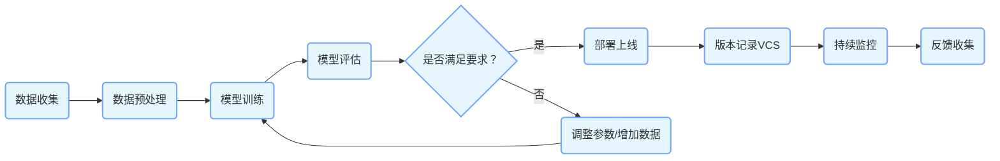

# AI Agent的版本控制与迭代优化流程

> 关键词：AI Agent、版本控制、迭代优化、流程管理、人工智能、模型更新、性能提升

> 摘要：本文围绕AI Agent的版本控制与迭代优化流程展开深入探讨。在人工智能快速发展的当下，AI Agent的应用愈发广泛，对其进行有效的版本控制和持续的迭代优化至关重要。文章首先介绍相关背景，包括目的范围、预期读者等内容。接着阐述AI Agent的核心概念与联系，通过文本示意图和Mermaid流程图进行清晰展示。详细讲解核心算法原理及具体操作步骤，结合Python源代码进行说明。同时给出数学模型和公式，并举例分析。通过项目实战展示代码实际案例及详细解释。探讨AI Agent在不同场景下的实际应用，推荐相关的学习资源、开发工具框架和论文著作。最后总结未来发展趋势与挑战，解答常见问题并提供扩展阅读与参考资料，旨在为相关领域的研究和实践提供全面且深入的指导。

## 1. 背景介绍 
### 1.1 目的和范围
在人工智能技术飞速发展的今天，AI Agent作为能够自主感知环境、做出决策并执行行动的智能实体，在诸多领域如智能客服、自动驾驶、游戏AI等得到了广泛应用。AI Agent的版本控制与迭代优化流程的研究目的在于确保AI Agent在整个生命周期内能够不断适应新的需求、提升性能、修复漏洞，并且保证不同版本之间的可追溯性和可管理性。

本文章的范围涵盖了AI Agent版本控制与迭代优化的各个方面，包括核心概念的阐述、算法原理的讲解、实际项目的应用案例分析，以及相关工具和资源的推荐等，旨在为读者提供一个全面且深入的技术指南。

### 1.2 预期读者
本文预期读者包括人工智能领域的研究人员、开发人员、软件架构师、CTO等技术专业人士，以及对AI Agent技术感兴趣的学生和爱好者。对于从事AI Agent开发和管理的专业人员，本文可以作为实践指导和技术参考；对于初学者和爱好者，本文可以帮助他们系统地了解AI Agent版本控制与迭代优化的相关知识和流程。

### 1.3 文档结构概述
本文按照以下结构进行组织：首先介绍背景信息，包括目的范围、预期读者等；接着阐述AI Agent的核心概念与联系，通过文本示意图和Mermaid流程图进行展示；详细讲解核心算法原理及具体操作步骤，结合Python源代码进行说明；给出数学模型和公式，并举例分析；通过项目实战展示代码实际案例及详细解释；探讨AI Agent在不同场景下的实际应用；推荐相关的学习资源、开发工具框架和论文著作；最后总结未来发展趋势与挑战，解答常见问题并提供扩展阅读与参考资料。

### 1.4 术语表
#### 1.4.1 核心术语定义
- **AI Agent（人工智能智能体）**：是一种能够感知环境、根据感知信息做出决策并执行相应行动的智能实体，它可以是软件程序、机器人等不同形式。
- **版本控制**：是一种管理和记录软件系统中不同版本变更的方法和技术，通过版本控制系统可以对软件的源代码、配置文件等进行管理，方便团队协作开发和追溯历史版本。
- **迭代优化**：指的是对AI Agent进行不断的改进和优化，通过多次迭代的方式逐步提升其性能、适应性和准确性等指标。

#### 1.4.2 相关概念解释
- **模型训练**：是指使用大量的数据对AI Agent的模型进行训练，使其能够学习到数据中的模式和规律，从而提高其预测和决策的能力。
- **模型评估**：是对训练好的模型进行评估，通过使用测试数据来评估模型的性能指标，如准确率、召回率、F1值等，以判断模型的优劣。
- **部署**：将训练好的AI Agent模型部署到实际的生产环境中，使其能够为用户提供服务。

#### 1.4.3 缩略词列表
- **ML（Machine Learning，机器学习）**：是一门多领域交叉学科，涉及概率论、统计学、逼近论、凸分析、算法复杂度理论等多门学科。它专门研究计算机怎样模拟或实现人类的学习行为，以获取新的知识或技能，重新组织已有的知识结构使之不断改善自身的性能。
- **DL（Deep Learning，深度学习）**：是机器学习的一个分支领域，它是一种基于对数据进行表征学习的方法。深度学习通过构建具有很多层的神经网络模型，自动从数据中学习到复杂的特征和模式。
- **VCS（Version Control System，版本控制系统）**：是一种用于管理和记录软件系统中不同版本变更的工具和技术。

## 2. 核心概念与联系 

### 核心概念原理
AI Agent的版本控制与迭代优化是一个复杂的过程，涉及到多个核心概念。AI Agent本身是基于一定的模型和算法实现的，其性能取决于模型的训练和优化。版本控制是为了管理AI Agent在不同阶段的状态和变更，确保每个版本的可追溯性和可复现性。迭代优化则是通过不断地调整模型参数、优化算法、增加训练数据等方式，逐步提升AI Agent的性能。

在版本控制方面，通常使用版本控制系统（VCS）来管理AI Agent的源代码、配置文件、模型文件等。常见的VCS有Git、SVN等。通过VCS，可以记录每次的代码变更、模型更新等信息，方便团队成员之间的协作和沟通。

在迭代优化方面，一般采用机器学习和深度学习的方法。首先收集大量的数据，对数据进行预处理和标注，然后使用这些数据对AI Agent的模型进行训练。训练过程中，通过不断调整模型的参数，使得模型的损失函数最小化，从而提高模型的性能。训练完成后，使用测试数据对模型进行评估，如果评估结果不满足要求，则需要进一步调整模型参数或增加训练数据，进行下一轮的迭代优化。

### 文本示意图
```plaintext
AI Agent版本控制与迭代优化流程

数据收集
|
V
数据预处理
|
V
模型训练
|
V
模型评估
|
V
是否满足要求？
|------ 是 ------|
|                V
|            部署上线
|                |
|                V
|            版本记录（VCS）
|                |
|                V
|            持续监控
|                |
|                V
|            反馈收集
|                |
|------ 否 ------|
|                V
|            调整参数/增加数据
|                |
|                V
|            下一轮迭代优化
```

### Mermaid流程图


## 3. 核心算法原理 & 具体操作步骤 

### 核心算法原理
在AI Agent的迭代优化过程中，常用的算法包括梯度下降算法、随机梯度下降算法、Adam优化算法等。这些算法的核心思想是通过不断调整模型的参数，使得模型的损失函数最小化。

以梯度下降算法为例，假设我们有一个损失函数 $L(\theta)$，其中 $\theta$ 是模型的参数。梯度下降算法的目标是找到一组参数 $\theta$，使得 $L(\theta)$ 最小。梯度下降算法的更新公式为：

$\theta_{t+1} = \theta_{t} - \alpha \nabla L(\theta_{t})$

其中，$\theta_{t}$ 是第 $t$ 次迭代时的参数，$\alpha$ 是学习率，$\nabla L(\theta_{t})$ 是损失函数 $L(\theta)$ 在 $\theta_{t}$ 处的梯度。

### 具体操作步骤
1. **数据收集**：收集与AI Agent任务相关的大量数据，包括输入数据和对应的标签数据。
2. **数据预处理**：对收集到的数据进行清洗、归一化、划分训练集和测试集等预处理操作。
3. **模型定义**：选择合适的模型结构，如神经网络、决策树等，并定义模型的参数。
4. **损失函数定义**：选择合适的损失函数，如均方误差损失函数、交叉熵损失函数等。
5. **优化器选择**：选择合适的优化器，如梯度下降优化器、Adam优化器等。
6. **模型训练**：使用训练数据对模型进行训练，不断调整模型的参数，使得损失函数最小化。
7. **模型评估**：使用测试数据对训练好的模型进行评估，计算模型的性能指标。
8. **迭代优化**：如果模型的性能指标不满足要求，则调整模型的参数或增加训练数据，进行下一轮的迭代优化。

### Python源代码实现
```python
import numpy as np

# 定义数据集
X = np.array([[1], [2], [3], [4], [5]])
y = np.array([2, 4, 6, 8, 10])

# 定义模型参数
theta = np.random.randn(1)

# 定义学习率
alpha = 0.01

# 定义迭代次数
num_iterations = 1000

# 定义损失函数（均方误差损失函数）
def loss_function(X, y, theta):
    m = len(y)
    predictions = X.dot(theta)
    loss = (1/(2*m)) * np.sum((predictions - y)**2)
    return loss

# 定义梯度下降算法
def gradient_descent(X, y, theta, alpha, num_iterations):
    m = len(y)
    for iteration in range(num_iterations):
        predictions = X.dot(theta)
        error = predictions - y
        gradient = (1/m) * X.T.dot(error)
        theta = theta - alpha * gradient
        if iteration % 100 == 0:
            loss = loss_function(X, y, theta)
            print(f'Iteration {iteration}: Loss = {loss}')
    return theta

# 训练模型
theta = gradient_descent(X, y, theta, alpha, num_iterations)

# 输出最终参数
print(f'Final theta: {theta}')
```

### 代码解释
1. **数据集定义**：定义了一个简单的数据集 $X$ 和对应的标签 $y$。
2. **模型参数初始化**：随机初始化模型的参数 $\theta$。
3. **学习率和迭代次数定义**：定义了学习率 $\alpha$ 和迭代次数 `num_iterations`。
4. **损失函数定义**：定义了均方误差损失函数 `loss_function`。
5. **梯度下降算法实现**：实现了梯度下降算法 `gradient_descent`，在每次迭代中计算梯度并更新模型参数。
6. **模型训练**：调用 `gradient_descent` 函数对模型进行训练。
7. **输出最终参数**：输出训练后的模型参数 $\theta$。

## 4. 数学模型和公式 & 详细讲解 & 举例说明 

### 数学模型
在AI Agent的迭代优化过程中，常用的数学模型包括线性回归模型、逻辑回归模型、神经网络模型等。以线性回归模型为例，其数学模型可以表示为：

$y = \theta_{0} + \theta_{1}x_{1} + \theta_{2}x_{2} + \cdots + \theta_{n}x_{n} + \epsilon$

其中，$y$ 是输出变量，$x_{1}, x_{2}, \cdots, x_{n}$ 是输入变量，$\theta_{0}, \theta_{1}, \cdots, \theta_{n}$ 是模型的参数，$\epsilon$ 是误差项。

### 损失函数
为了评估模型的性能，需要定义一个损失函数。在线性回归模型中，常用的损失函数是均方误差损失函数（Mean Squared Error，MSE），其公式为：

$L(\theta) = \frac{1}{2m} \sum_{i=1}^{m} (y^{(i)} - \hat{y}^{(i)})^{2}$

其中，$m$ 是样本数量，$y^{(i)}$ 是第 $i$ 个样本的真实标签，$\hat{y}^{(i)}$ 是第 $i$ 个样本的预测值。

### 梯度计算
为了使用梯度下降算法更新模型的参数，需要计算损失函数的梯度。对于均方误差损失函数，其梯度可以表示为：

$\nabla L(\theta) = \frac{1}{m} \sum_{i=1}^{m} (\hat{y}^{(i)} - y^{(i)})x^{(i)}$

其中，$x^{(i)}$ 是第 $i$ 个样本的输入向量。

### 举例说明
假设我们有一个简单的线性回归问题，输入变量 $x$ 和输出变量 $y$ 的关系为 $y = 2x + 1$。我们收集了以下数据集：

| $x$ | $y$ |
| --- | --- |
| 1   | 3   |
| 2   | 5   |
| 3   | 7   |
| 4   | 9   |
| 5   | 11  |

我们的目标是通过梯度下降算法找到模型的参数 $\theta_{0}$ 和 $\theta_{1}$，使得损失函数最小化。

首先，我们将数据集表示为矩阵形式：

$X = \begin{bmatrix} 1 & 1 \\ 1 & 2 \\ 1 & 3 \\ 1 & 4 \\ 1 & 5 \end{bmatrix}$

$y = \begin{bmatrix} 3 \\ 5 \\ 7 \\ 9 \\ 11 \end{bmatrix}$

然后，我们随机初始化模型的参数 $\theta = \begin{bmatrix} \theta_{0} \\ \theta_{1} \end{bmatrix} = \begin{bmatrix} 0 \\ 0 \end{bmatrix}$。

接下来，我们使用梯度下降算法更新模型的参数。在每次迭代中，计算损失函数的梯度，并更新参数：

$\theta_{t+1} = \theta_{t} - \alpha \nabla L(\theta_{t})$

经过多次迭代后，模型的参数会逐渐收敛到最优值。最终，我们可以得到模型的参数 $\theta_{0} = 1$ 和 $\theta_{1} = 2$，与真实的关系 $y = 2x + 1$ 一致。

## 5. 项目实战：代码实际案例和详细解释说明 

### 5.1  开发环境搭建
1. **安装Python**：确保你已经安装了Python 3.x版本。可以从Python官方网站（https://www.python.org/downloads/） 下载并安装。
2. **安装依赖库**：使用以下命令安装所需的依赖库：
```sh
pip install numpy pandas scikit-learn tensorflow
```
3. **选择开发工具**：可以选择使用PyCharm、Jupyter Notebook等开发工具进行代码开发。

### 5.2  源代码详细实现和代码解读
下面我们以一个简单的手写数字识别任务为例，展示AI Agent的版本控制与迭代优化流程。

```python
import numpy as np
import tensorflow as tf
from tensorflow.keras.datasets import mnist
from tensorflow.keras.models import Sequential
from tensorflow.keras.layers import Dense, Flatten
from tensorflow.keras.utils import to_categorical

# 数据加载
(train_images, train_labels), (test_images, test_labels) = mnist.load_data()

# 数据预处理
train_images = train_images / 255.0
test_images = test_images / 255.0

train_labels = to_categorical(train_labels)
test_labels = to_categorical(test_labels)

# 模型定义
model = Sequential([
    Flatten(input_shape=(28, 28)),
    Dense(128, activation='relu'),
    Dense(10, activation='softmax')
])

# 模型编译
model.compile(optimizer='adam',
              loss='categorical_crossentropy',
              metrics=['accuracy'])

# 模型训练
model.fit(train_images, train_labels, epochs=5, batch_size=32)

# 模型评估
test_loss, test_acc = model.evaluate(test_images, test_labels)
print(f'Test accuracy: {test_acc}')

# 模型保存
model.save('mnist_model.h5')
```

### 代码解读与分析
1. **数据加载**：使用 `mnist.load_data()` 函数加载手写数字识别数据集。
2. **数据预处理**：将图像数据归一化到0-1之间，并将标签数据进行one-hot编码。
3. **模型定义**：使用 `Sequential` 模型定义一个简单的神经网络，包含一个Flatten层、一个全连接层和一个输出层。
4. **模型编译**：使用 `adam` 优化器和 `categorical_crossentropy` 损失函数编译模型。
5. **模型训练**：使用 `fit` 方法对模型进行训练，设置训练轮数和批次大小。
6. **模型评估**：使用 `evaluate` 方法对训练好的模型进行评估，计算测试集的准确率。
7. **模型保存**：使用 `save` 方法将训练好的模型保存为 `mnist_model.h5` 文件。

### 版本控制与迭代优化
在实际项目中，我们可以使用Git进行版本控制。每次对代码或模型进行修改后，使用以下命令进行版本记录：

```sh
git add .
git commit -m "Update model architecture"
git push origin master
```

如果模型的性能不满足要求，我们可以进行迭代优化。例如，增加训练轮数、调整模型结构、增加训练数据等。

```python
# 增加训练轮数
model.fit(train_images, train_labels, epochs=10, batch_size=32)

# 调整模型结构
model = Sequential([
    Flatten(input_shape=(28, 28)),
    Dense(256, activation='relu'),
    Dense(128, activation='relu'),
    Dense(10, activation='softmax')
])

model.compile(optimizer='adam',
              loss='categorical_crossentropy',
              metrics=['accuracy'])

model.fit(train_images, train_labels, epochs=5, batch_size=32)
```

通过不断地迭代优化，我们可以逐步提高模型的性能。

## 6. 实际应用场景 
### 智能客服
在智能客服场景中，AI Agent可以根据用户的问题自动给出回答。通过版本控制和迭代优化，可以不断提升AI Agent的问答准确率和用户体验。例如，随着业务的发展和用户问题的变化，需要不断更新AI Agent的知识库和模型，以提高其对新问题的处理能力。

### 自动驾驶
在自动驾驶领域，AI Agent需要实时感知环境、做出决策并控制车辆行驶。版本控制和迭代优化对于确保AI Agent的安全性和可靠性至关重要。例如，通过不断收集新的驾驶数据，对AI Agent的模型进行训练和优化，可以提高其在复杂路况下的决策能力和应对突发事件的能力。

### 游戏AI
在游戏中，AI Agent可以作为游戏角色的智能对手。通过版本控制和迭代优化，可以提升AI Agent的智能水平和游戏体验。例如，根据玩家的游戏行为和反馈，调整AI Agent的策略和行为模式，使其更加具有挑战性和趣味性。

### 金融风控
在金融领域，AI Agent可以用于风险评估和欺诈检测。版本控制和迭代优化可以帮助AI Agent更好地适应金融市场的变化和新的风险模式。例如，通过不断更新训练数据和模型，提高AI Agent对金融风险的识别能力和预警准确性。

## 7. 工具和资源推荐
### 7.1 学习资源推荐
#### 7.1.1 书籍推荐
- 《Python机器学习》：本书全面介绍了Python在机器学习领域的应用，包括各种机器学习算法的原理和实现，以及如何使用Python进行数据处理、模型训练和评估等。
- 《深度学习》：由深度学习领域的三位先驱Ian Goodfellow、Yoshua Bengio和Aaron Courville撰写，是深度学习领域的经典教材，系统地介绍了深度学习的理论和实践。
- 《人工智能：一种现代的方法》：本书是人工智能领域的经典著作，全面介绍了人工智能的各个方面，包括搜索算法、知识表示、机器学习、自然语言处理等。

#### 7.1.2 在线课程
- Coursera上的“机器学习”课程：由Andrew Ng教授授课，是机器学习领域的经典课程，适合初学者入门。
- edX上的“深度学习”课程：由知名学者和专家授课，系统地介绍了深度学习的理论和实践。
- 中国大学MOOC上的“人工智能基础”课程：由国内高校的教师授课，适合国内学生学习人工智能的基础知识。

#### 7.1.3 技术博客和网站
- Medium：是一个汇聚了众多技术专家和开发者的博客平台，上面有很多关于AI Agent、机器学习、深度学习等领域的优秀文章。
- arXiv：是一个预印本数据库，提供了大量的学术论文，涵盖了人工智能的各个领域，可以及时了解最新的研究成果。
- Towards Data Science：是一个专注于数据科学和机器学习的博客网站，上面有很多实用的技术文章和案例分析。

### 7.2 开发工具框架推荐
#### 7.2.1 IDE和编辑器
- PyCharm：是一款专门为Python开发设计的集成开发环境，提供了丰富的功能和插件，方便开发者进行代码开发、调试和管理。
- Jupyter Notebook：是一个交互式的开发环境，适合进行数据探索、模型训练和可视化等工作，支持多种编程语言。
- Visual Studio Code：是一款轻量级的代码编辑器，支持多种编程语言和插件，具有丰富的扩展功能，适合快速开发和调试。

#### 7.2.2 调试和性能分析工具
- TensorBoard：是TensorFlow提供的一个可视化工具，可以帮助开发者可视化模型的训练过程、性能指标等，方便进行调试和优化。
- PyTorch Profiler：是PyTorch提供的一个性能分析工具，可以帮助开发者分析模型的性能瓶颈，优化代码的运行效率。
- cProfile：是Python内置的一个性能分析工具，可以帮助开发者分析Python代码的运行时间和函数调用关系，找出性能瓶颈。

#### 7.2.3 相关框架和库
- TensorFlow：是一个开源的机器学习框架，由Google开发和维护，提供了丰富的工具和接口，支持深度学习、机器学习等多种算法。
- PyTorch：是一个开源的深度学习框架，由Facebook开发和维护，具有简洁易用的接口和高效的计算性能，适合进行深度学习研究和开发。
- Scikit-learn：是一个开源的机器学习库，提供了丰富的机器学习算法和工具，适合进行数据挖掘、数据分析和模型训练等工作。

### 7.3 相关论文著作推荐
#### 7.3.1 经典论文
- “ImageNet Classification with Deep Convolutional Neural Networks”：由Alex Krizhevsky等人发表，介绍了AlexNet模型，开创了深度学习在计算机视觉领域的先河。
- “Attention Is All You Need”：由Vaswani等人发表，提出了Transformer模型，在自然语言处理领域取得了巨大的成功。
- “Generative Adversarial Nets”：由Ian Goodfellow等人发表，提出了生成对抗网络（GAN）的概念，为生成式模型的发展做出了重要贡献。

#### 7.3.2 最新研究成果
- 关注顶级学术会议如NeurIPS、ICML、CVPR等的最新论文，了解AI Agent领域的最新研究动态和技术发展趋势。
- 关注知名学术期刊如Journal of Artificial Intelligence Research（JAIR）、Artificial Intelligence等的最新文章，获取高质量的研究成果。

#### 7.3.3 应用案例分析
- 参考一些实际应用案例的研究报告和论文，了解AI Agent在不同领域的应用场景、实现方法和效果评估等。例如，一些关于智能客服、自动驾驶、游戏AI等领域的应用案例分析。

## 8. 总结：未来发展趋势与挑战
### 未来发展趋势
- **多模态融合**：未来的AI Agent将融合多种模态的信息，如视觉、听觉、语言等，以实现更加智能和全面的感知和决策能力。例如，在自动驾驶中，AI Agent可以同时利用摄像头、雷达、激光雷达等多种传感器的数据，提高对环境的感知和判断能力。
- **强化学习与人类反馈结合**：强化学习将与人类反馈相结合，通过人类的指导和反馈，加速AI Agent的学习过程，提高其性能和适应性。例如，在游戏AI中，玩家可以通过反馈来指导AI Agent的学习，使其更好地适应玩家的游戏风格。
- **边缘计算与云协同**：AI Agent将在边缘设备和云端之间实现协同计算，充分利用边缘设备的实时性和云端的强大计算能力。例如，在智能物联网场景中，边缘设备可以进行实时的本地处理，而复杂的计算任务可以上传到云端进行处理。
- **可解释性和可信性增强**：随着AI Agent在各个领域的广泛应用，其可解释性和可信性将变得越来越重要。未来的研究将致力于开发更加可解释和可信的AI Agent模型，提高其决策的透明度和可靠性。

### 挑战
- **数据隐私和安全**：AI Agent的训练和运行需要大量的数据，如何保护数据的隐私和安全是一个重要的挑战。例如，在智能医疗领域，患者的医疗数据涉及到个人隐私，需要采取有效的措施来保护数据的安全。
- **模型复杂度和计算资源**：随着AI Agent模型的不断复杂，其计算资源需求也越来越大。如何在有限的计算资源下实现高效的模型训练和推理是一个亟待解决的问题。
- **伦理和法律问题**：AI Agent的应用可能会带来一些伦理和法律问题，如责任界定、算法歧视等。如何制定相应的伦理和法律准则，规范AI Agent的发展和应用是一个重要的挑战。
- **对抗攻击**：AI Agent容易受到对抗攻击的影响，攻击者可以通过输入恶意数据来干扰AI Agent的决策。如何提高AI Agent的抗攻击能力是一个重要的研究方向。

## 9. 附录：常见问题与解答
### 1. 如何选择合适的版本控制系统？
选择合适的版本控制系统需要考虑多个因素，如团队规模、项目复杂度、协作需求等。对于小型项目和个人开发者，Git是一个不错的选择，它具有分布式、轻量级、高效等优点。对于大型项目和企业级应用，SVN可能更适合，它具有集中式管理、权限控制等功能。

### 2. 如何确定迭代优化的终止条件？
迭代优化的终止条件可以根据具体的任务和需求来确定。一般来说，可以根据模型的性能指标（如准确率、召回率、F1值等）是否达到预期目标来判断。如果模型的性能指标不再有明显提升，或者已经达到了预先设定的阈值，就可以终止迭代优化。

### 3. 如何处理数据不平衡问题？
数据不平衡是机器学习中常见的问题，可以采用以下方法来处理：
- **采样方法**：包括过采样（如SMOTE算法）和欠采样，通过调整不同类别样本的数量来平衡数据集。
- **代价敏感学习**：在损失函数中对不同类别的样本赋予不同的权重，使得模型更加关注少数类样本。
- **集成学习**：使用多个模型进行集成，提高模型对少数类样本的识别能力。

### 4. 如何评估AI Agent的性能？
评估AI Agent的性能可以从多个方面进行，如准确率、召回率、F1值、均方误差、交叉熵损失等。具体选择哪些指标需要根据具体的任务和需求来确定。例如，在分类任务中，常用准确率、召回率和F1值来评估模型的性能；在回归任务中，常用均方误差来评估模型的性能。

## 10. 扩展阅读 & 参考资料
### 扩展阅读
- 《人工智能哲学》：从哲学的角度探讨人工智能的本质、伦理和社会影响等问题，帮助读者更深入地理解人工智能的发展和应用。
- 《机器之心：人工智能时代的人类、社会与未来》：介绍了人工智能的发展历程、现状和未来趋势，以及人工智能对人类社会的影响和挑战。
- 《未来简史：从智人到神人》：探讨了人工智能、生物技术等新兴技术对人类未来的影响，引发读者对人类未来的思考。

### 参考资料
- 《Python机器学习实战》，Sebastian Raschka著，机械工业出版社出版。
- 《深度学习入门：基于Python的理论与实现》，斋藤康毅著，人民邮电出版社出版。
- 相关学术论文和研究报告，如发表在NeurIPS、ICML、CVPR等学术会议和Journal of Artificial Intelligence Research（JAIR）、Artificial Intelligence等学术期刊上的论文。
- 开源项目和代码库，如GitHub上的相关项目，可参考其实现方法和代码结构。