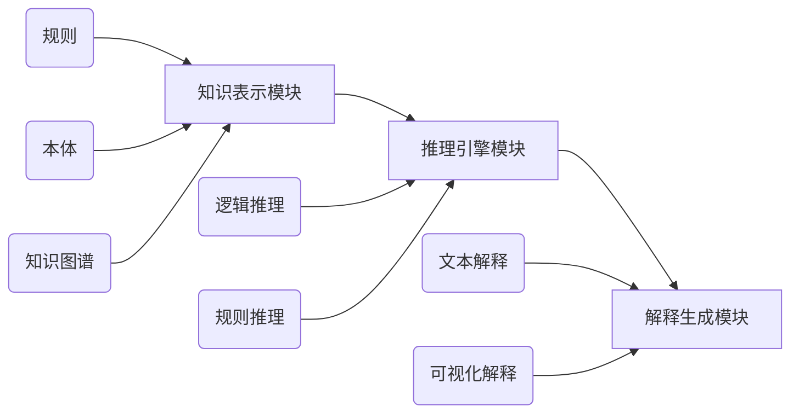

# AI Agent的知识推理可解释性设计

> 关键词：AI Agent、知识推理、可解释性设计、人工智能、机器学习、认知科学、逻辑推理

> 摘要：本文聚焦于AI Agent的知识推理可解释性设计这一关键议题。在人工智能快速发展的当下，AI Agent在众多领域得到广泛应用，但由于其推理过程的黑箱性，使得其决策的可信度和安全性受到质疑。文章旨在深入探讨可解释性设计的相关概念、原理、算法以及实际应用等内容，通过详细的理论阐述和丰富的实践案例，为实现AI Agent知识推理的可解释性提供全面的技术指导和理论支持，以促进AI Agent在更多领域的安全、可靠应用。

## 1. 背景介绍 
### 1.1 目的和范围
随着人工智能技术的不断进步，AI Agent在医疗、金融、交通等关键领域的应用日益广泛。然而，AI Agent的知识推理过程往往难以理解，这给其应用带来了诸多问题，如难以评估决策的可靠性、无法有效进行错误排查等。本文的目的在于系统地研究AI Agent知识推理可解释性设计的方法和技术，范围涵盖可解释性的基本概念、核心算法、数学模型、实际应用案例以及未来发展趋势等方面。

### 1.2 预期读者
本文预期读者包括人工智能领域的研究人员、开发者、工程师，以及对AI Agent可解释性感兴趣的相关专业学生和从业人员。对于希望深入了解AI Agent知识推理可解释性设计原理和技术的读者，本文将提供有价值的参考。

### 1.3 文档结构概述
本文首先介绍背景信息，包括目的、预期读者和文档结构概述。接着阐述核心概念与联系，通过文本示意图和Mermaid流程图展示可解释性设计的原理和架构。然后详细讲解核心算法原理及具体操作步骤，使用Python源代码进行阐述。随后介绍数学模型和公式，并举例说明。再通过项目实战展示代码实际案例和详细解释。之后探讨实际应用场景，推荐相关工具和资源。最后总结未来发展趋势与挑战，提供常见问题与解答以及扩展阅读和参考资料。

### 1.4 术语表
#### 1.4.1 核心术语定义
- **AI Agent（人工智能智能体）**：能够感知环境、自主决策并采取行动以实现特定目标的人工智能实体。
- **知识推理**：AI Agent根据已有的知识和规则，推导出新的知识或结论的过程。
- **可解释性**：指能够以人类可理解的方式解释AI Agent的决策过程和结果的能力。

#### 1.4.2 相关概念解释
- **黑箱模型**：指输入和输出明确，但内部工作机制难以理解的模型，许多传统的AI模型都具有黑箱特性。
- **白箱模型**：内部结构和工作原理清晰易懂的模型，可解释性强。

#### 1.4.3 缩略词列表
- **AI**：Artificial Intelligence（人工智能）
- **ML**：Machine Learning（机器学习）
- **DL**：Deep Learning（深度学习）

## 2. 核心概念与联系 

### 2.1 可解释性的重要性
在AI Agent的应用中，可解释性具有至关重要的意义。首先，在安全关键领域，如医疗诊断和自动驾驶，可解释性能够帮助人类评估AI Agent决策的可靠性，确保其决策不会对人类生命和财产造成危害。其次，可解释性有助于发现模型中的错误和偏差，提高模型的性能和稳定性。此外，可解释性还能增强用户对AI Agent的信任，促进其在更多领域的广泛应用。

### 2.2 可解释性设计的原理
可解释性设计的核心原理是将AI Agent的知识推理过程转化为人类能够理解的形式。这可以通过多种方式实现，如使用规则、逻辑推理、可视化等。其中，基于规则的方法是将知识表示为明确的规则，AI Agent根据这些规则进行推理，推理过程可以直接被人类理解。逻辑推理方法则通过逻辑运算和推理规则来推导结论，其过程具有严格的逻辑性和可解释性。可视化方法则是将推理过程和结果以图形、图表等直观的形式展示给用户，方便用户理解。

### 2.3 可解释性设计的架构
可解释性设计的架构主要包括知识表示模块、推理引擎模块和解释生成模块。知识表示模块负责将领域知识以合适的方式表示出来，如规则、本体、知识图谱等。推理引擎模块根据知识表示模块提供的知识进行推理，得出结论。解释生成模块则根据推理过程和结果生成人类可理解的解释。

以下是可解释性设计架构的文本示意图：

```plaintext
+---------------------+
| 知识表示模块        |
| （规则、本体、知识图谱等） |
+---------------------+
           |
           v
+---------------------+
| 推理引擎模块        |
| （逻辑推理、规则推理等） |
+---------------------+
           |
           v
+---------------------+
| 解释生成模块        |
| （文本解释、可视化解释等） |
+---------------------+
```

以下是对应的Mermaid流程图：



## 3. 核心算法原理 & 具体操作步骤 

### 3.1 基于规则的推理算法
基于规则的推理算法是一种常见的可解释性推理算法。其基本思想是将领域知识表示为一系列的规则，推理过程就是根据这些规则对输入的事实进行匹配和推导。

以下是一个简单的基于规则的推理算法的Python实现：

```python
# 定义规则类
class Rule:
    def __init__(self, antecedent, consequent):
        self.antecedent = antecedent  # 规则的前提条件
        self.consequent = consequent  # 规则的结论

    def match(self, facts):
        # 检查规则的前提条件是否都在事实中
        for fact in self.antecedent:
            if fact not in facts:
                return False
        return True

# 定义推理引擎类
class RuleBasedReasoner:
    def __init__(self, rules):
        self.rules = rules

    def infer(self, facts):
        new_facts = set(facts)
        while True:
            added = False
            for rule in self.rules:
                if rule.match(new_facts) and rule.consequent not in new_facts:
                    new_facts.add(rule.consequent)
                    added = True
            if not added:
                break
        return new_facts

# 示例规则和事实
rules = [
    Rule(['A', 'B'], 'C'),
    Rule(['C'], 'D')
]
facts = {'A', 'B'}

# 创建推理引擎并进行推理
reasoner = RuleBasedReasoner(rules)
result = reasoner.infer(facts)
print("推理结果:", result)
```

### 3.2 具体操作步骤
1. **知识表示**：将领域知识整理成规则的形式，每条规则包括前提条件和结论。
2. **事实输入**：将已知的事实作为输入提供给推理引擎。
3. **规则匹配**：推理引擎遍历规则集，检查每条规则的前提条件是否与输入的事实匹配。
4. **结论推导**：如果规则的前提条件匹配，则将规则的结论添加到事实集中。
5. **迭代推理**：重复步骤3和4，直到没有新的结论可以推导为止。

## 4. 数学模型和公式 & 详细讲解 & 举例说明 

### 4.1 基于逻辑推理的数学模型
在逻辑推理中，常用的数学模型是命题逻辑和一阶逻辑。命题逻辑是研究命题之间逻辑关系的理论，命题是具有真假值的陈述句。一阶逻辑则在命题逻辑的基础上引入了变量、量词等概念，能够更准确地描述复杂的知识。

### 4.2 命题逻辑公式
命题逻辑中常用的逻辑运算符包括合取（$\land$）、析取（$\lor$）、否定（$\neg$）、蕴含（$\to$）等。例如，命题公式 $P \land Q \to R$ 表示如果 $P$ 和 $Q$ 都为真，则 $R$ 为真。

### 4.3 一阶逻辑公式
一阶逻辑中引入了变量和量词，如全称量词 $\forall$ 和存在量词 $\exists$。例如，一阶逻辑公式 $\forall x (P(x) \to Q(x))$ 表示对于所有的 $x$，如果 $P(x)$ 为真，则 $Q(x)$ 为真。

### 4.4 举例说明
假设我们有以下规则：
- 规则1：如果一个人是学生（$Student(x)$），并且他学习努力（$StudyHard(x)$），那么他会取得好成绩（$GoodGrade(x)$），可以表示为 $\forall x (Student(x) \land StudyHard(x) \to GoodGrade(x))$。
- 已知事实：小明是学生（$Student(小明)$），小明学习努力（$StudyHard(小明)$）。

根据一阶逻辑的推理规则，可以推导出小明会取得好成绩（$GoodGrade(小明)$）。

## 5. 项目实战：代码实际案例和详细解释说明 

### 5.1  开发环境搭建
- **Python环境**：确保已经安装Python 3.x版本。
- **开发工具**：可以使用PyCharm、VS Code等集成开发环境。
- **相关库**：在本项目中，主要使用Python的内置库，无需额外安装。

### 5.2  源代码详细实现和代码解读
以下是一个更复杂的基于规则的推理系统的Python实现，用于诊断疾病：

```python
# 定义规则类
class DiseaseRule:
    def __init__(self, symptoms, disease):
        self.symptoms = symptoms  # 症状列表
        self.disease = disease  # 疾病名称

    def match(self, patient_symptoms):
        # 检查规则的症状是否都在患者的症状中
        for symptom in self.symptoms:
            if symptom not in patient_symptoms:
                return False
        return True

# 定义疾病诊断推理引擎类
class DiseaseDiagnoser:
    def __init__(self, rules):
        self.rules = rules

    def diagnose(self, patient_symptoms):
        possible_diseases = []
        for rule in self.rules:
            if rule.match(patient_symptoms):
                possible_diseases.append(rule.disease)
        return possible_diseases

# 示例规则
rules = [
    DiseaseRule(['发热', '咳嗽', '乏力'], '感冒'),
    DiseaseRule(['发热', '呼吸困难'], '肺炎')
]

# 患者症状
patient_symptoms = ['发热', '咳嗽', '乏力']

# 创建诊断器并进行诊断
diagnoser = DiseaseDiagnoser(rules)
result = diagnoser.diagnose(patient_symptoms)
print("可能的疾病:", result)
```

### 5.3  代码解读与分析
- **DiseaseRule类**：用于表示疾病诊断规则，每个规则包含一组症状和对应的疾病名称。`match` 方法用于检查患者的症状是否与规则的症状匹配。
- **DiseaseDiagnoser类**：疾病诊断推理引擎类，`diagnose` 方法遍历规则集，找出与患者症状匹配的规则，并返回可能的疾病列表。
- **示例规则和患者症状**：定义了两个疾病诊断规则和一个患者的症状，通过调用 `diagnose` 方法进行诊断，输出可能的疾病。

## 6. 实际应用场景 
### 6.1 医疗领域
在医疗领域，AI Agent的知识推理可解释性设计具有重要意义。例如，在疾病诊断中，可解释的AI Agent能够向医生解释其诊断结果的依据，帮助医生更好地理解病情，做出更准确的决策。同时，可解释性也有助于医疗监管部门对AI医疗系统进行评估和监管。

### 6.2 金融领域
在金融领域，AI Agent可用于风险评估、投资决策等方面。可解释性设计能够让金融从业者理解AI Agent的决策过程，评估风险，避免因不理解模型决策而导致的投资失误。此外，可解释性也有助于满足金融监管的要求。

### 6.3 交通领域
在交通领域，自动驾驶汽车是AI Agent的典型应用。可解释性设计能够让驾驶员和乘客理解自动驾驶汽车的决策过程，提高对自动驾驶技术的信任。同时，在发生事故时，可解释性也有助于事故原因的调查和责任认定。

## 7. 工具和资源推荐
### 7.1 学习资源推荐
#### 7.1.1 书籍推荐
- 《人工智能：一种现代的方法》：全面介绍了人工智能的基本概念、算法和应用，是人工智能领域的经典教材。
- 《可解释的人工智能：解释、可视化和理解深度学习》：专门探讨了可解释人工智能的相关理论和技术。

#### 7.1.2 在线课程
- Coursera上的“人工智能基础”课程：由知名高校教授授课，系统介绍了人工智能的基础知识。
- edX上的“可解释人工智能”课程：深入讲解了可解释人工智能的原理和方法。

#### 7.1.3 技术博客和网站
- Medium上的人工智能相关博客：有许多关于AI Agent可解释性的最新研究和实践经验分享。
- arXiv.org：提供了大量的人工智能领域的学术论文，包括可解释性相关的研究成果。

### 7.2 开发工具框架推荐
#### 7.2.1 IDE和编辑器
- PyCharm：功能强大的Python集成开发环境，提供了丰富的代码编辑、调试和分析功能。
- VS Code：轻量级的代码编辑器，支持多种编程语言，有丰富的插件扩展。

#### 7.2.2 调试和性能分析工具
- PDB：Python的内置调试器，可用于调试Python代码。
- cProfile：Python的性能分析工具，可用于分析代码的性能瓶颈。

#### 7.2.3 相关框架和库
- Scikit-learn：Python的机器学习库，提供了多种机器学习算法和工具，可用于构建可解释的机器学习模型。
- SHAP：用于解释机器学习模型预测结果的Python库，提供了多种解释方法。

### 7.3 相关论文著作推荐
#### 7.3.1 经典论文
- “Why Should I Trust You?” Explaining the Predictions of Any Classifier：提出了一种通用的模型解释方法，具有重要的理论和实践意义。
- A Survey on Explainable Artificial Intelligence (XAI)：对可解释人工智能的研究进行了全面的综述。

#### 7.3.2 最新研究成果
- 关注顶级人工智能会议（如NeurIPS、ICML等）上发表的关于可解释人工智能的最新研究论文。

#### 7.3.3 应用案例分析
- 一些实际应用案例的研究论文，如医疗、金融等领域中AI Agent可解释性设计的应用案例。

## 8. 总结：未来发展趋势与挑战
### 8.1 未来发展趋势
- **多模态可解释性**：未来的可解释性设计将不仅仅局限于文本解释，还将结合图像、音频等多模态信息，提供更丰富、直观的解释。
- **融合认知科学**：借鉴认知科学的理论和方法，使AI Agent的推理过程更符合人类的认知模式，提高可解释性。
- **可解释性与安全性的融合**：将可解释性设计与安全性设计相结合，确保AI Agent在安全的前提下提供可解释的决策。

### 8.2 挑战
- **复杂模型的可解释性**：随着深度学习等复杂模型的广泛应用，如何对这些模型进行有效的解释是一个巨大的挑战。
- **可解释性与性能的平衡**：在提高可解释性的同时，如何保证AI Agent的性能不受影响，是需要解决的问题。
- **用户对可解释性的接受度**：如何让用户真正理解和接受AI Agent的解释，也是一个需要关注的问题。

## 9. 附录：常见问题与解答
### 9.1 什么是AI Agent的知识推理可解释性？
AI Agent的知识推理可解释性是指能够以人类可理解的方式解释AI Agent的决策过程和结果的能力。

### 9.2 为什么可解释性很重要？
可解释性能够帮助人类评估AI Agent决策的可靠性，发现模型中的错误和偏差，增强用户对AI Agent的信任，促进其在更多领域的应用。

### 9.3 如何实现AI Agent的知识推理可解释性？
可以通过基于规则的推理、逻辑推理、可视化等多种方法实现AI Agent的知识推理可解释性。

## 10. 扩展阅读 & 参考资料
- 相关的人工智能学术期刊，如《Artificial Intelligence》、《Journal of Artificial Intelligence Research》等。
- 国内外人工智能研究机构的官方网站，如斯坦福人工智能实验室、麻省理工学院计算机科学与人工智能实验室等。
- 其他关于可解释人工智能的技术报告和研究文档。