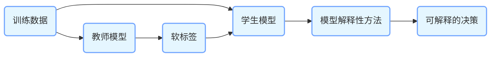

# AI Agent的知识蒸馏在模型解释性中的应用

> 关键词：AI Agent、知识蒸馏、模型解释性、机器学习、深度学习、可解释人工智能、模型压缩

> 摘要：本文深入探讨了AI Agent的知识蒸馏在模型解释性中的应用。首先介绍了相关背景，包括研究目的、预期读者等内容。接着阐述了核心概念，分析了知识蒸馏与模型解释性的原理及联系。详细讲解了核心算法原理，通过Python代码进行说明，并给出了相关数学模型和公式。结合实际案例，展示了知识蒸馏在提升模型解释性方面的具体实现过程。探讨了其实际应用场景，推荐了学习、开发相关的工具和资源，最后对未来发展趋势与挑战进行总结，并给出常见问题解答及参考资料。旨在帮助读者全面了解AI Agent的知识蒸馏在模型解释性领域的重要性和应用方法。

## 1. 背景介绍 
### 1.1 目的和范围
随着人工智能技术的飞速发展，AI Agent在各个领域得到了广泛应用。然而，许多先进的AI模型，如深度神经网络，往往是复杂的黑盒模型，其决策过程难以理解，这限制了它们在一些对解释性要求较高的领域的应用，如医疗、金融等。知识蒸馏作为一种模型压缩和迁移学习的技术，能够将复杂模型（教师模型）的知识传递给简单模型（学生模型）。本文章的目的在于探讨如何利用AI Agent的知识蒸馏技术来提高模型的解释性，研究范围涵盖了知识蒸馏的原理、算法实现、实际应用案例以及相关工具和资源等方面。

### 1.2 预期读者
本文预期读者包括人工智能领域的研究人员、数据科学家、机器学习工程师、对可解释人工智能感兴趣的学者以及相关专业的学生。通过阅读本文，读者可以深入了解知识蒸馏在模型解释性方面的应用，掌握相关的理论知识和实践技能。

### 1.3 文档结构概述
本文首先介绍背景信息，包括目的、预期读者和文档结构。接着阐述核心概念，分析知识蒸馏与模型解释性的联系。然后详细讲解核心算法原理和具体操作步骤，给出相关数学模型和公式。通过实际案例展示知识蒸馏在模型解释性中的应用，探讨实际应用场景。推荐学习、开发相关的工具和资源，最后总结未来发展趋势与挑战，给出常见问题解答及参考资料。

### 1.4 术语表
#### 1.4.1 核心术语定义
- **AI Agent**：能够感知环境并根据感知到的信息采取行动以实现特定目标的智能体。它可以是软件程序、机器人等。
- **知识蒸馏**：一种模型压缩和迁移学习的技术，通过让一个简单的学生模型学习复杂的教师模型的输出，将教师模型的知识传递给学生模型。
- **模型解释性**：指能够理解和解释模型的决策过程和输出结果的能力。对于可解释的模型，用户可以知道模型为什么做出某个决策。

#### 1.4.2 相关概念解释
- **黑盒模型**：指那些内部结构和决策过程难以理解的模型，如深度神经网络。黑盒模型通常具有很高的预测性能，但缺乏可解释性。
- **白盒模型**：指那些内部结构和决策过程相对容易理解的模型，如决策树、线性回归等。白盒模型的可解释性较强，但预测性能可能相对较低。

#### 1.4.3 缩略词列表
- **DNN**：Deep Neural Network，深度神经网络
- **ML**：Machine Learning，机器学习
- **DL**：Deep Learning，深度学习
- **XAI**：Explainable Artificial Intelligence，可解释人工智能

## 2. 核心概念与联系 

### 2.1 知识蒸馏原理
知识蒸馏的基本思想是让一个简单的学生模型学习复杂的教师模型的输出。教师模型通常是一个性能较好但结构复杂的模型，而学生模型则是一个结构简单的模型。通过让学生模型模仿教师模型的输出，学生模型可以学习到教师模型的知识，从而提高自己的性能。

知识蒸馏的过程可以分为以下几个步骤：
1. **训练教师模型**：使用大量的数据训练一个性能较好的复杂模型作为教师模型。
2. **生成软标签**：将训练数据输入到教师模型中，得到教师模型的输出，这些输出可以作为软标签。
3. **训练学生模型**：使用训练数据和软标签来训练学生模型，让学生模型学习教师模型的输出。

### 2.2 模型解释性原理
模型解释性是指能够理解和解释模型的决策过程和输出结果的能力。提高模型解释性的方法有很多种，例如使用可解释的模型（如决策树、线性回归等）、特征重要性分析、局部解释方法（如LIME、SHAP等）。

可解释的模型通常具有简单的结构和明确的决策规则，因此容易理解和解释。特征重要性分析可以帮助我们了解哪些特征对模型的输出影响最大，从而解释模型的决策过程。局部解释方法可以为每个样本提供个性化的解释，帮助我们理解模型在特定样本上的决策依据。

### 2.3 知识蒸馏与模型解释性的联系
知识蒸馏可以在一定程度上提高模型的解释性。通过将复杂模型的知识传递给简单模型，我们可以得到一个性能接近复杂模型但结构更简单的模型。简单模型通常具有更好的可解释性，因为它们的结构和决策规则更容易理解。

此外，知识蒸馏还可以与其他解释性方法结合使用。例如，我们可以在知识蒸馏的过程中使用特征重要性分析，选择对教师模型输出影响较大的特征来训练学生模型，从而提高学生模型的解释性。

### 2.4 核心概念的文本示意图
知识蒸馏的过程可以用以下文本示意图表示：

```plaintext
训练数据 ---> 教师模型 ---> 软标签
训练数据 + 软标签 ---> 学生模型
```

模型解释性的相关概念可以用以下文本示意图表示：

```plaintext
模型 ---> 特征重要性分析 ---> 重要特征
模型 ---> 局部解释方法 ---> 样本解释
```

知识蒸馏与模型解释性的联系可以用以下文本示意图表示：

```plaintext
复杂模型（教师模型） ---> 知识蒸馏 ---> 简单模型（学生模型）
简单模型 ---> 模型解释性方法 ---> 可解释的决策
```

### 2.5 Mermaid流程图


## 3. 核心算法原理 & 具体操作步骤 

### 3.1 知识蒸馏算法原理
知识蒸馏的核心思想是最小化学生模型的输出与教师模型的输出之间的差异。通常使用的损失函数是KL散度（Kullback - Leibler divergence）。

KL散度是一种衡量两个概率分布之间差异的指标。假设 $p$ 是教师模型的输出概率分布，$q$ 是学生模型的输出概率分布，则KL散度的定义为：

$$D_{KL}(p||q)=\sum_{i}p(i)\log\frac{p(i)}{q(i)}$$

在知识蒸馏中，我们通常会在损失函数中加入一个温度参数 $T$，以平滑教师模型的输出概率分布。具体来说，教师模型的输出概率分布 $p$ 和学生模型的输出概率分布 $q$ 可以通过以下公式计算：

$$p(i)=\frac{\exp(z_{i}/T)}{\sum_{j}\exp(z_{j}/T)}$$

$$q(i)=\frac{\exp(s_{i}/T)}{\sum_{j}\exp(s_{j}/T)}$$

其中，$z_{i}$ 是教师模型的第 $i$ 个输出，$s_{i}$ 是学生模型的第 $i$ 个输出。

最终的损失函数可以表示为：

$$L = \alpha D_{KL}(p||q)+(1 - \alpha)L_{CE}$$

其中，$L_{CE}$ 是学生模型的交叉熵损失，$\alpha$ 是一个超参数，用于控制KL散度损失和交叉熵损失的权重。

### 3.2 具体操作步骤
以下是知识蒸馏的具体操作步骤：

1. **定义教师模型和学生模型**：选择一个性能较好的复杂模型作为教师模型，选择一个结构简单的模型作为学生模型。
2. **训练教师模型**：使用大量的数据训练教师模型，直到达到满意的性能。
3. **设置温度参数和超参数**：设置温度参数 $T$ 和超参数 $\alpha$。
4. **训练学生模型**：在训练学生模型的过程中，计算教师模型的软标签，然后使用软标签和真实标签来计算损失函数，更新学生模型的参数。

### 3.3 Python源代码实现
```python
import torch
import torch.nn as nn
import torch.optim as optim
from torch.utils.data import DataLoader, Dataset

# 定义教师模型
class TeacherModel(nn.Module):
    def __init__(self):
        super(TeacherModel, self).__init__()
        self.fc1 = nn.Linear(10, 20)
        self.relu = nn.ReLU()
        self.fc2 = nn.Linear(20, 2)

    def forward(self, x):
        x = self.fc1(x)
        x = self.relu(x)
        x = self.fc2(x)
        return x

# 定义学生模型
class StudentModel(nn.Module):
    def __init__(self):
        super(StudentModel, self).__init__()
        self.fc1 = nn.Linear(10, 10)
        self.relu = nn.ReLU()
        self.fc2 = nn.Linear(10, 2)

    def forward(self, x):
        x = self.fc1(x)
        x = self.relu(x)
        x = self.fc2(x)
        return x

# 自定义数据集
class CustomDataset(Dataset):
    def __init__(self, data, labels):
        self.data = data
        self.labels = labels

    def __len__(self):
        return len(self.data)

    def __getitem__(self, idx):
        return self.data[idx], self.labels[idx]

# 知识蒸馏损失函数
def knowledge_distillation_loss(student_output, teacher_output, labels, T, alpha):
    softmax_teacher = nn.Softmax(dim=1)(teacher_output / T)
    softmax_student = nn.Softmax(dim=1)(student_output / T)
    kl_loss = nn.KLDivLoss(reduction='batchmean')(torch.log(softmax_student), softmax_teacher) * (T * T)
    ce_loss = nn.CrossEntropyLoss()(student_output, labels)
    return alpha * kl_loss + (1 - alpha) * ce_loss

# 训练函数
def train_kd(teacher_model, student_model, train_loader, optimizer, T, alpha, epochs):
    teacher_model.eval()
    for epoch in range(epochs):
        running_loss = 0.0
        for inputs, labels in train_loader:
            optimizer.zero_grad()
            teacher_output = teacher_model(inputs)
            student_output = student_model(inputs)
            loss = knowledge_distillation_loss(student_output, teacher_output, labels, T, alpha)
            loss.backward()
            optimizer.step()
            running_loss += loss.item()
        print(f'Epoch {epoch + 1}, Loss: {running_loss / len(train_loader)}')

# 主函数
if __name__ == '__main__':
    # 生成随机数据
    data = torch.randn(100, 10)
    labels = torch.randint(0, 2, (100,))

    # 创建数据集和数据加载器
    dataset = CustomDataset(data, labels)
    train_loader = DataLoader(dataset, batch_size=10, shuffle=True)

    # 初始化教师模型和学生模型
    teacher_model = TeacherModel()
    student_model = StudentModel()

    # 训练教师模型（这里简单省略训练过程）
    # ...

    # 定义优化器
    optimizer = optim.Adam(student_model.parameters(), lr=0.001)

    # 设置温度参数和超参数
    T = 2.0
    alpha = 0.5

    # 训练学生模型
    train_kd(teacher_model, student_model, train_loader, optimizer, T, alpha, epochs=10)
```

## 4. 数学模型和公式 & 详细讲解 & 举例说明 

### 4.1 KL散度
KL散度是一种衡量两个概率分布之间差异的指标。给定两个概率分布 $p$ 和 $q$，它们的KL散度定义为：

$$D_{KL}(p||q)=\sum_{i}p(i)\log\frac{p(i)}{q(i)}$$

KL散度具有以下性质：
- **非负性**：$D_{KL}(p||q)\geq0$，当且仅当 $p = q$ 时，$D_{KL}(p||q)=0$。
- **不对称性**：$D_{KL}(p||q)\neq D_{KL}(q||p)$。

### 4.2 温度参数和软标签
在知识蒸馏中，我们通常会引入一个温度参数 $T$ 来平滑教师模型的输出概率分布。具体来说，教师模型的输出概率分布 $p$ 可以通过以下公式计算：

$$p(i)=\frac{\exp(z_{i}/T)}{\sum_{j}\exp(z_{j}/T)}$$

其中，$z_{i}$ 是教师模型的第 $i$ 个输出。当 $T$ 较大时，概率分布会更加平滑，不同类别之间的差异会减小；当 $T$ 较小时，概率分布会更加尖锐，不同类别之间的差异会增大。

### 4.3 最终损失函数
最终的损失函数可以表示为：

$$L = \alpha D_{KL}(p||q)+(1 - \alpha)L_{CE}$$

其中，$L_{CE}$ 是学生模型的交叉熵损失，$\alpha$ 是一个超参数，用于控制KL散度损失和交叉熵损失的权重。

### 4.4 举例说明
假设我们有一个二分类问题，教师模型的输出为 $z = [2, 1]$，学生模型的输出为 $s = [1, 0]$，真实标签为 $y = [1, 0]$。

1. **计算软标签**：
   - 假设温度参数 $T = 2$，则教师模型的软标签为：
     - $p(1)=\frac{\exp(2/2)}{\exp(2/2)+\exp(1/2)}\approx0.73$
     - $p(2)=\frac{\exp(1/2)}{\exp(2/2)+\exp(1/2)}\approx0.27$
   - 学生模型的软标签为：
     - $q(1)=\frac{\exp(1/2)}{\exp(1/2)+\exp(0/2)}\approx0.62$
     - $q(2)=\frac{\exp(0/2)}{\exp(1/2)+\exp(0/2)}\approx0.38$

2. **计算KL散度**：
   - $D_{KL}(p||q)=p(1)\log\frac{p(1)}{q(1)}+p(2)\log\frac{p(2)}{q(2)}\approx0.07$

3. **计算交叉熵损失**：
   - $L_{CE}=-\sum_{i}y(i)\log s(i)=-\log(1)\approx0$

4. **计算最终损失**：
   - 假设 $\alpha = 0.5$，则最终损失为：
     - $L = 0.5\times0.07+(1 - 0.5)\times0 = 0.035$

## 5. 项目实战：代码实际案例和详细解释说明 

### 5.1  开发环境搭建
#### 5.1.1 安装Python
首先，确保你已经安装了Python 3.x版本。可以从Python官方网站（https://www.python.org/downloads/）下载并安装。

#### 5.1.2 安装深度学习框架
本文使用PyTorch作为深度学习框架。可以使用以下命令安装PyTorch：

```sh
pip install torch torchvision
```

#### 5.1.3 安装其他依赖库
还需要安装一些其他的依赖库，如`numpy`、`matplotlib`等。可以使用以下命令安装：

```sh
pip install numpy matplotlib
```

### 5.2  源代码详细实现和代码解读
```python
import torch
import torch.nn as nn
import torch.optim as optim
from torch.utils.data import DataLoader, Dataset
import numpy as np
import matplotlib.pyplot as plt

# 定义教师模型
class TeacherModel(nn.Module):
    def __init__(self):
        super(TeacherModel, self).__init__()
        # 输入层到隐藏层的全连接层，输入维度为10，输出维度为20
        self.fc1 = nn.Linear(10, 20)
        # 激活函数ReLU
        self.relu = nn.ReLU()
        # 隐藏层到输出层的全连接层，输入维度为20，输出维度为2
        self.fc2 = nn.Linear(20, 2)

    def forward(self, x):
        # 前向传播过程
        x = self.fc1(x)
        x = self.relu(x)
        x = self.fc2(x)
        return x

# 定义学生模型
class StudentModel(nn.Module):
    def __init__(self):
        super(StudentModel, self).__init__()
        # 输入层到隐藏层的全连接层，输入维度为10，输出维度为10
        self.fc1 = nn.Linear(10, 10)
        # 激活函数ReLU
        self.relu = nn.ReLU()
        # 隐藏层到输出层的全连接层，输入维度为10，输出维度为2
        self.fc2 = nn.Linear(10, 2)

    def forward(self, x):
        # 前向传播过程
        x = self.fc1(x)
        x = self.relu(x)
        x = self.fc2(x)
        return x

# 自定义数据集
class CustomDataset(Dataset):
    def __init__(self, data, labels):
        # 初始化数据和标签
        self.data = data
        self.labels = labels

    def __len__(self):
        # 返回数据集的长度
        return len(self.data)

    def __getitem__(self, idx):
        # 根据索引返回数据和标签
        return self.data[idx], self.labels[idx]

# 知识蒸馏损失函数
def knowledge_distillation_loss(student_output, teacher_output, labels, T, alpha):
    # 计算教师模型的软标签
    softmax_teacher = nn.Softmax(dim=1)(teacher_output / T)
    # 计算学生模型的软标签
    softmax_student = nn.Softmax(dim=1)(student_output / T)
    # 计算KL散度损失
    kl_loss = nn.KLDivLoss(reduction='batchmean')(torch.log(softmax_student), softmax_teacher) * (T * T)
    # 计算交叉熵损失
    ce_loss = nn.CrossEntropyLoss()(student_output, labels)
    # 计算最终损失
    return alpha * kl_loss + (1 - alpha) * ce_loss

# 训练函数
def train_kd(teacher_model, student_model, train_loader, optimizer, T, alpha, epochs):
    teacher_model.eval()
    losses = []
    for epoch in range(epochs):
        running_loss = 0.0
        for inputs, labels in train_loader:
            optimizer.zero_grad()
            # 教师模型前向传播
            teacher_output = teacher_model(inputs)
            # 学生模型前向传播
            student_output = student_model(inputs)
            # 计算损失
            loss = knowledge_distillation_loss(student_output, teacher_output, labels, T, alpha)
            # 反向传播
            loss.backward()
            # 更新参数
            optimizer.step()
            running_loss += loss.item()
        losses.append(running_loss / len(train_loader))
        print(f'Epoch {epoch + 1}, Loss: {running_loss / len(train_loader)}')
    # 绘制损失曲线
    plt.plot(losses)
    plt.xlabel('Epoch')
    plt.ylabel('Loss')
    plt.title('Knowledge Distillation Loss')
    plt.show()

# 主函数
if __name__ == '__main__':
    # 生成随机数据
    data = torch.randn(100, 10)
    labels = torch.randint(0, 2, (100,))

    # 创建数据集和数据加载器
    dataset = CustomDataset(data, labels)
    train_loader = DataLoader(dataset, batch_size=10, shuffle=True)

    # 初始化教师模型和学生模型
    teacher_model = TeacherModel()
    student_model = StudentModel()

    # 训练教师模型（这里简单省略训练过程）
    # ...

    # 定义优化器
    optimizer = optim.Adam(student_model.parameters(), lr=0.001)

    # 设置温度参数和超参数
    T = 2.0
    alpha = 0.5

    # 训练学生模型
    train_kd(teacher_model, student_model, train_loader, optimizer, T, alpha, epochs=10)
```

### 5.3  代码解读与分析
- **模型定义**：定义了教师模型和学生模型，教师模型的结构比学生模型更复杂。
- **数据集和数据加载器**：使用自定义的数据集和数据加载器来加载数据。
- **知识蒸馏损失函数**：计算KL散度损失和交叉熵损失的加权和作为最终损失。
- **训练函数**：在训练过程中，教师模型保持不变，学生模型通过最小化损失函数来学习教师模型的知识。
- **主函数**：生成随机数据，初始化模型和优化器，设置温度参数和超参数，然后调用训练函数进行训练。

通过观察损失曲线，我们可以看到学生模型在训练过程中的损失逐渐减小，说明学生模型在不断学习教师模型的知识。

## 6. 实际应用场景 

### 6.1 医疗领域
在医疗领域，模型的解释性非常重要。例如，在疾病诊断中，医生需要了解模型为什么做出某个诊断结果，以便进行进一步的判断和决策。知识蒸馏可以将复杂的深度学习模型的知识传递给简单的可解释模型，如决策树，从而提高模型的解释性。医生可以根据决策树的决策规则来理解模型的诊断依据，增加对模型的信任。

### 6.2 金融领域
在金融领域，风险评估和投资决策等任务对模型的解释性要求较高。复杂的深度学习模型可能在预测性能上表现出色，但由于其黑盒性质，难以被金融从业者理解和接受。通过知识蒸馏，将复杂模型的知识转移到简单模型中，如线性回归模型，金融从业者可以根据模型的系数来理解各个特征对风险评估或投资决策的影响，从而更好地进行决策。

### 6.3 自动驾驶领域
在自动驾驶中，模型的决策过程需要具有可解释性，以确保安全性和可靠性。知识蒸馏可以帮助将复杂的感知和决策模型的知识传递给更简单的模型，同时可以结合特征重要性分析等方法，解释模型在不同场景下做出决策的依据，如为什么在某个时刻选择刹车或转向。

### 6.4 智能安防领域
在智能安防中，目标检测和行为识别等任务的模型解释性也很关键。例如，在监控系统中，当模型检测到异常行为时，需要能够解释为什么认为该行为是异常的。知识蒸馏可以提高模型的可解释性，帮助安保人员更好地理解和处理监控信息。

## 7. 工具和资源推荐
### 7.1 学习资源推荐
#### 7.1.1 书籍推荐
- 《深度学习》（Deep Learning）：由Ian Goodfellow、Yoshua Bengio和Aaron Courville合著，是深度学习领域的经典教材，涵盖了深度学习的基本原理、算法和应用。
- 《Python深度学习》（Deep Learning with Python）：由Francois Chollet（Keras的作者）撰写，通过Python代码和实际案例介绍深度学习的应用。
- 《可解释人工智能》（Explainable Artificial Intelligence）：详细介绍了可解释人工智能的相关理论和方法。

#### 7.1.2 在线课程
- Coursera上的“深度学习专项课程”（Deep Learning Specialization）：由Andrew Ng教授授课，包括深度学习的基础、卷积神经网络、循环神经网络等内容。
- edX上的“人工智能基础”（Introduction to Artificial Intelligence）：介绍了人工智能的基本概念、算法和应用。
- 哔哩哔哩上有许多关于深度学习和可解释人工智能的教程，适合初学者学习。

#### 7.1.3 技术博客和网站
- Medium：有许多关于人工智能和深度学习的技术博客，如Towards Data Science。
- arXiv：提供了大量的学术论文，包括知识蒸馏和可解释人工智能的最新研究成果。
- AI科技评论：关注人工智能领域的最新动态和技术进展。

### 7.2 开发工具框架推荐
#### 7.2.1 IDE和编辑器
- PyCharm：是一款专门为Python开发设计的集成开发环境，具有代码编辑、调试、版本控制等功能。
- Jupyter Notebook：是一个交互式的开发环境，适合进行数据探索、模型训练和可视化。
- Visual Studio Code：是一款轻量级的代码编辑器，支持多种编程语言和插件扩展。

#### 7.2.2 调试和性能分析工具
- TensorBoard：是TensorFlow的可视化工具，可以用于可视化模型的训练过程、损失曲线、准确率等指标。
- PyTorch Profiler：是PyTorch的性能分析工具，可以帮助用户分析模型的性能瓶颈，优化模型的训练和推理速度。
- NVIDIA Nsight Systems：是一款用于分析GPU应用程序性能的工具，可以帮助用户优化深度学习模型在GPU上的运行效率。

#### 7.2.3 相关框架和库
- PyTorch：是一个开源的深度学习框架，具有动态图、自动求导等功能，适合快速开发和实验。
- TensorFlow：是另一个广泛使用的深度学习框架，具有丰富的工具和库，适合大规模的工业应用。
- Scikit-learn：是一个用于机器学习的Python库，提供了各种机器学习算法和工具，如分类、回归、聚类等。

### 7.3 相关论文著作推荐
#### 7.3.1 经典论文
- “Distilling the Knowledge in a Neural Network”：这是知识蒸馏领域的经典论文，首次提出了知识蒸馏的概念和方法。
- “A Unified Approach to Interpreting Model Predictions”：介绍了SHAP（SHapley Additive exPlanations）方法，是一种强大的模型解释工具。
- “Why Should I Trust You?”：探讨了模型解释性的重要性和挑战。

#### 7.3.2 最新研究成果
- 在arXiv和各大人工智能学术会议（如NeurIPS、ICML、CVPR等）上可以找到关于知识蒸馏和可解释人工智能的最新研究成果。

#### 7.3.3 应用案例分析
- 许多公司和研究机构会发布关于知识蒸馏和可解释人工智能在实际应用中的案例分析，如谷歌、微软等公司的技术博客。

## 8. 总结：未来发展趋势与挑战

### 8.1 未来发展趋势
- **与其他技术的融合**：知识蒸馏可能会与其他技术，如强化学习、迁移学习等相结合，进一步提高模型的性能和可解释性。例如，在强化学习中，知识蒸馏可以帮助将专家策略的知识传递给智能体，提高智能体的学习效率和决策的可解释性。
- **多模态知识蒸馏**：随着多模态数据（如图像、文本、音频等）的广泛应用，多模态知识蒸馏将成为一个重要的研究方向。通过将不同模态的知识进行蒸馏，可以提高模型对多模态数据的处理能力和解释性。
- **自适应知识蒸馏**：未来的知识蒸馏方法可能会更加自适应，能够根据不同的任务和数据特点自动调整蒸馏的参数和策略，以达到更好的效果。

### 8.2 挑战
- **知识表示和传递的准确性**：如何准确地表示和传递复杂模型的知识是知识蒸馏面临的一个挑战。在蒸馏过程中，可能会丢失一些重要的信息，导致学生模型的性能和解释性受到影响。
- **计算资源和时间成本**：知识蒸馏通常需要训练一个复杂的教师模型和一个学生模型，这会增加计算资源和时间成本。如何在保证效果的前提下，降低计算资源和时间成本是一个需要解决的问题。
- **解释性的评估标准**：目前还没有统一的评估标准来衡量模型的解释性。不同的应用场景对解释性的要求可能不同，如何建立科学合理的评估标准是一个挑战。

## 9. 附录：常见问题与解答

### 9.1 知识蒸馏一定会提高模型的解释性吗？
不一定。知识蒸馏可以将复杂模型的知识传递给简单模型，简单模型通常具有更好的可解释性。但是，如果学生模型的结构仍然很复杂，或者蒸馏过程中没有充分考虑解释性因素，那么模型的解释性可能不会得到明显提高。

### 9.2 如何选择合适的温度参数和超参数？
温度参数和超参数的选择通常需要通过实验来确定。一般来说，温度参数可以在1到10之间进行调整，超参数可以在0到1之间进行调整。可以通过交叉验证等方法来选择最优的参数组合。

### 9.3 知识蒸馏可以应用于所有类型的模型吗？
知识蒸馏可以应用于大多数类型的模型，包括神经网络、决策树、支持向量机等。但是，不同类型的模型在蒸馏过程中可能需要采用不同的方法和技术。

### 9.4 知识蒸馏和模型压缩有什么关系？
知识蒸馏是一种模型压缩的技术。通过将复杂模型的知识传递给简单模型，可以减小模型的大小和计算复杂度，从而实现模型压缩的目的。

## 10. 扩展阅读 & 参考资料
- Hinton, G., Vinyals, O., & Dean, J. (2015). Distilling the Knowledge in a Neural Network. arXiv preprint arXiv:1503.02531.
- Lundberg, S. M., & Lee, S. I. (2017). A Unified Approach to Interpreting Model Predictions. In Advances in neural information processing systems (pp. 4765-4774).
- Ribeiro, M. T., Singh, S., & Guestrin, C. (2016). “Why Should I Trust You?”: Explaining the Predictions of Any Classifier. In Proceedings of the 22nd ACM SIGKDD international conference on knowledge discovery and data mining (pp. 1135-1144).
- Goodfellow, I., Bengio, Y., & Courville, A. (2016). Deep Learning. MIT press.
- Chollet, F. (2017). Deep Learning with Python. Manning Publications.
- arXiv.org: https://arxiv.org/
- Medium: https://medium.com/
- PyTorch官方文档: https://pytorch.org/docs/stable/
- TensorFlow官方文档: https://www.tensorflow.org/api_docs
- Scikit-learn官方文档: https://scikit-learn.org/stable/documentation.html