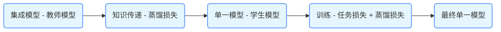

# AI Agent的知识蒸馏：从集成模型到单一模型

> 关键词：AI Agent、知识蒸馏、集成模型、单一模型、模型压缩

> 摘要：本文聚焦于AI Agent领域的知识蒸馏技术，深入探讨如何将集成模型的知识有效迁移到单一模型中。首先介绍了知识蒸馏的背景和相关概念，包括其目的、预期读者等。接着详细阐述了核心概念、算法原理、数学模型等内容，并结合Python代码进行了原理讲解。通过项目实战案例，展示了知识蒸馏在实际开发中的应用，包括开发环境搭建、源代码实现与解读。同时分析了知识蒸馏的实际应用场景，推荐了相关的学习资源、开发工具和论文著作。最后总结了知识蒸馏的未来发展趋势与挑战，并提供了常见问题解答和参考资料，为读者全面深入了解AI Agent的知识蒸馏技术提供了有价值的参考。

## 1. 背景介绍 
### 1.1 目的和范围
在AI Agent的发展过程中，集成模型通常能够通过组合多个弱模型来获得更强大的性能和更准确的预测结果。然而，集成模型往往存在计算复杂度高、存储需求大等问题，这在资源受限的环境中，如移动设备、边缘计算节点等，会严重限制其应用。知识蒸馏技术的出现为解决这一问题提供了有效的途径。本文的目的在于深入探讨如何将集成模型所蕴含的知识通过知识蒸馏的方法迁移到单一模型中，从而在保持较高性能的同时，降低模型的复杂度和资源需求。

本文的范围涵盖了知识蒸馏的核心概念、算法原理、数学模型、项目实战、实际应用场景以及相关的工具和资源推荐等方面，旨在为读者提供一个全面且深入的关于AI Agent知识蒸馏的技术指南。

### 1.2 预期读者
本文预期读者包括AI领域的研究人员、开发人员、数据科学家、机器学习工程师以及对AI Agent和知识蒸馏技术感兴趣的技术爱好者。对于初学者来说，本文可以作为入门学习的资料，帮助他们了解知识蒸馏的基本概念和原理；对于有一定经验的专业人士，本文的深入分析和实战案例可以为他们在实际项目中应用知识蒸馏技术提供参考和启发。

### 1.3 文档结构概述
本文的文档结构如下：
- 核心概念与联系：介绍知识蒸馏的核心概念，包括集成模型、单一模型、知识蒸馏的定义和它们之间的联系，并通过文本示意图和Mermaid流程图进行直观展示。
- 核心算法原理 & 具体操作步骤：详细阐述知识蒸馏的算法原理，并使用Python源代码进行详细讲解，包括算法的具体实现步骤。
- 数学模型和公式 & 详细讲解 & 举例说明：介绍知识蒸馏所涉及的数学模型和公式，并通过具体的例子进行详细说明，帮助读者更好地理解算法的原理。
- 项目实战：代码实际案例和详细解释说明：通过一个具体的项目实战案例，展示知识蒸馏在实际开发中的应用，包括开发环境搭建、源代码详细实现和代码解读。
- 实际应用场景：分析知识蒸馏在不同领域的实际应用场景，如计算机视觉、自然语言处理等。
- 工具和资源推荐：推荐与知识蒸馏相关的学习资源、开发工具框架和论文著作，帮助读者进一步深入学习和研究。
- 总结：未来发展趋势与挑战：总结知识蒸馏的未来发展趋势，并分析可能面临的挑战。
- 附录：常见问题与解答：提供关于知识蒸馏的常见问题解答，帮助读者解决在学习和应用过程中遇到的问题。
- 扩展阅读 & 参考资料：提供相关的扩展阅读材料和参考资料，方便读者进一步深入研究。

### 1.4 术语表
#### 1.4.1 核心术语定义
- **AI Agent**：人工智能代理，是一种能够感知环境、做出决策并采取行动以实现特定目标的智能实体。
- **知识蒸馏**：一种模型压缩技术，通过将一个大型的、复杂的教师模型（如集成模型）的知识迁移到一个小型的、简单的学生模型（单一模型）中，使得学生模型能够在保持较高性能的同时，降低模型的复杂度和资源需求。
- **集成模型**：由多个弱模型组合而成的模型，通过综合多个弱模型的预测结果来获得更准确的预测。
- **单一模型**：相对于集成模型而言，是一个独立的、单一的模型。
- **教师模型**：在知识蒸馏中，通常指集成模型，它拥有丰富的知识和较高的性能，用于向学生模型传递知识。
- **学生模型**：在知识蒸馏中，通常指单一模型，它通过学习教师模型的知识来提高自身的性能。

#### 1.4.2 相关概念解释
- **模型复杂度**：指模型的结构复杂程度，包括模型的层数、神经元数量、参数数量等。模型复杂度越高，通常需要的计算资源和存储资源就越多。
- **模型性能**：指模型在特定任务上的表现，如准确率、召回率、F1值等。模型性能越高，说明模型在该任务上的表现越好。
- **模型压缩**：指通过各种技术手段，如知识蒸馏、量化、剪枝等，降低模型的复杂度和资源需求，同时尽可能保持模型的性能。

#### 1.4.3 缩略词列表
- **ML**：Machine Learning，机器学习
- **DL**：Deep Learning，深度学习
- **CNN**：Convolutional Neural Network，卷积神经网络
- **RNN**：Recurrent Neural Network，循环神经网络
- **LSTM**：Long Short-Term Memory，长短期记忆网络

## 2. 核心概念与联系 

### 核心概念原理
知识蒸馏的核心思想是将教师模型（通常是集成模型）的知识传递给学生模型（单一模型）。教师模型在训练过程中已经学习到了丰富的知识，包括数据的特征表示、类别之间的关系等。知识蒸馏的目标是让学生模型能够学习到这些知识，从而在性能上接近教师模型。

具体来说，知识蒸馏通过引入一个额外的损失函数，即蒸馏损失，来指导学生模型的训练。蒸馏损失衡量了学生模型的输出与教师模型的输出之间的差异。在训练过程中，学生模型不仅要最小化原始的任务损失（如分类任务中的交叉熵损失），还要最小化蒸馏损失，从而使得学生模型的输出能够尽可能地接近教师模型的输出。

### 架构的文本示意图
```plaintext
集成模型（教师模型）
|
| 知识传递（蒸馏损失）
|
单一模型（学生模型）
|
| 训练（任务损失 + 蒸馏损失）
|
最终单一模型
```

### Mermaid流程图


## 3. 核心算法原理 & 具体操作步骤 

### 算法原理
知识蒸馏的核心算法主要包括以下几个步骤：
1. **训练教师模型**：首先，使用训练数据对集成模型（教师模型）进行训练，使其在目标任务上达到较好的性能。
2. **定义蒸馏损失**：蒸馏损失通常使用软标签的概念。软标签是教师模型的输出概率分布，它包含了更多的类别之间的关系信息。常用的蒸馏损失函数是KL散度（Kullback-Leibler divergence），它衡量了两个概率分布之间的差异。
3. **训练学生模型**：在训练学生模型时，同时最小化任务损失和蒸馏损失。任务损失是基于真实标签计算的，而蒸馏损失是基于教师模型的软标签计算的。

### Python源代码详细阐述
以下是一个简单的知识蒸馏的Python代码示例，使用PyTorch框架：

```python
import torch
import torch.nn as nn
import torch.optim as optim
from torch.utils.data import DataLoader, Dataset

# 定义一个简单的数据集
class SimpleDataset(Dataset):
    def __init__(self, data, labels):
        self.data = data
        self.labels = labels

    def __len__(self):
        return len(self.data)

    def __getitem__(self, idx):
        return self.data[idx], self.labels[idx]

# 定义一个简单的教师模型
class TeacherModel(nn.Module):
    def __init__(self, input_size, hidden_size, num_classes):
        super(TeacherModel, self).__init__()
        self.fc1 = nn.Linear(input_size, hidden_size)
        self.relu = nn.ReLU()
        self.fc2 = nn.Linear(hidden_size, num_classes)

    def forward(self, x):
        out = self.fc1(x)
        out = self.relu(out)
        out = self.fc2(out)
        return out

# 定义一个简单的学生模型
class StudentModel(nn.Module):
    def __init__(self, input_size, num_classes):
        super(StudentModel, self).__init__()
        self.fc = nn.Linear(input_size, num_classes)

    def forward(self, x):
        out = self.fc(x)
        return out

# 训练教师模型
def train_teacher_model(teacher_model, train_loader, criterion, optimizer, epochs):
    teacher_model.train()
    for epoch in range(epochs):
        running_loss = 0.0
        for inputs, labels in train_loader:
            optimizer.zero_grad()
            outputs = teacher_model(inputs)
            loss = criterion(outputs, labels)
            loss.backward()
            optimizer.step()
            running_loss += loss.item()
        print(f'Epoch {epoch + 1}, Loss: {running_loss / len(train_loader)}')

# 知识蒸馏训练学生模型
def knowledge_distillation(teacher_model, student_model, train_loader, task_criterion, distillation_criterion, optimizer, epochs, temperature=2.0):
    teacher_model.eval()
    student_model.train()
    for epoch in range(epochs):
        running_loss = 0.0
        for inputs, labels in train_loader:
            optimizer.zero_grad()
            # 教师模型的输出
            with torch.no_grad():
                teacher_outputs = teacher_model(inputs)
            # 学生模型的输出
            student_outputs = student_model(inputs)
            # 任务损失
            task_loss = task_criterion(student_outputs, labels)
            # 蒸馏损失
            soft_teacher_outputs = nn.functional.softmax(teacher_outputs / temperature, dim=1)
            soft_student_outputs = nn.functional.softmax(student_outputs / temperature, dim=1)
            distillation_loss = distillation_criterion(soft_student_outputs, soft_teacher_outputs)
            # 总损失
            total_loss = task_loss + distillation_loss
            total_loss.backward()
            optimizer.step()
            running_loss += total_loss.item()
        print(f'Epoch {epoch + 1}, Loss: {running_loss / len(train_loader)}')

# 主函数
if __name__ == '__main__':
    # 生成一些示例数据
    input_size = 10
    num_classes = 5
    num_samples = 1000
    data = torch.randn(num_samples, input_size)
    labels = torch.randint(0, num_classes, (num_samples,))

    # 创建数据集和数据加载器
    dataset = SimpleDataset(data, labels)
    train_loader = DataLoader(dataset, batch_size=32, shuffle=True)

    # 初始化教师模型和学生模型
    teacher_model = TeacherModel(input_size, 20, num_classes)
    student_model = StudentModel(input_size, num_classes)

    # 定义损失函数和优化器
    task_criterion = nn.CrossEntropyLoss()
    distillation_criterion = nn.KLDivLoss(reduction='batchmean')
    teacher_optimizer = optim.Adam(teacher_model.parameters(), lr=0.001)
    student_optimizer = optim.Adam(student_model.parameters(), lr=0.001)

    # 训练教师模型
    train_teacher_model(teacher_model, train_loader, task_criterion, teacher_optimizer, epochs=10)

    # 知识蒸馏训练学生模型
    knowledge_distillation(teacher_model, student_model, train_loader, task_criterion, distillation_criterion, student_optimizer, epochs=10)
```

### 具体操作步骤
1. **数据准备**：准备训练数据和标签，将其封装成数据集和数据加载器。
2. **定义教师模型和学生模型**：根据任务需求定义教师模型和学生模型的结构。
3. **训练教师模型**：使用训练数据对教师模型进行训练，使其在目标任务上达到较好的性能。
4. **知识蒸馏训练学生模型**：在训练学生模型时，同时最小化任务损失和蒸馏损失，使得学生模型能够学习到教师模型的知识。

## 4. 数学模型和公式 & 详细讲解 & 举例说明 

### 数学模型和公式
知识蒸馏的核心数学模型主要涉及蒸馏损失的计算。常用的蒸馏损失函数是KL散度，其定义如下：

设 $p(y|x)$ 是教师模型的输出概率分布，$q(y|x)$ 是学生模型的输出概率分布，$T$ 是温度参数，则蒸馏损失 $L_{distillation}$ 可以表示为：

$$L_{distillation} = \text{KL}(p_T(y|x) || q_T(y|x)) = \sum_{y} p_T(y|x) \log \frac{p_T(y|x)}{q_T(y|x)}$$

其中，$p_T(y|x)$ 和 $q_T(y|x)$ 分别是教师模型和学生模型的软输出概率分布，通过对原始输出进行温度缩放和softmax操作得到：

$$p_T(y|x) = \frac{\exp(\frac{z_{teacher}(y|x)}{T})}{\sum_{y'} \exp(\frac{z_{teacher}(y'|x)}{T})}$$

$$q_T(y|x) = \frac{\exp(\frac{z_{student}(y|x)}{T})}{\sum_{y'} \exp(\frac{z_{student}(y'|x)}{T})}$$

其中，$z_{teacher}(y|x)$ 和 $z_{student}(y|x)$ 分别是教师模型和学生模型的原始输出得分。

总损失 $L_{total}$ 是任务损失 $L_{task}$ 和蒸馏损失 $L_{distillation}$ 的加权和：

$$L_{total} = \alpha L_{task} + (1 - \alpha) L_{distillation}$$

其中，$\alpha$ 是一个超参数，用于控制任务损失和蒸馏损失的相对权重。

### 详细讲解
- **KL散度**：KL散度是一种衡量两个概率分布之间差异的指标。在知识蒸馏中，使用KL散度作为蒸馏损失的目的是让学生模型的输出概率分布尽可能地接近教师模型的输出概率分布，从而学习到教师模型的知识。
- **温度参数 $T$**：温度参数 $T$ 用于控制软标签的平滑程度。当 $T$ 较大时，软标签的分布更加平滑，包含更多的类别之间的关系信息；当 $T$ 较小时，软标签的分布更加尖锐，接近硬标签。
- **超参数 $\alpha$**：超参数 $\alpha$ 用于控制任务损失和蒸馏损失的相对权重。当 $\alpha$ 较大时，模型更加注重任务损失，即更加关注模型在真实标签上的表现；当 $\alpha$ 较小时，模型更加注重蒸馏损失，即更加关注模型学习教师模型的知识。

### 举例说明
假设我们有一个三分类任务，教师模型的原始输出得分是 $z_{teacher} = [2, 1, 0]$，学生模型的原始输出得分是 $z_{student} = [1, 0, -1]$，温度参数 $T = 2$。

首先，计算教师模型的软输出概率分布 $p_T(y|x)$：

$$p_T(y|x) = \frac{\exp(\frac{[2, 1, 0]}{2})}{\sum_{y'} \exp(\frac{[2, 1, 0]}{2})} = \frac{[2.7183, 1.6487, 1]}{2.7183 + 1.6487 + 1} = [0.5378, 0.3243, 0.1379]$$

然后，计算学生模型的软输出概率分布 $q_T(y|x)$：

$$q_T(y|x) = \frac{\exp(\frac{[1, 0, -1]}{2})}{\sum_{y'} \exp(\frac{[1, 0, -1]}{2})} = \frac{[1.6487, 1, 0.6065]}{1.6487 + 1 + 0.6065} = [0.5052, 0.3067, 0.1881]$$

最后，计算蒸馏损失 $L_{distillation}$：

$$L_{distillation} = \text{KL}(p_T(y|x) || q_T(y|x)) = 0.5378 \log \frac{0.5378}{0.5052} + 0.3243 \log \frac{0.3243}{0.3067} + 0.1379 \log \frac{0.1379}{0.1881} \approx 0.0134$$

## 5. 项目实战：代码实际案例和详细解释说明 

### 5.1  开发环境搭建
- **Python环境**：建议使用Python 3.7及以上版本。可以通过Anaconda或官方Python网站进行安装。
- **深度学习框架**：使用PyTorch作为深度学习框架。可以根据自己的CUDA版本和操作系统，从PyTorch官方网站选择合适的安装命令进行安装。例如，对于CUDA 11.3的环境，可以使用以下命令安装：
```sh
pip install torch torchvision torchaudio --extra-index-url https://download.pytorch.org/whl/cu113
```
- **其他依赖库**：还需要安装一些其他的依赖库，如`numpy`、`matplotlib`等。可以使用以下命令进行安装：
```sh
pip install numpy matplotlib
```

### 5.2  源代码详细实现和代码解读
以下是一个完整的项目实战代码示例，使用MNIST手写数字数据集进行知识蒸馏实验：

```python
import torch
import torch.nn as nn
import torch.optim as optim
from torchvision import datasets, transforms
from torch.utils.data import DataLoader

# 定义一个简单的教师模型
class TeacherModel(nn.Module):
    def __init__(self):
        super(TeacherModel, self).__init__()
        self.conv1 = nn.Conv2d(1, 16, kernel_size=3, padding=1)
        self.relu1 = nn.ReLU()
        self.pool1 = nn.MaxPool2d(2)
        self.conv2 = nn.Conv2d(16, 32, kernel_size=3, padding=1)
        self.relu2 = nn.ReLU()
        self.pool2 = nn.MaxPool2d(2)
        self.fc1 = nn.Linear(32 * 7 * 7, 128)
        self.relu3 = nn.ReLU()
        self.fc2 = nn.Linear(128, 10)

    def forward(self, x):
        x = self.pool1(self.relu1(self.conv1(x)))
        x = self.pool2(self.relu2(self.conv2(x)))
        x = x.view(-1, 32 * 7 * 7)
        x = self.relu3(self.fc1(x))
        x = self.fc2(x)
        return x

# 定义一个简单的学生模型
class StudentModel(nn.Module):
    def __init__(self):
        super(StudentModel, self).__init__()
        self.fc1 = nn.Linear(28 * 28, 64)
        self.relu = nn.ReLU()
        self.fc2 = nn.Linear(64, 10)

    def forward(self, x):
        x = x.view(-1, 28 * 28)
        x = self.relu(self.fc1(x))
        x = self.fc2(x)
        return x

# 训练教师模型
def train_teacher_model(teacher_model, train_loader, criterion, optimizer, epochs):
    teacher_model.train()
    for epoch in range(epochs):
        running_loss = 0.0
        for inputs, labels in train_loader:
            optimizer.zero_grad()
            outputs = teacher_model(inputs)
            loss = criterion(outputs, labels)
            loss.backward()
            optimizer.step()
            running_loss += loss.item()
        print(f'Epoch {epoch + 1}, Loss: {running_loss / len(train_loader)}')

# 知识蒸馏训练学生模型
def knowledge_distillation(teacher_model, student_model, train_loader, task_criterion, distillation_criterion, optimizer, epochs, temperature=2.0, alpha=0.5):
    teacher_model.eval()
    student_model.train()
    for epoch in range(epochs):
        running_loss = 0.0
        for inputs, labels in train_loader:
            optimizer.zero_grad()
            # 教师模型的输出
            with torch.no_grad():
                teacher_outputs = teacher_model(inputs)
            # 学生模型的输出
            student_outputs = student_model(inputs)
            # 任务损失
            task_loss = task_criterion(student_outputs, labels)
            # 蒸馏损失
            soft_teacher_outputs = nn.functional.softmax(teacher_outputs / temperature, dim=1)
            soft_student_outputs = nn.functional.log_softmax(student_outputs / temperature, dim=1)
            distillation_loss = distillation_criterion(soft_student_outputs, soft_teacher_outputs) * (temperature ** 2)
            # 总损失
            total_loss = alpha * task_loss + (1 - alpha) * distillation_loss
            total_loss.backward()
            optimizer.step()
            running_loss += total_loss.item()
        print(f'Epoch {epoch + 1}, Loss: {running_loss / len(train_loader)}')

# 测试模型
def test_model(model, test_loader):
    model.eval()
    correct = 0
    total = 0
    with torch.no_grad():
        for inputs, labels in test_loader:
            outputs = model(inputs)
            _, predicted = torch.max(outputs.data, 1)
            total += labels.size(0)
            correct += (predicted == labels).sum().item()
    print(f'Accuracy: {100 * correct / total}%')

# 主函数
if __name__ == '__main__':
    # 数据预处理
    transform = transforms.Compose([
        transforms.ToTensor(),
        transforms.Normalize((0.1307,), (0.3081,))
    ])

    # 加载MNIST数据集
    train_dataset = datasets.MNIST(root='./data', train=True, transform=transform, download=True)
    test_dataset = datasets.MNIST(root='./data', train=False, transform=transform)

    # 创建数据加载器
    train_loader = DataLoader(train_dataset, batch_size=64, shuffle=True)
    test_loader = DataLoader(test_dataset, batch_size=64, shuffle=False)

    # 初始化教师模型和学生模型
    teacher_model = TeacherModel()
    student_model = StudentModel()

    # 定义损失函数和优化器
    task_criterion = nn.CrossEntropyLoss()
    distillation_criterion = nn.KLDivLoss(reduction='batchmean')
    teacher_optimizer = optim.Adam(teacher_model.parameters(), lr=0.001)
    student_optimizer = optim.Adam(student_model.parameters(), lr=0.001)

    # 训练教师模型
    train_teacher_model(teacher_model, train_loader, task_criterion, teacher_optimizer, epochs=10)

    # 测试教师模型
    test_model(teacher_model, test_loader)

    # 知识蒸馏训练学生模型
    knowledge_distillation(teacher_model, student_model, train_loader, task_criterion, distillation_criterion, student_optimizer, epochs=10)

    # 测试学生模型
    test_model(student_model, test_loader)
```

### 5.3  代码解读与分析
- **数据加载**：使用`torchvision`库加载MNIST手写数字数据集，并进行数据预处理，包括将图像转换为张量和归一化操作。
- **教师模型**：定义了一个简单的卷积神经网络作为教师模型，包含两个卷积层和两个全连接层。
- **学生模型**：定义了一个简单的全连接神经网络作为学生模型，包含两个全连接层。
- **训练教师模型**：使用交叉熵损失函数和Adam优化器对教师模型进行训练，训练10个epoch。
- **知识蒸馏训练学生模型**：在训练学生模型时，同时最小化任务损失和蒸馏损失。蒸馏损失使用KL散度计算，通过温度参数控制软标签的平滑程度。
- **测试模型**：使用测试数据集对教师模型和学生模型进行测试，计算模型的准确率。

通过这个项目实战，我们可以看到知识蒸馏技术能够有效地将教师模型的知识迁移到学生模型中，使得学生模型在保持较高准确率的同时，具有更简单的结构和更低的计算复杂度。

## 6. 实际应用场景 
### 计算机视觉领域
- **图像分类**：在图像分类任务中，集成模型通常能够获得较高的准确率，但计算复杂度较高。通过知识蒸馏技术，可以将集成模型的知识迁移到一个简单的单一模型中，从而在移动设备或嵌入式系统上实现实时的图像分类任务。
- **目标检测**：目标检测任务需要在图像中检测出多个目标的位置和类别。集成模型可以提高目标检测的准确率，但计算资源需求较大。知识蒸馏可以将集成模型的知识传递给单一模型，使得单一模型在保持较高检测性能的同时，能够在资源受限的环境中运行。

### 自然语言处理领域
- **文本分类**：在文本分类任务中，集成模型可以通过组合多个弱分类器来提高分类的准确率。知识蒸馏可以将集成模型的知识迁移到一个简单的单一模型中，从而在移动设备或边缘计算节点上实现实时的文本分类。
- **机器翻译**：机器翻译任务需要处理大量的文本数据，集成模型可以提高翻译的质量，但计算复杂度较高。通过知识蒸馏技术，可以将集成模型的知识传递给单一模型，使得单一模型在保持较高翻译质量的同时，能够在资源受限的环境中运行。

### 语音识别领域
- **语音唤醒**：语音唤醒任务需要在实时音频流中检测出特定的唤醒词。集成模型可以提高语音唤醒的准确率，但计算资源需求较大。知识蒸馏可以将集成模型的知识迁移到一个简单的单一模型中，从而在智能音箱等设备上实现低功耗的语音唤醒功能。
- **语音识别**：语音识别任务需要将语音信号转换为文本。集成模型可以提高语音识别的准确率，但计算复杂度较高。通过知识蒸馏技术，可以将集成模型的知识传递给单一模型，使得单一模型在保持较高识别准确率的同时，能够在资源受限的环境中运行。

## 7. 工具和资源推荐
### 7.1 学习资源推荐
#### 7.1.1 书籍推荐
- 《深度学习》（Deep Learning）：由Ian Goodfellow、Yoshua Bengio和Aaron Courville合著，是深度学习领域的经典教材，涵盖了深度学习的基本概念、算法和应用。
- 《Python深度学习》（Deep Learning with Python）：由Francois Chollet所著，介绍了如何使用Python和Keras框架进行深度学习的开发，包括知识蒸馏等技术。
- 《动手学深度学习》（Dive into Deep Learning）：由李沐等人所著，提供了丰富的深度学习实践案例和代码，帮助读者快速上手深度学习开发。

#### 7.1.2 在线课程
- Coursera上的“深度学习专项课程”（Deep Learning Specialization）：由Andrew Ng教授授课，涵盖了深度学习的各个方面，包括知识蒸馏等模型压缩技术。
- edX上的“麻省理工学院：深度学习基础”（MITx: 6.S191x Introduction to Deep Learning）：由麻省理工学院的教授授课，介绍了深度学习的基本原理和应用。
- B站的“李宏毅机器学习”：由李宏毅教授授课，课程内容生动有趣，适合初学者学习深度学习知识。

#### 7.1.3 技术博客和网站
- Medium：是一个技术博客平台，上面有很多关于深度学习和知识蒸馏的优秀文章。
- arXiv：是一个预印本平台，上面有很多最新的深度学习研究论文，包括知识蒸馏相关的研究成果。
- 机器之心：是一个专注于人工智能领域的媒体平台，提供了丰富的技术文章和行业资讯。

### 7.2 开发工具框架推荐
#### 7.2.1 IDE和编辑器
- PyCharm：是一款专门为Python开发设计的集成开发环境，提供了丰富的代码编辑、调试和部署功能。
- Visual Studio Code：是一款轻量级的代码编辑器，支持多种编程语言和插件，适合快速开发和调试。
- Jupyter Notebook：是一个交互式的开发环境，适合进行数据分析和模型训练的实验。

#### 7.2.2 调试和性能分析工具
- TensorBoard：是TensorFlow提供的一个可视化工具，可以帮助用户可视化模型的训练过程、性能指标等。
- PyTorch Profiler：是PyTorch提供的一个性能分析工具，可以帮助用户分析模型的计算复杂度、内存使用情况等。
- NVIDIA Nsight Systems：是NVIDIA提供的一个性能分析工具，可以帮助用户分析GPU的使用情况和性能瓶颈。

#### 7.2.3 相关框架和库
- PyTorch：是一个开源的深度学习框架，提供了丰富的深度学习模型和工具，支持知识蒸馏等模型压缩技术。
- TensorFlow：是另一个流行的深度学习框架，也提供了知识蒸馏的相关实现和工具。
- Distiller：是一个专门用于模型压缩的开源库，支持知识蒸馏、量化、剪枝等多种模型压缩技术。

### 7.3 相关论文著作推荐
#### 7.3.1 经典论文
- “Distilling the Knowledge in a Neural Network”：由Geoffrey Hinton等人发表，是知识蒸馏领域的经典论文，首次提出了知识蒸馏的概念和方法。
- “FitNets: Hints for Thin Deep Nets”：提出了一种基于特征图的知识蒸馏方法，通过让学生模型学习教师模型的中间特征图来提高学生模型的性能。
- “Paying More Attention to Attention: Improving the Performance of Convolutional Neural Networks via Attention Transfer”：提出了一种基于注意力机制的知识蒸馏方法，通过让学生模型学习教师模型的注意力图来提高学生模型的性能。

#### 7.3.2 最新研究成果
- 可以通过arXiv、IEEE Xplore、ACM Digital Library等学术数据库搜索最新的知识蒸馏相关研究论文，了解该领域的最新发展动态。

#### 7.3.3 应用案例分析
- 可以参考一些实际应用案例，如在计算机视觉、自然语言处理、语音识别等领域的知识蒸馏应用案例，了解知识蒸馏技术在实际项目中的应用方法和效果。

## 8. 总结：未来发展趋势与挑战
### 未来发展趋势
- **多模态知识蒸馏**：随着人工智能技术的发展，多模态数据（如图像、文本、语音等）的处理越来越受到关注。未来，知识蒸馏技术可能会向多模态方向发展，将不同模态的知识进行融合和迁移，提高模型的性能和泛化能力。
- **自适应知识蒸馏**：目前的知识蒸馏方法通常使用固定的温度参数和损失权重。未来，可能会发展出自适应的知识蒸馏方法，根据不同的任务和数据集自动调整温度参数和损失权重，以达到更好的蒸馏效果。
- **知识蒸馏与其他技术的结合**：知识蒸馏技术可以与其他模型压缩技术（如量化、剪枝等）相结合，进一步降低模型的复杂度和资源需求。此外，知识蒸馏还可以与强化学习、迁移学习等技术相结合，提高模型的学习效率和性能。

### 挑战
- **知识表示和迁移**：如何有效地表示和迁移教师模型的知识是知识蒸馏技术面临的一个挑战。目前的知识蒸馏方法主要基于软标签和中间特征图，但这些方法可能无法完全捕捉教师模型的知识。未来需要研究更加有效的知识表示和迁移方法。
- **蒸馏损失的设计**：蒸馏损失的设计直接影响知识蒸馏的效果。目前的蒸馏损失主要基于KL散度等指标，但这些指标可能无法准确地衡量学生模型和教师模型之间的差异。未来需要研究更加合理的蒸馏损失函数。
- **计算资源和时间成本**：知识蒸馏通常需要训练教师模型和学生模型，计算资源和时间成本较高。在实际应用中，如何降低知识蒸馏的计算资源和时间成本是一个需要解决的问题。

## 9. 附录：常见问题与解答
### 问题1：知识蒸馏和模型压缩有什么关系？
知识蒸馏是模型压缩的一种技术手段。模型压缩的目标是降低模型的复杂度和资源需求，同时尽可能保持模型的性能。知识蒸馏通过将大型的、复杂的教师模型的知识迁移到小型的、简单的学生模型中，实现了模型的压缩。

### 问题2：温度参数 $T$ 对知识蒸馏有什么影响？
温度参数 $T$ 用于控制软标签的平滑程度。当 $T$ 较大时，软标签的分布更加平滑，包含更多的类别之间的关系信息；当 $T$ 较小时，软标签的分布更加尖锐，接近硬标签。一般来说，较大的 $T$ 可以帮助学生模型学习到更多的类别之间的关系，但可能会导致学生模型的收敛速度变慢；较小的 $T$ 可以加快学生模型的收敛速度，但可能会忽略一些类别之间的关系。

### 问题3：如何选择超参数 $\alpha$？
超参数 $\alpha$ 用于控制任务损失和蒸馏损失的相对权重。选择 $\alpha$ 的值需要根据具体的任务和数据集进行调整。一般来说，如果教师模型的性能较好，可以适当减小 $\alpha$ 的值，让学生模型更加注重学习教师模型的知识；如果教师模型的性能一般，可以适当增大 $\alpha$ 的值，让学生模型更加注重任务损失。

### 问题4：知识蒸馏可以应用于所有类型的模型吗？
知识蒸馏可以应用于大多数类型的模型，包括神经网络、决策树、支持向量机等。但不同类型的模型在知识蒸馏的实现方法上可能会有所不同。例如，对于神经网络模型，通常使用软标签和中间特征图进行知识蒸馏；对于决策树模型，可能需要使用不同的方法来表示和迁移知识。

## 10. 扩展阅读 & 参考资料
### 扩展阅读
- 《模型压缩与加速：原理、算法与应用》：详细介绍了模型压缩的各种技术，包括知识蒸馏、量化、剪枝等。
- 《深度学习中的注意力机制》：介绍了深度学习中的注意力机制，以及如何将注意力机制应用于知识蒸馏等任务中。

### 参考资料
- Hinton, G., Vinyals, O., & Dean, J. (2015). Distilling the Knowledge in a Neural Network. arXiv preprint arXiv:1503.02531.
- Romero, A., Ballas, N., Kahou, S. E., Chassang, A., Gatta, C., & Bengio, Y. (2014). FitNets: Hints for Thin Deep Nets. arXiv preprint arXiv:1412.6550.
- Zagoruyko, S., & Komodakis, N. (2016). Paying More Attention to Attention: Improving the Performance of Convolutional Neural Networks via Attention Transfer. arXiv preprint arXiv:1612.03928.