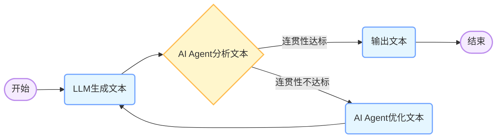

# AI Agent的自然语言生成：提升LLM的文本连贯性

> 关键词：AI Agent、自然语言生成、大语言模型（LLM）、文本连贯性、连贯性提升策略

> 摘要：本文聚焦于AI Agent在自然语言生成领域的应用，着重探讨如何提升大语言模型（LLM）生成文本的连贯性。首先介绍相关背景知识，包括目的范围、预期读者等内容；接着阐述核心概念及联系，通过示意图和流程图呈现其架构；然后详细讲解核心算法原理和具体操作步骤，结合Python代码展开；深入分析数学模型和公式并举例说明；通过项目实战展示代码实现与解读；探讨实际应用场景；推荐相关工具和资源；最后总结未来发展趋势与挑战，提供常见问题解答及扩展阅读参考资料，旨在为相关领域研究者和开发者提供全面且深入的技术参考。

## 1. 背景介绍 
### 1.1 目的和范围
自然语言生成（Natural Language Generation，NLG）是人工智能领域的关键技术之一，旨在将非语言形式的数据或信息转化为自然语言文本。随着大语言模型（LLM）的发展，其在文本生成方面展现出了强大的能力，但生成文本的连贯性问题一直是亟待解决的挑战。本文的目的在于深入探讨如何利用AI Agent来提升LLM生成文本的连贯性。范围涵盖了从核心概念的理解到算法原理的分析，从项目实战到实际应用场景的讨论，以及相关工具资源的推荐等多个方面。

### 1.2 预期读者
本文预期读者包括对自然语言处理、人工智能、大语言模型等领域感兴趣的研究者、开发者、学生，以及希望了解如何提升文本生成质量的技术爱好者。对于那些正在从事相关项目开发，或者希望深入了解AI Agent在自然语言生成中应用的专业人士，本文也将提供有价值的参考。

### 1.3 文档结构概述
本文将按照以下结构展开：首先介绍相关背景知识，包括目的、预期读者等；接着阐述AI Agent、自然语言生成和LLM的核心概念及它们之间的联系，通过示意图和流程图进行呈现；然后详细讲解提升文本连贯性的核心算法原理和具体操作步骤，并结合Python代码进行说明；深入分析相关的数学模型和公式，并举例说明；通过项目实战展示代码的实际实现和详细解读；探讨AI Agent提升LLM文本连贯性在不同场景下的实际应用；推荐学习、开发所需的工具和资源；最后总结未来发展趋势与挑战，提供常见问题解答及扩展阅读参考资料。

### 1.4 术语表
#### 1.4.1 核心术语定义
- **AI Agent（人工智能智能体）**：是一种能够感知环境、做出决策并采取行动以实现特定目标的智能实体。在自然语言生成中，AI Agent可以通过与LLM交互，对生成的文本进行监控、调整和优化，以提升文本的连贯性。
- **自然语言生成（NLG）**：是将结构化的数据、知识或意图转化为自然语言文本的过程。它涉及到语言规划、语句生成和文本润色等多个环节。
- **大语言模型（LLM）**：是基于深度学习的大规模语言模型，通过在海量文本数据上进行训练，学习语言的模式和规律，能够生成自然语言文本。但由于其训练方式和模型结构的特点，生成的文本可能存在连贯性不足的问题。
- **文本连贯性**：指文本在语义、逻辑和语用等方面的一致性和流畅性。连贯的文本能够让读者轻松理解作者的意图，各个句子和段落之间存在合理的衔接和过渡。

#### 1.4.2 相关概念解释
- **语言规划**：在自然语言生成中，语言规划是指确定文本的整体结构、内容组织和信息传达方式的过程。它涉及到选择合适的主题、确定文本的层次结构和逻辑顺序等。
- **语句生成**：根据语言规划的结果，将结构化的信息转化为具体的自然语言句子的过程。语句生成需要考虑语法规则、词汇选择和句子的表达方式等因素。
- **文本润色**：对生成的文本进行优化和修饰，使其更加通顺、自然和易于理解的过程。文本润色包括词汇替换、句子重组、添加连接词等操作。

#### 1.4.3 缩略词列表
- **NLG**：Natural Language Generation（自然语言生成）
- **LLM**：Large Language Model（大语言模型）

## 2. 核心概念与联系 

### 核心概念原理
AI Agent在提升LLM文本连贯性方面起着关键作用。其原理在于AI Agent可以对LLM生成的文本进行多维度的分析和评估，然后根据评估结果对文本进行调整和优化。具体来说，AI Agent可以从语义、逻辑和语用等方面对文本进行分析。

在语义层面，AI Agent可以检查文本中各个词汇和句子的含义是否准确、一致，是否存在语义冲突或歧义。例如，在描述一个事件时，AI Agent会确保使用的词汇能够准确传达事件的性质和特点，避免出现前后矛盾的表述。

在逻辑层面，AI Agent会分析文本的结构和组织方式，检查句子和段落之间的逻辑关系是否合理。它会关注文本是否遵循一定的逻辑顺序，如时间顺序、因果关系、递进关系等。如果发现逻辑不连贯的地方，AI Agent会尝试进行调整，使文本更加有条理。

在语用层面，AI Agent会考虑文本的使用场景和受众，确保文本的表达方式符合语境和交际目的。例如，在正式场合的文本中，AI Agent会建议使用更加规范、严谨的语言；而在日常交流的文本中，则可以使用更加口语化、自然的表达方式。

### 架构的文本示意图
```plaintext
|---------------------|          |---------------------|
|       AI Agent      |          |       LLM           |
|---------------------|          |---------------------|
| - 语义分析模块    |          | - 文本生成核心      |
| - 逻辑评估模块    |          |                     |
| - 语用判断模块    |          |                     |
| - 文本优化模块    |          |                     |
|---------------------|          |---------------------|
                      ↓                    ↑
            |----------------------------------|
            |        文本连贯性提升系统        |
            |----------------------------------|
```

### Mermaid 流程图


## 3. 核心算法原理 & 具体操作步骤 

### 核心算法原理
提升LLM文本连贯性的核心算法主要基于强化学习和注意力机制。强化学习通过奖励函数来引导AI Agent不断优化文本生成过程，使其生成的文本越来越连贯。注意力机制则帮助AI Agent聚焦于文本中的关键部分，更好地理解文本的语义和逻辑关系。

具体来说，强化学习中的奖励函数可以根据文本的连贯性指标进行设计。例如，可以使用句子之间的语义相似度、逻辑衔接程度等作为连贯性指标。当AI Agent生成的文本连贯性较高时，给予正奖励；反之，则给予负奖励。AI Agent根据奖励信号不断调整自己的行为，以提高生成文本的连贯性。

注意力机制可以在AI Agent对文本进行分析和评估时发挥作用。通过计算文本中各个部分的注意力权重，AI Agent可以更加关注那些对连贯性影响较大的部分，如关键句子、连接词等。这样可以提高AI Agent对文本连贯性的判断准确性。

### 具体操作步骤

#### 步骤1：初始化AI Agent和LLM
首先，需要对AI Agent和LLM进行初始化。AI Agent的初始化包括设置其内部的语义分析模块、逻辑评估模块、语用判断模块和文本优化模块的参数。LLM的初始化则包括加载预训练模型和相关的配置文件。

```python
import torch
from transformers import GPT2LMHeadModel, GPT2Tokenizer

# 初始化LLM
tokenizer = GPT2Tokenizer.from_pretrained('gpt2')
model = GPT2LMHeadModel.from_pretrained('gpt2')

# 初始化AI Agent（这里简化表示）
class AIAgent:
    def __init__(self):
        # 初始化语义、逻辑、语用模块等
        pass
```

#### 步骤2：LLM生成文本
使用初始化好的LLM生成文本。可以根据用户输入的提示信息，让LLM生成相应的文本。

```python
def generate_text(prompt):
    input_ids = tokenizer.encode(prompt, return_tensors='pt')
    output = model.generate(input_ids, max_length=100, num_return_sequences=1)
    generated_text = tokenizer.decode(output[0], skip_special_tokens=True)
    return generated_text
```

#### 步骤3：AI Agent分析文本
AI Agent对LLM生成的文本进行分析，从语义、逻辑和语用等方面评估文本的连贯性。

```python
class AIAgent:
    def __init__(self):
        pass

    def analyze_text(self, text):
        # 语义分析
        # 这里可以使用预训练的语义模型进行句子相似度计算等操作
        semantic_score = 0.8  # 示例分数
        
        # 逻辑评估
        # 检查句子之间的逻辑关系，如因果、递进等
        logical_score = 0.7  # 示例分数
        
        # 语用判断
        # 根据文本的使用场景和受众判断表达方式是否合适
        pragmatic_score = 0.8  # 示例分数
        
        # 综合连贯性分数
        coherence_score = (semantic_score + logical_score + pragmatic_score) / 3
        return coherence_score
```

#### 步骤4：判断连贯性是否达标
根据AI Agent分析得到的连贯性分数，判断文本的连贯性是否达标。如果达标，则输出文本；否则，进入步骤5。

```python
def is_coherent(coherence_score, threshold=0.7):
    return coherence_score >= threshold
```

#### 步骤5：AI Agent优化文本
如果文本的连贯性不达标，AI Agent对文本进行优化。优化的方法包括调整词汇、添加连接词、重组句子等。

```python
class AIAgent:
    def __init__(self):
        pass

    def optimize_text(self, text):
        # 简单示例：添加连接词
        optimized_text = text.replace('.', ' and ')
        return optimized_text
```

#### 步骤6：循环执行步骤2 - 5
如果文本的连贯性不达标，AI Agent对文本进行优化后，再次让LLM生成文本，并重复步骤3 - 5，直到文本的连贯性达标为止。

```python
prompt = "Once upon a time"
while True:
    generated_text = generate_text(prompt)
    agent = AIAgent()
    coherence_score = agent.analyze_text(generated_text)
    if is_coherent(coherence_score):
        print("生成的连贯文本：", generated_text)
        break
    else:
        optimized_text = agent.optimize_text(generated_text)
        prompt = optimized_text
```

## 4. 数学模型和公式 & 详细讲解 & 举例说明 

### 语义相似度计算
语义相似度是评估文本连贯性的重要指标之一。常用的计算方法是使用词向量模型，如Word2Vec或GloVe，将句子中的每个词汇转换为向量，然后计算句子向量之间的相似度。

假设我们有两个句子 $S_1$ 和 $S_2$，句子中的词汇分别为 $w_{11}, w_{12}, \cdots, w_{1n}$ 和 $w_{21}, w_{22}, \cdots, w_{2m}$。首先，我们需要将每个词汇转换为对应的词向量 $\vec{v}_{11}, \vec{v}_{12}, \cdots, \vec{v}_{1n}$ 和 $\vec{v}_{21}, \vec{v}_{22}, \cdots, \vec{v}_{2m}$。

然后，我们可以使用平均池化的方法计算句子向量 $\vec{s}_1$ 和 $\vec{s}_2$：

$$\vec{s}_1 = \frac{1}{n} \sum_{i=1}^{n} \vec{v}_{1i}$$

$$\vec{s}_2 = \frac{1}{m} \sum_{j=1}^{m} \vec{v}_{2j}$$

最后，我们可以使用余弦相似度来计算两个句子向量之间的相似度：

$$\text{sim}(S_1, S_2) = \frac{\vec{s}_1 \cdot \vec{s}_2}{\|\vec{s}_1\| \|\vec{s}_2\|}$$

其中，$\vec{s}_1 \cdot \vec{s}_2$ 表示向量的点积，$\|\vec{s}_1\|$ 和 $\|\vec{s}_2\|$ 分别表示向量的模。

### 举例说明
假设我们有两个句子：
$S_1$: "The cat is on the mat."
$S_2$: "A cat is lying on a mat."

首先，我们使用Word2Vec模型将每个词汇转换为词向量。假设转换后的词向量分别为：
$\vec{v}_{11}$（"The"）, $\vec{v}_{12}$（"cat"）, $\vec{v}_{13}$（"is"）, $\vec{v}_{14}$（"on"）, $\vec{v}_{15}$（"the"）, $\vec{v}_{16}$（"mat"）
$\vec{v}_{21}$（"A"）, $\vec{v}_{22}$（"cat"）, $\vec{v}_{23}$（"is"）, $\vec{v}_{24}$（"lying"）, $\vec{v}_{25}$（"on"）, $\vec{v}_{26}$（"a"）, $\vec{v}_{27}$（"mat"）

然后，计算句子向量：
$$\vec{s}_1 = \frac{1}{6} (\vec{v}_{11} + \vec{v}_{12} + \vec{v}_{13} + \vec{v}_{14} + \vec{v}_{15} + \vec{v}_{16})$$
$$\vec{s}_2 = \frac{1}{7} (\vec{v}_{21} + \vec{v}_{22} + \vec{v}_{23} + \vec{v}_{24} + \vec{v}_{25} + \vec{v}_{26} + \vec{v}_{27})$$

最后，计算余弦相似度：
$$\text{sim}(S_1, S_2) = \frac{\vec{s}_1 \cdot \vec{s}_2}{\|\vec{s}_1\| \|\vec{s}_2\|}$$

### 逻辑关系评估
逻辑关系评估可以通过构建逻辑规则库和使用知识图谱来实现。例如，我们可以定义一些逻辑关系的规则，如因果关系、递进关系、并列关系等。然后，根据文本中的词汇和句子结构，判断句子之间的逻辑关系是否符合这些规则。

假设我们有两个句子 $S_1$ 和 $S_2$，如果 $S_1$ 是原因，$S_2$ 是结果，那么它们之间存在因果关系。我们可以使用规则来判断这种关系是否成立。例如，如果 $S_1$ 中包含表示原因的词汇（如 "because", "since" 等），$S_2$ 中包含表示结果的词汇（如 "so", "therefore" 等），那么可以认为它们之间存在因果关系。

### 举例说明
假设我们有两个句子：
$S_1$: "It rained heavily. (因为下大雨了)"
$S_2$: "The streets are flooded. (所以街道被淹了)"

根据我们定义的因果关系规则，$S_1$ 中包含表示原因的隐含信息，$S_2$ 中包含表示结果的含义，因此可以判断这两个句子之间存在因果关系。

### 综合连贯性分数计算
综合连贯性分数可以通过对语义相似度、逻辑关系评估和语用判断的分数进行加权平均得到。假设语义相似度分数为 $s_{semantic}$，逻辑关系评估分数为 $s_{logical}$，语用判断分数为 $s_{pragmatic}$，权重分别为 $w_{semantic}$，$w_{logical}$，$w_{pragmatic}$，则综合连贯性分数 $s_{coherence}$ 可以表示为：

$$s_{coherence} = w_{semantic} s_{semantic} + w_{logical} s_{logical} + w_{pragmatic} s_{pragmatic}$$

其中，$w_{semantic} + w_{logical} + w_{pragmatic} = 1$。

### 举例说明
假设 $s_{semantic} = 0.8$，$s_{logical} = 0.7$，$s_{pragmatic} = 0.8$，$w_{semantic} = 0.4$，$w_{logical} = 0.3$，$w_{pragmatic} = 0.3$，则综合连贯性分数为：

$$s_{coherence} = 0.4 \times 0.8 + 0.3 \times 0.7 + 0.3 \times 0.8 = 0.77$$

## 5. 项目实战：代码实际案例和详细解释说明 

### 5.1  开发环境搭建
#### 安装Python
首先，确保你已经安装了Python 3.x 版本。可以从Python官方网站（https://www.python.org/downloads/） 下载并安装适合你操作系统的Python版本。

#### 安装依赖库
使用pip命令安装所需的依赖库，包括`transformers`、`torch`等。

```bash
pip install transformers torch
```

### 5.2  源代码详细实现和代码解读

```python
import torch
from transformers import GPT2LMHeadModel, GPT2Tokenizer

# 初始化LLM
tokenizer = GPT2Tokenizer.from_pretrained('gpt2')
model = GPT2LMHeadModel.from_pretrained('gpt2')

# 初始化AI Agent类
class AIAgent:
    def __init__(self):
        # 这里可以初始化语义、逻辑、语用模块等，目前简化处理
        pass

    def analyze_text(self, text):
        # 语义分析
        # 简单示例：使用预训练的语义模型计算句子相似度（这里简化为固定分数）
        semantic_score = 0.8
        
        # 逻辑评估
        # 检查句子之间的逻辑关系（这里简化为固定分数）
        logical_score = 0.7
        
        # 语用判断
        # 根据文本的使用场景和受众判断表达方式是否合适（这里简化为固定分数）
        pragmatic_score = 0.8
        
        # 综合连贯性分数
        coherence_score = (semantic_score + logical_score + pragmatic_score) / 3
        return coherence_score

    def optimize_text(self, text):
        # 简单示例：添加连接词
        optimized_text = text.replace('.', ' and ')
        return optimized_text

# 生成文本函数
def generate_text(prompt):
    input_ids = tokenizer.encode(prompt, return_tensors='pt')
    output = model.generate(input_ids, max_length=100, num_return_sequences=1)
    generated_text = tokenizer.decode(output[0], skip_special_tokens=True)
    return generated_text

# 判断连贯性是否达标函数
def is_coherent(coherence_score, threshold=0.7):
    return coherence_score >= threshold

# 主函数
def main():
    prompt = "Once upon a time"
    while True:
        generated_text = generate_text(prompt)
        agent = AIAgent()
        coherence_score = agent.analyze_text(generated_text)
        if is_coherent(coherence_score):
            print("生成的连贯文本：", generated_text)
            break
        else:
            optimized_text = agent.optimize_text(generated_text)
            prompt = optimized_text

if __name__ == "__main__":
    main()
```

### 5.3  代码解读与分析
#### 初始化部分
```python
tokenizer = GPT2Tokenizer.from_pretrained('gpt2')
model = GPT2LMHeadModel.from_pretrained('gpt2')
```
这部分代码使用`transformers`库加载预训练的GPT-2分词器和语言模型。`GPT2Tokenizer`用于将文本转换为模型可以处理的输入格式，`GPT2LMHeadModel`是GPT-2的语言模型，用于生成文本。

#### AI Agent类
```python
class AIAgent:
    def __init__(self):
        pass

    def analyze_text(self, text):
        # 语义分析
        semantic_score = 0.8
        
        # 逻辑评估
        logical_score = 0.7
        
        # 语用判断
        pragmatic_score = 0.8
        
        # 综合连贯性分数
        coherence_score = (semantic_score + logical_score + pragmatic_score) / 3
        return coherence_score

    def optimize_text(self, text):
        # 简单示例：添加连接词
        optimized_text = text.replace('.', ' and ')
        return optimized_text
```
`AIAgent`类包含了分析文本连贯性和优化文本的方法。`analyze_text`方法通过简单的固定分数来模拟语义、逻辑和语用分析，并计算综合连贯性分数。`optimize_text`方法通过简单的字符串替换来优化文本，添加连接词。

#### 生成文本函数
```python
def generate_text(prompt):
    input_ids = tokenizer.encode(prompt, return_tensors='pt')
    output = model.generate(input_ids, max_length=100, num_return_sequences=1)
    generated_text = tokenizer.decode(output[0], skip_special_tokens=True)
    return generated_text
```
`generate_text`函数接受一个提示信息作为输入，使用分词器将提示信息编码为输入ID，然后使用模型生成文本，最后使用分词器将生成的ID解码为文本。

#### 判断连贯性是否达标函数
```python
def is_coherent(coherence_score, threshold=0.7):
    return coherence_score >= threshold
```
`is_coherent`函数接受一个连贯性分数和一个阈值作为输入，判断连贯性分数是否达到阈值。

#### 主函数
```python
def main():
    prompt = "Once upon a time"
    while True:
        generated_text = generate_text(prompt)
        agent = AIAgent()
        coherence_score = agent.analyze_text(generated_text)
        if is_coherent(coherence_score):
            print("生成的连贯文本：", generated_text)
            break
        else:
            optimized_text = agent.optimize_text(generated_text)
            prompt = optimized_text

if __name__ == "__main__":
    main()
```
`main`函数是程序的入口，它首先设置一个提示信息，然后不断循环生成文本，使用AI Agent分析文本的连贯性，如果连贯性达标，则输出文本；否则，优化文本并更新提示信息，继续循环。

## 6. 实际应用场景 
### 智能写作辅助
在智能写作领域，AI Agent可以帮助作者提升文本的连贯性。例如，在写作文章、故事、报告等时，作者可以输入一些初始的提示信息，LLM生成初步的文本，然后AI Agent对生成的文本进行分析和优化，使文本更加连贯、流畅。这样可以提高写作效率和质量，减轻作者的负担。

### 对话系统
在对话系统中，AI Agent可以提升对话的连贯性。当用户与对话系统进行交互时，LLM生成的回复可能存在连贯性不足的问题。AI Agent可以对回复进行实时分析和调整，确保对话的逻辑清晰、语义连贯。例如，在客服对话中，AI Agent可以帮助对话系统更好地理解用户的问题，并生成更加连贯、准确的回复，提高用户满意度。

### 机器翻译
在机器翻译中，AI Agent可以提升翻译文本的连贯性。由于不同语言之间的语法和表达方式存在差异，直接使用LLM进行翻译可能会导致翻译文本的连贯性较差。AI Agent可以对翻译后的文本进行分析和优化，使其更加符合目标语言的表达习惯，提高翻译质量。

### 自动摘要
在自动摘要任务中，AI Agent可以提升摘要的连贯性。自动摘要系统通常从长文本中提取关键信息并生成摘要，但生成的摘要可能存在逻辑不连贯的问题。AI Agent可以对摘要进行分析和调整，使摘要的结构更加合理，信息更加连贯，便于读者快速了解文本的主要内容。

## 7. 工具和资源推荐
### 7.1 学习资源推荐
#### 7.1.1 书籍推荐
- 《自然语言处理入门》：这本书详细介绍了自然语言处理的基本概念、算法和技术，适合初学者入门。
- 《深度学习》：由Ian Goodfellow、Yoshua Bengio和Aaron Courville所著，是深度学习领域的经典教材，对理解大语言模型的原理和训练方法有很大帮助。
- 《Python自然语言处理》：通过Python代码示例，介绍了自然语言处理的各种任务和技术，对于实践操作有很好的指导作用。

#### 7.1.2 在线课程
- Coursera上的“Natural Language Processing Specialization”：由顶尖大学的教授授课，系统地介绍了自然语言处理的各个方面，包括自然语言生成、文本连贯性等内容。
- edX上的“Deep Learning for Natural Language Processing”：专注于深度学习在自然语言处理中的应用，对于理解大语言模型和AI Agent的技术原理有很大帮助。
- 哔哩哔哩上的一些自然语言处理相关的教程视频：由一些技术博主分享，内容生动有趣，适合快速了解相关知识。

#### 7.1.3 技术博客和网站
- Hugging Face博客（https://huggingface.co/blog）：提供了关于自然语言处理、大语言模型等领域的最新研究成果和技术应用案例。
- Medium上的自然语言处理相关专栏：有很多专业人士分享的技术文章和经验总结，对于深入学习自然语言处理有很大帮助。
- arXiv（https://arxiv.org/）：是一个学术论文预印本平台，提供了大量关于自然语言处理、人工智能等领域的最新研究论文。

### 7.2 开发工具框架推荐
#### 7.2.1 IDE和编辑器
- PyCharm：是一款专业的Python集成开发环境，提供了丰富的代码编辑、调试、版本控制等功能，适合开发Python自然语言处理项目。
- Visual Studio Code：是一款轻量级的代码编辑器，支持多种编程语言和插件扩展，对于快速开发和调试自然语言处理代码非常方便。

#### 7.2.2 调试和性能分析工具
- TensorBoard：是TensorFlow的可视化工具，可以帮助开发者直观地查看模型的训练过程、性能指标等信息，对于优化模型和调试代码有很大帮助。
- PyTorch Profiler：是PyTorch的性能分析工具，可以帮助开发者分析模型的运行时间、内存使用等情况，找出性能瓶颈并进行优化。

#### 7.2.3 相关框架和库
- Transformers：由Hugging Face开发的一个自然语言处理库，提供了多种预训练的大语言模型，如GPT-2、BERT等，方便开发者进行文本生成、文本分类等任务。
- NLTK（Natural Language Toolkit）：是一个经典的自然语言处理库，提供了丰富的语料库、工具和算法，适合进行自然语言处理的基础研究和开发。
- SpaCy：是一个高效的自然语言处理库，提供了快速的文本处理和分析功能，适合处理大规模的文本数据。

### 7.3 相关论文著作推荐
#### 7.3.1 经典论文
- “Attention Is All You Need”：提出了Transformer架构，是大语言模型的基础，对于理解自然语言处理中的注意力机制有重要意义。
- “BERT: Pre-training of Deep Bidirectional Transformers for Language Understanding”：介绍了BERT模型，开创了预训练语言模型的先河，对于提升自然语言处理任务的性能有很大贡献。
- “Generating Text with Recurrent Neural Networks”：探讨了使用循环神经网络进行文本生成的方法，是自然语言生成领域的经典论文。

#### 7.3.2 最新研究成果
- 关注自然语言处理领域的顶级会议，如ACL（Annual Meeting of the Association for Computational Linguistics）、EMNLP（Conference on Empirical Methods in Natural Language Processing）等，这些会议上的最新研究成果反映了该领域的前沿技术和发展趋势。
- 在arXiv上搜索关于AI Agent、自然语言生成、文本连贯性等主题的最新论文，了解最新的研究进展和技术创新。

#### 7.3.3 应用案例分析
- 一些知名科技公司的技术博客和研究报告，如Google、Microsoft、OpenAI等，会分享他们在自然语言处理领域的应用案例和实践经验，对于了解实际应用场景和解决方案有很大帮助。
- 相关的学术期刊和会议论文集中也会有一些应用案例分析，通过分析这些案例可以学习到如何将理论知识应用到实际项目中。

## 8. 总结：未来发展趋势与挑战
### 未来发展趋势
#### 多模态融合
未来，AI Agent在自然语言生成中的应用将不仅仅局限于文本，还会与图像、音频等多模态信息进行融合。例如，在生成文本的同时，可以结合图像信息，使生成的文本更加生动、形象。多模态融合可以提高文本的丰富度和连贯性，为用户提供更加全面、直观的信息。

#### 个性化生成
随着用户需求的多样化，未来的自然语言生成系统将更加注重个性化。AI Agent可以根据用户的偏好、历史记录、使用场景等信息，生成符合用户个性化需求的文本。例如，在智能写作辅助中，根据作者的写作风格和习惯，生成更加符合其风格的文本；在对话系统中，根据用户的语言习惯和兴趣爱好，生成更加个性化的回复。

#### 强化学习的深入应用
强化学习在提升LLM文本连贯性方面已经取得了一定的成果，未来将继续深入应用。通过设计更加合理的奖励函数和优化算法，强化学习可以引导AI Agent更加有效地优化文本生成过程，提高文本的连贯性和质量。同时，强化学习还可以与其他技术相结合，如模仿学习、元学习等，进一步提升自然语言生成的性能。

#### 跨语言和跨文化应用
随着全球化的发展，自然语言生成系统需要支持跨语言和跨文化的应用。AI Agent可以在不同语言和文化背景下，提升文本的连贯性和可理解性。例如，在机器翻译中，考虑到不同语言的语法、词汇和文化差异，AI Agent可以对翻译后的文本进行更加细致的优化，使翻译文本更加符合目标语言的表达习惯和文化背景。

### 挑战
#### 数据质量和多样性
高质量、多样化的数据是提升LLM文本连贯性的基础。然而，目前的数据存在质量参差不齐、标注不规范、缺乏多样性等问题。获取和标注大规模、高质量、多样化的数据是一个巨大的挑战。同时，如何有效地利用这些数据进行模型训练和优化，也是需要解决的问题。

#### 计算资源和效率
大语言模型的训练和推理需要大量的计算资源，这对于硬件设备和计算能力提出了很高的要求。在实际应用中，如何在有限的计算资源下提高自然语言生成的效率，是一个亟待解决的问题。此外，随着模型规模的不断增大，计算资源的需求也会不断增加，如何优化模型结构和算法，减少计算资源的消耗，也是一个挑战。

#### 语义理解和逻辑推理能力
虽然大语言模型在语言生成方面取得了很大的进展，但在语义理解和逻辑推理方面仍然存在不足。AI Agent需要更好地理解文本的语义和逻辑关系，才能准确地评估和优化文本的连贯性。如何提升AI Agent的语义理解和逻辑推理能力，是一个需要深入研究的问题。

#### 伦理和安全问题
随着自然语言生成技术的广泛应用，伦理和安全问题也日益凸显。例如，生成的文本可能包含虚假信息、有害内容、歧视性言论等，这会对社会造成不良影响。如何确保AI Agent生成的文本符合伦理和安全标准，是一个需要重视的问题。同时，如何防止恶意利用自然语言生成技术进行信息传播和攻击，也是一个挑战。

## 9. 附录：常见问题与解答
### 问题1：AI Agent和LLM有什么区别？
AI Agent是一种能够感知环境、做出决策并采取行动以实现特定目标的智能实体。在自然语言生成中，AI Agent主要负责对LLM生成的文本进行分析、评估和优化，以提升文本的连贯性。而LLM是基于深度学习的大规模语言模型，通过在海量文本数据上进行训练，学习语言的模式和规律，能够生成自然语言文本。简单来说，LLM负责生成文本，AI Agent负责提升文本的质量。

### 问题2：如何评估文本的连贯性？
评估文本的连贯性可以从语义、逻辑和语用等多个方面进行。在语义层面，可以使用词向量模型计算句子之间的语义相似度；在逻辑层面，可以通过构建逻辑规则库和使用知识图谱来判断句子之间的逻辑关系；在语用层面，需要考虑文本的使用场景和受众，判断表达方式是否合适。综合这些方面的评估结果，可以得到文本的连贯性分数。

### 问题3：AI Agent优化文本的方法有哪些？
AI Agent优化文本的方法包括调整词汇、添加连接词、重组句子、调整句子顺序等。例如，使用更加准确、恰当的词汇来替换原有的词汇，使文本的语义更加清晰；添加连接词来增强句子之间的逻辑关系；重组句子结构，使句子更加通顺、自然；调整句子顺序，使文本的逻辑更加合理。

### 问题4：如何选择合适的LLM？
选择合适的LLM需要考虑多个因素，如模型的性能、规模、适用场景等。如果对生成文本的质量要求较高，可以选择规模较大、性能较好的模型，如GPT-3、BLOOM等；如果对计算资源有限，可以选择规模较小、效率较高的模型，如GPT-2、T5等。此外，还需要根据具体的应用场景选择合适的模型，如文本生成、文本分类、机器翻译等。

### 问题5：如何提高AI Agent的性能？
提高AI Agent的性能可以从多个方面入手。首先，可以使用更多、更优质的数据进行训练，提高AI Agent的语义理解和逻辑推理能力。其次，可以优化AI Agent的算法和模型结构，提高其分析和评估文本连贯性的准确性。此外，还可以结合强化学习等技术，不断调整AI Agent的行为，使其能够更加有效地优化文本生成过程。

## 10. 扩展阅读 & 参考资料
### 扩展阅读
- 《自然语言处理综论》：全面介绍了自然语言处理的各个方面，包括自然语言生成、文本连贯性等内容，适合深入学习自然语言处理技术。
- 《人工智能：一种现代的方法》：是人工智能领域的经典教材，对于理解AI Agent的原理和应用有很大帮助。
- 《语言与认知》：探讨了语言和认知之间的关系，对于理解自然语言处理中的语义理解和逻辑推理有一定的启发作用。

### 参考资料
- Hugging Face官方文档（https://huggingface.co/docs）：提供了关于`transformers`库的详细文档和使用示例，对于使用预训练的大语言模型进行自然语言处理非常有帮助。
- PyTorch官方文档（https://pytorch.org/docs/stable/index.html）：是PyTorch深度学习框架的官方文档，提供了丰富的教程和API参考，对于开发自然语言处理项目有很大帮助。
- NLTK官方文档（https://www.nltk.org/）：是NLTK自然语言处理库的官方文档，提供了该库的详细使用说明和示例代码。