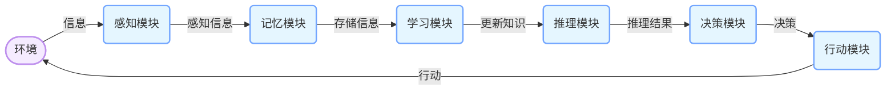

# AI Agent的认知架构：模拟人类思维过程

> 关键词：AI Agent、认知架构、人类思维过程、模拟、人工智能

> 摘要：本文深入探讨了AI Agent的认知架构，旨在模拟人类思维过程。首先介绍了相关背景，包括目的范围、预期读者等内容。接着阐述了AI Agent认知架构的核心概念与联系，通过文本示意图和Mermaid流程图进行清晰展示。详细讲解了核心算法原理及具体操作步骤，用Python代码进行说明。同时给出了数学模型和公式并举例解释。通过项目实战，展示了代码实际案例并进行详细解读。探讨了AI Agent认知架构的实际应用场景，推荐了相关学习资源、开发工具框架以及论文著作。最后总结了未来发展趋势与挑战，提供了常见问题解答和扩展阅读参考资料，帮助读者全面理解AI Agent认知架构模拟人类思维过程的原理、实现和应用。

## 1. 背景介绍 
### 1.1 目的和范围
随着人工智能技术的飞速发展，让AI Agent能够像人类一样思考和行动成为了研究的重要方向。本文章的目的在于深入探讨AI Agent的认知架构，详细分析如何模拟人类的思维过程。范围涵盖了从AI Agent认知架构的基本概念、核心算法原理、数学模型，到实际的项目实战、应用场景，以及相关的学习资源和未来发展趋势等多个方面，旨在为读者提供一个全面而深入的关于AI Agent认知架构模拟人类思维过程的知识体系。

### 1.2 预期读者
本文预期读者包括人工智能领域的研究人员、开发者、学生，以及对AI Agent和人类思维模拟感兴趣的技术爱好者。对于专业研究人员，可以作为深入研究AI Agent认知架构的参考资料；对于开发者，有助于其在实际项目中更好地应用相关技术；对于学生，能帮助他们建立起对该领域的系统认知；对于技术爱好者，则能满足他们对前沿技术的探索需求。

### 1.3 文档结构概述
本文按照以下结构进行组织：首先介绍背景信息，包括目的、预期读者等；接着阐述AI Agent认知架构的核心概念与联系，通过直观的示意图和流程图进行展示；然后详细讲解核心算法原理和具体操作步骤，并用Python代码实现；随后给出数学模型和公式，并举例说明；再通过项目实战展示代码实际案例并进行解读；接着探讨实际应用场景；之后推荐相关的工具和资源；最后总结未来发展趋势与挑战，提供常见问题解答和扩展阅读参考资料。

### 1.4 术语表
#### 1.4.1 核心术语定义
- **AI Agent（人工智能智能体）**：是一种能够感知环境、根据感知信息进行决策并采取行动的人工智能实体。它可以是软件程序、机器人等多种形式。
- **认知架构**：指的是AI Agent内部的组织结构和运行机制，用于模拟人类的认知过程，包括感知、学习、推理、决策等。
- **人类思维过程**：人类在认识世界、解决问题等活动中所经历的一系列心理和认知活动，如感知信息、存储记忆、进行推理、做出判断和决策等。

#### 1.4.2 相关概念解释
- **感知**：AI Agent通过各种传感器或输入接口获取环境信息的过程，类似于人类通过视觉、听觉、触觉等感官获取外界信息。
- **学习**：AI Agent根据获取的信息，不断调整自身的知识和行为模式的过程，就像人类通过学习新知识和经验来提升自己的能力。
- **推理**：基于已有的知识和信息，AI Agent进行逻辑推导和判断的过程，类似于人类的逻辑思维。
- **决策**：AI Agent根据推理结果，选择合适的行动方案的过程，如同人类在面临选择时做出决策。

#### 1.4.3 缩略词列表
- **AI**：Artificial Intelligence（人工智能）
- **ML**：Machine Learning（机器学习）
- **DL**：Deep Learning（深度学习）

## 2. 核心概念与联系 
AI Agent的认知架构旨在模拟人类的思维过程，其核心概念包括感知、记忆、学习、推理和决策等，这些概念之间相互关联、相互作用，共同构成了一个复杂的认知系统。

### 文本示意图
AI Agent的认知架构可以看作是一个多层次的系统，底层是感知模块，负责获取环境信息；中间层是记忆模块，用于存储和管理信息；学习模块基于感知和记忆的信息进行知识的获取和更新；推理模块利用已有的知识进行逻辑推导；决策模块根据推理结果做出行动决策。最上层是行动模块，将决策转化为实际的行动反馈到环境中，环境的变化又会被感知模块再次获取，形成一个闭环的认知过程。

### Mermaid流程图

在这个流程图中，环境向AI Agent的感知模块提供信息，感知模块将信息传递给记忆模块进行存储。学习模块根据记忆中的信息更新知识，推理模块利用这些知识进行推理，决策模块根据推理结果做出决策，行动模块将决策转化为实际行动反馈给环境，形成一个不断循环和优化的认知过程。

## 3. 核心算法原理 & 具体操作步骤 
### 核心算法原理
AI Agent的认知架构中涉及到多种核心算法，这里以基于强化学习的决策算法为例进行讲解。强化学习是一种通过智能体与环境进行交互，根据环境反馈的奖励信号来学习最优行为策略的算法。其基本思想是智能体在环境中采取行动，环境会返回一个奖励值，智能体的目标是通过不断尝试和学习，找到能够最大化累积奖励的行动策略。

### 具体操作步骤
以下是基于Python实现的一个简单的强化学习示例，使用OpenAI Gym库中的CartPole环境。

```python
import gym
import numpy as np

# 初始化环境
env = gym.make('CartPole-v1')

# 定义超参数
learning_rate = 0.1
discount_factor = 0.99
epsilon = 1.0
epsilon_decay = 0.995
epsilon_min = 0.01
episodes = 1000

# 初始化Q表
state_size = env.observation_space.shape[0]
action_size = env.action_space.n
q_table = np.zeros((state_size, action_size))

# 训练循环
for episode in range(episodes):
    state = env.reset()
    state = np.reshape(state, [1, state_size])
    total_reward = 0
    done = False

    while not done:
        # 选择动作
        if np.random.uniform(0, 1) < epsilon:
            action = env.action_space.sample()
        else:
            action = np.argmax(q_table[state])

        # 执行动作
        next_state, reward, done, _ = env.step(action)
        next_state = np.reshape(next_state, [1, state_size])

        # 更新Q表
        target = reward + discount_factor * np.max(q_table[next_state])
        q_table[state, action] = (1 - learning_rate) * q_table[state, action] + learning_rate * target

        state = next_state
        total_reward += reward

    # 衰减epsilon
    if epsilon > epsilon_min:
        epsilon *= epsilon_decay

    print(f"Episode: {episode}, Total Reward: {total_reward}")

# 关闭环境
env.close()
```
### 代码解释
1. **环境初始化**：使用`gym.make('CartPole-v1')`初始化OpenAI Gym的CartPole环境。
2. **超参数定义**：定义学习率`learning_rate`、折扣因子`discount_factor`、探索率`epsilon`等超参数。
3. **Q表初始化**：根据环境的状态空间和动作空间大小初始化Q表。
4. **训练循环**：在每个回合中，智能体与环境进行交互，根据探索率选择动作，执行动作后更新Q表，直到回合结束。
5. **epsilon衰减**：随着训练的进行，逐渐减小探索率，让智能体更多地利用已学习到的知识。

## 4. 数学模型和公式 & 详细讲解 & 举例说明 
### 数学模型
在强化学习中，最常用的数学模型是马尔可夫决策过程（MDP）。一个MDP可以用一个五元组 $(S, A, P, R, \gamma)$ 表示，其中：
- $S$ 是状态空间，表示智能体可能处于的所有状态的集合。
- $A$ 是动作空间，表示智能体可以采取的所有动作的集合。
- $P$ 是状态转移概率函数，$P(s'|s, a)$ 表示在状态 $s$ 下采取动作 $a$ 后转移到状态 $s'$ 的概率。
- $R$ 是奖励函数，$R(s, a, s')$ 表示在状态 $s$ 下采取动作 $a$ 转移到状态 $s'$ 时获得的奖励。
- $\gamma$ 是折扣因子，用于权衡当前奖励和未来奖励的重要性，取值范围为 $[0, 1]$。

### 公式
Q学习算法是一种基于MDP的无模型强化学习算法，其核心公式是Q值更新公式：
$$Q(s, a) \leftarrow (1 - \alpha)Q(s, a) + \alpha [r + \gamma \max_{a'} Q(s', a')]$$
其中：
- $Q(s, a)$ 表示在状态 $s$ 下采取动作 $a$ 的Q值。
- $\alpha$ 是学习率，控制Q值更新的步长。
- $r$ 是执行动作 $a$ 后获得的即时奖励。
- $\gamma$ 是折扣因子。
- $s'$ 是执行动作 $a$ 后转移到的下一个状态。
- $\max_{a'} Q(s', a')$ 表示在下一个状态 $s'$ 下所有可能动作中最大的Q值。

### 详细讲解
Q学习算法的基本思想是通过不断地更新Q表来逼近最优Q值函数。在每个时间步，智能体根据当前的Q表选择动作，执行动作后获得奖励和下一个状态，然后根据Q值更新公式更新当前状态和动作的Q值。随着训练的进行，Q表会逐渐收敛到最优Q值函数，智能体就可以根据最优Q值函数选择最优动作。

### 举例说明
假设一个简单的网格世界环境，智能体在一个 $3 \times 3$ 的网格中移动，目标是到达右下角的格子。智能体有四个动作：上、下、左、右。状态是智能体当前所在的格子位置。奖励设置为：到达目标格子获得奖励10，其他格子获得奖励0。

初始时，Q表所有值都为0。智能体在某个状态下选择一个动作，例如在状态 $(1, 1)$ 选择向右的动作，移动到状态 $(1, 2)$，获得奖励0。根据Q值更新公式，更新 $Q((1, 1), \text{右})$ 的值。随着智能体不断地与环境交互，Q表中的值会不断更新，最终智能体能够找到从任意初始状态到目标状态的最优路径。

## 5. 项目实战：代码实际案例和详细解释说明 
### 5.1  开发环境搭建
#### 安装Python
首先需要安装Python，建议使用Python 3.7及以上版本。可以从Python官方网站（https://www.python.org/downloads/） 下载并安装。

#### 安装必要的库
在命令行中使用以下命令安装必要的库：
```sh
pip install gym numpy
```
`gym` 是OpenAI开发的用于开发和比较强化学习算法的工具包，`numpy` 是Python中用于科学计算的基础库。

### 5.2  源代码详细实现和代码解读
以下是一个完整的基于Q学习算法的智能体在FrozenLake环境中的实现代码：

```python
import gym
import numpy as np

# 初始化环境
env = gym.make('FrozenLake-v1', is_slippery=False)

# 定义超参数
learning_rate = 0.8
discount_factor = 0.95
episodes = 2000

# 初始化Q表
state_size = env.observation_space.n
action_size = env.action_space.n
q_table = np.zeros((state_size, action_size))

# 训练循环
for episode in range(episodes):
    state = env.reset()
    total_reward = 0
    done = False

    while not done:
        # 选择动作
        action = np.argmax(q_table[state, :] + np.random.randn(1, action_size) * (1. / (episode + 1)))

        # 执行动作
        next_state, reward, done, _ = env.step(action)

        # 更新Q表
        q_table[state, action] = q_table[state, action] + learning_rate * (
                reward + discount_factor * np.max(q_table[next_state, :]) - q_table[state, action])

        state = next_state
        total_reward += reward

    if episode % 100 == 0:
        print(f"Episode: {episode}, Total Reward: {total_reward}")

# 测试智能体
state = env.reset()
done = False
total_reward = 0

while not done:
    action = np.argmax(q_table[state, :])
    next_state, reward, done, _ = env.step(action)
    state = next_state
    total_reward += reward
    env.render()

print(f"Test Total Reward: {total_reward}")

# 关闭环境
env.close()
```
### 代码解读
1. **环境初始化**：使用`gym.make('FrozenLake-v1', is_slippery=False)`初始化FrozenLake环境，`is_slippery=False`表示环境没有滑动效果。
2. **超参数定义**：定义学习率`learning_rate`、折扣因子`discount_factor`和训练回合数`episodes`。
3. **Q表初始化**：根据环境的状态空间和动作空间大小初始化Q表。
4. **训练循环**：在每个回合中，智能体根据Q表和一定的探索策略选择动作，执行动作后更新Q表，直到回合结束。
5. **测试智能体**：训练完成后，使用训练好的Q表让智能体在环境中进行测试，输出测试的总奖励。

### 5.3  代码解读与分析
- **动作选择策略**：在训练过程中，使用了一种简单的探索策略，即`np.argmax(q_table[state, :] + np.random.randn(1, action_size) * (1. / (episode + 1)))`，随着训练回合数的增加，探索的随机性逐渐减小。
- **Q表更新**：根据Q学习的更新公式`q_table[state, action] = q_table[state, action] + learning_rate * (reward + discount_factor * np.max(q_table[next_state, :]) - q_table[state, action])`更新Q表。
- **测试阶段**：在测试阶段，智能体直接根据Q表选择最优动作，不再进行探索。

## 6. 实际应用场景 
### 游戏领域
AI Agent的认知架构在游戏领域有广泛的应用。例如，在策略游戏中，AI Agent可以模拟人类玩家的思维过程，进行资源管理、战略规划和决策制定。通过感知游戏环境中的各种信息，如地图信息、资源分布、敌方状态等，学习不同的策略和战术，推理出最优的行动方案，从而与人类玩家进行对抗或协作。在实时战斗游戏中，AI Agent可以根据对手的动作和状态，快速做出反应，进行攻击、防御和躲避等操作，提高游戏的趣味性和挑战性。

### 自动驾驶领域
在自动驾驶领域，AI Agent的认知架构起着关键作用。自动驾驶车辆需要感知周围的环境信息，如道路状况、交通标志、其他车辆和行人的位置和运动状态等。通过学习交通规则和驾驶经验，推理出合适的驾驶策略，如加速、减速、转弯、停车等。决策模块根据推理结果控制车辆的执行机构，实现自动驾驶。模拟人类的思维过程可以使自动驾驶车辆更加智能和安全地应对各种复杂的交通场景。

### 智能客服领域
智能客服系统利用AI Agent的认知架构来模拟人类客服的思维过程。智能客服可以感知用户的问题和需求，通过学习大量的知识和案例，推理出问题的答案和解决方案。决策模块根据推理结果选择合适的回答方式和话术，与用户进行交互。这样可以提高客服的效率和服务质量，为用户提供更好的体验。

### 医疗领域
在医疗领域，AI Agent的认知架构可以辅助医生进行诊断和治疗决策。AI Agent可以感知患者的症状、体征、检查结果等信息，学习医学知识和临床经验，推理出可能的疾病诊断和治疗方案。决策模块根据推理结果为医生提供参考建议，帮助医生做出更准确和科学的决策，提高医疗质量和效率。

## 7. 工具和资源推荐
### 7.1 学习资源推荐
#### 7.1.1 书籍推荐
- 《人工智能：一种现代的方法》：这是一本经典的人工智能教材，全面介绍了人工智能的各个领域，包括搜索算法、知识表示、推理、机器学习、自然语言处理等，对AI Agent的认知架构也有深入的讲解。
- 《强化学习：原理与Python实现》：详细介绍了强化学习的基本原理、算法和应用，通过Python代码实现了各种强化学习算法，适合想要深入学习强化学习的读者。
- 《深度学习》：由深度学习领域的三位权威专家撰写，系统地介绍了深度学习的理论和实践，包括神经网络、卷积神经网络、循环神经网络等，对于理解AI Agent中的深度学习部分有很大帮助。

#### 7.1.2 在线课程
- Coursera上的“人工智能基础”课程：由知名高校的教授授课，全面介绍了人工智能的基础知识和技术，包括AI Agent的相关内容。
- edX上的“强化学习”课程：深入讲解了强化学习的原理、算法和应用，通过实际案例和编程作业帮助学生掌握强化学习的实践技能。
- 吴恩达的“深度学习专项课程”：在深度学习领域具有很高的知名度，课程内容丰富，包括神经网络、深度学习优化算法、卷积神经网络等，对于提升深度学习能力有很大帮助。

#### 7.1.3 技术博客和网站
- Medium上的人工智能相关博客：有很多人工智能领域的专家和爱好者分享最新的研究成果、技术经验和实践案例，是获取前沿信息的重要渠道。
- OpenAI官方博客：OpenAI是人工智能领域的领先研究机构，其官方博客会发布最新的研究成果和技术进展，对于了解AI Agent的最新动态很有帮助。
- AI开源社区：如GitHub上的人工智能相关项目，有很多开源的AI Agent实现和相关代码，可以学习和参考。

### 7.2 开发工具框架推荐
#### 7.2.1 IDE和编辑器
- PyCharm：是一款专门为Python开发设计的集成开发环境，具有强大的代码编辑、调试、代码分析等功能，适合开发AI Agent相关的Python代码。
- Jupyter Notebook：是一个交互式的开发环境，支持多种编程语言，特别适合进行数据分析、机器学习和深度学习的实验和开发，可以方便地展示代码、运行结果和可视化图表。
- Visual Studio Code：是一款轻量级的代码编辑器，具有丰富的插件生态系统，可以通过安装各种插件来支持Python开发、代码调试、版本控制等功能。

#### 7.2.2 调试和性能分析工具
- PDB：Python自带的调试器，可以在代码中设置断点，逐步执行代码，查看变量的值和程序的执行流程，帮助调试代码中的错误。
- TensorBoard：是TensorFlow的可视化工具，可以对深度学习模型的训练过程进行可视化，包括损失函数、准确率、模型结构等，帮助分析模型的性能和优化训练过程。
- cProfile：Python的性能分析工具，可以统计代码中各个函数的执行时间和调用次数，帮助找出性能瓶颈，优化代码性能。

#### 7.2.3 相关框架和库
- TensorFlow：是一个开源的深度学习框架，提供了丰富的工具和函数，支持各种深度学习模型的构建、训练和部署，在AI Agent的开发中广泛应用。
- PyTorch：也是一个流行的深度学习框架，具有简洁的API和动态图机制，适合快速开发和实验深度学习模型，受到很多研究人员和开发者的喜爱。
- Gym：是OpenAI开发的用于开发和比较强化学习算法的工具包，提供了各种模拟环境和基准测试任务，方便进行强化学习算法的实验和验证。

### 7.3 相关论文著作推荐
#### 7.3.1 经典论文
- “Reinforcement Learning: A Survey”：这是一篇关于强化学习的经典综述论文，系统地介绍了强化学习的基本概念、算法和应用，是学习强化学习的重要参考资料。
- “Playing Atari with Deep Reinforcement Learning”：首次提出了深度强化学习的概念，通过深度神经网络来近似Q值函数，在Atari游戏中取得了很好的效果，开创了深度强化学习的先河。
- “Attention Is All You Need”：提出了Transformer架构，在自然语言处理领域取得了巨大的成功，其注意力机制对于AI Agent的认知架构中的信息处理和推理有很大的启发。

#### 7.3.2 最新研究成果
- 关注顶级人工智能会议（如NeurIPS、ICML、CVPR等）上的最新研究论文，这些会议上会展示人工智能领域的最新研究成果和技术进展，包括AI Agent认知架构的最新研究方向和方法。
- 关注知名学术期刊（如Journal of Artificial Intelligence Research、Artificial Intelligence等）上的相关论文，这些期刊发表的论文具有较高的学术水平和研究价值。

#### 7.3.3 应用案例分析
- 一些实际应用案例的论文，如自动驾驶、智能客服、医疗诊断等领域中AI Agent的应用案例分析，可以帮助我们了解AI Agent在实际场景中的实现和应用效果，从中学习到宝贵的经验和方法。

## 8. 总结：未来发展趋势与挑战
### 未来发展趋势
#### 更复杂的认知模型
未来的AI Agent将构建更加复杂和精细的认知模型，模拟人类更加高级的思维过程，如情感认知、创造力和抽象思维等。这将使AI Agent能够更好地理解和处理复杂的环境信息，做出更加智能和灵活的决策。

#### 多模态融合
随着传感器技术的发展，AI Agent将能够获取更多类型的信息，如视觉、听觉、触觉等。未来的AI Agent将实现多模态信息的融合，综合利用不同类型的信息进行认知和决策，提高其感知和理解环境的能力。

#### 与人类的协作和交互
AI Agent将越来越多地与人类进行协作和交互，成为人类的智能助手和合作伙伴。例如，在医疗领域，AI Agent可以与医生协作进行疾病诊断和治疗方案制定；在教育领域，AI Agent可以与教师和学生进行互动，提供个性化的学习支持。

#### 自主学习和进化
未来的AI Agent将具备更强的自主学习和进化能力，能够在不断变化的环境中自动调整和优化自己的认知架构和行为策略。通过持续的学习和进化，AI Agent可以适应新的任务和挑战，不断提高自己的智能水平。

### 挑战
#### 数据隐私和安全
AI Agent的训练和运行需要大量的数据，这些数据可能包含用户的隐私信息。如何保护数据的隐私和安全，防止数据泄露和滥用，是一个重要的挑战。

#### 可解释性和透明度
AI Agent的决策过程往往是基于复杂的机器学习模型，其决策结果难以解释和理解。在一些关键领域，如医疗、金融等，缺乏可解释性和透明度可能会导致信任问题和决策风险。

#### 伦理和道德问题
随着AI Agent的应用越来越广泛，涉及的伦理和道德问题也越来越多。例如，AI Agent在决策过程中可能会产生偏见和歧视，如何确保AI Agent的行为符合伦理和道德标准，是一个需要解决的问题。

#### 计算资源和能耗
构建复杂的AI Agent认知架构需要大量的计算资源和能耗。如何在保证性能的前提下，降低计算资源的需求和能耗，提高AI Agent的效率和可持续性，也是一个挑战。

## 9. 附录：常见问题与解答
### 问题1：AI Agent的认知架构与传统的人工智能算法有什么区别？
解答：传统的人工智能算法通常是针对特定的任务和问题设计的，侧重于解决单一的问题，如分类、回归等。而AI Agent的认知架构是一个综合性的系统，旨在模拟人类的思维过程，包括感知、学习、推理、决策等多个环节，能够在复杂的环境中自主地感知和行动，具有更强的适应性和智能性。

### 问题2：如何评估AI Agent的认知能力？
解答：评估AI Agent的认知能力可以从多个方面进行，如感知能力、学习能力、推理能力、决策能力等。可以通过设计一系列的测试任务和指标，如准确率、召回率、F1值、平均奖励等，来评估AI Agent在不同任务上的表现。此外，还可以通过与人类的对比实验，评估AI Agent的智能水平和认知能力。

### 问题3：AI Agent的认知架构在实际应用中存在哪些局限性？
解答：AI Agent的认知架构在实际应用中存在一些局限性，如对环境的适应性有限、决策的可解释性差、数据隐私和安全问题等。此外，AI Agent的训练和运行需要大量的计算资源和数据，成本较高，在一些资源受限的环境中应用受到限制。

### 问题4：如何提高AI Agent的学习效率？
解答：可以通过以下方法提高AI Agent的学习效率：优化学习算法，如使用更高效的强化学习算法、深度学习优化算法等；增加训练数据的多样性和质量；采用迁移学习、元学习等技术，利用已有的知识和经验加速学习过程；合理设计奖励机制，引导AI Agent更快地学习到最优策略。

## 10. 扩展阅读 & 参考资料
### 扩展阅读
- 《人类思维的计算理论》：深入探讨了人类思维的计算模型和机制，对于理解AI Agent如何模拟人类思维过程有很大的启发。
- 《情感计算》：介绍了情感计算的基本概念、方法和应用，对于构建具有情感认知能力的AI Agent有一定的参考价值。
- 《智能系统的体系结构》：系统地介绍了智能系统的体系结构和设计方法，对于设计和实现AI Agent的认知架构有指导意义。

### 参考资料
- OpenAI官方文档：https://openai.com/
- Gym官方文档：https://gym.openai.com/
- TensorFlow官方文档：https://www.tensorflow.org/
- PyTorch官方文档：https://pytorch.org/