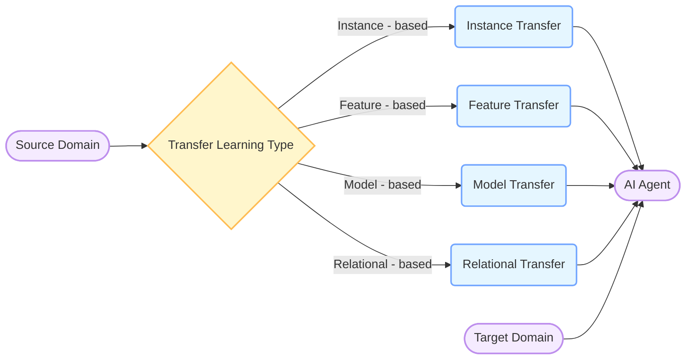

# AI Agent的迁移学习能力开发

> 关键词：AI Agent、迁移学习、能力开发、机器学习、知识迁移、模型泛化、深度学习

> 摘要：本文围绕AI Agent的迁移学习能力开发展开，深入探讨了其核心概念、算法原理、数学模型等内容。首先介绍了背景信息，包括目的范围、预期读者等。接着阐述了迁移学习与AI Agent相关的核心概念及联系，并给出了清晰的示意图和流程图。通过Python源代码详细讲解了核心算法原理和具体操作步骤，同时用数学公式和举例进一步加深理解。在项目实战部分，提供了开发环境搭建、源代码实现及解读。还探讨了实际应用场景，推荐了学习资源、开发工具框架和相关论文著作。最后总结了未来发展趋势与挑战，给出常见问题解答和参考资料，旨在为开发者全面了解和开发AI Agent的迁移学习能力提供系统的指导。

## 1. 背景介绍 
### 1.1 目的和范围
随着人工智能技术的快速发展，AI Agent在各个领域的应用越来越广泛。然而，传统的机器学习模型往往需要大量的数据进行训练，且在不同任务和环境中的泛化能力有限。迁移学习作为一种重要的技术手段，可以将在一个任务或领域中学习到的知识迁移到另一个相关的任务或领域中，从而提高AI Agent的学习效率和性能。

本文的目的在于深入探讨AI Agent的迁移学习能力开发，详细介绍迁移学习的原理、算法、数学模型以及实际应用等方面的内容。范围涵盖了从理论基础到实际项目开发的各个环节，旨在为开发者提供全面而系统的指导，帮助他们掌握开发AI Agent迁移学习能力的方法和技巧。

### 1.2 预期读者
本文预期读者包括但不限于以下几类人群：
- 人工智能领域的研究人员，希望深入了解迁移学习在AI Agent中的应用原理和最新研究进展。
- 软件开发人员和程序员，对开发具有迁移学习能力的AI Agent感兴趣，希望学习相关的技术和实现方法。
- 数据科学家和机器学习工程师，希望将迁移学习技术应用到实际项目中，提高模型的性能和效率。
- 高校相关专业的学生，希望通过阅读本文了解AI Agent迁移学习的基础知识和实践经验。

### 1.3 文档结构概述
本文按照以下结构进行组织：
1. **背景介绍**：介绍本文的目的、范围、预期读者和文档结构概述，以及相关的术语表。
2. **核心概念与联系**：阐述迁移学习和AI Agent的核心概念，以及它们之间的联系，并给出相应的文本示意图和Mermaid流程图。
3. **核心算法原理 & 具体操作步骤**：详细讲解迁移学习的核心算法原理，并通过Python源代码展示具体的操作步骤。
4. **数学模型和公式 & 详细讲解 & 举例说明**：介绍迁移学习的数学模型和公式，并通过具体的例子进行详细讲解。
5. **项目实战：代码实际案例和详细解释说明**：提供一个实际的项目案例，包括开发环境搭建、源代码实现和代码解读。
6. **实际应用场景**：探讨AI Agent迁移学习能力在不同领域的实际应用场景。
7. **工具和资源推荐**：推荐学习资源、开发工具框架和相关论文著作。
8. **总结：未来发展趋势与挑战**：总结AI Agent迁移学习能力开发的未来发展趋势和面临的挑战。
9. **附录：常见问题与解答**：解答读者在学习和开发过程中常见的问题。
10. **扩展阅读 & 参考资料**：提供相关的扩展阅读材料和参考资料。

### 1.4 术语表
#### 1.4.1 核心术语定义
- **AI Agent（人工智能代理）**：是一种能够感知环境、做出决策并采取行动的智能实体，它可以自主地完成特定的任务或目标。
- **迁移学习（Transfer Learning）**：是一种机器学习技术，旨在将在一个任务或领域中学习到的知识迁移到另一个相关的任务或领域中，以提高学习效率和性能。
- **源域（Source Domain）**：是指知识的来源领域，即已经有大量数据和知识的领域。
- **目标域（Target Domain）**：是指需要应用迁移知识的领域，通常数据量较少或缺乏足够的标注信息。
- **特征迁移（Feature Transfer）**：是指将源域中的特征表示迁移到目标域中，以帮助目标域的学习。
- **模型迁移（Model Transfer）**：是指将源域中训练好的模型迁移到目标域中，并进行微调或重新训练。

#### 1.4.2 相关概念解释
- **泛化能力（Generalization Ability）**：是指模型在未见过的数据上的表现能力，即模型能够从训练数据中学习到一般性的规律，并应用到新的数据上。
- **领域适应（Domain Adaptation）**：是迁移学习的一种特殊情况，主要关注如何在源域和目标域分布不同的情况下进行知识迁移。
- **多任务学习（Multi - Task Learning）**：是指同时学习多个相关的任务，通过共享模型参数或特征表示来提高学习效率和性能。

#### 1.4.3 缩略词列表
- **ML（Machine Learning）**：机器学习
- **DL（Deep Learning）**：深度学习
- **CNN（Convolutional Neural Network）**：卷积神经网络
- **RNN（Recurrent Neural Network）**：循环神经网络
- **GAN（Generative Adversarial Network）**：生成对抗网络

## 2. 核心概念与联系 

### 2.1 迁移学习的核心概念
迁移学习的核心思想是利用已有的知识和经验来加速和改进新任务的学习。在传统的机器学习中，每个任务都需要独立地进行数据收集、模型训练和优化，这不仅耗时耗力，而且在数据量有限的情况下，模型的性能往往难以达到理想的效果。而迁移学习通过将源域中的知识迁移到目标域中，可以有效地解决这些问题。

迁移学习可以分为以下几种类型：
- **基于实例的迁移学习（Instance - based Transfer Learning）**：通过选择源域中的一些相关实例，将其权重或表示方式调整后应用到目标域中。
- **基于特征的迁移学习（Feature - based Transfer Learning）**：通过提取源域和目标域中共同的特征表示，将源域中的特征知识迁移到目标域中。
- **基于模型的迁移学习（Model - based Transfer Learning）**：将源域中训练好的模型结构和参数迁移到目标域中，并进行微调或重新训练。
- **基于关系的迁移学习（Relational - based Transfer Learning）**：通过挖掘源域和目标域中数据之间的关系，将这种关系知识迁移到目标域中。

### 2.2 AI Agent的核心概念
AI Agent是一种具有感知、决策和行动能力的智能实体。它可以通过传感器感知环境信息，然后根据这些信息做出决策，并通过执行器采取相应的行动。AI Agent通常由以下几个部分组成：
- **感知模块（Perception Module）**：负责收集和处理环境信息，例如图像、声音、文本等。
- **决策模块（Decision - making Module）**：根据感知模块提供的信息，选择合适的行动方案。
- **行动模块（Action Module）**：执行决策模块选择的行动方案，与环境进行交互。

### 2.3 迁移学习与AI Agent的联系
迁移学习可以为AI Agent提供更强大的学习能力和泛化能力。通过迁移学习，AI Agent可以利用在其他任务或领域中学习到的知识，快速适应新的环境和任务。例如，一个在图像识别任务中训练好的AI Agent，可以通过迁移学习将其图像特征提取能力应用到目标检测任务中，从而提高目标检测的性能。

同时，AI Agent的应用场景也为迁移学习提供了广阔的发展空间。在实际应用中，AI Agent往往需要在不同的环境和任务中进行切换，迁移学习可以帮助AI Agent快速适应这些变化，提高其灵活性和适应性。

### 2.4 文本示意图
```plaintext
+----------------------+           +----------------------+
|        Source        |           |        Target        |
|       Domain         |           |       Domain         |
+----------------------+           +----------------------+
| - Abundant Data      |           | - Limited Data       |
| - Well - trained     |           | - Need for Knowledge |
|   Models             |           |   Transfer           |
+----------------------+           +----------------------+
            |                                   |
            |       Transfer Learning           |
            |         Mechanisms                |
            v                                   v
+----------------------+           +----------------------+
|  Feature Transfer    |           |  Model Transfer      |
|  Instance Transfer   |           |  Relational Transfer |
+----------------------+           +----------------------+
            |                                   |
            |                                   |
            v                                   v
+----------------------+           +----------------------+
|       AI Agent       |           |       AI Agent       |
|  Enhanced Learning   |           |  Adapted to New      |
|  and Performance     |           |  Tasks and Environments |
+----------------------+           +----------------------+
```

### 2.5 Mermaid流程图


## 3. 核心算法原理 & 具体操作步骤 

### 3.1 基于特征的迁移学习算法原理
基于特征的迁移学习算法的核心思想是提取源域和目标域中共同的特征表示，使得源域中的特征知识可以迁移到目标域中。常见的基于特征的迁移学习算法包括主成分分析（PCA）、线性判别分析（LDA）和深度自适应网络（DAN）等。

下面以深度自适应网络（DAN）为例，详细介绍其算法原理。

深度自适应网络（DAN）是一种基于深度学习的迁移学习算法，它通过最小化源域和目标域之间的分布差异来实现特征迁移。DAN的主要步骤如下：
1. **特征提取**：使用一个深度神经网络（如卷积神经网络）从源域和目标域的数据中提取特征。
2. **计算分布差异**：使用最大均值差异（MMD）来计算源域和目标域特征分布之间的差异。
3. **优化目标函数**：通过优化一个包含分类损失和分布差异损失的目标函数，使得源域和目标域的特征分布更加接近，同时提高分类性能。

### 3.2 Python源代码实现
```python
import torch
import torch.nn as nn
import torch.optim as optim
from torch.utils.data import DataLoader, TensorDataset
import numpy as np

# 定义深度神经网络模型
class DANModel(nn.Module):
    def __init__(self, input_size, hidden_size, output_size):
        super(DANModel, self).__init__()
        self.fc1 = nn.Linear(input_size, hidden_size)
        self.relu = nn.ReLU()
        self.fc2 = nn.Linear(hidden_size, output_size)

    def forward(self, x):
        out = self.fc1(x)
        out = self.relu(out)
        out = self.fc2(out)
        return out

# 计算最大均值差异（MMD）
def mmd_loss(source_features, target_features):
    def rbf_kernel(x, y, gamma=1.0):
        dist = torch.cdist(x, y) ** 2
        return torch.exp(-gamma * dist)

    n_s = source_features.size(0)
    n_t = target_features.size(0)

    K_ss = rbf_kernel(source_features, source_features)
    K_st = rbf_kernel(source_features, target_features)
    K_tt = rbf_kernel(target_features, target_features)

    mmd = (torch.sum(K_ss) / (n_s * n_s) - 2 * torch.sum(K_st) / (n_s * n_t) + torch.sum(K_tt) / (n_t * n_t))
    return mmd

# 训练模型
def train_model(model, source_loader, target_loader, num_epochs, learning_rate):
    criterion = nn.CrossEntropyLoss()
    optimizer = optim.Adam(model.parameters(), lr=learning_rate)

    for epoch in range(num_epochs):
        model.train()
        for i, ((source_data, source_labels), (target_data, _)) in enumerate(zip(source_loader, target_loader)):
            optimizer.zero_grad()

            source_features = model.fc1(source_data)
            target_features = model.fc1(target_data)

            source_output = model.fc2(model.relu(source_features))
            classification_loss = criterion(source_output, source_labels)
            mmd = mmd_loss(source_features, target_features)

            loss = classification_loss + mmd
            loss.backward()
            optimizer.step()

        if (epoch + 1) % 10 == 0:
            print(f'Epoch [{epoch + 1}/{num_epochs}], Loss: {loss.item():.4f}')

    return model

# 示例数据
source_data = torch.tensor(np.random.randn(100, 10).astype(np.float32))
source_labels = torch.tensor(np.random.randint(0, 2, 100))
target_data = torch.tensor(np.random.randn(50, 10).astype(np.float32))

source_dataset = TensorDataset(source_data, source_labels)
target_dataset = TensorDataset(target_data, torch.zeros(target_data.size(0)))

source_loader = DataLoader(source_dataset, batch_size=10, shuffle=True)
target_loader = DataLoader(target_dataset, batch_size=10, shuffle=True)

# 初始化模型
model = DANModel(input_size=10, hidden_size=20, output_size=2)

# 训练模型
trained_model = train_model(model, source_loader, target_loader, num_epochs=100, learning_rate=0.001)
```

### 3.3 具体操作步骤
1. **数据准备**：准备源域和目标域的数据，将其转换为适合模型输入的格式。
2. **模型定义**：定义一个深度神经网络模型，用于特征提取和分类。
3. **损失函数定义**：定义分类损失函数（如交叉熵损失）和分布差异损失函数（如MMD损失）。
4. **优化器定义**：选择合适的优化器（如Adam优化器）来更新模型参数。
5. **训练模型**：通过迭代训练模型，最小化分类损失和分布差异损失。
6. **模型评估**：在目标域上评估训练好的模型性能。

## 4. 数学模型和公式 & 详细讲解 & 举例说明 

### 4.1 最大均值差异（MMD）的数学模型和公式
最大均值差异（MMD）是一种用于衡量两个概率分布之间差异的方法。给定两个概率分布 $P$ 和 $Q$，以及一个再生核希尔伯特空间（RKHS） $\mathcal{H}$，MMD的定义如下：

$$MMD^2(\mathcal{H}, P, Q) = \left\lVert \mu_P - \mu_Q \right\rVert_{\mathcal{H}}^2$$

其中，$\mu_P$ 和 $\mu_Q$ 分别是分布 $P$ 和 $Q$ 在RKHS $\mathcal{H}$ 中的均值嵌入。

在实际应用中，我们通常使用有限的样本集合来估计MMD。假设我们有来自分布 $P$ 的样本集合 $X = \{x_1, x_2, \cdots, x_n\}$ 和来自分布 $Q$ 的样本集合 $Y = \{y_1, y_2, \cdots, y_m\}$，则MMD的无偏估计为：

$$\widehat{MMD}^2(\mathcal{H}, X, Y) = \frac{1}{n(n - 1)}\sum_{i = 1}^{n}\sum_{j \neq i}^{n}k(x_i, x_j) + \frac{1}{m(m - 1)}\sum_{i = 1}^{m}\sum_{j \neq i}^{m}k(y_i, y_j) - \frac{2}{nm}\sum_{i = 1}^{n}\sum_{j = 1}^{m}k(x_i, y_j)$$

其中，$k(x, y)$ 是核函数，常见的核函数包括高斯核函数：

$$k(x, y) = \exp\left(-\frac{\left\lVert x - y \right\rVert^2}{2\sigma^2}\right)$$

### 4.2 详细讲解
MMD的核心思想是通过比较两个分布在RKHS中的均值嵌入来衡量它们之间的差异。如果两个分布相同，则它们在RKHS中的均值嵌入也相同，MMD的值为0。反之，如果两个分布差异较大，则MMD的值也会较大。

在迁移学习中，我们希望通过最小化源域和目标域特征分布之间的MMD，使得源域和目标域的特征分布更加接近，从而实现知识的迁移。

### 4.3 举例说明
假设我们有两个一维的数据集 $X = \{1, 2, 3\}$ 和 $Y = \{4, 5, 6\}$，我们使用高斯核函数（$\sigma = 1$）来计算它们之间的MMD。

首先，计算核矩阵：

$$K_{XX} = \begin{bmatrix}
k(1, 1) & k(1, 2) & k(1, 3) \\
k(2, 1) & k(2, 2) & k(2, 3) \\
k(3, 1) & k(3, 2) & k(3, 3)
\end{bmatrix}$$

$$K_{YY} = \begin{bmatrix}
k(4, 4) & k(4, 5) & k(4, 6) \\
k(5, 4) & k(5, 5) & k(5, 6) \\
k(6, 4) & k(6, 5) & k(6, 6)
\end{bmatrix}$$

$$K_{XY} = \begin{bmatrix}
k(1, 4) & k(1, 5) & k(1, 6) \\
k(2, 4) & k(2, 5) & k(2, 6) \\
k(3, 4) & k(3, 5) & k(3, 6)
\end{bmatrix}$$

然后，根据MMD的无偏估计公式计算MMD的值：

$$\widehat{MMD}^2(\mathcal{H}, X, Y) = \frac{1}{3\times(3 - 1)}\sum_{i = 1}^{3}\sum_{j \neq i}^{3}k(x_i, x_j) + \frac{1}{3\times(3 - 1)}\sum_{i = 1}^{3}\sum_{j \neq i}^{3}k(y_i, y_j) - \frac{2}{3\times3}\sum_{i = 1}^{3}\sum_{j = 1}^{3}k(x_i, y_j)$$

```python
import numpy as np

def gaussian_kernel(x, y, sigma=1.0):
    dist = (x - y) ** 2
    return np.exp(-dist / (2 * sigma ** 2))

X = np.array([1, 2, 3])
Y = np.array([4, 5, 6])

n = len(X)
m = len(Y)

K_XX = np.zeros((n, n))
K_YY = np.zeros((m, m))
K_XY = np.zeros((n, m))

for i in range(n):
    for j in range(n):
        K_XX[i, j] = gaussian_kernel(X[i], X[j])
    for j in range(m):
        K_XY[i, j] = gaussian_kernel(X[i], Y[j])

for i in range(m):
    for j in range(m):
        K_YY[i, j] = gaussian_kernel(Y[i], Y[j])

mmd = (np.sum(K_XX) / (n * (n - 1)) + np.sum(K_YY) / (m * (m - 1)) - 2 * np.sum(K_XY) / (n * m))
print(f'MMD: {mmd}')
```

通过计算得到的MMD值可以反映出两个数据集之间的分布差异。

## 5. 项目实战：代码实际案例和详细解释说明 

### 5.1  开发环境搭建
在进行AI Agent迁移学习能力开发的项目实战之前，需要搭建相应的开发环境。以下是具体的步骤：

#### 5.1.1 安装Python
首先，确保你已经安装了Python 3.x版本。可以从Python官方网站（https://www.python.org/downloads/） 下载并安装适合你操作系统的Python版本。

#### 5.1.2 安装深度学习框架
我们将使用PyTorch作为深度学习框架，因为它具有简洁的API和强大的计算能力。可以使用以下命令安装PyTorch：
```sh
pip install torch torchvision
```

#### 5.1.3 安装其他必要的库
除了PyTorch，还需要安装一些其他的库，如NumPy、Matplotlib等。可以使用以下命令安装：
```sh
pip install numpy matplotlib
```

### 5.2  源代码详细实现和代码解读
#### 5.2.1 数据准备
我们使用一个简单的图像分类任务作为示例，源域数据为MNIST手写数字数据集，目标域数据为Fashion - MNIST时尚物品数据集。

```python
import torch
import torchvision
import torchvision.transforms as transforms

# 定义数据预处理
transform = transforms.Compose([
    transforms.ToTensor(),
    transforms.Normalize((0.5,), (0.5,))
])

# 加载源域数据（MNIST）
source_trainset = torchvision.datasets.MNIST(root='./data', train=True,
                                             download=True, transform=transform)
source_trainloader = torch.utils.data.DataLoader(source_trainset, batch_size=32,
                                                 shuffle=True)

# 加载目标域数据（Fashion - MNIST）
target_trainset = torchvision.datasets.FashionMNIST(root='./data', train=True,
                                                    download=True, transform=transform)
target_trainloader = torch.utils.data.DataLoader(target_trainset, batch_size=32,
                                                 shuffle=True)
```

#### 5.2.2 定义模型
我们定义一个简单的卷积神经网络模型用于特征提取和分类。

```python
import torch.nn as nn
import torch.nn.functional as F

class SimpleCNN(nn.Module):
    def __init__(self):
        super(SimpleCNN, self).__init__()
        self.conv1 = nn.Conv2d(1, 10, kernel_size=5)
        self.conv2 = nn.Conv2d(10, 20, kernel_size=5)
        self.fc1 = nn.Linear(320, 50)
        self.fc2 = nn.Linear(50, 10)

    def forward(self, x):
        x = F.relu(F.max_pool2d(self.conv1(x), 2))
        x = F.relu(F.max_pool2d(self.conv2(x), 2))
        x = x.view(-1, 320)
        x = F.relu(self.fc1(x))
        x = self.fc2(x)
        return x
```

#### 5.2.3 定义损失函数和优化器
我们使用交叉熵损失函数作为分类损失，MMD损失作为分布差异损失，Adam优化器来更新模型参数。

```python
import torch.optim as optim

model = SimpleCNN()
criterion = nn.CrossEntropyLoss()
optimizer = optim.Adam(model.parameters(), lr=0.001)

# 计算MMD损失
def mmd_loss(source_features, target_features):
    def rbf_kernel(x, y, gamma=1.0):
        dist = torch.cdist(x, y) ** 2
        return torch.exp(-gamma * dist)

    n_s = source_features.size(0)
    n_t = target_features.size(0)

    K_ss = rbf_kernel(source_features, source_features)
    K_st = rbf_kernel(source_features, target_features)
    K_tt = rbf_kernel(target_features, target_features)

    mmd = (torch.sum(K_ss) / (n_s * n_s) - 2 * torch.sum(K_st) / (n_s * n_t) + torch.sum(K_tt) / (n_t * n_t))
    return mmd
```

#### 5.2.4 训练模型
在训练过程中，我们同时最小化分类损失和MMD损失。

```python
num_epochs = 10

for epoch in range(num_epochs):
    model.train()
    for i, ((source_data, source_labels), (target_data, _)) in enumerate(zip(source_trainloader, target_trainloader)):
        optimizer.zero_grad()

        source_output = model(source_data)
        source_features = model.conv2(F.relu(F.max_pool2d(model.conv1(source_data), 2)))
        source_features = source_features.view(source_features.size(0), -1)

        target_features = model.conv2(F.relu(F.max_pool2d(model.conv1(target_data), 2)))
        target_features = target_features.view(target_features.size(0), -1)

        classification_loss = criterion(source_output, source_labels)
        mmd = mmd_loss(source_features, target_features)

        loss = classification_loss + mmd
        loss.backward()
        optimizer.step()

    print(f'Epoch [{epoch + 1}/{num_epochs}], Loss: {loss.item():.4f}')
```

### 5.3  代码解读与分析
#### 5.3.1 数据准备部分
我们使用`torchvision`库加载MNIST和Fashion - MNIST数据集，并进行了简单的数据预处理，包括将图像转换为张量和归一化操作。

#### 5.3.2 模型定义部分
`SimpleCNN`类定义了一个简单的卷积神经网络，包含两个卷积层和两个全连接层。前向传播过程中，通过卷积、池化和激活函数对输入图像进行特征提取和分类。

#### 5.3.3 损失函数和优化器部分
我们使用交叉熵损失函数来计算分类损失，MMD损失函数来计算源域和目标域特征分布之间的差异。Adam优化器用于更新模型参数。

#### 5.3.4 训练模型部分
在训练过程中，我们通过迭代训练数据，计算分类损失和MMD损失，并将它们相加得到总损失。然后使用反向传播算法更新模型参数，使得总损失最小化。

## 6. 实际应用场景 
### 6.1 计算机视觉领域
- **图像分类**：在不同的图像分类任务中，例如从自然图像分类迁移到医学图像分类。源域的自然图像数据丰富，模型可以学习到通用的图像特征，如边缘、纹理等。通过迁移学习，将这些特征迁移到目标域的医学图像分类任务中，可以减少医学图像标注的工作量，提高分类性能。
- **目标检测**：在不同的场景下进行目标检测，如从城市街景目标检测迁移到室内场景目标检测。源域中训练好的目标检测模型可以学习到目标的形状、大小等特征，将这些知识迁移到目标域中，可以更快地适应新的场景，提高检测的准确性和效率。
- **图像生成**：在不同风格的图像生成任务中，例如从写实风格图像生成迁移到卡通风格图像生成。通过迁移学习，可以利用源域中学习到的图像结构和纹理信息，在目标域中生成更符合要求的卡通风格图像。

### 6.2 自然语言处理领域
- **文本分类**：在不同领域的文本分类任务中，如从新闻文本分类迁移到社交媒体文本分类。源域的新闻文本数据量大且标注完善，模型可以学习到文本的主题、情感等特征。将这些特征迁移到目标域的社交媒体文本分类中，可以提高分类的准确性，尤其是在社交媒体文本标注数据有限的情况下。
- **机器翻译**：在不同语言对的机器翻译任务中，例如从英语 - 法语翻译迁移到英语 - 德语翻译。源域中学习到的语言结构、词汇语义等知识可以迁移到目标域中，减少目标语言对的训练数据需求，提高翻译质量。
- **情感分析**：在不同产品或领域的情感分析任务中，如从电影评论情感分析迁移到酒店评论情感分析。源域中训练好的情感分析模型可以学习到情感表达的模式和词汇，将这些知识迁移到目标域中，可以更快地适应新的领域，提高情感分析的性能。

### 6.3 机器人领域
- **机器人导航**：在不同的环境中进行机器人导航，如从室内环境导航迁移到室外环境导航。源域中机器人学习到的避障、路径规划等知识可以迁移到目标域中，使机器人能够更快地适应新的环境，提高导航的效率和安全性。
- **机器人操作**：在不同的任务中进行机器人操作，如从抓取简单物体迁移到抓取复杂物体。源域中机器人学习到的物体识别、抓取策略等知识可以迁移到目标域中，提高机器人操作的准确性和灵活性。

### 6.4 医疗领域
- **疾病诊断**：在不同疾病的诊断任务中，如从心脏病诊断迁移到糖尿病诊断。源域中学习到的医学特征、疾病模式等知识可以迁移到目标域中，帮助医生更快地做出准确的诊断，尤其是在目标疾病数据有限的情况下。
- **药物研发**：在不同药物的研发任务中，如从抗癌药物研发迁移到抗抑郁药物研发。源域中学习到的药物分子结构、作用机制等知识可以迁移到目标域中，减少药物研发的时间和成本。

## 7. 工具和资源推荐
### 7.1 学习资源推荐
#### 7.1.1 书籍推荐
- 《深度学习》（Deep Learning）：由Ian Goodfellow、Yoshua Bengio和Aaron Courville撰写，是深度学习领域的经典教材，涵盖了深度学习的基本原理、算法和应用。
- 《机器学习》（Machine Learning: A Probabilistic Perspective）：由Kevin P. Murphy撰写，从概率的角度介绍了机器学习的基本概念和算法，对于理解迁移学习的理论基础有很大帮助。
- 《迁移学习》（Transfer Learning）：由Sinno Jialin Pan和Qiang Yang撰写，是迁移学习领域的权威著作，详细介绍了迁移学习的各种方法和应用。

#### 7.1.2 在线课程
- Coursera上的“深度学习专项课程”（Deep Learning Specialization）：由Andrew Ng教授授课，包括神经网络和深度学习、改善深层神经网络、结构化机器学习项目、卷积神经网络、序列模型等五个课程，系统地介绍了深度学习的知识和技能。
- edX上的“迁移学习”（Transfer Learning）：由相关领域的专家授课，深入讲解了迁移学习的原理、算法和应用。
- 哔哩哔哩（Bilibili）上的一些人工智能相关视频：有很多优质的人工智能学习视频，包括迁移学习的讲解和实践案例，可以帮助初学者快速入门。

#### 7.1.3 技术博客和网站
- Medium：有很多人工智能领域的技术博客，作者会分享最新的研究成果、技术实践和经验教训。
- arXiv：是一个开放获取的预印本数据库，包含了大量的人工智能相关论文，及时了解最新的研究动态。
- 机器之心：专注于人工智能领域的资讯和技术报道，提供了很多有价值的技术文章和案例分析。

### 7.2 开发工具框架推荐
#### 7.2.1 IDE和编辑器
- PyCharm：是一款专门为Python开发设计的集成开发环境（IDE），具有强大的代码编辑、调试和项目管理功能。
- Jupyter Notebook：是一个交互式的开发环境，适合进行数据分析、模型训练和实验验证。
- Visual Studio Code：是一款轻量级的代码编辑器，支持多种编程语言和插件扩展，对于Python开发也非常方便。

#### 7.2.2 调试和性能分析工具
- PyTorch Profiler：是PyTorch自带的性能分析工具，可以帮助开发者分析模型的性能瓶颈，优化代码。
- TensorBoard：是TensorFlow的可视化工具，也可以与PyTorch结合使用，用于可视化模型的训练过程和性能指标。
- cProfile：是Python的内置性能分析工具，可以帮助开发者分析代码的执行时间和函数调用关系。

#### 7.2.3 相关框架和库
- PyTorch：是一个开源的深度学习框架，具有动态图和静态图的优势，广泛应用于各种深度学习任务中。
- TensorFlow：是一个由Google开发的开源深度学习框架，具有丰富的工具和库，适合大规模的深度学习应用。
- Scikit - learn：是一个简单而高效的机器学习工具库，提供了各种机器学习算法和工具，对于迁移学习的实验和验证非常有用。

### 7.3 相关论文著作推荐
#### 7.3.1 经典论文
- “A Survey on Transfer Learning”：由Sinno Jialin Pan和Qiang Yang撰写，是迁移学习领域的经典综述论文，全面介绍了迁移学习的概念、方法和应用。
- “Domain Adaptation via Transfer Component Analysis”：提出了迁移成分分析（TCA）方法，是基于特征的迁移学习的经典算法之一。
- “Unsupervised Domain Adaptation by Backpropagation”：提出了通过反向传播进行无监督域适应的方法，为迁移学习的研究提供了新的思路。

#### 7.3.2 最新研究成果
- 关注顶级人工智能会议（如NeurIPS、ICML、CVPR等）上的最新论文，了解迁移学习领域的最新研究进展和技术创新。
- 关注知名学术期刊（如Journal of Artificial Intelligence Research、Artificial Intelligence等）上的相关论文，获取高质量的研究成果。

#### 7.3.3 应用案例分析
- 查看工业界和学术界的实际应用案例，了解迁移学习在不同领域的应用场景和效果。例如，一些医疗领域的论文会介绍迁移学习在疾病诊断和药物研发中的应用；一些计算机视觉领域的论文会介绍迁移学习在图像分类和目标检测中的应用。

## 8. 总结：未来发展趋势与挑战
### 8.1 未来发展趋势
#### 8.1.1 多模态迁移学习
随着人工智能技术的发展，多模态数据（如图像、文本、音频等）的处理和分析变得越来越重要。未来，迁移学习将更多地应用于多模态数据的处理中，通过跨模态的知识迁移，提高模型的性能和泛化能力。例如，在智能医疗领域，可以将医学图像和病历文本的知识进行迁移，提高疾病诊断的准确性。

#### 8.1.2 元迁移学习
元迁移学习旨在学习如何更好地进行迁移学习，通过在多个任务和领域中学习迁移的策略和方法，提高迁移学习的效率和效果。未来，元迁移学习将成为迁移学习领域的一个重要研究方向，有望实现更智能、更高效的知识迁移。

#### 8.1.3 强化学习与迁移学习的结合
强化学习在机器人控制、游戏等领域取得了很大的成功。将强化学习与迁移学习相结合，可以让智能体在不同的环境和任务中更快地学习和适应。例如，在机器人导航任务中，通过迁移学习将在模拟环境中学习到的导航策略迁移到真实环境中，提高机器人的导航能力。

#### 8.1.4 联邦迁移学习
随着数据隐私和安全问题的日益关注，联邦迁移学习将成为未来的一个重要发展方向。联邦迁移学习允许在不共享原始数据的情况下，在多个参与方之间进行知识迁移，保护数据隐私的同时实现知识的共享和利用。

### 8.2 挑战
#### 8.2.1 领域差异问题
源域和目标域之间的领域差异是迁移学习面临的主要挑战之一。当领域差异较大时，知识的迁移可能会导致性能下降，甚至产生负迁移。如何有效地度量和处理领域差异，是迁移学习需要解决的关键问题。

#### 8.2.2 数据隐私和安全问题
在迁移学习中，数据的隐私和安全是一个重要的问题。特别是在跨组织、跨领域的迁移学习中，如何保护数据的隐私和安全，防止数据泄露和滥用，是需要解决的难题。

#### 8.2.3 模型可解释性问题
随着深度学习模型在迁移学习中的广泛应用，模型的可解释性问题变得越来越突出。在一些关键领域（如医疗、金融等），需要对模型的决策过程进行解释，以确保模型的可靠性和可信度。如何提高迁移学习模型的可解释性，是未来需要研究的重要方向。

#### 8.2.4 计算资源和效率问题
迁移学习通常需要大量的计算资源和时间，特别是在处理大规模数据和复杂模型时。如何提高迁移学习的计算效率，减少计算资源的消耗，是迁移学习面临的实际挑战。

## 9. 附录：常见问题与解答
### 9.1 什么是负迁移？
负迁移是指在迁移学习中，将源域的知识迁移到目标域后，模型在目标域上的性能反而下降的现象。负迁移通常是由于源域和目标域之间的领域差异过大，源域的知识不适合目标域的任务所导致的。

### 9.2 如何避免负迁移？
- **领域适配**：在进行迁移学习之前，需要对源域和目标域进行领域适配，减少领域差异。例如，可以使用领域适应算法来调整源域和目标域的特征分布。
- **选择合适的源域**：选择与目标域相关性较高的源域进行知识迁移，避免选择差异过大的源域。
- **模型选择和调整**：选择适合目标域任务的模型，并对模型进行适当的调整和优化，以提高模型在目标域上的性能。

### 9.3 迁移学习需要多少源域和目标域数据？
迁移学习对源域和目标域数据的需求没有固定的标准，取决于具体的任务和模型。一般来说，源域数据越多越好，因为丰富的源域数据可以让模型学习到更通用的知识。而目标域数据可以相对较少，因为迁移学习的目的就是利用源域的知识来弥补目标域数据的不足。

### 9.4 如何评估迁移学习模型的性能？
可以使用与传统机器学习模型相同的评估指标来评估迁移学习模型的性能，如准确率、召回率、F1值等。此外，还可以比较迁移学习模型和不使用迁移学习的模型在目标域上的性能差异，以评估迁移学习的效果。

### 9.5 迁移学习可以应用于所有的机器学习任务吗？
不是所有的机器学习任务都适合应用迁移学习。迁移学习通常适用于源域和目标域之间具有一定相关性的任务，例如在图像分类、自然语言处理等领域。对于一些领域差异较大、任务相关性较低的任务，迁移学习可能无法取得良好的效果。

## 10. 扩展阅读 & 参考资料
### 10.1 扩展阅读
- 《人工智能：一种现代方法》（Artificial Intelligence: A Modern Approach）：全面介绍了人工智能的基本概念、算法和应用，对于理解AI Agent和迁移学习的背景和原理有很大帮助。
- 《深度学习实战》（Deep Learning in Practice）：通过大量的实际案例，介绍了深度学习在不同领域的应用，包括迁移学习的实践经验。
- 《数据挖掘：概念与技术》（Data Mining: Concepts and Techniques）：介绍了数据挖掘的基本概念和算法，对于理解迁移学习中的数据处理和特征提取有一定的帮助。

### 10.2 参考资料
- 相关的学术论文和研究报告，可以通过学术数据库（如IEEE Xplore、ACM Digital Library等）进行查找。
- 开源代码库（如GitHub）上的相关项目，例如一些开源的迁移学习框架和代码实现，可以帮助读者更好地理解和实践迁移学习技术。
- 各深度学习框架的官方文档（如PyTorch、TensorFlow等），提供了详细的API文档和使用示例，对于开发具有迁移学习能力的AI Agent非常有用。