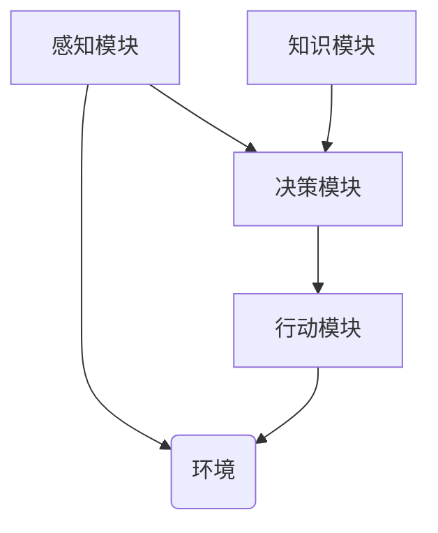

# AI Agent的部署与扩展性考虑

> 关键词：AI Agent、部署、扩展性、容器化、分布式系统

> 摘要：本文围绕AI Agent的部署与扩展性展开深入探讨。首先介绍了AI Agent的相关背景知识，包括目的范围、预期读者等。接着阐述了AI Agent的核心概念与联系，通过文本示意图和Mermaid流程图进行直观展示。详细讲解了核心算法原理及具体操作步骤，结合Python源代码进行说明。同时给出了相关的数学模型和公式，并举例进行详细解释。通过项目实战，展示了代码实际案例并进行详细解读。分析了AI Agent的实际应用场景，推荐了相关的工具和资源。最后总结了未来发展趋势与挑战，提供了常见问题解答和扩展阅读参考资料，旨在为开发者和研究人员在AI Agent的部署与扩展方面提供全面而深入的指导。

## 1. 背景介绍 
### 1.1 目的和范围
AI Agent作为人工智能领域的重要组成部分，在诸多领域展现出了巨大的应用潜力。本文的目的在于深入探讨AI Agent的部署与扩展性问题，为开发者和研究人员提供全面的技术指导和实践经验。范围涵盖了AI Agent的核心概念、算法原理、数学模型、项目实战、应用场景、工具资源等多个方面，旨在从理论到实践全方位地阐述AI Agent部署与扩展的相关知识。

### 1.2 预期读者
本文预期读者包括人工智能领域的开发者、研究人员、软件架构师、CTO等技术人员，以及对AI Agent感兴趣的学生和爱好者。无论是想要深入了解AI Agent技术细节的专业人士，还是希望初步接触该领域的初学者，都能从本文中获取有价值的信息。

### 1.3 文档结构概述
本文将按照以下结构展开：首先介绍AI Agent的背景知识，包括目的范围、预期读者等；接着阐述AI Agent的核心概念与联系，通过文本示意图和Mermaid流程图进行直观展示；详细讲解核心算法原理及具体操作步骤，结合Python源代码进行说明；给出相关的数学模型和公式，并举例进行详细解释；通过项目实战，展示代码实际案例并进行详细解读；分析AI Agent的实际应用场景；推荐相关的工具和资源；最后总结未来发展趋势与挑战，提供常见问题解答和扩展阅读参考资料。

### 1.4 术语表
#### 1.4.1 核心术语定义
- **AI Agent**：人工智能代理，是一种能够感知环境、做出决策并采取行动以实现特定目标的智能实体。
- **部署**：将AI Agent系统从开发环境迁移到生产环境并使其正常运行的过程。
- **扩展性**：指系统能够方便地进行功能扩展、性能提升和规模扩大的能力。
- **容器化**：将应用程序及其依赖项打包成一个独立的容器，实现环境隔离和快速部署。
- **分布式系统**：由多个独立的计算机节点组成的系统，通过网络进行通信和协作，共同完成任务。

#### 1.4.2 相关概念解释
- **感知**：AI Agent通过各种传感器或接口获取环境信息的过程。
- **决策**：AI Agent根据感知到的环境信息和自身的目标，选择合适的行动方案的过程。
- **行动**：AI Agent根据决策结果，对环境进行操作或交互的过程。

#### 1.4.3 缩略词列表
- **API**：Application Programming Interface，应用程序编程接口
- **GPU**：Graphics Processing Unit，图形处理单元
- **Kubernetes**：开源的容器编排引擎
- **Docker**：开源的容器化平台

## 2. 核心概念与联系 

### 核心概念原理
AI Agent的核心概念基于人工智能和自主系统的理论。它通过感知环境中的信息，利用内部的知识和算法进行决策，然后采取相应的行动来实现特定的目标。AI Agent可以是软件实体，也可以是硬件设备，如机器人。

一个典型的AI Agent包含以下几个部分：
1. **感知模块**：负责收集环境信息，如传感器数据、用户输入等。
2. **决策模块**：根据感知到的信息和预设的目标，选择合适的行动方案。
3. **行动模块**：执行决策模块选择的行动，对环境进行操作或交互。
4. **知识模块**：存储AI Agent的领域知识和经验，为决策提供支持。

### 架构的文本示意图
```plaintext
+---------------------+
|      AI Agent       |
+---------------------+
|  感知模块  |  知识模块  |
+---------------------+
|       决策模块       |
+---------------------+
|       行动模块       |
+---------------------+
|      环境接口       |
+---------------------+
```

### Mermaid流程图


## 3. 核心算法原理 & 具体操作步骤 

### 核心算法原理
AI Agent的决策过程通常基于一些经典的人工智能算法，如强化学习、决策树、贝叶斯网络等。这里以强化学习为例进行详细讲解。

强化学习是一种通过智能体与环境进行交互，不断尝试不同的行动，并根据环境反馈的奖励信号来学习最优策略的机器学习方法。其核心思想是智能体在环境中执行一系列的行动，环境会根据智能体的行动给予相应的奖励或惩罚，智能体的目标是通过不断地学习，找到能够最大化累积奖励的行动策略。

### 具体操作步骤
1. **定义环境**：确定AI Agent所处的环境，包括环境的状态空间、行动空间和奖励函数。
2. **初始化策略**：随机初始化AI Agent的行动策略。
3. **交互学习**：AI Agent在环境中进行多次交互，根据当前状态选择行动，执行行动后获取环境的反馈（新状态和奖励），并根据奖励信号更新策略。
4. **收敛判断**：当策略收敛到最优解或达到预设的学习步数时，学习过程结束。

### Python源代码实现
```python
import numpy as np

# 定义环境
class Environment:
    def __init__(self):
        self.state_space = 5
        self.action_space = 2
        self.current_state = np.random.randint(0, self.state_space)

    def step(self, action):
        if action == 0:
            next_state = max(0, self.current_state - 1)
        else:
            next_state = min(self.state_space - 1, self.current_state + 1)

        if next_state == self.state_space - 1:
            reward = 1
        else:
            reward = 0

        self.current_state = next_state
        return next_state, reward

# 定义AI Agent
class Agent:
    def __init__(self, state_space, action_space):
        self.state_space = state_space
        self.action_space = action_space
        self.q_table = np.zeros((state_space, action_space))
        self.learning_rate = 0.1
        self.discount_factor = 0.9
        self.epsilon = 0.1

    def choose_action(self, state):
        if np.random.uniform(0, 1) < self.epsilon:
            action = np.random.randint(0, self.action_space)
        else:
            action = np.argmax(self.q_table[state, :])
        return action

    def update_q_table(self, state, action, reward, next_state):
        max_q_next = np.max(self.q_table[next_state, :])
        self.q_table[state, action] += self.learning_rate * (reward + self.discount_factor * max_q_next - self.q_table[state, action])

# 训练过程
env = Environment()
agent = Agent(env.state_space, env.action_space)

num_episodes = 1000
for episode in range(num_episodes):
    state = env.current_state
    total_reward = 0
    while True:
        action = agent.choose_action(state)
        next_state, reward = env.step(action)
        agent.update_q_table(state, action, reward, next_state)
        state = next_state
        total_reward += reward
        if reward == 1:
            break
    print(f"Episode {episode}: Total Reward = {total_reward}")
```

## 4. 数学模型和公式 & 详细讲解 & 举例说明 

### 强化学习的数学模型
强化学习的数学模型主要基于马尔可夫决策过程（MDP）。MDP可以用一个五元组 $<S, A, P, R, \gamma>$ 来表示，其中：
- $S$ 是状态空间，表示环境的所有可能状态。
- $A$ 是行动空间，表示AI Agent可以采取的所有可能行动。
- $P(s'|s, a)$ 是状态转移概率，表示在状态 $s$ 下采取行动 $a$ 后转移到状态 $s'$ 的概率。
- $R(s, a, s')$ 是奖励函数，表示在状态 $s$ 下采取行动 $a$ 并转移到状态 $s'$ 后获得的奖励。
- $\gamma$ 是折扣因子，取值范围为 $[0, 1]$，用于衡量未来奖励的重要性。

### Q学习算法公式
Q学习是一种基于价值的强化学习算法，其核心是学习一个动作价值函数 $Q(s, a)$，表示在状态 $s$ 下采取行动 $a$ 的预期累积奖励。Q学习的更新公式为：
$$Q(s, a) \leftarrow Q(s, a) + \alpha [R(s, a, s') + \gamma \max_{a'} Q(s', a') - Q(s, a)]$$
其中：
- $\alpha$ 是学习率，控制每次更新的步长。
- $\gamma$ 是折扣因子。
- $R(s, a, s')$ 是即时奖励。
- $\max_{a'} Q(s', a')$ 是下一个状态 $s'$ 下所有可能行动的最大Q值。

### 举例说明
假设一个简单的迷宫环境，AI Agent的目标是从起点到达终点。状态空间 $S$ 可以表示为迷宫中所有可能的位置，行动空间 $A$ 可以表示为上下左右四个方向的移动。奖励函数 $R$ 可以设置为：到达终点获得奖励1，撞到墙壁或在其他位置获得奖励0。

在训练过程中，AI Agent根据当前状态选择行动，执行行动后获取新状态和奖励，然后使用Q学习更新公式更新Q表。通过不断地迭代学习，AI Agent逐渐学会了从起点到终点的最优路径。

## 5. 项目实战：代码实际案例和详细解释说明 

### 5.1  开发环境搭建
1. **安装Python**：确保系统中安装了Python 3.x版本。
2. **安装必要的库**：使用pip安装numpy等必要的库。
```sh
pip install numpy
```

### 5.2  源代码详细实现和代码解读
```python
import numpy as np

# 定义环境
class Environment:
    def __init__(self):
        # 状态空间大小
        self.state_space = 5
        # 行动空间大小
        self.action_space = 2
        # 随机初始化当前状态
        self.current_state = np.random.randint(0, self.state_space)

    def step(self, action):
        # 根据行动更新状态
        if action == 0:
            next_state = max(0, self.current_state - 1)
        else:
            next_state = min(self.state_space - 1, self.current_state + 1)

        # 根据新状态确定奖励
        if next_state == self.state_space - 1:
            reward = 1
        else:
            reward = 0

        # 更新当前状态
        self.current_state = next_state
        return next_state, reward

# 定义AI Agent
class Agent:
    def __init__(self, state_space, action_space):
        # 状态空间大小
        self.state_space = state_space
        # 行动空间大小
        self.action_space = action_space
        # 初始化Q表
        self.q_table = np.zeros((state_space, action_space))
        # 学习率
        self.learning_rate = 0.1
        # 折扣因子
        self.discount_factor = 0.9
        # 探索率
        self.epsilon = 0.1

    def choose_action(self, state):
        # 以epsilon的概率进行随机探索
        if np.random.uniform(0, 1) < self.epsilon:
            action = np.random.randint(0, self.action_space)
        else:
            # 选择Q值最大的行动
            action = np.argmax(self.q_table[state, :])
        return action

    def update_q_table(self, state, action, reward, next_state):
        # 计算下一个状态的最大Q值
        max_q_next = np.max(self.q_table[next_state, :])
        # 根据Q学习更新公式更新Q表
        self.q_table[state, action] += self.learning_rate * (reward + self.discount_factor * max_q_next - self.q_table[state, action])

# 训练过程
env = Environment()
agent = Agent(env.state_space, env.action_space)

num_episodes = 1000
for episode in range(num_episodes):
    state = env.current_state
    total_reward = 0
    while True:
        action = agent.choose_action(state)
        next_state, reward = env.step(action)
        agent.update_q_table(state, action, reward, next_state)
        state = next_state
        total_reward += reward
        if reward == 1:
            break
    print(f"Episode {episode}: Total Reward = {total_reward}")
```

### 5.3  代码解读与分析
1. **环境类（Environment）**：负责定义环境的状态空间、行动空间和奖励函数，以及实现状态转移和奖励计算的逻辑。
2. **智能体类（Agent）**：负责实现AI Agent的核心功能，包括Q表的初始化、行动选择和Q表更新。
3. **训练过程**：通过多次迭代，让AI Agent在环境中进行交互学习，不断更新Q表，直到找到最优策略。

## 6. 实际应用场景 
AI Agent在许多领域都有广泛的应用，以下是一些常见的应用场景：
1. **智能客服**：AI Agent可以通过自然语言处理技术与用户进行交互，回答用户的问题，解决用户的问题，提供个性化的服务。
2. **自动驾驶**：AI Agent可以感知车辆周围的环境，做出决策并控制车辆的行驶，实现自动驾驶的功能。
3. **游戏开发**：AI Agent可以作为游戏中的智能对手，与玩家进行对抗，增加游戏的趣味性和挑战性。
4. **金融领域**：AI Agent可以分析金融市场数据，做出投资决策，进行风险评估和管理。
5. **医疗领域**：AI Agent可以辅助医生进行疾病诊断、治疗方案推荐等工作，提高医疗效率和质量。

## 7. 工具和资源推荐
### 7.1 学习资源推荐
#### 7.1.1 书籍推荐
- 《人工智能：一种现代的方法》：全面介绍了人工智能的基本概念、算法和应用，是人工智能领域的经典教材。
- 《强化学习：原理与Python实现》：详细讲解了强化学习的理论和实践，通过Python代码实现了各种强化学习算法。
- 《深度学习》：深度学习领域的权威著作，介绍了深度学习的基本原理、模型和应用。

#### 7.1.2 在线课程
- Coursera上的“人工智能基础”课程：由知名教授授课，系统地介绍了人工智能的基础知识和算法。
- edX上的“强化学习”课程：深入讲解了强化学习的理论和实践，通过案例分析和编程作业帮助学生掌握强化学习的应用。
- 哔哩哔哩上的“深度学习入门”系列视频：通俗易懂地介绍了深度学习的基本概念和算法，适合初学者学习。

#### 7.1.3 技术博客和网站
- Medium上的人工智能专栏：汇集了众多人工智能领域的专家和爱好者的文章，涵盖了人工智能的各个方面。
- 机器之心：专注于人工智能领域的资讯和技术分享，提供最新的人工智能研究成果和应用案例。
- 开源中国：提供丰富的开源项目和技术文章，对人工智能相关的开源项目和技术进行了深入的介绍和分析。

### 7.2 开发工具框架推荐
#### 7.2.1 IDE和编辑器
- PyCharm：功能强大的Python集成开发环境，提供代码编辑、调试、版本控制等功能，适合开发Python项目。
- Visual Studio Code：轻量级的代码编辑器，支持多种编程语言，通过安装插件可以扩展其功能，适合快速开发和调试。

#### 7.2.2 调试和性能分析工具
- PDB：Python自带的调试工具，可以帮助开发者定位和解决代码中的问题。
- cProfile：Python的性能分析工具，可以分析代码的运行时间和内存使用情况，帮助开发者优化代码性能。

#### 7.2.3 相关框架和库
- TensorFlow：谷歌开发的开源深度学习框架，提供了丰富的深度学习模型和工具，支持分布式训练和部署。
- PyTorch：Facebook开发的开源深度学习框架，具有动态计算图的特点，易于使用和调试。
- OpenAI Gym：OpenAI开发的开源强化学习环境库，提供了多种经典的强化学习环境，方便开发者进行强化学习算法的测试和验证。

### 7.3 相关论文著作推荐
#### 7.3.1 经典论文
- “Reinforcement Learning: A Survey”：对强化学习的发展历程、基本概念和算法进行了全面的综述。
- “Playing Atari with Deep Reinforcement Learning”：首次将深度学习与强化学习相结合，实现了在Atari游戏上的智能决策。
- “Attention Is All You Need”：提出了Transformer模型，在自然语言处理领域取得了巨大的成功。

#### 7.3.2 最新研究成果
- 关注arXiv上的人工智能相关论文，及时了解最新的研究动态和成果。
- 参加人工智能领域的国际会议，如NeurIPS、ICML、CVPR等，获取最新的研究进展和趋势。

#### 7.3.3 应用案例分析
- 研究各大科技公司的人工智能应用案例，如谷歌的AlphaGo、百度的无人驾驶、阿里巴巴的智能客服等，学习其技术实现和应用经验。

## 8. 总结：未来发展趋势与挑战
### 未来发展趋势
1. **多智能体系统**：多个AI Agent之间进行协作和竞争，共同完成复杂的任务，如多机器人协作、智能交通系统等。
2. **融合多种技术**：AI Agent将与物联网、区块链、云计算等技术深度融合，实现更加智能、高效、安全的应用。
3. **可解释性和可信性**：提高AI Agent的可解释性和可信性，使其决策过程和结果能够被人类理解和信任，在医疗、金融等关键领域具有重要意义。
4. **个性化和自适应**：AI Agent能够根据用户的个性化需求和环境变化进行自适应调整，提供更加个性化的服务。

### 挑战
1. **计算资源需求**：AI Agent的训练和推理需要大量的计算资源，如GPU、TPU等，如何降低计算成本和提高计算效率是一个挑战。
2. **数据隐私和安全**：AI Agent在处理大量数据时，需要保证数据的隐私和安全，防止数据泄露和滥用。
3. **伦理和法律问题**：AI Agent的决策和行为可能会对人类社会产生影响，如何制定相应的伦理和法律规范，确保其合法、合规、合理地运行是一个重要的问题。
4. **环境适应性**：AI Agent在不同的环境中可能会遇到各种挑战，如何提高其环境适应性和鲁棒性是一个需要解决的问题。

## 9. 附录：常见问题与解答
### 1. AI Agent和人工智能有什么区别？
AI Agent是人工智能的一种具体实现形式，它是一个能够感知环境、做出决策并采取行动的智能实体。人工智能是一个更广泛的概念，包括机器学习、深度学习、自然语言处理等多个领域的技术和方法。

### 2. 如何选择合适的AI Agent算法？
选择合适的AI Agent算法需要考虑多个因素，如问题的性质、数据的特点、计算资源的限制等。一般来说，如果问题具有明确的奖励函数和状态转移规则，可以考虑使用强化学习算法；如果问题涉及分类、回归等任务，可以考虑使用机器学习算法。

### 3. AI Agent的部署需要注意哪些问题？
AI Agent的部署需要注意以下几个问题：
- 环境配置：确保部署环境与开发环境一致，包括操作系统、软件库等。
- 性能优化：对AI Agent进行性能优化，如模型压缩、算法优化等，以提高运行效率。
- 安全防护：采取安全措施，如数据加密、访问控制等，确保AI Agent的安全运行。
- 监控和维护：建立监控和维护机制，及时发现和解决问题，确保AI Agent的稳定运行。

### 4. 如何提高AI Agent的扩展性？
提高AI Agent的扩展性可以从以下几个方面入手：
- 模块化设计：将AI Agent的各个功能模块进行独立设计，便于扩展和替换。
- 分布式架构：采用分布式架构，将AI Agent的任务分配到多个节点上进行处理，提高系统的并发处理能力。
- 容器化技术：使用容器化技术，如Docker、Kubernetes等，实现AI Agent的快速部署和扩展。
- 接口标准化：制定标准化的接口，便于与其他系统进行集成和扩展。

## 10. 扩展阅读 & 参考资料
### 扩展阅读
- 《人工智能简史》：介绍了人工智能的发展历程和重要事件，帮助读者了解人工智能的发展脉络。
- 《智能时代》：探讨了人工智能对社会、经济、文化等方面的影响，以及人类如何应对智能时代的挑战。
- 《未来简史》：从人类历史和未来发展的角度，探讨了人工智能对人类社会的深远影响。

### 参考资料
- 相关的学术论文和研究报告，如IEEE Transactions on Artificial Intelligence、ACM Transactions on Intelligent Systems and Technology等。
- 各大科技公司的技术博客和开源项目，如谷歌AI博客、Facebook AI Research等。
- 人工智能领域的专业书籍和教材，如《机器学习》《模式识别》等。