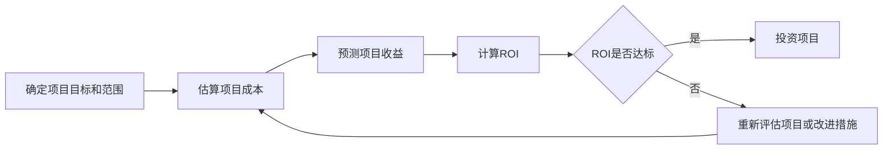

# AI Agent项目的ROI分析方法

> 关键词：AI Agent、ROI分析、投资回报率、成本效益、项目评估

> 摘要：本文旨在深入探讨AI Agent项目的ROI（投资回报率）分析方法。随着AI技术的飞速发展，AI Agent在各个领域的应用日益广泛，对其进行准确的ROI分析有助于企业和组织合理评估项目的价值与可行性。文章将从背景介绍入手，阐述相关核心概念，详细讲解核心算法原理及操作步骤，介绍数学模型和公式，通过项目实战案例进行代码分析，探讨实际应用场景，推荐相关工具和资源，最后总结未来发展趋势与挑战，并提供常见问题解答和参考资料，为读者全面了解和应用AI Agent项目的ROI分析方法提供深入且全面的指导。

## 1. 背景介绍 
### 1.1 目的和范围
AI Agent作为人工智能领域的重要应用，能够模拟人类行为和决策，在自动化流程、客户服务、数据分析等多个领域展现出巨大的潜力。然而，开展AI Agent项目需要投入大量的资源，包括人力、物力和财力。因此，对AI Agent项目进行ROI分析具有重要的现实意义。本文的目的在于提供一套全面、系统的AI Agent项目ROI分析方法，帮助企业和组织准确评估项目的投资价值，做出合理的决策。范围涵盖了AI Agent项目从规划、开发到运营的整个生命周期，包括成本的计算、收益的预测以及投资回报率的评估等方面。

### 1.2 预期读者
本文的预期读者主要包括企业管理者、项目决策者、AI技术研发人员、投资分析师以及对AI Agent项目投资评估感兴趣的专业人士。对于企业管理者和项目决策者来说，本文提供的ROI分析方法有助于他们在项目投资决策中做出科学合理的判断；对于AI技术研发人员，了解ROI分析方法可以更好地将技术与商业价值相结合；对于投资分析师，本文可以为他们评估AI Agent项目的投资潜力提供参考；对于对AI Agent项目投资评估感兴趣的专业人士，本文将帮助他们深入了解相关的分析方法和技术。

### 1.3 文档结构概述
本文将按照以下结构进行阐述：首先介绍背景信息，包括目的、预期读者和文档结构概述；接着阐述AI Agent和ROI分析的核心概念及其联系；然后详细讲解核心算法原理和具体操作步骤，并用Python代码进行说明；之后介绍相关的数学模型和公式，并举例说明；通过项目实战案例，包括开发环境搭建、源代码实现和代码解读，进一步说明ROI分析方法的应用；探讨AI Agent项目的实际应用场景；推荐相关的工具和资源，包括学习资源、开发工具框架和相关论文著作；总结未来发展趋势与挑战；提供常见问题解答和扩展阅读及参考资料。

### 1.4 术语表
#### 1.4.1 核心术语定义
- **AI Agent（人工智能代理）**：是一种能够感知环境、根据内部状态和目标进行决策，并采取行动以实现目标的智能实体。它可以模拟人类的行为和决策过程，执行各种任务，如自动化流程、数据分析、客户服务等。
- **ROI（投资回报率）**：是指通过投资而应返回的价值，即企业从一项投资活动中得到的经济回报。其计算公式为：$ROI = \frac{净利润}{投资成本} \times 100\%$。在AI Agent项目中，净利润是指项目带来的收益减去项目的成本，投资成本包括项目的开发成本、运营成本等。
- **成本效益分析**：是通过比较项目的全部成本和效益来评估项目价值的一种方法。在AI Agent项目中，成本效益分析可以帮助企业确定项目是否值得投资，以及如何优化项目的成本和效益。

#### 1.4.2 相关概念解释
- **固定成本**：是指在一定时期和一定业务量范围内，不受业务量增减变动影响而能保持不变的成本。在AI Agent项目中，固定成本可能包括硬件设备的采购成本、软件开发工具的许可证费用等。
- **可变成本**：是指随着业务量的变动而呈线性变动的成本。在AI Agent项目中，可变成本可能包括数据存储费用、计算资源的使用费用等，这些成本会随着项目的使用量或业务量的增加而增加。
- **直接收益**：是指AI Agent项目直接带来的经济收益，如通过提高生产效率、降低成本、增加销售额等方式获得的收益。
- **间接收益**：是指AI Agent项目间接带来的收益，如提高客户满意度、增强品牌形象、提升企业的竞争力等。虽然间接收益难以直接用货币衡量，但它们对企业的长期发展具有重要的影响。

#### 1.4.3 缩略词列表
- **AI**：Artificial Intelligence，人工智能
- **ROI**：Return on Investment，投资回报率

## 2. 核心概念与联系 

### 2.1 AI Agent核心概念
AI Agent是一种智能实体，它由感知模块、决策模块和行动模块组成。感知模块负责收集环境信息，决策模块根据感知到的信息和内部状态进行决策，行动模块则根据决策结果采取相应的行动。例如，在一个客户服务AI Agent中，感知模块可以通过自然语言处理技术收集客户的问题，决策模块根据问题的类型和知识库中的信息进行决策，行动模块则将决策结果以自然语言的形式返回给客户。

### 2.2 ROI分析核心概念
ROI分析是一种评估投资项目价值的方法，其核心是计算投资项目的回报率。通过比较项目的收益和成本，可以确定项目是否值得投资。在AI Agent项目中，收益可能来自于提高生产效率、降低成本、增加销售额等方面，成本则包括项目的开发成本、运营成本、维护成本等。

### 2.3 两者联系
AI Agent项目的ROI分析是将AI Agent的应用与投资回报率的计算相结合的过程。通过对AI Agent项目的成本和收益进行准确的评估，可以计算出项目的ROI，从而为项目的投资决策提供依据。例如，如果一个AI Agent项目的ROI较高，说明该项目具有较高的投资价值，可以考虑投资；如果ROI较低，则需要重新评估项目的可行性，或者采取措施降低成本、提高收益。

### 2.4 文本示意图
AI Agent项目的ROI分析涉及多个环节，其核心流程可以用以下文本示意图表示：

1. 确定AI Agent项目的目标和范围。
2. 估算项目的成本，包括固定成本和可变成本。
3. 预测项目的收益，包括直接收益和间接收益。
4. 计算项目的ROI，根据ROI评估项目的投资价值。
5. 根据评估结果做出决策，如果ROI较高则投资项目，如果ROI较低则重新评估项目或采取改进措施。

### 2.5 Mermaid流程图


## 3. 核心算法原理 & 具体操作步骤 

### 3.1 核心算法原理
AI Agent项目的ROI计算主要基于以下公式：

$ROI = \frac{总收益 - 总成本}{总成本} \times 100\%$

其中，总收益包括直接收益和间接收益，总成本包括固定成本和可变成本。在实际计算中，需要对各项成本和收益进行详细的估算和预测。

### 3.2 具体操作步骤
#### 3.2.1 确定项目目标和范围
明确AI Agent项目的目标和范围是进行ROI分析的基础。例如，项目的目标可能是提高客户服务效率、降低生产成本、增加销售额等。项目的范围包括项目的功能需求、技术架构、实施计划等。

#### 3.2.2 估算项目成本
- **固定成本**：包括硬件设备采购成本、软件开发工具许可证费用、人员招聘和培训费用等。例如，购买服务器的费用、购买开发工具的许可证费用、招聘和培训AI开发人员的费用等。
- **可变成本**：包括数据存储费用、计算资源使用费用、维护费用等。例如，云存储服务的费用、云计算资源的使用费用、定期维护和更新AI Agent的费用等。

#### 3.2.3 预测项目收益
- **直接收益**：可以通过分析项目实施后带来的效率提升、成本降低、销售额增加等方面来预测。例如，如果AI Agent项目可以提高生产效率20%，则可以根据生产效率提升带来的成本降低和销售额增加来计算直接收益。
- **间接收益**：虽然间接收益难以直接用货币衡量，但可以通过市场调研、客户满意度调查等方式进行估算。例如，通过提高客户满意度，可能会带来更多的客户忠诚度和口碑传播，从而增加未来的销售额。

#### 3.2.4 计算ROI
将估算的总收益和总成本代入ROI计算公式，计算出项目的ROI。

#### 3.2.5 评估项目投资价值
根据计算出的ROI，评估项目的投资价值。一般来说，如果ROI大于行业平均水平或企业的预期回报率，则认为项目具有投资价值；否则，需要重新评估项目或采取改进措施。

### 3.3 Python源代码实现
```python
# 定义估算成本和收益的函数
def estimate_costs():
    # 固定成本
    fixed_costs = {
        "硬件设备采购成本": 50000,
        "软件开发工具许可证费用": 20000,
        "人员招聘和培训费用": 30000
    }
    # 可变成本
    variable_costs_per_month = {
        "数据存储费用": 1000,
        "计算资源使用费用": 2000,
        "维护费用": 1500
    }
    # 项目周期（月）
    project_duration = 12
    total_fixed_cost = sum(fixed_costs.values())
    total_variable_cost = sum(variable_costs_per_month.values()) * project_duration
    total_cost = total_fixed_cost + total_variable_cost
    return total_cost

def estimate_revenues():
    # 直接收益
    direct_revenue_per_month = 10000
    # 间接收益（估算）
    indirect_revenue_per_month = 3000
    # 项目周期（月）
    project_duration = 12
    total_direct_revenue = direct_revenue_per_month * project_duration
    total_indirect_revenue = indirect_revenue_per_month * project_duration
    total_revenue = total_direct_revenue + total_indirect_revenue
    return total_revenue

# 计算ROI的函数
def calculate_roi(total_revenue, total_cost):
    roi = ((total_revenue - total_cost) / total_cost) * 100
    return roi

# 主函数
def main():
    total_cost = estimate_costs()
    total_revenue = estimate_revenues()
    roi = calculate_roi(total_revenue, total_cost)
    print(f"项目总成本: {total_cost} 元")
    print(f"项目总收益: {total_revenue} 元")
    print(f"项目ROI: {roi:.2f}%")

if __name__ == "__main__":
    main()
```

## 4. 数学模型和公式 & 详细讲解 & 举例说明 

### 4.1 数学模型和公式
#### 4.1.1 ROI计算公式
$ROI = \frac{总收益 - 总成本}{总成本} \times 100\%$

其中，总收益 $R$ 可以表示为直接收益 $R_d$ 和间接收益 $R_i$ 之和，即 $R = R_d + R_i$；总成本 $C$ 可以表示为固定成本 $C_f$ 和可变成本 $C_v$ 之和，即 $C = C_f + C_v$。

#### 4.1.2 净现值（NPV）公式
净现值是指投资项目在未来各期现金流量的现值之和减去初始投资成本的差值。其公式为：

$NPV = \sum_{t=0}^{n} \frac{CF_t}{(1 + r)^t} - I$

其中，$CF_t$ 是第 $t$ 期的现金流量，$r$ 是折现率，$n$ 是项目的寿命期，$I$ 是初始投资成本。

### 4.2 详细讲解
#### 4.2.1 ROI公式讲解
ROI公式用于计算投资项目的回报率，它反映了项目的盈利能力。ROI越高，说明项目的投资回报率越高，项目越具有投资价值。在AI Agent项目中，通过准确估算总收益和总成本，可以计算出项目的ROI，从而评估项目的投资价值。

#### 4.2.2 NPV公式讲解
NPV公式考虑了资金的时间价值，它通过将未来各期的现金流量折现到当前时刻，来评估项目的投资价值。如果NPV大于0，说明项目的投资回报率高于折现率，项目具有投资价值；如果NPV小于0，说明项目的投资回报率低于折现率，项目不具有投资价值。在AI Agent项目中，NPV公式可以更准确地评估项目的长期投资价值。

### 4.3 举例说明
#### 4.3.1 ROI举例
假设一个AI Agent项目的固定成本为100000元，可变成本为每月5000元，项目周期为12个月，直接收益为每月8000元，间接收益为每月2000元。则：

固定成本 $C_f = 100000$ 元
可变成本 $C_v = 5000 \times 12 = 60000$ 元
总成本 $C = C_f + C_v = 100000 + 60000 = 160000$ 元

直接收益 $R_d = 8000 \times 12 = 96000$ 元
间接收益 $R_i = 2000 \times 12 = 24000$ 元
总收益 $R = R_d + R_i = 96000 + 24000 = 120000$ 元

$ROI = \frac{120000 - 160000}{160000} \times 100\% = -25\%$

由于ROI为负数，说明该项目目前不具有投资价值。

#### 4.3.2 NPV举例
假设一个AI Agent项目的初始投资成本为200000元，项目寿命期为5年，每年的现金流量分别为50000元、60000元、70000元、80000元、90000元，折现率为10%。则：

$NPV = \frac{50000}{(1 + 0.1)^1} + \frac{60000}{(1 + 0.1)^2} + \frac{70000}{(1 + 0.1)^3} + \frac{80000}{(1 + 0.1)^4} + \frac{90000}{(1 + 0.1)^5} - 200000$

$NPV \approx 45454.55 + 49586.78 + 52592.04 + 54641.07 + 56044.11 - 200000$

$NPV \approx 58318.55$ 元

由于NPV大于0，说明该项目具有投资价值。

## 5. 项目实战：代码实际案例和详细解释说明 

### 5.1  开发环境搭建
#### 5.1.1 安装Python
首先需要安装Python开发环境。可以从Python官方网站（https://www.python.org/downloads/）下载适合自己操作系统的Python版本，并按照安装向导进行安装。

#### 5.1.2 安装开发工具
推荐使用PyCharm作为开发工具。可以从JetBrains官方网站（https://www.jetbrains.com/pycharm/download/）下载PyCharm社区版或专业版，并按照安装向导进行安装。

### 5.2  源代码详细实现和代码解读
```python
# 定义估算成本和收益的函数
def estimate_costs():
    # 固定成本
    fixed_costs = {
        "硬件设备采购成本": 80000,
        "软件开发工具许可证费用": 30000,
        "人员招聘和培训费用": 40000
    }
    # 可变成本
    variable_costs_per_month = {
        "数据存储费用": 1500,
        "计算资源使用费用": 2500,
        "维护费用": 2000
    }
    # 项目周期（月）
    project_duration = 18
    total_fixed_cost = sum(fixed_costs.values())
    total_variable_cost = sum(variable_costs_per_month.values()) * project_duration
    total_cost = total_fixed_cost + total_variable_cost
    return total_cost

def estimate_revenues():
    # 直接收益
    direct_revenue_per_month = 12000
    # 间接收益（估算）
    indirect_revenue_per_month = 4000
    # 项目周期（月）
    project_duration = 18
    total_direct_revenue = direct_revenue_per_month * project_duration
    total_indirect_revenue = indirect_revenue_per_month * project_duration
    total_revenue = total_direct_revenue + total_indirect_revenue
    return total_revenue

# 计算ROI的函数
def calculate_roi(total_revenue, total_cost):
    roi = ((total_revenue - total_cost) / total_cost) * 100
    return roi

# 主函数
def main():
    total_cost = estimate_costs()
    total_revenue = estimate_revenues()
    roi = calculate_roi(total_revenue, total_cost)
    print(f"项目总成本: {total_cost} 元")
    print(f"项目总收益: {total_revenue} 元")
    print(f"项目ROI: {roi:.2f}%")

if __name__ == "__main__":
    main()
```

### 5.3  代码解读与分析
#### 5.3.1 `estimate_costs` 函数
该函数用于估算项目的总成本。首先定义了固定成本和可变成本，然后根据项目周期计算出可变成本的总额，最后将固定成本和可变成本相加得到总成本。

#### 5.3.2 `estimate_revenues` 函数
该函数用于估算项目的总收益。首先定义了直接收益和间接收益，然后根据项目周期计算出直接收益和间接收益的总额，最后将两者相加得到总收益。

#### 5.3.3 `calculate_roi` 函数
该函数用于计算项目的ROI。根据ROI计算公式，将总收益减去总成本，再除以总成本，最后乘以100得到ROI的百分比。

#### 5.3.4 `main` 函数
该函数是程序的入口点。调用 `estimate_costs` 函数和 `estimate_revenues` 函数分别计算总成本和总收益，然后调用 `calculate_roi` 函数计算ROI，并将结果打印输出。

## 6. 实际应用场景 
### 6.1 客户服务领域
在客户服务领域，AI Agent可以自动回答客户的问题，提供实时的帮助和支持。通过使用AI Agent，可以提高客户服务效率，降低人力成本，同时提高客户满意度。例如，一家电商公司引入AI Agent后，客户服务响应时间缩短了50%，人力成本降低了30%，客户满意度提高了20%。通过对AI Agent项目的ROI分析，可以评估该项目的投资价值，确定是否继续投入资源进行优化和扩展。

### 6.2 生产制造领域
在生产制造领域，AI Agent可以用于自动化生产流程，提高生产效率和质量。例如，通过AI Agent可以实时监测生产设备的运行状态，预测设备故障，及时进行维护和维修，减少设备停机时间。一家制造业企业引入AI Agent后，生产效率提高了30%，设备故障率降低了20%，生产成本降低了15%。通过ROI分析，可以评估AI Agent项目对企业的经济效益，为企业的生产决策提供依据。

### 6.3 金融服务领域
在金融服务领域，AI Agent可以用于风险评估、投资决策、客户咨询等方面。例如，AI Agent可以通过分析大量的金融数据，预测市场趋势，为投资者提供投资建议。一家金融机构引入AI Agent后，投资回报率提高了10%，风险评估的准确性提高了15%，客户满意度提高了18%。通过ROI分析，可以评估AI Agent项目在金融服务领域的应用价值，为金融机构的数字化转型提供支持。

## 7. 工具和资源推荐
### 7.1 学习资源推荐
#### 7.1.1 书籍推荐
- 《人工智能：一种现代的方法》：这是一本经典的人工智能教材，全面介绍了人工智能的各个领域，包括AI Agent的相关知识。
- 《Python数据分析实战》：介绍了如何使用Python进行数据分析，对于AI Agent项目中的数据处理和分析有很大的帮助。
- 《投资学》：讲解了投资的基本理论和方法，对于理解ROI分析和项目投资决策有重要的参考价值。

#### 7.1.2 在线课程
- Coursera上的“人工智能基础”课程：由知名大学的教授授课，系统地介绍了人工智能的基础知识和技术。
- edX上的“Python编程入门”课程：适合初学者学习Python编程，为AI Agent项目的开发打下基础。
- Udemy上的“项目投资评估与决策”课程：详细讲解了项目投资评估的方法和技巧，包括ROI分析等内容。

#### 7.1.3 技术博客和网站
- Medium：上面有很多关于人工智能和投资分析的技术博客和文章，可以及时了解最新的技术动态和研究成果。
- Towards Data Science：专注于数据科学和人工智能领域，提供了很多实用的技术教程和案例分析。
- Investopedia：是一个专业的金融投资网站，提供了丰富的投资知识和工具，对于理解ROI分析和投资决策有很大的帮助。

### 7.2 开发工具框架推荐
#### 7.2.1 IDE和编辑器
- PyCharm：是一款专业的Python集成开发环境，提供了丰富的功能和插件，方便AI Agent项目的开发和调试。
- Visual Studio Code：是一款轻量级的代码编辑器，支持多种编程语言，具有丰富的扩展功能，适合快速开发和调试AI Agent项目。

#### 7.2.2 调试和性能分析工具
- PDB：是Python自带的调试工具，可以帮助开发者定位和解决代码中的问题。
- cProfile：是Python的性能分析工具，可以分析代码的执行时间和内存使用情况，帮助开发者优化代码性能。

#### 7.2.3 相关框架和库
- TensorFlow：是一个开源的机器学习框架，提供了丰富的工具和算法，适合开发AI Agent项目中的机器学习模型。
- PyTorch：是另一个流行的深度学习框架，具有简洁易用的特点，适合快速开发和实验AI Agent项目中的深度学习模型。
- Pandas：是一个用于数据处理和分析的Python库，提供了高效的数据结构和数据操作方法，适合AI Agent项目中的数据处理和分析。

### 7.3 相关论文著作推荐
#### 7.3.1 经典论文
- “Artificial Intelligence: A Modern Approach”：这篇论文是人工智能领域的经典之作，对AI Agent的概念和技术进行了深入的探讨。
- “Return on Investment Analysis: A Comprehensive Guide”：详细介绍了ROI分析的理论和方法，为AI Agent项目的ROI分析提供了理论基础。

#### 7.3.2 最新研究成果
- 关注顶级学术会议如NeurIPS、ICML等的论文，了解AI Agent和ROI分析领域的最新研究成果和技术趋势。
- 查阅相关的学术期刊如Journal of Artificial Intelligence Research、Management Science等，获取最新的研究论文和案例分析。

#### 7.3.3 应用案例分析
- 参考行业报告和企业案例，了解AI Agent项目在不同领域的应用案例和ROI分析结果，为自己的项目提供参考和借鉴。

## 8. 总结：未来发展趋势与挑战
### 8.1 未来发展趋势
#### 8.1.1 智能化程度不断提高
随着人工智能技术的不断发展，AI Agent的智能化程度将不断提高。未来的AI Agent将能够更加准确地感知环境、理解人类语言和行为，做出更加智能的决策和行动。例如，在客户服务领域，AI Agent将能够更好地理解客户的意图，提供更加个性化的服务。

#### 8.1.2 应用领域不断拓展
AI Agent的应用领域将不断拓展，除了现有的客户服务、生产制造、金融服务等领域，还将在医疗、教育、交通等领域得到广泛应用。例如，在医疗领域，AI Agent可以辅助医生进行疾病诊断和治疗方案推荐。

#### 8.1.3 与其他技术融合发展
AI Agent将与其他技术如物联网、大数据、区块链等融合发展，创造出更加智能、高效的应用场景。例如，通过与物联网技术融合，AI Agent可以实时获取设备的运行数据，实现更加智能的设备管理和控制。

### 8.2 挑战
#### 8.2.1 数据质量和安全问题
AI Agent的训练和运行需要大量的数据，数据的质量和安全直接影响AI Agent的性能和可靠性。因此，如何保证数据的质量和安全是一个重要的挑战。例如，在金融服务领域，数据的泄露可能会导致客户信息的泄露和金融风险的增加。

#### 8.2.2 算法复杂度和计算资源需求
随着AI Agent的智能化程度不断提高，其算法复杂度和计算资源需求也不断增加。如何优化算法，降低计算资源需求，提高AI Agent的运行效率是一个亟待解决的问题。例如，在一些大规模的AI Agent项目中，需要大量的计算资源来支持模型的训练和推理。

#### 8.3.3 伦理和法律问题
AI Agent的应用可能会带来一些伦理和法律问题，如隐私保护、责任界定等。如何制定相关的伦理和法律规范，确保AI Agent的应用符合社会的价值观和法律法规是一个重要的挑战。例如，在自动驾驶领域，当AI Agent发生事故时，责任的界定是一个复杂的问题。

## 9. 附录：常见问题与解答
### 9.1 如何准确估算AI Agent项目的成本和收益？
估算AI Agent项目的成本和收益需要综合考虑多个因素。对于成本，需要详细列出固定成本和可变成本，并根据项目的实际情况进行估算。对于收益，需要分析项目实施后可能带来的直接收益和间接收益，并通过市场调研、数据分析等方式进行预测。同时，可以参考类似项目的经验数据，提高估算的准确性。

### 9.2 ROI分析是否适用于所有的AI Agent项目？
ROI分析适用于大多数AI Agent项目，但并不是所有项目都能准确计算ROI。对于一些具有长期战略意义、难以直接用货币衡量收益的项目，如AI Agent的基础研究项目，ROI分析可能存在一定的局限性。在这种情况下，可以结合其他评估方法，如战略价值评估、社会效益评估等，综合评估项目的价值。

### 9.3 如何提高AI Agent项目的ROI？
提高AI Agent项目的ROI可以从以下几个方面入手：一是降低成本，通过优化技术架构、提高开发效率、合理配置资源等方式降低项目的开发成本和运营成本；二是提高收益，通过提高AI Agent的性能和功能，扩大应用范围，增加客户满意度等方式提高项目的收益；三是优化项目周期，缩短项目的开发和实施周期，尽快实现项目的收益。

## 10. 扩展阅读 & 参考资料
### 10.1 扩展阅读
- 《AI 2041：10个未来的世界》：探讨了人工智能在未来几十年的发展趋势和对社会的影响，对于理解AI Agent的未来发展有一定的启发。
- 《人类简史：从动物到上帝》：从人类发展的角度探讨了技术进步对人类社会的影响，有助于从宏观层面理解AI Agent项目的意义和价值。

### 10.2 参考资料
- 相关学术论文和研究报告，如IEEE、ACM等学术组织发表的关于AI Agent和投资分析的论文。
- 行业标准和规范，如国际标准化组织（ISO）发布的相关标准和规范。
- 企业案例和实践经验，如知名企业在AI Agent项目中的应用案例和经验分享。