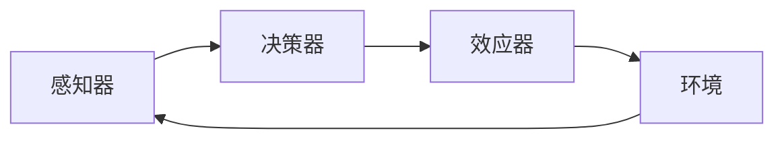
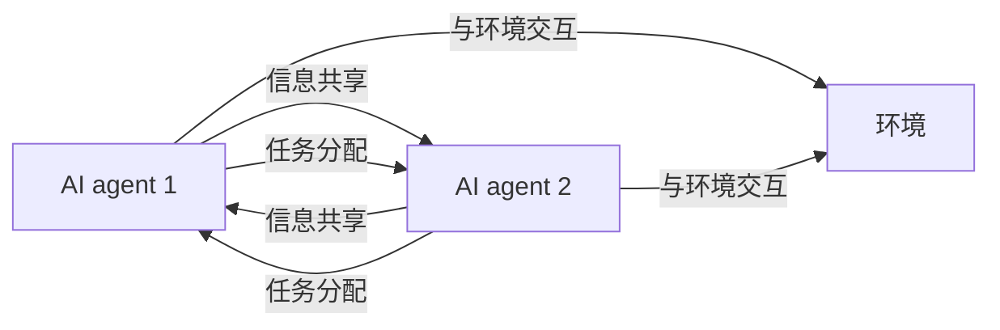

# AI agents协作进行全球资金流动分析：预测市场走向

> 关键词：AI agents、全球资金流动分析、市场走向预测、协作机制、数据分析

> 摘要：本文聚焦于利用AI agents协作进行全球资金流动分析并预测市场走向这一前沿领域。首先介绍了该研究的背景，包括目的、预期读者等内容。接着深入阐述了AI agents的核心概念及其相互联系，详细讲解了用于资金流动分析和市场预测的核心算法原理与具体操作步骤，并给出了相应的数学模型和公式。通过项目实战部分，展示了如何搭建开发环境、实现源代码及对代码进行解读分析。探讨了该技术的实际应用场景，推荐了相关的学习资源、开发工具框架和论文著作。最后总结了未来发展趋势与挑战，还给出了常见问题的解答以及扩展阅读和参考资料，旨在为读者全面呈现利用AI agents进行全球资金流动分析和市场走向预测的技术全貌。

## 1. 背景介绍 
### 1.1 目的和范围
全球资金流动是一个复杂且动态变化的过程，其涉及到全球各个国家和地区的金融市场、企业、投资者等众多参与主体。准确分析全球资金流动情况并预测市场走向，对于投资者制定投资策略、金融机构进行风险管理、政府制定宏观经济政策等都具有至关重要的意义。本研究的目的在于利用AI agents的协作能力，对全球资金流动数据进行深入分析，挖掘其中的潜在规律，从而实现对市场走向的准确预测。

研究范围涵盖了全球主要金融市场的资金流动数据，包括股票市场、债券市场、外汇市场等。同时，还会考虑宏观经济指标、政治事件、地缘政治等因素对资金流动和市场走向的影响。

### 1.2 预期读者
本文预期读者包括金融领域的从业者，如投资者、金融分析师、风险管理专家等，他们可以从本文中获取利用先进技术进行市场分析和预测的方法和思路。计算机科学领域的研究人员和开发者也可以从本文中了解到AI agents在金融领域的应用场景和技术实现细节。此外，对金融市场和人工智能技术感兴趣的广大爱好者也能通过本文拓宽知识面。

### 1.3 文档结构概述
本文首先介绍了研究的背景信息，包括目的、预期读者和文档结构概述等内容。接着详细阐述了AI agents的核心概念及其相互联系，通过文本示意图和Mermaid流程图进行直观展示。然后讲解了核心算法原理和具体操作步骤，并给出了Python源代码示例。在数学模型和公式部分，使用LaTeX格式呈现相关公式并进行详细讲解和举例说明。项目实战部分展示了开发环境的搭建、源代码的实现和解读分析。探讨了实际应用场景，推荐了相关的学习资源、开发工具框架和论文著作。最后总结了未来发展趋势与挑战，给出了常见问题的解答以及扩展阅读和参考资料。

### 1.4 术语表
#### 1.4.1 核心术语定义
- **AI agents（人工智能代理）**：是一种能够感知环境、根据自身的知识和目标进行决策，并采取行动以实现目标的智能实体。在本文中，AI agents用于对全球资金流动数据进行分析和处理。
- **全球资金流动**：指的是资金在全球范围内的流动情况，包括不同国家和地区之间的资金转移、不同金融市场之间的资金配置等。
- **市场走向预测**：通过对各种相关数据的分析和研究，预测金融市场未来的发展趋势，如股票市场的涨跌、汇率的变化等。

#### 1.4.2 相关概念解释
- **协作机制**：在AI agents系统中，协作机制是指多个AI agents之间如何进行信息共享、任务分配和协同工作，以实现共同的目标。
- **数据分析**：是指对大量的数据进行收集、整理、清洗、分析和挖掘，以发现其中的规律和价值。在本文中，数据分析主要用于处理全球资金流动数据。

#### 1.4.3 缩略词列表
- **AI**：Artificial Intelligence（人工智能）
- **ML**：Machine Learning（机器学习）
- **DL**：Deep Learning（深度学习）

## 2. 核心概念与联系 

### AI agents的概念原理
AI agents是一种具有自主决策和行动能力的智能实体。它由感知模块、决策模块和行动模块组成。感知模块负责收集环境信息，决策模块根据感知到的信息和自身的知识、目标进行决策，行动模块则根据决策结果采取相应的行动。

例如，在全球资金流动分析中，AI agents的感知模块可以收集股票市场、债券市场、外汇市场等的交易数据、宏观经济指标等信息。决策模块根据这些信息，利用机器学习和深度学习算法进行分析和预测，判断市场的走向。行动模块则可以根据预测结果，向投资者提供投资建议或进行自动化交易。

### AI agents的架构
AI agents的架构可以分为单个AI agent架构和多AI agent架构。单个AI agent架构主要由感知器、效应器和决策器组成，如图1所示：



在多AI agent架构中，多个AI agents之间通过协作机制进行信息共享和任务分配，以实现更复杂的目标。多AI agent架构如图2所示：



### AI agents之间的联系
在全球资金流动分析和市场走向预测中，不同的AI agents可以承担不同的任务。例如，有的AI agents负责收集和整理数据，有的AI agents负责数据分析和模型训练，有的AI agents负责市场预测和结果输出。这些AI agents之间通过协作机制进行信息共享和任务分配，形成一个有机的整体。

例如，数据收集AI agent将收集到的全球资金流动数据发送给数据分析AI agent，数据分析AI agent对数据进行清洗、预处理和特征提取后，将处理后的数据发送给模型训练AI agent。模型训练AI agent利用机器学习和深度学习算法对数据进行训练，得到预测模型。预测AI agent则利用训练好的模型对市场走向进行预测，并将预测结果发送给用户。

## 3. 核心算法原理 & 具体操作步骤 

### 核心算法原理
在全球资金流动分析和市场走向预测中，常用的算法包括机器学习算法和深度学习算法。以下以支持向量机（SVM）和长短期记忆网络（LSTM）为例，介绍其原理。

#### 支持向量机（SVM）
支持向量机是一种常用的机器学习算法，用于分类和回归分析。其基本思想是在特征空间中找到一个最优的超平面，使得不同类别的样本能够被最大程度地分开。

对于线性可分的情况，假设有一个训练数据集 $D = \{(x_1, y_1), (x_2, y_2), \cdots, (x_n, y_n)\}$，其中 $x_i \in \mathbb{R}^d$ 是样本特征向量，$y_i \in \{-1, +1\}$ 是样本标签。支持向量机的目标是找到一个超平面 $w^T x + b = 0$，使得所有正样本满足 $w^T x_i + b \geq 1$，所有负样本满足 $w^T x_i + b \leq -1$，并且使得间隔 $\frac{2}{\|w\|}$ 最大。这可以转化为以下优化问题：

$$
\begin{aligned}
\min_{w, b} &\quad \frac{1}{2} \|w\|^2 \\
\text{s.t.} &\quad y_i (w^T x_i + b) \geq 1, \quad i = 1, 2, \cdots, n
\end{aligned}
$$

对于线性不可分的情况，可以引入松弛变量 $\xi_i \geq 0$，将优化问题变为：

$$
\begin{aligned}
\min_{w, b, \xi} &\quad \frac{1}{2} \|w\|^2 + C \sum_{i=1}^{n} \xi_i \\
\text{s.t.} &\quad y_i (w^T x_i + b) \geq 1 - \xi_i, \quad i = 1, 2, \cdots, n \\
&\quad \xi_i \geq 0, \quad i = 1, 2, \cdots, n
\end{aligned}
$$

其中 $C$ 是惩罚参数。

#### 长短期记忆网络（LSTM）
长短期记忆网络是一种特殊的循环神经网络，能够处理序列数据中的长期依赖关系。LSTM的基本单元由输入门、遗忘门、输出门和细胞状态组成。

遗忘门决定了上一时刻的细胞状态 $C_{t-1}$ 中有多少信息需要被遗忘：

$$
f_t = \sigma(W_f [h_{t-1}, x_t] + b_f)
$$

输入门决定了当前输入 $x_t$ 中有多少信息需要被添加到细胞状态中：

$$
i_t = \sigma(W_i [h_{t-1}, x_t] + b_i)
$$

$$
\tilde{C}_t = \tanh(W_C [h_{t-1}, x_t] + b_C)
$$

细胞状态的更新公式为：

$$
C_t = f_t \odot C_{t-1} + i_t \odot \tilde{C}_t
$$

输出门决定了当前细胞状态 $C_t$ 中有多少信息需要被输出：

$$
o_t = \sigma(W_o [h_{t-1}, x_t] + b_o)
$$

$$
h_t = o_t \odot \tanh(C_t)
$$

其中 $\sigma$ 是 sigmoid 函数，$\tanh$ 是双曲正切函数，$W$ 是权重矩阵，$b$ 是偏置向量，$\odot$ 表示逐元素相乘。

### 具体操作步骤

#### 数据收集
使用数据收集AI agent收集全球资金流动数据，包括股票市场的交易数据、债券市场的收益率数据、外汇市场的汇率数据等。同时，收集宏观经济指标、政治事件、地缘政治等相关数据。

#### 数据预处理
对收集到的数据进行清洗、去重、缺失值处理等操作。然后进行数据标准化和归一化处理，使得不同特征的数据具有相同的尺度。

#### 特征提取
从预处理后的数据中提取有用的特征，例如计算收益率、波动率、相关性等指标。可以使用主成分分析（PCA）等方法进行特征降维。

#### 模型训练
使用支持向量机、长短期记忆网络等算法对提取的特征进行训练。将数据集分为训练集和测试集，使用训练集进行模型训练，使用测试集进行模型评估。

#### 市场预测
使用训练好的模型对未来的市场走向进行预测。可以根据预测结果制定投资策略或进行风险管理。

### Python源代码示例

```python
import numpy as np
import pandas as pd
from sklearn.svm import SVC
from sklearn.preprocessing import StandardScaler
from sklearn.model_selection import train_test_split
from sklearn.metrics import accuracy_score
from tensorflow.keras.models import Sequential
from tensorflow.keras.layers import LSTM, Dense

# 数据收集和预处理
data = pd.read_csv('global_funds_flow_data.csv')
X = data.drop('label', axis=1).values
y = data['label'].values

scaler = StandardScaler()
X = scaler.fit_transform(X)

# 划分训练集和测试集
X_train, X_test, y_train, y_test = train_test_split(X, y, test_size=0.2, random_state=42)

# 支持向量机模型训练和预测
svm_model = SVC()
svm_model.fit(X_train, y_train)
svm_pred = svm_model.predict(X_test)
svm_accuracy = accuracy_score(y_test, svm_pred)
print(f"SVM Accuracy: {svm_accuracy}")

# 数据重塑为适合LSTM的格式
X_train_lstm = np.reshape(X_train, (X_train.shape[0], X_train.shape[1], 1))
X_test_lstm = np.reshape(X_test, (X_test.shape[0], X_test.shape[1], 1))

# 长短期记忆网络模型训练和预测
lstm_model = Sequential()
lstm_model.add(LSTM(50, input_shape=(X_train_lstm.shape[1], X_train_lstm.shape[2])))
lstm_model.add(Dense(1, activation='sigmoid'))
lstm_model.compile(loss='binary_crossentropy', optimizer='adam', metrics=['accuracy'])
lstm_model.fit(X_train_lstm, y_train, epochs=10, batch_size=32)
lstm_pred = lstm_model.predict(X_test_lstm)
lstm_pred = np.round(lstm_pred).flatten()
lstm_accuracy = accuracy_score(y_test, lstm_pred)
print(f"LSTM Accuracy: {lstm_accuracy}")
```

## 4. 数学模型和公式 & 详细讲解 & 举例说明 

### 支持向量机数学模型和公式
支持向量机的优化问题可以使用拉格朗日乘子法进行求解。引入拉格朗日乘子 $\alpha_i \geq 0$，$i = 1, 2, \cdots, n$，则拉格朗日函数为：

$$
L(w, b, \alpha) = \frac{1}{2} \|w\|^2 - \sum_{i=1}^{n} \alpha_i (y_i (w^T x_i + b) - 1)
$$

对 $w$ 和 $b$ 求偏导数并令其为0，得到：

$$
w = \sum_{i=1}^{n} \alpha_i y_i x_i
$$

$$
\sum_{i=1}^{n} \alpha_i y_i = 0
$$

将上述结果代入拉格朗日函数，得到对偶问题：

$$
\begin{aligned}
\max_{\alpha} &\quad \sum_{i=1}^{n} \alpha_i - \frac{1}{2} \sum_{i=1}^{n} \sum_{j=1}^{n} \alpha_i \alpha_j y_i y_j x_i^T x_j \\
\text{s.t.} &\quad \sum_{i=1}^{n} \alpha_i y_i = 0 \\
&\quad \alpha_i \geq 0, \quad i = 1, 2, \cdots, n
\end{aligned}
$$

求解对偶问题得到最优的拉格朗日乘子 $\alpha^*$，则最优的 $w$ 和 $b$ 可以通过以下公式计算：

$$
w^* = \sum_{i=1}^{n} \alpha_i^* y_i x_i
$$

$$
b^* = y_j - w^{*T} x_j, \quad \text{for any } j \text{ such that } 0 < \alpha_j^* < C
$$

#### 举例说明
假设有一个二维数据集，包含两个类别，样本点如下：

$$
\begin{aligned}
x_1 &= (3, 3)^T, \quad y_1 = +1 \\
x_2 &= (4, 3)^T, \quad y_2 = +1 \\
x_3 &= (1, 1)^T, \quad y_3 = -1
\end{aligned}
$$

根据对偶问题的公式，我们可以列出方程组进行求解。这里省略具体的求解过程，最终得到最优的 $w$ 和 $b$，从而得到最优的超平面。

### 长短期记忆网络数学模型和公式
长短期记忆网络的数学模型和公式在前面已经详细介绍过。这里通过一个简单的例子来说明LSTM的工作原理。

假设我们有一个时间序列数据 $x = [x_1, x_2, x_3]$，初始的细胞状态 $C_0 = 0$，初始的隐藏状态 $h_0 = 0$。

首先计算遗忘门 $f_1$：

$$
f_1 = \sigma(W_f [h_0, x_1] + b_f)
$$

然后计算输入门 $i_1$ 和候选细胞状态 $\tilde{C}_1$：

$$
i_1 = \sigma(W_i [h_0, x_1] + b_i)
$$

$$
\tilde{C}_1 = \tanh(W_C [h_0, x_1] + b_C)
$$

更新细胞状态 $C_1$：

$$
C_1 = f_1 \odot C_0 + i_1 \odot \tilde{C}_1
$$

计算输出门 $o_1$ 和隐藏状态 $h_1$：

$$
o_1 = \sigma(W_o [h_0, x_1] + b_o)
$$

$$
h_1 = o_1 \odot \tanh(C_1)
$$

重复上述步骤，计算 $t = 2, 3$ 时刻的细胞状态和隐藏状态。

## 5. 项目实战：代码实际案例和详细解释说明 

### 5.1  开发环境搭建
#### 操作系统
可以选择Windows、Linux或macOS等操作系统。这里以Ubuntu 20.04为例进行说明。

#### 编程语言和版本
使用Python 3.8及以上版本。可以通过以下命令安装Python：

```bash
sudo apt update
sudo apt install python3.8
```

#### 依赖库安装
安装必要的依赖库，如NumPy、Pandas、Scikit-learn、TensorFlow等。可以使用以下命令进行安装：

```bash
pip install numpy pandas scikit-learn tensorflow
```

### 5.2  源代码详细实现和代码解读
以下是一个完整的项目实战代码示例，包括数据收集、预处理、特征提取、模型训练和预测等步骤。

```python
import numpy as np
import pandas as pd
from sklearn.preprocessing import StandardScaler
from sklearn.model_selection import train_test_split
from sklearn.svm import SVC
from sklearn.metrics import accuracy_score
from tensorflow.keras.models import Sequential
from tensorflow.keras.layers import LSTM, Dense

# 数据收集
def collect_data(file_path):
    data = pd.read_csv(file_path)
    return data

# 数据预处理
def preprocess_data(data):
    X = data.drop('label', axis=1).values
    y = data['label'].values

    scaler = StandardScaler()
    X = scaler.fit_transform(X)

    return X, y

# 划分训练集和测试集
def split_data(X, y, test_size=0.2, random_state=42):
    X_train, X_test, y_train, y_test = train_test_split(X, y, test_size=test_size, random_state=random_state)
    return X_train, X_test, y_train, y_test

# 支持向量机模型训练和预测
def train_and_predict_svm(X_train, X_test, y_train, y_test):
    svm_model = SVC()
    svm_model.fit(X_train, y_train)
    svm_pred = svm_model.predict(X_test)
    svm_accuracy = accuracy_score(y_test, svm_pred)
    print(f"SVM Accuracy: {svm_accuracy}")
    return svm_pred

# 长短期记忆网络模型训练和预测
def train_and_predict_lstm(X_train, X_test, y_train, y_test):
    X_train_lstm = np.reshape(X_train, (X_train.shape[0], X_train.shape[1], 1))
    X_test_lstm = np.reshape(X_test, (X_test.shape[0], X_test.shape[1], 1))

    lstm_model = Sequential()
    lstm_model.add(LSTM(50, input_shape=(X_train_lstm.shape[1], X_train_lstm.shape[2])))
    lstm_model.add(Dense(1, activation='sigmoid'))
    lstm_model.compile(loss='binary_crossentropy', optimizer='adam', metrics=['accuracy'])
    lstm_model.fit(X_train_lstm, y_train, epochs=10, batch_size=32)
    lstm_pred = lstm_model.predict(X_test_lstm)
    lstm_pred = np.round(lstm_pred).flatten()
    lstm_accuracy = accuracy_score(y_test, lstm_pred)
    print(f"LSTM Accuracy: {lstm_accuracy}")
    return lstm_pred

# 主函数
def main():
    file_path = 'global_funds_flow_data.csv'
    data = collect_data(file_path)
    X, y = preprocess_data(data)
    X_train, X_test, y_train, y_test = split_data(X, y)
    svm_pred = train_and_predict_svm(X_train, X_test, y_train, y_test)
    lstm_pred = train_and_predict_lstm(X_train, X_test, y_train, y_test)

if __name__ == "__main__":
    main()
```

### 5.3  代码解读与分析
- **数据收集**：`collect_data` 函数用于读取CSV文件中的数据。
- **数据预处理**：`preprocess_data` 函数对数据进行清洗、标准化处理，将特征数据和标签数据分离。
- **划分训练集和测试集**：`split_data` 函数将数据集划分为训练集和测试集，方便后续的模型训练和评估。
- **支持向量机模型训练和预测**：`train_and_predict_svm` 函数使用支持向量机算法对训练集进行训练，并对测试集进行预测，最后输出模型的准确率。
- **长短期记忆网络模型训练和预测**：`train_and_predict_lstm` 函数将数据重塑为适合LSTM的格式，构建LSTM模型并进行训练和预测，输出模型的准确率。
- **主函数**：`main` 函数调用上述各个函数，完成整个项目的流程。

## 6. 实际应用场景 
### 投资者决策支持
投资者可以利用AI agents协作进行全球资金流动分析和市场走向预测的结果，制定投资策略。例如，根据预测结果选择投资的股票、债券、外汇等资产，调整投资组合的比例，以实现资产的增值和风险的控制。

### 金融机构风险管理
金融机构可以通过分析全球资金流动情况，及时发现潜在的风险。例如，当某个地区的资金大量流出时，可能预示着该地区的金融市场存在不稳定因素，金融机构可以提前采取措施，如减少对该地区的投资、增加风险准备金等，以降低风险。

### 政府宏观经济政策制定
政府可以根据全球资金流动分析和市场走向预测的结果，制定宏观经济政策。例如，当预测到资金大量流入本国时，政府可以采取措施引导资金流向实体经济，促进经济增长；当预测到资金大量流出时，政府可以采取措施稳定汇率，防止金融市场动荡。

### 企业战略规划
企业可以根据市场走向预测的结果，制定战略规划。例如，当预测到某个行业的市场前景良好时，企业可以加大对该行业的投资，扩大生产规模；当预测到市场需求下降时，企业可以调整产品结构，降低库存。

## 7. 工具和资源推荐
### 7.1 学习资源推荐
#### 7.1.1 书籍推荐
- 《机器学习》（周志华著）：全面介绍了机器学习的基本概念、算法和应用，是机器学习领域的经典教材。
- 《深度学习》（Ian Goodfellow、Yoshua Bengio和Aaron Courville著）：深入讲解了深度学习的原理和方法，是深度学习领域的权威著作。
- 《Python数据分析实战》（Sebastian Raschka著）：介绍了如何使用Python进行数据分析和处理，适合初学者学习。

#### 7.1.2 在线课程
- Coursera上的“机器学习”课程（Andrew Ng教授主讲）：是一门非常经典的机器学习课程，讲解深入浅出，适合初学者入门。
- edX上的“深度学习基础”课程：由微软提供，系统地介绍了深度学习的基本概念和方法。
- Kaggle上的数据分析和机器学习教程：提供了丰富的实践项目和案例，适合有一定基础的学习者提高实践能力。

#### 7.1.3 技术博客和网站
- Medium：有很多关于人工智能、机器学习和金融科技的优质博客文章，可以及时了解最新的技术动态和研究成果。
- Towards Data Science：专注于数据科学和机器学习领域的技术分享，有很多实用的教程和案例。
- arXiv：是一个预印本平台，提供了大量的学术论文，可以了解最新的研究进展。

### 7.2 开发工具框架推荐
#### 7.2.1 IDE和编辑器
- PyCharm：是一款专业的Python集成开发环境，提供了丰富的功能和插件，方便代码的编写、调试和管理。
- Jupyter Notebook：是一个交互式的开发环境，适合进行数据分析和模型训练的实验和演示。
- Visual Studio Code：是一款轻量级的代码编辑器，支持多种编程语言，有丰富的插件可以扩展功能。

#### 7.2.2 调试和性能分析工具
- TensorBoard：是TensorFlow提供的可视化工具，可以用于查看模型的训练过程、损失函数的变化、参数的分布等信息，方便调试和优化模型。
- Scikit-learn的交叉验证和模型评估工具：可以用于评估模型的性能，选择最优的模型参数。
- PyTorch Profiler：是PyTorch提供的性能分析工具，可以帮助用户找出代码中的性能瓶颈，优化代码性能。

#### 7.2.3 相关框架和库
- Scikit-learn：是一个简单易用的机器学习库，提供了各种机器学习算法和工具，如分类、回归、聚类、特征提取等。
- TensorFlow：是一个开源的深度学习框架，由Google开发，广泛应用于图像识别、自然语言处理、语音识别等领域。
- PyTorch：是另一个流行的深度学习框架，由Facebook开发，具有动态图的特点，方便用户进行模型的开发和调试。

### 7.3 相关论文著作推荐
#### 7.3.1 经典论文
- “Support-Vector Networks”（Cortes和Vapnik著）：是支持向量机领域的经典论文，详细介绍了支持向量机的原理和算法。
- “Long Short-Term Memory”（Hochreiter和Schmidhuber著）：是长短期记忆网络领域的经典论文，首次提出了LSTM的概念和结构。

#### 7.3.2 最新研究成果
- 关注顶级学术会议如NeurIPS、ICML、CVPR等的论文，这些会议上的论文代表了人工智能领域的最新研究成果。
- 关注金融科技领域的学术期刊，如《Journal of Financial Economics》《Review of Financial Studies》等，了解金融领域的最新研究动态。

#### 7.3.3 应用案例分析
- 可以参考一些金融机构和科技公司的研究报告和案例分析，了解AI agents在全球资金流动分析和市场走向预测中的实际应用情况和效果。

## 8. 总结：未来发展趋势与挑战
### 未来发展趋势
- **多模态数据融合**：未来的AI agents将不仅仅依赖于结构化的金融数据，还会融合文本、图像、音频等多模态数据，以更全面地分析全球资金流动和市场走向。
- **强化学习的应用**：强化学习可以使AI agents在动态的市场环境中不断学习和优化决策策略，提高市场预测的准确性和投资收益。
- **跨领域协作**：AI agents将与其他领域的技术如区块链、物联网等进行跨领域协作，为全球资金流动分析和市场走向预测提供更丰富的数据和更强大的技术支持。
- **智能化决策系统**：未来将构建智能化的决策系统，AI agents可以根据市场情况自动做出决策，实现自动化交易和风险管理。

### 挑战
- **数据质量和隐私问题**：全球资金流动数据涉及到大量的敏感信息，数据的质量和隐私保护是一个重要的挑战。需要建立完善的数据管理和安全机制，确保数据的准确性和安全性。
- **模型可解释性**：深度学习模型通常是黑盒模型，其决策过程难以解释。在金融领域，模型的可解释性非常重要，需要研究如何提高模型的可解释性，让决策者能够理解模型的决策依据。
- **市场的复杂性和不确定性**：全球金融市场是一个复杂的系统，受到多种因素的影响，如政治事件、地缘政治、宏观经济政策等。这些因素的复杂性和不确定性增加了市场走向预测的难度。
- **技术的更新换代**：人工智能技术发展迅速，新的算法和模型不断涌现。需要不断学习和掌握新的技术，以保持竞争力。

## 9. 附录：常见问题与解答
### 1. AI agents协作的优势是什么？
AI agents协作可以充分发挥各个AI agent的优势，实现信息共享和任务分配。不同的AI agents可以承担不同的任务，如数据收集、数据分析、模型训练、市场预测等，从而提高整个系统的效率和性能。

### 2. 如何选择合适的算法进行市场走向预测？
选择合适的算法需要考虑数据的特点、问题的复杂度和预测的要求等因素。对于线性可分的问题，可以选择支持向量机等线性算法；对于处理序列数据和长期依赖关系的问题，可以选择长短期记忆网络等深度学习算法。此外，还可以通过交叉验证等方法比较不同算法的性能，选择最优的算法。

### 3. 数据预处理的重要性是什么？
数据预处理可以提高数据的质量和可用性。清洗数据可以去除噪声和异常值，填补缺失值可以保证数据的完整性，标准化和归一化处理可以使得不同特征的数据具有相同的尺度，有利于模型的训练和收敛。

### 4. 如何评估模型的性能？
可以使用多种指标来评估模型的性能，如准确率、召回率、F1值、均方误差等。对于分类问题，准确率是常用的评估指标；对于回归问题，均方误差是常用的评估指标。此外，还可以使用交叉验证等方法来评估模型的泛化能力。

### 5. 如何提高模型的预测准确性？
可以从以下几个方面提高模型的预测准确性：
- 收集更多、更有代表性的数据，提高数据的质量。
- 选择合适的算法和模型结构，进行模型调优。
- 进行特征工程，提取更有用的特征。
- 采用集成学习等方法，结合多个模型的预测结果。

## 10. 扩展阅读 & 参考资料
### 扩展阅读
- 《人工智能：一种现代的方法》（Stuart Russell和Peter Norvig著）：全面介绍了人工智能的基本概念、算法和应用，是人工智能领域的经典教材。
- 《金融科技前沿：技术驱动的金融创新》（谢平、邹传伟著）：介绍了金融科技的发展现状和未来趋势，探讨了技术驱动的金融创新。

### 参考资料
- 相关学术论文和研究报告，如在IEEE Xplore、ACM Digital Library等数据库中检索到的关于AI agents、全球资金流动分析和市场走向预测的论文。
- 金融机构和科技公司的官方网站和研究报告，如国际货币基金组织（IMF）、世界银行（WB）、高盛（Goldman Sachs）等的相关报告。