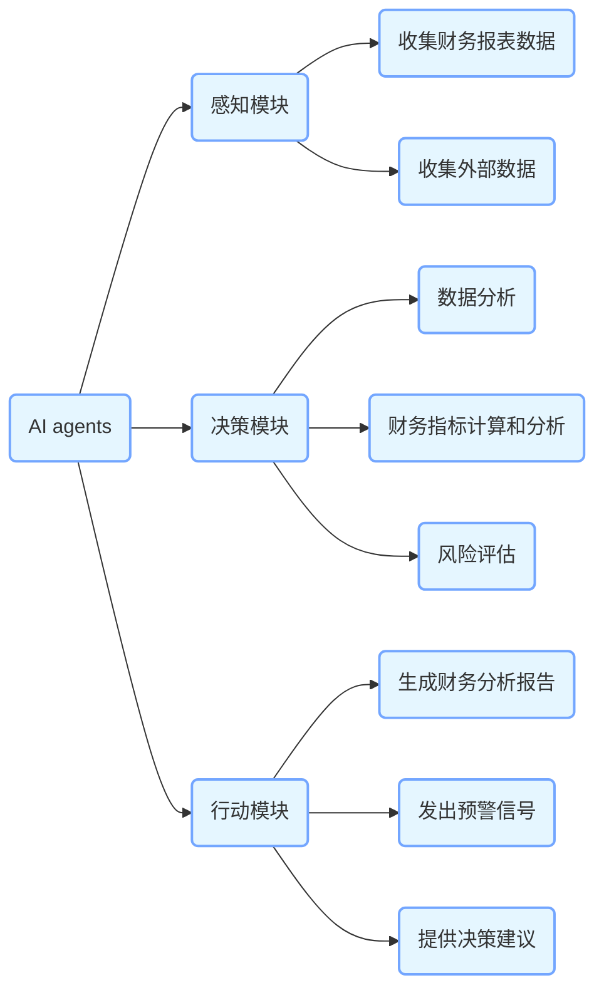

# AI agents在公司财务报表分析中的应用

> 关键词：AI agents、公司财务报表分析、人工智能、数据分析、自动化、决策支持、财务智能

> 摘要：本文深入探讨了AI agents在公司财务报表分析中的应用。随着人工智能技术的飞速发展，AI agents凭借其高效、智能的特点，在财务领域展现出巨大的应用潜力。文章首先介绍了相关背景，包括目的范围、预期读者等内容；接着阐述了AI agents及财务报表分析的核心概念与联系；详细讲解了其核心算法原理及具体操作步骤，结合数学模型和公式进行深入剖析；通过项目实战给出代码实际案例并进行详细解释；探讨了AI agents在财务报表分析中的实际应用场景；推荐了相关的学习资源、开发工具框架以及论文著作；最后总结了未来发展趋势与挑战，并提供了常见问题与解答及扩展阅读参考资料，旨在为相关从业者和研究者提供全面且深入的参考。

## 1. 背景介绍 
### 1.1 目的和范围
在当今竞争激烈的商业环境中，公司财务报表分析对于企业的决策制定、风险评估、战略规划等方面起着至关重要的作用。传统的财务报表分析方法往往依赖于人工操作，存在效率低下、容易出错、难以处理海量数据等问题。而AI agents作为人工智能领域的重要成果，具有自动化、智能化、高效性等特点，能够为财务报表分析带来新的突破和变革。

本文的目的在于全面探讨AI agents在公司财务报表分析中的应用，包括其原理、方法、实际案例等方面，旨在帮助读者深入了解AI agents在该领域的应用潜力和价值，为企业的财务决策提供更科学、更有效的支持。文章的范围涵盖了AI agents的基本概念、核心算法、数学模型，以及在财务报表分析中的具体应用场景和实际操作步骤等内容。

### 1.2 预期读者
本文的预期读者主要包括以下几类人群：
1. **财务从业者**：如财务分析师、会计师、财务经理等，他们可以通过本文了解AI agents在财务报表分析中的应用方法和技术，提升自己的工作效率和分析能力。
2. **企业管理者**：包括CEO、CFO等企业高层管理人员，他们可以通过本文了解AI agents在财务决策中的应用价值，为企业的战略规划和决策制定提供参考。
3. **人工智能研究者**：对AI agents在财务领域的应用感兴趣的研究者，可以通过本文了解相关的技术原理和应用案例，为进一步的研究提供思路。
4. **学生和教育工作者**：学习财务、会计、人工智能等相关专业的学生，以及从事相关教学工作的教育工作者，可以通过本文了解跨学科的知识和应用，拓宽自己的知识面和视野。

### 1.3 文档结构概述
本文的结构如下：
1. **背景介绍**：介绍文章的目的和范围、预期读者、文档结构概述以及相关术语表。
2. **核心概念与联系**：阐述AI agents和公司财务报表分析的核心概念，以及它们之间的联系，并通过文本示意图和Mermaid流程图进行展示。
3. **核心算法原理 & 具体操作步骤**：详细讲解AI agents在财务报表分析中使用的核心算法原理，并给出具体的操作步骤，结合Python源代码进行阐述。
4. **数学模型和公式 & 详细讲解 & 举例说明**：介绍相关的数学模型和公式，并进行详细讲解和举例说明。
5. **项目实战：代码实际案例和详细解释说明**：通过一个实际的项目案例，展示AI agents在财务报表分析中的应用，包括开发环境搭建、源代码详细实现和代码解读。
6. **实际应用场景**：探讨AI agents在公司财务报表分析中的实际应用场景，如财务风险评估、财务预测、财务决策支持等。
7. **工具和资源推荐**：推荐相关的学习资源、开发工具框架以及论文著作，帮助读者进一步深入学习和研究。
8. **总结：未来发展趋势与挑战**：总结AI agents在公司财务报表分析中的应用现状，分析未来的发展趋势和面临的挑战。
9. **附录：常见问题与解答**：提供常见问题的解答，帮助读者解决在学习和应用过程中遇到的问题。
10. **扩展阅读 & 参考资料**：提供相关的扩展阅读材料和参考资料，方便读者进一步深入学习和研究。

### 1.4 术语表
#### 1.4.1 核心术语定义
1. **AI agents（人工智能代理）**：是一种能够感知环境、根据环境信息进行决策并采取行动的智能实体。它可以通过学习和推理来完成各种任务，具有自主性、反应性、社会性等特点。
2. **公司财务报表分析**：是指通过对公司的财务报表（如资产负债表、利润表、现金流量表等）进行分析，评估公司的财务状况、经营成果和现金流量情况，为企业的决策制定提供依据。
3. **机器学习**：是一门多领域交叉学科，涉及概率论、统计学、逼近论、凸分析、算法复杂度理论等多门学科。它专门研究计算机怎样模拟或实现人类的学习行为，以获取新的知识或技能，重新组织已有的知识结构使之不断改善自身的性能。
4. **深度学习**：是机器学习的一个分支领域，它是一种基于对数据进行表征学习的方法。深度学习通过构建具有很多层的神经网络模型，自动从大量数据中学习特征和模式，从而实现对数据的分类、预测等任务。
5. **自然语言处理**：是计算机科学与语言学的交叉领域，主要研究如何让计算机理解和处理人类语言。自然语言处理技术可以应用于文本分析、信息提取、机器翻译等多个领域。

#### 1.4.2 相关概念解释
1. **财务比率分析**：是公司财务报表分析中常用的一种方法，通过计算各种财务比率（如偿债能力比率、盈利能力比率、营运能力比率等）来评估公司的财务状况和经营成果。
2. **趋势分析**：是指通过对公司多个期间的财务数据进行比较和分析，观察财务指标的变化趋势，从而预测公司未来的发展方向。
3. **因子分析**：是一种多元统计分析方法，它通过寻找公共因子来解释多个变量之间的相关性，从而简化数据结构，提取数据的主要信息。
4. **风险评估**：是指对公司面临的各种风险进行识别、分析和评估的过程，包括市场风险、信用风险、流动性风险等。

#### 1.4.3 缩略词列表
1. **AI**：Artificial Intelligence（人工智能）
2. **ML**：Machine Learning（机器学习）
3. **DL**：Deep Learning（深度学习）
4. **NLP**：Natural Language Processing（自然语言处理）
5. **CEO**：Chief Executive Officer（首席执行官）
6. **CFO**：Chief Financial Officer（首席财务官）

## 2. 核心概念与联系 
### 2.1 AI agents的核心概念
AI agents是人工智能领域的重要概念，它是一种能够感知环境、根据环境信息进行决策并采取行动的智能实体。AI agents通常由以下几个部分组成：
1. **感知模块**：负责感知环境中的信息，如传感器、摄像头等设备可以获取物理环境中的数据，网络接口可以获取网络中的信息。
2. **决策模块**：根据感知模块获取的信息，运用一定的算法和策略进行决策，确定下一步的行动方案。
3. **行动模块**：根据决策模块的决策结果，采取相应的行动，如控制机器人的运动、发送信息等。

AI agents具有自主性、反应性、社会性等特点。自主性是指AI agents能够独立地进行决策和行动，不需要人类的直接干预；反应性是指AI agents能够根据环境的变化及时调整自己的行为；社会性是指AI agents能够与其他智能实体进行交互和协作。

### 2.2 公司财务报表分析的核心概念
公司财务报表分析是指通过对公司的财务报表（如资产负债表、利润表、现金流量表等）进行分析，评估公司的财务状况、经营成果和现金流量情况，为企业的决策制定提供依据。公司财务报表分析的主要内容包括：
1. **财务状况分析**：通过对资产负债表的分析，评估公司的资产结构、负债水平、所有者权益状况等，了解公司的财务实力和偿债能力。
2. **经营成果分析**：通过对利润表的分析，评估公司的收入、成本、费用、利润等情况，了解公司的盈利能力和经营效率。
3. **现金流量分析**：通过对现金流量表的分析，评估公司的现金流入、流出情况，了解公司的现金获取能力和资金运作情况。

公司财务报表分析的方法主要包括比率分析、趋势分析、结构分析、比较分析等。这些方法可以帮助分析师从不同的角度对公司的财务报表进行分析，发现公司存在的问题和潜在的风险。

### 2.3 AI agents与公司财务报表分析的联系
AI agents在公司财务报表分析中具有重要的应用价值，主要体现在以下几个方面：
1. **自动化数据处理**：AI agents可以自动收集、整理和清洗公司的财务报表数据，提高数据处理的效率和准确性。
2. **智能分析和决策**：AI agents可以运用机器学习、深度学习等算法对财务报表数据进行分析和挖掘，发现数据中的规律和模式，为企业的决策制定提供智能支持。
3. **实时监控和预警**：AI agents可以实时监控公司的财务状况和经营成果，及时发现潜在的风险和问题，并发出预警信号，帮助企业及时采取措施进行防范和应对。
4. **自然语言处理**：AI agents可以运用自然语言处理技术对财务报表中的文本信息进行分析和理解，提取有用的信息，提高信息获取的效率和准确性。

### 2.4 文本示意图和Mermaid流程图
#### 2.4.1 文本示意图
AI agents在公司财务报表分析中的应用可以用以下文本示意图表示：

```plaintext
AI agents
├── 感知模块
│   ├── 收集财务报表数据
│   ├── 收集市场信息、行业数据等外部数据
├── 决策模块
│   ├── 运用机器学习、深度学习算法进行数据分析
│   ├── 运用财务分析方法进行财务指标计算和分析
│   ├── 运用风险评估模型进行风险评估
├── 行动模块
│   ├── 生成财务分析报告
│   ├── 发出预警信号
│   ├── 提供决策建议
```

#### 2.4.2 Mermaid流程图


## 3. 核心算法原理 & 具体操作步骤 
### 3.1 核心算法原理
AI agents在公司财务报表分析中常用的核心算法包括机器学习算法和深度学习算法，下面分别进行介绍。

#### 3.1.1 机器学习算法
1. **线性回归**：线性回归是一种用于预测连续变量的机器学习算法，它通过建立自变量和因变量之间的线性关系来进行预测。在线性回归中，我们假设因变量 $y$ 与自变量 $x_1, x_2, \cdots, x_n$ 之间存在线性关系，即：
$$y = \beta_0 + \beta_1x_1 + \beta_2x_2 + \cdots + \beta_nx_n + \epsilon$$
其中，$\beta_0, \beta_1, \cdots, \beta_n$ 是回归系数，$\epsilon$ 是误差项。线性回归的目标是通过最小化误差项的平方和来估计回归系数的值。

2. **逻辑回归**：逻辑回归是一种用于分类的机器学习算法，它通过建立自变量和因变量之间的逻辑关系来进行分类。在逻辑回归中，我们假设因变量 $y$ 是一个二分类变量，取值为 0 或 1，自变量 $x_1, x_2, \cdots, x_n$ 与因变量 $y$ 之间的关系可以用逻辑函数来表示，即：
$$P(y = 1|x_1, x_2, \cdots, x_n) = \frac{1}{1 + e^{-(\beta_0 + \beta_1x_1 + \beta_2x_2 + \cdots + \beta_nx_n)}}$$
其中，$P(y = 1|x_1, x_2, \cdots, x_n)$ 表示在给定自变量 $x_1, x_2, \cdots, x_n$ 的条件下，因变量 $y$ 取值为 1 的概率。逻辑回归的目标是通过最大化似然函数来估计回归系数的值。

3. **决策树**：决策树是一种基于树结构进行决策的机器学习算法，它通过对数据进行划分和递归构建决策树来进行分类和预测。决策树的每个内部节点表示一个特征或属性，每个分支表示一个特征值，每个叶节点表示一个类别或预测值。决策树的构建过程是一个递归的过程，它通过选择最优的特征和特征值来对数据进行划分，直到满足停止条件为止。

4. **随机森林**：随机森林是一种集成学习算法，它通过组合多个决策树来进行分类和预测。随机森林的基本思想是在训练过程中，从原始数据集中随机抽取多个子集，每个子集用于训练一个决策树，然后将这些决策树的结果进行综合，得到最终的分类或预测结果。随机森林可以有效地减少过拟合的问题，提高模型的泛化能力。

#### 3.1.2 深度学习算法
1. **人工神经网络**：人工神经网络是一种模仿人类神经系统的计算模型，它由多个神经元组成，每个神经元可以接收输入信号，并通过激活函数将输入信号转换为输出信号。人工神经网络可以分为输入层、隐藏层和输出层，其中隐藏层可以有多个。人工神经网络的训练过程是一个迭代的过程，它通过调整神经元之间的连接权重来最小化预测结果与真实结果之间的误差。

2. **循环神经网络（RNN）**：循环神经网络是一种专门用于处理序列数据的神经网络，它通过引入循环结构来捕捉序列数据中的时间依赖关系。循环神经网络的每个神经元不仅可以接收当前时刻的输入信号，还可以接收上一时刻的输出信号，从而实现对序列数据的处理。循环神经网络在自然语言处理、语音识别等领域有广泛的应用。

3. **长短期记忆网络（LSTM）**：长短期记忆网络是一种特殊的循环神经网络，它通过引入门控机制来解决循环神经网络中的梯度消失和梯度爆炸问题。长短期记忆网络的每个神经元包含输入门、遗忘门和输出门，这些门可以控制信息的流入、流出和保留，从而实现对序列数据的长期记忆。长短期记忆网络在时间序列预测、自然语言处理等领域有很好的应用效果。

### 3.2 具体操作步骤
下面以一个简单的财务风险评估案例为例，介绍AI agents在公司财务报表分析中的具体操作步骤。

#### 3.2.1 数据收集
首先，需要收集公司的财务报表数据，包括资产负债表、利润表、现金流量表等。同时，还可以收集市场信息、行业数据等外部数据，以提高分析的准确性。

#### 3.2.2 数据预处理
收集到的数据可能存在缺失值、异常值等问题，需要进行数据预处理。数据预处理的主要步骤包括：
1. **缺失值处理**：可以采用删除缺失值、填充缺失值等方法来处理缺失值。
2. **异常值处理**：可以采用统计方法、机器学习方法等方法来检测和处理异常值。
3. **数据标准化**：可以采用标准化、归一化等方法来对数据进行标准化处理，以提高模型的训练效果。

#### 3.2.3 特征工程
特征工程是指从原始数据中提取有用的特征，以提高模型的性能。在财务报表分析中，可以提取的特征包括财务比率、趋势指标、结构指标等。

#### 3.2.4 模型训练
选择合适的机器学习或深度学习算法，对预处理后的数据进行模型训练。在训练过程中，需要将数据分为训练集和测试集，以评估模型的性能。

#### 3.2.5 模型评估
使用测试集对训练好的模型进行评估，常用的评估指标包括准确率、召回率、F1值等。如果模型的性能不理想，可以调整模型的参数或选择其他算法进行训练。

#### 3.2.6 模型应用
将训练好的模型应用到实际的财务报表分析中，对公司的财务风险进行评估。根据评估结果，生成财务分析报告，发出预警信号，提供决策建议等。

### 3.3 Python源代码实现
下面是一个使用Python实现的简单的财务风险评估案例，采用逻辑回归算法进行分类。

```python
import pandas as pd
from sklearn.model_selection import train_test_split
from sklearn.linear_model import LogisticRegression
from sklearn.metrics import accuracy_score

# 数据收集和预处理
data = pd.read_csv('financial_data.csv')  # 读取财务数据
X = data.drop('risk', axis=1)  # 特征矩阵
y = data['risk']  # 标签

# 数据划分
X_train, X_test, y_train, y_test = train_test_split(X, y, test_size=0.2, random_state=42)

# 模型训练
model = LogisticRegression()
model.fit(X_train, y_train)

# 模型预测
y_pred = model.predict(X_test)

# 模型评估
accuracy = accuracy_score(y_test, y_pred)
print(f"模型准确率: {accuracy}")
```

在上述代码中，我们首先读取财务数据，然后将数据划分为特征矩阵 $X$ 和标签 $y$。接着，我们将数据分为训练集和测试集，使用逻辑回归算法进行模型训练。最后，我们使用测试集对模型进行评估，计算模型的准确率。

## 4. 数学模型和公式 & 详细讲解 & 举例说明 
### 4.1 线性回归模型
#### 4.1.1 数学公式
线性回归模型的数学公式为：
$$y = \beta_0 + \beta_1x_1 + \beta_2x_2 + \cdots + \beta_nx_n + \epsilon$$
其中，$y$ 是因变量，$x_1, x_2, \cdots, x_n$ 是自变量，$\beta_0, \beta_1, \cdots, \beta_n$ 是回归系数，$\epsilon$ 是误差项。

#### 4.1.2 详细讲解
线性回归模型的目标是通过最小化误差项的平方和来估计回归系数的值。误差项的平方和可以表示为：
$$S(\beta_0, \beta_1, \cdots, \beta_n) = \sum_{i = 1}^{m}(y_i - (\beta_0 + \beta_1x_{i1} + \beta_2x_{i2} + \cdots + \beta_nx_{in}))^2$$
其中，$m$ 是样本数量，$y_i$ 是第 $i$ 个样本的因变量值，$x_{i1}, x_{i2}, \cdots, x_{in}$ 是第 $i$ 个样本的自变量值。

为了最小化 $S(\beta_0, \beta_1, \cdots, \beta_n)$，我们可以对其求偏导数，并令偏导数等于 0，得到一组正规方程。解正规方程可以得到回归系数的估计值。

#### 4.1.3 举例说明
假设我们有一组财务数据，包括公司的销售额 $x$ 和利润 $y$，我们想要建立一个线性回归模型来预测利润。数据如下：

| 销售额 $x$ | 利润 $y$ |
| --- | --- |
| 100 | 20 |
| 200 | 30 |
| 300 | 40 |
| 400 | 50 |
| 500 | 60 |

我们可以使用Python的 `sklearn` 库来建立线性回归模型：

```python
import numpy as np
from sklearn.linear_model import LinearRegression

# 数据
X = np.array([[100], [200], [300], [400], [500]])
y = np.array([20, 30, 40, 50, 60])

# 模型训练
model = LinearRegression()
model.fit(X, y)

# 预测
new_X = np.array([[600]])
predicted_y = model.predict(new_X)
print(f"预测利润: {predicted_y}")
```

### 4.2 逻辑回归模型
#### 4.2.1 数学公式
逻辑回归模型的数学公式为：
$$P(y = 1|x_1, x_2, \cdots, x_n) = \frac{1}{1 + e^{-(\beta_0 + \beta_1x_1 + \beta_2x_2 + \cdots + \beta_nx_n)}}$$
其中，$P(y = 1|x_1, x_2, \cdots, x_n)$ 表示在给定自变量 $x_1, x_2, \cdots, x_n$ 的条件下，因变量 $y$ 取值为 1 的概率。

#### 4.2.2 详细讲解
逻辑回归模型的目标是通过最大化似然函数来估计回归系数的值。似然函数可以表示为：
$$L(\beta_0, \beta_1, \cdots, \beta_n) = \prod_{i = 1}^{m}P(y_i|x_{i1}, x_{i2}, \cdots, x_{in})$$
其中，$m$ 是样本数量，$y_i$ 是第 $i$ 个样本的因变量值，$x_{i1}, x_{i2}, \cdots, x_{in}$ 是第 $i$ 个样本的自变量值。

为了方便计算，我们通常对似然函数取对数，得到对数似然函数：
$$\log L(\beta_0, \beta_1, \cdots, \beta_n) = \sum_{i = 1}^{m}y_i\log P(y_i|x_{i1}, x_{i2}, \cdots, x_{in}) + (1 - y_i)\log(1 - P(y_i|x_{i1}, x_{i2}, \cdots, x_{in}))$$

为了最大化对数似然函数，我们可以使用梯度上升法等优化算法来求解回归系数的值。

#### 4.2.3 举例说明
假设我们有一组财务数据，包括公司的资产负债率 $x$ 和是否违约 $y$（0 表示不违约，1 表示违约），我们想要建立一个逻辑回归模型来预测公司是否违约。数据如下：

| 资产负债率 $x$ | 是否违约 $y$ |
| --- | --- |
| 0.2 | 0 |
| 0.3 | 0 |
| 0.4 | 0 |
| 0.5 | 1 |
| 0.6 | 1 |

我们可以使用Python的 `sklearn` 库来建立逻辑回归模型：

```python
import numpy as np
from sklearn.linear_model import LogisticRegression

# 数据
X = np.array([[0.2], [0.3], [0.4], [0.5], [0.6]])
y = np.array([0, 0, 0, 1, 1])

# 模型训练
model = LogisticRegression()
model.fit(X, y)

# 预测
new_X = np.array([[0.7]])
predicted_y = model.predict(new_X)
print(f"预测是否违约: {predicted_y}")
```

### 4.3 决策树模型
#### 4.3.1 数学公式
决策树模型没有明确的数学公式，它是一种基于树结构进行决策的模型。决策树的构建过程是一个递归的过程，它通过选择最优的特征和特征值来对数据进行划分，直到满足停止条件为止。

#### 4.3.2 详细讲解
决策树的构建过程主要包括以下几个步骤：
1. **特征选择**：选择一个最优的特征作为当前节点的划分特征。常用的特征选择方法包括信息增益、信息增益率、基尼指数等。
2. **数据划分**：根据选择的特征和特征值，将数据划分为多个子集。
3. **递归构建**：对每个子集递归地构建决策树，直到满足停止条件为止。停止条件可以是子集的样本数量小于某个阈值、子集的纯度达到某个阈值等。

#### 4.3.3 举例说明
假设我们有一组财务数据，包括公司的销售额、利润、资产负债率等特征，以及是否盈利（0 表示不盈利，1 表示盈利）的标签，我们想要建立一个决策树模型来预测公司是否盈利。我们可以使用Python的 `sklearn` 库来建立决策树模型：

```python
import pandas as pd
from sklearn.tree import DecisionTreeClassifier
from sklearn.model_selection import train_test_split
from sklearn.metrics import accuracy_score

# 数据
data = pd.read_csv('financial_data.csv')
X = data.drop('profit', axis=1)
y = data['profit']

# 数据划分
X_train, X_test, y_train, y_test = train_test_split(X, y, test_size=0.2, random_state=42)

# 模型训练
model = DecisionTreeClassifier()
model.fit(X_train, y_train)

# 模型预测
y_pred = model.predict(X_test)

# 模型评估
accuracy = accuracy_score(y_test, y_pred)
print(f"模型准确率: {accuracy}")
```

## 5. 项目实战：代码实际案例和详细解释说明 
### 5.1  开发环境搭建
#### 5.1.1 安装Python
首先，需要安装Python开发环境。可以从Python官方网站（https://www.python.org/downloads/） 下载适合自己操作系统的Python安装包，并按照安装向导进行安装。

#### 5.1.2 安装必要的库
在进行财务报表分析项目实战时，需要安装一些必要的Python库，如 `pandas`、`numpy`、`sklearn`、`matplotlib` 等。可以使用以下命令来安装这些库：

```sh
pip install pandas numpy scikit-learn matplotlib
```

#### 5.1.3 选择开发工具
可以选择适合自己的开发工具，如PyCharm、Jupyter Notebook等。PyCharm是一款功能强大的Python集成开发环境，适合进行大型项目的开发；Jupyter Notebook是一款交互式的开发工具，适合进行数据分析和实验。

### 5.2  源代码详细实现和代码解读
下面是一个完整的财务报表分析项目实战案例，包括数据收集、数据预处理、特征工程、模型训练、模型评估等步骤。

```python
import pandas as pd
import numpy as np
from sklearn.model_selection import train_test_split
from sklearn.linear_model import LogisticRegression
from sklearn.metrics import accuracy_score, classification_report
import matplotlib.pyplot as plt

# 数据收集
data = pd.read_csv('financial_data.csv')

# 数据预处理
# 处理缺失值
data = data.dropna()

# 处理异常值（简单示例：删除资产负债率大于 1 的记录）
data = data[data['debt_ratio'] <= 1]

# 数据标准化
from sklearn.preprocessing import StandardScaler
scaler = StandardScaler()
numerical_columns = data.select_dtypes(include=[np.number]).columns
data[numerical_columns] = scaler.fit_transform(data[numerical_columns])

# 特征工程
# 提取特征和标签
X = data.drop('risk', axis=1)
y = data['risk']

# 数据划分
X_train, X_test, y_train, y_test = train_test_split(X, y, test_size=0.2, random_state=42)

# 模型训练
model = LogisticRegression()
model.fit(X_train, y_train)

# 模型预测
y_pred = model.predict(X_test)

# 模型评估
accuracy = accuracy_score(y_test, y_pred)
print(f"模型准确率: {accuracy}")

# 分类报告
print(classification_report(y_test, y_pred))

# 可视化特征重要性
coefficients = model.coef_[0]
feature_names = X.columns
plt.figure(figsize=(10, 6))
plt.bar(feature_names, coefficients)
plt.xticks(rotation=90)
plt.title('特征重要性')
plt.show()
```

### 5.3  代码解读与分析
1. **数据收集**：使用 `pandas` 库的 `read_csv` 函数读取财务数据文件。
2. **数据预处理**：
    - **处理缺失值**：使用 `dropna` 函数删除包含缺失值的记录。
    - **处理异常值**：通过条件筛选删除资产负债率大于 1 的记录。
    - **数据标准化**：使用 `StandardScaler` 对数值型特征进行标准化处理，以提高模型的训练效果。
3. **特征工程**：
    - **提取特征和标签**：将数据分为特征矩阵 $X$ 和标签 $y$。
    - **数据划分**：使用 `train_test_split` 函数将数据分为训练集和测试集，测试集占比为 20%。
4. **模型训练**：使用逻辑回归算法进行模型训练，调用 `fit` 方法对训练数据进行拟合。
5. **模型预测**：使用训练好的模型对测试数据进行预测，调用 `predict` 方法得到预测结果。
6. **模型评估**：
    - **准确率**：使用 `accuracy_score` 函数计算模型的准确率。
    - **分类报告**：使用 `classification_report` 函数生成分类报告，包括精确率、召回率、F1值等指标。
7. **可视化特征重要性**：通过绘制柱状图展示模型中各个特征的重要性，帮助我们了解哪些特征对模型的影响较大。

## 6. 实际应用场景 
### 6.1 财务风险评估
AI agents可以通过对公司的财务报表数据进行分析，运用机器学习和深度学习算法构建财务风险评估模型，对公司的财务风险进行评估。例如，通过分析公司的资产负债率、流动比率、速动比率等财务指标，预测公司是否存在违约风险、破产风险等。当模型检测到公司的财务风险较高时，AI agents可以及时发出预警信号，提醒企业管理层采取相应的措施进行防范和应对。

### 6.2 财务预测
AI agents可以运用时间序列分析、回归分析等方法，对公司的财务数据进行预测。例如，预测公司的销售额、利润、现金流量等指标，为企业的战略规划和决策制定提供参考。通过对历史财务数据的学习和分析，AI agents可以发现数据中的规律和趋势，从而对未来的财务状况进行准确的预测。

### 6.3 财务决策支持
AI agents可以通过对公司的财务报表数据和市场信息进行分析，为企业的财务决策提供支持。例如，在投资决策方面，AI agents可以评估投资项目的风险和收益，为企业选择最优的投资方案；在融资决策方面，AI agents可以分析不同融资方式的成本和风险，为企业选择最合适的融资渠道。

### 6.4 财务报表审计
AI agents可以辅助审计人员对公司的财务报表进行审计。通过对财务报表数据的自动化分析和比对，AI agents可以发现财务报表中的异常数据和潜在的问题，提高审计工作的效率和准确性。例如，AI agents可以检查财务报表中的数据是否符合会计准则和法律法规的要求，是否存在数据造假等问题。

### 6.5 财务绩效评价
AI agents可以通过对公司的财务报表数据和非财务数据进行综合分析，对公司的财务绩效进行评价。例如，通过分析公司的盈利能力、偿债能力、营运能力等财务指标，以及市场份额、客户满意度等非财务指标，全面评价公司的经营绩效。AI agents可以根据评价结果，为企业提供改进建议，帮助企业提高经营管理水平。

## 7. 工具和资源推荐
### 7.1 学习资源推荐
#### 7.1.1 书籍推荐
1. 《Python 数据分析实战》：本书介绍了使用Python进行数据分析的方法和技术，包括数据处理、数据可视化、机器学习等内容，适合初学者入门。
2. 《机器学习实战》：本书通过实际案例介绍了机器学习的基本算法和应用，包括分类、回归、聚类等算法，帮助读者快速掌握机器学习的实践技能。
3. 《深度学习》：本书是深度学习领域的经典著作，由深度学习领域的三位先驱 Ian Goodfellow、Yoshua Bengio 和 Aaron Courville 撰写，全面介绍了深度学习的理论和实践。
4. 《财务报表分析》：本书系统地介绍了财务报表分析的方法和技术，包括财务比率分析、趋势分析、结构分析等内容，是财务从业者的必备书籍。

#### 7.1.2 在线课程
1. Coursera 上的“机器学习”课程：由斯坦福大学的 Andrew Ng 教授授课，是机器学习领域的经典课程，适合初学者入门。
2. edX 上的“深度学习”课程：由百度的 Andrew Ng 教授授课，系统地介绍了深度学习的理论和实践，适合有一定机器学习基础的学习者。
3. 中国大学 MOOC 上的“财务报表分析”课程：由国内知名高校的教授授课，详细介绍了财务报表分析的方法和技术，适合财务专业的学生和从业者学习。

#### 7.1.3 技术博客和网站
1. 博客园：是一个技术博客平台，上面有很多关于人工智能、数据分析、财务分析等领域的技术文章和经验分享。
2. 知乎：是一个知识问答社区，上面有很多关于人工智能、财务分析等领域的专业人士分享的经验和见解。
3. Kaggle：是一个数据科学竞赛平台，上面有很多关于数据分析、机器学习、深度学习等领域的数据集和竞赛项目，可以帮助学习者提高实践能力。

### 7.2 开发工具框架推荐
#### 7.2.1 IDE和编辑器
1. PyCharm：是一款功能强大的Python集成开发环境，提供了代码编辑、调试、版本控制等功能，适合进行大型项目的开发。
2. Jupyter Notebook：是一款交互式的开发工具，适合进行数据分析和实验。它可以将代码、文本、图表等内容集成在一个文档中，方便展示和分享。
3. Visual Studio Code：是一款轻量级的代码编辑器，支持多种编程语言和插件扩展，适合进行快速开发和调试。

#### 7.2.2 调试和性能分析工具
1. PyCharm 调试器：PyCharm 自带的调试器可以帮助开发者快速定位和解决代码中的问题。
2. cProfile：是Python的一个性能分析工具，可以帮助开发者分析代码的性能瓶颈，优化代码的执行效率。
3. TensorBoard：是 TensorFlow 提供的一个可视化工具，可以帮助开发者可视化训练过程、模型结构等信息，方便进行模型调试和优化。

#### 7.2.3 相关框架和库
1. Pandas：是一个用于数据处理和分析的Python库，提供了高效的数据结构和数据操作方法，适合进行财务报表数据的处理和分析。
2. NumPy：是一个用于科学计算的Python库，提供了高效的多维数组对象和数学函数，适合进行数值计算和矩阵运算。
3. Scikit-learn：是一个用于机器学习的Python库，提供了丰富的机器学习算法和工具，适合进行分类、回归、聚类等任务。
4. TensorFlow：是一个开源的深度学习框架，由 Google 开发，提供了高效的深度学习模型训练和部署工具，适合进行深度学习任务。
5. PyTorch：是一个开源的深度学习框架，由 Facebook 开发，提供了动态图机制和丰富的深度学习模型库，适合进行深度学习研究和开发。

### 7.3 相关论文著作推荐
#### 7.3.1 经典论文
1. “Gradient-Based Learning Applied to Document Recognition”：由 Yann LeCun、Léon Bottou、Yoshua Bengio 和 Patrick Haffner 撰写，是卷积神经网络领域的经典论文，介绍了卷积神经网络在手写数字识别中的应用。
2. “ImageNet Classification with Deep Convolutional Neural Networks”：由 Alex Krizhevsky、Ilya Sutskever 和 Geoffrey E. Hinton 撰写，是深度学习领域的经典论文，介绍了 AlexNet 模型在 ImageNet 图像分类竞赛中的应用，开创了深度学习在计算机视觉领域的新纪元。
3. “Long Short-Term Memory”：由 Sepp Hochreiter 和 Jürgen Schmidhuber 撰写，是长短期记忆网络领域的经典论文，介绍了长短期记忆网络的原理和应用。

#### 7.3.2 最新研究成果
1. 关注顶级学术会议，如 NeurIPS（神经信息处理系统大会）、ICML（国际机器学习会议）、CVPR（计算机视觉与模式识别会议）等，这些会议上会发表很多关于人工智能、机器学习、深度学习等领域的最新研究成果。
2. 关注顶级学术期刊，如 Journal of Machine Learning Research（机器学习研究杂志）、Artificial Intelligence（人工智能杂志）、IEEE Transactions on Pattern Analysis and Machine Intelligence（IEEE 模式分析与机器智能汇刊）等，这些期刊上会发表很多高质量的学术论文。

#### 7.3.3 应用案例分析
1. 可以关注一些知名企业的技术博客和研究报告，了解他们在人工智能、财务分析等领域的应用案例和实践经验。例如，Google、Microsoft、Amazon 等公司的技术博客上会分享很多关于人工智能应用的案例。
2. 可以阅读一些专业的商业杂志和财经媒体，了解企业在财务分析和决策支持方面的应用案例和成功经验。例如，《哈佛商业评论》、《财经》等杂志上会有很多关于企业财务管理和决策的案例分析。

## 8. 总结：未来发展趋势与挑战
### 8.1 未来发展趋势
1. **智能化程度不断提高**：随着人工智能技术的不断发展，AI agents在公司财务报表分析中的智能化程度将不断提高。未来的AI agents将能够更加准确地理解财务报表数据和市场信息，自动发现潜在的风险和问题，并提供更加智能的决策建议。
2. **与其他技术深度融合**：AI agents将与大数据、云计算、区块链等技术深度融合，为公司财务报表分析提供更加强大的支持。例如，大数据技术可以提供海量的财务数据和市场信息，云计算技术可以提供强大的计算能力，区块链技术可以保证数据的安全性和可信度。
3. **应用场景不断拓展**：AI agents在公司财务报表分析中的应用场景将不断拓展。除了现有的财务风险评估、财务预测、财务决策支持等应用场景外，未来的AI agents还将应用于财务战略规划、财务绩效管理、财务创新等领域。
4. **行业标准化和规范化**：随着AI agents在公司财务报表分析中的应用越来越广泛，行业标准化和规范化将成为未来的发展趋势。相关的行业标准和规范将不断完善，以保证AI agents的应用质量和安全性。

### 8.2 挑战
1. **数据质量和安全性问题**：AI agents的应用依赖于大量的财务数据和市场信息，数据质量和安全性问题是影响其应用效果的重要因素。数据中可能存在缺失值、异常值、错误值等问题，同时数据的安全性也面临着威胁，如数据泄露、数据篡改等。
2. **算法可解释性问题**：机器学习和深度学习算法通常被视为“黑箱”模型，其决策过程和结果难以解释。在公司财务报表分析中，算法的可解释性非常重要，因为企业管理者需要了解模型的决策依据，以便做出合理的决策。
3. **人才短缺问题**：AI agents在公司财务报表分析中的应用需要既懂人工智能技术又懂财务知识的复合型人才。目前，这类人才非常短缺，制约了AI agents在该领域的应用和发展。
4. **法律法规和伦理道德问题**：AI agents的应用涉及到法律法规和伦理道德问题，如数据隐私保护、算法歧视等。在应用AI agents时，需要遵守相关的法律法规和伦理道德准则，确保其应用的合法性和公正性。

## 9. 附录：常见问题与解答
### 9.1 如何选择合适的AI agents算法？
选择合适的AI agents算法需要考虑以下几个因素：
1. **数据类型和特点**：不同的算法适用于不同类型和特点的数据。例如，线性回归算法适用于连续变量的预测，逻辑回归算法适用于二分类问题，决策树算法适用于分类和回归问题等。
2. **问题类型**：根据具体的问题类型选择合适的算法。例如，如果是财务风险评估问题，可以选择逻辑回归、决策树等分类算法；如果是财务预测问题，可以选择线性回归、时间序列分析等算法。
3. **模型性能**：比较不同算法的性能指标，如准确率、召回率、F1值等，选择性能最优的算法。
4. **可解释性**：如果需要对模型的决策过程和结果进行解释，建议选择可解释性较强的算法，如决策树、线性回归等。

### 9.2 如何处理财务报表数据中的缺失值和异常值？
处理财务报表数据中的缺失值和异常值可以采用以下方法：
1. **缺失值处理**：
    - **删除缺失值**：如果缺失值的数量较少，可以直接删除包含缺失值的记录。
    - **填充缺失值**：可以采用均值、中位数、众数等统计量来填充缺失值，也可以使用机器学习算法来预测缺失值。
2. **异常值处理**：
    - **统计方法**：可以使用箱线图、Z-score等统计方法来检测异常值，并根据实际情况进行处理，如删除异常值、修正异常值等。
    - **机器学习方法**：可以使用聚类算法、孤立森林等机器学习方法来检测异常值，并根据实际情况进行处理。

### 9.3 如何评估AI agents模型的性能？
评估AI agents模型的性能可以采用以下方法：
1. **准确率**：表示模型预测正确的样本数占总样本数的比例，适用于分类问题。
2. **召回率**：表示模型预测为正类的样本数中实际为正类的样本数占比，适用于分类问题。
3. **F1值**：是准确率和召回率的调和平均数，综合考虑了模型的准确率和召回率，适用于分类问题。
4. **均方误差（MSE）**：表示模型预测值与真实值之间的平均平方误差，适用于回归问题。
5. **均方根误差（RMSE）**：是均方误差的平方根，适用于回归问题。
6. **平均绝对误差（MAE）**：表示模型预测值与真实值之间的平均绝对误差，适用于回归问题。

### 9.4 如何提高AI agents在公司财务报表分析中的应用效果？
提高AI agents在公司财务报表分析中的应用效果可以从以下几个方面入手：
1. **数据质量**：确保财务报表数据的质量，包括数据的准确性、完整性、一致性等。可以通过数据清洗、数据预处理等方法来提高数据质量。
2. **特征工程**：选择合适的特征，进行特征提取和特征选择，以提高模型的性能。可以通过领域知识、数据分析等方法来进行特征工程。
3. **模型选择和调优**：选择合适的AI agents算法，并对模型进行调优，以提高模型的性能。可以通过交叉验证、网格搜索等方法来进行模型调优。
4. **结合领域知识**：将AI agents与财务领域知识相结合，提高模型的可解释性和实用性。例如，在模型训练和预测过程中，考虑财务指标的含义和关系。
5. **持续学习和改进**：AI agents需要不断学习和改进，以适应不断变化的市场环境和财务数据。可以通过定期更新模型、引入新的数据等方法来实现持续学习和改进。

## 10. 扩展阅读 & 参考资料
### 10.1 扩展阅读
1. 《人工智能：现代方法》：本书是人工智能领域的经典教材，全面介绍了人工智能的理论和方法，包括搜索算法、知识表示、机器学习、自然语言处理等内容。
2. 《数据挖掘：概念与技术》