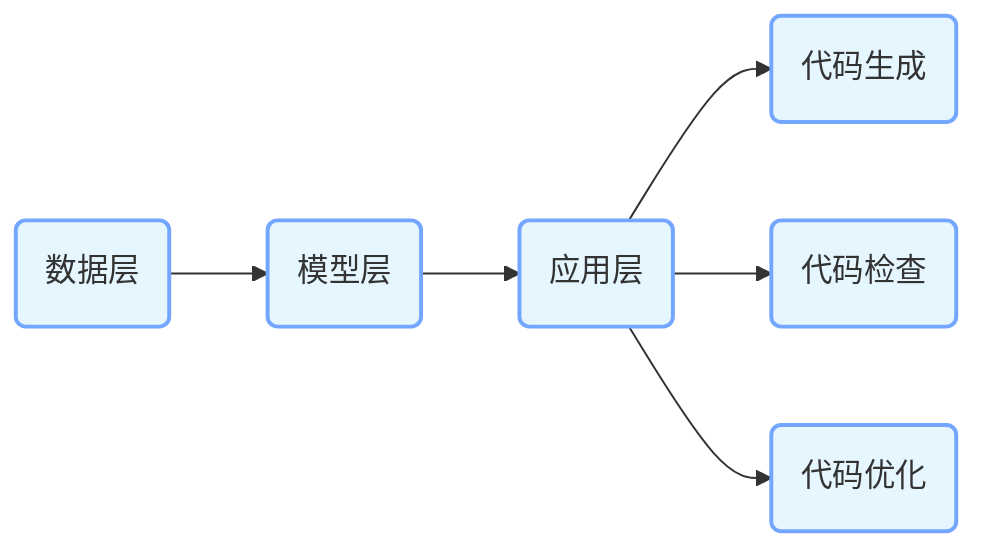

# AI与编程的未来展望与挑战

> 关键词：AI、编程、未来展望、挑战、人工智能编程、自动化编程、人机协作

> 摘要：本文深入探讨了AI与编程领域的未来发展趋势以及面临的挑战。从AI对编程带来的变革出发，详细阐述了核心概念、算法原理、数学模型等基础内容，通过项目实战展示了AI与编程结合的实际应用，分析了其在不同场景下的应用方式。同时推荐了相关的学习资源、开发工具和论文著作，最后对AI与编程的未来发展趋势进行了总结，并探讨了可能面临的挑战，旨在为相关从业者和研究者提供全面而深入的参考。

## 1. 背景介绍 
### 1.1 目的和范围
本文章的目的在于全面剖析AI与编程的融合现状、未来发展方向以及在此过程中所面临的挑战。范围涵盖了AI在编程领域的核心概念、算法原理、数学模型、实际应用场景等多个方面，旨在为读者呈现一个系统且深入的关于AI与编程的知识体系，帮助读者了解这一领域的发展动态和潜在机遇。

### 1.2 预期读者
预期读者包括但不限于程序员、软件开发者、人工智能研究者、技术爱好者、相关领域的学生以及对科技发展趋势感兴趣的人士。无论您是希望深入了解AI与编程结合的技术细节，还是关注这一领域的商业应用和未来发展前景，本文都将为您提供有价值的信息。

### 1.3 文档结构概述
本文首先介绍AI与编程的背景信息，包括目的、预期读者和文档结构。接着阐述核心概念与联系，通过文本示意图和Mermaid流程图展示相关原理和架构。然后详细讲解核心算法原理，结合Python源代码进行说明，并介绍数学模型和公式。之后通过项目实战展示代码实际案例并进行详细解释。再分析实际应用场景，推荐相关的工具和资源。最后总结未来发展趋势与挑战，提供常见问题解答和扩展阅读参考资料。

### 1.4 术语表
#### 1.4.1 核心术语定义
- **AI（Artificial Intelligence）**：即人工智能，是研究、开发用于模拟、延伸和扩展人的智能的理论、方法、技术及应用系统的一门新的技术科学。
- **编程（Programming）**：是指使用特定的程序设计语言，按照一定的规则编写指令序列，以实现特定功能的过程。
- **自动化编程（Automated Programming）**：利用AI技术自动生成代码的过程，减少人工编写代码的工作量。
- **人机协作编程（Human - Machine Collaborative Programming）**：人类程序员与AI系统相互协作，发挥各自优势进行编程的模式。

#### 1.4.2 相关概念解释
- **机器学习（Machine Learning）**：是AI的一个重要分支，它让计算机通过数据和经验来学习模式和规律，从而实现预测和决策等功能。在编程中，机器学习可用于代码优化、缺陷检测等。
- **深度学习（Deep Learning）**：是一种基于人工神经网络的机器学习技术，通过多层神经网络对数据进行深度特征提取和学习。在编程领域，深度学习可用于代码生成、代码理解等任务。

#### 1.4.3 缩略词列表
- **AI**：Artificial Intelligence
- **ML**：Machine Learning
- **DL**：Deep Learning

## 2. 核心概念与联系 

### 核心概念原理
AI与编程的结合主要基于AI技术对编程过程的辅助和优化。AI可以通过学习大量的代码数据，理解代码的结构、语义和逻辑，从而实现代码的自动生成、代码质量检查、代码优化等功能。例如，AI可以根据用户提供的自然语言描述，生成相应的代码框架；可以分析代码中的潜在缺陷和安全漏洞，提供修复建议；还可以对代码进行优化，提高代码的性能和可读性。

编程则为AI的实现提供了基础。AI系统的开发需要使用各种编程语言和开发工具，通过编写代码来实现AI算法和模型。同时，编程也可以将AI技术集成到各种软件系统中，使其发挥实际作用。

### 架构的文本示意图
AI与编程的结合架构可以分为数据层、模型层、应用层三个层次。
- **数据层**：主要负责收集、整理和存储与编程相关的数据，包括代码库、文档、编程规范等。这些数据是AI系统学习和训练的基础。
- **模型层**：基于数据层提供的数据，使用各种AI算法和模型进行训练和学习。常见的模型包括机器学习模型（如决策树、支持向量机等）和深度学习模型（如神经网络、循环神经网络等）。
- **应用层**：将训练好的AI模型应用到编程的各个环节中，如代码生成、代码检查、代码优化等。应用层可以通过API接口与程序员的开发环境进行集成，方便程序员使用。

### Mermaid流程图


## 3. 核心算法原理 & 具体操作步骤 

### 核心算法原理
在AI与编程结合的领域中，常用的核心算法包括自然语言处理算法和机器学习算法。

#### 自然语言处理算法
自然语言处理（NLP）算法用于将自然语言描述转换为计算机可以理解的代码。其中，词法分析、句法分析和语义分析是NLP的重要环节。词法分析将输入的自然语言文本分解为单词或词素；句法分析分析单词之间的语法关系，构建句子的语法结构；语义分析则理解句子的含义，将其转换为代码的逻辑表示。

#### 机器学习算法
机器学习算法用于训练AI模型，使其能够学习代码的模式和规律。常见的机器学习算法包括监督学习、无监督学习和强化学习。监督学习通过有标签的数据进行训练，学习输入和输出之间的映射关系；无监督学习则从无标签的数据中发现数据的内在结构和模式；强化学习通过智能体与环境的交互，学习最优的行为策略。

### 具体操作步骤及Python源代码阐述

#### 代码生成示例
以下是一个简单的基于规则的代码生成示例，根据用户输入的自然语言描述生成Python代码。

```python
# 定义规则字典
rules = {
    "打印Hello World": "print('Hello World')",
    "定义一个整数变量x并赋值为10": "x = 10"
}

# 代码生成函数
def generate_code(description):
    if description in rules:
        return rules[description]
    else:
        return "未找到匹配的规则"

# 测试代码生成
description = "打印Hello World"
code = generate_code(description)
print("生成的代码: ", code)
```

#### 代码解释
- 首先，我们定义了一个规则字典 `rules`，其中包含了一些自然语言描述和对应的Python代码。
- 然后，定义了一个 `generate_code` 函数，该函数接受一个自然语言描述作为输入，检查该描述是否在规则字典中，如果存在则返回对应的代码，否则返回未找到匹配规则的提示信息。
- 最后，我们进行了一个简单的测试，输入自然语言描述“打印Hello World”，调用 `generate_code` 函数生成代码并打印输出。

## 4. 数学模型和公式 & 详细讲解 & 举例说明 

### 数学模型
在AI与编程的结合中，常用的数学模型包括神经网络模型和概率图模型。

#### 神经网络模型
神经网络是一种模仿人类神经系统的数学模型，由多个神经元组成。每个神经元接收输入信号，经过加权求和和非线性变换后输出信号。常见的神经网络包括前馈神经网络（FNN）、循环神经网络（RNN）和卷积神经网络（CNN）。

前馈神经网络的数学模型可以表示为：

$$y = f(\sum_{i=1}^{n} w_i x_i + b)$$

其中，$x_i$ 是输入信号，$w_i$ 是权重，$b$ 是偏置，$f$ 是激活函数，$y$ 是输出信号。

#### 概率图模型
概率图模型是一种用图来表示随机变量之间概率关系的数学模型。常见的概率图模型包括贝叶斯网络和马尔可夫随机场。

贝叶斯网络的数学模型可以表示为：

$$P(X_1, X_2, \cdots, X_n) = \prod_{i=1}^{n} P(X_i | Pa(X_i))$$

其中，$X_i$ 是随机变量，$Pa(X_i)$ 是 $X_i$ 的父节点集合。

### 详细讲解
#### 神经网络模型
神经网络通过不断调整权重和偏置，使得模型的输出尽可能接近真实标签。在训练过程中，使用损失函数来衡量模型输出与真实标签之间的差异，然后使用优化算法（如梯度下降法）来更新权重和偏置，以最小化损失函数。

#### 概率图模型
概率图模型通过图的结构来表示随机变量之间的依赖关系，通过概率分布来描述变量的取值概率。在推理过程中，可以根据已知变量的值，计算其他变量的条件概率。

### 举例说明
#### 神经网络模型
假设我们要使用神经网络进行手写数字识别。输入是手写数字的图像，输出是对应的数字标签。我们可以使用卷积神经网络（CNN）来提取图像的特征，然后通过全连接层进行分类。在训练过程中，使用交叉熵损失函数来衡量模型输出与真实标签之间的差异，使用随机梯度下降法来更新权重和偏置。

#### 概率图模型
假设我们要使用贝叶斯网络来进行疾病诊断。随机变量包括症状、疾病等。通过构建贝叶斯网络的结构和概率分布，当已知患者的症状时，可以计算患者患各种疾病的概率。

## 5. 项目实战：代码实际案例和详细解释说明 

### 5.1  开发环境搭建
本项目使用Python语言进行开发，需要安装以下库：
- **TensorFlow**：用于构建和训练神经网络模型。
- **Keras**：基于TensorFlow的高级神经网络API，简化模型的构建过程。
- **Scikit - learn**：用于机器学习的工具库，提供了各种机器学习算法和评估指标。

可以使用以下命令进行安装：
```sh
pip install tensorflow keras scikit-learn
```

### 5.2  源代码详细实现和代码解读
我们以一个简单的文本分类项目为例，展示AI与编程的结合。该项目的目标是根据新闻文本的内容，将其分类到不同的类别中。

```python
import tensorflow as tf
from tensorflow.keras.preprocessing.text import Tokenizer
from tensorflow.keras.preprocessing.sequence import pad_sequences
from sklearn.model_selection import train_test_split
import numpy as np

# 示例数据
texts = [
    "这是一篇关于科技的新闻报道",
    "体育赛事精彩纷呈",
    "财经领域的最新动态",
    "娱乐明星的八卦新闻"
]
labels = [0, 1, 2, 3]

# 数据预处理
tokenizer = Tokenizer(num_words=1000)
tokenizer.fit_on_texts(texts)
sequences = tokenizer.texts_to_sequences(texts)
max_length = max([len(seq) for seq in sequences])
padded_sequences = pad_sequences(sequences, maxlen=max_length)

# 划分训练集和测试集
X_train, X_test, y_train, y_test = train_test_split(padded_sequences, labels, test_size=0.2, random_state=42)

# 构建模型
model = tf.keras.Sequential([
    tf.keras.layers.Embedding(input_dim=1000, output_dim=16, input_length=max_length),
    tf.keras.layers.Flatten(),
    tf.keras.layers.Dense(16, activation='relu'),
    tf.keras.layers.Dense(4, activation='softmax')
])

# 编译模型
model.compile(optimizer='adam', loss='sparse_categorical_crossentropy', metrics=['accuracy'])

# 训练模型
model.fit(np.array(X_train), np.array(y_train), epochs=10, validation_data=(np.array(X_test), np.array(y_test)))
```

### 5.3  代码解读与分析
- **数据预处理**：
    - 使用 `Tokenizer` 对文本进行分词，并将文本转换为数字序列。
    - 使用 `pad_sequences` 对数字序列进行填充，使其长度一致。
- **划分训练集和测试集**：使用 `train_test_split` 函数将数据划分为训练集和测试集，方便模型的训练和评估。
- **构建模型**：使用 `Sequential` 模型构建一个简单的神经网络，包括嵌入层、扁平化层、全连接层和输出层。
- **编译模型**：使用 `compile` 方法编译模型，指定优化器、损失函数和评估指标。
- **训练模型**：使用 `fit` 方法训练模型，指定训练数据、训练轮数和验证数据。

## 6. 实际应用场景 
### 代码自动生成
AI可以根据用户的需求和自然语言描述，自动生成代码框架和部分代码。例如，在开发一个Web应用时，用户可以输入“创建一个简单的登录页面”，AI系统可以自动生成相应的HTML、CSS和JavaScript代码。

### 代码质量检查
AI可以分析代码的结构、语法和逻辑，检查代码中的潜在缺陷和安全漏洞。例如，AI可以检测代码中的空指针引用、内存泄漏、SQL注入等问题，并提供修复建议。

### 代码优化
AI可以对代码进行性能优化和可读性优化。例如，AI可以分析代码的复杂度，找出性能瓶颈，并提供优化方案；可以对代码进行格式化，使其更符合编程规范。

### 智能编程助手
AI可以作为智能编程助手，为程序员提供实时的帮助和建议。例如，当程序员遇到问题时，可以向AI助手提问，AI助手可以提供相关的文档、示例代码和解决方案。

## 7. 工具和资源推荐
### 7.1 学习资源推荐
#### 7.1.1 书籍推荐
- 《深度学习》（Deep Learning）：由Ian Goodfellow、Yoshua Bengio和Aaron Courville合著，是深度学习领域的经典教材。
- 《Python深度学习》（Deep Learning with Python）：由Francois Chollet著，介绍了如何使用Python和Keras进行深度学习开发。
- 《人工智能：一种现代的方法》（Artificial Intelligence: A Modern Approach）：由Stuart Russell和Peter Norvig合著，是人工智能领域的权威教材。

#### 7.1.2 在线课程
- Coursera上的“深度学习专项课程”（Deep Learning Specialization）：由Andrew Ng教授授课，涵盖了深度学习的各个方面。
- edX上的“人工智能基础”（Fundamentals of Artificial Intelligence）：介绍了人工智能的基本概念和算法。
- 哔哩哔哩上的一些编程和AI相关的教程，如“Python编程从入门到实践”“AI实战项目”等。

#### 7.1.3 技术博客和网站
- Medium：有很多AI和编程领域的优秀博客文章，涵盖了最新的技术动态和研究成果。
- Towards Data Science：专注于数据科学和机器学习领域，提供了很多实用的技术文章和案例分析。
- 开源中国：国内知名的开源技术社区，有很多关于编程和AI的技术文章和项目分享。

### 7.2 开发工具框架推荐
#### 7.2.1 IDE和编辑器
- PyCharm：一款专门为Python开发设计的集成开发环境，提供了丰富的功能和插件。
- Visual Studio Code：一款轻量级的代码编辑器，支持多种编程语言和插件扩展。
- Jupyter Notebook：一种交互式的开发环境，适合进行数据分析和机器学习实验。

#### 7.2.2 调试和性能分析工具
- Py-Spy：用于Python代码的性能分析工具，可以帮助开发者找出性能瓶颈。
- PDB：Python自带的调试器，方便开发者调试代码。
- TensorBoard：TensorFlow的可视化工具，用于可视化模型的训练过程和性能指标。

#### 7.2.3 相关框架和库
- TensorFlow：一个开源的机器学习框架，提供了丰富的工具和库，用于构建和训练深度学习模型。
- PyTorch：另一个流行的深度学习框架，具有动态图的特点，方便开发者进行模型的开发和调试。
- Scikit - learn：一个用于机器学习的工具库，提供了各种机器学习算法和评估指标。

### 7.3 相关论文著作推荐
#### 7.3.1 经典论文
- “ImageNet Classification with Deep Convolutional Neural Networks”：由Alex Krizhevsky、Ilya Sutskever和Geoffrey Hinton发表，介绍了AlexNet卷积神经网络，开启了深度学习在计算机视觉领域的热潮。
- “Attention Is All You Need”：提出了Transformer架构，在自然语言处理领域取得了巨大的成功。

#### 7.3.2 最新研究成果
- 关注顶级学术会议（如NeurIPS、ICML、CVPR等）的论文，了解AI与编程领域的最新研究进展。
- 一些知名的学术期刊（如Journal of Artificial Intelligence Research、Artificial Intelligence等）也会发表相关的研究成果。

#### 7.3.3 应用案例分析
- 一些企业和研究机构会发布AI与编程结合的应用案例，如谷歌、微软、百度等公司的技术博客，分析他们在实际项目中的应用经验和解决方案。

## 8. 总结：未来发展趋势与挑战
### 未来发展趋势
- **自动化编程的普及**：随着AI技术的不断发展，自动化编程将越来越普及，程序员可以将更多的时间和精力放在业务逻辑的设计和创新上。
- **人机协作编程的深化**：人类程序员和AI系统将更加紧密地协作，发挥各自的优势。AI系统可以为程序员提供智能辅助，程序员可以对AI生成的代码进行审核和优化。
- **AI与编程教育的融合**：AI将被应用于编程教育中，提供个性化的学习方案和智能辅导，帮助学生更快地掌握编程技能。
- **跨领域融合**：AI与编程将与其他领域（如生物医学、金融、交通等）深度融合，创造出更多的创新应用和商业机会。

### 挑战
- **技术挑战**：目前AI在代码理解、语义分析等方面还存在一定的局限性，需要进一步提高AI的智能水平和准确性。
- **安全挑战**：AI生成的代码可能存在安全漏洞和质量问题，需要建立完善的安全检测和审核机制。
- **伦理挑战**：AI与编程的结合可能会导致一些伦理问题，如代码版权、隐私保护等，需要制定相应的伦理准则和法律法规。
- **就业挑战**：自动化编程的发展可能会对程序员的就业产生一定的影响，程序员需要不断提升自己的技能，适应技术的发展变化。

## 9. 附录：常见问题与解答
### 问题1：AI会完全取代程序员吗？
答：不会。虽然AI在编程领域的应用越来越广泛，但程序员的创造力、逻辑思维和业务理解能力是AI无法替代的。AI更多地是作为程序员的辅助工具，帮助程序员提高工作效率和代码质量。

### 问题2：学习AI与编程需要具备哪些基础知识？
答：需要具备一定的数学基础（如线性代数、概率论、微积分等）、编程基础（如Python、Java等）和机器学习基础。

### 问题3：如何评估AI生成代码的质量？
答：可以从代码的正确性、性能、可读性、可维护性等方面进行评估。同时，可以使用代码审查工具和测试框架对代码进行检查和测试。

### 问题4：AI与编程结合会带来哪些新的安全风险？
答：可能会带来代码注入、数据泄露、模型被攻击等安全风险。需要加强安全防护措施，如代码加密、访问控制、模型安全评估等。

## 10. 扩展阅读 & 参考资料
- 《AI时代的编程革命》
- 《编程与人工智能的融合发展趋势》
- 相关学术论文和技术报告，如IEEE、ACM等组织发表的关于AI与编程的研究成果。
- 各大科技公司的官方博客和技术文档，如谷歌、微软、亚马逊等公司发布的关于AI与编程的应用案例和技术分享。