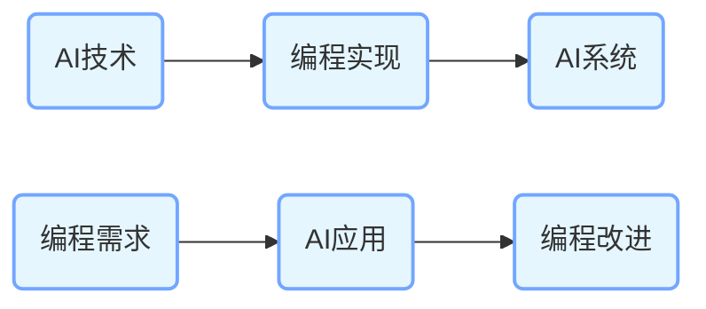

# AI与编程的相互影响：未来展望

> 关键词：AI、编程、相互影响、自动化编程、未来展望

> 摘要：本文深入探讨了AI与编程之间的相互影响及其未来发展趋势。AI技术的发展正在深刻改变编程的方式和流程，而编程也为AI的进步提供了支撑和实现途径。文章详细阐述了AI在编程中的应用，包括自动化编程、代码优化等方面，同时也分析了编程对AI发展的推动作用。通过实际案例和理论分析，对AI与编程相互影响的未来进行了展望，旨在为相关领域的研究者和从业者提供有价值的参考。

## 1. 背景介绍 
### 1.1 目的和范围
本文的目的在于全面且深入地研究AI与编程之间的相互关系及其未来发展方向。范围涵盖了AI技术在编程领域的各种应用场景，以及编程对AI发展的支持作用。同时，探讨了这种相互影响在不同行业和领域中的体现，以及对未来技术发展和社会变革的潜在影响。

### 1.2 预期读者
本文预期读者包括计算机科学领域的研究者、软件开发者、AI工程师、技术爱好者以及对未来技术发展趋势感兴趣的人士。无论是专业技术人员希望了解行业前沿动态，还是普通读者想要探索科技发展方向，都能从本文中获得有价值的信息。

### 1.3 文档结构概述
本文首先介绍了AI与编程相关的背景知识，包括目的、预期读者和文档结构等。接着阐述了AI与编程的核心概念及其联系，通过文本示意图和Mermaid流程图进行直观展示。然后详细讲解了核心算法原理和具体操作步骤，结合Python源代码进行说明。随后介绍了相关的数学模型和公式，并举例说明。通过项目实战部分展示了代码实际案例和详细解释。分析了AI与编程相互影响的实际应用场景。推荐了相关的工具和资源，包括学习资源、开发工具框架和论文著作等。最后对未来发展趋势与挑战进行总结，并提供常见问题与解答以及扩展阅读和参考资料。

### 1.4 术语表
#### 1.4.1 核心术语定义
- **AI（Artificial Intelligence）**：即人工智能，是指计算机系统能够执行通常需要人类智能才能完成的任务，如学习、推理、解决问题等。
- **编程（Programming）**：是指使用特定的编程语言，按照一定的规则和逻辑，编写计算机程序的过程。
- **自动化编程（Automated Programming）**：利用AI技术自动生成代码的过程，减少人工编写代码的工作量。
- **机器学习（Machine Learning）**：是AI的一个重要分支，通过让计算机从数据中学习模式和规律，从而实现预测和决策等功能。

#### 1.4.2 相关概念解释
- **深度学习（Deep Learning）**：是机器学习的一种，通过构建深度神经网络来处理复杂的数据和任务，在图像识别、自然语言处理等领域取得了显著成果。
- **自然语言处理（Natural Language Processing）**：是AI的一个领域，旨在让计算机理解和处理人类语言，实现人机之间的自然语言交互。
- **代码优化（Code Optimization）**：通过对代码进行修改和调整，提高代码的性能、可读性和可维护性。

#### 1.4.3 缩略词列表
- **AI**：Artificial Intelligence
- **ML**：Machine Learning
- **DL**：Deep Learning
- **NLP**：Natural Language Processing

## 2. 核心概念与联系 

### 2.1 AI的核心概念
AI是一门研究如何使计算机能够模拟人类智能的学科。其核心目标是让计算机系统具备感知、理解、学习、推理和决策等能力。AI的主要技术包括机器学习、深度学习、知识表示与推理、自然语言处理等。

机器学习是AI的重要组成部分，它通过让计算机从数据中学习模式和规律，从而实现对未知数据的预测和分类。深度学习则是机器学习的一种特殊形式，它利用深度神经网络来处理复杂的数据和任务，在图像识别、语音识别等领域取得了巨大的成功。

自然语言处理是AI的另一个重要领域，它旨在让计算机理解和处理人类语言。通过自然语言处理技术，计算机可以实现语音识别、机器翻译、文本生成等功能。

### 2.2 编程的核心概念
编程是指使用特定的编程语言，按照一定的规则和逻辑，编写计算机程序的过程。编程语言是人与计算机之间进行沟通的工具，常见的编程语言包括Python、Java、C++等。

编程的核心任务包括算法设计、数据结构选择、代码实现和调试等。算法是解决问题的步骤和方法，数据结构则是存储和组织数据的方式。代码实现是将算法和数据结构用编程语言表达出来，调试则是对代码进行检查和修正，确保程序的正确性和稳定性。

### 2.3 AI与编程的联系
AI和编程之间存在着密切的联系。一方面，编程是实现AI的基础。AI系统的开发需要使用编程语言来实现各种算法和模型。例如，在机器学习中，需要使用Python等编程语言来实现数据处理、模型训练和预测等功能。

另一方面，AI也为编程带来了新的机遇和挑战。AI技术可以用于自动化编程，通过分析大量的代码数据，自动生成代码。此外，AI还可以用于代码优化和调试，提高编程的效率和质量。

### 2.4 文本示意图
AI与编程的关系可以用以下文本示意图表示：

AI技术（机器学习、深度学习、自然语言处理等） -> 编程实现（使用编程语言编写算法和模型） -> AI系统（具备智能功能的计算机系统）

编程需求（提高效率、优化代码等） -> AI应用（自动化编程、代码优化等） -> 编程改进（更高效、更优质的编程过程）

### 2.5 Mermaid流程图


## 3. 核心算法原理 & 具体操作步骤 

### 3.1 自动化编程算法原理
自动化编程的核心算法原理是基于机器学习和自然语言处理技术。具体来说，它通过以下步骤实现：

1. **数据收集**：收集大量的代码数据，包括不同编程语言的代码、不同类型的项目代码等。
2. **数据预处理**：对收集到的代码数据进行清洗、标注和转换，以便于机器学习模型的训练。
3. **模型训练**：使用机器学习模型，如循环神经网络（RNN）、长短期记忆网络（LSTM）等，对预处理后的数据进行训练。
4. **代码生成**：在训练好的模型基础上，根据用户输入的自然语言描述或代码片段，生成相应的代码。

### 3.2 Python实现自动化编程示例
以下是一个简单的Python示例，用于演示如何使用深度学习模型实现自动化编程。

```python
import tensorflow as tf
from tensorflow.keras.preprocessing.text import Tokenizer
from tensorflow.keras.preprocessing.sequence import pad_sequences
from tensorflow.keras.models import Sequential
from tensorflow.keras.layers import Embedding, LSTM, Dense

# 示例代码数据
code_data = [
    "print('Hello, World!')",
    "def add(a, b): return a + b",
    "for i in range(10): print(i)"
]

# 自然语言描述数据
description_data = [
    "打印Hello, World!",
    "定义一个加法函数",
    "循环打印0到9的数字"
]

# 数据预处理
tokenizer_code = Tokenizer()
tokenizer_code.fit_on_texts(code_data)
code_sequences = tokenizer_code.texts_to_sequences(code_data)
max_code_length = max([len(seq) for seq in code_sequences])
code_padded = pad_sequences(code_sequences, maxlen=max_code_length)

tokenizer_description = Tokenizer()
tokenizer_description.fit_on_texts(description_data)
description_sequences = tokenizer_description.texts_to_sequences(description_data)
max_description_length = max([len(seq) for seq in description_sequences])
description_padded = pad_sequences(description_sequences, maxlen=max_description_length)

# 构建模型
model = Sequential()
model.add(Embedding(input_dim=len(tokenizer_description.word_index) + 1, output_dim=16, input_length=max_description_length))
model.add(LSTM(128))
model.add(Dense(len(tokenizer_code.word_index) + 1, activation='softmax'))

# 编译模型
model.compile(loss='sparse_categorical_crossentropy', optimizer='adam', metrics=['accuracy'])

# 训练模型
model.fit(description_padded, code_padded, epochs=100)

# 生成代码
new_description = ["打印Hello, AI!"]
new_description_sequence = tokenizer_description.texts_to_sequences(new_description)
new_description_padded = pad_sequences(new_description_sequence, maxlen=max_description_length)
predicted_sequence = model.predict(new_description_padded)
predicted_code = tokenizer_code.sequences_to_texts([predicted_sequence.argmax(axis=-1)])
print("生成的代码：", predicted_code)
```

### 3.3 代码解释
1. **数据收集和预处理**：首先收集示例代码数据和对应的自然语言描述数据。然后使用`Tokenizer`对代码和描述进行分词处理，并将其转换为数字序列。最后使用`pad_sequences`对序列进行填充，使其长度一致。
2. **模型构建**：使用`Sequential`模型构建一个简单的深度学习模型，包括嵌入层、LSTM层和全连接层。
3. **模型编译和训练**：使用`compile`方法编译模型，指定损失函数、优化器和评估指标。然后使用`fit`方法对模型进行训练。
4. **代码生成**：对于新的自然语言描述，将其转换为数字序列并进行填充。然后使用训练好的模型进行预测，将预测结果转换为代码文本。

## 4. 数学模型和公式 & 详细讲解 & 举例说明 

### 4.1 机器学习中的数学模型
在机器学习中，常见的数学模型包括线性回归、逻辑回归、决策树等。这些模型都基于一定的数学公式来描述数据之间的关系。

#### 4.1.1 线性回归
线性回归是一种用于预测连续数值的机器学习模型。其数学公式为：

$$y = \theta_0 + \theta_1x_1 + \theta_2x_2 + \cdots + \theta_nx_n$$

其中，$y$ 是预测值，$x_1, x_2, \cdots, x_n$ 是输入特征，$\theta_0, \theta_1, \cdots, \theta_n$ 是模型的参数。

线性回归的目标是找到一组最优的参数 $\theta$，使得预测值 $y$ 与真实值之间的误差最小。通常使用最小二乘法来求解参数 $\theta$。

#### 4.1.2 逻辑回归
逻辑回归是一种用于分类的机器学习模型。其数学公式为：

$$P(y = 1|x) = \frac{1}{1 + e^{-z}}$$

其中，$P(y = 1|x)$ 是样本 $x$ 属于正类的概率，$z = \theta_0 + \theta_1x_1 + \theta_2x_2 + \cdots + \theta_nx_n$ 是线性组合。

逻辑回归的目标是找到一组最优的参数 $\theta$，使得模型对训练数据的分类准确率最高。通常使用最大似然估计来求解参数 $\theta$。

### 4.2 深度学习中的数学模型
深度学习中的数学模型主要基于神经网络。神经网络由多个神经元组成，每个神经元都有一个激活函数。

#### 4.2.1 神经元模型
神经元的数学模型可以表示为：

$$y = f(\sum_{i = 1}^{n}w_ix_i + b)$$

其中，$x_1, x_2, \cdots, x_n$ 是输入信号，$w_1, w_2, \cdots, w_n$ 是权重，$b$ 是偏置，$f$ 是激活函数。

常见的激活函数包括 sigmoid 函数、ReLU 函数等。

#### 4.2.2 神经网络模型
神经网络由多个神经元层组成，包括输入层、隐藏层和输出层。神经网络的数学模型可以表示为：

$$y = f_L(W_Lf_{L - 1}(W_{L - 1}\cdots f_1(W_1x + b_1) + b_{L - 1}) + b_L)$$

其中，$L$ 是神经网络的层数，$W_i$ 是第 $i$ 层的权重矩阵，$b_i$ 是第 $i$ 层的偏置向量，$f_i$ 是第 $i$ 层的激活函数。

### 4.3 举例说明
以下是一个简单的线性回归示例，使用 Python 实现：

```python
import numpy as np
import matplotlib.pyplot as plt

# 生成数据
x = np.array([1, 2, 3, 4, 5])
y = np.array([2, 4, 6, 8, 10])

# 计算参数
n = len(x)
x_mean = np.mean(x)
y_mean = np.mean(y)
numerator = np.sum((x - x_mean) * (y - y_mean))
denominator = np.sum((x - x_mean) ** 2)
theta_1 = numerator / denominator
theta_0 = y_mean - theta_1 * x_mean

# 预测
new_x = np.array([6, 7, 8])
predicted_y = theta_0 + theta_1 * new_x

# 绘制图形
plt.scatter(x, y, label='Data')
plt.plot(new_x, predicted_y, color='red', label='Prediction')
plt.xlabel('x')
plt.ylabel('y')
plt.legend()
plt.show()
```

在这个示例中，我们使用最小二乘法计算线性回归的参数 $\theta_0$ 和 $\theta_1$，然后使用这些参数进行预测并绘制图形。

## 5. 项目实战：代码实际案例和详细解释说明 

### 5.1  开发环境搭建
为了进行项目实战，我们需要搭建一个开发环境。以下是具体步骤：

1. **安装 Python**：从 Python 官方网站（https://www.python.org/downloads/）下载并安装 Python 3.x 版本。
2. **安装开发工具**：推荐使用 PyCharm 或 Jupyter Notebook 作为开发工具。可以从官方网站下载并安装。
3. **安装必要的库**：使用以下命令安装必要的库：

```sh
pip install tensorflow numpy pandas matplotlib
```

### 5.2  源代码详细实现和代码解读
以下是一个基于深度学习的图像分类项目的示例代码：

```python
import tensorflow as tf
from tensorflow.keras.datasets import mnist
from tensorflow.keras.models import Sequential
from tensorflow.keras.layers import Flatten, Dense
from tensorflow.keras.utils import to_categorical
import matplotlib.pyplot as plt

# 加载数据集
(train_images, train_labels), (test_images, test_labels) = mnist.load_data()

# 数据预处理
train_images = train_images / 255.0
test_images = test_images / 255.0
train_labels = to_categorical(train_labels)
test_labels = to_categorical(test_labels)

# 构建模型
model = Sequential()
model.add(Flatten(input_shape=(28, 28)))
model.add(Dense(128, activation='relu'))
model.add(Dense(10, activation='softmax'))

# 编译模型
model.compile(optimizer='adam',
              loss='categorical_crossentropy',
              metrics=['accuracy'])

# 训练模型
model.fit(train_images, train_labels, epochs=5, batch_size=64)

# 评估模型
test_loss, test_acc = model.evaluate(test_images, test_labels)
print(f"Test accuracy: {test_acc}")

# 预测示例
predictions = model.predict(test_images)
index = 0
plt.imshow(test_images[index], cmap='gray')
plt.title(f"Predicted: {np.argmax(predictions[index])}")
plt.show()
```

### 5.3  代码解读与分析
1. **数据加载和预处理**：使用`mnist.load_data()`加载 MNIST 手写数字数据集。将图像数据除以 255.0 进行归一化处理，将标签数据使用`to_categorical()`进行 one-hot 编码。
2. **模型构建**：使用`Sequential`模型构建一个简单的神经网络，包括一个展平层、一个全连接层和一个输出层。
3. **模型编译**：使用`compile`方法编译模型，指定优化器、损失函数和评估指标。
4. **模型训练**：使用`fit`方法对模型进行训练，指定训练数据、训练轮数和批次大小。
5. **模型评估**：使用`evaluate`方法对模型进行评估，计算测试集的损失和准确率。
6. **预测示例**：使用`predict`方法对测试集进行预测，并显示预测结果。

## 6. 实际应用场景 
### 6.1 软件开发领域
在软件开发领域，AI与编程的相互影响体现在多个方面。自动化编程工具可以根据用户的需求自动生成代码，大大提高了开发效率。例如，一些低代码开发平台利用AI技术，让非专业程序员也能够快速创建应用程序。

代码审查和优化也是AI在软件开发中的重要应用。AI可以分析代码的结构和性能，发现潜在的问题并提供优化建议。此外，AI还可以用于代码的自动测试，提高软件的质量和稳定性。

### 6.2 数据分析与挖掘领域
在数据分析与挖掘领域，编程是实现数据分析算法的基础，而AI技术则可以帮助程序员更好地处理和分析数据。例如，机器学习算法可以用于数据分类、聚类和预测等任务。

自然语言处理技术可以用于文本挖掘，从大量的文本数据中提取有价值的信息。同时，AI还可以用于数据可视化，将复杂的数据以直观的图表和图形展示出来，帮助用户更好地理解数据。

### 6.3 智能物联网领域
在智能物联网领域，编程用于开发物联网设备的固件和应用程序，而AI则可以实现设备的智能化控制和管理。例如，通过机器学习算法对传感器数据进行分析，实现设备的自动调节和故障预测。

AI还可以用于物联网设备之间的通信和协作，提高整个物联网系统的效率和可靠性。例如，智能家庭系统可以根据用户的习惯和环境条件自动调节家电设备的运行状态。

### 6.4 金融领域
在金融领域，编程和AI的结合可以用于风险评估、投资决策和欺诈检测等任务。机器学习算法可以对金融数据进行分析，预测市场趋势和风险水平。

自然语言处理技术可以用于分析新闻和社交媒体数据，获取市场情绪和舆情信息。同时，AI还可以用于自动化交易系统，根据预设的规则和算法进行股票、期货等交易。

## 7. 工具和资源推荐
### 7.1 学习资源推荐
#### 7.1.1 书籍推荐
- 《Python 机器学习》：介绍了Python在机器学习领域的应用，包括各种机器学习算法的原理和实现。
- 《深度学习》：由深度学习领域的三位先驱者编写，是深度学习领域的经典教材。
- 《人工智能：一种现代的方法》：全面介绍了人工智能的各个领域，包括搜索、推理、机器学习等。

#### 7.1.2 在线课程
- Coursera 上的《机器学习》课程：由斯坦福大学的 Andrew Ng 教授讲授，是机器学习领域的经典课程。
- edX 上的《深度学习》课程：由麻省理工学院等机构提供，介绍了深度学习的原理和应用。
- 阿里云天池平台的 AI 相关课程：提供了丰富的AI实战课程和案例。

#### 7.1.3 技术博客和网站
- Medium：有许多AI和编程领域的优秀博客文章，涵盖了最新的技术和研究成果。
- 开源中国：提供了大量的技术文章和开源项目，对于学习编程和AI有很大的帮助。
- 机器之心：专注于AI领域的资讯和技术解读，是了解AI发展动态的重要渠道。

### 7.2 开发工具框架推荐
#### 7.2.1 IDE和编辑器
- PyCharm：是一款专门为Python开发设计的集成开发环境，提供了丰富的功能和插件。
- Visual Studio Code：是一款轻量级的代码编辑器，支持多种编程语言，有大量的扩展插件。
- Jupyter Notebook：是一个交互式的编程环境，适合进行数据分析和机器学习实验。

#### 7.2.2 调试和性能分析工具
- pdb：Python 自带的调试工具，可以帮助开发者定位和解决代码中的问题。
- TensorBoard：是 TensorFlow 提供的可视化工具，可以用于查看模型的训练过程和性能指标。
- cProfile：Python 自带的性能分析工具，可以分析代码的运行时间和资源消耗。

#### 7.2.3 相关框架和库
- TensorFlow：是一个开源的深度学习框架，提供了丰富的工具和接口，用于构建和训练深度学习模型。
- PyTorch：是另一个流行的深度学习框架，具有简洁易用的特点，受到了很多研究者的喜爱。
- Scikit-learn：是一个用于机器学习的 Python 库，提供了各种机器学习算法和工具。

### 7.3 相关论文著作推荐
#### 7.3.1 经典论文
- 《Gradient-Based Learning Applied to Document Recognition》：由 Yann LeCun 等人发表，介绍了卷积神经网络在手写数字识别中的应用，是深度学习领域的经典论文。
- 《Attention Is All You Need》：提出了 Transformer 模型，在自然语言处理领域取得了巨大的成功。
- 《A Logical Calculus of the Ideas Immanent in Nervous Activity》：由 Warren McCulloch 和 Walter Pitts 发表，是神经网络领域的开山之作。

#### 7.3.2 最新研究成果
- 可以关注 NeurIPS、ICML、CVPR 等顶级学术会议的论文，了解AI领域的最新研究成果。
- 一些知名的学术期刊，如《Journal of Artificial Intelligence Research》、《Artificial Intelligence》等，也会发表高质量的研究论文。

#### 7.3.3 应用案例分析
- 《AI in Practice: How 50 Successful Companies Used Artificial Intelligence to Solve Problems》：介绍了50家成功应用AI技术解决实际问题的公司案例，具有很高的参考价值。
- 各大科技公司的官方博客和技术报告，也会分享他们在AI和编程领域的应用案例和经验。

## 8. 总结：未来发展趋势与挑战
### 8.1 未来发展趋势
#### 8.1.1 自动化编程的普及
随着AI技术的不断发展，自动化编程将越来越普及。未来，程序员可以通过自然语言描述需求，让AI自动生成代码，大大提高开发效率。同时，自动化编程工具将不断完善，能够处理更复杂的任务和项目。

#### 8.1.2 AI与编程的深度融合
AI将不仅仅用于辅助编程，还将与编程深度融合。例如，AI可以参与到软件的整个生命周期中，从需求分析、设计到开发、测试和维护。同时，编程也将为AI的发展提供更多的支持和创新。

#### 8.1.3 跨领域应用的拓展
AI与编程的相互影响将拓展到更多的领域，如医疗、教育、交通等。在医疗领域，AI可以辅助医生进行疾病诊断和治疗方案制定；在教育领域，AI可以实现个性化学习和智能辅导。

### 8.2 挑战
#### 8.2.1 技术挑战
虽然AI技术取得了很大的进步，但仍然存在一些技术挑战。例如，自动化编程生成的代码质量和可维护性还需要进一步提高；AI模型的可解释性和可靠性也是当前需要解决的问题。

#### 8.2.2 伦理和法律挑战
AI与编程的发展也带来了一些伦理和法律问题。例如，自动化编程生成的代码的版权归属问题；AI系统的决策责任和透明度问题等。需要建立相应的伦理和法律框架来规范和管理。

#### 8.2.3 人才挑战
AI与编程的发展需要大量的专业人才。当前，相关领域的人才短缺是一个普遍存在的问题。需要加强教育和培训，培养更多的既懂AI又懂编程的复合型人才。

## 9. 附录：常见问题与解答
### 9.1 自动化编程会取代程序员吗？
不会。虽然自动化编程可以提高开发效率，但程序员仍然具有不可替代的作用。程序员需要进行需求分析、设计架构、优化算法等工作，这些都需要人类的创造力和思维能力。自动化编程只是辅助程序员的工具，而不是取代他们。

### 9.2 AI模型的可解释性为什么重要？
AI模型的可解释性非常重要。在一些关键领域，如医疗、金融等，AI模型的决策会对人们的生活和利益产生重大影响。如果模型的决策不可解释，人们就无法理解为什么做出这样的决策，也无法评估其可靠性和安全性。因此，提高AI模型的可解释性是当前研究的一个重要方向。

### 9.3 如何学习AI和编程？
可以从以下几个方面入手：
1. 学习基础知识：包括编程语言（如Python）、数学（如线性代数、概率论）等。
2. 在线课程和书籍：选择适合自己的在线课程和书籍进行学习。
3. 实践项目：通过实践项目来巩固所学知识，提高编程和AI能力。
4. 参与开源项目：参与开源项目可以学习到其他开发者的经验和技巧，同时也可以为开源社区做出贡献。

## 10. 扩展阅读 & 参考资料
### 10.1 扩展阅读
- 《AI 未来简史》：探讨了AI对人类社会和未来发展的影响。
- 《代码大全》：是一本关于软件开发的经典著作，涵盖了编程的各个方面。
- 《数据结构与算法分析》：介绍了常见的数据结构和算法，是编程学习的重要参考书籍。

### 10.2 参考资料
- 相关的学术论文和研究报告。
- 各大科技公司的官方文档和技术博客。
- 在线编程社区和论坛，如 Stack Overflow 等。