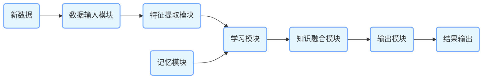

# AI中的终身学习:持续适应新知识

> 关键词：AI、终身学习、持续适应、新知识、机器学习、神经网络、知识迁移

> 摘要：本文聚焦于AI中的终身学习这一前沿领域，旨在深入探讨如何使AI系统持续适应新知识。首先介绍了终身学习在AI领域的背景，包括其目的、预期读者、文档结构等内容。接着阐述了终身学习的核心概念与联系，分析其原理和架构，并给出相应的示意图和流程图。详细讲解了核心算法原理及具体操作步骤，通过Python源代码进行了阐述。同时给出了相关的数学模型和公式，并举例说明。通过项目实战展示了代码的实际案例和详细解释。探讨了终身学习的实际应用场景，推荐了相关的工具和资源。最后总结了未来发展趋势与挑战，还提供了常见问题解答和扩展阅读参考资料，帮助读者全面了解AI中的终身学习。

## 1. 背景介绍 
### 1.1 目的和范围
在人工智能的发展历程中，传统的机器学习模型往往是针对特定任务进行训练，一旦训练完成，其性能和能力就相对固定。然而，现实世界是动态变化的，新的数据、新的知识不断涌现。例如，在自然语言处理领域，新的词汇、新的语言表达方式不断产生；在计算机视觉领域，新的物体类别、新的场景不断出现。因此，让AI系统具备持续适应新知识的能力，即实现终身学习，变得至关重要。

本文的范围涵盖了AI中终身学习的基本概念、核心算法、数学模型、实际应用以及未来发展趋势等方面，旨在为读者提供一个全面而深入的关于AI终身学习的知识体系。

### 1.2 预期读者
本文预期读者包括人工智能领域的研究人员、开发者、学生以及对AI技术感兴趣的爱好者。对于研究人员，本文可以为他们的研究工作提供理论和实践的参考；对于开发者，有助于他们在实际项目中应用终身学习技术；对于学生，能够帮助他们系统地学习AI终身学习的相关知识；对于爱好者，则可以拓宽他们对AI技术前沿的认知。

### 1.3 文档结构概述
本文首先介绍AI中终身学习的背景信息，让读者对其有一个初步的了解。接着阐述终身学习的核心概念与联系，包括其原理和架构，以帮助读者建立起对终身学习的整体认知。然后详细讲解核心算法原理及具体操作步骤，通过Python代码进行说明，使读者能够深入理解其实现细节。之后给出相关的数学模型和公式，并举例说明，为终身学习提供理论支撑。通过项目实战展示代码的实际应用和详细解释，增强读者的实践能力。探讨实际应用场景，让读者了解终身学习在不同领域的应用价值。推荐相关的工具和资源，方便读者进一步学习和研究。最后总结未来发展趋势与挑战，为读者提供前瞻性的思考。同时，还设有附录部分，解答常见问题，并提供扩展阅读和参考资料。

### 1.4 术语表
#### 1.4.1 核心术语定义
- **终身学习（Lifelong Learning）**：指AI系统能够在其生命周期内持续学习新知识，不断适应环境变化，且不会显著遗忘之前所学的知识。
- **灾难性遗忘（Catastrophic Forgetting）**：在传统机器学习中，当模型学习新任务时，可能会迅速忘记之前学习的任务，导致之前的性能大幅下降，这种现象称为灾难性遗忘。
- **知识迁移（Knowledge Transfer）**：将在一个任务或领域中学习到的知识应用到另一个任务或领域中的过程。

#### 1.4.2 相关概念解释
- **增量学习（Incremental Learning）**：一种逐步学习新知识的方法，每次只学习一小部分新数据，而不是一次性学习所有数据。增量学习是实现终身学习的一种重要手段。
- **元学习（Meta - Learning）**：也称为“学习如何学习”，旨在让模型学习到通用的学习策略，以便在面对新任务时能够快速适应。元学习可以为终身学习提供有效的学习机制。

#### 1.4.3 缩略词列表
- **ML（Machine Learning）**：机器学习
- **DL（Deep Learning）**：深度学习
- **NN（Neural Network）**：神经网络

## 2. 核心概念与联系 

### 核心概念原理
终身学习的核心目标是让AI系统能够不断吸收新知识，同时保留之前所学的有用信息。其原理基于人类的学习方式，人类在一生的学习过程中，不断接触新的知识和经验，并且能够将这些新知识与已有的知识体系相结合，从而不断提升自己的认知能力。

在AI中，实现终身学习面临的主要挑战是灾难性遗忘。为了解决这个问题，研究者们提出了多种方法。一种方法是基于记忆的方法，通过存储之前学习的数据或知识表示，在学习新任务时参考这些记忆，从而避免遗忘。例如，在神经网络中，可以使用额外的记忆模块来存储重要的特征或参数。

另一种方法是正则化方法，通过在损失函数中添加正则项，约束模型在学习新任务时对旧参数的改变，使得模型在学习新任务的同时尽量保持对旧任务的性能。

### 架构的文本示意图
一个典型的终身学习AI系统架构可以包括以下几个部分：

- **数据输入模块**：负责接收新的数据，这些数据可以来自不同的数据源，如传感器、网络等。
- **特征提取模块**：对输入的数据进行特征提取，将原始数据转换为适合模型处理的特征表示。
- **学习模块**：核心部分，根据输入的特征进行学习。该模块可以采用不同的机器学习或深度学习算法，如神经网络、决策树等。
- **记忆模块**：用于存储之前学习的重要信息，如数据样本、模型参数等。在学习新任务时，记忆模块可以为学习过程提供参考。
- **知识融合模块**：将新学习的知识与之前存储的知识进行融合，更新整个知识体系。
- **输出模块**：根据学习到的知识，对新的输入数据进行预测或决策。

### Mermaid流程图


这个流程图展示了终身学习AI系统的基本工作流程。新数据首先进入数据输入模块，经过特征提取后传递给学习模块。学习模块在学习过程中可以参考记忆模块中的信息。学习到的新知识与之前的知识在知识融合模块中进行融合，最后通过输出模块产生结果。

## 3. 核心算法原理 & 具体操作步骤 

### 基于弹性权重巩固（Elastic Weight Consolidation，EWC）算法原理
弹性权重巩固算法是一种用于解决灾难性遗忘问题的经典方法。其核心思想是在学习新任务时，对模型中那些对旧任务比较重要的参数进行保护，使得这些参数在学习新任务时不会发生太大的变化。

具体来说，EWC算法通过计算每个参数对旧任务的重要性，然后在学习新任务的损失函数中添加一个正则项，该正则项惩罚那些对旧任务重要的参数的变化。

### Python源代码实现
```python
import torch
import torch.nn as nn
import torch.optim as optim

# 定义一个简单的神经网络模型
class SimpleNet(nn.Module):
    def __init__(self, input_size, hidden_size, output_size):
        super(SimpleNet, self).__init__()
        self.fc1 = nn.Linear(input_size, hidden_size)
        self.relu = nn.ReLU()
        self.fc2 = nn.Linear(hidden_size, output_size)

    def forward(self, x):
        out = self.fc1(x)
        out = self.relu(out)
        out = self.fc2(out)
        return out

# 计算Fisher信息矩阵
def compute_fisher(model, dataloader, criterion):
    fisher = {}
    for n, p in model.named_parameters():
        fisher[n] = torch.zeros_like(p.data)
    model.eval()
    for inputs, labels in dataloader:
        model.zero_grad()
        outputs = model(inputs)
        loss = criterion(outputs, labels)
        loss.backward()
        for n, p in model.named_parameters():
            if p.grad is not None:
                fisher[n] += p.grad.data ** 2
    for n, p in fisher.items():
        fisher[n] /= len(dataloader)
    return fisher

# EWC训练函数
def ewc_train(model, dataloader, criterion, optimizer, fisher, importance, previous_params):
    model.train()
    for inputs, labels in dataloader:
        optimizer.zero_grad()
        outputs = model(inputs)
        loss = criterion(outputs, labels)
        # 添加EWC正则项
        ewc_loss = 0
        for n, p in model.named_parameters():
            if n in fisher:
                ewc_loss += (importance / 2) * (fisher[n] * (p - previous_params[n]) ** 2).sum()
        total_loss = loss + ewc_loss
        total_loss.backward()
        optimizer.step()
    return model
```

### 具体操作步骤
1. **初始化模型**：首先，根据任务的需求初始化一个神经网络模型，如上述代码中的`SimpleNet`。
2. **训练旧任务**：使用旧任务的数据对模型进行训练，得到旧任务训练后的模型参数。
3. **计算Fisher信息矩阵**：使用`compute_fisher`函数计算每个参数对旧任务的重要性，得到Fisher信息矩阵。
4. **保存旧参数**：将旧任务训练后的模型参数保存下来，作为后续学习新任务时的参考。
5. **训练新任务**：在学习新任务时，使用`ewc_train`函数，在损失函数中添加EWC正则项，对旧任务重要的参数进行保护，避免灾难性遗忘。

## 4. 数学模型和公式 & 详细讲解 & 举例说明 

### 数学模型
在弹性权重巩固算法中，主要涉及到两个关键的数学模型：损失函数和Fisher信息矩阵。

### 损失函数
在学习新任务时，总的损失函数 $L_{total}$ 由两部分组成：新任务的损失 $L_{new}$ 和EWC正则项 $L_{ewc}$，即：

$$L_{total} = L_{new} + \frac{\lambda}{2} \sum_{i} F_i ( \theta_i - \theta_i^{old} )^2$$

其中，$\lambda$ 是一个超参数，用于控制EWC正则项的重要性；$F_i$ 是第 $i$ 个参数的Fisher信息矩阵元素；$\theta_i$ 是当前的模型参数；$\theta_i^{old}$ 是旧任务训练后的模型参数。

### Fisher信息矩阵
Fisher信息矩阵用于衡量每个参数对旧任务的重要性。对于一个参数 $\theta$，其Fisher信息矩阵元素 $F(\theta)$ 可以通过以下公式计算：

$$F(\theta) = \mathbb{E}_{x,y \sim p_{old}(x,y)} \left[ \left( \frac{\partial \log p(y|x;\theta)}{\partial \theta} \right)^2 \right]$$

其中，$p_{old}(x,y)$ 是旧任务的数据分布，$p(y|x;\theta)$ 是模型在参数 $\theta$ 下对输入 $x$ 输出 $y$ 的概率。

### 详细讲解
损失函数中的新任务损失 $L_{new}$ 用于衡量模型在新任务上的性能，而EWC正则项 $L_{ewc}$ 则用于保护旧任务的知识。通过对旧任务重要的参数添加惩罚项，使得模型在学习新任务时不会过度改变这些参数，从而避免灾难性遗忘。

Fisher信息矩阵通过计算参数的梯度平方的期望，来衡量参数对旧任务的重要性。参数的梯度平方越大，说明该参数对旧任务的影响越大，在学习新任务时就需要更加谨慎地改变。

### 举例说明
假设我们有一个简单的分类任务，输入是一个二维向量 $x = [x_1, x_2]$，输出是一个类别标签 $y \in \{0, 1\}$。我们使用一个简单的线性模型 $y = \sigma(w_1 x_1 + w_2 x_2 + b)$ 进行分类，其中 $\sigma$ 是sigmoid函数。

在训练旧任务时，我们可以计算出每个参数 $w_1$、$w_2$ 和 $b$ 的Fisher信息矩阵元素 $F(w_1)$、$F(w_2)$ 和 $F(b)$。在学习新任务时，根据上述损失函数公式，对于每个参数，我们会根据其Fisher信息矩阵元素和旧参数值，计算出相应的EWC正则项，从而保护旧任务的知识。

## 5. 项目实战：代码实际案例和详细解释说明 

### 5.1  开发环境搭建
为了实现上述的EWC算法，我们需要搭建一个Python开发环境，并安装相关的库。具体步骤如下：

1. **安装Python**：建议安装Python 3.7及以上版本。可以从Python官方网站（https://www.python.org/downloads/）下载并安装。
2. **安装PyTorch**：PyTorch是一个常用的深度学习框架，我们可以使用以下命令安装：
```bash
pip install torch torchvision
```
3. **安装其他必要的库**：如`numpy`、`matplotlib`等，可以使用以下命令安装：
```bash
pip install numpy matplotlib
```

### 5.2  源代码详细实现和代码解读
```python
import torch
import torch.nn as nn
import torch.optim as optim
import numpy as np
import matplotlib.pyplot as plt
from torch.utils.data import DataLoader, TensorDataset

# 定义一个简单的神经网络模型
class SimpleNet(nn.Module):
    def __init__(self, input_size, hidden_size, output_size):
        super(SimpleNet, self).__init__()
        self.fc1 = nn.Linear(input_size, hidden_size)
        self.relu = nn.ReLU()
        self.fc2 = nn.Linear(hidden_size, output_size)

    def forward(self, x):
        out = self.fc1(x)
        out = self.relu(out)
        out = self.fc2(out)
        return out

# 计算Fisher信息矩阵
def compute_fisher(model, dataloader, criterion):
    fisher = {}
    for n, p in model.named_parameters():
        fisher[n] = torch.zeros_like(p.data)
    model.eval()
    for inputs, labels in dataloader:
        model.zero_grad()
        outputs = model(inputs)
        loss = criterion(outputs, labels)
        loss.backward()
        for n, p in model.named_parameters():
            if p.grad is not None:
                fisher[n] += p.grad.data ** 2
    for n, p in fisher.items():
        fisher[n] /= len(dataloader)
    return fisher

# EWC训练函数
def ewc_train(model, dataloader, criterion, optimizer, fisher, importance, previous_params):
    model.train()
    for inputs, labels in dataloader:
        optimizer.zero_grad()
        outputs = model(inputs)
        loss = criterion(outputs, labels)
        # 添加EWC正则项
        ewc_loss = 0
        for n, p in model.named_parameters():
            if n in fisher:
                ewc_loss += (importance / 2) * (fisher[n] * (p - previous_params[n]) ** 2).sum()
        total_loss = loss + ewc_loss
        total_loss.backward()
        optimizer.step()
    return model

# 生成模拟数据
def generate_data(num_samples, input_size, num_classes):
    inputs = torch.randn(num_samples, input_size)
    labels = torch.randint(0, num_classes, (num_samples,))
    return inputs, labels

# 主函数
def main():
    # 超参数设置
    input_size = 10
    hidden_size = 20
    output_size = 2
    num_samples = 1000
    num_epochs = 10
    learning_rate = 0.001
    importance = 100

    # 生成旧任务数据
    old_inputs, old_labels = generate_data(num_samples, input_size, output_size)
    old_dataset = TensorDataset(old_inputs, old_labels)
    old_dataloader = DataLoader(old_dataset, batch_size=32, shuffle=True)

    # 初始化模型
    model = SimpleNet(input_size, hidden_size, output_size)
    criterion = nn.CrossEntropyLoss()
    optimizer = optim.Adam(model.parameters(), lr=learning_rate)

    # 训练旧任务
    for epoch in range(num_epochs):
        model.train()
        for inputs, labels in old_dataloader:
            optimizer.zero_grad()
            outputs = model(inputs)
            loss = criterion(outputs, labels)
            loss.backward()
            optimizer.step()

    # 计算Fisher信息矩阵
    fisher = compute_fisher(model, old_dataloader, criterion)
    previous_params = {n: p.clone() for n, p in model.named_parameters()}

    # 生成新任务数据
    new_inputs, new_labels = generate_data(num_samples, input_size, output_size)
    new_dataset = TensorDataset(new_inputs, new_labels)
    new_dataloader = DataLoader(new_dataset, batch_size=32, shuffle=True)

    # 使用EWC训练新任务
    for epoch in range(num_epochs):
        model = ewc_train(model, new_dataloader, criterion, optimizer, fisher, importance, previous_params)

    # 测试模型在旧任务上的性能
    model.eval()
    correct = 0
    total = 0
    with torch.no_grad():
        for inputs, labels in old_dataloader:
            outputs = model(inputs)
            _, predicted = torch.max(outputs.data, 1)
            total += labels.size(0)
            correct += (predicted == labels).sum().item()
    print(f"Accuracy on old task: {100 * correct / total}%")

if __name__ == "__main__":
    main()
```

### 5.3  代码解读与分析
1. **模型定义**：`SimpleNet`类定义了一个简单的两层神经网络，包含一个隐藏层和一个输出层。
2. **数据生成**：`generate_data`函数用于生成模拟数据，包括输入数据和对应的标签。
3. **Fisher信息矩阵计算**：`compute_fisher`函数通过计算参数的梯度平方的平均值，得到每个参数的Fisher信息矩阵元素。
4. **EWC训练**：`ewc_train`函数在学习新任务时，在损失函数中添加EWC正则项，保护旧任务的知识。
5. **主函数**：在`main`函数中，首先生成旧任务数据，训练模型。然后计算Fisher信息矩阵，保存旧参数。接着生成新任务数据，使用EWC算法训练新任务。最后测试模型在旧任务上的性能，验证EWC算法是否能够有效避免灾难性遗忘。

## 6. 实际应用场景 

### 自然语言处理
在自然语言处理领域，语言是不断发展变化的，新的词汇、新的语言表达方式不断涌现。例如，随着互联网的发展，出现了大量的网络用语。一个具备终身学习能力的语言模型可以不断学习这些新的语言知识，从而提高其语言理解和生成能力。例如，聊天机器人可以通过终身学习不断适应新的用户提问方式和语言习惯，提供更加准确和自然的回答。

### 计算机视觉
在计算机视觉领域，新的物体类别、新的场景不断出现。例如，在自动驾驶中，道路上可能会出现新的交通标志、新的车型等。一个具备终身学习能力的计算机视觉系统可以不断学习这些新的视觉知识，提高其目标检测、识别和场景理解能力，从而提升自动驾驶的安全性和可靠性。

### 医疗领域
在医疗领域，疾病的种类和特征可能会随着时间的推移而发生变化，新的治疗方法和药物也在不断涌现。一个具备终身学习能力的医疗AI系统可以不断学习这些新的医学知识，辅助医生进行疾病诊断、治疗方案推荐等工作，提高医疗服务的质量和效率。

### 金融领域
在金融领域，市场情况是动态变化的，新的金融产品、新的风险因素不断出现。一个具备终身学习能力的金融AI系统可以不断学习这些新的金融知识，进行风险评估、投资决策等工作，帮助投资者更好地管理资产，降低风险。

## 7. 工具和资源推荐
### 7.1 学习资源推荐
#### 7.1.1 书籍推荐
- 《深度学习》（Deep Learning）：由Ian Goodfellow、Yoshua Bengio和Aaron Courville所著，是深度学习领域的经典教材，涵盖了深度学习的基本概念、算法和应用。
- 《机器学习》（Machine Learning: A Probabilistic Perspective）：作者是Kevin P. Murphy，这本书从概率的角度介绍了机器学习的各种算法和模型，对于理解机器学习的原理非常有帮助。
- 《终身机器学习》（Lifelong Machine Learning）：由Richard S. Sutton和Andrew G. Barto所著，专门介绍了终身机器学习的相关理论和技术。

#### 7.1.2 在线课程
- Coursera上的“深度学习专项课程”（Deep Learning Specialization）：由深度学习领域的知名学者Andrew Ng教授授课，包括深度学习的基础、卷积神经网络、循环神经网络等内容。
- edX上的“人工智能基础”（Introduction to Artificial Intelligence）：介绍了人工智能的基本概念、算法和应用，是学习人工智能的入门课程。
- Udemy上的“终身学习AI实战课程”（Practical Lifelong Learning AI）：专门讲解了AI中终身学习的实战技术和方法。

#### 7.1.3 技术博客和网站
- arXiv（https://arxiv.org/）：一个预印本平台，提供了大量的人工智能领域的最新研究论文。
- Medium（https://medium.com/）：有很多人工智能领域的专家和爱好者在上面分享他们的研究成果和实践经验。
- Towards Data Science（https://towardsdatascience.com/）：专注于数据科学和人工智能领域的技术博客，提供了很多高质量的文章和教程。

### 7.2 开发工具框架推荐
#### 7.2.1 IDE和编辑器
- PyCharm：一款专门为Python开发设计的集成开发环境，具有强大的代码编辑、调试和项目管理功能。
- Jupyter Notebook：一个交互式的开发环境，适合进行数据分析、模型训练和实验验证。
- Visual Studio Code：一款轻量级的代码编辑器，支持多种编程语言，有丰富的插件可以扩展其功能。

#### 7.2.2 调试和性能分析工具
- PyTorch Profiler：PyTorch自带的性能分析工具，可以帮助开发者分析模型的运行时间、内存使用等情况。
- TensorBoard：TensorFlow的可视化工具，也可以用于PyTorch模型的可视化分析，帮助开发者监控模型的训练过程和性能。
- cProfile：Python的内置性能分析工具，可以分析Python代码的运行时间和函数调用情况。

#### 7.2.3 相关框架和库
- PyTorch：一个开源的深度学习框架，提供了丰富的神经网络层和优化算法，方便开发者进行模型的构建和训练。
- TensorFlow：另一个流行的深度学习框架，具有强大的分布式训练和部署能力。
- Scikit-learn：一个用于机器学习的Python库，提供了多种机器学习算法和工具，如分类、回归、聚类等。

### 7.3 相关论文著作推荐
#### 7.3.1 经典论文
- "Overcoming catastrophic forgetting in neural networks"：由James Kirkpatrick等人发表，提出了弹性权重巩固（EWC）算法，是解决灾难性遗忘问题的经典论文。
- "Learning without forgetting"：由Li Zhizhong和Derek Hoiem发表，介绍了一种基于知识蒸馏的方法来解决灾难性遗忘问题。

#### 7.3.2 最新研究成果
- 在arXiv等预印本平台上可以找到很多关于AI终身学习的最新研究论文，如关于新型记忆机制、元学习在终身学习中的应用等方面的研究。

#### 7.3.3 应用案例分析
- 一些顶级学术会议（如NeurIPS、ICML、CVPR等）上的论文会介绍AI终身学习在不同领域的应用案例，如自然语言处理、计算机视觉等领域的实际应用案例分析。

## 8. 总结：未来发展趋势与挑战
### 未来发展趋势
- **多模态终身学习**：未来的AI系统将不仅能够处理单一模态的数据，如文本、图像等，还能够同时处理多种模态的数据，如文本和图像的联合学习。通过多模态终身学习，AI系统可以获得更全面、更准确的知识，提高其智能水平。
- **元学习与终身学习的深度融合**：元学习可以为终身学习提供更高效的学习策略，未来两者将更加紧密地结合。通过元学习，AI系统可以更快地适应新任务，减少学习时间和资源消耗。
- **终身学习在边缘设备上的应用**：随着物联网和边缘计算的发展，越来越多的设备需要具备智能处理能力。未来，终身学习技术将更多地应用于边缘设备，如智能传感器、智能家居设备等，使这些设备能够在本地持续学习新知识，提高其自主性和智能性。

### 挑战
- **计算资源和存储需求**：终身学习需要不断地学习新知识，同时保留之前的知识，这对计算资源和存储需求提出了很高的要求。如何在有限的计算资源和存储空间下实现高效的终身学习是一个亟待解决的问题。
- **知识的有效整合和管理**：随着学习的不断进行，AI系统积累的知识会越来越多，如何有效地整合和管理这些知识，避免知识的混乱和冲突，是一个挑战。
- **安全性和隐私问题**：在终身学习过程中，AI系统需要不断地接收新的数据，这些数据可能包含敏感信息。如何保障数据的安全性和隐私性，防止数据泄露和滥用，是一个重要的问题。

## 9. 附录：常见问题与解答
### 1. 什么是灾难性遗忘？
灾难性遗忘是指在传统机器学习中，当模型学习新任务时，可能会迅速忘记之前学习的任务，导致之前的性能大幅下降的现象。例如，一个图像分类模型在学习了猫和狗的分类任务后，当学习新的鸟类分类任务时，可能会忘记如何正确分类猫和狗。

### 2. 弹性权重巩固（EWC）算法是如何工作的？
EWC算法通过计算每个参数对旧任务的重要性（即Fisher信息矩阵），然后在学习新任务的损失函数中添加一个正则项，该正则项惩罚那些对旧任务重要的参数的变化，从而保护旧任务的知识，避免灾难性遗忘。

### 3. 终身学习与增量学习有什么区别？
增量学习是一种逐步学习新知识的方法，每次只学习一小部分新数据，而不是一次性学习所有数据。终身学习则更强调在整个生命周期内持续学习新知识，并且要避免灾难性遗忘，同时能够将新学习的知识与已有的知识体系进行有效融合。可以说，增量学习是实现终身学习的一种手段。

### 4. 终身学习在实际应用中有哪些困难？
终身学习在实际应用中面临的困难包括计算资源和存储需求高、知识的有效整合和管理困难、安全性和隐私问题等。例如，在一些资源受限的设备上实现终身学习可能会受到计算能力和存储空间的限制；随着知识的不断积累，如何确保知识的一致性和可用性是一个挑战；在接收新数据时，如何保障数据的安全和隐私也是一个重要问题。

## 10. 扩展阅读 & 参考资料
- Goodfellow, I., Bengio, Y., & Courville, A. (2016). Deep Learning. MIT Press.
- Murphy, K. P. (2012). Machine Learning: A Probabilistic Perspective. MIT Press.
- Kirkpatrick, J., Pascanu, R., Rabinowitz, N., Veness, J., Desjardins, G., Rusu, A. A., ... & Hassabis, D. (2017). Overcoming catastrophic forgetting in neural networks. Proceedings of the national academy of sciences, 114(13), 3521-3526.
- Li, Z., & Hoiem, D. (2016). Learning without forgetting. IEEE transactions on pattern analysis and machine intelligence, 40(12), 2935-2947.
- arXiv.org: https://arxiv.org/
- Medium: https://medium.com/
- Towards Data Science: https://towardsdatascience.com/