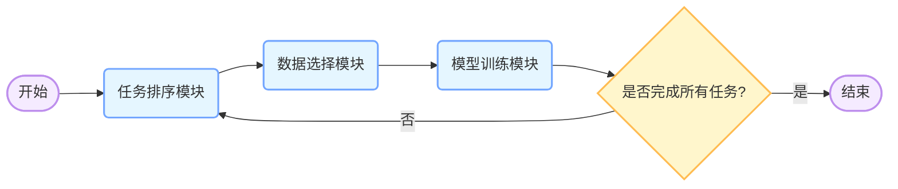

# AI中的课程学习:模仿人类学习过程

> 关键词：AI、课程学习、人类学习过程、机器学习、智能算法、学习策略、认知发展

> 摘要：本文聚焦于AI中的课程学习，旨在深入探讨其如何模仿人类学习过程。首先介绍课程学习的背景，包括目的、预期读者等内容。接着阐述核心概念与联系，剖析其原理和架构。通过Python代码详细讲解核心算法原理及具体操作步骤，并给出相关数学模型和公式。以项目实战展示代码案例并进行解读分析，探讨其实际应用场景。同时推荐相关的学习资源、开发工具框架和论文著作。最后总结未来发展趋势与挑战，解答常见问题并提供扩展阅读和参考资料，帮助读者全面理解AI中课程学习模仿人类学习过程这一关键技术。

## 1. 背景介绍 
### 1.1 目的和范围
课程学习在AI领域中具有重要意义，其目的在于提升人工智能系统的学习效率和学习质量。传统的机器学习方法往往是在固定的数据集上进行训练，而课程学习则借鉴人类学习的特点，将学习任务按照一定的顺序和难度进行组织，使得模型能够逐步学习和掌握知识。本文章的范围涵盖课程学习的基本概念、核心算法、数学模型、实际应用等多个方面，旨在全面深入地介绍AI中课程学习模仿人类学习过程的相关内容。

### 1.2 预期读者
本文预期读者包括对人工智能、机器学习领域感兴趣的科研人员、开发者、学生等。对于希望深入了解课程学习技术，以及探索如何让AI更好地模仿人类学习过程的专业人士，本文将提供有价值的技术参考和理论指导。同时，对于初学者来说，也可以通过本文初步了解课程学习的基本概念和原理。

### 1.3 文档结构概述
本文首先介绍课程学习的背景信息，让读者对其有初步的认识。接着阐述核心概念与联系，包括原理和架构的示意图及流程图，帮助读者构建起整体的知识框架。然后详细讲解核心算法原理和具体操作步骤，通过Python代码进行演示。随后介绍相关的数学模型和公式，并举例说明。通过项目实战展示代码案例并进行详细解读。探讨实际应用场景，让读者了解课程学习在不同领域的应用。推荐相关的工具和资源，为读者的进一步学习提供方向。最后总结未来发展趋势与挑战，解答常见问题并提供扩展阅读和参考资料，形成一个完整的知识体系。

### 1.4 术语表
#### 1.4.1 核心术语定义
- **课程学习（Curriculum Learning）**：一种机器学习策略，它按照从简单到复杂的顺序组织训练数据，使模型逐步学习和适应不同难度的任务，类似于人类的学习过程。
- **任务难度**：指学习任务的复杂程度，通常与数据的分布、特征的复杂度、任务的目标等因素相关。
- **学习策略**：为了实现特定的学习目标而采用的方法和步骤，在课程学习中，包括任务排序、数据选择等策略。

#### 1.4.2 相关概念解释
- **人类学习过程**：人类在学习过程中，通常会从简单的知识和技能开始，逐步积累经验，随着能力的提升，再学习更复杂的内容。例如，儿童先学习认识简单的图形和颜色，然后再学习更复杂的数学和语言知识。
- **机器学习**：一门多领域交叉学科，涉及概率论、统计学、逼近论、凸分析、算法复杂度理论等多门学科。它专门研究计算机怎样模拟或实现人类的学习行为，以获取新的知识或技能，重新组织已有的知识结构使之不断改善自身的性能。

#### 1.4.3 缩略词列表
- **AI**：Artificial Intelligence，人工智能
- **ML**：Machine Learning，机器学习

## 2. 核心概念与联系 
### 核心概念原理
课程学习的核心原理是模仿人类的学习过程，将学习任务按照难度进行排序，让模型从简单的任务开始学习，逐步过渡到复杂的任务。这样做的好处是，模型在学习简单任务时能够快速掌握基本的知识和技能，为学习更复杂的任务打下基础。同时，按照难度递增的顺序学习，能够避免模型在训练初期遇到过于复杂的任务而陷入局部最优解。

例如，在图像分类任务中，课程学习可以先让模型学习区分简单的几何图形，如圆形、方形和三角形，然后再学习区分不同种类的动物，最后学习区分更复杂的场景和物体。通过这种方式，模型能够逐步提高其分类能力。

### 架构的文本示意图
课程学习的架构主要包括任务排序模块、数据选择模块和模型训练模块。任务排序模块根据任务的难度对所有任务进行排序，确定学习的顺序。数据选择模块根据当前学习的任务，选择相应的数据进行训练。模型训练模块使用选择的数据对模型进行训练，更新模型的参数。

### Mermaid 流程图


## 3. 核心算法原理 & 具体操作步骤 
### 核心算法原理
课程学习的核心算法主要包括任务排序算法和数据选择算法。任务排序算法的目的是根据任务的难度对所有任务进行排序，常见的排序方法有基于任务复杂度的排序、基于模型性能的排序等。数据选择算法的目的是根据当前学习的任务，选择相应的数据进行训练，常见的选择方法有随机选择、按难度比例选择等。

### 具体操作步骤
以下是一个基于Python的简单课程学习示例，用于图像分类任务。

```python
import numpy as np
from sklearn.model_selection import train_test_split
from sklearn.neural_network import MLPClassifier

# 生成模拟数据
def generate_data(num_samples, num_features, num_classes):
    X = np.random.randn(num_samples, num_features)
    y = np.random.randint(0, num_classes, num_samples)
    return X, y

# 任务排序函数（简单示例：按样本数量排序）
def task_ordering(tasks):
    sorted_tasks = sorted(tasks, key=lambda task: task[0].shape[0])
    return sorted_tasks

# 课程学习过程
def curriculum_learning(tasks):
    model = MLPClassifier()
    for task in tasks:
        X, y = task
        X_train, X_test, y_train, y_test = train_test_split(X, y, test_size=0.2)
        model.partial_fit(X_train, y_train, classes=np.unique(y))
        score = model.score(X_test, y_test)
        print(f"当前任务准确率: {score}")
    return model

# 生成不同难度的任务
task1 = generate_data(100, 10, 2)
task2 = generate_data(200, 10, 3)
task3 = generate_data(300, 10, 4)

tasks = [task1, task2, task3]

# 任务排序
sorted_tasks = task_ordering(tasks)

# 课程学习
final_model = curriculum_learning(sorted_tasks)
```

### 代码解释
1. **数据生成**：`generate_data` 函数用于生成模拟的图像分类数据，包括特征矩阵 `X` 和标签向量 `y`。
2. **任务排序**：`task_ordering` 函数根据任务的样本数量对任务进行排序，样本数量少的任务被认为是较简单的任务。
3. **课程学习过程**：`curriculum_learning` 函数按照排序后的任务顺序，依次对模型进行训练，并输出每个任务的准确率。
4. **主程序**：生成不同难度的任务，对任务进行排序，然后进行课程学习，得到最终的模型。

## 4. 数学模型和公式 & 详细讲解 & 举例说明 
### 数学模型
课程学习的数学模型可以用以下公式表示：

设 $T = \{t_1, t_2, \cdots, t_n\}$ 为所有任务的集合，其中 $t_i$ 表示第 $i$ 个任务。每个任务 $t_i$ 对应一个数据集 $D_i = \{(x_{i1}, y_{i1}), (x_{i2}, y_{i2}), \cdots, (x_{im_i}, y_{im_i})\}$，其中 $(x_{ij}, y_{ij})$ 表示第 $i$ 个任务的第 $j$ 个样本，$x_{ij}$ 为特征向量，$y_{ij}$ 为标签。

任务的难度可以用一个函数 $f(t_i)$ 来表示，$f(t_i)$ 的值越大，任务的难度越高。课程学习的目标是找到一个任务的排序 $\pi = (\pi(1), \pi(2), \cdots, \pi(n))$，使得模型在按照这个顺序学习任务时，能够达到最优的性能。

### 详细讲解
在课程学习中，任务排序是一个关键步骤。任务的难度可以根据多种因素来定义，例如数据的复杂度、模型在该任务上的初始性能等。一种常见的任务排序方法是基于模型性能的排序，即先让模型在所有任务上进行初步的训练，然后根据模型在每个任务上的准确率对任务进行排序，准确率高的任务被认为是较简单的任务。

### 举例说明
假设我们有三个任务 $t_1$、$t_2$ 和 $t_3$，模型在这三个任务上的初始准确率分别为 $0.8$、$0.6$ 和 $0.4$。按照基于模型性能的排序方法，任务的排序为 $\pi = (t_1, t_2, t_3)$，即模型先学习任务 $t_1$，然后学习任务 $t_2$，最后学习任务 $t_3$。

## 5. 项目实战：代码实际案例和详细解释说明 
### 5.1  开发环境搭建
在进行课程学习的项目实战之前，需要搭建相应的开发环境。以下是具体的步骤：

1. **安装Python**：建议安装Python 3.6及以上版本，可以从Python官方网站（https://www.python.org/downloads/）下载并安装。
2. **安装必要的库**：使用pip命令安装所需的库，包括 `numpy`、`scikit-learn` 等。
```sh
pip install numpy scikit-learn
```

### 5.2  源代码详细实现和代码解读
以下是一个更完整的课程学习项目实战代码，用于手写数字识别任务。

```python
import numpy as np
from sklearn.datasets import load_digits
from sklearn.model_selection import train_test_split
from sklearn.neural_network import MLPClassifier
from sklearn.metrics import accuracy_score

# 加载手写数字数据集
digits = load_digits()
X = digits.data
y = digits.target

# 划分不同难度的任务
# 简单任务：只包含数字0和1
mask_simple = np.logical_or(y == 0, y == 1)
X_simple = X[mask_simple]
y_simple = y[mask_simple]

# 中等任务：包含数字0、1、2、3
mask_medium = np.logical_or(np.logical_or(y == 0, y == 1), np.logical_or(y == 2, y == 3))
X_medium = X[mask_medium]
y_medium = y[mask_medium]

# 复杂任务：包含所有数字
X_complex = X
y_complex = y

# 任务列表
tasks = [(X_simple, y_simple), (X_medium, y_medium), (X_complex, y_complex)]

# 任务排序（这里已经按照难度排序）
sorted_tasks = tasks

# 课程学习过程
model = MLPClassifier()
for task in sorted_tasks:
    X_task, y_task = task
    X_train, X_test, y_train, y_test = train_test_split(X_task, y_task, test_size=0.2)
    model.partial_fit(X_train, y_train, classes=np.unique(y))
    y_pred = model.predict(X_test)
    accuracy = accuracy_score(y_test, y_pred)
    print(f"当前任务准确率: {accuracy}")

# 最终测试
X_train_final, X_test_final, y_train_final, y_test_final = train_test_split(X_complex, y_complex, test_size=0.2)
y_pred_final = model.predict(X_test_final)
final_accuracy = accuracy_score(y_test_final, y_pred_final)
print(f"最终准确率: {final_accuracy}")
```

### 5.3  代码解读与分析
1. **数据加载**：使用 `load_digits` 函数加载手写数字数据集。
2. **任务划分**：将数据集划分为不同难度的任务，简单任务只包含数字0和1，中等任务包含数字0、1、2、3，复杂任务包含所有数字。
3. **任务排序**：这里已经按照难度对任务进行了排序，简单任务在前，复杂任务在后。
4. **课程学习过程**：使用 `MLPClassifier` 作为模型，按照任务顺序依次对模型进行训练，并输出每个任务的准确率。
5. **最终测试**：在所有任务训练完成后，对模型进行最终测试，输出最终的准确率。

通过这个项目实战，我们可以看到课程学习能够逐步提高模型的性能，使模型在面对复杂任务时也能取得较好的效果。

## 6. 实际应用场景 
### 自然语言处理
在自然语言处理领域，课程学习可以用于文本分类、机器翻译等任务。例如，在文本分类任务中，可以先让模型学习区分简单的文本类别，如体育新闻和科技新闻，然后再学习区分更复杂的文本类别，如不同类型的文学作品。在机器翻译任务中，可以先让模型学习翻译简单的句子，然后再学习翻译复杂的句子。

### 计算机视觉
在计算机视觉领域，课程学习可以用于图像分类、目标检测、语义分割等任务。例如，在图像分类任务中，可以先让模型学习区分简单的物体类别，如猫和狗，然后再学习区分更复杂的物体类别，如不同品种的猫和狗。在目标检测任务中，可以先让模型学习检测简单的目标，如人脸，然后再学习检测更复杂的目标，如汽车和行人。

### 强化学习
在强化学习领域，课程学习可以用于智能体的训练。例如，在机器人导航任务中，可以先让智能体在简单的环境中学习导航，如空旷的房间，然后再让智能体在复杂的环境中学习导航，如充满障碍物的房间。通过课程学习，智能体能够逐步提高其导航能力。

## 7. 工具和资源推荐
### 7.1 学习资源推荐
#### 7.1.1 书籍推荐
- 《机器学习》（周志华）：这本书全面介绍了机器学习的基本概念、算法和应用，是机器学习领域的经典教材。
- 《深度学习》（Ian Goodfellow、Yoshua Bengio 和 Aaron Courville）：这本书深入介绍了深度学习的理论和实践，是深度学习领域的权威著作。

#### 7.1.2 在线课程
- Coursera上的“机器学习”课程（Andrew Ng教授）：这是一门非常经典的机器学习课程，适合初学者学习。
- edX上的“深度学习”课程：由知名学者授课，内容丰富，适合有一定基础的学习者深入学习。

#### 7.1.3 技术博客和网站
- 机器之心（https://www.alioon.com/）：提供人工智能领域的最新技术动态和学术论文解读。
- 深度学习前沿（https://deeplearning.course.fast.ai/）：提供深度学习领域的最新研究成果和实践经验。

### 7.2 开发工具框架推荐
#### 7.2.1 IDE和编辑器
- PyCharm：一款功能强大的Python集成开发环境，提供代码编辑、调试、版本控制等功能。
- Jupyter Notebook：一种交互式的开发环境，适合进行数据探索和模型训练。

#### 7.2.2 调试和性能分析工具
- TensorBoard：TensorFlow的可视化工具，用于可视化模型的训练过程和性能指标。
- PyTorch Profiler：PyTorch的性能分析工具，用于分析模型的性能瓶颈。

#### 7.2.3 相关框架和库
- TensorFlow：一个开源的机器学习框架，提供丰富的工具和库，用于构建和训练深度学习模型。
- PyTorch：一个开源的深度学习框架，具有动态图的特点，适合快速开发和研究。

### 7.3 相关论文著作推荐
#### 7.3.1 经典论文
- 《Curriculum Learning》（Yoshua Bengio等）：这是课程学习领域的经典论文，首次提出了课程学习的概念。
- 《Self-Paced Learning for Latent Variable Models》（Ruslan Salakhutdinov等）：该论文提出了自定进度学习的方法，是课程学习的一种扩展。

#### 7.3.2 最新研究成果
- 关注NeurIPS、ICML、CVPR等顶级学术会议的论文，了解课程学习领域的最新研究动态。

#### 7.3.3 应用案例分析
- 一些知名的研究机构和公司会发布课程学习在实际应用中的案例分析，如Google、Facebook等，可以通过他们的官方博客和研究报告了解相关内容。

## 8. 总结：未来发展趋势与挑战
### 未来发展趋势
- **与其他技术的融合**：课程学习将与强化学习、迁移学习等技术相结合，进一步提高人工智能系统的学习能力和泛化能力。例如，将课程学习与强化学习相结合，可以让智能体在复杂的环境中更快地学习到最优策略。
- **自适应课程学习**：未来的课程学习系统将能够根据模型的学习状态和任务的特点，自适应地调整学习顺序和难度，实现更加智能化的学习过程。
- **跨领域应用**：课程学习将在更多的领域得到应用，如医疗、金融、交通等，为解决实际问题提供更有效的方法。

### 挑战
- **任务难度评估**：如何准确地评估任务的难度是课程学习面临的一个挑战。目前的方法大多基于经验和简单的指标，缺乏统一的标准和理论基础。
- **计算资源需求**：课程学习通常需要更多的计算资源和时间，特别是在处理大规模数据集和复杂任务时。如何优化课程学习的算法，降低计算资源需求，是一个亟待解决的问题。
- **可解释性**：课程学习的决策过程往往比较复杂，缺乏可解释性。在一些对安全性和可靠性要求较高的领域，如医疗和交通，可解释性是一个关键问题。

## 9. 附录：常见问题与解答
### 问题1：课程学习和传统的机器学习方法有什么区别？
解答：传统的机器学习方法通常是在固定的数据集上进行训练，而课程学习则按照从简单到复杂的顺序组织训练数据，使模型逐步学习和适应不同难度的任务。课程学习能够提高模型的学习效率和学习质量，避免模型在训练初期遇到过于复杂的任务而陷入局部最优解。

### 问题2：如何确定任务的难度？
解答：任务的难度可以根据多种因素来确定，例如数据的复杂度、模型在该任务上的初始性能等。常见的方法有基于任务复杂度的排序、基于模型性能的排序等。

### 问题3：课程学习适用于所有的机器学习任务吗？
解答：课程学习并不适用于所有的机器学习任务。一般来说，课程学习适用于任务之间存在明显难度差异，且简单任务的学习能够为复杂任务的学习提供帮助的情况。对于一些任务难度均匀的情况，课程学习可能不会带来明显的效果提升。

## 10. 扩展阅读 & 参考资料
### 扩展阅读
- 《人工智能：一种现代方法》（Stuart Russell和Peter Norvig）：这本书全面介绍了人工智能的基本概念、算法和应用，是人工智能领域的经典著作。
- 《神经网络与深度学习》（邱锡鹏）：这本书深入介绍了神经网络和深度学习的理论和实践，适合有一定基础的读者深入学习。

### 参考资料
- 相关学术论文和研究报告，如《Curriculum Learning》等。
- 开源代码库和项目，如TensorFlow和PyTorch的官方文档和示例代码。