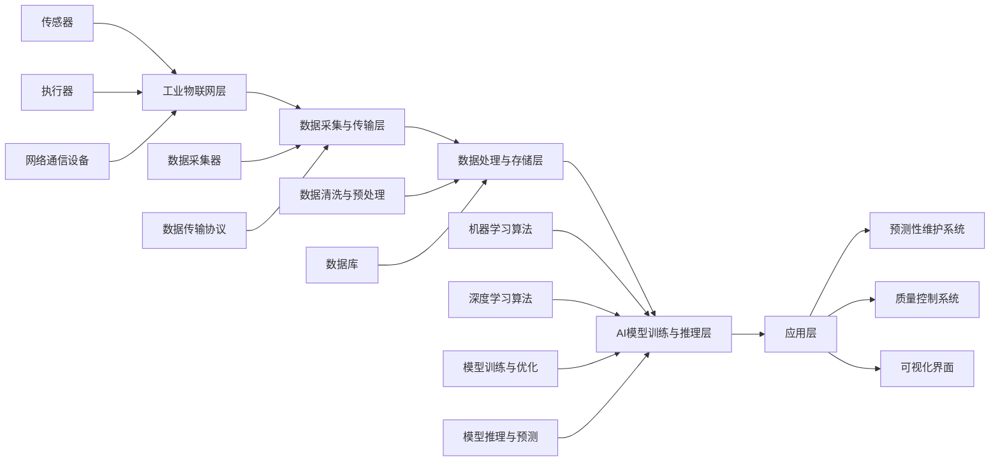

# AI在智能制造中的应用：预测性维护与质量控制

> 关键词：AI、智能制造、预测性维护、质量控制、工业物联网

> 摘要：本文深入探讨了AI在智能制造中预测性维护与质量控制方面的应用。首先介绍了相关背景知识，包括目的、预期读者、文档结构和术语表。接着阐述了核心概念及其联系，通过文本示意图和Mermaid流程图进行展示。详细讲解了核心算法原理并给出Python源代码，同时介绍了相关数学模型和公式。通过项目实战展示了代码实现及解读，分析了实际应用场景。还推荐了学习资源、开发工具框架和相关论文著作。最后总结了未来发展趋势与挑战，并提供常见问题解答和参考资料，旨在为读者全面呈现AI在智能制造预测性维护与质量控制中的技术应用与发展前景。

## 1. 背景介绍 
### 1.1 目的和范围
在当今智能制造的大趋势下，提高生产效率、降低成本、保证产品质量是企业追求的重要目标。AI技术的发展为实现这些目标提供了强大的工具。本文的目的在于详细阐述AI在智能制造中预测性维护与质量控制方面的应用，包括相关技术原理、实现步骤、实际案例以及未来发展趋势等内容。范围涵盖了从基础概念到具体算法实现，再到实际项目应用的各个方面，旨在为读者提供一个全面且深入的了解。

### 1.2 预期读者
本文预期读者包括智能制造领域的工程师、技术研发人员、企业管理人员，以及对AI技术在工业领域应用感兴趣的学者和学生。对于工程师和技术研发人员，本文提供了具体的技术实现细节和算法原理，可作为技术参考；对于企业管理人员，有助于其了解AI在智能制造中的价值和应用场景，为企业决策提供依据；对于学者和学生，能帮助他们深入学习相关领域的知识和研究动态。

### 1.3 文档结构概述
本文将按照以下结构展开：首先介绍背景知识，包括目的、预期读者、文档结构和术语表；接着阐述核心概念及其联系，通过文本示意图和Mermaid流程图进行展示；详细讲解核心算法原理并给出Python源代码；介绍相关数学模型和公式；通过项目实战展示代码实现及解读；分析实际应用场景；推荐学习资源、开发工具框架和相关论文著作；最后总结未来发展趋势与挑战，并提供常见问题解答和参考资料。

### 1.4 术语表
#### 1.4.1 核心术语定义
- **AI（Artificial Intelligence）**：人工智能，是一门研究如何使计算机系统能够模拟人类智能的技术和科学。
- **智能制造（Intelligent Manufacturing）**：基于新一代信息通信技术与先进制造技术深度融合，贯穿于设计、生产、管理、服务等制造活动的各个环节，具有自感知、自学习、自决策、自执行、自适应等功能的新型生产方式。
- **预测性维护（Predictive Maintenance）**：利用数据分析和AI技术，通过对设备运行状态数据的实时监测和分析，提前预测设备可能出现的故障，从而采取相应的维护措施，避免设备故障导致的生产中断和损失。
- **质量控制（Quality Control）**：为了达到质量要求所采取的作业技术和活动，在智能制造中，利用AI技术可以实现对产品质量的实时监测和自动控制，提高产品质量稳定性。
- **工业物联网（Industrial Internet of Things，IIoT）**：将具有感知、监控能力的各类采集、控制传感器或控制器，以及移动通信、智能分析等技术不断融入到工业生产过程各个环节，从而大幅提高制造效率，改善产品质量，降低产品成本和资源消耗，最终实现将传统工业提升到智能化的新阶段。

#### 1.4.2 相关概念解释
- **机器学习（Machine Learning）**：AI的一个重要分支，它让计算机通过数据和经验来学习，而不是通过明确的编程指令。在预测性维护和质量控制中，机器学习算法可以从设备运行数据和产品质量数据中提取有用信息，进行故障预测和质量判断。
- **深度学习（Deep Learning）**：一种基于人工神经网络的机器学习方法，具有强大的特征提取和模式识别能力。在处理复杂的工业数据时，深度学习可以自动发现数据中的潜在模式和规律，提高预测和控制的准确性。
- **传感器（Sensor）**：用于感知物理量、化学量等信息，并将其转换为电信号或其他形式的信号的设备。在工业生产中，传感器可以实时采集设备的温度、压力、振动等运行状态数据，为预测性维护和质量控制提供数据支持。

#### 1.4.3 缩略词列表
- **AI**：Artificial Intelligence
- **IIoT**：Industrial Internet of Things
- **ML**：Machine Learning
- **DL**：Deep Learning

## 2. 核心概念与联系 

### 核心概念原理
#### 预测性维护原理
预测性维护的核心原理是通过对设备运行状态数据的实时监测和分析，建立设备故障模型，预测设备可能出现的故障。设备运行状态数据可以通过传感器实时采集，包括温度、压力、振动、电流等物理量。这些数据经过预处理后，利用机器学习或深度学习算法进行特征提取和模式识别，建立故障预测模型。当设备运行状态数据出现异常时，模型可以及时发出预警，通知维护人员采取相应的维护措施。

#### 质量控制原理
质量控制的原理是通过对生产过程中的关键参数和产品质量数据的实时监测和分析，建立质量控制模型，实现对产品质量的实时控制。生产过程中的关键参数包括温度、压力、速度、时间等，产品质量数据可以通过检测设备实时采集，如尺寸、重量、硬度等。这些数据经过预处理后，利用机器学习或深度学习算法进行特征提取和模式识别，建立质量控制模型。当生产过程中的关键参数或产品质量数据出现异常时，模型可以及时调整生产参数，保证产品质量的稳定性。

### 架构的文本示意图
```plaintext
工业物联网层
|-- 传感器（温度、压力、振动等）
|-- 执行器（电机、阀门等）
|-- 网络通信设备（路由器、网关等）

数据采集与传输层
|-- 数据采集器
|-- 数据传输协议（HTTP、MQTT等）

数据处理与存储层
|-- 数据清洗与预处理
|-- 数据库（关系型数据库、非关系型数据库）

AI模型训练与推理层
|-- 机器学习算法（决策树、支持向量机等）
|-- 深度学习算法（卷积神经网络、循环神经网络等）
|-- 模型训练与优化
|-- 模型推理与预测

应用层
|-- 预测性维护系统
|-- 质量控制系统
|-- 可视化界面
```

### Mermaid流程图


## 3. 核心算法原理 & 具体操作步骤 

### 预测性维护核心算法原理及Python代码实现
#### 原理
在预测性维护中，我们可以使用基于机器学习的分类算法，如决策树算法。决策树算法通过对设备运行状态数据的学习，构建决策树模型，根据输入的设备状态数据进行分类，判断设备是否即将发生故障。

#### Python代码实现
```python
import pandas as pd
from sklearn.model_selection import train_test_split
from sklearn.tree import DecisionTreeClassifier
from sklearn.metrics import accuracy_score

# 读取设备运行状态数据
data = pd.read_csv('equipment_data.csv')

# 分离特征和标签
X = data.drop('fault_label', axis=1)
y = data['fault_label']

# 划分训练集和测试集
X_train, X_test, y_train, y_test = train_test_split(X, y, test_size=0.2, random_state=42)

# 创建决策树分类器
clf = DecisionTreeClassifier()

# 训练模型
clf.fit(X_train, y_train)

# 预测
y_pred = clf.predict(X_test)

# 计算准确率
accuracy = accuracy_score(y_test, y_pred)
print(f"Accuracy: {accuracy}")
```

### 质量控制核心算法原理及Python代码实现
#### 原理
在质量控制中，我们可以使用基于深度学习的卷积神经网络（CNN）算法。CNN算法通过对产品图像数据的学习，提取图像特征，判断产品是否合格。

#### Python代码实现
```python
import tensorflow as tf
from tensorflow.keras.datasets import mnist
from tensorflow.keras.models import Sequential
from tensorflow.keras.layers import Conv2D, MaxPooling2D, Flatten, Dense

# 加载数据集
(train_images, train_labels), (test_images, test_labels) = mnist.load_data()

# 数据预处理
train_images = train_images.reshape((60000, 28, 28, 1)).astype('float32') / 255
test_images = test_images.reshape((10000, 28, 28, 1)).astype('float32') / 255

# 构建CNN模型
model = Sequential([
    Conv2D(32, (3, 3), activation='relu', input_shape=(28, 28, 1)),
    MaxPooling2D((2, 2)),
    Conv2D(64, (3, 3), activation='relu'),
    MaxPooling2D((2, 2)),
    Flatten(),
    Dense(64, activation='relu'),
    Dense(10, activation='softmax')
])

# 编译模型
model.compile(optimizer='adam',
              loss='sparse_categorical_crossentropy',
              metrics=['accuracy'])

# 训练模型
model.fit(train_images, train_labels, epochs=5)

# 评估模型
test_loss, test_acc = model.evaluate(test_images, test_labels)
print(f"Test accuracy: {test_acc}")
```

### 具体操作步骤
#### 预测性维护操作步骤
1. **数据采集**：通过传感器实时采集设备的运行状态数据，如温度、压力、振动等。
2. **数据预处理**：对采集到的数据进行清洗、归一化等预处理操作，去除噪声和异常值，提高数据质量。
3. **特征提取**：从预处理后的数据中提取有用的特征，如均值、方差、标准差等。
4. **模型训练**：使用机器学习或深度学习算法对提取的特征进行训练，建立故障预测模型。
5. **模型评估**：使用测试数据对训练好的模型进行评估，计算模型的准确率、召回率等指标。
6. **模型部署**：将评估合格的模型部署到生产环境中，实时监测设备的运行状态，当出现异常时及时发出预警。

#### 质量控制操作步骤
1. **数据采集**：通过检测设备实时采集产品的质量数据，如尺寸、重量、硬度等，或者采集产品的图像数据。
2. **数据预处理**：对采集到的数据进行清洗、归一化等预处理操作，对图像数据进行裁剪、缩放等操作。
3. **特征提取**：从预处理后的数据中提取有用的特征，对于图像数据可以使用CNN算法自动提取特征。
4. **模型训练**：使用机器学习或深度学习算法对提取的特征进行训练，建立质量控制模型。
5. **模型评估**：使用测试数据对训练好的模型进行评估，计算模型的准确率、召回率等指标。
6. **模型部署**：将评估合格的模型部署到生产环境中，实时监测产品的质量，当出现质量问题时及时调整生产参数。

## 4. 数学模型和公式 & 详细讲解 & 举例说明 

### 预测性维护数学模型和公式
#### 决策树算法数学模型
决策树算法的核心是构建决策树模型，决策树是一种基于树结构进行决策的模型。决策树的每个内部节点是一个属性上的测试，每个分支是一个测试输出，每个叶节点是一个类别或值。决策树的构建过程是一个递归划分数据集的过程，通过选择最优的属性进行划分，使得划分后的子集纯度最高。

#### 信息增益公式
信息增益是决策树算法中选择最优属性的一个重要指标，它衡量了使用某个属性进行划分后，数据集纯度的提升程度。信息增益的计算公式如下：
$$
IG(D, A) = H(D) - \sum_{v \in Values(A)} \frac{|D^v|}{|D|} H(D^v)
$$
其中，$IG(D, A)$ 表示使用属性 $A$ 对数据集 $D$ 进行划分的信息增益，$H(D)$ 表示数据集 $D$ 的信息熵，$Values(A)$ 表示属性 $A$ 的所有可能取值，$D^v$ 表示属性 $A$ 取值为 $v$ 的子集，$|D|$ 和 $|D^v|$ 分别表示数据集 $D$ 和子集 $D^v$ 的样本数量。

#### 信息熵公式
信息熵是衡量数据集纯度的一个指标，它表示数据集的不确定性程度。信息熵的计算公式如下：
$$
H(D) = - \sum_{k = 1}^{|Y|} p_k \log_2 p_k
$$
其中，$H(D)$ 表示数据集 $D$ 的信息熵，$|Y|$ 表示数据集 $D$ 中类别的数量，$p_k$ 表示数据集 $D$ 中属于第 $k$ 类的样本比例。

#### 举例说明
假设有一个数据集 $D$ 包含 10 个样本，其中 6 个属于类别 0，4 个属于类别 1。则数据集 $D$ 的信息熵为：
$$
H(D) = - \frac{6}{10} \log_2 \frac{6}{10} - \frac{4}{10} \log_2 \frac{4}{10} \approx 0.971
$$
假设使用属性 $A$ 对数据集 $D$ 进行划分，属性 $A$ 有两个取值 $v_1$ 和 $v_2$，划分后的子集 $D^{v_1}$ 包含 4 个样本，其中 3 个属于类别 0，1 个属于类别 1；子集 $D^{v_2}$ 包含 6 个样本，其中 3 个属于类别 0，3 个属于类别 1。则子集 $D^{v_1}$ 和 $D^{v_2}$ 的信息熵分别为：
$$
H(D^{v_1}) = - \frac{3}{4} \log_2 \frac{3}{4} - \frac{1}{4} \log_2 \frac{1}{4} \approx 0.811
$$
$$
H(D^{v_2}) = - \frac{3}{6} \log_2 \frac{3}{6} - \frac{3}{6} \log_2 \frac{3}{6} = 1
$$
则使用属性 $A$ 对数据集 $D$ 进行划分的信息增益为：
$$
IG(D, A) = H(D) - \frac{4}{10} H(D^{v_1}) - \frac{6}{10} H(D^{v_2}) \approx 0.971 - \frac{4}{10} \times 0.811 - \frac{6}{10} \times 1 \approx 0.047
$$

### 质量控制数学模型和公式
#### 卷积神经网络（CNN）数学模型
卷积神经网络（CNN）是一种专门用于处理具有网格结构数据（如图像）的深度学习模型。CNN主要由卷积层、池化层和全连接层组成。

#### 卷积层公式
卷积层的核心操作是卷积运算，卷积运算的公式如下：
$$
y_{i,j}^l = \sum_{m = 0}^{M - 1} \sum_{n = 0}^{N - 1} x_{i + m, j + n}^{l - 1} w_{m,n}^l + b^l
$$
其中，$y_{i,j}^l$ 表示第 $l$ 层卷积层中第 $(i, j)$ 个神经元的输出，$x_{i + m, j + n}^{l - 1}$ 表示第 $l - 1$ 层中对应的输入值，$w_{m,n}^l$ 表示第 $l$ 层的卷积核权重，$b^l$ 表示第 $l$ 层的偏置，$M$ 和 $N$ 分别表示卷积核的高度和宽度。

#### 池化层公式
池化层的主要作用是对特征图进行下采样，常用的池化操作有最大池化和平均池化。最大池化的公式如下：
$$
y_{i,j}^l = \max_{m = 0}^{M - 1} \max_{n = 0}^{N - 1} x_{iM + m, jN + n}^{l - 1}
$$
其中，$y_{i,j}^l$ 表示第 $l$ 层池化层中第 $(i, j)$ 个神经元的输出，$x_{iM + m, jN + n}^{l - 1}$ 表示第 $l - 1$ 层中对应的输入值，$M$ 和 $N$ 分别表示池化窗口的高度和宽度。

#### 举例说明
假设有一个输入图像的大小为 $32 \times 32$，使用一个大小为 $3 \times 3$ 的卷积核进行卷积运算，步长为 1，填充为 0。则卷积层的输出特征图的大小为 $(32 - 3 + 1) \times (32 - 3 + 1) = 30 \times 30$。如果使用一个大小为 $2 \times 2$ 的最大池化窗口进行池化操作，步长为 2，则池化层的输出特征图的大小为 $(30 \div 2) \times (30 \div 2) = 15 \times 15$。

## 5. 项目实战：代码实际案例和详细解释说明 

### 5.1  开发环境搭建
#### 硬件环境
- 服务器：配备多核处理器、大容量内存和高速硬盘的服务器，如戴尔PowerEdge R740xd。
- 传感器：温度传感器、压力传感器、振动传感器等，用于实时采集设备的运行状态数据。
- 检测设备：尺寸测量仪、硬度测试仪、图像采集设备等，用于实时采集产品的质量数据。

#### 软件环境
- 操作系统：Linux操作系统，如Ubuntu 20.04。
- 编程语言：Python 3.8及以上版本。
- 开发框架：TensorFlow、Scikit-learn等。
- 数据库：MySQL、MongoDB等。

### 5.2  源代码详细实现和代码解读
#### 预测性维护项目实现
```python
import pandas as pd
from sklearn.model_selection import train_test_split
from sklearn.ensemble import RandomForestClassifier
from sklearn.metrics import classification_report

# 读取设备运行状态数据
data = pd.read_csv('equipment_data.csv')

# 分离特征和标签
X = data.drop('fault_label', axis=1)
y = data['fault_label']

# 划分训练集和测试集
X_train, X_test, y_train, y_test = train_test_split(X, y, test_size=0.2, random_state=42)

# 创建随机森林分类器
clf = RandomForestClassifier(n_estimators=100, random_state=42)

# 训练模型
clf.fit(X_train, y_train)

# 预测
y_pred = clf.predict(X_test)

# 评估模型
report = classification_report(y_test, y_pred)
print(report)
```
#### 代码解读
1. **数据读取**：使用 `pandas` 库的 `read_csv` 函数读取设备运行状态数据。
2. **特征和标签分离**：将数据集中的特征和标签分离，分别存储在 `X` 和 `y` 中。
3. **数据集划分**：使用 `sklearn` 库的 `train_test_split` 函数将数据集划分为训练集和测试集，测试集占比为 20%。
4. **模型创建**：使用 `sklearn` 库的 `RandomForestClassifier` 类创建随机森林分类器，设置树的数量为 100。
5. **模型训练**：使用训练集数据对随机森林分类器进行训练。
6. **模型预测**：使用训练好的模型对测试集数据进行预测。
7. **模型评估**：使用 `sklearn` 库的 `classification_report` 函数对模型的预测结果进行评估，输出分类报告。

#### 质量控制项目实现
```python
import tensorflow as tf
from tensorflow.keras.preprocessing.image import ImageDataGenerator
from tensorflow.keras.models import Sequential
from tensorflow.keras.layers import Conv2D, MaxPooling2D, Flatten, Dense

# 数据预处理
train_datagen = ImageDataGenerator(
    rescale=1./255,
    shear_range=0.2,
    zoom_range=0.2,
    horizontal_flip=True
)

test_datagen = ImageDataGenerator(rescale=1./255)

train_generator = train_datagen.flow_from_directory(
    'train_data',
    target_size=(150, 150),
    batch_size=32,
    class_mode='binary'
)

test_generator = test_datagen.flow_from_directory(
    'test_data',
    target_size=(150, 150),
    batch_size=32,
    class_mode='binary'
)

# 构建CNN模型
model = Sequential([
    Conv2D(32, (3, 3), activation='relu', input_shape=(150, 150, 3)),
    MaxPooling2D((2, 2)),
    Conv2D(64, (3, 3), activation='relu'),
    MaxPooling2D((2, 2)),
    Conv2D(128, (3, 3), activation='relu'),
    MaxPooling2D((2, 2)),
    Flatten(),
    Dense(128, activation='relu'),
    Dense(1, activation='sigmoid')
])

# 编译模型
model.compile(optimizer='adam',
              loss='binary_crossentropy',
              metrics=['accuracy'])

# 训练模型
model.fit(
    train_generator,
    steps_per_epoch=train_generator.samples // train_generator.batch_size,
    epochs=10,
    validation_data=test_generator,
    validation_steps=test_generator.samples // test_generator.batch_size
)

# 评估模型
test_loss, test_acc = model.evaluate(test_generator)
print(f"Test accuracy: {test_acc}")
```
#### 代码解读
1. **数据预处理**：使用 `ImageDataGenerator` 类对图像数据进行预处理，包括归一化、剪切、缩放和水平翻转等操作。
2. **数据加载**：使用 `flow_from_directory` 方法从指定目录中加载训练集和测试集图像数据。
3. **模型构建**：使用 `Sequential` 模型构建 CNN 模型，包括卷积层、池化层、全连接层等。
4. **模型编译**：使用 `adam` 优化器和 `binary_crossentropy` 损失函数编译模型，评估指标为准确率。
5. **模型训练**：使用训练集数据对模型进行训练，设置训练轮数为 10。
6. **模型评估**：使用测试集数据对模型进行评估，输出测试准确率。

### 5.3  代码解读与分析
#### 预测性维护代码分析
- **数据预处理**：在实际应用中，设备运行状态数据可能存在噪声和缺失值，需要进行数据清洗和填充操作。同时，为了提高模型的训练效率和准确性，还需要对数据进行归一化处理。
- **模型选择**：随机森林分类器是一种集成学习算法，它通过组合多个决策树来提高模型的性能。在实际应用中，可以根据数据特点和任务需求选择不同的模型，如支持向量机、神经网络等。
- **模型评估**：除了分类报告中的准确率、召回率等指标外，还可以使用混淆矩阵、ROC曲线等指标对模型进行评估，全面了解模型的性能。

#### 质量控制代码分析
- **数据增强**：在图像数据有限的情况下，使用数据增强技术可以扩充训练集数据，提高模型的泛化能力。
- **模型架构**：CNN 模型的架构对模型的性能有很大影响。在实际应用中，可以根据图像数据的特点和任务需求调整模型的架构，如增加卷积层和全连接层的数量、调整卷积核的大小等。
- **超参数调整**：模型的超参数（如学习率、训练轮数、批次大小等）对模型的性能也有很大影响。在实际应用中，可以使用网格搜索、随机搜索等方法对超参数进行调整，找到最优的超参数组合。

## 6. 实际应用场景 
### 预测性维护应用场景
#### 制造业
在制造业中，设备的正常运行对于保证生产效率和产品质量至关重要。通过预测性维护，可以提前发现设备的潜在故障，及时进行维护，避免设备故障导致的生产中断和损失。例如，在汽车制造企业中，对生产线的机器人、发动机等关键设备进行实时监测和故障预测，可以有效提高生产效率和产品质量。

#### 能源行业
在能源行业中，发电设备、输电设备等的正常运行对于保障能源供应至关重要。通过预测性维护，可以提前发现设备的潜在故障，及时进行维护，避免设备故障导致的停电事故和经济损失。例如，在风力发电场中，对风力发电机组的齿轮箱、发电机等关键部件进行实时监测和故障预测，可以有效提高风力发电的可靠性和效率。

#### 交通运输业
在交通运输业中，交通工具的正常运行对于保障人员和货物的安全运输至关重要。通过预测性维护，可以提前发现交通工具的潜在故障，及时进行维护，避免交通事故的发生。例如，在航空业中，对飞机的发动机、起落架等关键部件进行实时监测和故障预测，可以有效提高飞行安全。

### 质量控制应用场景
#### 电子制造业
在电子制造业中，产品的质量直接影响到产品的性能和市场竞争力。通过质量控制，可以实时监测产品的质量，及时发现质量问题，调整生产参数，保证产品质量的稳定性。例如，在手机制造企业中，对手机的外观、性能等进行实时检测，及时发现不合格产品，进行返工或报废处理，可以有效提高产品质量和生产效率。

#### 食品加工业
在食品加工业中，产品的质量直接关系到消费者的健康和安全。通过质量控制，可以实时监测食品的质量，及时发现质量问题，采取相应的措施，保证食品的质量安全。例如，在食品加工企业中，对食品的营养成分、微生物指标等进行实时检测，及时发现不合格产品，进行召回或销毁处理，可以有效保障消费者的健康和安全。

#### 医疗器械制造业
在医疗器械制造业中，产品的质量直接关系到患者的生命安全。通过质量控制，可以实时监测医疗器械的质量，及时发现质量问题，采取相应的措施，保证医疗器械的质量安全。例如，在医疗器械制造企业中，对医疗器械的性能、安全性等进行实时检测，及时发现不合格产品，进行返工或报废处理，可以有效保障患者的生命安全。

## 7. 工具和资源推荐
### 7.1 学习资源推荐
#### 7.1.1 书籍推荐
- 《机器学习》（周志华著）：本书全面介绍了机器学习的基本概念、算法和应用，是机器学习领域的经典教材。
- 《深度学习》（Ian Goodfellow、Yoshua Bengio、Aaron Courville著）：本书系统介绍了深度学习的基本原理、算法和应用，是深度学习领域的权威著作。
- 《Python机器学习实战》（Sebastian Raschka著）：本书通过大量的实例介绍了Python在机器学习中的应用，适合初学者学习。

#### 7.1.2 在线课程
- Coursera上的“机器学习”课程（Andrew Ng教授主讲）：该课程是机器学习领域的经典课程，通过视频讲解、作业和考试等方式，系统介绍了机器学习的基本概念、算法和应用。
- edX上的“深度学习”课程（MIT教授主讲）：该课程系统介绍了深度学习的基本原理、算法和应用，通过视频讲解、编程作业和项目实践等方式，帮助学习者掌握深度学习的核心技术。
- 中国大学MOOC上的“人工智能基础”课程：该课程由国内知名高校的教授主讲，系统介绍了人工智能的基本概念、算法和应用，适合初学者学习。

#### 7.1.3 技术博客和网站
- Medium：一个技术博客平台，上面有很多关于AI、机器学习、深度学习等领域的优秀文章。
- arXiv：一个预印本服务器，上面有很多关于AI、机器学习、深度学习等领域的最新研究成果。
- 机器之心：一个专注于AI技术的媒体平台，上面有很多关于AI技术的最新动态、技术文章和应用案例。

### 7.2 开发工具框架推荐
#### 7.2.1 IDE和编辑器
- PyCharm：一款专门为Python开发设计的集成开发环境，具有代码编辑、调试、版本控制等功能，适合专业开发者使用。
- Jupyter Notebook：一个基于Web的交互式计算环境，支持Python、R等多种编程语言，适合数据科学家和机器学习工程师进行数据探索和模型开发。
- Visual Studio Code：一款轻量级的代码编辑器，支持多种编程语言和插件，具有代码高亮、智能提示、调试等功能，适合初学者和开发者使用。

#### 7.2.2 调试和性能分析工具
- TensorBoard：TensorFlow的可视化工具，可以帮助开发者可视化模型的训练过程、性能指标等信息，方便调试和优化模型。
- PyTorch Profiler：PyTorch的性能分析工具，可以帮助开发者分析模型的性能瓶颈，优化模型的性能。
- Scikit-learn的交叉验证工具：Scikit-learn提供的交叉验证工具可以帮助开发者评估模型的性能，选择最优的模型和超参数。

#### 7.2.3 相关框架和库
- TensorFlow：一个开源的机器学习框架，由Google开发和维护，支持多种深度学习算法和模型，具有高效、灵活等特点。
- PyTorch：一个开源的深度学习框架，由Facebook开发和维护，支持动态图和静态图，具有易用、高效等特点。
- Scikit-learn：一个开源的机器学习库，提供了丰富的机器学习算法和工具，如分类、回归、聚类等算法，适合初学者和开发者使用。

### 7.3 相关论文著作推荐
#### 7.3.1 经典论文
- “Gradient-Based Learning Applied to Document Recognition”（Yann LeCun、Léon Bottou、Yoshua Bengio、Patrick Haffner著）：该论文介绍了卷积神经网络（CNN）的基本原理和应用，是CNN领域的经典论文。
- “ImageNet Classification with Deep Convolutional Neural Networks”（Alex Krizhevsky、Ilya Sutskever、Geoffrey E. Hinton著）：该论文介绍了AlexNet模型，在2012年的ImageNet图像分类竞赛中取得了优异的成绩，开创了深度学习在计算机视觉领域的先河。
- “Long Short-Term Memory”（Sepp Hochreiter、Jürgen Schmidhuber著）：该论文介绍了长短期记忆网络（LSTM）的基本原理和应用，是LSTM领域的经典论文。

#### 7.3.2 最新研究成果
- 关注arXiv、IEEE Xplore等学术平台上关于AI、机器学习、深度学习等领域的最新研究成果，了解最新的技术发展动态。

#### 7.3.3 应用案例分析
- 关注工业界的技术博客和会议，了解AI在智能制造、预测性维护、质量控制等领域的应用案例和实践经验。

## 8. 总结：未来发展趋势与挑战
### 未来发展趋势
#### 融合发展
AI技术将与物联网、大数据、云计算等技术深度融合，形成更加智能化、自动化的智能制造系统。例如，通过物联网技术实时采集设备的运行状态数据和生产过程数据，利用大数据技术对数据进行存储和分析，借助云计算技术提供强大的计算能力，AI技术则对数据进行深度挖掘和分析，实现预测性维护和质量控制的智能化。

#### 智能化升级
随着AI技术的不断发展，智能制造系统将实现更高程度的智能化。例如，设备将具备自感知、自学习、自决策、自执行、自适应等功能，能够自动调整运行参数，实现故障的自我修复和质量的自我控制。

#### 应用拓展
AI在智能制造中的应用将不断拓展到更多的领域和场景。例如，在新能源汽车制造、航空航天制造、生物医药制造等高端制造业中，AI技术将发挥更加重要的作用，提高产品质量和生产效率。

### 挑战
#### 数据质量问题
在智能制造中，数据是AI技术应用的基础。然而，由于工业环境的复杂性和传感器的局限性，采集到的数据可能存在噪声、缺失值、异常值等问题，影响模型的训练和预测效果。因此，如何提高数据质量是一个亟待解决的问题。

#### 模型可解释性问题
AI模型（尤其是深度学习模型）通常是一个黑盒模型，其决策过程难以解释。在智能制造中，由于涉及到设备的安全和产品的质量，需要模型具有可解释性，以便用户理解模型的决策过程和结果。因此，如何提高模型的可解释性是一个重要的挑战。

#### 人才短缺问题
AI在智能制造中的应用需要既懂AI技术又懂工业生产的复合型人才。然而，目前这类人才非常短缺，制约了AI技术在智能制造中的推广和应用。因此，如何培养和吸引复合型人才是一个关键的问题。

## 9. 附录：常见问题与解答
### 1. 预测性维护和预防性维护有什么区别？
预测性维护是基于设备的实际运行状态数据，利用AI技术提前预测设备可能出现的故障，从而采取相应的维护措施。而预防性维护是按照固定的时间间隔或运行里程对设备进行维护，不考虑设备的实际运行状态。预测性维护可以更加精准地确定设备的维护时间和维护内容，提高维护效率和降低维护成本。

### 2. AI在质量控制中的应用有哪些优势？
AI在质量控制中的应用具有以下优势：
- **实时监测**：可以实时监测产品的质量，及时发现质量问题。
- **自动化控制**：可以根据质量数据自动调整生产参数，保证产品质量的稳定性。
- **精准判断**：可以利用AI算法对质量数据进行深度挖掘和分析，提高质量判断的准确性。
- **大数据分析**：可以处理大量的质量数据，发现质量问题的潜在规律和趋势。

### 3. 如何选择适合的AI算法进行预测性维护和质量控制？
选择适合的AI算法需要考虑以下因素：
- **数据特点**：不同的AI算法适用于不同类型的数据，如决策树算法适用于离散型数据，神经网络算法适用于连续型数据。
- **任务需求**：根据预测性维护和质量控制的具体任务需求选择合适的算法，如分类任务可以选择决策树、支持向量机等算法，回归任务可以选择线性回归、神经网络等算法。
- **模型性能**：考虑算法的准确率、召回率、F1值等性能指标，选择性能最优的算法。
- **可解释性**：如果需要模型具有可解释性，可以选择决策树、逻辑回归等可解释性较强的算法。

### 4. 如何保证AI模型的安全性和可靠性？
保证AI模型的安全性和可靠性需要从以下几个方面入手：
- **数据安全**：对采集到的数据进行加密处理，防止数据泄露和篡改。
- **模型安全**：对模型进行加密处理，防止模型被窃取和篡改。
- **算法安全**：选择安全可靠的AI算法，避免算法漏洞和安全隐患。
- **模型评估**：对模型进行严格的评估和验证，确保模型的性能和可靠性。
- **监控和维护**：对模型的运行状态进行实时监控和维护，及时发现和处理模型的异常情况。

## 10. 扩展阅读 & 参考资料
### 扩展阅读
- 《工业4.0：即将来袭的第四次工业革命》（乌尔里希·森德勒著）：本书介绍了工业4.0的基本概念、技术架构和应用案例，帮助读者了解工业4.0的发展趋势和影响。
- 《智能制造：赋能新工业革命》（李培根著）：本书介绍了智能制造的基本概念、技术体系和发展战略，帮助读者了解智能制造的发展现状和未来趋势。
- 《人工智能时代的工业智能》（王飞跃著）：本书介绍了人工智能在工业领域的应用和发展，帮助读者了解工业智能的基本概念和技术原理。

### 参考资料
- 相关学术论文和研究报告，如IEEE、ACM等学术期刊和会议上发表的论文。
- 相关行业标准和规范，如ISO、IEC等国际标准组织制定的标准和规范。
- 相关企业的技术文档和案例分析，如西门子、GE等企业的技术文档和应用案例。