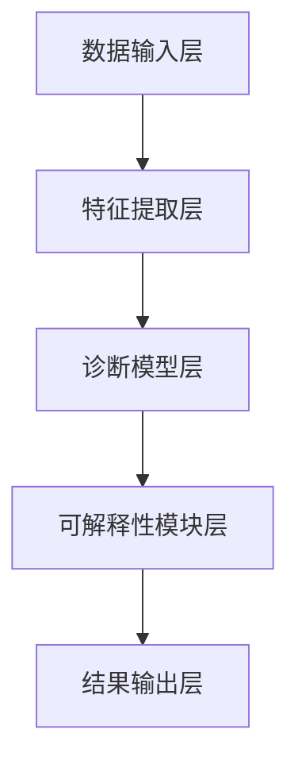

# AI在智能医疗影像辅助诊断中的可解释性应用与创新

> 关键词：AI、智能医疗影像、辅助诊断、可解释性、应用创新

> 摘要：本文聚焦于AI在智能医疗影像辅助诊断中的可解释性应用与创新。首先介绍了相关背景，包括目的范围、预期读者等内容。接着阐述了核心概念与联系，深入剖析了AI在医疗影像领域的原理与架构。详细讲解了核心算法原理及具体操作步骤，并给出数学模型和公式进行理论支撑。通过项目实战展示了代码实现与解读，探讨了实际应用场景。同时推荐了相关的工具和资源，最后总结了未来发展趋势与挑战，还提供了常见问题解答和扩展阅读参考资料，旨在全面深入地研究AI在智能医疗影像辅助诊断中可解释性的重要意义与应用前景。

## 1. 背景介绍 
### 1.1 目的和范围
随着人工智能技术的飞速发展，其在医疗领域的应用越来越广泛，尤其是在智能医疗影像辅助诊断方面取得了显著的成果。然而，目前很多AI模型在医疗影像诊断中被视为“黑箱”，缺乏可解释性，这限制了其在临床实践中的广泛应用。本文章的目的在于深入探讨AI在智能医疗影像辅助诊断中的可解释性问题，分析其原理、方法和应用场景，旨在为提高AI模型在医疗影像诊断中的可信度和实用性提供理论和实践依据。

本文章的范围涵盖了AI在智能医疗影像辅助诊断中可解释性的各个方面，包括核心概念、算法原理、数学模型、项目实战、实际应用场景以及未来发展趋势等。通过对这些内容的全面研究，希望能够为相关领域的研究人员、医生和开发者提供有价值的参考。

### 1.2 预期读者
本文的预期读者主要包括以下几类人群：
1. **医疗领域的专业人员**：如医生、医学影像专家等，他们希望了解AI在智能医疗影像辅助诊断中的可解释性，以便更好地应用这些技术来辅助临床诊断，提高诊断的准确性和效率。
2. **人工智能领域的研究人员和开发者**：他们对AI在医疗领域的应用感兴趣，希望深入研究AI在智能医疗影像辅助诊断中可解释性的算法和技术，为进一步的研究和开发提供思路。
3. **医疗行业的管理人员和决策者**：他们需要了解AI在智能医疗影像辅助诊断中的可解释性对医疗行业的影响，以便制定相关的政策和决策，推动AI技术在医疗领域的合理应用。
4. **对智能医疗影像和AI技术感兴趣的普通读者**：他们希望通过阅读本文，了解AI在智能医疗影像辅助诊断中的基本原理和应用前景，拓宽自己的知识面。

### 1.3 文档结构概述
本文的结构如下：
1. **背景介绍**：介绍文章的目的和范围、预期读者、文档结构概述以及相关术语表。
2. **核心概念与联系**：阐述AI在智能医疗影像辅助诊断中可解释性的核心概念、原理和架构，并给出相应的文本示意图和Mermaid流程图。
3. **核心算法原理 & 具体操作步骤**：详细讲解AI在智能医疗影像辅助诊断中可解释性的核心算法原理，并使用Python源代码进行详细阐述。
4. **数学模型和公式 & 详细讲解 & 举例说明**：给出AI在智能医疗影像辅助诊断中可解释性的数学模型和公式，并进行详细讲解和举例说明。
5. **项目实战：代码实际案例和详细解释说明**：通过项目实战展示AI在智能医疗影像辅助诊断中可解释性的代码实现和详细解释说明，包括开发环境搭建、源代码详细实现和代码解读等内容。
6. **实际应用场景**：探讨AI在智能医疗影像辅助诊断中可解释性的实际应用场景，分析其优势和挑战。
7. **工具和资源推荐**：推荐相关的学习资源、开发工具框架和论文著作，为读者提供进一步学习和研究的参考。
8. **总结：未来发展趋势与挑战**：总结AI在智能医疗影像辅助诊断中可解释性的未来发展趋势和挑战，为相关领域的研究和应用提供展望。
9. **附录：常见问题与解答**：提供常见问题的解答，帮助读者更好地理解本文的内容。
10. **扩展阅读 & 参考资料**：提供扩展阅读的建议和相关的参考资料，方便读者进一步深入研究。

### 1.4 术语表
#### 1.4.1 核心术语定义
1. **AI（Artificial Intelligence）**：人工智能，是指计算机系统能够执行通常需要人类智能才能完成的任务的能力，如学习、推理、解决问题等。
2. **智能医疗影像**：利用计算机技术和人工智能算法对医疗影像（如X光、CT、MRI等）进行处理、分析和诊断的技术。
3. **辅助诊断**：借助计算机系统或其他工具来帮助医生进行疾病诊断的过程。
4. **可解释性**：指AI模型能够以人类可理解的方式解释其决策过程和结果的能力。
5. **医疗影像诊断**：医生通过对医疗影像的观察和分析，判断患者是否患有疾病以及疾病的类型和程度的过程。

#### 1.4.2 相关概念解释
1. **黑箱模型**：指那些输入和输出之间的关系不明确，难以理解其内部工作原理的模型。在AI领域，很多深度学习模型被视为黑箱模型，因为它们的决策过程很难被解释。
2. **白箱模型**：与黑箱模型相对，白箱模型的内部结构和工作原理是透明的，可以被人类理解和解释。
3. **特征重要性**：在机器学习模型中，特征重要性是指每个特征对模型预测结果的影响程度。了解特征重要性有助于解释模型的决策过程。
4. **决策树**：一种基于树结构进行决策的机器学习模型，其决策过程可以很容易地被解释。
5. **深度学习**：一种基于神经网络的机器学习方法，在图像识别、自然语言处理等领域取得了巨大的成功，但由于其模型结构复杂，往往缺乏可解释性。

#### 1.4.3 缩略词列表
1. **AI**：Artificial Intelligence（人工智能）
2. **CT**：Computed Tomography（计算机断层扫描）
3. **MRI**：Magnetic Resonance Imaging（磁共振成像）
4. **CNN**：Convolutional Neural Network（卷积神经网络）
5. **LIME**：Local Interpretable Model - agnostic Explanations（局部可解释模型无关解释）

## 2. 核心概念与联系 
### 2.1 核心概念原理
AI在智能医疗影像辅助诊断中的可解释性是指能够以一种清晰、易懂的方式解释AI模型在医疗影像诊断过程中的决策依据和推理过程。这对于提高医生对AI诊断结果的信任度、促进AI技术在临床实践中的应用具有重要意义。

其核心原理在于打破AI模型的“黑箱”特性，将模型的决策过程转化为人类可理解的信息。例如，通过分析模型所关注的影像特征、特征的重要性以及特征之间的相互关系，来解释模型为什么做出这样的诊断结果。

### 2.2 架构示意图
#### 文本示意图
AI在智能医疗影像辅助诊断中的可解释性架构主要包括以下几个部分：
1. **数据输入层**：接收医疗影像数据，如X光、CT、MRI等。这些数据是AI模型进行诊断的基础。
2. **特征提取层**：对输入的医疗影像数据进行特征提取，将图像数据转化为计算机能够处理的特征向量。这一步骤通常使用卷积神经网络（CNN）等深度学习模型来完成。
3. **诊断模型层**：基于提取的特征进行疾病诊断，输出诊断结果。诊断模型可以是各种机器学习模型，如神经网络、决策树等。
4. **可解释性模块层**：对诊断模型的决策过程进行解释，输出可解释的信息。可解释性模块可以采用不同的方法，如特征重要性分析、决策树可视化等。
5. **结果输出层**：将诊断结果和可解释性信息输出给医生或其他用户，辅助他们进行临床决策。

#### Mermaid流程图


### 2.3 各部分联系
数据输入层为整个架构提供了原始的医疗影像数据，是后续处理的基础。特征提取层将这些图像数据转化为特征向量，为诊断模型层提供了可处理的信息。诊断模型层基于这些特征进行疾病诊断，输出诊断结果。可解释性模块层对诊断模型的决策过程进行解释，使得诊断结果更具可信度。最后，结果输出层将诊断结果和可解释性信息输出给用户，实现了AI在智能医疗影像辅助诊断中的可解释性应用。

## 3. 核心算法原理 & 具体操作步骤 
### 3.1 核心算法原理
在AI在智能医疗影像辅助诊断中，可解释性的核心算法有多种，这里以LIME（Local Interpretable Model - agnostic Explanations）算法为例进行讲解。

LIME算法的核心思想是在局部范围内对复杂的黑箱模型进行线性近似，从而得到一个可解释的局部模型。具体来说，LIME算法通过对输入的医疗影像数据进行扰动，生成一系列的扰动样本，并计算这些样本的预测结果。然后，使用线性回归模型对这些扰动样本和预测结果进行拟合，得到一个局部线性模型。这个局部线性模型的系数可以用来解释黑箱模型在该局部区域的决策过程。

### 3.2 Python源代码详细阐述
```python
import numpy as np
import sklearn
from sklearn.linear_model import LinearRegression
from sklearn.metrics import mean_squared_error
import lime
from lime import lime_image
from skimage.segmentation import mark_boundaries
import matplotlib.pyplot as plt

# 假设我们有一个训练好的医疗影像分类模型 model
# 这里简单模拟一个模型
def model_predict(image):
    # 模拟预测结果
    return np.random.rand(1, 2)

# 加载医疗影像数据
image = np.random.rand(224, 224, 3)

# 创建 LIME 解释器
explainer = lime_image.LimeImageExplainer()

# 解释模型的预测结果
explanation = explainer.explain_instance(image, model_predict, top_labels=1, hide_color=0, num_samples=1000)

# 获取解释结果
temp, mask = explanation.get_image_and_mask(explanation.top_labels[0], positive_only=True, num_features=5, hide_rest=True)

# 可视化解释结果
plt.imshow(mark_boundaries(temp / 2 + 0.5, mask))
plt.show()
```

### 3.3 具体操作步骤
1. **数据准备**：收集和整理医疗影像数据，并进行预处理，如归一化、裁剪等。
2. **模型训练**：使用预处理后的数据训练一个医疗影像分类模型。可以使用各种深度学习模型，如CNN等。
3. **创建LIME解释器**：使用`lime_image.LimeImageExplainer()`创建一个LIME解释器。
4. **解释模型预测结果**：使用解释器的`explain_instance`方法对输入的医疗影像数据进行解释，得到解释结果。
5. **可视化解释结果**：使用`get_image_and_mask`方法获取解释结果的可视化数据，并使用`matplotlib`库进行可视化展示。

## 4. 数学模型和公式 & 详细讲解 & 举例说明 
### 4.1 数学模型
LIME算法的数学模型可以表示为：

设 $f$ 是一个复杂的黑箱模型，$x$ 是输入的医疗影像数据，$g$ 是一个局部可解释的线性模型。LIME算法的目标是在 $x$ 的局部邻域内找到一个线性模型 $g$，使得 $g$ 尽可能地逼近 $f$。

具体来说，LIME算法通过最小化以下损失函数来找到 $g$：

$$\xi(g,f,x)=\omega_x(z) \cdot (f(z) - g(z))^2$$

其中，$z$ 是在 $x$ 的局部邻域内生成的扰动样本，$\omega_x(z)$ 是样本 $z$ 相对于 $x$ 的权重，通常使用核函数来计算。

### 4.2 详细讲解
- **扰动样本生成**：LIME算法通过对输入的医疗影像数据 $x$ 进行随机扰动，生成一系列的扰动样本 $z$。这些扰动样本可以是对图像的部分区域进行遮挡、修改像素值等操作得到的。
- **权重计算**：权重 $\omega_x(z)$ 用于衡量样本 $z$ 与输入样本 $x$ 的相似度。通常使用高斯核函数来计算权重，即：

$$\omega_x(z)=\exp\left(-\frac{\|x - z\|^2}{\sigma^2}\right)$$

其中，$\sigma$ 是高斯核函数的带宽参数。

- **线性模型拟合**：使用生成的扰动样本 $z$ 和对应的预测结果 $f(z)$，通过最小化损失函数 $\xi(g,f,x)$ 来拟合一个线性模型 $g$。线性模型 $g$ 的系数可以用来解释黑箱模型 $f$ 在 $x$ 的局部邻域内的决策过程。

### 4.3 举例说明
假设我们有一个医疗影像分类模型 $f$，用于判断一张X光片是否患有肺炎。输入的X光片数据为 $x$，我们使用LIME算法对 $f(x)$ 的预测结果进行解释。

1. **扰动样本生成**：对输入的X光片 $x$ 进行随机遮挡，生成一系列的扰动样本 $z_1, z_2, \cdots, z_n$。
2. **权重计算**：计算每个扰动样本 $z_i$ 相对于 $x$ 的权重 $\omega_x(z_i)$。
3. **线性模型拟合**：使用扰动样本 $z_i$ 和对应的预测结果 $f(z_i)$，拟合一个线性模型 $g$。假设线性模型 $g$ 的系数为 $\beta_1, \beta_2, \cdots, \beta_m$，这些系数表示每个特征对模型预测结果的影响程度。例如，如果某个特征的系数 $\beta_j$ 很大，说明该特征对模型判断是否患有肺炎的影响很大。

通过这种方式，我们可以解释模型 $f$ 在输入X光片 $x$ 上的决策过程，提高模型的可解释性。

## 5. 项目实战：代码实际案例和详细解释说明 
### 5.1 开发环境搭建
1. **操作系统**：推荐使用Ubuntu 18.04或更高版本的Linux系统，也可以使用Windows 10或macOS系统。
2. **Python环境**：安装Python 3.7或更高版本。可以使用Anaconda来管理Python环境，具体安装步骤如下：
    - 从Anaconda官网下载适合自己操作系统的Anaconda安装包。
    - 运行安装包，按照提示进行安装。
    - 安装完成后，打开终端（Linux或macOS）或Anaconda Prompt（Windows），输入以下命令创建一个新的Python环境：
```bash
conda create -n medical_image python=3.8
conda activate medical_image
```
3. **安装依赖库**：在创建的Python环境中，安装以下依赖库：
```bash
pip install numpy scikit-learn matplotlib lime pillow torch torchvision
```
其中，`numpy` 和 `scikit-learn` 用于数据处理和机器学习，`matplotlib` 用于可视化，`lime` 用于可解释性分析，`pillow` 用于图像处理，`torch` 和 `torchvision` 用于深度学习模型的训练和推理。

### 5.2 源代码详细实现和代码解读
以下是一个完整的项目实战代码示例，用于对肺部X光片进行疾病分类并使用LIME算法进行可解释性分析。

```python
import numpy as np
import torch
import torch.nn as nn
import torch.optim as optim
from torchvision import datasets, transforms
from torch.utils.data import DataLoader
import matplotlib.pyplot as plt
from lime import lime_image
from skimage.segmentation import mark_boundaries

# 定义一个简单的卷积神经网络模型
class SimpleCNN(nn.Module):
    def __init__(self):
        super(SimpleCNN, self).__init__()
        self.conv1 = nn.Conv2d(1, 16, kernel_size=3, padding=1)
        self.relu1 = nn.ReLU()
        self.pool1 = nn.MaxPool2d(2)
        self.conv2 = nn.Conv2d(16, 32, kernel_size=3, padding=1)
        self.relu2 = nn.ReLU()
        self.pool2 = nn.MaxPool2d(2)
        self.fc1 = nn.Linear(32 * 56 * 56, 128)
        self.relu3 = nn.ReLU()
        self.fc2 = nn.Linear(128, 2)

    def forward(self, x):
        x = self.pool1(self.relu1(self.conv1(x)))
        x = self.pool2(self.relu2(self.conv2(x)))
        x = x.view(-1, 32 * 56 * 56)
        x = self.relu3(self.fc1(x))
        x = self.fc2(x)
        return x

# 数据预处理
transform = transforms.Compose([
    transforms.Resize((224, 224)),
    transforms.Grayscale(),
    transforms.ToTensor(),
    transforms.Normalize((0.5,), (0.5,))
])

# 加载数据集
train_dataset = datasets.ImageFolder(root='path/to/train_data', transform=transform)
train_loader = DataLoader(train_dataset, batch_size=32, shuffle=True)

# 初始化模型、损失函数和优化器
model = SimpleCNN()
criterion = nn.CrossEntropyLoss()
optimizer = optim.Adam(model.parameters(), lr=0.001)

# 训练模型
num_epochs = 10
for epoch in range(num_epochs):
    running_loss = 0.0
    for i, (images, labels) in enumerate(train_loader):
        optimizer.zero_grad()
        outputs = model(images)
        loss = criterion(outputs, labels)
        loss.backward()
        optimizer.step()
        running_loss += loss.item()
    print(f'Epoch {epoch + 1}, Loss: {running_loss / len(train_loader)}')

# 定义一个预测函数，用于LIME解释器
def predict_fn(images):
    images = torch.from_numpy(images).permute(0, 3, 1, 2).float()
    with torch.no_grad():
        outputs = model(images)
        probabilities = torch.softmax(outputs, dim=1).numpy()
    return probabilities

# 加载一张测试图像
test_image = plt.imread('path/to/test_image.jpg')
test_image = transform(Image.fromarray(test_image)).unsqueeze(0).numpy()

# 创建LIME解释器
explainer = lime_image.LimeImageExplainer()

# 解释模型的预测结果
explanation = explainer.explain_instance(test_image[0].transpose(1, 2, 0), predict_fn, top_labels=1, hide_color=0, num_samples=1000)

# 获取解释结果
temp, mask = explanation.get_image_and_mask(explanation.top_labels[0], positive_only=True, num_features=5, hide_rest=True)

# 可视化解释结果
plt.imshow(mark_boundaries(temp / 2 + 0.5, mask))
plt.show()
```

### 5.3 代码解读与分析
1. **模型定义**：`SimpleCNN` 类定义了一个简单的卷积神经网络模型，用于对肺部X光片进行疾病分类。模型包含两个卷积层、两个池化层和两个全连接层。
2. **数据预处理**：使用 `transforms.Compose` 定义了一系列的数据预处理操作，包括调整图像大小、转换为灰度图、转换为张量和归一化。
3. **数据集加载**：使用 `datasets.ImageFolder` 加载训练数据集，并使用 `DataLoader` 进行批量加载。
4. **模型训练**：使用交叉熵损失函数和Adam优化器对模型进行训练，训练10个epoch。
5. **预测函数定义**：`predict_fn` 函数用于将输入的图像数据转换为模型可以处理的格式，并返回模型的预测概率。
6. **LIME解释**：使用 `lime_image.LimeImageExplainer` 创建一个LIME解释器，并使用 `explain_instance` 方法对测试图像的预测结果进行解释。
7. **可视化解释结果**：使用 `get_image_and_mask` 方法获取解释结果的可视化数据，并使用 `matplotlib` 库进行可视化展示。

通过这个项目实战，我们可以看到如何使用深度学习模型对医疗影像进行分类，并使用LIME算法对模型的预测结果进行解释，提高模型的可解释性。

## 6. 实际应用场景 
### 6.1 疾病筛查
在疾病筛查阶段，AI在智能医疗影像辅助诊断中的可解释性可以帮助医生快速、准确地筛选出可能患有疾病的患者。例如，在肺癌筛查中，AI模型可以对大量的肺部CT影像进行快速分析，标记出可能存在病变的区域，并通过可解释性方法解释为什么这些区域被认为是可疑的。医生可以根据这些解释信息，进一步对患者进行详细的检查和诊断，提高筛查的效率和准确性。

### 6.2 疾病诊断
在疾病诊断过程中，AI模型的可解释性可以为医生提供更多的诊断依据。例如，在乳腺癌诊断中，AI模型可以对乳腺X光片或MRI影像进行分析，给出是否患有乳腺癌的诊断结果，并解释模型是基于哪些影像特征做出的判断。医生可以结合这些解释信息和自己的临床经验，做出更准确的诊断决策。

### 6.3 治疗方案制定
AI在智能医疗影像辅助诊断中的可解释性还可以帮助医生制定更个性化的治疗方案。例如，在肿瘤治疗中，AI模型可以对肿瘤的影像特征进行分析，预测肿瘤的生长速度、转移风险等，并解释这些预测结果的依据。医生可以根据这些信息，为患者制定更合适的治疗方案，提高治疗效果。

### 6.4 医学研究
在医学研究领域，AI模型的可解释性可以帮助研究人员深入了解疾病的发病机制和病理特征。例如，通过分析AI模型在医疗影像诊断中所关注的特征，可以发现一些新的疾病标志物或病理特征，为医学研究提供新的思路和方向。

## 7. 工具和资源推荐
### 7.1 学习资源推荐
#### 7.1.1 书籍推荐
1. 《深度学习》（Deep Learning）：由Ian Goodfellow、Yoshua Bengio和Aaron Courville所著，是深度学习领域的经典教材，全面介绍了深度学习的基本原理、算法和应用。
2. 《Python机器学习》（Python Machine Learning）：由Sebastian Raschka所著，详细介绍了Python在机器学习中的应用，包括数据处理、模型训练、评估等方面的内容。
3. 《医学图像处理》（Medical Image Processing）：由Richard A. Robb所著，系统介绍了医学图像处理的基本原理、方法和应用，对于理解智能医疗影像辅助诊断技术有很大帮助。

#### 7.1.2 在线课程
1. Coursera上的“深度学习专项课程”（Deep Learning Specialization）：由Andrew Ng教授主讲，包括五门课程，全面介绍了深度学习的各个方面，是学习深度学习的优质资源。
2. edX上的“人工智能基础”（Introduction to Artificial Intelligence）：由麻省理工学院（MIT）的Patrick Winston教授主讲，介绍了人工智能的基本概念、算法和应用，适合初学者学习。
3. 中国大学MOOC上的“医学图像处理与分析”：由国内知名高校的教授主讲，介绍了医学图像处理的基本原理、方法和应用，对于了解智能医疗影像辅助诊断技术有很大帮助。

#### 7.1.3 技术博客和网站
1. Medium：是一个技术博客平台，上面有很多关于AI、机器学习、医学图像处理等领域的优质文章，可以及时了解最新的技术动态和研究成果。
2. arXiv：是一个预印本数据库，上面有很多关于AI、机器学习、医学图像处理等领域的最新研究论文，可以及时了解最新的研究进展。
3. Kaggle：是一个数据科学竞赛平台，上面有很多关于医疗影像分析的竞赛项目和数据集，可以通过参与竞赛来提高自己的技术水平。

### 7.2 开发工具框架推荐
#### 7.2.1 IDE和编辑器
1. PyCharm：是一款专门为Python开发设计的集成开发环境（IDE），具有强大的代码编辑、调试、版本控制等功能，适合开发Python项目。
2. Jupyter Notebook：是一个交互式的开发环境，可以在浏览器中编写和运行Python代码，同时还可以添加文本说明、可视化图表等，适合进行数据分析和模型开发。
3. Visual Studio Code：是一款轻量级的代码编辑器，支持多种编程语言和插件扩展，具有丰富的功能和良好的用户体验，适合快速开发和调试代码。

#### 7.2.2 调试和性能分析工具
1. PyTorch Profiler：是PyTorch框架自带的性能分析工具，可以帮助开发者分析模型的运行时间、内存使用情况等，优化模型性能。
2. TensorBoard：是TensorFlow框架自带的可视化工具，可以帮助开发者可视化模型的训练过程、损失函数曲线、模型结构等，方便调试和优化模型。
3. cProfile：是Python标准库中的性能分析工具，可以帮助开发者分析Python代码的运行时间和函数调用情况，找出性能瓶颈。

#### 7.2.3 相关框架和库
1. PyTorch：是一个开源的深度学习框架，具有动态图、易于使用等优点，广泛应用于图像识别、自然语言处理等领域。
2. TensorFlow：是一个开源的深度学习框架，具有强大的分布式训练、模型部署等功能，广泛应用于工业界和学术界。
3. scikit-learn：是一个开源的机器学习库，提供了丰富的机器学习算法和工具，如分类、回归、聚类等，适合初学者学习和使用。
4. OpenCV：是一个开源的计算机视觉库，提供了丰富的图像处理和计算机视觉算法，如图像滤波、特征提取、目标检测等，适合进行医疗影像处理和分析。

### 7.3 相关论文著作推荐
#### 7.3.1 经典论文
1. “Deep Residual Learning for Image Recognition”（Kaiming He等，2015）：提出了残差网络（ResNet），解决了深度学习中梯度消失和梯度爆炸的问题，大大提高了模型的训练效率和性能。
2. “ImageNet Classification with Deep Convolutional Neural Networks”（Alex Krizhevsky等，2012）：提出了AlexNet，开创了深度学习在图像识别领域的先河，标志着深度学习时代的到来。
3. “Interpretable Machine Learning for Healthcare: Methods, Applications and Challenges”（Sameer Singh等，2019）：全面介绍了可解释机器学习在医疗领域的应用、方法和挑战，为该领域的研究提供了重要的参考。

#### 7.3.2 最新研究成果
1. “Explainable AI in Medical Imaging: A Survey”（Anurag K. Sahu等，2021）：对AI在医疗影像领域的可解释性研究进行了全面的综述，介绍了各种可解释性方法和技术，并分析了其优缺点和应用场景。
2. “LIME: Explaining the Predictions of Any Classifier”（Marco Tulio Ribeiro等，2016）：提出了LIME算法，是一种局部可解释模型无关解释方法，为AI模型的可解释性研究提供了重要的思路和方法。
3. “Grad-CAM: Visual Explanations from Deep Networks via Gradient-based Localization”（Ramprasaath R. Selvaraju等，2017）：提出了Grad - CAM算法，通过计算梯度信息来可视化卷积神经网络的决策过程，为AI模型的可解释性研究提供了一种有效的方法。

#### 7.3.3 应用案例分析
1. “AI-Assisted Diagnosis of COVID - 19 from Chest CT Scans: A Multicenter Study”（Qi Dou等，2020）：介绍了AI在COVID - 19胸部CT影像诊断中的应用案例，分析了AI模型的诊断性能和可解释性，为AI在疫情防控中的应用提供了重要的参考。
2. “Deep Learning for Breast Cancer Screening on Digital Mammograms: A Large - Scale, Multi - Reader, Multi - Case Study”（Ehteshami Bejnordi等，2017）：介绍了AI在乳腺癌筛查中的应用案例，分析了AI模型的诊断性能和可解释性，为AI在乳腺癌筛查中的应用提供了重要的参考。
3. “Interpretability of Deep Learning Models in Medical Imaging: A Case Study on Skin Lesion Classification”（Gianluca Antichi等，2020）：介绍了AI在皮肤病变分类中的应用案例，分析了深度学习模型的可解释性方法和技术，为AI在皮肤病变诊断中的应用提供了重要的参考。

## 8. 总结：未来发展趋势与挑战
### 8.1 未来发展趋势
1. **多模态融合**：未来的AI在智能医疗影像辅助诊断中，将不仅仅依赖于单一的影像模态（如X光、CT、MRI等），而是会融合多种影像模态以及其他临床信息（如病历、实验室检查结果等），提高诊断的准确性和可靠性。同时，可解释性方法也需要适应多模态数据的特点，提供更全面、准确的解释信息。
2. **个性化医疗**：随着精准医学的发展，AI在智能医疗影像辅助诊断中将更加注重个性化医疗。AI模型将根据患者的个体特征（如基因信息、生活习惯等）进行个性化的诊断和治疗方案推荐。可解释性方法也需要能够解释这些个性化决策的依据，帮助医生更好地理解和应用这些方案。
3. **可解释性技术的不断创新**：为了满足临床应用的需求，未来将会不断涌现出更加高效、准确、易于理解的可解释性技术。例如，结合知识图谱、因果推理等技术，提高AI模型的可解释性和可信度。
4. **与临床实践的深度融合**：AI在智能医疗影像辅助诊断中的可解释性应用将更加紧密地与临床实践相结合。未来的AI系统将不仅仅是提供诊断结果和解释信息，还将能够与医生进行交互，根据医生的反馈不断优化模型，提高临床应用的效果。

### 8.2 挑战
1. **数据质量和隐私问题**：医疗影像数据的质量和隐私是AI在智能医疗影像辅助诊断中面临的重要挑战。数据质量的参差不齐可能会影响AI模型的训练和诊断性能，而医疗数据的隐私问题则需要严格的保护措施。同时，可解释性方法也需要在保护数据隐私的前提下进行，这增加了技术实现的难度。
2. **可解释性与模型性能的平衡**：在提高AI模型可解释性的同时，往往会牺牲一定的模型性能。如何在可解释性和模型性能之间找到一个平衡点，是未来研究需要解决的重要问题。
3. **临床医生的接受度**：虽然AI在智能医疗影像辅助诊断中的可解释性应用可以为医生提供更多的诊断依据，但临床医生对AI技术的接受度仍然是一个挑战。医生需要时间来理解和信任这些可解释性信息，如何提高医生对AI技术的接受度和使用意愿，是推广AI在医疗领域应用的关键。
4. **法律法规和伦理问题**：AI在智能医疗影像辅助诊断中的应用涉及到一系列的法律法规和伦理问题，如责任认定、数据安全、患者权益保护等。如何制定相应的法律法规和伦理准则，规范AI技术的应用，是未来需要解决的重要问题。

## 9. 附录：常见问题与解答
### 9.1 什么是AI在智能医疗影像辅助诊断中的可解释性？
AI在智能医疗影像辅助诊断中的可解释性是指能够以一种清晰、易懂的方式解释AI模型在医疗影像诊断过程中的决策依据和推理过程。这对于提高医生对AI诊断结果的信任度、促进AI技术在临床实践中的应用具有重要意义。

### 9.2 为什么AI在智能医疗影像辅助诊断中需要可解释性？
AI在智能医疗影像辅助诊断中需要可解释性的原因主要有以下几点：
1. **提高医生信任度**：医生在临床诊断中需要对诊断结果有充分的信任，可解释性可以帮助医生理解AI模型的决策过程，从而提高对诊断结果的信任度。
2. **辅助临床决策**：可解释性信息可以为医生提供更多的诊断依据，帮助医生做出更准确的临床决策。
3. **发现潜在问题**：通过解释AI模型的决策过程，可以发现模型中可能存在的问题，如误判、过拟合等，从而对模型进行优化和改进。
4. **符合法律法规和伦理要求**：在医疗领域，法律法规和伦理要求对诊断结果的解释和透明度有一定的要求，可解释性可以满足这些要求。

### 9.3 有哪些常见的可解释性方法？
常见的可解释性方法包括：
1. **特征重要性分析**：分析每个特征对模型预测结果的影响程度，了解哪些特征对模型的决策起关键作用。
2. **决策树可视化**：决策树模型的决策过程可以很容易地被可视化，通过查看决策树的结构和节点信息，可以理解模型的决策逻辑。
3. **LIME算法**：通过在局部范围内对复杂的黑箱模型进行线性近似，得到一个可解释的局部模型，从而解释模型的决策过程。
4. **Grad - CAM算法**：通过计算梯度信息来可视化卷积神经网络的决策过程，找出模型在图像中关注的区域。

### 9.4 可解释性方法会影响AI模型的性能吗？
一般来说，可解释性方法可能会对AI模型的性能产生一定的影响。例如，一些可解释性方法需要对模型进行简化或近似，这可能会导致模型的准确性有所下降。但是，通过合理选择可解释性方法和优化模型结构，可以在一定程度上平衡可解释性和模型性能之间的关系。

### 9.5 如何提高临床医生对AI在智能医疗影像辅助诊断中可解释性应用的接受度？
提高临床医生对AI在智能医疗影像辅助诊断中可解释性应用的接受度可以从以下几个方面入手：
1. **加强培训和教育**：为临床医生提供相关的培训和教育，让他们了解AI技术的原理、优势和局限性，以及可解释性方法的作用和意义。
2. **提供实用的工具和界面**：开发简单易用、直观的可解释性工具和界面，让医生能够方便地获取和理解可解释性信息。
3. **开展临床验证和评估**：通过大规模的临床验证和评估，证明AI在智能医疗影像辅助诊断中可解释性应用的有效性和可靠性，提高医生对其的信任度。
4. **加强沟通和合作**：加强AI研究人员和临床医生之间的沟通和合作，了解医生的需求和反馈，不断优化可解释性方法和应用。

## 10. 扩展阅读 & 参考资料
### 10.1 扩展阅读
1. 《人工智能时代的医疗革命》：深入探讨了AI技术在医疗领域的应用和发展趋势，以及对医疗行业的影响。
2. 《可解释的人工智能》：全面介绍了可解释人工智能的基本概念、方法和应用，对于深入理解AI在智能医疗影像辅助诊断中可解释性问题有很大帮助。
3. 《医学人工智能》：介绍了医学人工智能的各个方面，包括医疗影像分析、疾病诊断、治疗方案制定等，是了解AI在医疗领域应用的重要参考书籍。

### 10.2 参考资料
1. Goodfellow, I., Bengio, Y., & Courville, A. (2016). Deep Learning. MIT Press.
2. Raschka, S. (2015). Python Machine Learning. Packt Publishing.
3. Robb, R. A. (2000). Medical Image Processing. CRC Press.
4. Ribeiro, M. T., Singh, S., & Guestrin, C. (2016). “Why Should I Trust You?” Explaining the Predictions of Any Classifier. Proceedings of the 22nd ACM SIGKDD International Conference on Knowledge Discovery and Data Mining.
5. Selvaraju, R. R., Cogswell, M., Das, A., Vedantam, R., Parikh, D., & Batra, D. (2017). Grad - CAM: Visual Explanations from Deep Networks via Gradient - based Localization. Proceedings of the IEEE International Conference on Computer Vision.
6. Sahu, A. K., Pati, S., & Dehghan, M. (2021). Explainable AI in Medical Imaging: A Survey. arXiv preprint arXiv:2104.00955.