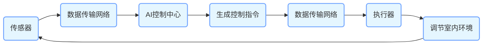

# AI在智能建筑室内环境优化中的多参数控制应用

> 关键词：AI、智能建筑、室内环境优化、多参数控制、传感器技术

> 摘要：本文围绕AI在智能建筑室内环境优化中的多参数控制应用展开深入探讨。首先介绍了智能建筑室内环境优化的背景和重要性，阐述了相关的核心概念与联系，包括AI技术、多参数控制等原理及架构。详细讲解了核心算法原理和具体操作步骤，结合数学模型和公式进行理论分析，并通过实际案例展示了AI在智能建筑中的应用过程。探讨了其实际应用场景，推荐了相关的工具和资源。最后总结了未来发展趋势与挑战，为该领域的研究和实践提供了全面且深入的参考，旨在推动AI在智能建筑室内环境优化中的更广泛应用和发展。

## 1. 背景介绍 
### 1.1 目的和范围
智能建筑的兴起是建筑行业发展的重要趋势，其核心目标之一是为用户提供舒适、健康且高效的室内环境。随着人们对室内环境质量要求的不断提高，传统的建筑环境控制方式已难以满足需求。本研究的目的在于探讨AI技术在智能建筑室内环境优化中的多参数控制应用，通过对温度、湿度、光照、空气质量等多个参数的综合控制，实现室内环境的精准调节和优化。

研究范围涵盖了AI技术在智能建筑室内环境控制中的基本原理、算法实现、实际应用案例以及相关的工具和资源等方面。旨在为智能建筑领域的研究者、工程师和从业者提供全面的技术参考和实践指导。

### 1.2 预期读者
本文预期读者包括智能建筑领域的专业人士，如建筑设计师、工程师、系统集成商等；从事AI技术研究和应用的科研人员；以及对智能建筑和室内环境优化感兴趣的相关行业从业者和爱好者。

### 1.3 文档结构概述
本文将按照以下结构进行阐述：首先介绍相关背景知识，包括目的、预期读者和文档结构概述等；接着阐述核心概念与联系，包括AI、多参数控制等原理和架构；详细讲解核心算法原理和具体操作步骤，并结合数学模型和公式进行理论分析；通过实际案例展示AI在智能建筑中的应用过程；探讨其实际应用场景；推荐相关的工具和资源；最后总结未来发展趋势与挑战，并提供常见问题解答和扩展阅读参考资料。

### 1.4 术语表
#### 1.4.1 核心术语定义
- **智能建筑**：将建筑技术、信息技术、自动化技术等多种技术有机结合，实现建筑系统的智能化管理和控制，以提供安全、舒适、高效的建筑环境。
- **AI（人工智能）**：研究、开发用于模拟、延伸和扩展人的智能的理论、方法、技术及应用系统的一门新的技术科学。
- **多参数控制**：对多个相互关联的参数进行综合调节和控制，以实现系统的最优性能。
- **室内环境优化**：通过对室内温度、湿度、光照、空气质量等参数的调节和控制，使室内环境达到舒适、健康、高效的状态。

#### 1.4.2 相关概念解释
- **传感器技术**：用于检测和测量室内环境参数的技术，如温度传感器、湿度传感器、光照传感器、空气质量传感器等。
- **执行器技术**：根据控制指令对室内环境进行调节的设备，如空调、加湿器、通风设备、照明设备等。
- **数据采集与传输**：通过传感器采集室内环境参数数据，并将其传输到控制中心进行处理和分析。
- **数据分析与决策**：对采集到的数据进行分析和处理，根据预设的规则和算法做出控制决策。

#### 1.4.3 缩略词列表
- **AI**：Artificial Intelligence（人工智能）
- **IoT**：Internet of Things（物联网）
- **HVAC**：Heating, Ventilation and Air Conditioning（供暖、通风和空调系统）

## 2. 核心概念与联系 
### 2.1 AI技术在智能建筑中的应用原理
AI技术在智能建筑中的应用主要基于数据驱动的方法。通过分布在建筑内的各种传感器实时采集室内环境参数数据，如温度、湿度、光照强度、空气质量等。这些数据被传输到控制中心，AI算法对其进行分析和处理。

AI算法可以根据历史数据和实时数据建立室内环境模型，预测环境参数的变化趋势。同时，结合用户的需求和预设的优化目标，如舒适度、能源效率等，生成最优的控制策略。控制指令通过网络传输到执行器，如空调、通风设备、照明系统等，实现对室内环境的精准调节。

### 2.2 多参数控制的原理和架构
多参数控制是指同时对多个相互关联的室内环境参数进行调节和控制。其原理是通过建立多参数之间的数学模型，分析它们之间的相互影响和耦合关系。在控制过程中，综合考虑各个参数的变化情况，以实现整体的优化目标。

多参数控制的架构通常包括传感器层、数据传输层、控制中心层和执行器层。传感器层负责采集室内环境参数数据；数据传输层将采集到的数据传输到控制中心；控制中心层对数据进行分析和处理，生成控制指令；执行器层根据控制指令对室内环境进行调节。

### 2.3 核心概念的联系
AI技术和多参数控制在智能建筑室内环境优化中是相互关联、相互促进的。AI技术为多参数控制提供了强大的数据分析和决策能力，能够处理复杂的多参数关系，实现更精准的控制。多参数控制则为AI技术提供了应用场景和数据来源，通过对多个参数的综合控制，使AI技术能够更好地发挥作用，实现室内环境的优化。

### 2.4 文本示意图
智能建筑室内环境优化的AI多参数控制系统主要由传感器、数据传输网络、AI控制中心和执行器组成。传感器负责采集室内环境的多参数数据，如温度、湿度、光照、空气质量等。这些数据通过数据传输网络传输到AI控制中心。AI控制中心对数据进行分析和处理，结合预设的优化目标和算法，生成控制指令。控制指令通过数据传输网络发送到执行器，执行器对室内环境进行调节，如调节空调、通风设备、照明系统等。调节后的室内环境状态再次被传感器采集，形成一个闭环的控制系统。

### 2.5 Mermaid流程图


## 3. 核心算法原理 & 具体操作步骤 
### 3.1 核心算法原理
在智能建筑室内环境优化的多参数控制中，常用的AI算法包括机器学习算法和深度学习算法。这里以机器学习中的神经网络算法为例进行讲解。

神经网络算法是一种模仿人类神经系统的计算模型，由输入层、隐藏层和输出层组成。在智能建筑室内环境控制中，输入层接收传感器采集的多参数数据，如温度、湿度、光照强度、空气质量等。隐藏层对输入数据进行非线性变换和特征提取。输出层输出控制指令，如空调的设定温度、通风设备的风速、照明设备的亮度等。

神经网络算法通过训练来调整网络的权重和偏置，使其能够根据输入数据准确地预测输出结果。训练数据通常包括历史的传感器数据和对应的控制指令。在训练过程中，神经网络算法不断调整权重和偏置，以最小化预测结果与实际结果之间的误差。

### 3.2 Python源代码实现
```python
import numpy as np
import tensorflow as tf
from tensorflow.keras.models import Sequential
from tensorflow.keras.layers import Dense

# 生成示例数据
# 假设输入数据为温度、湿度、光照强度、空气质量四个参数
# 输出数据为空调设定温度、通风设备风速、照明设备亮度三个控制指令
input_data = np.random.rand(1000, 4)  # 1000个样本，每个样本有4个特征
output_data = np.random.rand(1000, 3)  # 1000个样本，每个样本有3个输出

# 构建神经网络模型
model = Sequential([
    Dense(64, activation='relu', input_shape=(4,)),  # 输入层到第一个隐藏层
    Dense(32, activation='relu'),  # 第一个隐藏层到第二个隐藏层
    Dense(3, activation='linear')  # 输出层
])

# 编译模型
model.compile(optimizer='adam', loss='mse')

# 训练模型
model.fit(input_data, output_data, epochs=100, batch_size=32)

# 使用训练好的模型进行预测
new_input = np.random.rand(1, 4)
predicted_output = model.predict(new_input)
print("预测的控制指令：", predicted_output)
```

### 3.3 具体操作步骤
1. **数据采集**：使用传感器采集室内环境的多参数数据，如温度、湿度、光照强度、空气质量等。将采集到的数据进行预处理，包括数据清洗、归一化等操作，以提高数据的质量和可用性。
2. **数据划分**：将采集到的数据划分为训练集、验证集和测试集。训练集用于训练神经网络模型，验证集用于调整模型的超参数，测试集用于评估模型的性能。
3. **模型构建**：使用Python和深度学习框架（如TensorFlow、PyTorch等）构建神经网络模型。根据输入数据的维度和输出数据的维度确定模型的结构，包括输入层、隐藏层和输出层的神经元数量。
4. **模型训练**：使用训练集对神经网络模型进行训练。在训练过程中，不断调整模型的权重和偏置，以最小化预测结果与实际结果之间的误差。可以使用验证集来监控模型的训练过程，防止过拟合。
5. **模型评估**：使用测试集对训练好的模型进行评估。计算模型的性能指标，如均方误差（MSE）、平均绝对误差（MAE）等，评估模型的准确性和泛化能力。
6. **模型部署**：将训练好的模型部署到智能建筑的控制中心。实时接收传感器采集的数据，使用模型进行预测，生成控制指令，并将控制指令发送到执行器，实现对室内环境的实时控制。

## 4. 数学模型和公式 & 详细讲解 & 举例说明 
### 4.1 神经网络的数学模型
神经网络的基本数学模型可以表示为一个多层的非线性映射。对于一个具有 $L$ 层的神经网络，第 $l$ 层的输出 $a^{(l)}$ 可以通过以下公式计算：

$$z^{(l)} = W^{(l)}a^{(l - 1)} + b^{(l)}$$
$$a^{(l)} = f(z^{(l)})$$

其中，$W^{(l)}$ 是第 $l$ 层的权重矩阵，$b^{(l)}$ 是第 $l$ 层的偏置向量，$f$ 是激活函数。激活函数的作用是引入非线性因素，使神经网络能够学习复杂的非线性关系。常见的激活函数包括Sigmoid函数、ReLU函数等。

### 4.2 损失函数
在神经网络的训练过程中，需要定义一个损失函数来衡量预测结果与实际结果之间的误差。常用的损失函数包括均方误差（MSE）和交叉熵损失函数等。对于回归问题，通常使用均方误差作为损失函数，其公式为：

$$MSE = \frac{1}{n}\sum_{i = 1}^{n}(y_i - \hat{y}_i)^2$$

其中，$n$ 是样本数量，$y_i$ 是实际结果，$\hat{y}_i$ 是预测结果。

### 4.3 优化算法
为了最小化损失函数，需要使用优化算法来调整神经网络的权重和偏置。常见的优化算法包括随机梯度下降（SGD）、Adam优化算法等。以Adam优化算法为例，其更新公式为：

$$m_{t} = \beta_1m_{t - 1}+(1 - \beta_1)g_{t}$$
$$v_{t} = \beta_2v_{t - 1}+(1 - \beta_2)g_{t}^2$$
$$\hat{m}_{t}=\frac{m_{t}}{1 - \beta_1^t}$$
$$\hat{v}_{t}=\frac{v_{t}}{1 - \beta_2^t}$$
$$\theta_{t}=\theta_{t - 1}-\frac{\alpha}{\sqrt{\hat{v}_{t}}+\epsilon}\hat{m}_{t}$$

其中，$m_t$ 和 $v_t$ 分别是一阶矩估计和二阶矩估计，$\beta_1$ 和 $\beta_2$ 是衰减率，$g_t$ 是梯度，$\alpha$ 是学习率，$\epsilon$ 是一个小的常数，$\theta_t$ 是权重和偏置。

### 4.4 举例说明
假设我们有一个简单的神经网络，输入层有2个神经元，隐藏层有3个神经元，输出层有1个神经元。输入数据为 $x = [x_1, x_2]$，隐藏层的权重矩阵 $W^{(1)}$ 为：

$$W^{(1)}=\begin{bmatrix}
w_{11}^{(1)} & w_{12}^{(1)}\\
w_{21}^{(1)} & w_{22}^{(1)}\\
w_{31}^{(1)} & w_{32}^{(1)}
\end{bmatrix}$$

隐藏层的偏置向量 $b^{(1)}$ 为：

$$b^{(1)}=\begin{bmatrix}
b_1^{(1)}\\
b_2^{(1)}\\
b_3^{(1)}
\end{bmatrix}$$

输出层的权重矩阵 $W^{(2)}$ 为：

$$W^{(2)}=\begin{bmatrix}
w_{11}^{(2)} & w_{12}^{(2)} & w_{13}^{(2)}
\end{bmatrix}$$

输出层的偏置向量 $b^{(2)}$ 为：

$$b^{(2)}=[b_1^{(2)}]$$

首先计算隐藏层的输入 $z^{(1)}$：

$$z^{(1)} = W^{(1)}x + b^{(1)}$$

然后使用激活函数（如ReLU函数）计算隐藏层的输出 $a^{(1)}$：

$$a^{(1)} = f(z^{(1)})$$

接着计算输出层的输入 $z^{(2)}$：

$$z^{(2)} = W^{(2)}a^{(1)} + b^{(2)}$$

最后计算输出层的输出 $a^{(2)}$：

$$a^{(2)} = f(z^{(2)})$$

## 5. 项目实战：代码实际案例和详细解释说明 
### 5.1  开发环境搭建
#### 5.1.1 硬件环境
- **传感器**：选择合适的传感器来采集室内环境参数，如温度传感器（如DHT11、DS18B20）、湿度传感器、光照传感器、空气质量传感器等。
- **控制设备**：包括空调、通风设备、照明设备等，这些设备需要支持远程控制功能。
- **开发板**：可以选择树莓派、Arduino等开发板作为数据采集和控制的核心设备。

#### 5.1.2 软件环境
- **操作系统**：在开发板上安装合适的操作系统，如Raspbian（树莓派）、Arduino IDE（Arduino）等。
- **开发语言**：使用Python作为主要的开发语言，因为Python具有丰富的库和工具，适合进行数据分析和机器学习。
- **深度学习框架**：安装TensorFlow或PyTorch等深度学习框架，用于构建和训练神经网络模型。

### 5.2  源代码详细实现和代码解读
```python
import time
import Adafruit_DHT  # 用于读取DHT11传感器数据
import RPi.GPIO as GPIO  # 用于控制树莓派的GPIO引脚
import numpy as np
import tensorflow as tf
from tensorflow.keras.models import load_model

# 初始化传感器和GPIO
DHT_SENSOR = Adafruit_DHT.DHT11
DHT_PIN = 4
GPIO.setmode(GPIO.BCM)
LED_PIN = 17
GPIO.setup(LED_PIN, GPIO.OUT)

# 加载训练好的模型
model = load_model('indoor_environment_model.h5')

while True:
    # 读取传感器数据
    humidity, temperature = Adafruit_DHT.read(DHT_SENSOR, DHT_PIN)
    if humidity is not None and temperature is not None:
        # 模拟光照强度和空气质量数据
        light_intensity = np.random.randint(0, 1000)
        air_quality = np.random.randint(0, 100)
        
        # 准备输入数据
        input_data = np.array([[temperature, humidity, light_intensity, air_quality]])
        
        # 使用模型进行预测
        predicted_output = model.predict(input_data)
        
        # 解析预测结果
        air_conditioning_setpoint = predicted_output[0][0]
        ventilation_speed = predicted_output[0][1]
        light_brightness = predicted_output[0][2]
        
        # 控制LED灯模拟照明控制
        if light_brightness > 50:
            GPIO.output(LED_PIN, GPIO.HIGH)
        else:
            GPIO.output(LED_PIN, GPIO.LOW)
        
        print(f"温度: {temperature}°C, 湿度: {humidity}%, 光照强度: {light_intensity}, 空气质量: {air_quality}")
        print(f"空调设定温度: {air_conditioning_setpoint}°C, 通风设备风速: {ventilation_speed}, 照明设备亮度: {light_brightness}")
    else:
        print("无法读取传感器数据")
    
    time.sleep(5)  # 每隔5秒读取一次数据
```

### 5.3  代码解读与分析
1. **传感器数据读取**：使用 `Adafruit_DHT` 库读取DHT11传感器的温度和湿度数据。同时，模拟光照强度和空气质量数据。
2. **模型加载**：使用 `load_model` 函数加载训练好的神经网络模型。
3. **数据预处理**：将读取到的传感器数据整理成输入数据的格式，作为模型的输入。
4. **模型预测**：使用加载的模型对输入数据进行预测，得到空调设定温度、通风设备风速和照明设备亮度等控制指令。
5. **控制执行**：根据预测结果控制LED灯的开关，模拟照明设备的控制。
6. **循环读取**：使用 `while True` 循环每隔5秒读取一次传感器数据，实现实时监测和控制。

## 6. 实际应用场景 
### 6.1 商业办公建筑
在商业办公建筑中，AI在智能建筑室内环境优化的多参数控制应用可以为员工提供舒适的工作环境，提高工作效率。通过实时监测室内温度、湿度、光照强度和空气质量等参数，AI系统可以自动调节空调、通风设备和照明系统，使室内环境保持在最佳状态。例如，当室内人员较多时，自动增加通风量，改善空气质量；当光线不足时，自动调节照明亮度，提高工作舒适度。

### 6.2 医院建筑
医院建筑对室内环境的要求非常高，需要保证患者和医护人员的健康和安全。AI多参数控制可以对医院的病房、手术室、药房等不同区域的环境参数进行精准控制。例如，在手术室中，严格控制温度、湿度和空气质量，防止感染；在病房中，根据患者的需求调节光照强度和温度，提高患者的舒适度。

### 6.3 学校建筑
学校建筑需要为学生和教师提供良好的学习和教学环境。AI多参数控制可以根据教室的使用情况和人员数量，自动调节室内环境参数。例如，在上课期间，保持适宜的温度和湿度，提供充足的光照；在课间休息时，增加通风量，改善空气质量。

### 6.4 住宅建筑
在住宅建筑中，AI多参数控制可以实现个性化的室内环境调节。用户可以通过手机APP等方式远程控制室内的温度、湿度、光照和空气质量等参数。例如，在用户回家前，提前调节好室内温度和湿度，为用户提供舒适的居住环境。

## 7. 工具和资源推荐
### 7.1 学习资源推荐
#### 7.1.1 书籍推荐
- 《人工智能：一种现代的方法》：全面介绍了人工智能的基本概念、算法和应用，是人工智能领域的经典教材。
- 《Python深度学习》：详细介绍了使用Python和深度学习框架进行深度学习开发的方法和技巧。
- 《智能建筑概论》：系统介绍了智能建筑的基本概念、技术和应用，对智能建筑领域的学习有很大的帮助。

#### 7.1.2 在线课程
- Coursera上的“人工智能基础”课程：由知名高校的教授授课，系统介绍了人工智能的基本概念和算法。
- edX上的“深度学习基础”课程：深入讲解了深度学习的原理和应用，通过实践项目帮助学生掌握深度学习的开发技能。
- 中国大学MOOC上的“智能建筑技术”课程：介绍了智能建筑的相关技术和应用案例，适合对智能建筑感兴趣的学习者。

#### 7.1.3 技术博客和网站
- 机器之心：提供人工智能领域的最新技术动态和研究成果，是了解人工智能发展趋势的重要渠道。
- 开源中国：提供丰富的开源项目和技术文章，涵盖了智能建筑、人工智能等多个领域。
- 中国智能建筑网：专注于智能建筑领域的资讯和技术交流，提供智能建筑的最新动态和应用案例。

### 7.2 开发工具框架推荐
#### 7.2.1 IDE和编辑器
- PyCharm：一款专业的Python集成开发环境，提供丰富的代码编辑、调试和分析功能，适合Python开发。
- Visual Studio Code：一款轻量级的代码编辑器，支持多种编程语言，具有丰富的插件扩展功能，适合快速开发。
- Arduino IDE：专门用于Arduino开发的集成开发环境，提供简单易用的开发界面和丰富的库函数。

#### 7.2.2 调试和性能分析工具
- TensorBoard：TensorFlow的可视化工具，用于可视化神经网络的训练过程和性能指标，帮助开发者调试和优化模型。
- PyTorch Profiler：PyTorch的性能分析工具，用于分析模型的性能瓶颈，优化模型的运行效率。
- Raspberry Pi Monitor：用于监控树莓派的系统资源使用情况，如CPU、内存、磁盘等，帮助开发者优化树莓派的性能。

#### 7.2.3 相关框架和库
- TensorFlow：一个开源的深度学习框架，提供丰富的深度学习模型和工具，支持多种硬件平台。
- PyTorch：另一个开源的深度学习框架，具有简洁易用的API和动态图机制，适合快速开发和研究。
- Scikit-learn：一个用于机器学习的Python库，提供丰富的机器学习算法和工具，适合进行数据预处理、模型选择和评估等任务。

### 7.3 相关论文著作推荐
#### 7.3.1 经典论文
- “Artificial Intelligence: A Modern Approach”：人工智能领域的经典论文，系统介绍了人工智能的基本概念、算法和应用。
- “Deep Learning”：深度学习领域的经典论文，详细介绍了深度学习的原理和应用。
- “Intelligent Building Technology and Applications”：智能建筑领域的经典论文，介绍了智能建筑的相关技术和应用案例。

#### 7.3.2 最新研究成果
- 定期关注IEEE Transactions on Smart Grid、Building and Environment等期刊，了解智能建筑和人工智能领域的最新研究成果。
- 参加国际智能建筑会议（ISBS）、人工智能与模式识别会议（CVPR）等学术会议，获取最新的研究动态和前沿技术。

#### 7.3.3 应用案例分析
- 参考一些实际的智能建筑项目案例，了解AI在智能建筑室内环境优化中的多参数控制应用的实际效果和经验教训。例如，某商业办公建筑通过引入AI多参数控制系统，实现了能源消耗降低20%，室内舒适度提高30%的效果。

## 8. 总结：未来发展趋势与挑战
### 8.1 未来发展趋势
- **集成化和智能化**：未来的智能建筑室内环境优化系统将更加集成化和智能化。AI技术将与物联网、大数据、云计算等技术深度融合，实现对建筑内各种设备和系统的全面感知、智能决策和自动控制。
- **个性化和定制化**：随着人们对生活品质要求的提高，智能建筑室内环境优化将更加注重个性化和定制化。用户可以根据自己的需求和偏好，定制个性化的室内环境模式，如睡眠模式、工作模式、娱乐模式等。
- **绿色和可持续发展**：绿色和可持续发展是未来建筑发展的重要方向。AI在智能建筑室内环境优化中的应用将更加注重能源效率和环境保护，通过优化控制策略，降低能源消耗，减少对环境的影响。
- **人机协作**：未来的智能建筑室内环境优化系统将实现人机协作。AI系统可以根据用户的行为和反馈，自动调整控制策略，同时用户也可以通过手机APP等方式对系统进行手动控制，实现更加灵活和便捷的操作。

### 8.2 挑战
- **数据安全和隐私**：智能建筑室内环境优化系统需要采集大量的用户数据和建筑设备数据，这些数据涉及用户的隐私和建筑的安全。因此，如何保障数据的安全和隐私是一个重要的挑战。
- **算法复杂度和计算资源**：AI算法通常具有较高的复杂度，需要大量的计算资源。在智能建筑的实际应用中，如何在有限的计算资源下实现高效的算法是一个挑战。
- **系统兼容性和互操作性**：智能建筑中涉及多种不同的设备和系统，如何保证这些设备和系统之间的兼容性和互操作性是一个挑战。不同厂商的设备和系统可能采用不同的通信协议和接口标准，需要进行统一和整合。
- **标准和规范**：目前，智能建筑领域还缺乏统一的标准和规范。这导致不同厂商的产品和系统之间存在差异，影响了智能建筑的推广和应用。因此，制定统一的标准和规范是智能建筑发展的迫切需求。

## 9. 附录：常见问题与解答
### 9.1 如何选择合适的传感器？
选择合适的传感器需要考虑以下因素：
- **测量参数**：根据需要测量的室内环境参数，选择相应的传感器，如温度传感器、湿度传感器、光照传感器、空气质量传感器等。
- **测量精度**：根据实际需求选择合适的测量精度，一般来说，精度越高的传感器价格也越高。
- **可靠性和稳定性**：选择可靠性和稳定性高的传感器，以保证长期稳定的测量。
- **通信接口**：根据系统的通信需求，选择具有合适通信接口的传感器，如串口、I2C、SPI等。

### 9.2 如何解决数据传输的稳定性问题？
- **选择合适的通信方式**：根据实际情况选择合适的通信方式，如有线通信（以太网、RS485等）或无线通信（Wi-Fi、蓝牙、ZigBee等）。
- **增加信号强度**：如果使用无线通信，可通过增加无线信号强度、优化天线位置等方式提高信号的稳定性。
- **数据冗余和纠错**：采用数据冗余和纠错技术，如CRC校验、重传机制等，确保数据传输的准确性。

### 9.3 如何提高AI模型的准确性？
- **增加训练数据**：收集更多的训练数据，提高数据的多样性和代表性，有助于提高模型的准确性。
- **优化模型结构**：根据问题的特点和数据的分布，选择合适的模型结构，如调整神经网络的层数、神经元数量等。
- **调整超参数**：通过交叉验证等方法，调整模型的超参数，如学习率、批量大小、训练轮数等，以找到最优的模型参数。
- **模型融合**：将多个不同的模型进行融合，综合它们的预测结果，提高模型的准确性和稳定性。

### 9.4 如何保障系统的安全性？
- **数据加密**：对采集到的数据和传输的数据进行加密处理，防止数据泄露和篡改。
- **访问控制**：设置严格的访问控制策略，限制对系统的访问权限，只有授权的用户才能访问和操作系统。
- **安全审计**：对系统的操作和访问进行审计，及时发现和处理安全事件。
- **定期更新**：定期更新系统的软件和固件，修复安全漏洞，提高系统的安全性。

## 10. 扩展阅读 & 参考资料
### 10.1 扩展阅读
- 《物联网技术与应用》：深入介绍了物联网的相关技术和应用，对于理解智能建筑中的物联网应用有很大的帮助。
- 《大数据分析与应用》：介绍了大数据分析的方法和技术，对于处理智能建筑中的大量数据有重要的指导意义。
- 《机器学习实战》：通过实际案例介绍了机器学习的应用，有助于读者更好地掌握机器学习算法的实现和应用。

### 10.2 参考资料
- 相关的国家标准和行业规范，如《智能建筑设计标准》、《建筑智能化系统工程设计规范》等。
- 各传感器、控制设备和开发板厂商的产品说明书和技术文档。
- 相关的学术论文和研究报告，可通过学术数据库（如IEEE Xplore、ACM Digital Library等）获取。